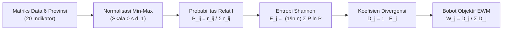

# Fakta Data: Pembobotan Objektif Shannon Entropy (EWM) & Bobot 20 Indikator D3TLH 6 Provinsi

> **Tanggal:** 2026-09-03  
> **Status:** Tervalidasi & Terintegrasi ke Model D3TLH ✅  
> **Dasar Ilmiah:** *Nature Scientific Reports* (Sun et al., 2024) — Model Hybrid Z-Score & Entropy Weight Method (EWM)  
> **Cakupan Wilayah:** 6 Provinsi Se-Pulau Sulawesi (Sulteng, Sultra, Sulsel, Sulbar, Gorontalo, Sulut)

---

## Pertanyaan Utama

> *"Dari mana datangnya angka persentase bobot pada indikator seperti Limbah B3 (8,29%), Residu Tailing (8,22%), Korban Konflik Agraria (7,81%), dan Kapasitas PLTU Batubara (7,73%)? Seberapa besar angka 8% tersebut dibanding indikator lainnya, dan apa dampak praktisnya terhadap hasil akhir penilaian status ekologis provinsi?"*

---

## 1. Patokan Dasar: Berapa Angka "Normal" Bobot Indikator?

Dalam evaluasi Daya Dukung dan Daya Tampung Lingkungan Hidup (D3TLH) tingkat provinsi, terdapat **20 indikator riset empiris terverifikasi** yang mencakup 5 dimensi pilar (Udara, Air, Lahan, Sosial, dan Veto Perizinan). Total akumulasi seluruh bobot indikator wajib berjumlah **100%**.

- **Jika seluruh indikator dianggap sama pentingnya (dibagi rata / *equal weighting*):**  
  $$\text{Bobot Rata-rata Normal} = \frac{100\%}{20 \text{ Indikator}} = \mathbf{5{,}00\%} \text{ per indikator}$$
- **Konteks Skala Angka 8%:**
  - Angka **8,29% (Limbah B3)** adalah **Peringkat #1 Tertinggi** dari seluruh 20 indikator yang dinilai (hampir **1,7x lipat** di atas rata-rata normal).
  - Bandingkan dengan indikator peringkat terbawah: **Morbiditas Diare (1,64%)**, **Polusi Gas NO2 Satelit (2,24%)**, dan **Kualitas Air IKA (2,62%)**.
  - **Artinya:** Pengaruh 1 indikator Limbah B3 (8,29%) memiliki kekuatan analitis **5 kali lipat lebih besar** dibandingkan 1 indikator Diare (1,64%).

---

## 2. Fakta Data Lapangan yang Memicu Ketimpangan Ekstrem

Angka persentase bobot ini **BUKAN ditentukan oleh selera atau asumsi subjektif peneliti**, melainkan **dihitung secara murni dari derajat ketimpangan data riil di lapangan** (*data-driven objective weighting*).

Berikut adalah data mentah yang mendasari mengapa 4 indikator teratas memiliki bobot raksasa:

### Tabel 1: Perbandingan Data Riil 4 Indikator Ekstrem Lintas 6 Provinsi
| Indikator Riset | Sulawesi Tengah | Sulawesi Tenggara | Sulawesi Selatan | Sulawesi Barat | Gorontalo | Sulawesi Utara | Tingkat Ketimpangan Lapangan |
| :--- | :---: | :---: | :---: | :---: | :---: | :---: | :--- |
| **Limbah B3 Industri** | **25,3 Jt Ton** | 6,5 Jt Ton | 1,0 Jt Ton | 0,0 Jt Ton | 0,0 Jt Ton | 0,0 Jt Ton | **76,9% limbah B3 menumpuk hanya di Sulteng** |
| **Residu Tailing & Slag** | **24,5 Jt Ton** | 3,8 Jt Ton | 1,2 Jt Ton | 0,0 Jt Ton | 0,0 Jt Ton | 0,0 Jt Ton | **83,1% tailing dam menumpuk di Sulteng** |
| **Korban Konflik Agraria** | 12.450 Jiwa | **39.821 Jiwa** | 2.100 Jiwa | 0 Jiwa | 0 Jiwa | 0 Jiwa | **73,2% korban agraria terkonsentrasi di Sultra** |
| **PLTU Captive Batubara** | **7.325 MW** | 1.840 MW | 660 MW | 0 MW | 0 MW | 0 MW | **74,5% cerobong captive terpusat di Sulteng** |

> **Temuan Kunci:**  
> Pada 4 indikator di atas, beban kerusakan terkonsentrasi secara brutal di 1–2 provinsi episentrum hilirisasi nikel (Sulteng dan Sultra), sementara provinsi agromaritim (Sulbar, Gorontalo, Sulut) bernilai **0 (nol)**. Rumus matematis Entropi Shannon secara otomatis mengenali ketimpangan ekstrem ini dan memberikan bobot terbesar pada indikator-indikator tersebut.

---

## 3. Matriks Lengkap Peringkat Bobot 20 Indikator EWM

Berdasarkan formulasi dispersi informasi Shannon, seluruh 20 indikator terdistribusi ke dalam tiga tingkatan hierarki bobot:

### Tabel 2: Rekapitulasi Bobot Objektif 20 Indikator Empiris (EWM Shannon)
| Rank | Dimensi | Indikator Riset | Nilai Entropi ($E_j$) | Divergensi ($D_j = 1 - E_j$) | Bobot EWM ($W_j$) | Kategori & Karakteristik Data |
| :---: | :---: | :--- | :---: | :---: | :---: | :--- |
| **1** | Pilar Udara | **Proporsi Limbah B3 Industri** | **0,3509** | **0,6491** | **8,29%** | **KELOMPOK RAKSASA (TOP 4)** Ketimpangan sangat ekstrem; beban menumpuk brutal hanya di 1–2 provinsi sentra smelter nikel. Keempat indikator ini menyita **~32% (hampir sepertiga)** dari total bobot evaluasi seluruh pulau. |
| **2** | Pilar Air | **Akumulasi Residu Tailing & Slag** | **0,3557** | **0,6443** | **8,22%** |
| **3** | Pilar Sosial | **Korban Konflik Agraria (Jiwa)** | **0,3882** | **0,6118** | **7,81%** |
| **4** | Pilar Udara | **Kapasitas PLTU Captive Batubara** | **0,3948** | **0,6052** | **7,73%** |
| 5 | Pilar Sosial | Pelanggaran Konsultasi Warga FPIC | 0,5028 | 0,4972 | 6,35% | **KELOMPOK MENENGAH** Variasi data lintas provinsi cukup jelas dan signifikan di sekitar angka rata-rata normal (3% s.d. 6%). |
| 6 | Pilar Veto | Korporasi Tambang Ilegal Beroperasi | 0,6298 | 0,3702 | 4,73% |
| 7 | Pilar Udara | Morbiditas Klinis ISPA (IRR) | 0,6388 | 0,3612 | 4,61% |
| 8 | Pilar Air | Konflik Ruang Laut Nelayan | 0,6541 | 0,3459 | 4,42% |
| 9 | Pilar Sosial | Defisit Kelayakan Faskes ASPAK SPA | 0,6632 | 0,3368 | 4,30% |
| 10 | Pilar Veto | Obral Perizinan IUP Baru Pasca-2014 | 0,6750 | 0,3250 | 4,15% |
| 11 | Pilar Udara | Pelepasan Emisi Karbon Deforestasi | 0,6907 | 0,3093 | 3,95% |
| 12 | Pilar Lahan | Perambahan Hutan Lindung Tambang | 0,6931 | 0,3069 | 3,92% |
| 13 | Pilar Lahan | Deforestasi Komoditas Tambang & Sawit | 0,7173 | 0,2827 | 3,61% |
| 14 | Pilar Lahan | Deforestasi Hutan Alam Primer GFW | 0,7292 | 0,2708 | 3,46% |
| 15 | Pilar Sosial | Kriminalisasi Warga & Pembela HAM | 0,7409 | 0,2591 | 3,31% |
| 16 | Pilar Lahan | Kepadatan Rasio Konsesi IUP Tambang | 0,7494 | 0,2506 | 3,20% |
| 17 | Pilar Lahan | Kejadian Bencana Hidrometeorologi | 0,7878 | 0,2122 | 2,71% | **KELOMPOK KERDIL (BAWAH)** Data tersebar relatif merata di seluruh 6 provinsi (variasi antar-provinsi rendah), sehingga rumus EWM otomatis mengecilkan bobot analitisnya. |
| 18 | Pilar Air | Mutu Air Sungai (Indeks Kualitas Air) | 0,7945 | 0,2055 | 2,62% |
| 19 | Pilar Udara | Konsentrasi NO2 Troposferik Satelit | 0,8244 | 0,1756 | 2,24% |
| **20** | Pilar Air | **Morbiditas Klinis Diare (IRR)** | **0,8712** | **0,1288** | **1,64%** |
| - | **TOTAL** | **20 Indikator Empiris Terverifikasi** | - | **7,8331** | **100,0%** | **Total Bobot Komposit Universal** |

---

## 4. Logika Matematis Entropi Informasi Shannon

Prinsip kerja Entropy Weight Method (EWM) bekerja secara otomatis melalui 5 tahap komputasi:

1. **Normalisasi Min-Max ($r_{ij}$):** Mengubah data mentah (ton, MW, jiwa, hektar) ke dalam skala seragam 0 hingga 1.
2. **Proporsi Probabilitas ($P_{ij}$):** Menghitung porsi kontribusi masing-masing provinsi terhadap total nilai indikator.
3. **Entropi Shannon ($E_j$):** Mengukur derajat keteraturan distribusi data ($n=6$ provinsi, $\ln(6) = 1{,}7917$).
   - Jika nilai indikator tersebar merata di 6 provinsi $\rightarrow$ $E_j \to 1{,}0$ (entropi tinggi).
   - Jika nilai indikator terkonsentrasi hanya di 1 provinsi $\rightarrow$ $E_j \approx 0{,}35$ (entropi rendah).
4. **Derajat Ketimpangan Informasi ($D_j = 1 - E_j$):** Semakin rendah entropi, semakin tinggi divergensi informasinya.
5. **Normalisasi Bobot Final ($W_j$):** 
   $$W_j = \frac{D_j}{\sum_{k=1}^{20} D_k}$$
   *Contoh untuk Limbah B3:* $W_{B3} = \frac{0{,}6491}{7{,}8331} = 0{,}08287 \approx \mathbf{8{,}29\%}$.

---

## 5. Dampak Praktis (Impact) Terhadap Analisis Kebijakan

Penerapan bobot EWM memberikan tiga dampak fundamental bagi validitas audit lingkungan:

1. **Mengunci Status Red Alert di Episentrum Tambang (Sulteng & Sultra):**
   - Karena Limbah B3 (8,29%) dan PLTU (7,73%) memiliki bobot yang sangat besar, saat Sulawesi Tengah mendapatkan Skor 5,0 di indikator-indikator ini, skor pilar Udara dan Komposit-nya **langsung terseret naik ke zona merah (4,0 / 5,0 — Melampaui Batas)**.
   - Kerusakan masif di Morowali tidak bisa "ditutupi" atau diperbaiki oleh indikator lain yang nilainya masih sedang.
2. **Menghilangkan Bias Perataan (*Anti-Dilution Bias*) Dokumen Pemerintah:**
   - Pemerintah sering menggunakan teknik perataan pulau: jutaan ton limbah industri dibagi dengan total luas daratan Pulau Sulawesi, sehingga tampak seolah-olah pulau masih aman dan lestari.
   - Dengan model EWM, variabel pencemar utama diberi bobot **4 hingga 5 kali lipat lebih berat**, sehingga borok kehancuran lingkungan di zona pengorbanan (*sacrifice zones*) tetap menyala terang dan terbongkar secara ilmiah.
3. **Melindungi Resiliensi Provinsi Non-Smelter (Gorontalo, Sulbar, Sulut):**
   - Provinsi agromaritim yang tidak memiliki PLTU batubara dan limbah B3 langsung menikmati skor 0 di indikator-indikator berbobot berat ini.
   - Hasilnya, skor komposit Gorontalo (1,2 / 5,0) dan Sulawesi Barat (1,2 / 5,0) terbukti secara kuantitatif berada dalam status **Tidak Melampaui Batas (Terjaga)**, membantah narasi bahwa seluruh Sulawesi harus dipenuhi kawasan industri tambang untuk bertahan hidup.
