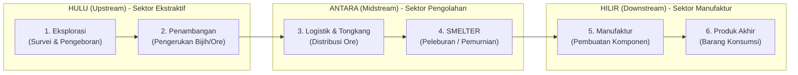

# Fakta Data IUP (Izin Usaha Pertambangan) Sulawesi

Berikut adalah rincian lengkap dari seluruh 778 Izin Usaha Pertambangan (IUP) yang tercatat dalam dataset (`sulawesi_esdm_nikel.csv`), dipecah berdasarkan komoditasnya. Data ini membuktikan bahwa angka 778 bukanlah jumlah fasilitas smelter nikel, melainkan gabungan dari berbagai jenis tambang (termasuk pasir, aspal, dan batu gamping).

| Komoditas Tambang | Jumlah Perusahaan (IUP) |
| :--- | :--- |
| **Nikel** | **304** |
| Batu Gunung Quarry Besar | 96 |
| Batu Gamping | 87 |
| Kerikil Berpasir Alami (Sirtu) | 71 |
| Batu Gamping untuk Industri | 36 |
| Pasir | 25 |
| Batuan Aspal | 22 |
| Emas | 20 |
| Pasir Kuarsa | 18 |
| Andesit | 16 |
| Tanah Urug | 14 |
| *(Data Kosong / Tidak Tercatat)* | 11 |
| Batuan | 9 |
| Peridotit | 5 |
| Besi | 4 |
| Diorit | 3 |
| Galena | 3 |
| Marmer | 3 |
| Tras | 3 |
| Tembaga | 3 |
| Granodiorit | 2 |
| Mangan | 2 |
| Batu Gamping untuk Industri; Clay | 2 |
| **Batu Gamping; Nikel** | **1** |
| Besi; Emas; Tembaga | 1 |
| Batubara | 1 |
| Timbal | 1 |
| Kromit | 1 |
| *(Berbagai jenis batuan/mineral minor lainnya)* | 15 |
| **TOTAL KESELURUHAN** | **778** |

*(Catatan: 15 komoditas minor di baris terakhir adalah komoditas dengan masing-masing 1 izin, seperti Basalt, Pasir Laut, Kuarsit, Molibdenum, Grafit, dan gabungan-gabungan tanah urug lainnya).*

---

## Rantai Pasok (Supply Chain) Industri Tambang Nikel

Proses dari tanah kotor hingga menjadi barang mewah ini sering disebut sebagai **Rantai Pasok (Supply Chain)** atau **Hilirisasi**. 

Berikut adalah gambaran *pipeline* industri tambang nikel dari **Hulu (Upstream)** ke **Hilir (Downstream)**:

### 🟢 1. Fase HULU (Upstream)
Ini adalah area kekuasaan para pemegang **IUP (Izin Usaha Pertambangan)**. Data 778 Unit yang kita bahas di atas seluruhnya berada di kotak hijau ini (HULU / Tukang Gali), padahal sering disalahartikan seolah-olah mereka adalah kotak oranye (ANTARA / Pabrik Smelter).
*   **Tahap 1: Eksplorasi.** Tim ahli geologi masuk ke hutan, membawa bor untuk mencari tahu di mana tanah yang mengandung logam nikel (karena tidak semua tanah ada nikelnya).
*   **Tahap 2: Penambangan.** Hutan ditebang, gunung dikeruk menggunakan *excavator*. Hasil pengerukannya masih berupa tanah kemerahan kotor yang disebut **Bijih Nikel Mentah (Nickel Ore)**.
*   *Dampak Utama:* Hutan gundul (deforestasi) dan air sungai/laut keruh berwarna merah muda akibat sedimen tanah yang hanyut.

### 🟠 2. Fase ANTARA (Midstream / Tempat Smelter Berada)
Ini adalah area perbatasan tempat ore kotor mulai diolah. Di sinilah **Fasilitas Smelter** berada.
*   **Tahap 3: Logistik.** Tanah merah tadi diangkut pakai *dump truck* ke pelabuhan, lalu dipindahkan ke kapal tongkang (*barge*) menuju pabrik Smelter.
*   **Tahap 4: Smelter (Peleburan).** Tanah merah itu dipanggang/dimasak di dalam oven raksasa (*furnace*) dengan suhu ribuan derajat. Untuk memanaskan oven ini butuh listrik sangat masif, karenanya mereka biasanya membangun PLTU Batu Bara (*Captive Power Plant*) sendiri di sebelahnya. Hasil dari dapur ini adalah logam setengah jadi seperti:
    *   *NPI / Ferronickel* (Balok logam paduan besi-nikel).
    *   *MHP* (Serbuk nikel untuk baterai listrik).
*   *Dampak Utama:* Polusi asap hitam dari PLTU, debu beracun, dan limbah ampas sisa pembakaran yang panas.

### 🔵 3. Fase HILIR (Downstream)
Ini adalah area manufaktur modern di mana logam setengah jadi tadi diubah menjadi barang yang kita pakai sehari-hari.
*   **Tahap 5: Manufaktur.** Logam balok (*Ferronickel*) tadi dilebur lagi untuk dicampur dengan bahan lain agar menjadi lempengan baja anti karat (*Stainless Steel*). Sedangkan serbuk MHP diproses menjadi sel-sel Baterai Lithium.
*   **Tahap 6: Produk Akhir.** Baja anti karat dipotong dan dibentuk menjadi sendok, panci, atau kerangka mesin. Baterai dirakit dan dimasukkan ke dalam bodi mobil listrik (EV) atau *smartphone*.

---

## Fakta Eskalasi Izin Baru (2014 - 2024)

Untuk memvalidasi angka **574 IUP Baru** dalam satu dekade terakhir di Sulawesi, berikut adalah rincian agregasi tahunan dan provinsi dari dataset `sulawesi_izin_baru_per_tahun.csv` (Sumber: Minerbaone).

### 1. Rincian Penambahan Izin Per Tahun (Seluruh Sulawesi)
Angka ini menunjukkan tren penerbitan izin yang melonjak tajam mulai dari tahun 2020 hingga puncaknya di 2024.

|   Tahun |   Jumlah Izin Baru |
|--------:|-------------------:|
|    2014 |                 26 |
|    2015 |                  5 |
|    2016 |                  9 |
|    2017 |                 26 |
|    2018 |                 23 |
|    2019 |                 17 |
|    2020 |                 28 |
|    2021 |                 41 |
|    2022 |                 56 |
|    2023 |                149 |
|    2024 |                194 |

**Total Keseluruhan:** **574 IUP Baru**

### 2. Rincian Distribusi Penambahan Izin Per Provinsi (2014 - 2024)
Tabel ini menunjukkan provinsi mana yang menjadi target utama ekspansi perizinan tambang baru selama satu dekade terakhir.

| Provinsi          |   Jumlah Izin Baru |
|:------------------|-------------------:|
| Sulawesi Tengah   |                260 |
| Sulawesi Tenggara |                160 |
| Sulawesi Selatan  |                105 |
| Sulawesi Barat    |                 27 |
| Sulawesi Utara    |                 15 |
| Gorontalo         |                  7 |

*(Catatan: Fakta dataset ini membuktikan bahwa angka 574 Izin Baru di dasbor adalah valid dan bersumber langsung dari rekapitulasi data Minerbaone per tahun).*

### 3. Rincian Lengkap Data Mentah (Per Tahun & Provinsi)
Berikut adalah salinan lengkap dari seluruh baris (*rows*) dalam dataset `sulawesi_izin_baru_per_tahun.csv` yang mendasari perhitungan di atas, lengkap dengan rincian total luas konsesi (Hektare).

|   Tahun | Provinsi          |   Jumlah_Izin_Baru |   Total_Luas_Konsesi_Baru_Ha |
|--------:|:------------------|-------------------:|-----------------------------:|
|    2014 | Gorontalo         |                  0 |                         0    |
|    2014 | Sulawesi Barat    |                  0 |                         0    |
|    2014 | Sulawesi Selatan  |                  1 |                     10000    |
|    2014 | Sulawesi Tengah   |                  6 |                     15952    |
|    2014 | Sulawesi Tenggara |                 18 |                     23264.7  |
|    2014 | Sulawesi Utara    |                  1 |                       301.44 |
|    2015 | Gorontalo         |                  0 |                         0    |
|    2015 | Sulawesi Barat    |                  0 |                         0    |
|    2015 | Sulawesi Selatan  |                  0 |                         0    |
|    2015 | Sulawesi Tengah   |                  3 |                     11612    |
|    2015 | Sulawesi Tenggara |                  1 |                      1758    |
|    2015 | Sulawesi Utara    |                  1 |                      8969    |
|    2016 | Gorontalo         |                  0 |                         0    |
|    2016 | Sulawesi Barat    |                  0 |                         0    |
|    2016 | Sulawesi Selatan  |                  0 |                         0    |
|    2016 | Sulawesi Tengah   |                  5 |                      6835    |
|    2016 | Sulawesi Tenggara |                  4 |                      5680.8  |
|    2016 | Sulawesi Utara    |                  0 |                         0    |
|    2017 | Gorontalo         |                  0 |                         0    |
|    2017 | Sulawesi Barat    |                  0 |                         0    |
|    2017 | Sulawesi Selatan  |                  5 |                     26874.2  |
|    2017 | Sulawesi Tengah   |                  7 |                    107984    |
|    2017 | Sulawesi Tenggara |                 13 |                     13759.2  |
|    2017 | Sulawesi Utara    |                  1 |                     30848    |
|    2018 | Gorontalo         |                  1 |                      4981    |
|    2018 | Sulawesi Barat    |                  0 |                         0    |
|    2018 | Sulawesi Selatan  |                  5 |                     17355    |
|    2018 | Sulawesi Tengah   |                  7 |                      8724.03 |
|    2018 | Sulawesi Tenggara |                 10 |                      6910.66 |
|    2018 | Sulawesi Utara    |                  0 |                         0    |
|    2019 | Gorontalo         |                  0 |                         0    |
|    2019 | Sulawesi Barat    |                  0 |                         0    |
|    2019 | Sulawesi Selatan  |                  3 |                     29195    |
|    2019 | Sulawesi Tengah   |                  2 |                      2840    |
|    2019 | Sulawesi Tenggara |                 10 |                     29618.3  |
|    2019 | Sulawesi Utara    |                  2 |                       314.94 |
|    2020 | Gorontalo         |                  0 |                         0    |
|    2020 | Sulawesi Barat    |                  0 |                         0    |
|    2020 | Sulawesi Selatan  |                  0 |                         0    |
|    2020 | Sulawesi Tengah   |                 12 |                     47062    |
|    2020 | Sulawesi Tenggara |                 13 |                     13358.8  |
|    2020 | Sulawesi Utara    |                  3 |                     46139    |
|    2021 | Gorontalo         |                  1 |                         0    |
|    2021 | Sulawesi Barat    |                  2 |                      1014    |
|    2021 | Sulawesi Selatan  |                  8 |                       574.41 |
|    2021 | Sulawesi Tengah   |                 17 |                      6952.13 |
|    2021 | Sulawesi Tenggara |                 13 |                     21882.9  |
|    2021 | Sulawesi Utara    |                  0 |                         0    |
|    2022 | Gorontalo         |                  1 |                        46.3  |
|    2022 | Sulawesi Barat    |                  3 |                       413.2  |
|    2022 | Sulawesi Selatan  |                 10 |                      7399.95 |
|    2022 | Sulawesi Tengah   |                 31 |                     37002.1  |
|    2022 | Sulawesi Tenggara |                 11 |                     21266    |
|    2022 | Sulawesi Utara    |                  0 |                         0    |
|    2023 | Gorontalo         |                  1 |                       173    |
|    2023 | Sulawesi Barat    |                  6 |                       192.95 |
|    2023 | Sulawesi Selatan  |                 19 |                     13787.1  |
|    2023 | Sulawesi Tengah   |                 83 |                     22878    |
|    2023 | Sulawesi Tenggara |                 38 |                     29260.7  |
|    2023 | Sulawesi Utara    |                  2 |                      2265.1  |
|    2024 | Gorontalo         |                  3 |                        11.94 |
|    2024 | Sulawesi Barat    |                 16 |                       543.08 |
|    2024 | Sulawesi Selatan  |                 54 |                     17879.7  |
|    2024 | Sulawesi Tengah   |                 87 |                    119283    |
|    2024 | Sulawesi Tenggara |                 29 |                     45957    |
|    2024 | Sulawesi Utara    |                  5 |                       332.88 |
| **TOTAL** | **SELURUH PROVINSI** | **574** | **819,452.54** |
