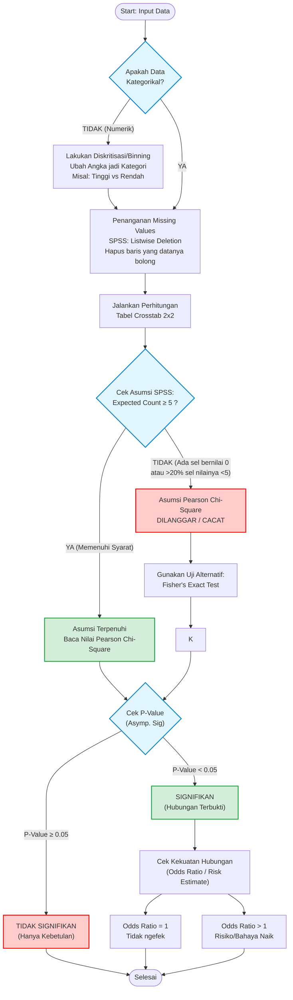

# Flowchart & Asumsi Standar Uji Crosstab (Tabulasi Silang)

Dokumen ini merangkum Standar Operasional Prosedur (SOP) dan asumsi statistik yang digunakan dalam melakukan pengujian Tabulasi Silang (*Crosstab*) dan *Chi-Square*, mengacu pada standar aplikasi analitik seperti SPSS.

## 1. Flowchart Pengujian

---

## 2. Syarat & Asumsi Dasar Crosstab (Teknis vs Bahasa Sederhana)

### A. Jenis Skala Data (Level of Measurement)
*   🔬 **Teknis:** Data wajib berskala **Kategorikal (Nominal/Ordinal)**. Jika menggunakan variabel kontinu/rasio, wajib dilakukan diskritisasi (*binning/recode*) terlebih dahulu (misal: membagi data menjadi dua kategori berdasarkan batas *Median*).
*   👶 **Bahasa Sederhana:** Mesin menolak angka ribet (seperti luas 1.345 hektar). Angka-angka tersebut wajib disortir dan diubah jadi julukan sederhana terlebih dahulu (Contoh: "Tinggi" vs "Rendah").

### B. Syarat Frekuensi Harapan (Expected Count)
*   🔬 **Teknis:** Nilai *expected frequency* harus **≥ 5** pada minimal 80% total sel tabel, dan tidak boleh ada sel bernilai 0. Jika dilanggar, nilai *Pearson Chi-Square* menjadi bias/gugur, dan pengujian harus menggunakan *Fisher's Exact Test*.
*   👶 **Bahasa Sederhana:** Sampel tebakan tidak boleh terlalu sepi. Minimal harus ada 5 barang per kardus tebakan. Kalau isinya kosong atau terlalu sedikit, hasil tebakan mesin pasti ngawur dan tidak sah.

### C. Independensi Observasi (Mutually Exclusive)
*   🔬 **Teknis:** Setiap observasi harus bersifat *Independent* (bebas). Satu entitas tidak boleh diobservasi berulang (*repeated measures*) ke dalam kelompok sel tabel yang berbeda.
*   👶 **Bahasa Sederhana:** Dilarang menghitung ganda. Satu wilayah/kabupaten hanya boleh dimasukkan ke dalam satu kategori, tidak boleh dibelah dua.

### D. Konfigurasi Missing Values (Data Kosong)
*   🔬 **Teknis:** Konfigurasi *default* menggunakan **Listwise Deletion**, yakni membuang seluruh baris observasi (n) apabila terdapat setidaknya satu variabel yang bernilai *Null/NaN*.
*   👶 **Bahasa Sederhana:** Jika ada laporan kabupaten yang isinya bolong (tidak lengkap), maka seluruh lembar laporan tersebut dibuang ke tempat sampah dan tidak diikutkan dalam analisis.

---

## 3. Panduan Membaca Metrik Hasil Pengujian

1. **P-Value (Asymp. Sig / Probabilitas)**
   * **Deskripsi:** Mengukur seberapa kuat bukti statistik bahwa hubungan yang terjadi bukan karena kebetulan.
   * **Standar:** `< 0,05` (Signifikan).
   * **Bahasa Sederhana:** "Skor Kebetulan". Kalau skornya di bawah 5%, berarti penemuannya valid, bukan sekadar kebetulan.
2. **Chi-Square Value (Nilai χ²)**
   * **Deskripsi:** Mengukur seberapa jauh perbedaan antara data observasi aktual dengan data tebakan acak.
   * **Standar:** Semakin besar angkanya, semakin baik (menandakan hubungan yang kuat). Jika 0, berarti tidak ada hubungan.
   * **Bahasa Sederhana:** "Skor Kaget Mesin". Semakin besar skornya, semakin kaget mesin menemukan adanya hubungan yang kuat.
3. **df (Degree of Freedom / Derajat Kebebasan)**
   * **Deskripsi:** Jumlah ruang variasi data. Rumus tabel 2x2: `(Baris - 1) x (Kolom - 1)`.
   * **Standar:** Untuk *Crosstab* 2 kategori vs 2 kategori, df harus bernilai **1**. Jika `df=0`, terjadi cacat perhitungan/kosong data.
   * **Bahasa Sederhana:** "Ruang Gerak Mesin". Kalau angkanya 0, berarti mesin tidak punya ruang untuk menebak karena ada data kategori yang kosong total.
4. **Odds Ratio (Risk Estimate / Rasio Risiko)**
   * **Deskripsi:** Mengukur kekuatan dan perbandingan risiko antara kelompok uji.
   * **Standar:** `> 1` artinya meningkatkan risiko. `= 1` artinya tidak ada efek.
   * **Bahasa Sederhana:** "Angka Kelipatan Bahaya". Jika nilainya 5, berarti keberadaan satu hal (misal: PLTU) membuat risiko bahaya (misal: Deforestasi) 5 kali lipat lebih parah.

---

## 4. Referensi Pustaka Python Alternatif (SPSS-like)
Dalam pengembangan selanjutnya, jika dirasa perlu untuk mengotomatisasi pengolahan *Crosstab* dan pengujian asumsi (agar tidak *error* dan lebih stabil menyerupai SPSS), berikut adalah daftar *library* Python yang paling direkomendasikan (berdasarkan kepopuleran di GitHub per 2026):

| Nama Library | Bintang Github (★) | Fokus Utama / Kesamaan dengan SPSS | Kelebihan untuk Kebutuhan *Crosstab* |
| :--- | :---: | :--- | :--- |
| **[statsmodels](https://github.com/statsmodels/statsmodels)** | ~10.000+ | Mesin statistik utama Python. Ini bukan "tiruan" SPSS, tapi pengganti utuhnya. | Punya modul khusus `statsmodels.stats.contingency_tables` yang sangat lengkap secara fungsional. |
| **[pingouin](https://github.com/raphaelvallat/pingouin)** | ~3.500+ | Dibuat khusus agar statistik di Python semudah di SPSS atau JASP. Populer di kalangan peneliti. | Fungsi `pingouin.chi2_independence()` langsung otomatis mengeluarkan tabel *Crosstab*, nilai Chi-Square, df, P-Value, dan *Expected Counts* dalam satu baris kode. |
| **[tableone](https://github.com/tompollard/tableone)** | ~800+ | Spesialis pembuat "Tabel Karakteristik" (Tabel 1) untuk jurnal medis. | Sangat persis dengan fitur *Descriptive Statistics* SPSS. Langsung menghitung persentase baris/kolom dan P-Value otomatis. |
| **[researchpy](https://github.com/corey-bryant/researchpy)** | ~150+ | *Library* ini secara eksplisit dibuat sebagai **"Wrapper SPSS untuk Python"**. | Fitur andalannya adalah `researchpy.crosstab()`. Hasil keluarannya 99% mirip tabel *Crosstab* SPSS lengkap dengan *Pearson Chi-Square*, *Cramer's V*, dan *Expected Count* yang tersusun rapi dalam tabel. |

