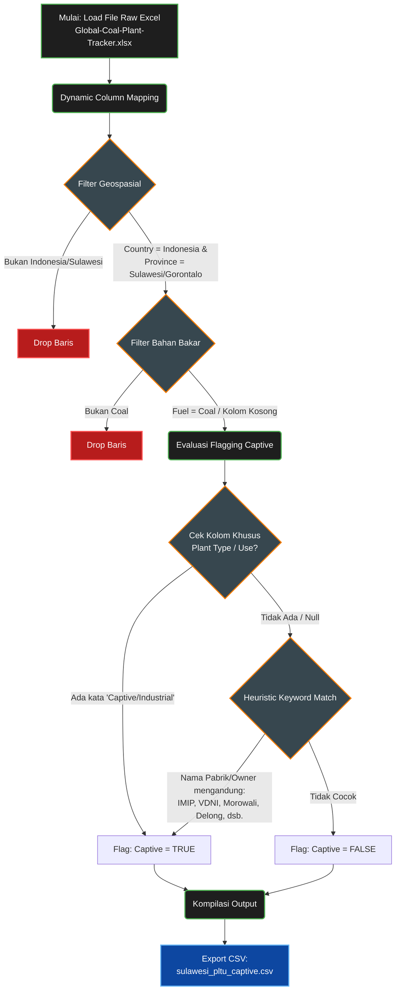
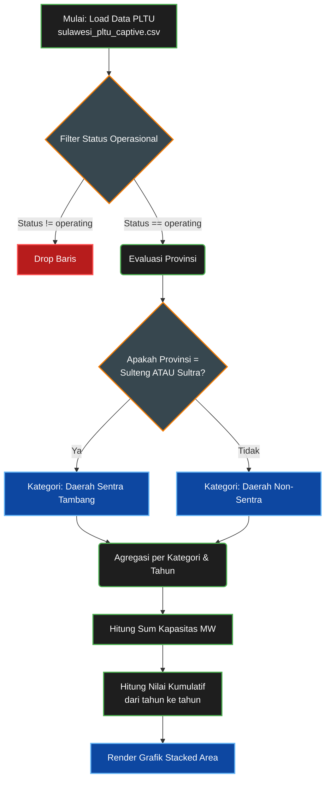

# Metodologi Smart Filter & Parse Logic

Dokumen ini mencatat algoritma *parsing* dan teknik penyaringan data (*Smart Filtering*) yang digunakan dalam arsitektur ekstraksi data *dashboard* ini. Algoritma ini dirancang untuk kebal terhadap perubahan format data mentah (*schema drift*) dari berbagai sumber OSINT (seperti Global Energy Monitor).

---

## 1. Filter PLTU CAPTIVE (Data GEM Global Coal Plant Tracker)

Algoritma ini diterapkan pada skrip `scripts/extract_sulawesi_pltu_captive.py` untuk mengolah data mentah Excel berskala global (ribuan baris data pembangkit listrik sedunia) menjadi data panel yang spesifik untuk area Sulawesi dan mengklasifikasikan jenis PLTU (*Captive* vs *Grid*) secara cerdas.

### A. Flowchart Algoritma Ekstraksi

Berikut adalah alur logika (*heuristic parsing*) yang digunakan:

### B. Anatomi Logika (Penjelasan Teknis)

Untuk menyiasati inkonsistensi struktur kolom dari sumber data publik (di mana nama kolom sering berubah di setiap rilis data), skrip ini menerapkan 3 lapis logika:

1.  **Dynamic Column Mapping (`find_column`)**
    Sistem tidak mencari nama kolom secara eksak (misal: "Subnational unit (province, state)"). Sistem memindai seluruh nama kolom dan mencari *substring* (seperti `province`, `region`, `state`). Hal ini membuat skrip kebal jika struktur Excel GEM berubah di masa depan.
2.  **Filter Geospasial (Indonesia & Sulawesi)**
    *   Mencari baris di mana kolom `Country` mengandung kata "Indonesia".
    *   Mencari baris di mana kolom `Province/Subnational` mengandung kata "sulawesi" atau "gorontalo". Baris di luar wilayah ini dibuang dari *memory* untuk meringankan beban komputasi.
3.  **Heuristic Captive Flagging (`derive_captive_flag`)**
    Karena kolom "Captive" terkadang hilang di data mentah, skrip menggunakan dua lapis pengecekan:
    *   **Lapis 1 (Terstruktur):** Mencari kolom `plant_type` atau `captive industry use`. Jika bernilai *captive*, *off-grid*, atau *industrial*, maka `True`.
    *   **Lapis 2 (NLP Kasar/Heuristik):** Jika Lapis 1 gagal, sistem membedah isi kolom `plant_name`, `owner`, dan `province`. Jika terdapat kata kunci dari raksasa nikel (contoh: *IMIP, Morowali, Weda Bay, Bahodopi, Konawe, VDNI, Gunbuster, Delong*), maka dipaksa di-*flag* sebagai `Captive = True`.
4.  **No-Drop Output Policy**
    Pada akhir pemrosesan, sistem **tidak** membuang data yang berstatus `Captive = False`. Semua PLTU (termasuk Grid PLN) di Sulawesi tetap dimasukkan ke dalam `sulawesi_pltu_captive.csv` untuk keperluan komparasi kapasitas keseluruhan (seperti yang dieksekusi di Bab 2.2).

---

## 2. Filter Kategori Wilayah (Sentra vs Non-Sentra Tambang)

Logika pemisahan wilayah ini tidak dilakukan pada tahap ekstraksi data mentah, melainkan dieksekusi secara langsung (*on-the-fly*) pada *layer* presentasi/Visualisasi UI (khususnya pada grafik *Stacked Area* di Bab 2.2).

### A. Flowchart Logika Pengelompokan (Binning)

### B. Anatomi Logika (Penjelasan Teknis)

1. **Definisi Pakar (Hardcoded Geopolitics)**
   Sistem menetapkan variabel statis `sentra_provs = ['Sulawesi Tengah', 'Sulawesi Tenggara']`. Dua provinsi ini dikunci secara manual ke dalam kode karena realitas lapangan menunjukkan bahwa keduanya adalah titik episentrum perizinan kawasan industri nikel (seperti IMIP dan VDNI).
2. **Fungsi Lambda Pembelah (Dichotomy)**
   Sistem menjalankan iterasi pada seluruh data PLTU yang beroperasi (`operating`). Melalui sebuah fungsi *lambda*, mesin akan mengecek setiap baris: jika provinsi ada di dalam daftar `sentra_provs`, maka di-cap sebagai **Daerah Sentra Tambang** (merah). Sisanya (Sulut, Gorontalo, Sulbar, Sulsel) otomatis di-cap sebagai **Daerah Non-Sentra** (abu-abu).
3. **Agregasi Kumulatif (*Time-Series*)**
   Data yang sudah dibelah ke dalam dua "ember" tersebut dikelompokkan berdasarkan tahun beroperasi (`groupby(['Kategori_Wilayah', 'Tahun'])`). Total Megawatt kemudian dijumlahkan secara beruntun (`cumsum()`) sehingga menghasilkan kurva area yang terus menanjak tajam untuk memperlihatkan rasio dominasi wilayah tambang atas kapasitas ketenagalistrikan pulau.
