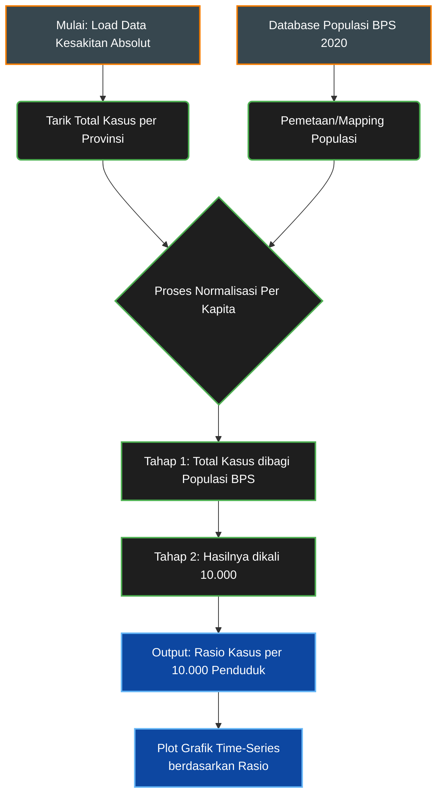

# Metodologi Normalisasi Per Kapita (Population Standardization)

Dokumen ini menjelaskan teknik statistik **Normalisasi Per Kapita** (atau dalam epidemiologi dikenal sebagai *Incidence Rate Calculation*) yang diterapkan pada modul **Bab 3.3 Lintasan Waktu Beban Kesehatan (2014-2024)** di dalam *dashboard*.

---

## 1. Latar Belakang & Rasionalisasi

Saat membandingkan dampak kesehatan lingkungan (seperti jumlah penderita ISPA atau Diare) antar provinsi di Pulau Sulawesi, penggunaan **angka absolut** (total orang sakit) akan menghasilkan bias analisis yang fatal (*Population Size Bias*). 

Sebagai contoh:
*   Provinsi berpenduduk padat seperti Sulawesi Selatan (± 9 juta jiwa) secara alamiah akan selalu memiliki jumlah kasus penyakit absolut yang jauh lebih tinggi.
*   Provinsi dengan ledakan industri ekstraktif seperti Sulawesi Tengah (± 3 juta jiwa) mungkin memiliki angka absolut yang lebih kecil, meskipun warganya terpapar polusi yang jauh lebih parah setiap harinya.

Untuk memastikan perbandingan yang adil (*apple-to-apple*), mesin analitik *dashboard* secara otomatis mengeleminasi faktor besaran populasi ini dengan mengubah "Total Kasus" menjadi **"Rasio Risiko per 10.000 Penduduk"**.

### Flowchart Algoritma Normalisasi



## 2. Formula Kalkulasi (Algoritma)

Pada kode pemrosesan di `pages/3_Beban_Kesehatan.py`, formula yang digunakan adalah sebagai berikut:

```math
Insidensi\_Per\_10K = \left( \frac{Total\_Kasus}{Total\_Populasi} \right) \times 10.000
```

Dalam implementasi sintaks *Python / Pandas*:
```python
# 1. Menyiapkan referensi populasi (Proxy BPS 2020)
populasi_bps = {
    "Sulawesi Selatan": 9070000,
    "Sulawesi Tengah": 2985000,
    "Sulawesi Tenggara": 2624000,
    "Sulawesi Utara": 2621000,
    "Sulawesi Barat": 1419000,
    "Gorontalo": 1171000
}

# 2. Mapping total populasi ke dataset kesehatan
df_ts["populasi"] = df_ts["provinsi"].map(populasi_bps)

# 3. Eksekusi Normalisasi
df_ts["rate_per_10k"] = (df_ts["nilai"] / df_ts["populasi"]) * 10000
```

## 3. Implikasi Visual & Analitik

Dengan metode ini, titik-titik data (Y-axis) pada grafik *Time-Series* tidak lagi melambangkan "Jumlah Orang", melainkan **"Berapa orang yang jatuh sakit di antara setiap 10.000 warga"**. 

Hasil dari normalisasi ini secara drastis membalikkan narasi angka mentah:
Meskipun secara absolut kasus ISPA tertinggi ada di Sulawesi Selatan, **secara proporsional (per kapita)** kurva penderita ISPA tertinggi dan paling fluktuatif justru dipegang oleh wilayah-wilayah episentrum tambang nikel (Garis Merah: Sulawesi Tengah dan Sulawesi Tenggara). Ini membuktikan korelasi kuat antara ledakan infrastruktur energi kotor dengan tingkat risiko kesehatan warga di sekitarnya.
