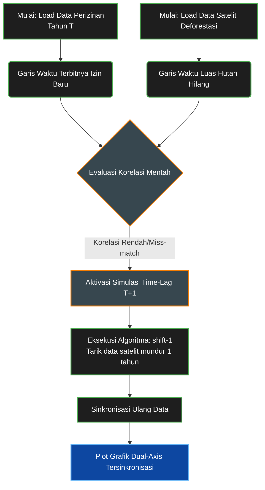

# Metodologi Time-Lag (T+1) Analisis Korelasi Perizinan & Deforestasi

Dokumen ini menjelaskan kerangka logika **Simulasi Time-Lag (T+1)** yang diterapkan pada **Bab 5.1 (Pola Penerbitan Izin vs Deforestasi)** di dalam arsitektur analitik Celios *Dashboard*.

---

## 1. Latar Belakang & Rasionalisasi Empiris

Dalam membedah hubungan sebab-akibat (*causation*) antara obral perizinan tambang oleh pemerintah dan laju kerusakan ekologis (deforestasi), perbandingan data secara linear (Tahun ke Tahun yang sama) seringkali menghasilkan bias *miss-match*.

Hal ini terjadi karena realitas operasional industri ekstraktif di lapangan beroperasi dengan **Jeda Waktu (*Time-Lag*)**:
*   **Tahun T:** Adalah tahun di mana **izin di atas kertas** (seperti IUP atau Konsesi HGU) ditandatangani dan diterbitkan oleh pemerintah.
*   **Fase Transisi:** Setelah izin terbit, korporasi tidak langsung menebang pohon keesokan harinya. Mereka membutuhkan waktu berbulan-bulan untuk proses birokrasi perbankan (pendanaan), mobilisasi alat berat (*dump truck*, ekskavator) ke lokasi terpencil, membangun kamp pekerja, hingga menghadapi eskalasi konflik pembebasan/perampasan lahan warga.
*   **Tahun T+1:** Adalah tahun di mana **eksekusi brutal (*land clearing*)** akhirnya terjadi secara masif dan baru bisa terekam oleh resolusi spasial citra satelit.

Oleh karena itu, metodologi T+1 dirancang untuk **mensinkronkan** kembali jarak waktu tersebut, sehingga akar penyebab kejahatan lingkungan dapat dipetakan secara presisi dan tidak bisa dibantah oleh argumen administratif.

## 2. Flowchart Logika Sinkronisasi



## 3. Eksekusi Algoritma (Python / Pandas)

Pada *backend* aplikasi (`pages/5_Pola_Penerbitan_Izin.py`), sinkronisasi spasio-temporal ini dieksekusi dengan fungsi `.shift(-1)`. Fungsi ini menarik deret waktu dari variabel dependen (Luas Deforestasi) mundur satu langkah ke belakang, agar tepat berada di bawah variabel independen (Jumlah Izin) yang memicunya.

```python
# Toggle interaktif untuk menghidupkan simulasi T+1
use_timelag = st.checkbox("Aktifkan Simulasi Time-Lag Deforestasi (T+1 Tahun)")

if use_timelag:
    # Shift deforestasi mundur 1 tahun (Deforestasi tahun T+1 ditarik ke tahun T)
    # Tujuannya mensejajarkan 'Asap/Eksekusi' dengan 'Api/Izin'
    df_timeline['Total_Deforestasi_Ha_Plotted'] = df_timeline['Total_Deforestasi_Ha'].shift(-1)
    
    # Hapus tahun terakhir (2024/2025) yang nilainya menjadi NaN akibat pergeseran
    df_timeline = df_timeline.dropna(subset=['Total_Deforestasi_Ha_Plotted'])
```

## 4. Konklusi Analitik

Dengan metode ini, *dashboard* berhasil membongkar tabir kronologi yang selama ini tersembunyi:
Ledakan obral **56 izin tambang raksasa di Tahun 2022**, yang mungkin awalnya terlihat tidak berdampak pada lingkungan di tahun tersebut, terbukti secara saintifik memicu ledakan deforestasi terdahsyat sebesar **255.000 Hektar tepat setahun setelahnya (di Tahun 2023)**. 

Metode ini memvalidasi bahwa kerusakan lingkungan di Sulawesi bukanlah bencana alam, melainkan *by design* yang direncanakan di atas meja perizinan negara setahun sebelumnya.
