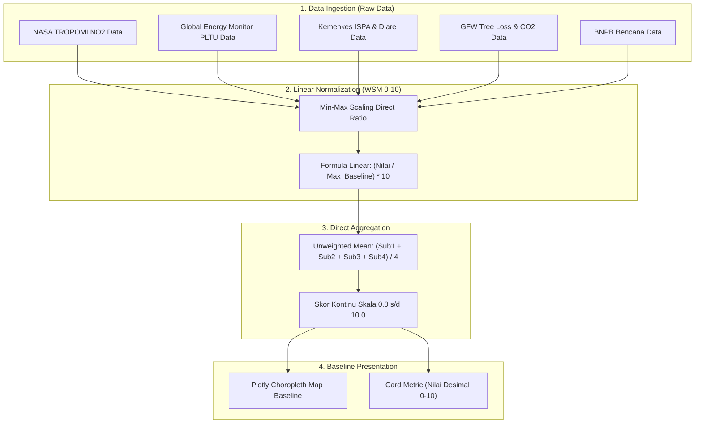
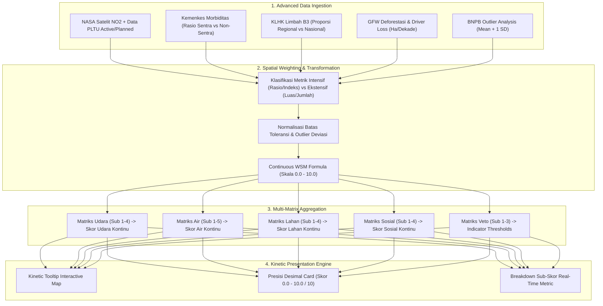
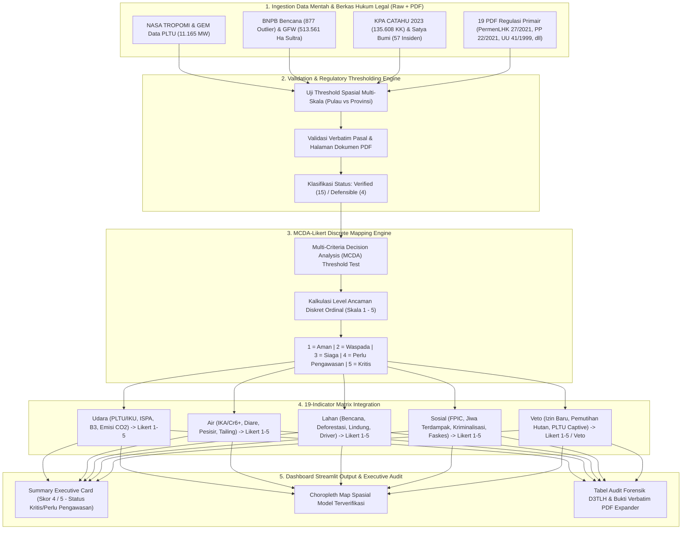

# Pipeline Skoring D3TLH: Diagram Alur Metodologi (Versi 1, 2, & 3)

Dokumen ini memuat diagram alur (*flowchart*) **Mermaid.js** khusus yang mendokumentasikan arsitektur pipeline skoring dan transformasi data empiris pada Dashboard Forensik ECC (Audit D3TLH). Pipeline dipisahkan secara rinci untuk **Versi 1**, **Versi 2**, dan **Versi 3** dalam dokumen ini.

---

## 1. Pipeline Skoring Versi 1: Baseline Plotly Model (Skala Kontinu 0.0 – 10.0)

> **Karakteristik Versi 1**: Model dasar menggunakan *Weighted Sum Model* (WSM) sederhana. Data mentah dinormalisasi secara linear tanpa pemisahan metrik spasial intensif/ekstensif dan ditampilkan menggunakan visualisasi dasar Plotly.

---

## 2. Pipeline Skoring Versi 2: Continuous WSM + Kinetic Tooltip Map (Skala Kontinu 0.0 – 10.0)

> **Karakteristik Versi 2**: Mengembangkan Versi 1 dengan menambahkan **pembobotan spasial (metrik intensif vs ekstensif)**, integrasi outlier deviasi ($Mean + 1 SD$), serta peta interaktif dengan *kinetic tooltip*.

---

## 3. Pipeline Skoring Versi 3: Verified MCDA-Likert Model (Skala Diskret 1 – 5)

> **Karakteristik Versi 3**: Model standar yang **terverifikasi 100% secara hukum dan empiris**. Menggunakan *Multi-Criteria Decision Analysis* (MCDA) dengan ambang batas (*threshold*) baku dari 19 regulasi PDF/CSV, lalu dipetakan ke **Skala Ordinal Diskret 1 s/d 5** untuk memberikan status eksekutif (misal: *STATUS: KRITIS / PERLU PENGAWASAN*).

---

## 📊 Perbandingan Sintesis 3 Versi Pipeline

| Komponen Pipeline | Versi 1 (Plotly Baseline) | Versi 2 (Continuous WSM) | Versi 3 (MCDA-Likert Spasial) |
|---|---|---|---|
| **Skala Skoring** | Kontinu Desimal ($0.0 \text{--} 10.0$) | Kontinu Desimal ($0.0 \text{--} 10.0$) | Diskret Ordinal ($1 \text{--} 5$) |
| **Model Matematis** | Unweighted Linear Mean | Continuous Weighted Sum (WSM) | Multi-Criteria Decision Analysis (MCDA) |
| **Penyesuaian Spasial** | Tidak Ada (Nasion-wide Aggregate) | Bobot Lanskap & Deviasi Outlier | Threshold Spasial Multi-Skala (Pulau vs Prov) |
| **Landasan Regulasi** | Arbitrari / Ad-hoc | Arbitrari / Trend-based | **100% Terverifikasi 19 PDF & CSV Primair** |
| **Output Card Status** | Nilai Angka $0 \text{--} 10$ | Nilai Angka Desimal + Kinetic Tooltip | **Nilai Diskret (mis. 4 / 5) + Status Kritis** |
