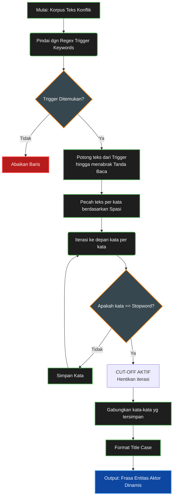

# Metodologi Ekstraksi NLP Aktor Proksi & Vigilante

Dokumen ini menjelaskan alur logika dan metodologi *Natural Language Processing* (NLP) yang digunakan untuk mendeteksi kemunculan aktor-aktor proksi korporasi (seperti *Oknum, Preman, Satgas*) di dalam aplikasi Celios (khususnya pada Sub-bab 4.5). 

Metodologi ini sengaja dirancang 100% *Data-Driven* untuk menghindari bias pengkodean manual (*hardcoding*).

## 1. Pembuatan Korpus Teks (Text Corpus)
Ekstraksi dilakukan secara dinamis dengan menggabungkan tiga kolom teks naratif utama dari dataset `sulawesi_konflik_agraria_tanahkita.csv`:
- `judul` (Judul konflik)
- `deskripsi` (Ringkasan kejadian)
- `narasi` (Kronologi lengkap)

Data yang dianalisis **bukan** hanya terbatas pada wilayah Sulawesi, melainkan seluruh dataset konflik **Nasional (N = 568 kasus)**. Pelebaran cakupan ruang lingkup ke skala nasional khusus untuk bagian ini dilakukan agar aplikasi mampu membongkar **Buku Panduan (*Playbook*) atau Modus Operandi Struktural** yang kerap diduplikasi korporasi dalam merepresi warga di berbagai daerah, yang sangat mungkin atau sudah diimpor ke Sulawesi.

## 2. Definisi Kata Kunci Pemicu (Trigger Keywords)
Algoritma pemindaian awal menggunakan Regex untuk mencari titik jangkar (kata kunci pemicu) yang identik dengan aktor-aktor non-organik / proksi korporasi:
`Preman | Ormas | Satgas | PAM Swakarsa | Pemuda Pancasila | GRIB | Laskar | Tandingan | Oknum | Security | Satpam | Pengamanan Swakarsa | Centeng | Beking`

## 3. Ekstraksi Frasa Kontekstual Dinamis (Stopword Cutoff Algorithm)
Alih-alih hanya menghitung kemunculan kata tunggal (misal: "Oknum"), algoritma dibuat agar bisa mengambil konteks secara utuh (misal: "Oknum Aparat Brimob").
Algoritma ini menggunakan *Stopword Cutoff* dengan tahapan berikut:

1. **Regex Slicing:** Saat kata kunci pemicu ditemukan, Regex akan memotong seluruh teks yang ada di belakang kata tersebut hingga menabrak tanda baca (titik, koma, tanda kurung, hubung, dsb) melalui pola `[^\.,;\!\?\(\)\[\]"\'\-]*`.
2. **Stopwords Iteration:** Teks potongan tersebut kemudian dipecah berdasarkan spasi. Sistem akan melakukan iterasi pada setiap kata ke depan.
3. **Cut-off:** Jika sistem mendeteksi *Stopwords* (kata hubung bahasa Indonesia), maka iterasi akan berhenti memotong frasa tersebut.
   - *Daftar Stopwords*: `yang, dan, di, dari, dengan, untuk, pada, ke, dalam, oleh, serta, sebagai, adalah, ini, itu, tersebut, kepada, saat, ketika, juga, mengatasnamakan, berjumlah, melarang, datang, berupaya, segera, salah, lainnya, tak, nya, sedang, akan, karena, sebab, lalu, kemudian, mereka`.
4. **Rekonstruksi (Title Case):** Kata-kata yang lolos *cut-off* digabungkan kembali menggunakan format kapitalisasi judul (*Title Case*).

**Contoh Cara Kerja:**
- Teks Asli: *"Oknum aparat brimob yang menembakkan gas air mata..."*
- Potongan Regex: *"Oknum aparat brimob yang menembakkan gas air mata"*
- Iterasi memindai "Oknum", "aparat", "brimob" -> **Lolos**
- Iterasi menabrak kata "yang" (*Stopword*) -> **Cut-off Aktif**
- Hasil Ekstraksi Otomatis: **"Oknum Aparat Brimob"**

### Flowchart Algoritma Stopword Cutoff

## 4. Keunggulan Metodologi
Dengan algoritma ini, Celios dapat menyajikan data intelijen sosial yang bebas tebakan manual (*hardcoding*). Apapun frasa kejahatan struktural yang ditulis oleh para peneliti TanahKita di dalam laporan kronologinya, akan otomatis tersedot dan terpetakan dengan presisi tinggi di layar pengguna.
