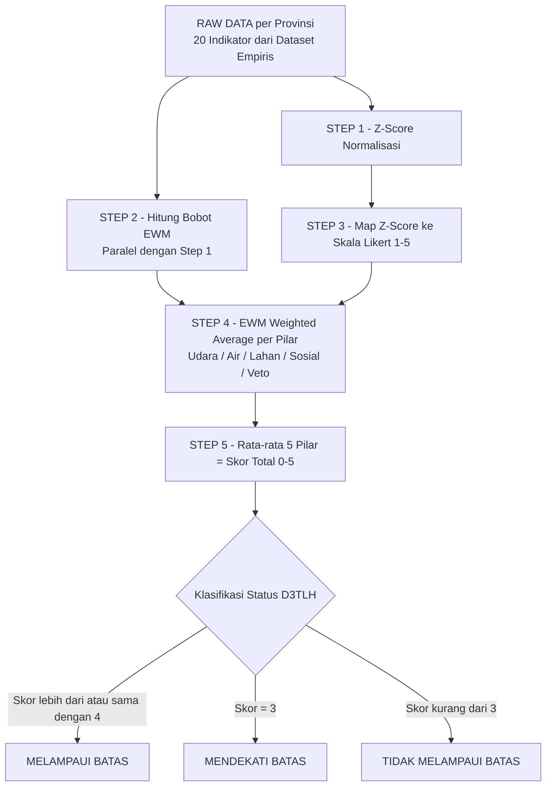

# Flowchart Algoritma Skoring D3TLH Provinsi Sulawesi
## Metode: Z-Score Anomali + Entropy Weight Method (EWM) — Versi ZscoreEWM

---

## Diagram Alur



---

## Rumus Matematis per Step

### STEP 1 — Z-Score Normalisasi

```text
Z = (x - rata_rata) / standar_deviasi
```

- $x_{ij}$ = nilai aktual provinsi $i$ pada indikator $j$  
- $\bar{x}_j$ = rata-rata seluruh provinsi Sulawesi pada indikator $j$  
- $\sigma_j$ = standar deviasi indikator $j$

> **Khusus IKA (Kualitas Air):** $Z_{ika} = -Z_{ika}$ karena nilai tinggi = bagus, bukan buruk

---

### STEP 2 — Entropy Weight Method (EWM)

**2a. Min-Max Normalisasi:**
```text
r = (x - min(x)) / (max(x) - min(x))
```

**2b. Proporsi (Probabilitas):**
```text
P = r / total_semua_r
```

**2c. Entropi:**
```text
E = - (1 / ln(n)) * SUM(P * ln(P))
```

**2d. Diferensiasi:**
```text
D = 1 - E
```

**2e. Bobot Final:**
```text
W = D / total_semua_D
```

> **Interpretasi:** Semakin timpang nilai indikator $j$ antar provinsi → $E_j$ kecil → $D_j$ besar → **$W_j$ besar (bobot tinggi)**

---

### STEP 3 — Mapping Z-Score ke Likert 1–5

| Rentang Z-Score | Skor Likert | Interpretasi |
|---|---|---|
| $Z < -1.5$ | 1 | Sangat Baik |
| $-1.5 \leq Z < -0.5$ | 2 | Baik |
| $-0.5 \leq Z < +0.5$ | 3 | Sedang |
| $+0.5 \leq Z < +1.5$ | 4 | Buruk |
| $Z \geq +1.5$ | 5 | Krisis Parah |

---

### STEP 4 — EWM Weighted Average per Pilar

```text
Skor_Pilar = SUM(Skor_Likert * Bobot_EWM) / SUM(Bobot_EWM)
```

- $L_{ij}$ = Skor Likert provinsi $i$ pada indikator $j$  
- $W_j$ = Bobot EWM indikator $j$

| Pilar | Indikator |
|---|---|
| Udara | pltu_mw, no2, ispa_irr, b3_ton, co2_mton |
| Air | ika, diare_irr, konflik_pesisir, tailing_ton |
| Lahan | bencana, deforestasi_ha, lindung_ha, driver_ha, gap_amdal |
| Sosial | fpic, jiwa_terdampak, kriminalisasi, gap_spa |
| Veto | izin_baru, ilegal, pltu_mw |

---

### STEP 5 — Skor Total

```text
Skor_Total = (Udara + Air + Lahan + Sosial + Veto) / 5
```

Skala output: **0 – 5**

---

## Perbedaan Versi

| Versi | Agregasi Pilar | Status |
|---|---|---|
| `algo_skoring_provinsi/` | `.mean()` biasa — EWM tidak dipakai | Lama (backup) |
| `algo_skoring_provinsi_ZscoreEWM/` | EWM Weighted Average aktif | **Aktif sekarang** |
