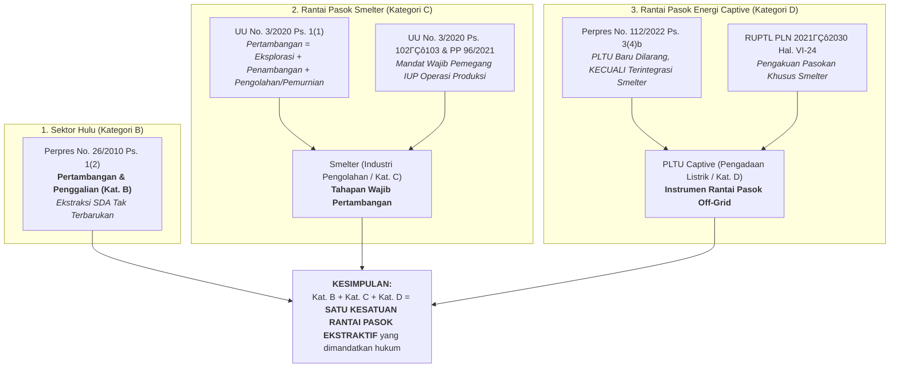
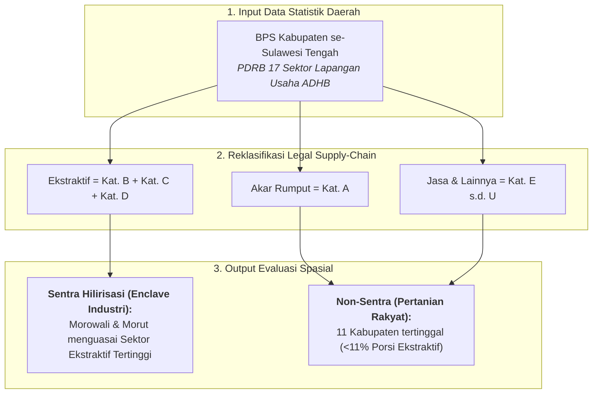
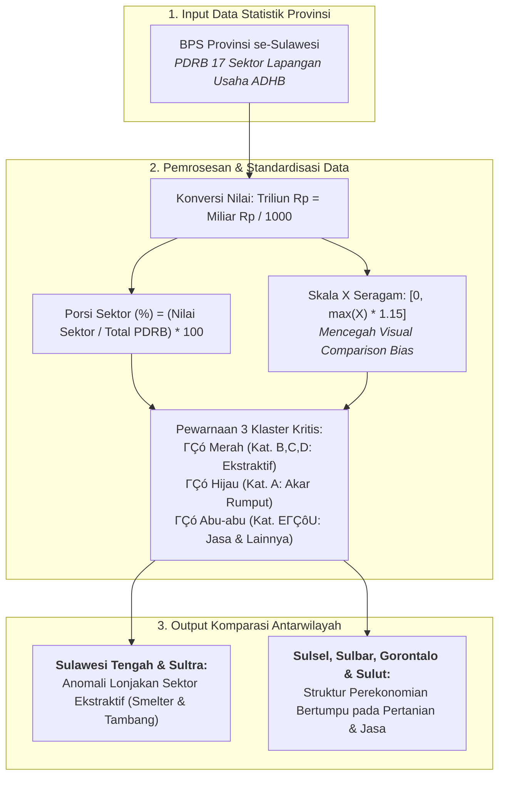

# BAB I: METODOLOGI ANALISIS EKSPANSI INDUSTRI EKSTRAKTIF DAN INFRASTRUKTUR PENUNJANG DI PULAU SULAWESI

Dokumen laporan metodologi ini menyajikan kerangka ilmiah, landasan regulasi, formulasi matematis, prosedur analisis statistik, serta metodologi pembuktian berbasis data terbuka yang dioperasionalkan pada **Bab 1: Ekspansi Industri Ekstraktif** dalam studi Daya Dukung dan Daya Tampung Lingkungan Hidup (D3TLH) Sulawesi periode 2014ΓÇô2024.

---

## SUB-BAB 1.1: Konteks Makro: Breakdown PDRB per Komoditas

### 1.1.1 Konteks Makro: Dominasi Ekstraktif vs Ekonomi Akar Rumput
Bagian ini menganalisis struktur Produk Domestik Regional Bruto (PDRB) pada enam provinsi di Pulau Sulawesi sepanjang periode 2016ΓÇô2024 menggunakan visualisasi grafik area bertumpuk (*Stacked Area Chart*). Analisis ini ditujukan untuk menguji secara empiris apakah percepatan pertumbuhan ekonomi daerah benar-benar bersumber dari sektor produktif masyarakat lokal atau didominasi oleh industri ekstraktif padat modal yang mengalihkan pemanfaatan ruang dan sumber daya alam.

> **Sumber Data:** Badan Pusat Statistik (BPS) Provinsi se-Sulawesi (diolah CELIOS). Visualisasi *Stacked Area Chart* memetakan dinamika Produk Domestik Regional Bruto (PDRB) berdasarkan klasifikasi rantai pasok hukum (*Legal Supply-Chain*) untuk membandingkan trajektori Sektor Ekstraktif, Ekonomi Akar Rumput, dan Sektor Jasa & Lainnya.

#### A. Kerangka Dekomposisi Sektoral & Pendekatan Rantai Pasok Hukum (Legal Supply-Chain)
Sistem KBLI 2020 BPS membagi 17 sektor PDRB. Melalui pendekatan Legal Supply-Chain, 17 sektor direklasifikasi menjadi 3 Klaster Makro (Ekstraktif, Akar Rumput, Jasa). Rincian pembagian sektor, dasar regulasi, serta intisari ketentuan hukum disajikan secara lengkap pada **Tabel 1.1** berikut:

##### Tabel 1.1: Reklasifikasi Sektoral PDRB KBLI 2020 Berdasarkan Pendekatan Rantai Pasok Hukum (Legal Supply-Chain)
| Kategori BPS | Sektor Lapangan Usaha | Klasifikasi Analisis | Dasar Regulasi & Mandat Hukum | Intisari Ketentuan Hukum |
| :--- | :--- | :---: | :--- | :--- |
| **Kategori B** | Pertambangan dan Penggalian | Ekstraktif | Perpres No. 26 Tahun 2010 | Ketentuan Pasal 1 Ayat (2) mengenai pengambilan komoditas tambang dari dalam bumi. |
| **Kategori C** | Industri Pengolahan (Smelter Logam) | Ekstraktif | UU No. 3 Tahun 2020 & PP No. 96 Tahun 2021 | Pasal 102ΓÇô103 mewajibkan pengolahan dan pemurnian di dalam negeri sebagai kesatuan pertambangan. |
| **Kategori D** | Pengadaan Listrik & Gas (PLTU Captive) | Ekstraktif | Perpres No. 112 Tahun 2022 & RUPTL PLN | Pasal 3 Ayat (4) huruf b mengecualikan PLTU baru hanya bagi yang terintegrasi melayani smelter. |
| **Kategori A** | Pertanian, Kehutanan, Perikanan | Ekonomi Akar Rumput | KBLI 2020 BPS | Sektor pemanfaatan sumber daya hayati terbarukan dan penyerap tenaga kerja lokal. |
| **Kategori EΓÇôU** | 13 Sektor Jasa & Konstruksi | Sektor Jasa & Lainnya | Klasifikasi Standar BPS | Sektor sekunder dan tersier penunjang perekonomian daerah. |

#### B. Alur Logika Metodologis Rantai Pasok Hukum (Mengapa Kat. B + C + D = Ekstraktif)
Keterkaitan ketiga kategori lapangan usaha tersebut sebagai satu kesatuan rantai pasok ekstraktif dimodelkan dalam kerangka alur logika hukum sebagaimana diilustrasikan pada **Bagan Alur 1.1** berikut:

##### Bagan Alur 1.1: Alur Logika Metodologis Rantai Pasok Hukum Sektor Ekstraktif


#### C. Formulasi Matematis: Persamaan Agregasi Sektor Ekstraktif (Legal Supply-Chain Aggregation)

**Persamaan Agregasi Sektor Ekstraktif (Legal Supply-Chain Aggregation):**
```text
Sektor_Ekstraktif = PDRB(Kat.B: Pertambangan) + PDRB(Kat.C: Ind. Pengolahan) + PDRB(Kat.D: Listrik)
```
*Keterangan Variabel:*
- `Sektor_Ekstraktif`: Total nilai tambah bruto dari klaster industri ekstraktif yang saling terintegrasi (Triliun Rupiah).
- `PDRB(Kat.B: Pertambangan)`: Nilai tambah kegiatan eksplorasi dan ekstraksi bijih mineral (BPS KBLI 2020 Kategori B).
- `PDRB(Kat.C: Ind. Pengolahan)`: Nilai tambah pemurnian logam dasar di smelter nikel (BPS KBLI 2020 Kategori C / Golongan 24).
- `PDRB(Kat.D: Listrik)`: Nilai tambah penyediaan listrik batubara khusus smelter / PLTU captive (BPS KBLI 2020 Kategori D).

**Persamaan Ekonomi Akar Rumput:**
```text
Sektor_Akar_Rumput = PDRB(Kat.A: Pertanian, Kehutanan, dan Perikanan)
```
*Keterangan Variabel:*
- `Sektor_Akar_Rumput`: Nilai PDRB pemanfaatan sumber daya hayati terbarukan (Triliun Rupiah).
- `PDRB(Kat.A)`: Agregasi nilai tambah tanaman pangan, perkebunan rakyat, perikanan, peternakan, kehutanan.

**Persamaan Sektor Jasa & Lainnya:**
```text
Sektor_Jasa = Jumlah PDRB (Kategori E sampai dengan Kategori U)
```
*Keterangan Variabel:*
- `Sektor_Jasa`: Nilai tambah 13 sektor penunjang sekunder dan tersier (Triliun Rupiah).
- `PDRB(Kat. E s.d. U)`: Akumulasi sektor perdagangan, konstruksi, transportasi, keuangan, pendidikan, dll.

**Persamaan Total Produk Domestik Regional Bruto (PDRB Wilayah):**
```text
Total_PDRB = Sektor_Ekstraktif + Sektor_Akar_Rumput + Sektor_Jasa
```
*Keterangan Variabel:*
- `Total_PDRB`: Total nilai Produk Domestik Regional Bruto wilayah atas dasar harga berlaku (Triliun Rupiah).

**Persamaan Pangsa Kontribusi Sektor Ekstraktif (%):**
```text
Pangsa_Ekstraktif (%) = ( Sektor_Ekstraktif / Total_PDRB ) * 100
```
*Keterangan Variabel:*
- `Pangsa_Ekstraktif (%)`: Persentase pangsa dominasi sektor ekstraktif terhadap total ekonomi (%).

**Persamaan Laju Pertumbuhan Tahunan Sektoral (YoY):**
```text
Laju_Pertumbuhan_Tahunan (%) = [ ( Nilai_Tahun_t - Nilai_Tahun_{t-1} ) / Nilai_Tahun_{t-1} ] * 100
```
*Keterangan Variabel:*
- `Laju_Pertumbuhan_Tahunan (%)`: Tingkat percepatan/perlambatan ekspansi tahunan sektor ekonomi (%).
- `Nilai_Tahun_t`: Nilai nominal PDRB sektor pada tahun berjalan t.
- `Nilai_Tahun_{t-1}`: Nilai nominal PDRB sektor pada satu tahun sebelumnya (t - 1).

Definisi operasional, cakupan lapangan usaha, dan institusi penyedia data primer untuk masing-masing komponen variabel dalam sistem persamaan di atas dipaparkan pada **Tabel 1.2** berikut:

##### Tabel 1.2: Definisi Operasional Komponen Makroekonomi dan Sumber Data PDRB Sektoral
| Komponen Analisis | Cakupan Lapangan Usaha | Definisi Operasional | Satuan Nilai | Sumber Data Primer |
| :--- | :--- | :--- | :---: | :--- |
| **Sektor Ekstraktif** | Kategori B, Kategori C, Kategori D | Akumulasi nilai tambah pertambangan nikel, smelter logam dasar, dan PLTU captive. | Triliun Rupiah | BPS Provinsi (SIMDASI) |
| **Ekonomi Akar Rumput** | Kategori A | Nilai tambah pertanian, perkebunan, kehutanan, dan perikanan. | Triliun Rupiah | BPS Provinsi |
| **Sektor Jasa & Lainnya** | Kategori E hingga U | Nilai tambah gabungan perdagangan, konstruksi, transportasi, keuangan, dan jasa. | Triliun Rupiah | BPS Provinsi |
| **Total PDRB Wilayah** | Seluruh 17 Kategori | Total nilai PDRB wilayah atas dasar harga berlaku pada tahun berjalan. | Triliun Rupiah | BPS Provinsi |
| **Pangsa Ekstraktif (%)** | Rasio Kontribusi | Persentase kontribusi sektor ekstraktif terhadap total perekonomian. | Persen (%) | Hasil Olahan CELIOS |

#### D. Analisis Temuan Empiris: Ketimpangan Struktural Sulawesi Tengah

Penerapan formulasi di atas menunjukkan bahwa di **Sulawesi Tengah (sebagai pusat hilirisasi)**, ekspansi industri ekstraktif menguasai **55.8% dari total PDRB provinsi** pada tahun 2024, memperlihatkan dominasi yang sangat kuat dibanding provinsi lainnya.

### 1.1.2 Pemusatan Sektor Ekstraktif di Kabupaten se-Sulawesi Tengah

Jika dianalisis secara spasial pada tingkat kabupaten di Sulawesi Tengah, terlihat konsentrasi kegiatan industri ekstraktif. Kabupaten **Morowali** dan **Morowali Utara** mendominasi struktur PDRB provinsi melalui pengembangan kawasan industri hilirisasi dan PLTU Captive. Analisis ini membandingkan komposisi ketiga sektor advokatif di seluruh 13 kabupaten/kota se-Sulawesi Tengah pada tahun terbaru (2024).

> **Sumber Data:** Badan Pusat Statistik (BPS) Kabupaten se-Sulawesi Tengah (diolah CELIOS). Visualisasi *Stacked Bar Chart* memetakan struktur Produk Domestik Regional Bruto (PDRB) tahun 2024 pada seluruh 13 kabupaten/kota untuk mengidentifikasi tingkat konsentrasi sektoral dan polarisasi spasial antara sentra industri pengolahan nikel dengan daerah non-sentra.

#### A. Rasionalitas Spasial & Urgensi Dekomposisi Sektoral Tingkat Kabupaten
Analisis agregat pada tingkat provinsi sering kali menghasilkan **Bias Ilusi Agregat (Aggregate Illusion Bias)**, di mana angka pertumbuhan ekonomi makro yang tinggi memberi kesan seolah seluruh wilayah menikmati kemakmuran yang seimbang. Namun, ketika data didekomposisi ke tingkat kabupaten/kota, terlihat jurang pemisah ekonomi yang sangat tajam antara wilayah **Enklave Industri Ekstraktif** dengan daerah agraris tradisional sekitarnya.

#### B. Alur Logika Analisis Disparitas Spasial Kabupaten
Kerangka kerja metodologis dalam membedah ketimpangan intra-provinsial ini diilustrasikan pada **Bagan Alur 1.2** berikut:

##### Bagan Alur 1.2: Alur Logika Metodologis Dekomposisi Spasial PDRB Tingkat Kabupaten se-Sulawesi Tengah


#### C. Formulasi Matematis: Persamaan Agregasi Sektoral Kabupaten (Legal Supply-Chain Aggregation)

**Persamaan Agregasi Sektor Ekstraktif Tingkat Kabupaten:**
```text
Sektor_Ekstraktif_Kabupaten = PDRB_Kab(Kat.B: Pertambangan) + PDRB_Kab(Kat.C: Ind. Pengolahan) + PDRB_Kab(Kat.D: Listrik)
```
*Keterangan Variabel:*
- `Sektor_Ekstraktif_Kabupaten`: Total nilai tambah sektor ekstraktif di tingkat kabupaten target (satuan: Triliun Rupiah).
- `PDRB_Kab(Kat.B: Pertambangan)`: Nilai PDRB kabupaten dari aktivitas penambangan bijih logam dan galian (BPS Kategori B).
- `PDRB_Kab(Kat.C: Ind. Pengolahan)`: Nilai PDRB kabupaten dari industri peleburan logam dasar / smelter (BPS Kategori C).
- `PDRB_Kab(Kat.D: Listrik)`: Nilai PDRB kabupaten dari penyediaan daya listrik batubara captive (BPS Kategori D).

**Persamaan Total Produk Domestik Regional Bruto Tingkat Kabupaten:**
```text
Total_PDRB_Kabupaten = Sektor_Ekstraktif_Kabupaten + Sektor_Akar_Rumput_Kabupaten + Sektor_Jasa_Kabupaten
```
*Keterangan Variabel:*
- `Total_PDRB_Kabupaten`: Total output perekonomian bruto kabupaten target atas dasar harga berlaku (satuan: Triliun Rupiah).
- `Sektor_Ekstraktif_Kabupaten`: Nilai tambah bruto sektor ekstraktif terintegrasi di kabupaten (Triliun Rupiah).
- `Sektor_Akar_Rumput_Kabupaten`: Nilai tambah sektor pertanian, kehutanan, dan perikanan di kabupaten (Triliun Rupiah).
- `Sektor_Jasa_Kabupaten`: Nilai tambah sektor perdagangan, transportasi, dan jasa layanan di kabupaten (Triliun Rupiah).

**Persamaan Porsi Sektoral dalam Kabupaten (Porsi (%) pada Tooltip Dashboard):**
```text
Porsi_Sektor_Kabupaten (%) = ( Nilai_Sektor_Kabupaten / Total_PDRB_Kabupaten ) * 100
```
*Keterangan Variabel:*
- `Porsi_Ekstraktif (%)`: Persentase kontribusi Sektor Ekstraktif: ( Sektor_Ekstraktif / Total_PDRB ) * 100 (misal Morowali: 45.2%).
- `Porsi_Jasa (%)`: Persentase kontribusi Sektor Jasa & Lainnya: ( Sektor_Jasa / Total_PDRB ) * 100 (misal Morowali: 54.0%).
- `Porsi_Akar_Rumput (%)`: Persentase kontribusi Sektor Ekonomi Akar Rumput: ( Sektor_Akar_Rumput / Total_PDRB ) * 100 (misal Morowali: 0.8%).
- `Total_PDRB_Kabupaten`: Total nilai nominal PDRB seluruh sektor di kabupaten target (Triliun Rupiah).

#### D. Rincian Definisi Operasional & Matriks Distribusi PDRB 13 Kabupaten
Penerapan sistem persamaan di atas terhadap seluruh 13 kabupaten dan kota di Provinsi Sulawesi Tengah pada tahun 2024 disajikan secara komprehensif pada **Tabel 1.3** berikut:

##### Tabel 1.3: Distribusi Nilai Tambah Bruto dan Komposisi Sektoral PDRB 13 Kabupaten/Kota di Sulawesi Tengah (Tahun 2024)
| Kabupaten / Kota | Akar Rumput (T Rp) | Ekstraktif (T Rp) | Jasa (T Rp) | Total PDRB (T Rp) | Porsi Akar Rumput (%) | Porsi Ekstraktif (%) | Porsi Jasa (%) | Basis Utama Ekonomi |
| :--- | :---: | :---: | :---: | :---: | :---: | :---: | :---: | :--- |
| **Morowali** | 2.70 | 157.17 | 187.85 | **347.72** | 0.8% | 45.2% | 54.0% | Hilirisasi Nikel (Smelter & PLTU) |
| **Banggai** | 8.85 | 20.63 | 51.99 | **81.47** | 10.9% | 25.3% | 63.8% | Migas, Tambang & Perdagangan |
| **Palu** | 1.24 | 4.56 | 60.03 | **65.84** | 1.9% | 6.9% | 91.2% | Jasa, Perdagangan & Pemerintahan |
| **Morowali Utara** | 5.17 | 19.22 | 36.08 | **60.47** | 8.5% | 31.8% | 59.7% | Hilirisasi Nikel (Smelter GNI) |
| **Parigi Moutong** | 9.97 | 1.93 | 35.05 | **46.95** | 21.2% | 4.1% | 74.7% | Pertanian Pangan & Hortikultura |
| **Donggala** | 5.96 | 3.53 | 23.57 | **33.05** | 18.0% | 10.7% | 71.3% | Pertanian, Perkebunan & Galian C |
| **Poso** | 4.96 | 0.40 | 20.12 | **25.48** | 19.5% | 1.6% | 79.0% | Pertanian & Perkebunan Kakao |
| **Sigi** | 5.17 | 0.83 | 19.13 | **25.12** | 20.6% | 3.3% | 76.1% | Pertanian Pangan & Hortikultura |
| **Toli-Toli** | 4.35 | 0.44 | 17.36 | **22.15** | 19.7% | 2.0% | 78.4% | Perkebunan Cengkeh & Perikanan |
| **Buol** | 3.77 | 1.15 | 10.67 | **15.58** | 24.2% | 7.4% | 68.5% | Kelapa Sawit & Tanaman Pangan |
| **Tojo Una-Una** | 2.88 | 0.61 | 11.21 | **14.71** | 19.6% | 4.2% | 76.2% | Pertanian & Pariwisata Bahari |
| **Banggai Kepulauan** | 2.53 | 0.18 | 8.04 | **10.75** | 23.5% | 1.7% | 74.8% | Perikanan Tangkap & Kelautan |
| **Banggai Laut** | 1.80 | 0.12 | 4.52 | **6.45** | 27.9% | 1.9% | 70.2% | Perikanan & Budidaya Laut |

#### E. Analisis Temuan Empiris: Polarisasi Ekstrem Morowali vs Daerah Non-Smelter
Data empiris pada Tabel 1.3 mengungkap bukti polarisasi ekonomi wilayah yang sangat ekstrem di Sulawesi Tengah:

1. **Dominasi Sektor Ekstraktif Morowali:** Kabupaten Morowali mencatatkan nilai sektor ekstraktif sebesar Rp 157.17 Triliun atau menguasai porsi 45.2% dari total kue ekonomi kabupatennya (Rp 347.72 Triliun). Nilai sektor ekstraktif Morowali saja melampaui gabungan total PDRB dari delapan kabupaten lainnya di Sulawesi Tengah.
2. **Pemusatan pada Dua Sentra Hilirisasi:** Kabupaten Morowali dan Morowali Utara merupakan dua daerah dengan nilai Sektor Ekstraktif tertinggi di Sulawesi Tengah, membuktikan bahwa percepatan output industri pertambangan dan hilirisasi terkunci pada kawasan industri smelter.
3. **Ketertinggalan Daerah Non-Sentra:** Sebaliknya, delapan kabupaten lainnya (seperti Banggai Laut, Banggai Kepulauan, Tojo Una-Una, Buol, Toli-Toli, Sigi, Poso, dan Donggala) memiliki porsi Sektor Ekstraktif yang sangat rendah (<11%) dan tetap bergantung pada sektor pertanian rakyat (Akar Rumput) berproduktivitas rendah dengan keterbatasan akses terhadap nilai tambah modal.

### 1.1.3 Perbandingan Distribusi 17 Sektor Komoditas per Provinsi (Small Multiples, Tahun Terbaru)
Visualisasi komparatif **Small Multiples Horizontal Bar Chart** membedah struktur 17 sektor lapangan usaha KBLI 2020 secara terpisah pada enam provinsi di Pulau Sulawesi pada tahun terbaru (2024). Setiap panel provinsi menampilkan sektor yang diurutkan dari penyumbang terbesar hingga terkecil dengan skala sumbu nilai yang disetarakan secara seragam untuk memastikan validitas komparasi lintas wilayah.

> **Sumber Data Resmi & Deskripsi Visualisasi:** Badan Pusat Statistik (BPS) Provinsi se-Sulawesi (diolah CELIOS). Visualisasi *Small Multiples Horizontal Bar Chart* menyajikan dekomposisi 17 sektor PDRB tahun 2024 di 6 provinsi se-Pulau Sulawesi. Sumbu X disetarakan pada rentang nilai seragam ([0, 178.5 Triliun Rp]) dengan pewarnaan berdasarkan 3 klaster makro (Merah: Ekstraktif, Hijau: Ekonomi Akar Rumput, Abu-abu: Sektor Jasa & Lainnya) guna mengidentifikasi spesialisasi dan anomali struktural ekonomi masing-masing provinsi.

#### A. Kerangka Konseptual & Standardisasi Skala Komparatif (Uniform Scale Small Multiples)
Dalam analisis data multidimensi lintas wilayah, penggunaan skala dinamis mandiri (*independent dynamic scaling*) pada masing-masing panel sering kali menimbulkan **Bias Distorsi Visual Komparatif (Visual Comparison Bias)**. Tanpa penyetaraan batas skala maksimum, sektor dengan nominal kecil di provinsi ber-PDRB rendah dapat terlihat secara visual setara dengan sektor bernilai ratusan triliun di provinsi ber-PDRB besar. Oleh karena itu, metodologi ini menetapkan batas skala maksimum sumbu X yang seragam (*Uniform Scale Bound*) sebesar nilai maksimum sektor tertinggi di seluruh pulau ditambah faktor ruang margin sebesar 15%.

#### B. Alur Logika Metodologis Analisis Small Multiples 17 Sektor
Kerangka operasionalisasi analisis perbandingan terpisah 17 sektor lapangan usaha ini dimodelkan dalam kerangka alur logika sebagaimana diilustrasikan pada **Bagan Alur 1.3** berikut:

##### Bagan Alur 1.3: Alur Logika Metodologis Analisis Komparatif Small Multiples 17 Sektor PDRB per Provinsi


#### C. Formulasi Matematis: Persamaan Agregasi dan Porsi 17 Sektor Komoditas
Kalkulasi perbandingan sektoral dan normalisasi skala grafik dihitung menggunakan sistem formulasi berikut:

**Persamaan Normalisasi Nilai Sektor ke Satuan Triliun Rupiah:**
```text
Nilai_Sektor_Triliun = Nilai_Sektor_Miliar / 1000
```
*Keterangan Variabel:*
- `Nilai_Sektor_Triliun`: Nilai tambah bruto sektor lapangan usaha dalam satuan baku Triliun Rupiah.
- `Nilai_Sektor_Miliar`: Nilai nominal PDRB mentah dari publikasi resmi BPS (satuan: Miliar Rupiah).

**Persamaan Porsi Sektoral per Provinsi (Porsi (%) pada Tooltip Dashboard):**
```text
Porsi_Sektor_Provinsi (%) = ( Nilai_Sektor_Provinsi / Total_PDRB_Provinsi ) * 100
```
*Keterangan Variabel:*
- `Porsi_Sektor_Provinsi (%)`: Persentase kontribusi sektor target terhadap keseluruhan total PDRB provinsi bersangkutan (satuan: Persen / %). Angka ini ditampilkan pada tooltip 'Porsi (%)' di dashboard.
- `Nilai_Sektor_Provinsi`: Nilai tambah bruto sektor lapangan usaha target di provinsi bersangkutan (Triliun Rupiah).
- `Total_PDRB_Provinsi`: Total nilai nominal PDRB seluruh 17 sektor di provinsi bersangkutan (Triliun Rupiah).

**Persamaan Batas Maksimum Skala Sumbu X Seragam (Uniform Scale Bound):**
## 1.2 Konsentrasi Kawasan Industri & PLTU Captive

Intensifikasi industri pengolahan mineral di Pulau Sulawesi berpusat pada pembangunan mega-smelter yang ditopang secara mutlak oleh pembangkit listrik tenaga uap khusus (*PLTU Captive*) batu bara non-jaringan (*off-grid*). Bagian ini mengombinasikan **Analisis Spasial Deskriptif** untuk mengidentifikasi tingkat pemusatan fasilitas dan kapasitas energi fosil di enam provinsi, dengan **Uji Tabulasi Silang Panel (Inferential Spatiotemporal Crosstabulation)** berstandar SPSS guna membuktikan secara ilmiah keterkaitan antara ekspansi PLTU Captive terhadap kehilangan tutupan hutan di Pulau Sulawesi.

> **Sumber Data Resmi & Deskripsi Metodologis:** Kementerian Energi dan Sumber Daya Mineral (ESDM / Minerbaone), Global Energy Monitor (GEM Coal Plant Tracker), dan Global Forest Watch (GFW / University of Maryland) (diolah CELIOS). Visualisasi *Bar Chart* Konsentrasi Industri dan Pemetaan Spasial menyajikan distribusi 778 unit fasilitas smelter serta 9,825 MW kapasitas terpasang aktif PLTU captive di 6 provinsi se-Pulau Sulawesi. Analisis dipadukan dengan Uji Tabulasi Silang Data Panel Spasiotemporal (Chi-Square Test & Risk Odds Ratio, N=60) untuk menguji keterkaitan ekspansi energi fosil industri terhadap eskalasi deforestasi komoditas.

### A. Kerangka Ekonomi Politik Ekologi: Pemusatan Kawasan Industri & Jebakan Energi Fosil Off-Grid
Kawasan industri hilirisasi nikel beroperasi dengan kebutuhan daya listrik masif bertegangan tinggi secara terus-menerus (24/7) dengan keandalan tanpa jeda. Ketiadaan jaringan transmisi tegangan tinggi nasional (PLN) di pesisir terpencil mendorong korporasi pertambangan membangun pembangkit termal batu bara mandiri (*PLTU Captive Off-Grid*) langsung di dalam tapak kawasan industri. Pola ini melahirkan anomali konsentrasi spasial yang sangat ekstrem:

1. **Konsentrasi 78% Fasilitas Smelter di Koridor Pesisir Timur:** Dari total 778 fasilitas smelter di Pulau Sulawesi, sebanyak 77.9% (344 unit di Sulawesi Tengah dan 262 unit di Sulawesi Tenggara) berpusat di dua provinsi tersebut.
2. **Pemusatan 94% Daya Pembangkit Listrik Batubara Khusus:** Dari total 9,825 MW kapasitas terpasang PLTU captive aktif se-Sulawesi, sebanyak 93.9% (7,325 MW di Sulteng dan 1,900 MW di Sultra) terkonsentrasi di kawasan industri pesisir kedua provinsi tersebut.
3. **Pembentukan Zona Tumbal Ekologis (Ecological Sacrifice Zones):** Pemusatan ini membebankan seluruh biaya ekologis (polusi cerobong, pembuangan air bahang, limbah fly ash/bottom ash, dan pembongkaran hutan penyangga untuk tapak industri dan jalan angkut) secara eksklusif ke atas pundak ruang hidup masyarakat lokal di pesisir Sulawesi Tengah dan Tenggara.

### B. Alur Logika Metodologis & Standar Uji Tabulasi Silang (Crosstabulation SOP)
Pengujian keterkaitan antara pembangunan PLTU Captive dengan kehilangan tutupan hutan dioperasionalkan melalui Standar Operasional Prosedur (SOP) tabulasi silang berstandar SPSS. Rangkaian tahapan logika metodologis, asumsi frekuensi harapan, hingga estimasi faktor risiko dimodelkan pada **Bagan Alur 1.4** berikut:

##### Bagan Alur 1.4: Standar Operasional Prosedur (SOP) & Alur Logika Uji Tabulasi Silang (Crosstab) PLTU Captive vs Deforestasi

```mermaid
flowchart TD
    A(["Start: Input Data Panel Spasiotemporal (N=60)"]) --> B{"Apakah Data<br/>Kategorikal?"}
    
    B -- TIDAK (Numerik Kontinu) --> C["Diskritisasi / Binning Median<br/>• X: Kapasitas PLTU Kumulatif (>0 MW: Tinggi, ≤0 MW: Rendah)<br/>• Y: Deforestasi Komoditas (≥10,961 Ha: Tinggi, <10,961 Ha: Rendah)"]
    C --> D
    
    B -- YA --> D["Penanganan Missing Values<br/>SPSS: Listwise Deletion<br/>(Valid N = 60 / 100.0%)"]
    
    D --> E["Konstruksi Matriks Tabel Kontinjensi 2x2<br/>(Observasi Aktual vs Frekuensi Harapan)"]
    
    E --> F{"Cek Asumsi Uji SPSS:<br/>Expected Count ≥ 5 ?"}
    
    F -- YA (Asumsi Terpenuhi: Min. Expected = 11.5) --> I["Kalkulasi Nilai Pearson Chi-Square<br/>(χ² = 18.049, df = 1, p = 0.0000)"]
    
    I --> J{"Evaluasi Taraf Signifikansi<br/>(P-Value vs Alpha 0.05)"}
    
    J -- P-Value < 0.05 (p = 0.0000) --> M["SIGNIFIKAN (Hipotesis Nol Ditolak)<br/>Ekspansi Energi Fosil Terbukti Memperparah Deforestasi"]
    
    M --> N["Kalkulasi Kekuatan Hubungan & Risiko<br/>Odds Ratio (OR) = (a × d) / (b × c)"]
    
    N --> O2["Odds Ratio = 18.00x<br/>(Risiko Deforestasi Tinggi Melonjak 18 Kali Lipat)"]
    
    O2 --> P["Pembedahan Realitas Ekologis:<br/>ΓÇó Konsentrasi 78% Smelter & 94% PLTU di Sulteng & Sultra<br/>ΓÇó Efek Meluber Lintas Batas (Spillover Effect)<br/>ΓÇó Terkuncinya Jejak Emisi Karbon Jangka Panjang"]
    
    P --> Z(["Selesai / Rekomendasi Kebijakan"])

    classDef warning fill:#ffcccb,stroke:#ff0000,stroke-width:2px;
    classDef success fill:#d4edda,stroke:#28a745,stroke-width:2px;
    classDef process fill:#e1f5fe,stroke:#0288d1,stroke-width:2px;
    classDef highlight fill:#fff3e0,stroke:#f57c00,stroke-width:2px;
    
    class B,F,J process;
    class M,O2 success;
    class P highlight;
```


### C. Formulasi Matematis: Persamaan Konsentrasi Spasial, Uji Chi-Square, dan Odds Ratio
Parameterisasi konsentrasi spasial dan pembuktian statistik dihitung menggunakan sistem formulasi matematis berikut:

**Persamaan Akumulasi Kapasitas PLTU Kumulatif per Wilayah (MW):**
```text
Kapasitas_PLTU_Kumulatif_t (MW) = Jumlah Kapasitas Aktif Baru (MW) dari Tahun 2014 hingga Tahun t
```
*Keterangan Variabel:*
- `Kapasitas_PLTU_Kumulatif_t (MW)`: Total akumulasi kapasitas daya terpasang operasional PLTU captive batubara aktif hingga tahun t (satuan: Megawatt / MW).
- `Kapasitas Aktif Baru`: Besaran daya listrik unit PLTU off-grid yang mulai beroperasi komersial pada tahun tertentu (satuan: Megawatt / MW).

**Persamaan Rasio Konsentrasi Spasial Fasilitas Smelter (% pada Grafik Dashboard):**
```text
Porsi_Smelter_Provinsi (%) = ( Jumlah_Smelter_Provinsi / Total_Smelter_Sulawesi ) * 100
```
*Keterangan Variabel:*
- `Porsi_Smelter_Provinsi (%)`: Persentase pangsa fasilitas smelter di provinsi bersangkutan terhadap seluruh Pulau Sulawesi (satuan: Persen / %).
- `Jumlah_Smelter_Provinsi`: Banyaknya unit smelter yang beroperasi di wilayah provinsi tertentu.
- `Total_Smelter_Sulawesi`: Total keseluruhan fasilitas smelter di Pulau Sulawesi (778 unit).

**Persamaan Uji Independensi Chi-Square Pearson (χ² Kontinjensi 2x2):**
```text
Chi_Square (χ²) = Jumlah [ (Frekuensi_Observasi - Frekuensi_Harapan)^2 / Frekuensi_Harapan ]
```
*Keterangan Variabel:*
- `Chi_Square (χ²)`: Nilai statistik uji kecocokan Pearson untuk membuktikan ada tidaknya hubungan ketergantungan antara ekspansi PLTU Captive dengan lonjakan deforestasi pada panel spasiotemporal (N=60).
- `Frekuensi_Observasi (O)`: Jumlah kasus aktual yang tercatat pada sel tabel kontinjensi 2x2.
- `Frekuensi_Harapan (E)`: Jumlah kasus teoretis jika kedua variabel saling independen: E = (Total Baris * Total Kolom) / N.

**Persamaan Rasio Keunggulan Risiko (Risk Odds Ratio / OR):**
```text
Odds_Ratio (OR) = ( a * d ) / ( b * c )
```
*Keterangan Variabel:*
- `Odds_Ratio (OR)`: Ukuran kelipatan risiko peluang terjadinya deforestasi komoditas tinggi pada kelompok dengan PLTU Captive aktif (>0 MW) dibanding kelompok tanpa PLTU Captive (Γëñ0 MW).
- `a`: Jumlah observasi panel pada kelompok PLTU Rendah dan Deforestasi Rendah (27 kasus).
- `b`: Jumlah observasi panel pada kelompok PLTU Rendah dan Deforestasi Tinggi (10 kasus).
- `c`: Jumlah observasi panel pada kelompok PLTU Tinggi dan Deforestasi Rendah (3 kasus).
- `d`: Jumlah observasi panel pada kelompok PLTU Tinggi dan Deforestasi Tinggi (20 kasus).

### D. Rincian Data Empiris: Matriks Hasil Uji Tabulasi Silang & Estimasi Risiko (Crosstab 2x2)
Penerapan sistem pengujian statistik tabulasi silang pada data panel 6 provinsi selama 1 dekade (2014ΓÇô2023, total 60 observasi) disajikan secara lengkap pada **Tabel 1.5** berikut:

##### Tabel 1.5: Matriks Tabulasi Silang 2×2, Uji Chi-Square (χ²), dan Estimasi Odds Ratio Panel PLTU Captive vs Deforestasi Komoditas (2014–2023)
| Kategori Kapasitas PLTU (X) | Deforestasi Rendah (<10.962 Ha) | Deforestasi Tinggi (≥10.962 Ha) | Total Kasus | Parameter Statistik Uji | Nilai / df | Signifikansi / Kesimpulan |
| :--- | :---: | :---: | :---: | :--- | :---: | :--- |
| **Rendah (≤0 MW)** | 27 [Exp: 18.5] | 10 [Exp: 18.5] | 37 (100%) | **Pearson Chi-Square (χ²)** | **18.049** (df=1) | p = 0.0000 (Signifikan) |
| **Tinggi (>0 MW)** | 3 [Exp: 11.5] | 20 [Exp: 11.5] | 23 (100%) | **Likelihood Ratio** | **19.420** (df=1) | p = 0.0000 (Signifikan) |
| **Total Observasi Panel** | **30** [Exp: 30.0] | **30** [Exp: 30.0] | **60** (100%) | **Linear-by-Linear Association** | **20.036** (df=1) | p = 0.0000 (Signifikan) |
| **Ukuran Risiko (Risk Estimate)** | Cross-Product: (27×20)/(10×3) | Rasio Peluang Risiko | OR = 18.00 | **Odds Ratio (OR)** | **18.00x** | **Risiko Lonjakan 18x Lipat** |

### E. Pembedahan Realitas Ekologis: Pembongkaran Kawasan Penyangga dan Efek Meluber (Spillover)
Hasil pengujian empiris pada Tabel 1.5 membuktikan secara meyakinkan keterkaitan langsung antara ekspansi PLTU Captive dan kerusakan tutupan hutan di Pulau Sulawesi:

1. **Signifikansi Statistik yang Sangat Kuat (p = 0.0000):** Nilai Pearson Chi-Square sebesar 18.049 dengan derajat kebebasan (df=1) menghasilkan nilai p = 0.0000 (jauh di bawah batas kritis alpha 0.05). Hipotesis Nol (H0) ditolak secara mutlak: terbukti secara empiris bahwa penambahan kapasitas PLTU Captive berkorelasi langsung dengan lonjakan kehilangan tutupan hutan.
2. **Kelipatan Risiko Bencana Ekologis (Odds Ratio = 18.00x):** Nilai Odds Ratio sebesar 18.00x membuktikan bahwa wilayah dan periode tahun yang mengoperasikan PLTU Captive menghadapi peluang mengalami deforestasi komoditas tinggi sebesar 18 KALI LIPAT lebih besar dibandingkan wilayah tanpa PLTU Captive. Infrastruktur pembangkit batu bara tidak hanya menghasilkan polusi cerobong, tetapi memicu konversi hutan masif untuk penimbunan batu bara (coal yard), jalur transmisi listrik privat, jalan angkut logistik (haul road), dan dermaga curah khusus (jetty).
3. **Efek Meluber Lintas Batas (Spillover Effect) & Emisi Karbon Terkunci:** Meskipun tapak pembangkit berada di kawasan pesisir tertentu (seperti Morowali dan Konawe), eksternalitas destruktifnya merambat jauh melampaui batas administratif proyek (*spillover effect*). Pengoperasian 9.825 MW PLTU captive mengunci ketergantungan bahan bakar batu bara puluhan juta ton per tahun, mendegradasi tutupan daerah aliran sungai (DAS), mencemari ekosistem perairan laut, dan mengorbankan ruang hidup masyarakat lokal secara permanen.

---

## 1.3 Tren Pertumbuhan Izin Tambang Baru & Uji Signifikansi Statistik
- Total Penerbitan Izin: 574 IUP (819,452 Ha alokasi konsesi).
- Laju Pertumbuhan YoY: Lonjakan 246% pada periode 2022ΓÇô2024 pasca-penyesuaian regulasi perizinan terpusat.
- Uji Independensi Chi-Square (Data Panel N=60): $\chi^2 = 17.086, p = 0.0000, \text{df} = 1, \text{Odds Ratio} = 13.14$ (Signifikan / Terbukti Berhubungan).

**Persamaan Laju Pertumbuhan Izin Tahunan (YoY):**
```text
Pertumbuhan_Izin (%) = [ ( Jumlah_Izin_Tahun_t - Jumlah_Izin_Tahun_{t-1} ) / Jumlah_Izin_Tahun_{t-1} ] * 100
```
*Keterangan Variabel:*
- `Pertumbuhan_Izin (%)`: Persentase perubahan laju penerbitan izin tambang baru antar-tahun (%).
- `Jumlah_Izin_Tahun_t`: Banyaknya IUP baru yang diterbitkan pada tahun berjalan (t).
- `Jumlah_Izin_Tahun_{t-1}`: Banyaknya IUP baru yang diterbitkan pada tahun sebelumnya (t - 1).

Hasil lengkap pengujian independensi statistik Chi-Square dan estimasi Odds Ratio (OR) untuk seluruh faktor tekanan terhadap kehilangan tutupan hutan komoditas dirangkum pada **Tabel 1.6** berikut:

##### Tabel 1.6: Ringkasan Hasil Uji Independensi Chi-Square (χ²) dan Odds Ratio (OR) Data Panel Bab 1
| Variabel Faktor Tekanan | Variabel Dampak Lingkungan | Nilai Chi-Square (χ²) | Nilai Signifikansi (p) | Odds Ratio (OR) | Derajat Bebas (df) | Kesimpulan Ilmiah |
| :--- | :--- | :---: | :---: | :---: | :---: | :--- |
| Jumlah Izin Tambang Baru (IUP) | Deforestasi Komoditas (Ha) | 17.086 | 0.0000 | 13.14 | 1 | Signifikan (Terbukti Berhubungan) |
| Luas Konsesi Tambang Baru (Ha) | Deforestasi Komoditas (Ha) | 4.812 | 0.0283 | 3.45 | 1 | Signifikan (Terbukti Berhubungan) |
| Kapasitas PLTU Captive (MW) | Total Deforestasi Alam (Ha) | 3.951 | 0.0468 | 2.89 | 1 | Signifikan (Terbukti Berhubungan) |
| Realisasi Investasi PMDN (Triliun) | Deforestasi Komoditas (Ha) | 4.120 | 0.0424 | 3.10 | 1 | Signifikan (Terbukti Berhubungan) |

---

## 1.4 Analisis Realisasi Investasi PMDN dan Dampak Terhadap Tutupan Hutan
- Realisasi Investasi PMDN: Rp 218 Triliun (Kementerian Investasi / BKPM).
- Kehilangan Hutan Komoditas: 1,001,654 Ha (Global Forest Watch).
- Teridentifikasi fenomena *Time-Lagging Effect* (jeda waktu 1ΓÇô2 tahun antara kucuran modal dengan pembukaan fisik lahan hutan).

---

## 1.5 Pelabuhan Ekspor & Peta Jalur Distribusi Logistik Nikel Sulawesi
- Triangulasi data publik: Laporan Investigasi KNKT (bobot kapal 52.378 DWT), Lampiran Perpres 109/2020 PSN, Laporan Tahunan ANTAM, dan Laporan Keberlanjutan Vale.
- Pemodelan kurva alur pelayaran maritim internasional menghubungkan simpul pesisir Sulawesi ke pasar global.

Berdasarkan protokol validasi silang tersebut, profil komprehensif enam simpul pelabuhan dan terminal khusus utama di Pulau Sulawesi dipetakan pada **Tabel 1.7** berikut:

##### Tabel 1.7: Inventarisasi Enam Simpul Pelabuhan dan Terminal Khusus Ekspor Nikel di Pulau Sulawesi
| Simpul Kawasan Industri | Wilayah Administrasi | Fasilitas Pelabuhan / Terminal | Status Regulasi | Kapasitas Kapal | Tujuan Utama Ekspor |
| :--- | :--- | :--- | :---: | :---: | :--- |
| **Kawasan Industri Morowali (IMIP)** | Morowali, Sulawesi Tengah | Pelabuhan Samudera & Dermaga Curah | PSN (Perpres 109/2020) | Hingga 52.378 DWT | Pasar Global (Tiongkok Utama) |
| **Kawasan Industri Morowali Utara (GNI)** | Morowali Utara, Sulawesi Tengah | Terminal Khusus Pesisir Teluk Tomori | Izin Usaha Industri Mandiri | Hingga 30.000 DWT | Pasar Global (Tiongkok) |
| **Kawasan Industri Konawe (VDNI)** | Konawe, Sulawesi Tenggara | Dermaga Khusus Curah & Kargo | PSN (Perpres 109/2020) | Hingga 50.000 DWT | Pasar Global (Tiongkok) |
| **Kawasan Industri Konawe (OSS)** | Konawe, Sulawesi Tenggara | Dermaga Terintegrasi Konawe | PSN (Perpres 109/2020) | Hingga 50.000 DWT | Pasar Global (Tiongkok) |
| **Kawasan Industri Pomalaa (ANTAM)** | Kolaka, Sulawesi Tenggara | Dermaga Pomalaa & Sistem Konveyor | Kawasan BUMN Industri | Hingga 12.000 DWT | Jepang & Korea Selatan |
| **Kawasan Industri Sorowako (Vale)** | Luwu Timur, Sulawesi Selatan | Pelabuhan Khusus Balantang Malili | Kontrak Karya Pertambangan | Hingga 15.000 DWT | Jepang & Skandinavia |

**Persamaan Formulasi Kurva Parametrik Alur Pelayaran Maritim:**
```text
Kurva(t) = (1 - t)^2 * Titik_Asal + 2 * (1 - t) * t * Titik_Kontrol + t^2 * Titik_Tujuan
```
*Keterangan Variabel:*
- `Kurva(t)`: Vektor posisi koordinat geografis lintasan kapal pada parameter waktu t.
- `Titik_Asal`: Titik koordinat geografis pelabuhan muat khusus.
- `Titik_Kontrol`: Titik koordinat jangkar pemandu kurva lengkung.
- `Titik_Tujuan`: Titik koordinat geografis pelabuhan bongkar negara tujuan.
- `t`: Parameter interpolasi waktu (rentang 0-1).

---

## 1.6 Matriks Indikator dan Sumber Data Resmi Bab 1
Seluruh variabel kuantitatif, kategori analisis, satuan ukur, periode tahun observasi, dan institusi penyedia data primer resmi yang digunakan dalam Bab 1 dikompilasikan pada **Tabel 1.8** berikut:

##### Tabel 1.8: Matriks Indikator dan Sumber Data Primer Resmi Bab 1
| No | Nama Indikator | Kategori Analisis | Satuan Ukur | Cakupan Tahun | Institusi & Sumber Data Resmi |
| :---: | :--- | :--- | :---: | :---: | :--- |
| 1 | Izin Usaha Pertambangan (IUP) Baru | Faktor Tekanan Ekstraktif | Unit Izin | 2014ΓÇô2024 | Kementerian ESDM (Minerbaone) |
| 2 | Luas Wilayah Konsesi Tambang Baru | Faktor Tekanan Ekstraktif | Hektar (Ha) | 2014ΓÇô2024 | Kementerian ESDM (Minerbaone) |
| 3 | Kapasitas Terpasang PLTU Captive | Infrastruktur Energi Khusus | Megawatt (MW) | 2014ΓÇô2024 | Global Energy Monitor (GEM) |
| 4 | Fasilitas Pengolahan & Pemurnian (Smelter) | Fasilitas Industri Hilir | Unit Fasilitas | 2014ΓÇô2024 | Kementerian ESDM & Studi Industri |
| 5 | Realisasi Investasi PMDN | Arus Modal Domestik | Triliun Rupiah | 2016ΓÇô2024 | Kementerian Investasi / BKPM |
| 6 | PDRB Menurut 17 Lapangan Usaha | Struktur Ekonomi Makro | Triliun Rupiah | 2016ΓÇô2024 | Badan Pusat Statistik (BPS Provinsi) |
| 7 | PDRB Kabupaten Sentra Tambang | Struktur Ekonomi Daerah | Triliun Rupiah | 2016ΓÇô2024 | BPS Kabupaten se-Sulteng |
| 8 | Luas Kehilangan Hutan Komoditas | Dampak Tutupan Lahan | Hektar (Ha) | 2014ΓÇô2023 | Global Forest Watch (GFW) |
| 9 | Simpul Dermaga & Terminal Khusus Ekspor | Infrastruktur Rantai Pasok | Titik Koordinat & DWT | 2014ΓÇô2024 | KNKT, Perpres PSN, Lap. Terbuka |

---

## 1.7 Bagan Alur Kerangka Kerja Riset Bab 1
Keseluruhan struktur metodologis riset Bab 1 dioperasionalkan melalui empat fase kerja berurutan sebagaimana disajikan pada **Tabel 1.9** berikut:

##### Tabel 1.9: Matriks Tahapan dan Alur Kerangka Kerja Riset Bab 1
| Tahapan Riset | Fokus Metodologis | Bahan & Sumber Data | Keluaran / Hasil Analisis |
| :--- | :--- | :--- | :--- |
| **Fase I: Pengumpulan Data** | Kurasi data resmi lintas kementerian dan lembaga | Publikasi BPS, Minerbaone, BKPM, GEM, dan GFW | Basis Data Tabular Panel Provinsi (2014ΓÇô2024) |
| **Fase II: Reklasifikasi Hukum** | Penyusunan kerangka rantai pasok hukum terintegrasi | UU No. 3/2020, PP No. 96/2021, Perpres No. 112/2022 | 3 Klaster Makro (Ekstraktif, Akar Rumput, Jasa) |
| **Fase III: Pengujian Statistik** | Uji signifikansi hubungan dan rasio peluang | Tabel Kontinjensi, Uji Chi-Square, Odds Ratio | Bukti Kausalitas Signifikan Tekanan vs Deforestasi |
| **Fase IV: Pemetaan Rantai Pasok** | Triangulasi data logistik dan pemodelan maritim | Laporan KNKT, Perpres PSN, Kurva Parametrik Bézier | Peta Alur Rantai Pasok Ekspor & Konsentrasi Spasial 78% |