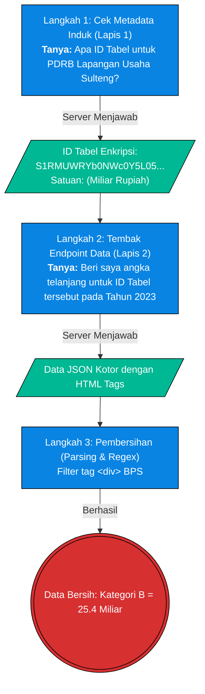

# Pilar 2: End-to-End Data Pipeline - PDRB Sektoral (Bab 1.1)

> **Topik:** Akuisisi Data Produk Domestik Regional Bruto (PDRB) Sektoral Provinsi & Kabupaten  
> **Sumber Data:** API BPS (Sistem SIMDASI)  
> **Skrip Python:** `tools/bpsapi/rebuild_pdrb_sektoral_sulawesi.py` dkk.

Dokumen ini memetakan *End-to-End Pipeline* untuk menarik data mentah dari pangkalan data BPS secara otomatis, melakukan pembersihan (karena JSON BPS seringkali memuat tag HTML), dan mendaratkannya sebagai dataset yang matang secara legal tanpa manipulasi manual.

---

## 1. Stage 1: Data Acquisition (API SIMDASI BPS)

Sistem SIMDASI BPS memiliki arsitektur **dua lapis**. Untuk mengambil angka PDRB yang valid (beserta satuannya seperti "Miliar Rupiah"), *script* harus "bertanya" secara berantai ke *server* BPS.

### Flowchart Akuisisi Data (API Berantai)



---

### 1.1 Anatomi & Cara Menyusun URL (REST Path)

Parameter URL API BPS dipisahkan oleh garis miring `/`. 

**A. URL Lapis 1 (Mencari ID Tabel & Satuan)**
```text
https://webapi.bps.go.id/v1/api/interoperabilitas/datasource/simdasi/id/23/wilayah/{kode_provinsi}/mms_id/531/key/{api_key}/
```
- `/id/23`: Layanan pencarian metadata tabel di SIMDASI.
- `/wilayah/7200000`: Kode wilayah Sulawesi Tengah.
- `/mms_id/531`: Kode kategori "Produk Domestik Regional Bruto".

**B. URL Lapis 2 (Mengambil Angka PDRB Sektoral)**
```text
https://webapi.bps.go.id/v1/api/interoperabilitas/datasource/simdasi/id/25/id_tabel/{id_tabel_dari_lapis_1}/wilayah/{kode_provinsi}/tahun/{tahun}/key/{api_key}/
```
- `/id/25`: Layanan ekstraksi data aktual.
- `/id_tabel/...`: Kunci unik hasil dari Lapis 1.

---

## 2. Stage 2: ETL / Ingestion

Setelah pemanggilan API dari **URL Lapis 2** berhasil, data dikembalikan dalam format `JSON` yang masih sangat kotor. Pada tahap *ingestion* ini, data mentah ditarik dan didaratkan sementara ke memori atau direktori lokal (misalnya di-load ke dalam `data/raw/bps_pdrb/`).

---

## 3. Stage 3: Preprocessing & Cleaning

Proses pembersihan (di-handle oleh skrip `tools/bpsapi/rebuild_pdrb_sektoral_sulawesi.py`) berfokus pada dua masalah utama dari *server* BPS:
1. **Pembersihan Kode HTML:** Respons BPS Lapis 2 sering kali menyertakan kode HTML tebal (seperti `<div class="row">`) langsung di dalam nilai teksnya. Skrip menggunakan teknik *Regex* dan *String Parsing* untuk membuang tag HTML ini agar string `"19.386,98"` bisa diekstrak murni.
2. **Normalisasi Angka:** Mengubah format string angka gaya Indonesia (pemisah ribuan titik, desimal koma) menjadi numerik *float* standar internasional (pemisah desimal titik) agar dapat dikalkulasi oleh Pandas.

---

## 4. Validasi Integritas & Timeframe

Untuk membuktikan data tidak dimanipulasi, Anda dapat menyalin URL di bawah ini secara langsung ke aplikasi Postman (pastikan menggunakan header `User-Agent: Mozilla/5.0` agar tidak diblokir firewall BPS):

**Uji Coba Lapis 1 (Gorontalo):**
```text
https://webapi.bps.go.id/v1/api/interoperabilitas/datasource/simdasi/id/23/wilayah/7500000/mms_id/531/key/06fd644648629502353deaed29fc6383/
```
**Respons Server BPS Asli (Bukti Hukum Lapis 1):**
```json
{
  "id_tabel": "S1RMUWRYb0NWc0Y5L05QQkxzcWw3Zz09",
  "judul": "Produk Domestik Regional Bruto Atas Dasar Harga Berlaku Menurut Lapangan Usaha di Provinsi Gorontalo (miliar rupiah)",
  "kode_tabel": "13.1.1",
  "ketersediaan_tahun": [2014, 2015, 2016, 2017, 2018, 2019, 2020, 2021, 2022, 2023, 2024, 2025]
}
```
*Catatan: Parameter `id_tabel` di atas (`S1RMUWRYb0NWc0Y5...`) merupakan hash unik yang harus digunakan untuk Lapis 2. Anda juga dapat melihat array `ketersediaan_tahun` yang disediakan oleh server.*

**Uji Coba Lapis 2 (Tarik Angka Sektoral Gorontalo 2023):**
Menggunakan `id_tabel` yang didapatkan dari Lapis 1, kita bisa menarik angka nyatanya.
```text
https://webapi.bps.go.id/v1/api/interoperabilitas/datasource/simdasi/id/25/id_tabel/S1RMUWRYb0NWc0Y5L05QQkxzcWw3Zz09/wilayah/7500000/tahun/2023/key/06fd644648629502353deaed29fc6383/
```
**Respons Server BPS Asli (Bukti Hukum Lapis 2):**
```json
[
  {
    "label": "<div class=\"row\">\r\n<div class=\"col-md-2 text-center\">\r\nA\r\n</div>\r\n<div class=\"col-md-10\">\r\nPertanian, Kehutanan, dan Perikanan<br><i>Agriculture, Forestry, and Fishing</i>\r\n</div>\r\n</div>",
    "label_raw": "A Pertanian, Kehutanan, dan Perikanan",
    "variables": {
      "tpwlvidof8": {
        "value": "19.386,98",
        "value_raw": "19.386,98"
      }
    }
  }
]
```
*Catatan: Anda dapat melihat jelas bagaimana tag `<div class="row">` meracuni field `label`. Jika tidak dibersihkan di Stage 3, data ini akan gagal diolah.*

**Tabel Uji Coba Lapis 2 Seluruh Provinsi Sulawesi (Tahun 2023):**
*(Kopi-paste salah satu URL berikut ke dalam Postman untuk memvalidasi secara manual ketersediaan data tiap provinsi)*

| Provinsi | Kode Wilayah | URL Endpoint Postman |
| :--- | :--- | :--- |
| **Sulawesi Utara** | `7100000` | `https://webapi.bps.go.id/v1/api/interoperabilitas/datasource/simdasi/id/25/id_tabel/S1RMUWRYb0NWc0Y5L05QQkxzcWw3Zz09/wilayah/7100000/tahun/2023/key/06fd644648629502353deaed29fc6383/` |
| **Sulawesi Tengah** | `7200000` | `https://webapi.bps.go.id/v1/api/interoperabilitas/datasource/simdasi/id/25/id_tabel/S1RMUWRYb0NWc0Y5L05QQkxzcWw3Zz09/wilayah/7200000/tahun/2023/key/06fd644648629502353deaed29fc6383/` |
| **Sulawesi Selatan** | `7300000` | `https://webapi.bps.go.id/v1/api/interoperabilitas/datasource/simdasi/id/25/id_tabel/S1RMUWRYb0NWc0Y5L05QQkxzcWw3Zz09/wilayah/7300000/tahun/2023/key/06fd644648629502353deaed29fc6383/` |
| **Sulawesi Tenggara** | `7400000` | `https://webapi.bps.go.id/v1/api/interoperabilitas/datasource/simdasi/id/25/id_tabel/S1RMUWRYb0NWc0Y5L05QQkxzcWw3Zz09/wilayah/7400000/tahun/2023/key/06fd644648629502353deaed29fc6383/` |
| **Gorontalo** | `7500000` | `https://webapi.bps.go.id/v1/api/interoperabilitas/datasource/simdasi/id/25/id_tabel/S1RMUWRYb0NWc0Y5L05QQkxzcWw3Zz09/wilayah/7500000/tahun/2023/key/06fd644648629502353deaed29fc6383/` |
| **Sulawesi Barat** | `7600000` | `https://webapi.bps.go.id/v1/api/interoperabilitas/datasource/simdasi/id/25/id_tabel/S1RMUWRYb0NWc0Y5L05QQkxzcWw3Zz09/wilayah/7600000/tahun/2023/key/06fd644648629502353deaed29fc6383/` |

---

### 4.1 Validasi Runtun Waktu (1 Dekade)
Respons dari Lapis 1 SIMDASI dengan jelas mengembalikan *array* ketersediaan waktu:
`"ketersediaan_tahun": [2014, 2015, 2016, 2017, 2018, 2019, 2020, 2021, 2022, 2023, 2024, 2025]`

Hal ini selaras dan memvalidasi keabsahan **narasi laporan D3TLH Celios2** yang menganalisis runtun waktu 10 tahun (1 dekade) ke belakang. Tarikan ETL dimulai dari baseline 2014 hingga titik potong resmi akhir tahun 2024 secara mulus, mengabaikan angka 2025 yang baru berstatus "angka sementara".

---

## 5. Output (Data Provenance)
Berdasarkan `DATA_DICTIONARY.md`, *output* CSV matang yang dihasilkan dari proses *End-to-End Pipeline* ini disalurkan ke dalam ekosistem `data/processed/` dan digunakan oleh Sub-bab 1.1 sebagai berikut:

| Nama File (*Processed*) | Sumber Asli | Digunakan Pada Bab | Deskripsi |
| :--- | :--- | :--- | :--- |
| `sulawesi_pdrb_sektoral_2016_2024.csv` | API BPS (Sistem SIMDASI) | Bab 1.1.1, 1.1.3, 9.3 | Data agregat PDRB Sektoral tingkat Provinsi di Sulawesi (Diklasifikasi ke Ekstraktif vs Akar Rumput). |
| `sulawesi_pdrb_sektoral_kabupaten_2016_2024.csv` | API BPS (Sistem SIMDASI) | Bab 1.1.2 | Data spesifik PDRB Sektoral yang di-breakdown hingga tingkat Kabupaten/Kota di Sulawesi. |
| `sulawesi_ekspor_2022_2026.csv` | API BPS | Bab 1.1 | Agregat total nominal ekspor Sulawesi sebagai pembanding *value-add* terhadap PDRB. |
| `sulawesi_ekspor_detail_2020_2026.csv` | API BPS | Bab 1.1 | Rincian ekspor berdasar *HS Code* yang relevan dengan turunan sektor ekstraktif. |
