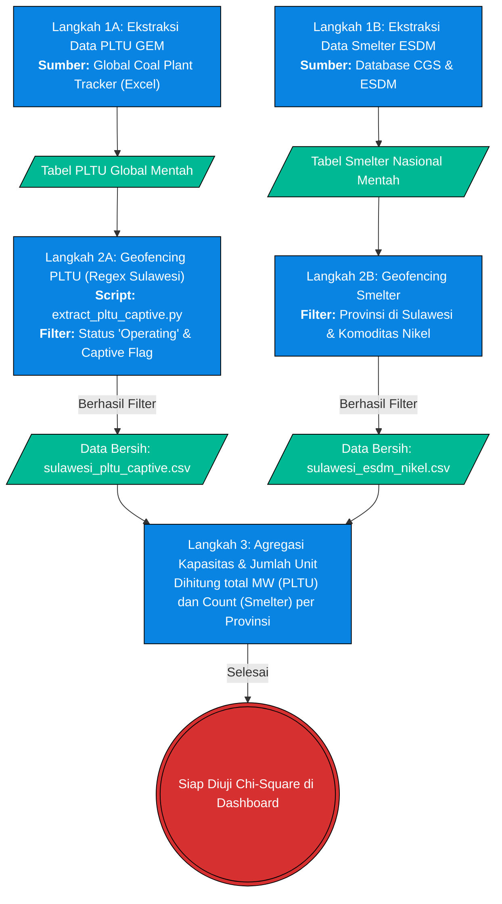

# Pilar 2: End-to-End Data Pipeline - Konsentrasi Smelter & PLTU Captive (Bab 1.2)

> **Topik:** Akuisisi Data Kapasitas PLTU Captive & Fasilitas Smelter di Sulawesi  
> **Sumber Data:** Global Energy Monitor (GEM) & Database Smelter ESDM/CGS  
> **Skrip Python:** `tools/esdm/extract_pltu_captive.py` dan pipeline pembersihan smelter

Dokumen ini memetakan *End-to-End Pipeline* untuk mengekstrak dan membersihkan data infrastruktur energi (PLTU Captive batu bara) dan fasilitas pengolahan industri padat modal (Smelter Nikel) dari pangkalan data internasional dan nasional, lalu memfilternya khusus untuk wilayah Sulawesi.

---

## 1. Stage 1: Data Acquisition (Scraping & File Ingestion)

Data infrastruktur tidak didapatkan melalui satu API, melainkan melalui agregasi dua sumber berbeda. Data PLTU diekstrak dari *Global Coal Plant Tracker*, sementara data smelter disintesakan dari registri ESDM dan CGS.

### Flowchart Akuisisi Data & Filtering Spasial



---

## 2. Stage 2: ETL / Ingestion

Untuk data PLTU Captive, *ingestion* dilakukan dengan membaca *worksheet* `Units` dari file raksasa `Global-Coal-Plant-Tracker-January-2026.xlsx` menggunakan Pandas, lalu dimuat ke dalam *dataframe* memori.

---

## 3. Stage 3: Preprocessing & Cleaning

Proses pembersihan, khususnya pada `extract_pltu_captive.py`, menangani kekacauan penamaan bahasa dan filter status operasional:

| Tahap Pembersihan | Kolom Target | Deskripsi Tindakan (Logika Pandas) | Contoh Transformasi (Before ➔ After) |
| :--- | :--- | :--- | :--- |
| **Penyaringan Negara & Provinsi** | `Country/Area`, `Subnational unit` | Memotong dataset global hanya menjadi Indonesia, lalu menggunakan fungsi *Regex Matching* untuk menjaring provinsi berejaan bahasa Inggris. | `"Central Sulawesi"` ➔ `"Sulawesi Tengah"` |
| **Penyaringan Status Operasional** | `Status`, `Captive` | Membuang status pembangkit yang masih "Planned" atau "Cancelled", serta memfilter spesifik hanya pembangkit listrik industri (*Captive*). | `"Operating"` & `Captive NotNull` ➔ *(Dipertahankan)* |
| **Normalisasi Numerik** | `Start year`, `Capacity (MW)` | Memaksa konversi string ke tipe numerik (`to_numeric`) agar bisa diagregasi dalam kalkulasi emisi kumulatif. | `"250.5"` (Teks) ➔ `250.5` (Float) |
| **Injeksi Flag** | `captive_flag` | Menyematkan boolean absolut pada baris yang lolos seleksi untuk kompabilitas struktur dasbor lama. | `NaN` ➔ `True` |

---

## 4. Validasi Integritas & Timeframe

Uji integritas dilakukan dengan memastikan tidak ada data kapasitas dari luar pulau Sulawesi yang bocor ke dalam kalkulasi, serta memverifikasi bahwa *Start year* hanya mencakup pembangkit yang benar-benar aktif (Status: *Operating*).

**4.1 Cuplikan Logika Filter Spasial PLTU:**
```python
# Filter for Sulawesi Provinces (English names in GEM)
provs = ['North Sulawesi', 'South Sulawesi', 'Southeast Sulawesi', 'Central Sulawesi', 'West Sulawesi', 'Gorontalo']
pattern = '|'.join(provs)

# Using Subnational unit (province, state)
sulawesi_df = indo_df[indo_df['Subnational unit (province, state)'].str.contains(pattern, na=False, case=False)].copy()
```
*Catatan: Skrip secara eksplisit memetakan kembali nama Inggris ke Bahasa Indonesia (`prov_map`) agar sinkron dengan peta JSON koordinat Streamlit.*

---

## 5. Output (Data Provenance)
Berdasarkan `DATA_DICTIONARY.md`, *output* CSV matang yang dihasilkan dari proses *End-to-End Pipeline* ini disalurkan ke dalam ekosistem `data/processed/` dan digunakan oleh Sub-bab 1.2:

| Nama File (*Processed*) | Sumber Asli | Digunakan Pada Bab | Deskripsi |
| :--- | :--- | :--- | :--- |
| `sulawesi_pltu_captive.csv` | GEM Coal Plant Tracker | Bab 1.2, Peta Spasial | Data bersih pembangkit listrik *off-grid* industri beserta nilai kapasitas (MW) dan tahun mulai operasi. |
| `sulawesi_esdm_nikel.csv` | Database Smelter ESDM & CGS | Bab 1.2, Peta Spasial | Data titik koordinat fasilitas hilirisasi nikel (Smelter) per provinsi yang berstatus operasional. |
