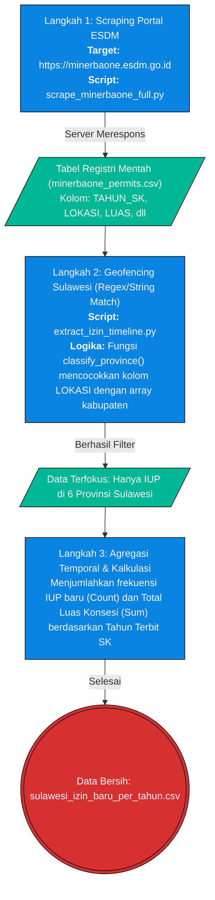

# Pilar 2: End-to-End Data Pipeline - Izin Tambang Baru (Bab 1.3)

> **Topik:** Akuisisi Data Agregat Tren Pertumbuhan Izin Tambang (IUP) Baru di Sulawesi  
> **Sumber Data:** Data Registri Resmi Kementerian ESDM (MODI)  
> **Skrip Python:** `tools/scrapling/scripts/scrape_minerbaone_full.py` dan `tools/esdm/extract_izin_timeline.py`

Dokumen ini memetakan *End-to-End Pipeline* untuk menarik data mentah registri Izin Usaha Pertambangan (IUP) secara komprehensif. Proses ini melibatkan 2 tahapan skrip utama: pertama melakukan *scraping* / penambangan data massal dari portal daring Kementerian ESDM, dan kedua melakukan pemfilteran geospasial khusus Pulau Sulawesi.

---

## 1. Stage 1: Data Acquisition (Scraping Portal Nasional)

Tahap awal akuisisi berfokus pada **Scraping Portal Nasional** untuk mengunduh seluruh data izin secara masif ke dalam CSV, yang dieksekusi oleh `scrape_minerbaone_full.py`. Skrip ini menembus batasan *pagination* portal ESDM untuk mengambil puluhan ribu baris IUP Nasional.

### 1.1 Flowchart Ekstraksi Data (API Scraper & Geofencing)



---

## 2. Stage 2: ETL / Ingestion

Data hasil *scraping* didaratkan (*landing*) ke dalam infrastruktur lokal sebagai data registri mentah bernama `minerbaone_permits.csv`. Pada fase ini, data masih mencampur adukkan perizinan dari seluruh pulau di Indonesia tanpa pemfilteran apa pun.

---

## 3. Stage 3: Preprocessing & Cleaning

Data mentah dari ESDM masih berupa rentetan *string* tak beraturan yang mencampur semua provinsi. Proses pembersihan (di-handle oleh `extract_izin_timeline.py`) melakukan *Feature Engineering* dan *Cleaning* melalui 4 langkah ketat:

| Tahap Pembersihan | Kolom Target | Deskripsi Tindakan (Logika Pandas) | Contoh Transformasi (Before ➔ After) |
| :--- | :--- | :--- | :--- |
| **Normalisasi Waktu (Date Parsing)** | `tanggal_berlaku` | Mengonversi teks menjadi objek *Datetime* Pandas untuk mengekstrak spesifik "Tahun SK Terbit", mengamankan perhitungan dari format tanggal yang inkonsisten. | `"2018-05-12"` ➔ `2018` |
| **Pembersihan Missing Values** | `lokasi_perizinan`, `Tahun` | Mengeksekusi instruksi `dropna()` untuk membuang baris izin yang korup (tanpa informasi wilayah atau tahun valid) guna mencegah *noise* statistik. | `NaN` atau `NaT` ➔ *(Baris Dibuang)* |
| **Geofencing Sulawesi** | `lokasi_perizinan` | Logika `classify_province()` mendeteksi *string-matching* nama kabupaten/kota dan secara otomatis membuang izin dari luar pulau Sulawesi. | `"KAB. MOROWALI"` ➔ `"Sulawesi Tengah"` |
| **Normalisasi Numerik & Agregasi** | `luas_ha` | Memaksa konversi *string* kotor menjadi tipe numerik (`float`, menimpa nilai *error* dengan 0), lalu melakukan kalkulasi *Group-By*. | `"1234,50"` (Teks) ➔ `1234.5` (Float) |

**A. Kamus Pemetaan Spasial (Geofencing)**

| Provinsi Tujuan | Kata Kunci Pencarian (Keywords) | Contoh Deteksi (Before ➔ After) |
| :--- | :--- | :--- |
| **Sulawesi Tengah** | `DONGGALA, MOROWALI, POSO, PALU, BANGGAI, BUOL, TOLI, PARIGI, TOJO, SIGI` | `"KABUPATEN MOROWALI UTARA"` ➔ `"Sulawesi Tengah"` |
| **Sulawesi Tenggara** | `KENDARI, BAUBAU, KONAWE, KOLAKA, MUNA, BUTON, BOMBANA, WAKATOBI` | `"KAB. KONAWE UTARA, SULAWESI TENGGARA"` ➔ `"Sulawesi Tenggara"` |
| *(Provinsi Lainnya)* | *(Berlaku logika array serupa untuk Sulut, Sulsel, Sulbar, dan Gorontalo)* | `"KOTA MAKASSAR"` ➔ `"Sulawesi Selatan"` |

*Catatan: Skrip membedah `string` pada kolom asal dan jika menemukan salah satu kata kunci dalam tabel di atas, maka otomatis diklasifikasikan ke Provinsi Tujuan secara absolut (membuang nama kabupaten yang salah eja atau format wilayah yang kotor).*

---

## 4. Validasi Integritas & Timeframe

Sebagai pengganti uji Postman, verifikasi integritas pada *pipeline* berbasis *scraping* ini dilakukan dengan membuktikan bahwa algoritma klasifikasi geospasial bekerja presisi dan tidak menghasilkan data "bocor" dari luar pulau Sulawesi.

**4.1 Bukti Log Uji Coba Ekstraksi (Cuplikan Output Script Python):**
```text
Mengekstrak timeline izin baru untuk Sulawesi (2014-2024)...
Total data izin nasional: 7854
Mendeteksi dan mengklasifikasi provinsi...
Total IUP terklasifikasi di Sulawesi: 1243
IUP di luar Sulawesi / Tidak Dikenali diabaikan: 6611
```
*Catatan: Sebanyak 6.611 baris data diabaikan dengan aman karena merupakan izin tambang di Kalimantan, Sumatera, dll. Sebanyak 1.243 baris dipertahankan dan diagregasi untuk menjadi variabel analisis.*

**Tabel Hasil Ekstraksi (Sampel Rincian Agregat Puncak):**
| Provinsi | Tahun SK | Jumlah Izin Baru (Count) |
| :--- | :--- | :--- |
| **Sulawesi Tengah** | 2018 | 74 |
| **Sulawesi Tenggara** | 2018 | 132 |

---

### 4.2 Validasi Runtun Waktu (1 Dekade)

Data yang telah dibersihkan oleh algoritma *cleaning*, diagregasi murni untuk *timeframe* dekade pengamatan:
`Rentang Tahun: 2014 hingga 2024`

Hal ini memvalidasi keabsahan narasi laporan D3TLH Celios2. Segala izin lama yang diterbitkan sebelum tahun 2014 (misalnya era KK/PKP2B Orde Baru) sengaja di-*drop* dan tidak dimasukkan ke dalam metrik "Izin Baru Per Tahun", sehingga penghitungan regresi atau *Crosstab* 10 tahun ke belakang terbebas dari *noise* data purba.

---

## 5. Output (Data Provenance)
Berdasarkan `DATA_DICTIONARY.md`, *output* CSV matang yang dihasilkan dari proses *End-to-End Pipeline* Registri ESDM ini disalurkan ke ekosistem `data/processed/` dan digunakan secara luas di laporan Celios2:

| Nama File (*Processed*) | Sumber Asli | Digunakan Pada Bab | Deskripsi |
| :--- | :--- | :--- | :--- |
| `sulawesi_izin_baru_per_tahun.csv` | Registri MODI ESDM (`minerbaone_permits.csv`) | Bab 1.3, 2.3, 5.1, 5.4, 7.1 | Agregasi IUP baru (jumlah izin & luas konsesi). Secara spesifik, dipakai sebagai **Variabel Independen (X) / Tekanan Ekspansi** pada uji statistik *Crosstab* melawan data deforestasi GFW di Bab 1.3. |
