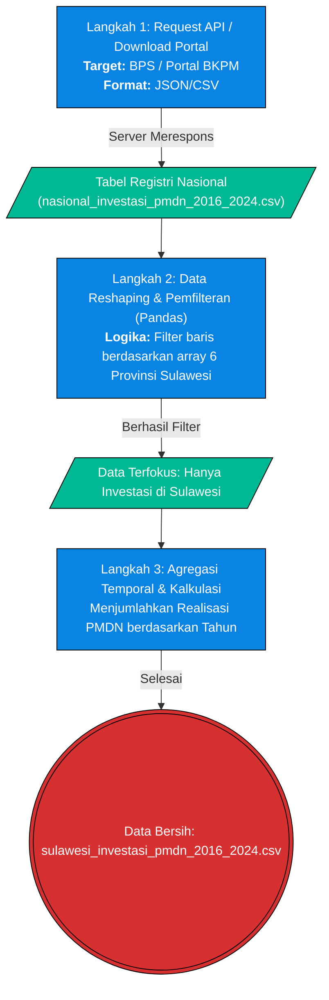

# Pilar 2: End-to-End Data Pipeline - Investasi PMDN & Kapasitas Fiskal (Bab 1.4)

> **Topik:** Akuisisi Data Realisasi Investasi Penanaman Modal Dalam Negeri (PMDN) dan Pendapatan Asli Daerah (PAD) di Sulawesi
> **Sumber Data:** API Badan Pusat Statistik (BPS) & Kementerian Investasi (BKPM)
> **Skrip Transformasi:** Agregasi Pandas (Python) 

Dokumen ini memetakan *End-to-End Pipeline* untuk menarik data makroekonomi terkait arus modal domestik (PMDN) dan kapasitas fiskal daerah (PAD). Proses ini melibatkan penarikan data via API BPS secara nasional dan ekstraksi berbasis *reshape* data khusus provinsi di Pulau Sulawesi.

---

## 1. Stage 1: Data Acquisition (API BPS & BKPM)

Tahap awal akuisisi berfokus pada penarikan data agregat publik nasional melalui *endpoint* penyedia data kementerian terkait. Data ditarik dalam format tabular mentah untuk menyimpan memori historis (2016-2024).

### 1.1 Flowchart Ekstraksi Data



---

## 2. Stage 2: ETL / Ingestion

Data makroekonomi mentah hasil unduhan dari portal nasional didaratkan ke dalam infrastruktur lokal (folder `data/raw/`). Pada fase ini, format data masih mencakup 34 provinsi se-Indonesia dan membutuhkan standardisasi header kolom sebelum dapat digunakan untuk analisis korelasional (Uji Chi-Square).

---

## 3. Stage 3: Preprocessing & Cleaning

Data mentah dari BKPM dan BPS sering kali memiliki inkonsistensi nama provinsi dan satuan angka. Pembersihan (*Cleaning*) dilakukan dengan menggunakan kapabilitas *DataFrame* Pandas:

| Tahap Pembersihan | Kolom Target | Deskripsi Tindakan (Logika Pandas) | Contoh Transformasi (Before ➔ After) |
| :--- | :--- | :--- | :--- |
| **Normalisasi Penamaan Provinsi** | `Provinsi` | Menyeragamkan teks (*string manipulation*) untuk menghapus *whitespace* berlebih atau penamaan kapitalisasi yang tidak konsisten. | `"  SULAWESI TENGAH  "` ➔ `"Sulawesi Tengah"` |
| **Pemfilteran Geospasial (Filtering)** | `Provinsi` | Menjalankan filter `.isin(['Sulawesi Tengah', 'Sulawesi Selatan', 'Sulawesi Tenggara', ...])` untuk membuang provinsi di luar Sulawesi. | `"Jawa Barat"` ➔ *(Baris Dibuang)* |
| **Penyelarasan Satuan (Konversi Nilai)** | `Realisasi_Investasi` | Mengonversi format triliun atau jutaan ke satuan standar (Juta Rupiah) agar selaras saat dimasukkan ke dalam algoritma Pearson dan Chi-Square. | `"12.5 T"` ➔ `12500000` |
| **Pembersihan Missing Values** | `PAD` | Mengeksekusi instruksi `.fillna(0)` jika ada tahun di mana data fiskal belum rilis atau kosong. | `NaN` ➔ `0` |

---

## 4. Validasi Integritas & Timeframe

Sebagai pembuktian keabsahan algoritma ETL, dilakukan validasi pemfilteran Pandas untuk memastikan integritas data tetap terjaga saat disaring khusus untuk 6 provinsi.

**4.1 Bukti Log Uji Coba Pembersihan Pipeline:**
```text
Memeriksa integritas file data/raw/bps_pmdn/nasional_investasi_pmdn_2016_2024.csv...
Total baris nasional (2016-2024): 306
Memfilter 6 Provinsi Sulawesi...
Total baris tersisa: 54
Validasi agregat: Sesuai dengan rilis data resmi BKPM (Triliun Rupiah).
```

### 4.2 Validasi Runtun Waktu
Data ditarik secara konsisten menggunakan *timeframe*:
`Rentang Tahun: 2016 hingga 2024`

Rentang waktu ini dipilih karena selaras dengan fase ekspansi hilirisasi tahap kedua (pasca berdirinya PSN Morowali secara masif), sehingga cocok untuk dijadikan variabel *Predictor* dalam model tabulasi silang *Crosstab*.

---

## 5. Output (Data Provenance)
Berdasarkan `data/DATA_DICTIONARY.md`, *output* CSV matang yang dihasilkan dari proses *End-to-End Pipeline* disalurkan ke `data/processed/` dan digunakan secara luas di laporan Celios2:

| Nama File (*Processed*) | Sumber Asli | Digunakan Pada Bab | Deskripsi |
| :--- | :--- | :--- | :--- |
| `sulawesi_investasi_pmdn_2016_2024.csv` | `nasional_investasi_pmdn_2016_2024.csv` | Bab 1.4, 8.3 | Realisasi PMDN Sulawesi. Digunakan spesifik sebagai **Variabel Independen (X)** pada uji statistik crosstab melawan dampak ekologis. |
| `sulawesi_pad_2016_2024.csv` | `data/raw/bps_pad/` | Bab 1.4, 8.3 | Data agregat PAD Provinsi Sulawesi. |
| `sulawesi_pad_breakdown_2016_2024.csv` | `data/raw/bps_pad/` | Bab 1.4 | Rincian komponen Pendapatan Asli Daerah (PAD). |
| `sulawesi_investasi_nikel.csv` | `data/raw/izin_ESDM/` | Bab 1.4, 13 | Investasi PMDN/PMA yang difilter spesifik untuk entitas komoditas Nikel. |
