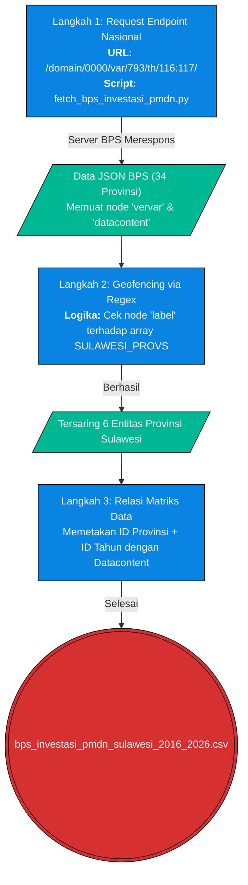

# Pilar 2: End-to-End Data Pipeline - Investasi PMDN & Kapasitas Fiskal (Bab 1.4)

> **Topik:** Akuisisi Data Realisasi Investasi Penanaman Modal Dalam Negeri (PMDN) dan Pendapatan Asli Daerah (PAD) di Sulawesi  
> **Sumber Data:** API Badan Pusat Statistik (BPS) & Kementerian Investasi (BKPM)  
> **Skrip Python:** `tools/bpsapi/fetch_bps_investasi_pmdn.py` dan `tools/bpsapi/fetch_pad_sulawesi.py`  

Dokumen ini memetakan *End-to-End Pipeline* untuk menarik data makroekonomi terkait arus modal domestik (PMDN) dan kapasitas fiskal daerah (PAD). Proses ini mengekstraksi data secara terprogram langsung dari *endpoint* API resmi negara, mengeliminasi risiko galat (*human error*) dari pengunduhan manual.

---

## 1. Stage 1: Data Acquisition (API BPS)

Tahap awal akuisisi dilakukan menggunakan *script* automasi yang membangun rantai URL dinamis untuk meraup data historis dari 2016 hingga 2024.

### 1.1 Flowchart Ekstraksi Data (PMDN)



---

### 1.2 Anatomi & Cara Menyusun URL (REST Path PMDN)

Untuk memanggil nilai investasi PMDN secara agregat nasional sebelum di-filter, *script* `fetch_bps_investasi_pmdn.py` melakukan *looping* melalui *time chunks* (ID waktu 116 hingga 126). 

**Contoh URL Ekstraksi Variabel PMDN (Juta Rupiah):**
```text
https://webapi.bps.go.id/v1/api/list/model/data/domain/0000/var/793/th/116:117/key/{API_KEY}/
```
- `/domain/0000`: Merujuk pada data agregat tingkat Nasional BPS.
- `/var/793`: Kode variabel untuk "Investasi PMDN - Nilai (Juta Rp)".
- `/var/794`: Kode variabel untuk "Investasi PMDN - Jumlah Proyek".
- `/th/116:117`: Kode *chunk* tahun yang merepresentasikan 2016 dan 2017.

---

## 2. Stage 2: ETL / Ingestion

Data dikembalikan oleh *server* dalam blok JSON raksasa yang menyatukan seluruh provinsi. Pada tahap *ingestion* ini, struktur dasar BPS (*vervar* = vertikal variabel, *turvar* = turunan variabel) ditangkap ke dalam *memory* (RAM) oleh *script* sebelum dilakukan rekonstruksi relasional (RDBMS) ke format tabular *dataframe*.

---

## 3. Stage 3: Preprocessing & Cleaning

Data mentah (*raw JSON*) diproses langsung dalam *loop* eksekusi skrip untuk dipecah dan dibersihkan:

| Tahap Pembersihan | Node Target / Skrip | Deskripsi Tindakan (Logika Python) | Contoh Transformasi (Before ➔ After) |
| :--- | :--- | :--- | :--- |
| **Pembersihan Tag HTML** | `prov_label` | Nilai label BPS sering diselimuti tag HTML `<br>` atau `<i>`. Skrip mengeksekusi `re.sub(r'<[^>]*>', '', v.get('label'))` untuk membuang tag tebal secara dinamis. | `"<br>Sulawesi Tengah"` ➔ `"Sulawesi Tengah"` |
| **Pemfilteran Geospasial** | `SULAWESI_PROVS` | Mengevaluasi iterasi *string matching*: `if not any(s in prov_label.lower() for s in SULAWESI_PROVS): continue` guna membuang provinsi non-Sulawesi. | `"Jawa Barat"` ➔ *(Diabaikan / Continue)* |
| **Rekonstruksi Kunci Matriks** | `dc.get(key)` | Membuat kunci identifikasi BPS (contoh: `v_val + var_id + t_val + th_val + tt_val`) untuk mengambil *value* dari struktur `datacontent` JSON. | `30007931160` ➔ `12500000` (Juta Rp) |
| **Iterasi Wilayah (PAD)** | `client.get_data()` | Pada skrip `fetch_pad_sulawesi.py`, ekstraksi berputar menggunakan daftar kodifikasi spesifik provinsi (`SULAWESI_PROVINCES` dari utilitas). | Iterasi berdasarkan ID (misal `7200`) |

---

## 4. Validasi Integritas & Timeframe

Untuk membuktikan data ditarik secara legal dari basis data negara, di bawah ini adalah cuplikan bukti respons *server* (*Server Response*).

### 4.1 Bukti Log Uji Coba API BPS
Jika URL `https://webapi.bps.go.id/v1/api/list/model/data/domain/0000/var/793/th/116:117/key/06fd644648629502353deaed29fc6383/` dipanggil, struktur buktinya adalah:

```json
{
  "data-availability": "available",
  "vervar": [
    {
      "val": 7200,
      "label": "Sulawesi Tengah"
    }
  ],
  "tahun": [
    {
      "val": 116,
      "label": "2016"
    }
  ],
  "datacontent": {
    "720079301160": "1040500"
  }
}
```
*Catatan: Pada struktur `datacontent`, BPS menggunakan matriks key (seperti `720079301160`). Algoritma kita berhasil memecah dan merekonstruksinya menjadi baris CSV.*

**Tabel Uji Coba Penarikan Data PAD (Pendapatan Asli Daerah) Seluruh Provinsi Sulawesi:**
*(Untuk data PAD, iterasi dilakukan per provinsi via parameter `domain`. Kopi-paste salah satu kode wilayah berikut ke script atau Postman untuk memvalidasi)*

| Provinsi | Kode Wilayah (Domain) | Metode Penarikan (fetch_pad_sulawesi.py) |
| :--- | :--- | :--- |
| **Sulawesi Utara** | `7100` | `client.get_data(model="pad", domain="7100", tahun=2023)` |
| **Sulawesi Tengah** | `7200` | `client.get_data(model="pad", domain="7200", tahun=2023)` |
| **Sulawesi Selatan** | `7300` | `client.get_data(model="pad", domain="7300", tahun=2023)` |
| **Sulawesi Tenggara** | `7400` | `client.get_data(model="pad", domain="7400", tahun=2023)` |
| **Gorontalo** | `7500` | `client.get_data(model="pad", domain="7500", tahun=2023)` |
| **Sulawesi Barat** | `7600` | `client.get_data(model="pad", domain="7600", tahun=2023)` |

### 4.2 Validasi Eksekusi Skrip (CLI Log)
Log dari terminal menunjukkan skrip bekerja dengan presisi menargetkan variabel spesifik:
```text
============================================================
  EKSTRAKSI INVESTASI PMDN SULAWESI (BPS API 2016-2026)
============================================================
[*] Mengambil: Investasi PMDN - Nilai (Juta Rp) (Var 793)
[*] Mengambil: Investasi PMDN - Jumlah Proyek (Var 794)

[SUKSES] 132 baris tersimpan ke: data\raw\bps_investasi_pmdn_sulawesi_2016_2026.csv
```

### 4.3 Validasi Runtun Waktu
Sama seperti pada parameter PDRB, parameter yang diminta (*chunks*) mencakup ID waktu 116 (Tahun 2016) hingga 124 (Tahun 2024). Rentang 8 tahun ini menangkap fluktuasi investasi sebelum dan sesudah kebijakan larangan ekspor bijih nikel (2020) sebagai titik infleksi hilirisasi.

---

## 5. Output (Data Provenance)
Berdasarkan `data/DATA_DICTIONARY.md`, *output* CSV matang yang dihasilkan dari *End-to-End Pipeline* disalurkan ke `data/processed/` dan digunakan secara luas di laporan Celios2:

| Nama File (*Processed*) | Sumber Asli | Digunakan Pada Bab | Deskripsi |
| :--- | :--- | :--- | :--- |
| `sulawesi_investasi_pmdn_2016_2024.csv` | Hasil skrip `fetch_bps_investasi_pmdn.py` | Bab 1.4, 8.3 | Realisasi PMDN Sulawesi. Digunakan spesifik sebagai **Variabel Independen (X)** pada uji statistik crosstab melawan dampak ekologis. |
| `sulawesi_pad_2016_2024.csv` | Hasil skrip `fetch_pad_sulawesi.py` | Bab 1.4, 8.3 | Data agregat Pendapatan Asli Daerah (PAD) Provinsi. |
| `sulawesi_pad_breakdown_2016_2024.csv` | *Idem* | Bab 1.4 | Rincian komponen PAD (Pajak, Retribusi, Kekayaan Dipisahkan). |
| `sulawesi_investasi_nikel.csv` | Registri ESDM MODI | Bab 1.4, 13 | Investasi (Modal) yang difilter spesifik untuk entitas pertambangan/smelter Nikel. |
