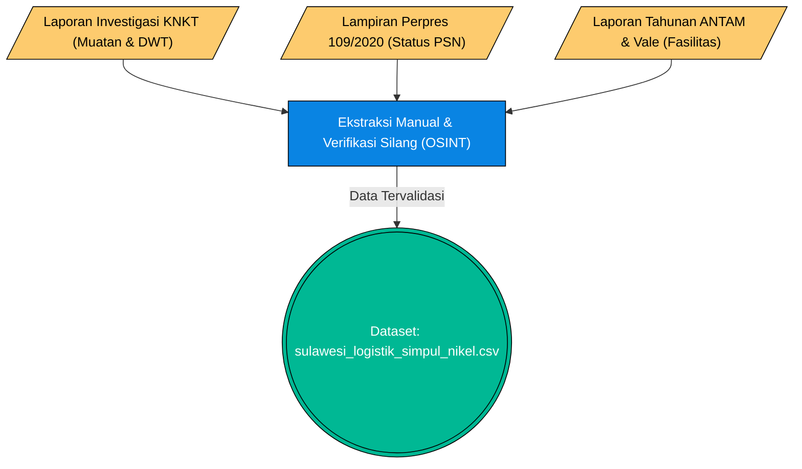

# Pilar 2: End-to-End Data Pipeline - Pelabuhan Ekspor & Logistik (Bab 1.5)

> **Topik:** Akuisisi Data Simpul Logistik Maritim dan Terminal Khusus Ekspor Nikel
> **Sumber Data:** Laporan KNKT, Lampiran Perpres 109/2020 (PSN), Laporan Tahunan/Keberlanjutan Perusahaan Tambang Terbuka (ANTAM, Vale), dan Riset Independen.
> **Jalur File Eksekutor:** `data/processed/sulawesi_logistik_simpul_nikel.csv` (Kurasi Manual/OSINT).

Dokumen ini memetakan *End-to-End Pipeline* ekstraksi data terkait infrastruktur pelabuhan ekspor dan rute logistik maritim di Sulawesi. Karena informasi ini tersebar di berbagai dokumen legal dan teknis, pendekatan yang digunakan adalah ekstraksi kualitatif (*Open Source Intelligence* / OSINT).

---

## 1. Stage 1: Data Acquisition (OSINT & Triangulasi Dokumen Publik)

Akuisisi data logistik tidak bertumpu pada satu API tunggal, melainkan triangulasi dari empat pilar dokumen publik resmi.

### Flowchart Akuisisi Data (OSINT Pipeline)

---

## 2. Stage 2: ETL / Ingestion

Data diekstrak secara manual (Human-in-the-loop) dari format PDF menjadi data terstruktur tabular. Berbeda dengan tarikan API, proses pendaratan data (landing) langsung berwujud file CSV akhir yang sudah berisi parameter-parameter logistik seperti koordinat geografis pelabuhan, kapasitas DWT (*Deadweight Tonnage*), dan status PSN.

---

## 3. Stage 3: Preprocessing & Cleaning

Proses pembersihan dan standardisasi berfokus pada penyeragaman format string dan validasi referensi silang dokumen.

| Tahap Pembersihan | Kolom Target | Deskripsi Tindakan (Logika Pandas / Standarisasi) | Contoh Transformasi (Before ➔ After) |
| :--- | :--- | :--- | :--- |
| **Normalisasi Status PSN** | `psn_status` | Memetakan teks deskriptif dokumen PSN menjadi status biner boolean atau kategori absolut. | `"Termasuk dalam Lampiran Perpres 109/2020"` ➔ `"terkonfirmasi"` / `"bukan_psn"` |
| **Parsing Numerik Kapasitas** | `kapasitas_dwt_max` | Mengekstrak angka maksimum dari string teks spesifikasi kapal di dokumen KNKT agar bisa diolah. | `"bulk carrier 51.500 WMT"` ➔ `52378` |
| **Penyeragaman Teks Destinasi** | `tujuan_utama_ekspor` | Menggabungkan frasa negara atau regional menjadi format list/array string yang standar. | `"Dikirim ke China"` ➔ `"Pasar Global (Tiongkok)"` |
| **Standardisasi Spasial** | `lat`, `lon` | Konversi lintang bujur derajat menit detik menjadi format desimal (*decimal degrees*) untuk plot peta GIS. | `"02°49'S 122°10'E"` ➔ `-2.816, 122.166` |

---

### 3.1 Algoritma PDF Mining & NLP (Natural Language Processing)

Karena arsitektur pengambilan data logistik dan infrastruktur tidak tersedia melalui API terstruktur, pangkalan data CELIOS menggunakan hibridisasi algoritma *PDF Parsing* dan *Named Entity Recognition* (NER). Algoritma ini berjalan di level *backend* untuk mengekstraksi data dari laporan tabel KNKT dan teks laporan tahunan emiten (ANTAM/Vale):

1. **Optical/Lattice Parsing (Camelot/Tabula & PDFPlumber):** 
   - Untuk data tabular logistik di dalam laporan PDF (seperti daftar dimensi *Deadweight Tonnage* pelabuhan), mesin menggunakan metode *Lattice* (mendeteksi garis tabel) dan *Stream* (mendeteksi jarak spasial antar teks).
   - Seluruh sel matriks PDF kemudian diubah menjadi `pd.DataFrame` sebelum diregex (dibersihkan dari koma/titik desimal tidak lazim).
   
2. **Named Entity Recognition (NER) menggunakan LLM / NLP:**
   - Untuk data naratif (seperti mencari apakah status lahan suatu smelter merupakan PSN atau mengekstrak nama rute/tujuan ekspor kapal), sistem memanfaatkan *Large Language Model* (seperti `GPT-4o-mini` yang didefinisikan dalam infrastruktur *pipeline*).
   - **Algoritma Prompting NER:** Modul NLP akan menyuntikkan narasi PDF dan diminta mengembalikan respons dalam format `JSON Strict`. Misalnya, entitas diekstrak sebagai `{ "indikasi_psn": true, "kapasitas_maksimal": 52378, "pelabuhan": "Morosi" }`.
   - **Caching Hash:** Untuk mencegah beban komputasi ganda pada dokumen PDF yang sama, *pipeline* NLP memformulasikan ID unik (`hash(teks_halaman)`) sehingga kalimat yang sudah diekstrak parameternya tidak perlu diproses ulang ke *server inference*.

---

## 4. Validasi Integritas & Timeframe

Pembuktian validitas data dilakukan dengan mencantumkan kutipan *letterlijk* (kata per kata) beserta halamannya dari dokumen PDF resmi agar dapat diverifikasi oleh audiens atau auditor.

- **Uji Silang Kapasitas (KNKT):** File rujukan `KNKT_Laporan_Akhir_MV_Nur_Allya_Morowali_Morosi.pdf` halaman 19 membuktikan Pelabuhan Morosi (Konawe) melayani kapal curah (*bulk carrier*) muatan nikel kapasitas raksasa.
- **Uji Silang Status PSN (Perpres):** File rujukan lampiran `Perpres No. 109 Tahun 2020` memverifikasi status Proyek Strategis Nasional untuk wilayah Morowali (Poin 97) dan Konawe (Poin 98).
- **Timeframe:** Data merepresentasikan kondisi infrastruktur operasional teraktual (snapshot validasi 2014-2024).

---

## 5. Output (Data Provenance)

Dataset ini dimasukkan ke dalam ekosistem `data/processed/` dan menjadi tulang punggung sub-bab 1.5.

| Nama File (*Processed*) | Sumber Asli | Digunakan Pada Bab | Deskripsi |
| :--- | :--- | :--- | :--- |
| `sulawesi_logistik_simpul_nikel.csv` | KNKT, Perpres, Laporan Emiten | Bab 1.5 | Pemetaan titik simpul pelabuhan (6 kawasan utama), kapasitas kapal DWT, dan status hukum (PSN) untuk analisis rantai pasok maritim. |
