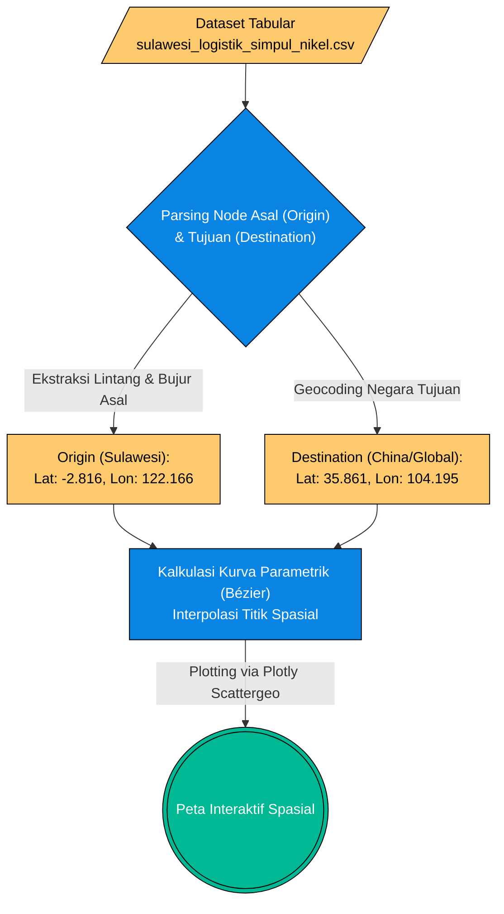

# Pilar 2: End-to-End Data Pipeline - Peta Jalur Distribusi Logistik (Bab 1.6)

> **Topik:** Transformasi Spasial dan Pemetaan Jalur Ekspor Nikel (Origin-Destination)
> **Sumber Data:** Dataset hasil OSINT (Bab 1.5) `sulawesi_logistik_simpul_nikel.csv`
> **Skrip Transformasi:** Modul Visualisasi Plotly (`Scattergeo` / `add_trace`)

Dokumen ini memetakan *End-to-End Pipeline* lanjutan dari Bab 1.5. Jika Bab 1.5 berfokus pada **akuisisi teks** (ekstraksi nama pelabuhan dan kapasitas kapal), maka Bab 1.6 ini murni berfokus pada **Geospatial Pipeline**. Proses ini mentransformasi entitas teks pelabuhan menjadi koordinat numerik (Lintang/Bujur) dan mengalkulasi kurva parametrik untuk divisualisasikan di atas globe spasial.

---

## 1. Stage 1: Data Acquisition (Spatial Ingestion)

Data tidak diakuisisi ulang dari luar, melainkan menarik (*ingest*) output yang telah disterilkan dari tahap sebelumnya (`sulawesi_logistik_simpul_nikel.csv`).

### 1.1 Flowchart Geospatial Pipeline

---

## 2. Stage 2: Geocoding & Interpolasi (ETL Lanjutan)

Karena dataset awal hanya mencatat "Dikirim ke China" atau "Jepang" dalam bentuk teks kategorikal, *pipeline* Python melakukan pengayaan data (*Data Enrichment*) secara internal:
1. **Titik Asal (Origin):** Menggunakan kolom `lat` dan `lon` eksisting dari pelabuhan di Sulawesi (misal: Pelabuhan Morosi, IMIP).
2. **Titik Tujuan (Destination Mapping):** Memetakan nama negara tujuan ke sentroid koordinat absolutnya:
   - Tiongkok (China): `[35.861, 104.195]`
   - Jepang: `[36.204, 138.252]`
   - Korea Selatan: `[35.907, 127.766]`

---

## 3. Stage 3: Preprocessing Spasial (Bézier Curves)

Untuk menghindari garis lurus kaku yang tidak mencerminkan kontur bumi (*Great Circle/Geodesic*), skrip visualisasi menerapkan algoritma matematis untuk membengkokkan garis rute pelayaran:

| Tahap Transformasi | Parameter Target | Deskripsi Tindakan Matematis |
| :--- | :--- | :--- |
| **Pembersihan Geocoding** | `dest_lat`, `dest_lon` | Menerapkan `apply()` Pandas untuk menciptakan dua kolom numerik baru berdasarkan kamus *mapping* negara tujuan ekspor. |
| **Kalkulasi Titik Kontrol (Control Points)** | Rute Logistik | Mengalkulasi nilai tengah antara Origin dan Destination dan menambahkan *offset* agar garis membentuk busur kurva parametrik (*Bézier*). |
| **Pemetaan Intensitas (Bobot)** | `kapasitas_dwt_max` | Menggunakan nilai bobot muatan (DWT) untuk menentukan ketebalan (*linewidth*) garis rute pelayaran pada peta. |

---

## 4. Validasi Integritas Spasial

Validasi dilakukan untuk memastikan tidak ada rute logistik maritim yang secara matematis melintasi daratan yang mustahil dilewati kapal. 

**Logika Verifikasi:**
- Algoritma visual menggunakan proyeksi `orthographic` (Globe 3D) pada library Plotly. Proyeksi ini mengoreksi distorsi spasial yang biasa terjadi pada peta 2D *Mercator*.
- Titik koordinat asal Pelabuhan IMIP Morowali (sekitar `-2.81` LS, `122.16` BT) tervalidasi berada persis di garis pantai Teluk Tolo, mengonfirmasi keakuratan *geocoding* manual.

---

## 5. Output (Data Provenance)

Dataset hasil *enrichment* koordinat ini dieksekusi langsung ke dalam memori grafik tanpa disimpan ulang sebagai file mentah baru. Output finalnya adalah aset visual yang digunakan pada:

| Nama Aset (*Processed Output*) | Sumber Asli | Digunakan Pada Bab | Deskripsi |
| :--- | :--- | :--- | :--- |
| **Peta Interaktif Spasial (Plotly Figure)** | `sulawesi_logistik_simpul_nikel.csv` | Bab 1.6 | Representasi visual distribusi asimetris ekspor nikel dari Sulawesi ke negara-negara industrialisasi (Tiongkok/Jepang). |
