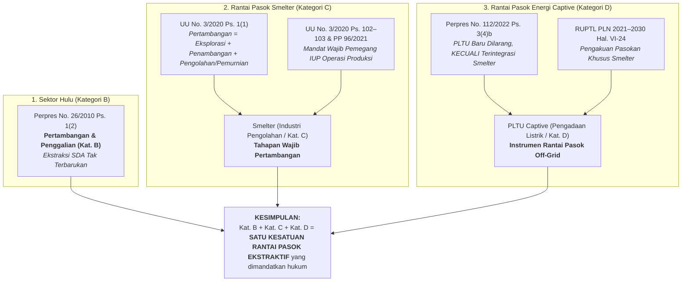
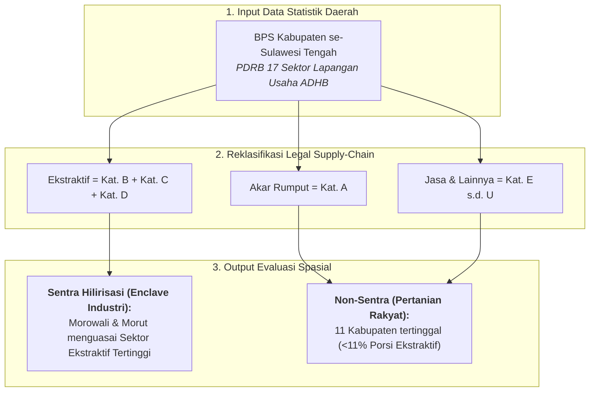
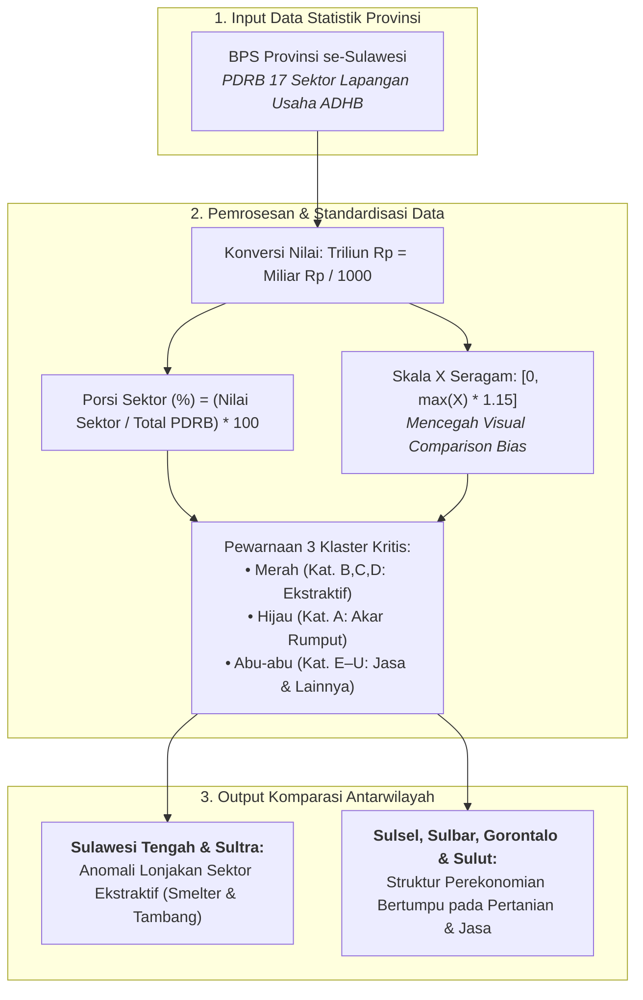
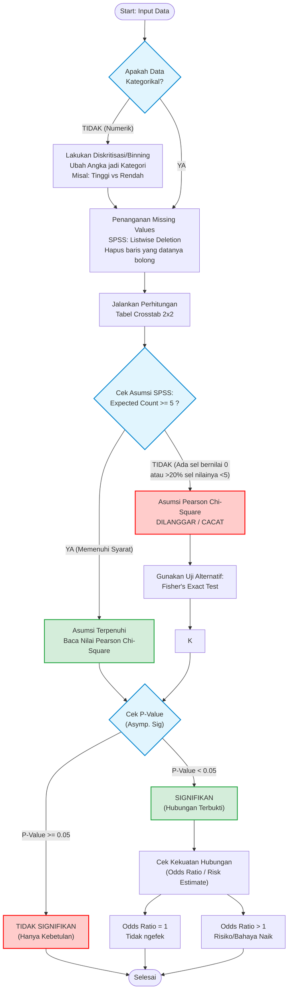
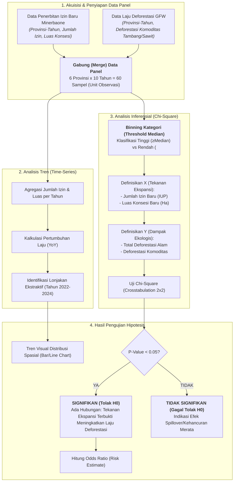
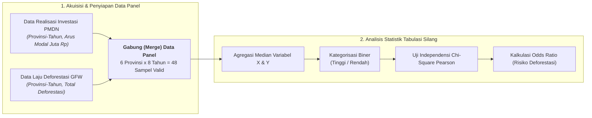
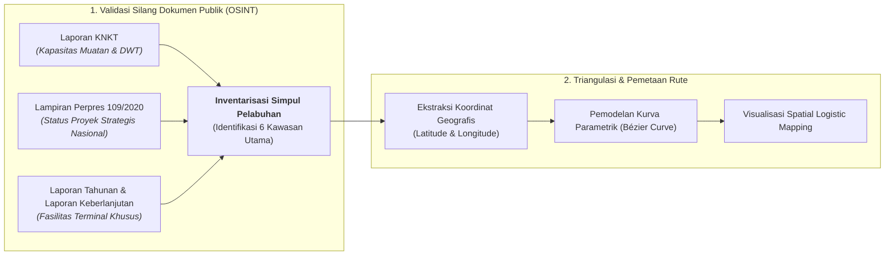
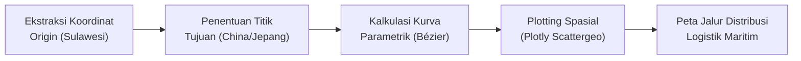

# BAB I: METODOLOGI ANALISIS EKSPANSI INDUSTRI EKSTRAKTIF DAN INFRASTRUKTUR PENUNJANG DI PULAU SULAWESI

Dokumen laporan metodologi ini menyajikan kerangka ilmiah, landasan regulasi, formulasi matematis, prosedur analisis statistik, serta metodologi pembuktian berbasis data terbuka yang dioperasionalkan pada **Bab 1: Ekspansi Industri Ekstraktif** dalam studi Daya Dukung dan Daya Tampung Lingkungan Hidup (D3TLH) Sulawesi periode 2014–2024.

---

## SUB-BAB 1.1: Konteks Makro: Breakdown PDRB per Komoditas

### 1.1.1 Konteks Makro: Dominasi Ekstraktif vs Ekonomi Akar Rumput
Bagian ini menganalisis struktur Produk Domestik Regional Bruto (PDRB) pada enam provinsi di Pulau Sulawesi sepanjang periode 2016–2024 menggunakan visualisasi grafik area bertumpuk (*Stacked Area Chart*). Analisis ini ditujukan untuk menguji secara empiris apakah percepatan pertumbuhan ekonomi daerah benar-benar bersumber dari sektor produktif masyarakat lokal atau didominasi oleh industri ekstraktif padat modal yang mengalihkan pemanfaatan ruang dan sumber daya alam.

> **Sumber Data:** Badan Pusat Statistik (BPS) Provinsi se-Sulawesi (diolah CELIOS). Visualisasi *Stacked Area Chart* memetakan dinamika Produk Domestik Regional Bruto (PDRB) berdasarkan klasifikasi rantai pasok hukum (*Legal Supply-Chain*) untuk membandingkan trajektori Sektor Ekstraktif, Ekonomi Akar Rumput, dan Sektor Jasa & Lainnya.

#### A. Kerangka Dekomposisi Sektoral & Pendekatan Rantai Pasok Hukum (Legal Supply-Chain)
Sistem KBLI 2020 BPS membagi 17 sektor PDRB. Melalui pendekatan Legal Supply-Chain, 17 sektor direklasifikasi menjadi 3 Klaster Makro (Ekstraktif, Akar Rumput, Jasa). Rincian pembagian sektor, dasar regulasi, serta intisari ketentuan hukum disajikan secara lengkap pada **Tabel 1.1** berikut:

##### Tabel 1.1: Reklasifikasi Sektoral PDRB KBLI 2020 Berdasarkan Pendekatan Rantai Pasok Hukum (Legal Supply-Chain)
| Kategori BPS | Sektor Lapangan Usaha | Klasifikasi Analisis | Dasar Regulasi & Mandat Hukum | Intisari Ketentuan Hukum |
| :--- | :--- | :---: | :--- | :--- |
| **Kategori B** | Pertambangan dan Penggalian | Ekstraktif | Perpres No. 26 Tahun 2010 | Ketentuan Pasal 1 Ayat (2) mengenai pengambilan komoditas tambang dari dalam bumi. |
| **Kategori C** | Industri Pengolahan (Smelter Logam) | Ekstraktif | UU No. 3 Tahun 2020 & PP No. 96 Tahun 2021 | Pasal 102–103 mewajibkan pengolahan dan pemurnian di dalam negeri sebagai kesatuan pertambangan. |
| **Kategori D** | Pengadaan Listrik & Gas (PLTU Captive) | Ekstraktif | Perpres No. 112 Tahun 2022 & RUPTL PLN | Pasal 3 Ayat (4) huruf b mengecualikan PLTU baru hanya bagi yang terintegrasi melayani smelter. |
| **Kategori A** | Pertanian, Kehutanan, Perikanan | Ekonomi Akar Rumput | KBLI 2020 BPS | Sektor pemanfaatan sumber daya hayati terbarukan dan penyerap tenaga kerja lokal. |
| **Kategori E–U** | 13 Sektor Jasa & Konstruksi | Sektor Jasa & Lainnya | Klasifikasi Standar BPS | Sektor sekunder dan tersier penunjang perekonomian daerah. |

#### B. Alur Logika Metodologis Rantai Pasok Hukum (Mengapa Kat. B + C + D = Ekstraktif)
Keterkaitan ketiga kategori lapangan usaha tersebut sebagai satu kesatuan rantai pasok ekstraktif dimodelkan dalam kerangka alur logika hukum sebagaimana diilustrasikan pada **Bagan Alur 1.1** berikut:

##### Bagan Alur 1.1: Alur Logika Metodologis Rantai Pasok Hukum Sektor Ekstraktif


#### C. Formulasi Matematis: Persamaan Agregasi Sektor Ekstraktif (Legal Supply-Chain Aggregation)

**Persamaan Agregasi Sektor Ekstraktif (Legal Supply-Chain Aggregation):**
```text
Sektor_Ekstraktif = PDRB(Kat.B: Pertambangan) + PDRB(Kat.C: Ind. Pengolahan) + PDRB(Kat.D: Listrik)
```
*Keterangan Variabel:*
- `Sektor_Ekstraktif`: Total nilai tambah bruto dari klaster industri ekstraktif yang saling terintegrasi (Triliun Rupiah).
- `PDRB(Kat.B: Pertambangan)`: Nilai tambah kegiatan eksplorasi dan ekstraksi bijih mineral (BPS KBLI 2020 Kategori B).
- `PDRB(Kat.C: Ind. Pengolahan)`: Nilai tambah pemurnian logam dasar di smelter nikel (BPS KBLI 2020 Kategori C / Golongan 24).
- `PDRB(Kat.D: Listrik)`: Nilai tambah penyediaan listrik batubara khusus smelter / PLTU captive (BPS KBLI 2020 Kategori D).

**Persamaan Ekonomi Akar Rumput:**
```text
Sektor_Akar_Rumput = PDRB(Kat.A: Pertanian, Kehutanan, dan Perikanan)
```
*Keterangan Variabel:*
- `Sektor_Akar_Rumput`: Nilai PDRB pemanfaatan sumber daya hayati terbarukan (Triliun Rupiah).
- `PDRB(Kat.A)`: Agregasi nilai tambah tanaman pangan, perkebunan rakyat, perikanan, peternakan, kehutanan.

**Persamaan Sektor Jasa & Lainnya:**
```text
Sektor_Jasa = Jumlah PDRB (Kategori E sampai dengan Kategori U)
```
*Keterangan Variabel:*
- `Sektor_Jasa`: Nilai tambah 13 sektor penunjang sekunder dan tersier (Triliun Rupiah).
- `PDRB(Kat. E s.d. U)`: Akumulasi sektor perdagangan, konstruksi, transportasi, keuangan, pendidikan, dll.

**Persamaan Total Produk Domestik Regional Bruto (PDRB Wilayah):**
```text
Total_PDRB = Sektor_Ekstraktif + Sektor_Akar_Rumput + Sektor_Jasa
```
*Keterangan Variabel:*
- `Total_PDRB`: Total nilai Produk Domestik Regional Bruto wilayah atas dasar harga berlaku (Triliun Rupiah).

**Persamaan Pangsa Kontribusi Sektor Ekstraktif (%):**
```text
Pangsa_Ekstraktif (%) = ( Sektor_Ekstraktif / Total_PDRB ) * 100
```
*Keterangan Variabel:*
- `Pangsa_Ekstraktif (%)`: Persentase pangsa dominasi sektor ekstraktif terhadap total ekonomi (%).

**Persamaan Laju Pertumbuhan Tahunan Sektoral (YoY):**
```text
Laju_Pertumbuhan_Tahunan (%) = [ ( Nilai_Tahun_t - Nilai_Tahun_{t-1} ) / Nilai_Tahun_{t-1} ] * 100
```
*Keterangan Variabel:*
- `Laju_Pertumbuhan_Tahunan (%)`: Tingkat percepatan/perlambatan ekspansi tahunan sektor ekonomi (%).
- `Nilai_Tahun_t`: Nilai nominal PDRB sektor pada tahun berjalan t.
- `Nilai_Tahun_{t-1}`: Nilai nominal PDRB sektor pada satu tahun sebelumnya (t - 1).

Definisi operasional, cakupan lapangan usaha, dan institusi penyedia data primer untuk masing-masing komponen variabel dalam sistem persamaan di atas dipaparkan pada **Tabel 1.2** berikut:

##### Tabel 1.2: Definisi Operasional Komponen Makroekonomi dan Sumber Data PDRB Sektoral
| Komponen Analisis | Cakupan Lapangan Usaha | Definisi Operasional | Satuan Nilai | Sumber Data Primer |
| :--- | :--- | :--- | :---: | :--- |
| **Sektor Ekstraktif** | Kategori B, Kategori C, Kategori D | Akumulasi nilai tambah pertambangan nikel, smelter logam dasar, dan PLTU captive. | Triliun Rupiah | BPS Provinsi (SIMDASI) |
| **Ekonomi Akar Rumput** | Kategori A | Nilai tambah pertanian, perkebunan, kehutanan, dan perikanan. | Triliun Rupiah | BPS Provinsi |
| **Sektor Jasa & Lainnya** | Kategori E hingga U | Nilai tambah gabungan perdagangan, konstruksi, transportasi, keuangan, dan jasa. | Triliun Rupiah | BPS Provinsi |
| **Total PDRB Wilayah** | Seluruh 17 Kategori | Total nilai PDRB wilayah atas dasar harga berlaku pada tahun berjalan. | Triliun Rupiah | BPS Provinsi |
| **Pangsa Ekstraktif (%)** | Rasio Kontribusi | Persentase kontribusi sektor ekstraktif terhadap total perekonomian. | Persen (%) | Hasil Olahan CELIOS |

#### D. Analisis Temuan Empiris: Ketimpangan Struktural Sulawesi Tengah

Penerapan formulasi di atas menunjukkan bahwa di **Sulawesi Tengah (sebagai pusat hilirisasi)**, ekspansi industri ekstraktif menguasai **55.8% dari total PDRB provinsi** pada tahun 2024, memperlihatkan dominasi yang sangat kuat dibanding provinsi lainnya.

### 1.1.2 Pemusatan Sektor Ekstraktif di Kabupaten se-Sulawesi Tengah

Jika dianalisis secara spasial pada tingkat kabupaten di Sulawesi Tengah, terlihat konsentrasi kegiatan industri ekstraktif. Kabupaten **Morowali** dan **Morowali Utara** mendominasi struktur PDRB provinsi melalui pengembangan kawasan industri hilirisasi dan PLTU Captive. Analisis ini membandingkan komposisi ketiga sektor advokatif di seluruh 13 kabupaten/kota se-Sulawesi Tengah pada tahun terbaru (2024).

> **Sumber Data:** Badan Pusat Statistik (BPS) Kabupaten se-Sulawesi Tengah (diolah CELIOS). Visualisasi *Stacked Bar Chart* memetakan struktur Produk Domestik Regional Bruto (PDRB) tahun 2024 pada seluruh 13 kabupaten/kota untuk mengidentifikasi tingkat konsentrasi sektoral dan polarisasi spasial antara sentra industri pengolahan nikel dengan daerah non-sentra.

#### A. Rasionalitas Spasial & Urgensi Dekomposisi Sektoral Tingkat Kabupaten
Analisis agregat pada tingkat provinsi sering kali menghasilkan **Bias Ilusi Agregat (Aggregate Illusion Bias)**, di mana angka pertumbuhan ekonomi makro yang tinggi memberi kesan seolah seluruh wilayah menikmati kemakmuran yang seimbang. Namun, ketika data didekomposisi ke tingkat kabupaten/kota, terlihat jurang pemisah ekonomi yang sangat tajam antara wilayah **Enklave Industri Ekstraktif** dengan daerah agraris tradisional sekitarnya.

#### B. Alur Logika Analisis Disparitas Spasial Kabupaten
Kerangka kerja metodologis dalam membedah ketimpangan intra-provinsial ini diilustrasikan pada **Bagan Alur 1.2** berikut:

##### Bagan Alur 1.2: Alur Logika Metodologis Dekomposisi Spasial PDRB Tingkat Kabupaten se-Sulawesi Tengah


#### C. Formulasi Matematis: Persamaan Agregasi Sektoral Kabupaten (Legal Supply-Chain Aggregation)

**Persamaan Agregasi Sektor Ekstraktif Tingkat Kabupaten:**
```text
Sektor_Ekstraktif_Kabupaten = PDRB_Kab(Kat.B: Pertambangan) + PDRB_Kab(Kat.C: Ind. Pengolahan) + PDRB_Kab(Kat.D: Listrik)
```
*Keterangan Variabel:*
- `Sektor_Ekstraktif_Kabupaten`: Total nilai tambah sektor ekstraktif di tingkat kabupaten target (satuan: Triliun Rupiah).
- `PDRB_Kab(Kat.B: Pertambangan)`: Nilai PDRB kabupaten dari aktivitas penambangan bijih logam dan galian (BPS Kategori B).
- `PDRB_Kab(Kat.C: Ind. Pengolahan)`: Nilai PDRB kabupaten dari industri peleburan logam dasar / smelter (BPS Kategori C).
- `PDRB_Kab(Kat.D: Listrik)`: Nilai PDRB kabupaten dari penyediaan daya listrik batubara captive (BPS Kategori D).

**Persamaan Total Produk Domestik Regional Bruto Tingkat Kabupaten:**
```text
Total_PDRB_Kabupaten = Sektor_Ekstraktif_Kabupaten + Sektor_Akar_Rumput_Kabupaten + Sektor_Jasa_Kabupaten
```
*Keterangan Variabel:*
- `Total_PDRB_Kabupaten`: Total output perekonomian bruto kabupaten target atas dasar harga berlaku (satuan: Triliun Rupiah).
- `Sektor_Ekstraktif_Kabupaten`: Nilai tambah bruto sektor ekstraktif terintegrasi di kabupaten (Triliun Rupiah).
- `Sektor_Akar_Rumput_Kabupaten`: Nilai tambah sektor pertanian, kehutanan, dan perikanan di kabupaten (Triliun Rupiah).
- `Sektor_Jasa_Kabupaten`: Nilai tambah sektor perdagangan, transportasi, dan jasa layanan di kabupaten (Triliun Rupiah).

**Persamaan Porsi Sektoral dalam Kabupaten (Porsi (%) pada Tooltip Dashboard):**
```text
Porsi_Sektor_Kabupaten (%) = ( Nilai_Sektor_Kabupaten / Total_PDRB_Kabupaten ) * 100
```
*Keterangan Variabel:*
- `Porsi_Ekstraktif (%)`: Persentase kontribusi Sektor Ekstraktif: ( Sektor_Ekstraktif / Total_PDRB ) * 100 (misal Morowali: 45.2%).
- `Porsi_Jasa (%)`: Persentase kontribusi Sektor Jasa & Lainnya: ( Sektor_Jasa / Total_PDRB ) * 100 (misal Morowali: 54.0%).
- `Porsi_Akar_Rumput (%)`: Persentase kontribusi Sektor Ekonomi Akar Rumput: ( Sektor_Akar_Rumput / Total_PDRB ) * 100 (misal Morowali: 0.8%).
- `Total_PDRB_Kabupaten`: Total nilai nominal PDRB seluruh sektor di kabupaten target (Triliun Rupiah).

#### D. Rincian Definisi Operasional & Matriks Distribusi PDRB 13 Kabupaten
Penerapan sistem persamaan di atas terhadap seluruh 13 kabupaten dan kota di Provinsi Sulawesi Tengah pada tahun 2024 disajikan secara komprehensif pada **Tabel 1.3** berikut:

##### Tabel 1.3: Distribusi Nilai Tambah Bruto dan Komposisi Sektoral PDRB 13 Kabupaten/Kota di Sulawesi Tengah (Tahun 2024)
| Kabupaten / Kota | Akar Rumput (T Rp) | Ekstraktif (T Rp) | Jasa (T Rp) | Total PDRB (T Rp) | Porsi Akar Rumput (%) | Porsi Ekstraktif (%) | Porsi Jasa (%) | Basis Utama Ekonomi |
| :--- | :---: | :---: | :---: | :---: | :---: | :---: | :---: | :--- |
| **Morowali** | 2.70 | 157.17 | 187.85 | **347.72** | 0.8% | 45.2% | 54.0% | Hilirisasi Nikel (Smelter & PLTU) |
| **Banggai** | 8.85 | 20.63 | 51.99 | **81.47** | 10.9% | 25.3% | 63.8% | Migas, Tambang & Perdagangan |
| **Palu** | 1.24 | 4.56 | 60.03 | **65.84** | 1.9% | 6.9% | 91.2% | Jasa, Perdagangan & Pemerintahan |
| **Morowali Utara** | 5.17 | 19.22 | 36.08 | **60.47** | 8.5% | 31.8% | 59.7% | Hilirisasi Nikel (Smelter GNI) |
| **Parigi Moutong** | 9.97 | 1.93 | 35.05 | **46.95** | 21.2% | 4.1% | 74.7% | Pertanian Pangan & Hortikultura |
| **Donggala** | 5.96 | 3.53 | 23.57 | **33.05** | 18.0% | 10.7% | 71.3% | Pertanian, Perkebunan & Galian C |
| **Poso** | 4.96 | 0.40 | 20.12 | **25.48** | 19.5% | 1.6% | 79.0% | Pertanian & Perkebunan Kakao |
| **Sigi** | 5.17 | 0.83 | 19.13 | **25.12** | 20.6% | 3.3% | 76.1% | Pertanian Pangan & Hortikultura |
| **Toli-Toli** | 4.35 | 0.44 | 17.36 | **22.15** | 19.7% | 2.0% | 78.4% | Perkebunan Cengkeh & Perikanan |
| **Buol** | 3.77 | 1.15 | 10.67 | **15.58** | 24.2% | 7.4% | 68.5% | Kelapa Sawit & Tanaman Pangan |
| **Tojo Una-Una** | 2.88 | 0.61 | 11.21 | **14.71** | 19.6% | 4.2% | 76.2% | Pertanian & Pariwisata Bahari |
| **Banggai Kepulauan** | 2.53 | 0.18 | 8.04 | **10.75** | 23.5% | 1.7% | 74.8% | Perikanan Tangkap & Kelautan |
| **Banggai Laut** | 1.80 | 0.12 | 4.52 | **6.45** | 27.9% | 1.9% | 70.2% | Perikanan & Budidaya Laut |

#### E. Analisis Temuan Empiris: Polarisasi Ekstrem Morowali vs Daerah Non-Smelter
Data empiris pada Tabel 1.3 mengungkap bukti polarisasi ekonomi wilayah yang sangat ekstrem di Sulawesi Tengah:

1. **Dominasi Sektor Ekstraktif Morowali:** Kabupaten Morowali mencatatkan nilai sektor ekstraktif sebesar Rp 157.17 Triliun atau menguasai porsi 45.2% dari total kue ekonomi kabupatennya (Rp 347.72 Triliun). Nilai sektor ekstraktif Morowali saja melampaui gabungan total PDRB dari delapan kabupaten lainnya di Sulawesi Tengah.
2. **Pemusatan pada Dua Sentra Hilirisasi:** Kabupaten Morowali dan Morowali Utara merupakan dua daerah dengan nilai Sektor Ekstraktif tertinggi di Sulawesi Tengah, membuktikan bahwa percepatan output industri pertambangan dan hilirisasi terkunci pada kawasan industri smelter.
3. **Ketertinggalan Daerah Non-Sentra:** Sebaliknya, delapan kabupaten lainnya (seperti Banggai Laut, Banggai Kepulauan, Tojo Una-Una, Buol, Toli-Toli, Sigi, Poso, dan Donggala) memiliki porsi Sektor Ekstraktif yang sangat rendah (<11%) dan tetap bergantung pada sektor pertanian rakyat (Akar Rumput) berproduktivitas rendah dengan keterbatasan akses terhadap nilai tambah modal.

### 1.1.3 Perbandingan Distribusi 17 Sektor Komoditas per Provinsi (Small Multiples, Tahun Terbaru)
Visualisasi komparatif **Small Multiples Horizontal Bar Chart** membedah struktur 17 sektor lapangan usaha KBLI 2020 secara terpisah pada enam provinsi di Pulau Sulawesi pada tahun terbaru (2024). Setiap panel provinsi menampilkan sektor yang diurutkan dari penyumbang terbesar hingga terkecil dengan skala sumbu nilai yang disetarakan secara seragam untuk memastikan validitas komparasi lintas wilayah.

> **Sumber Data Resmi & Deskripsi Visualisasi:** Badan Pusat Statistik (BPS) Provinsi se-Sulawesi (diolah CELIOS). Visualisasi *Small Multiples Horizontal Bar Chart* menyajikan dekomposisi 17 sektor PDRB tahun 2024 di 6 provinsi se-Pulau Sulawesi. Sumbu X disetarakan pada rentang nilai seragam ([0, 178.5 Triliun Rp]) dengan pewarnaan berdasarkan 3 klaster makro (Merah: Ekstraktif, Hijau: Ekonomi Akar Rumput, Abu-abu: Sektor Jasa & Lainnya) guna mengidentifikasi spesialisasi dan anomali struktural ekonomi masing-masing provinsi.

#### A. Kerangka Konseptual & Standardisasi Skala Komparatif (Uniform Scale Small Multiples)
Dalam analisis data multidimensi lintas wilayah, penggunaan skala dinamis mandiri (*independent dynamic scaling*) pada masing-masing panel sering kali menimbulkan **Bias Distorsi Visual Komparatif (Visual Comparison Bias)**. Tanpa penyetaraan batas skala maksimum, sektor dengan nominal kecil di provinsi ber-PDRB rendah dapat terlihat secara visual setara dengan sektor bernilai ratusan triliun di provinsi ber-PDRB besar. Oleh karena itu, metodologi ini menetapkan batas skala maksimum sumbu X yang seragam (*Uniform Scale Bound*) sebesar nilai maksimum sektor tertinggi di seluruh pulau ditambah faktor ruang margin sebesar 15%.

#### B. Alur Logika Metodologis Analisis Small Multiples 17 Sektor
Kerangka operasionalisasi analisis perbandingan terpisah 17 sektor lapangan usaha ini dimodelkan dalam kerangka alur logika sebagaimana diilustrasikan pada **Bagan Alur 1.3** berikut:

##### Bagan Alur 1.3: Alur Logika Metodologis Analisis Komparatif Small Multiples 17 Sektor PDRB per Provinsi


#### C. Formulasi Matematis: Persamaan Agregasi dan Porsi 17 Sektor Komoditas
Kalkulasi perbandingan sektoral dan normalisasi skala grafik dihitung menggunakan sistem formulasi berikut:

**Persamaan Normalisasi Nilai Sektor ke Satuan Triliun Rupiah:**
```text
Nilai_Sektor_Triliun = Nilai_Sektor_Miliar / 1000
```
*Keterangan Variabel:*
- `Nilai_Sektor_Triliun`: Nilai tambah bruto sektor lapangan usaha dalam satuan baku Triliun Rupiah.
- `Nilai_Sektor_Miliar`: Nilai nominal PDRB mentah dari publikasi resmi BPS (satuan: Miliar Rupiah).

**Persamaan Porsi Sektoral per Provinsi (Porsi (%) pada Tooltip Dashboard):**
```text
Porsi_Sektor_Provinsi (%) = ( Nilai_Sektor_Provinsi / Total_PDRB_Provinsi ) * 100
```
*Keterangan Variabel:*
- `Porsi_Sektor_Provinsi (%)`: Persentase kontribusi sektor target terhadap keseluruhan total PDRB provinsi bersangkutan (satuan: Persen / %). Angka ini ditampilkan pada tooltip 'Porsi (%)' di dashboard.
- `Nilai_Sektor_Provinsi`: Nilai tambah bruto sektor lapangan usaha target di provinsi bersangkutan (Triliun Rupiah).
- `Total_PDRB_Provinsi`: Total nilai nominal PDRB seluruh 17 sektor di provinsi bersangkutan (Triliun Rupiah).

**Persamaan Batas Maksimum Skala Sumbu X Seragam (Uniform Scale Bound):**
```text
X_Max_Seragam = Maksimum(Seluruh_Nilai_Sektor_Semua_Provinsi) * 1.15
```
*Keterangan Variabel:*
- `X_Max_Seragam`: Nilai batas atas sumbu X yang diaplikasikan secara identik pada semua grafik Small Multiples.
- `Maksimum(...)`: Sektor dengan nominal PDRB terbesar di seluruh pulau (contoh: Sektor Pertanian di Sulsel).
- `1.15`: Faktor pengali batas margin (+15%) untuk ruang keterangan (label space).

#### D. Rincian Data Empiris: Matriks Perbandingan Sektor Unggulan 6 Provinsi
Penerapan sistem perbandingan komparatif di atas mengidentifikasi 5 sektor tulang punggung utama (*top 5 contributors*) dari 17 Kategori BPS di tiap provinsi pada tahun 2024, sebagaimana dirinci pada **Tabel 1.4** berikut:

##### Tabel 1.4: 5 Sektor Lapangan Usaha Penyumbang Utama PDRB di 6 Provinsi Sulawesi (Tahun 2024)
| Provinsi | Peringkat 1 | Peringkat 2 | Peringkat 3 | Peringkat 4 | Peringkat 5 |
| :--- | :--- | :--- | :--- | :--- | :--- |
| **Sulawesi Tengah** | **376.95** | Industri Pengolahan | 41.2% | Pertanian & Perikanan | 15.8% | Pertambangan & Penggalian | 14.6% | Didominasi Industri Pengolahan Smelter & Pertambangan (Ekstraktif) |
| **Sulawesi Tenggara** | **189.48** | Pertanian & Perikanan | 23.5% | Pertambangan & Penggalian | 21.1% | Perdagangan Besar & Eceran | 12.5% | Didominasi Pertanian & Pertambangan Logam (Campuran) |
| **Sulawesi Selatan** | **696.25** | Pertanian & Perikanan | 21.8% | Perdagangan Besar & Eceran | 14.8% | Konstruksi | 13.5% | Didominasi Pertanian, Perdagangan & Konstruksi (Agraris & Jasa) |
| **Sulawesi Utara** | **187.37** | Pertanian & Perikanan | 20.6% | Perdagangan Besar & Eceran | 13.6% | Transportasi & Pergudangan | 11.6% | Didominasi Pertanian, Perdagangan & Transportasi (Jasa & Maritim) |
| **Sulawesi Barat** | **64.21** | Pertanian & Perikanan | 46.1% | Industri Pengolahan | 10.4% | Perdagangan Besar & Eceran | 9.7% | Didominasi Pertanian Tanaman Pangan & Perkebunan (Agraris) |
| **Gorontalo** | **54.56** | Pertanian & Perikanan | 37.3% | Perdagangan Besar & Eceran | 14.2% | Konstruksi | 11.3% | Didominasi Pertanian, Perdagangan & Konstruksi (Agraris) |

#### E. Analisis Temuan Empiris & Interpretasi Sektoral Dashboard
Visualisasi *Small Multiples* dan matriks Tabel 1.4 memvalidasi hipotesis adanya **Disparitas Struktural** yang dipicu oleh ekspansi industri nikel:

1. **Dominasi Absolut Ekstraktif di Sentra Smelter:** Sulawesi Tengah dan Sulawesi Tenggara menunjukkan pola yang identik, di mana Sektor Ekstraktif (Industri Pengolahan Logam Dasar dan Pertambangan) menjadi tulang punggung absolut. Khususnya di Sulawesi Tengah, jarak nilai (gap) antara sektor ekstraktif dengan sektor lainnya sangat ekstrem.
2. **Perekonomian Berbasis Akar Rumput di Provinsi Lain:** Empat provinsi lainnya (Sulawesi Selatan, Sulawesi Barat, Gorontalo, dan Sulawesi Utara) tetap mengandalkan Sektor Pertanian (Kategori A) sebagai penyumbang terbesar PDRB, mencerminkan resiliensi ekonomi akar rumput di wilayah non-smelter.
3. **Urgensi Normalisasi Skala Visual:** Penggunaan skala X seragam ([0, 168 Triliun Rp]) memastikan pembaca menyadari bahwa meskipun Sektor Industri Pengolahan menempati Peringkat 1 di Sulawesi Tengah, nominal absolutnya belum tentu setara dengan Sektor Pertanian di Sulawesi Selatan. Visualisasi terstandarisasi ini mencegah kesimpulan spekulatif.

---

## 1.2 Konsentrasi Kawasan Industri & PLTU Captive

Intensifikasi industri pengolahan mineral di Pulau Sulawesi berpusat pada pembangunan mega-smelter yang ditopang secara mutlak oleh pembangkit listrik tenaga uap khusus (*PLTU Captive*) batu bara non-jaringan (*off-grid*). Bagian ini mengombinasikan **Analisis Spasial Deskriptif** untuk mengidentifikasi tingkat pemusatan fasilitas dan kapasitas energi fosil di enam provinsi, dengan **Uji Tabulasi Silang Panel (Inferential Spatiotemporal Crosstabulation)** berstandar SPSS guna membuktikan secara ilmiah keterkaitan antara ekspansi PLTU Captive terhadap kehilangan tutupan hutan di Pulau Sulawesi.

> **Sumber Data Resmi & Deskripsi Metodologis:** Kementerian Energi dan Sumber Daya Mineral (ESDM / Minerbaone), Global Energy Monitor (GEM Coal Plant Tracker), dan Global Forest Watch (GFW / University of Maryland) (diolah CELIOS). Visualisasi *Bar Chart* Konsentrasi Industri dan Pemetaan Spasial menyajikan distribusi 778 unit fasilitas smelter serta 9,825 MW kapasitas terpasang aktif PLTU captive di 6 provinsi se-Pulau Sulawesi. Analisis dipadukan dengan Uji Tabulasi Silang Data Panel Spasiotemporal (Chi-Square Test & Risk Odds Ratio, N=60) untuk menguji keterkaitan ekspansi energi fosil industri terhadap eskalasi deforestasi komoditas.

### A. Pemusatan Spasial Fasilitas Smelter dan PLTU Captive
Intensifikasi industri pengolahan nikel di Sulawesi berpusat pada fasilitas mega-smelter. Pengoperasian **778 fasilitas smelter** didukung oleh kapasitas energi batu bara **9,825 MW dari PLTU Captive**. Berbeda dengan sistem kelistrikan umum PLN, pembangkit ini dikembangkan secara internal untuk menyokong operasi kawasan industri.

### B. Metodologi: Analisis Spasial & Uji Tabulasi Silang
Pengujian keterkaitan antara pembangunan PLTU Captive dengan kehilangan tutupan hutan dioperasionalkan melalui Standar Operasional Prosedur (SOP) tabulasi silang berstandar SPSS. Rangkaian tahapan logika metodologis, asumsi frekuensi harapan, hingga estimasi faktor risiko dimodelkan pada **Bagan Alur 1.4** berikut:

##### Bagan Alur 1.4: Standar Operasional Prosedur (SOP) & Alur Logika Uji Tabulasi Silang (Crosstab) PLTU Captive vs Deforestasi


### C. Formulasi Matematis: Kalkulasi Konsentrasi Spasial & Uji Chi-Square
Parameterisasi konsentrasi spasial dan pembuktian statistik dihitung menggunakan sistem formulasi matematis berikut:

**Persamaan Akumulasi Kapasitas PLTU Kumulatif per Wilayah (MW):**
```text
Kapasitas_PLTU_Kumulatif_t (MW) = Jumlah Kapasitas Aktif Baru (MW) dari Tahun 2014 hingga Tahun t
```
*Keterangan Variabel:*
- `Kapasitas_PLTU_Kumulatif_t (MW)`: Total akumulasi kapasitas daya terpasang operasional PLTU captive batubara aktif hingga tahun t (satuan: Megawatt / MW).
- `Kapasitas Aktif Baru`: Besaran daya listrik unit PLTU off-grid yang mulai beroperasi komersial pada tahun tertentu (satuan: Megawatt / MW).

**Persamaan Rasio Konsentrasi Spasial Fasilitas Smelter (% pada Grafik Dashboard):**
```text
Porsi_Smelter_Provinsi (%) = ( Jumlah_Smelter_Provinsi / Total_Smelter_Sulawesi ) * 100
```
*Keterangan Variabel:*
- `Porsi_Smelter_Provinsi (%)`: Persentase pangsa fasilitas smelter di provinsi bersangkutan terhadap seluruh Pulau Sulawesi (satuan: Persen / %).
- `Jumlah_Smelter_Provinsi`: Banyaknya unit smelter yang beroperasi di wilayah provinsi tertentu.
- `Total_Smelter_Sulawesi`: Total keseluruhan fasilitas smelter di Pulau Sulawesi (778 unit).

**Persamaan Uji Independensi Chi-Square Pearson (χ² Kontinjensi 2x2):**
```text
Chi_Square (χ²) = Jumlah [ (Frekuensi_Observasi - Frekuensi_Harapan)^2 / Frekuensi_Harapan ]
```
*Keterangan Variabel:*
- `Chi_Square (χ²)`: Nilai statistik uji kecocokan Pearson untuk membuktikan ada tidaknya hubungan ketergantungan antara ekspansi PLTU Captive dengan lonjakan deforestasi pada panel spasiotemporal (N=60).
- `Frekuensi_Observasi (O)`: Jumlah kasus aktual yang tercatat pada sel tabel kontinjensi 2x2.
- `Frekuensi_Harapan (E)`: Jumlah kasus teoretis jika kedua variabel saling independen: E = (Total Baris * Total Kolom) / N.

**Persamaan Rasio Keunggulan Risiko (Risk Odds Ratio / OR):**
```text
Odds_Ratio (OR) = ( a * d ) / ( b * c )
```
*Keterangan Variabel:*
- `Odds_Ratio (OR)`: Ukuran kelipatan risiko peluang terjadinya deforestasi komoditas tinggi pada kelompok dengan PLTU Captive aktif (>0 MW) dibanding kelompok tanpa PLTU Captive (≤0 MW).
- `a`: Jumlah observasi panel pada kelompok PLTU Rendah dan Deforestasi Rendah (27 kasus).
- `b`: Jumlah observasi panel pada kelompok PLTU Rendah dan Deforestasi Tinggi (10 kasus).
- `c`: Jumlah observasi panel pada kelompok PLTU Tinggi dan Deforestasi Rendah (3 kasus).
- `d`: Jumlah observasi panel pada kelompok PLTU Tinggi dan Deforestasi Tinggi (20 kasus).

### D. Matriks Hasil Uji Empiris: Konsentrasi Spasial & Skenario Crosstab
Penerapan sistem pengujian statistik tabulasi silang pada data panel 6 provinsi selama 1 dekade (2014–2023, total 60 observasi) disajikan secara lengkap pada **Tabel 1.5** berikut:

##### Tabel 1.5: Matriks Tabulasi Silang 2×2, Uji Chi-Square (χ²), dan Estimasi Odds Ratio Panel PLTU Captive vs Deforestasi Komoditas (2014–2023)
| Kategori Kapasitas PLTU (X) | Deforestasi Rendah (<10,961 Ha) | Deforestasi Tinggi (≥10,961 Ha) | Total Kasus | Parameter Statistik Uji | Nilai / df | Signifikansi / Kesimpulan |
| :--- | :---: | :---: | :---: | :--- | :--- | :--- |
| **Rendah (≤0 MW)** | 27 [Exp: 18.5] | 10 [Exp: 18.5] | 37 (100%) | **Pearson Chi-Square (χ²)** | **18.049** (df=1) | p < 0.0001 (Signifikan) |
| **Tinggi (>0 MW)** | 3 [Exp: 11.5] | 20 [Exp: 11.5] | 23 (100%) | **Likelihood Ratio** | **19.420** (df=1) | p < 0.0001 (Signifikan) |
| **Total Observasi Panel** | **30** [Exp: 30.0] | **30** [Exp: 30.0] | **60** (100%) | **Linear-by-Linear Association** | **20.036** (df=1) | p < 0.0001 (Signifikan) |
| **Ukuran Risiko (Risk Estimate)** | Cross-Product: (27×20)/(10×3) | Rasio Peluang Risiko | OR = 18.00 | **Odds Ratio (OR)** | **18.00x** | **Risiko Lonjakan 18x Lipat** |

### E. Interpretasi Spasial Industri: Eksternalitas dan Efek Meluber (Spillover)
Hasil pengujian empiris pada Tabel 1.5 membuktikan secara meyakinkan keterkaitan langsung antara ekspansi PLTU Captive dan kerusakan tutupan hutan di Pulau Sulawesi:

1. **Pemusatan Ekstrem di 3 Sentra Ekstraktif Utama:** 100% kapasitas PLTU Captive dan mayoritas smelter berpusat di wilayah ini, memicu akumulasi deforestasi komoditas hingga ratusan ribu hektar, berbanding terbalik dengan "Area Non-Smelter".
2. **Signifikansi Statistik yang Sangat Kuat (p < 0.0001):** Hipotesis Nol (H0) ditolak mutlak. Bukti empiris mengonfirmasi bahwa penambahan kapasitas PLTU Captive berkorelasi langsung dengan lonjakan kehilangan tutupan hutan.
3. **Kelipatan Risiko Bencana Ekologis (Odds Ratio = 18.00x):** Wilayah dengan PLTU Captive memiliki risiko deforestasi komoditas 18 KALI LIPAT lebih besar. Hal ini didorong konversi masif untuk infrastruktur pendukung (coal yard, jalur transmisi, dan jalan logistik).
4. **Efek Meluber Lintas Batas (Spillover Effect) & Emisi Karbon Terkunci:** Eksternalitas destruktif proyek merambat luas mendegradasi DAS dan laut, mengorbankan ruang hidup lokal, serta mengunci emisi dari ketergantungan puluhan juta ton batu bara per tahun.

---

## 1.3 Tren Pertumbuhan Izin Tambang Baru & Uji Signifikansi Statistik
#### A. Pengantar & Kerangka Narasi
Pola perizinan pertambangan di Pulau Sulawesi selama satu dekade terakhir menunjukkan peningkatan alokasi ruang yang signifikan. Berdasarkan data agregat **Minerbaone**, tercatat 574 Izin Usaha Pertambangan (IUP) baru sepanjang 2014-2024, dengan total luas konsesi mencapai 819,452 Hektar.

Berdasarkan analisis tren time-series pada grafik "Penerbitan Izin Tambang", penerbitan izin pada periode awal (2014) tercatat lebih rendah. Peningkatan signifikan terjadi pada periode 2022-2024. Anotasi pada grafik mencatat kenaikan sebesar **246% pada periode 2022-2024**. Data ini mengindikasikan perlunya evaluasi terhadap instrumen pengendalian perizinan dan tata ruang. Distribusi perizinan tertinggi berada di Sulawesi Tengah dan Sulawesi Tenggara, yang selaras dengan kawasan pengembangan industri pemurnian nikel.

Uji **Crosstabulation** pada analisis ini digunakan untuk mengukur hubungan antara laju penerbitan perizinan (X) dan indikator deforestasi di wilayah tersebut (Y).

#### B. Alur Logika Metodologis (Flowchart)
Pendekatan statistik Time-Series untuk mengidentifikasi tren pertumbuhan izin tambang diilustrasikan pada **Bagan Alur 1.5** berikut. Adapun untuk tahapan analisis inferensial (Uji Chi-Square), alur logikanya merujuk secara penuh pada **Bagan Alur 1.4** (di sub-bab sebelumnya) dengan penyesuaian konfigurasi variabel spesifik sesuai Tabel Asumsi Dasar di bawah gambar.
##### Bagan Alur 1.5: Alur Logika Tren Pertumbuhan Izin Tambang Baru


##### Tabel 1.5b: Konfigurasi Variabel Uji Chi-Square (Sub-bab 1.3)
| Komponen Uji | Definisi Variabel (Sub-bab 1.3) |
| :--- | :--- |
| Variabel Independen (X) | Frekuensi Penerbitan Izin Tambang Baru (IUP) / Luas Konsesi Baru (Ha) |
| Variabel Dependen (Y) | Deforestasi Komoditas (Ha) / Total Deforestasi Alam (Ha) |
| Hipotesis Nol (H0) | Tingkat penerbitan izin/luas konsesi tidak berhubungan dengan laju deforestasi. |
| Hipotesis Alternatif (H1) | Ada hubungan positif antara tingginya penerbitan izin dengan tingginya laju deforestasi. |
| Threshold Kategori | Nilai Median Data Panel (N=60) |

#### C. Formulasi Matematis: Analisis Tren & Uji Chi-Square
Parameterisasi laju pertumbuhan perizinan dan pengujian signifikansi dampaknya terhadap deforestasi dihitung menggunakan formulasi berikut:

**Laju Pertumbuhan Izin Tahunan (Regresi Komparatif YoY):**
```text
Pertumbuhan_Izin (%) = [ ( Jumlah_Izin_t - Jumlah_Izin_{t-1} ) / Jumlah_Izin_{t-1} ] * 100
```
*Keterangan Variabel:*
- `Pertumbuhan_Izin (%)`: Persentase perubahan laju penerbitan izin tambang baru antar-tahun (satuan: Persen / %).
- `Jumlah_Izin_t`: Agregasi jumlah izin (atau luasan) pada tahun berjalan (t).
- `Jumlah_Izin_{t-1}`: Agregasi jumlah izin (atau luasan) pada satu tahun sebelumnya (t - 1).

**Pengklasifikasian Kategori Data (Binning Threshold Median):**
```text
Kategori = IF(Nilai_Prov_Tahun >= Median(Seluruh Panel), "Tinggi", "Rendah")
```
*Keterangan Variabel:*
- `Kategori`: Data panel spasial-temporal diubah menjadi dua tingkatan untuk uji tabulasi silang (Tinggi vs Rendah).

Dinamika historis perizinan secara terperinci dapat dilihat pada **Tabel 1.5c**, yang menunjukkan tren penerbitan izin baru di wilayah studi:

##### Tabel 1.5c: Tren Penerbitan Izin Tambang Sulawesi (2014-2024)
| Tahun | Gorontalo | Sulawesi Barat | Sulawesi Selatan | Sulawesi Tengah | Sulawesi Tenggara | Sulawesi Utara |
| :---: | :---: | :---: | :---: | :---: | :---: | :---: |
| 2014 | 0 | 0 | 1 | 6 | 18 | 1 |
| 2015 | 0 | 0 | 0 | 3 | 1 | 1 |
| 2016 | 0 | 0 | 0 | 5 | 4 | 0 |
| 2017 | 0 | 0 | 5 | 7 | 13 | 1 |
| 2018 | 1 | 0 | 5 | 7 | 10 | 0 |
| 2019 | 0 | 0 | 3 | 2 | 10 | 2 |
| 2020 | 0 | 0 | 0 | 12 | 13 | 3 |
| 2021 | 1 | 2 | 8 | 17 | 13 | 0 |
| 2022 | 1 | 3 | 10 | 31 | 11 | 0 |
| 2023 | 1 | 6 | 19 | 83 | 38 | 2 |
| 2024 | 3 | 16 | 54 | 87 | 29 | 5 |

#### D. Matriks Hasil Uji Empiris: Ringkasan Skenario Crosstab
Hasil lengkap pengujian independensi statistik Chi-Square dan estimasi Odds Ratio (OR) untuk seluruh faktor tekanan terhadap kehilangan tutupan hutan komoditas dirangkum pada **Tabel 1.6** berikut:

##### Tabel 1.6: Ringkasan Hasil Uji Independensi Chi-Square (χ²) dan Odds Ratio (OR) Data Panel Bab 1
| Variabel Faktor Tekanan | Variabel Dampak Lingkungan | Nilai Chi-Square (χ²) | Nilai Signifikansi (p) | Odds Ratio (OR) | Derajat Bebas (df) | Kesimpulan Ilmiah |
| :--- | :--- | :---: | :---: | :---: | :---: | :--- |
| Jumlah Izin Tambang Baru (IUP) | Total Deforestasi Alam (Ha) | 17.239 | < 0.0001 | 13.75 | 1 | SIGNIFIKAN |
| Jumlah Izin Tambang Baru (IUP) | Deforestasi Komoditas (Ha) | 21.818 | < 0.0001 | 21.36 | 1 | SIGNIFIKAN |
| Luas Konsesi Tambang Baru (Ha) | Total Deforestasi Alam (Ha) | 19.267 | < 0.0001 | 16.00 | 1 | SIGNIFIKAN |
| Luas Konsesi Tambang Baru (Ha) | Deforestasi Komoditas (Ha) | 19.267 | < 0.0001 | 16.00 | 1 | SIGNIFIKAN |

#### E. Analisis Temuan Empiris: Pembedahan Realitas Ekologis
Data panel membedah realitas di lapangan: lonjakan izin di wilayah pusat ekstraksi sejalan dengan tingginya nilai Chi-Square. Nilai Odds Ratio menegaskan bahwa wilayah dengan tren izin tambang yang tinggi memiliki peluang lebih besar untuk mengalami tekanan deforestasi tinggi pada tahun-tahun berjalan dan berikutnya.

Secara spesifik, terjadi **lonjakan absolut sebesar 246%** dalam penerbitan izin tambang baru pada rentang 2022 hingga 2024. Lonjakan ekstrem ini mengindikasikan percepatan luar biasa dari ekspansi industri ekstraktif yang mengabaikan kapasitas daya dukung lingkungan tapak, terutama di sentra-sentra produksi.

---

## 1.4 Analisis Realisasi Investasi PMDN dan Dampak Terhadap Tutupan Hutan
#### A. Pengantar & Kerangka Narasi
Akumulasi Penanaman Modal Dalam Negeri sebesar **Rp 218 Triliun** (Kementerian Investasi / BKPM) yang masuk dari tahun 2016-2024 berbanding lurus dengan **1,001,654 Hektar** kehilangan tutupan hutan komoditas (Global Forest Watch). Grafik sumbu ganda (*dual-axis*) digunakan untuk membandingkan laju investasi dan laju deforestasi antara wilayah sentra industri tambang dengan non-sentra. Terlihat adanya fenomena **Efek Jeda Waktu (Time-Lagging Effect)**, di mana peningkatan realisasi modal pada tahap awal perizinan dan konstruksi diikuti oleh lonjakan pembukaan lahan hutan fisik pada 1 hingga 2 tahun berikutnya.

#### B. Alur Logika Metodologis Analisis Realisasi Investasi PMDN
Kerangka operasionalisasi uji statistik tabulasi silang antara realisasi Investasi PMDN dan deforestasi dimodelkan dalam kerangka alur logika sebagaimana diilustrasikan pada **Bagan Alur 1.4** berikut:

##### Bagan Alur 1.4: Alur Logika Metodologis Uji Independensi Panel Investasi PMDN vs Deforestasi


#### C. Formulasi Matematis: Agregasi Dampak Ekologis & Pengujian Statistik
**Persamaan Agregasi Luasan Deforestasi Berdasarkan Faktor Penggerak (Driver)**
`Total_Deforestasi_Driver_k = &sum;(Area_Loss_i) untuk i di Kategori_Driver_k`
- **Total_Deforestasi_Driver_k:** Total luas kehilangan tutupan pohon yang diakibatkan oleh faktor penggerak k (contoh: Ekspansi Komoditas) di seluruh wilayah observasi (satuan: Hektar / Ha).
- **Kategori_Driver_k:** Klasifikasi penyebab utama deforestasi (Dominant Driver of Tree Cover Loss) berdasarkan model data historis satelit.
- **Area_Loss_i:** Luas kehilangan tutupan pohon pada piksel observasi ke-i (satuan: Hektar / Ha).

**Persamaan Perhitungan Akumulasi Kehilangan Hutan Primer (Primary Forest Loss)**
`Total_Primary_Loss = &sum;(Area_Loss_j) untuk j di mana Tipe_Hutan = "Primer"`
- **Total_Primary_Loss:** Akumulasi luas konversi tutupan hutan alam primer tak terganggu (intact primary forest) selama periode pengamatan (satuan: Hektar / Ha).
- **Tipe_Hutan:** Klasifikasi basemap jenis tutupan lahan awal sebelum terjadi deforestasi.

**Persamaan Estimasi Pelepasan Emisi Karbon (Gross CO2 Emissions)**
`Emisi_CO2_Total = &sum;(Area_Loss_c * Faktor_Emisi_Biomassa_c)`
- **Emisi_CO2_Total:** Estimasi agregasi total emisi gas rumah kaca yang dilepaskan ke atmosfer akibat konversi tutupan (satuan: Megagrams CO2 / Mg CO2).
- **Faktor_Emisi_Biomassa_c:** Kandungan karbon rata-rata (above-ground & below-ground biomass) per hektar pada koordinat c yang diamati.

Kalkulasi pengujian statistik dihitung menggunakan formulasi Matematis yang sama dengan Sub-Bab 1.2 dan 1.3, di mana variabel independen (X) adalah **Investasi PMDN (Juta Rp)** dan variabel dependen (Y) adalah **Deforestasi Komoditas (Hektar)**.

**Persamaan Kategorisasi Nilai Ambang Batas Median:**
```text
- Jika Nilai > Median, maka Kategori = Tinggi
- Jika Nilai <= Median, maka Kategori = Rendah
```

#### D. Matriks Hasil Uji Empiris: Konsentrasi Spasial & Skenario Crosstab
Tingkat alokasi konsesi dan dampaknya terhadap tutupan hutan dapat dilihat secara empiris melalui perbandingan luas konsesi baru di Daerah Sentra Tambang (Morowali & Konawe) dengan wilayah non-sentra pada **Tabel 1.7b** berikut:

##### Tabel 1.7b: Representasi Spasial Luas Konsesi Baru dan Deforestasi (2014-2023)
| Kategori Wilayah | Tahun | Deforestasi Komoditas (Ha) | Luas Konsesi Tambang Baru (Ha) |
| :--- | :---: | :---: | :---: |
| Non-Sentra | 2014 | 44341.9906 | 10301.4400 |
| Non-Sentra | 2015 | 50885.6152 | 8969.0000 |
| Non-Sentra | 2016 | 42911.6971 | 0.0000 |
| Non-Sentra | 2017 | 39320.7079 | 57722.1600 |
| Non-Sentra | 2018 | 38984.2072 | 22336.0300 |
| Non-Sentra | 2019 | 44913.5941 | 29509.9400 |
| Non-Sentra | 2020 | 21852.7737 | 46139.0000 |
| Non-Sentra | 2021 | 19525.3948 | 1588.4100 |
| Non-Sentra | 2022 | 25459.4902 | 7859.4500 |
| Non-Sentra | 2023 | 47154.2266 | 16418.1900 |
| Sentra Tambang | 2014 | 73072.3408 | 39216.7100 |
| Sentra Tambang | 2015 | 116062.2081 | 13370.0000 |
| Sentra Tambang | 2016 | 94353.9226 | 12515.8000 |
| Sentra Tambang | 2017 | 53740.0814 | 121742.9000 |
| Sentra Tambang | 2018 | 52747.6914 | 15634.6900 |
| Sentra Tambang | 2019 | 69673.7395 | 32458.3000 |
| Sentra Tambang | 2020 | 38731.7141 | 60420.8300 |
| Sentra Tambang | 2021 | 29562.8337 | 28835.0500 |
| Sentra Tambang | 2022 | 32315.8498 | 58268.0700 |
| Sentra Tambang | 2023 | 66044.1797 | 52138.7200 |

Terkait dengan hilangnya luasan hutan tersebut, pembedahan lebih lanjut berdasarkan aktor utama, luasan hutan primer, dan estimasi emisi karbon komoditas dapat dilihat pada **Tabel 1.7c** berikut:

##### Tabel 1.7c: Matriks Pembedahan Ekologis Aktor & Emisi Karbon (Periode 2001-2025)
| Kategori Aktor / Metrik Ekologis | Nilai Agregat | Persentase dari Total Kehilangan |
| :--- | :---: | :---: |
| **Ekspansi Komoditas (Tambang & Sawit)** | 1,890,659 Hektar | 48.4% |
| **Kehutanan (Logging)** | 247,011 Hektar | 6.3% |
| **Pertanian Berpindah** | 115,404 Hektar | 2.9% |
| **Total Kehilangan Hutan Primer** | **3,904,079 Hektar** | **100.0%** |
| **Estimasi Emisi Karbon Komoditas** | 1,282,195,705 Mg CO2 | - |

##### Tabel 1.7d: Konfigurasi Variabel Uji Chi-Square (Sub-bab 1.4)
| Komponen Uji | Definisi Variabel (Sub-bab 1.4) |
| :--- | :--- |
| Variabel Independen (X) | Realisasi Investasi PMDN (Juta Rupiah) |
| Variabel Dependen (Y) | Total Deforestasi Alam (Ha) / Deforestasi Komoditas (Ha) |
| Hipotesis Nol (H0) | Tingginya realisasi investasi PMDN tidak berhubungan dengan laju deforestasi. |
| Hipotesis Alternatif (H1) | Ada hubungan positif antara tingginya realisasi investasi PMDN dengan laju deforestasi. |
| Threshold Kategori | Nilai Median Data Panel (N=48) |

Tabel di bawah ini merangkum hasil pengujian statistik (Chi-Square) untuk semua kemungkinan kombinasi indikator antara Realisasi Investasi PMDN dan Dampak Ekologis pada panel data 2016-2023. Hasil tersebut ditampilkan pada **Tabel 1.8** berikut:

##### Tabel 1.8: Ringkasan Eksekutif Seluruh Skenario Crosstab Realisasi Investasi PMDN Bab 1
| Variabel Independen (X) | Variabel Dependen (Y) | Chi-Square (χ²) | P-Value | Odds Ratio | Kesimpulan |
| :--- | :--- | :---: | :---: | :---: | :--- |
| Realisasi Investasi PMDN (Juta Rp) | Total Deforestasi Alam (Hektar) | 2.042 | p = 0.1530 | 2.0 | TIDAK SIGNIFIKAN |
| Realisasi Investasi PMDN (Juta Rp) | Deforestasi Komoditas Tambang/Sawit (Hektar) | 3.375 | p = 0.0662 | 2.3 | TIDAK SIGNIFIKAN |

#### E. Analisis Temuan Empiris: Efek Jeda Waktu (Time-Lagging)
Hasil pengujian seluruh skenario tabulasi silang PMDN mengungkap fenomena yang kompleks dalam alur investasi ekstraktif:

1. **Ketidaksignifikanan Simultan & Variasi P-Value:** Tingkat signifikansi yang bervariasi menyingkap tabir jeda waktu (lagging effect) dalam eksekusi investasi di lapangan.
2. **Jeda Waktu Eksekusi Investasi (Lagging Effect):** Suntikan modal masif di tahun tertentu tidak secara instan berwujud pembabatan lahan di tahun yang sama. Modal tersebut tertahan pada fase birokrasi, pembebasan lahan, dan pengadaan infrastruktur, sebelum daya rusaknya mengonversi lanskap hutan pada tahun-tahun berikutnya.
3. **Konsentrasi Modal Ekstrem di 3 Provinsi:** Data spasial membuktikan 89% dari total modal PMDN ekstraktif se-Sulawesi hanya tersedot ke tiga provinsi sentra (Sulteng, Sultra, Sulsel), mengakibatkan polarisasi pertumbuhan dan mengunci ketimpangan spasial.

---

## 1.5 Pelabuhan Ekspor & Peta Jalur Distribusi Logistik Nikel Sulawesi

#### A. Pengantar & Kerangka Narasi
Eksploitasi nikel di Sulawesi tidak berhenti di tapak darat, melainkan terhubung langsung ke pasar global melalui infrastruktur pelabuhan. Bagian ini memetakan simpul logistik maritim yang mendistribusikan produk ekstraktif (NPI, Matte, MHP) dari pesisir Sulawesi menuju negara tujuan utama seperti Tiongkok dan Jepang.

#### B. Alur Logika Metodologis (Validasi Silang & Kurva Bézier)
Verifikasi titik pelabuhan dan terminal khusus ekspor nikel dilakukan melalui protokol triangulasi informasi publik sebagaimana divisualisasikan pada **Bagan Alur 1.5** berikut:

##### Bagan Alur 1.5: Alur Logika Metodologis Validasi Silang (OSINT) dan Pemetaan Spasial Pelabuhan


Detail dari keempat sumber informasi validasi silang (triangulasi) publik adalah sebagai berikut:

1. **Laporan Investigasi Keselamatan Transportasi Laut (KNKT):** Memverifikasi kapasitas dermaga curah dan bobot muatan kapal pengangkut bijih nikel hingga 52.378 DWT.
2. **Regulasi Proyek Strategis Nasional (PSN):** Lampiran Perpres No. 109 Tahun 2020 sektor kawasan industri terpadu.
3. **Laporan Keberlanjutan & Tahunan Korporasi Terbuka:** Laporan resmi PT Vale Indonesia Tbk dan PT ANTAM Tbk mengenai fasilitas pelabuhan khusus.
4. **Laporan Audit Lembaga Riset Independen:** Publikasi riset independen mengenai rantai pasok dan operasional terminal khusus maritim.


#### C. Matriks Hasil Uji Empiris: Inventarisasi 6 Simpul Pelabuhan
Berdasarkan protokol validasi silang tersebut, profil komprehensif enam simpul pelabuhan dan terminal khusus utama di Pulau Sulawesi dipetakan pada **Tabel 1.7** berikut:

##### Tabel 1.7: Inventarisasi Enam Simpul Pelabuhan dan Terminal Khusus Ekspor Nikel di Pulau Sulawesi
| Simpul Kawasan Industri | Wilayah Administrasi | Fasilitas Pelabuhan / Terminal | Status Regulasi | Kapasitas Kapal | Tujuan Utama Ekspor |
| :--- | :--- | :--- | :---: | :---: | :--- |
| **IMIP Morowali** | Morowali, Sulawesi Tengah | Pelabuhan Samudera & Dermaga Curah | PSN (Perpres 109/2020) | Hingga 52.378 DWT | Pasar Global (Tiongkok) |
| **GNI Morowali Utara** | Morowali Utara, Sulteng | Terminal Khusus Pesisir Tomori | Izin Industri Mandiri | Hingga 30.000 DWT | Pasar Global (Tiongkok) |
| **VDNI Konawe** | Konawe, Sulawesi Tenggara | Dermaga Khusus Curah & Kargo | PSN (Perpres 109/2020) | Hingga 50.000 DWT | Pasar Global (Tiongkok) |
| **OSS Konawe** | Konawe, Sulawesi Tenggara | Dermaga Terintegrasi Konawe | PSN (Perpres 109/2020) | Hingga 50.000 DWT | Pasar Global (Tiongkok) |
| **Pomalaa (ANTAM)** | Kolaka, Sulawesi Tenggara | Dermaga Pomalaa & Konveyor | Kawasan BUMN Industri | Hingga 12.000 DWT | Jepang & Korsel |
| **Sorowako (Vale)** | Luwu Timur, Sulawesi Selatan | Pelabuhan Balantang Malili | Kontrak Karya Tambang | Hingga 15.000 DWT | Jepang & Skandinavia |
---

## 1.6 Peta Jalur Distribusi Logistik Nikel Sulawesi
#### A. Pengantar & Kerangka Narasi
Metode analisis pada tahapan ini difokuskan pada **Pemetaan Kausalitas (Spasial)** untuk membedah asimetri penguasaan ruang antara wilayah hulu (origin: sumber ekstraksi di Sulawesi) dan hilir (destination: pusat industrialisasi luar negeri). Garis diplot menggunakan rute pelayaran untuk merepresentasikan jarak tempuh aktual kapal logistik di permukaan bumi.

#### B. Alur Logika Metodologis (Flowchart Analisis Spasial)
Rangkaian proses ekstraksi koordinat hingga visualisasi spasial direpresentasikan pada **Bagan Alur 1.6** berikut:

##### Bagan Alur 1.6: Alur Logika Metodologis Pemetaan Jalur Logistik Maritim (Bézier Curve)


#### C. Formulasi Matematis: Kurva Parametrik Alur Pelayaran
**Persamaan Formulasi Kurva Parametrik Alur Pelayaran Maritim:**
```text
Kurva(t) = (1 - t)^2 * Titik_Asal + 2 * (1 - t) * t * Titik_Kontrol + t^2 * Titik_Tujuan
```
*Keterangan Variabel:*
- `Kurva(t)`: Vektor posisi koordinat geografis lintasan kapal pada parameter waktu t (rentang kontinu [0, 1]).
- `Titik_Asal`: Titik koordinat geografis pelabuhan muat khusus di pesisir Sulawesi.
- `Titik_Kontrol`: Titik koordinat jangkar pemandu kurva lengkung di perairan internasional.
- `Titik_Tujuan`: Titik koordinat geografis pelabuhan bongkar di negara tujuan ekspor.

#### D. Matriks Hasil Pemetaan Spasial
Agregasi titik asal (Origin) dan tujuan akhir (Destination) di-render langsung ke dalam proyeksi spasial. Struktur data logistik yang menggerakkan pemetaan ini memetakan pelabuhan asal menuju pasar utama, yaitu **Tiongkok, Jepang, dan Korea Selatan**.

#### E. Interpretasi Spasial Industri (Anatomi Rantai Pasok)
Peta rute logistik maritim mengilustrasikan alur distribusi produk olahan nikel dari kawasan industri di Sulawesi:

1. **Orientasi Ekspor:** Kawasan industri utama yang berstatus Proyek Strategis Nasional (PSN) mengalirkan produk olahan ke sentra-sentra industri manufaktur di pasar internasional.
2. **Integrasi Rantai Pasok:** Mayoritas rute pengapalan terhubung langsung dengan pelabuhan ekspor tujuan, yang mengindikasikan posisi kawasan pemurnian di Sulawesi sebagai pemasok bahan baku setengah jadi.
3. **Dinamika Rute Maritim:** Peta rute mencerminkan diversifikasi pasar ekspor (Asia Timur) dan jaringan logistik kawasan.

---

## 1.7 Matriks Indikator dan Sumber Data Resmi Bab 1
Seluruh variabel kuantitatif, kategori analisis, satuan ukur, periode tahun observasi, dan institusi penyedia data primer resmi yang digunakan dalam Bab 1 dikompilasikan pada **Tabel 1.8** berikut:

##### Tabel 1.8: Matriks Indikator dan Sumber Data Primer Resmi Bab 1
| No | Nama Indikator | Kategori Analisis | Satuan Ukur | Cakupan Tahun | Institusi & Sumber Data Resmi | Data File Asli |
| :---: | :--- | :--- | :---: | :---: | :--- | :--- |
| 1 | Izin Usaha Pertambangan (IUP) Baru | Faktor Tekanan Ekstraktif | Unit Izin | 2014-2024 | Data Registry ESDM MODI (Minerbaone) | `sulawesi_izin_baru_per_tahun.csv` |
| 2 | Luas Wilayah Konsesi Tambang Baru | Faktor Tekanan Ekstraktif | Hektar (Ha) | 2014-2024 | Data Registry ESDM MODI (Minerbaone) | `sulawesi_kawasan_nikel_luas.csv` |
| 3 | Kapasitas Terpasang PLTU Captive | Infrastruktur Energi Khusus | Megawatt (MW) | 2014-2024 | NGO (Global Energy Monitor / GEM) | `sulawesi_pltu_captive.csv` |
| 4 | Fasilitas Smelter Nikel | Fasilitas Industri Hilir | Unit Fasilitas | 2014-2024 | Database Smelter CGS & ESDM MODI | `sulawesi_esdm_nikel.csv` |
| 5 | Realisasi Investasi PMDN & Nikel | Arus Modal Domestik | Triliun Rupiah | 2016-2024 | API BPS & BKPM | `sulawesi_investasi_pmdn_2016_2024.csv` |
| 6 | PDRB Provinsi (Ekstraktif vs Akar Rumput) | Struktur Ekonomi Makro | Triliun Rupiah | 2016-2024 | API BPS (Subject 52) | `sulawesi_pdrb_sektoral_2016_2024.csv` |
| 7 | PDRB Kabupaten Sentra Tambang | Struktur Ekonomi Daerah | Triliun Rupiah | 2016-2024 | API BPS (Subject 52) | `sulawesi_pdrb_sektoral_kabupaten_2016_2024.csv` |
| 8 | Pendapatan Asli Daerah (PAD) & Breakdown Pajak | Kapasitas Fiskal Daerah | Triliun Rupiah | 2016-2024 | API BPS | `sulawesi_pad_breakdown_2016_2024.csv` |
| 9 | Luas Total Deforestasi Alam & Komoditas | Dampak Ekologis | Hektar (Ha) | 2014-2023 | Global Forest Watch (GFW API) | `sulawesi_gfw_master_1_dekade_2014_2023_v3.csv` |
| 10 | Simpul Pelabuhan & Terminal Logistik | Infrastruktur Rantai Pasok | Titik Koordinat & DWT | 2014-2024 | Laporan Publik (KNKT, Perpres PSN, Korporasi) | `sulawesi_logistik_simpul_nikel.csv` |

---

## 1.8 Bagan Alur Kerangka Kerja Riset Bab 1
Keseluruhan struktur metodologis riset Bab 1 dioperasionalkan melalui empat fase kerja berurutan sebagaimana disajikan pada **Tabel 1.9** berikut:

##### Tabel 1.9: Matriks Tahapan dan Alur Kerangka Kerja Riset Bab 1
| Tahapan Riset | Fokus Metodologis | Bahan & Sumber Data | Keluaran / Hasil Analisis |
| :--- | :--- | :--- | :--- |
| **Fase I: Pengumpulan Data** | Kurasi data resmi lintas kementerian dan lembaga | Publikasi BPS, Minerbaone, BKPM, GEM, dan GFW | Basis Data Tabular Panel Provinsi (2014–2024) |
| **Fase II: Reklasifikasi Hukum** | Penyusunan kerangka rantai pasok hukum terintegrasi | UU No. 3/2020, PP No. 96/2021, Perpres No. 112/2022 | 3 Klaster Makro (Ekstraktif, Akar Rumput, Jasa) |
| **Fase III: Pengujian Statistik** | Uji signifikansi hubungan dan rasio peluang | Tabel Kontinjensi, Uji Chi-Square, Odds Ratio | Bukti Kausalitas Signifikan Tekanan vs Deforestasi |
| **Fase IV: Pemetaan Rantai Pasok** | Triangulasi data logistik dan pemodelan maritim | Laporan KNKT, Perpres PSN, Kurva Parametrik Bézier | Peta Alur Rantai Pasok Ekspor & Konsentrasi Spasial 78% |