```mermaid
flowchart LR
    subgraph F1["Fase I: Akuisisi Data"]
        A1["Kurasi Data Resmi Terbuka<br/><i>BPS, ESDM, GEM, BKPM, GFW, KNKT</i>"]
        A2["Panel Provinsi-Tahun<br/><i>6 Provinsi Se-Sulawesi (N=60)</i>"]
    end
    subgraph F2["Fase II: Reklasifikasi"]
        B1["Reklasifikasi Rantai Pasok Hukum<br/><i>UU 3/2020 & Perpres 112/2022</i>"]
        B2["Dekomposisi Spasial<br/><i>13 Kabupaten Sentra Tambang</i>"]
    end
    subgraph F3["Fase III: Uji Statistik"]
        C1["Tabel Kontinjensi 2×2<br/><i>Ambang Median High vs Low</i>"]
        C2["Uji Chi-Square & Odds Ratio<br/><i>Signifikansi & Kelipatan Risiko</i>"]
    end
    subgraph F4["Fase IV: Pemodelan & Sintesis"]
        D1["Pemodelan Rantai Pasok Ekspor<br/><i>Kurva Bézier 6 Pelabuhan</i>"]
        D2["Bukti Kausalitas D3TLH<br/><i>Dominasi Ekstraktif & Deforestasi</i>"]
    end
    F1 --> F2 --> F3 --> F4
```

# METODOLOGI PENELITIAN: BAB 1 — EKSPANSI INDUSTRI EKSTRAKTIF DAN INFRASTRUKTUR PENUNJANG DI PULAU SULAWESI
*CELIOS (Center of Economic and Law Studies) · Audit Spasial-Statistik D3TLH Sulawesi (2014–2024) · Ringkasan Eksekutif Metodologis*

---

## A. Desain Penelitian & Tujuan
Penelitian ini menggunakan **desain audit spasial-statistik kuantitatif terintegrasi** untuk membedah akselerasi ekspansi industri ekstraktif (tambang nikel, fasilitas pemurnian smelter, dan kawasan industri bertenaga PLTU captive batubara) di enam provinsi Pulau Sulawesi sepanjang satu dekade (**2014–2024**). Riset ini memanfaatkan data tabular panel resmi lintas kementerian dan lembaga yang disinkronkan secara spasial untuk mengatasi bias perataan makro. Tiga tujuan utama riset meliputi:

1. **Mengukur Derajat Dominasi Sektoral:** Mendekomposisi struktur PDRB provinsi dan kabupaten guna membuktikan pergeseran monolitik menuju sektor ekstraktif mengorbankan ekonomi pertanian rakyat.
2. **Memetakan Konsentrasi Spasial Klaster Industri:** Mengidentifikasi pengelompokan geografis 778 smelter, 9.825 MW PLTU captive, serta 574 izin tambang nikel baru seluas 819.452 Ha.
3. **Menguji Kausalitas Tekanan Industri vs Deforestasi:** Membuktikan secara inferensial signifikansi hubungan antara ekspansi pertambangan/energi dengan laju kehilangan tutupan hutan alam primer dan komoditas.

---

## B. Sumber Data & Cakupan Wilayah
Riset ini bersandar secara ketat pada data sekunder resmi dari otoritas statistik, kementerian teknis, dan lembaga pemantau global independen yang telah melalui audit konsistensi: **Badan Pusat Statistik (BPS)** (Subject 52 PDRB Lapangan Usaha & Keuangan Daerah), **Kementerian ESDM** (MODI Minerbaone & Database Smelter CGS), **Kementerian Investasi / BKPM** (Realisasi PMDN Sektoral), **Global Energy Monitor (GEM)** (Coal Plant Tracker), **Global Forest Watch / Hansen UMD** (Tree Cover Loss & Commodity Drivers), serta **Komite Nasional Keselamatan Transportasi (KNKT)** dan Perpres PSN (Simpul Logistik Maritim). Seluruh observasi dihimpun dalam struktur **data panel provinsi-tahun (N = 60 observasi: 6 provinsi × 10 tahun)** untuk menjamin validitas pengujian parametrik dan non-parametrik.

---

## C. Operasionalisasi Variabel & Indikator Riset
Seluruh variabel kuantitatif, kategori analisis, satuan ukur, periode observasi, dan institusi primer resmi yang digunakan dalam penelitian ini disajikan secara komprehensif pada matriks operasionalisasi berikut:

##### Matriks Operasionalisasi Variabel dan Sumber Data Resmi
| # | Nama Indikator Empiris | Kategori Analisis | Satuan | Periode | Institusi & Sumber Data Resmi |
| :---: | :--- | :--- | :---: | :---: | :--- |
| 1 | Izin Usaha Pertambangan (IUP) Baru | Faktor Tekanan Ekstraktif | Unit Izin | 2014–2024 | Data Registry ESDM MODI (Minerbaone) |
| 2 | Luas Wilayah Konsesi Tambang Baru | Faktor Tekanan Ekstraktif | Hektar (Ha) | 2014–2024 | Data Registry ESDM MODI (Minerbaone) |
| 3 | Kapasitas Terpasang PLTU Captive | Infrastruktur Energi Khusus | Megawatt (MW) | 2014–2024 | Global Energy Monitor (GEM Tracker) |
| 4 | Fasilitas Smelter Nikel | Fasilitas Industri Hilir | Unit Fasilitas | 2014–2024 | Database Smelter CGS & ESDM MODI |
| 5 | Realisasi Investasi PMDN & Nikel | Arus Modal Domestik | Triliun Rp | 2016–2024 | API BPS & Kementerian Investasi / BKPM |
| 6 | PDRB Provinsi (Ekstraktif vs Akar Rumput) | Struktur Ekonomi Makro | Triliun Rp | 2016–2024 | API BPS (Subject 52: PDRB Lapangan Usaha) |
| 7 | PDRB Kabupaten Sentra Tambang | Struktur Ekonomi Daerah | Triliun Rp | 2016–2024 | API BPS (Subject 52 Kabupaten/Kota) |
| 8 | Pendapatan Asli Daerah (PAD) & Pajak | Kapasitas Fiskal Daerah | Triliun Rp | 2016–2024 | API BPS (Statistik Keuangan Daerah) |
| 9 | Luas Total Deforestasi Alam & Komoditas | Dampak Ekologis Lanskap | Hektar (Ha) | 2014–2023 | Global Forest Watch (GFW API / Hansen UMD) |
| 10 | Simpul Pelabuhan & Terminal Logistik Ekspor | Infrastruktur Rantai Pasok | Titik & DWT | 2014–2024 | KNKT, Regulasi Perpres PSN & Korporasi |

---

## D. Kerangka Analisis & Formulasi Matematis

### D.1 Reklasifikasi Rantai Pasok Hukum & Pangsa Sektoral (PDRB)
Tujuh belas sektor KBLI 2020 direklasifikasi menjadi tiga klaster makro berdasarkan relasi hukum hilirisasi nikel (UU No. 3/2020 jo. PP No. 96/2021): **Klaster Ekstraktif** (Pertambangan B, Industri Logam C24, dan Pengadaan Listrik D), **Klaster Akar Rumput** (Pertanian, Kehutanan & Perikanan A), serta **Klaster Jasa & Manufaktur Lain**. Konfigurasi reklasifikasi ini dirancang untuk mengisolasi porsi kontribusi murni sektor industri hilirisasi terhadap total struktur perekonomian daerah:

> `Pangsa Sektor Ekstraktif (%) = [ PDRB Ekstraktif (B + C24 + D) / Total PDRB ] × 100`

### D.2 Dekomposisi Spasial & Rasio Ketimpangan Kabupaten
Untuk membongkar ilusi agregat provinsi, PDRB didekomposisi ke seluruh kabupaten/kota sentra nikel guna mengukur derajat polarisasi ekonomi industri ekstraktif terhadap basis mata pencaharian pertanian-perikanan lokal:

> `Rasio Kesenjangan Spasial = PDRB Sektor Ekstraktif (Kabupaten) / PDRB Pertanian Rakyat (Kabupaten)`

### D.3 Konsentrasi Spasial Kawasan Industri & PLTU Captive Off-Grid
Derajat konsentrasi fasilitas pengolahan nikel dan kapasitas pembangkit listrik captive batubara diukur menggunakan rasio aglomerasi spasial untuk memetakan pemusatan beban energi dan lingkungan antar-wilayah:

> `Porsi Konsentrasi Sentra (%) = [ Kapasitas Sentra Industri (MW) / Total Kapasitas Se-Sulawesi (MW) ] × 100`

### D.4 Deret Waktu Perizinan & Laju Alih Ruang Harian
Akumulasi izin konsesi tambang baru dievaluasi laju pertumbuhannya dan dinormalisasi ke dalam unit waktu harian untuk mengukur kecepatan konversi bentang lahan alami menjadi kawasan pertambangan:

> `Laju Alih Ruang Harian (Ha/Hari) = Total Luas Konsesi Tambang Baru (Ha) / Jumlah Hari Observasi (t)`

### D.5 Analisis Tabulasi Silang, Uji Chi-Square & Odds Ratio (OR)
Pengujian inferensial menggunakan desain matriks kontinjensi 2×2 berbasis **ambang median panel provinsi-tahun (N = 60)**. Uji Chi-Square independensi (α = 5%, df = 1) diterapkan untuk menguji signifikansi hubungan bivariat, sedangkan rasio peluang (Odds Ratio) mengukur magnitudo kelipatan risiko dampak ekologis:

> `χ² = Σ [ (O_ij - E_ij)² / E_ij ]   |   Odds Ratio (OR) = (a × d) / (b × c)`

##### Matriks Konfigurasi Variabel Uji Chi-Square & Odds Ratio (Sub-bab 1.3 & 1.4)
| Komponen Uji | Definisi Variabel & Parameter (Sub-bab 1.3) | Definisi Variabel & Parameter (Sub-bab 1.4) |
| :--- | :--- | :--- |
| **Variabel Independen (X)** | Jumlah Izin Baru (IUP) / Luas Konsesi Baru (Ha) | Realisasi Investasi PMDN Sektor Ekstraktif (Juta / Triliun Rp) |
| **Variabel Dependen (Y)** | Deforestasi Komoditas (Ha) / Total Deforestasi Alam Primer (Ha) | Total Deforestasi Alam (Ha) / Deforestasi Komoditas (Ha) |
| **Hipotesis Nol (H₀)** | Tingkat penerbitan izin/luas konsesi tidak berhubungan dengan laju deforestasi. | Tingginya realisasi investasi PMDN tidak berhubungan dengan laju deforestasi. |
| **Hipotesis Alternatif (H₁)** | Ada hubungan positif antara tingginya penerbitan izin dengan tingginya laju deforestasi. | Ada hubungan positif antara tingginya realisasi investasi PMDN dengan laju deforestasi. |
| **Decision Rule (Alpha 5%)** | Jika P-Value < 0,05, maka Tolak H₀ (terbukti signifikan bahwa ekspansi perizinan mendorong deforestasi). | Jika P-Value < 0,05, maka Tolak H₀ (terbukti signifikan bahwa realisasi investasi mendorong deforestasi). |
| **Threshold Kategori (Median)** | Nilai Median Data Panel (N=60): X ≥ 2,0 izin; Y ≥ 10.961,8 Ha (Kategori High vs. Low). | Nilai Median Data Panel (N=48): X > Rp3.146,4 Miliar; Y ≥ 10.451,7 Ha (Kategori High vs. Low). |
| **Orientasi Odds Ratio (OR)** | OR = (a × d) / (b × c) dengan a = Izin Tinggi & Deforestasi Tinggi; mengukur risiko deforestasi tinggi pada kelompok penerbitan izin tinggi. | OR = (a × d) / (b × c) dengan a = Investasi Tinggi & Deforestasi Tinggi; mengukur risiko deforestasi tinggi pada kelompok realisasi investasi tinggi. |

### D.6 Pemodelan Alur Rantai Pasok Maritim Ekspor (Kurva Bézier)
Simpul logistik pelabuhan ekspor diverifikasi melalui triangulasi laporan investigasi keselamatan transportasi maritim, penetapan regulasi Proyek Strategis Nasional (PSN), dan laporan operasional korporasi. Alur pelayaran pengangkutan curah nikel menuju pasar internasional dimodelkan secara spasial menggunakan persamaan kurva Bézier kuadratik di atas koordinat bola bumi guna memetakan jalur lalu lintas maritim yang rentan kecelakaan tongkang.

---

## E. Korespondensi Metodologi terhadap Sub-bab Laporan Bab 1
Setiap sub-bab analitis pada Bab 1 ditopang oleh metode kuantitatif yang presisi dan menghasilkan luaran visual terstandarisasi sebagaimana dirangkum pada matriks berikut:

##### Matriks Korespondensi Sub-bab terhadap Metode Analitis
| Sub-bab | Fokus Kajian Empiris | Metode Analitis Utama | Luaran Visual / Statistik |
| :---: | :--- | :--- | :--- |
| **Sub-bab 1.1** | Struktur Makro PDRB Provinsi | Reklasifikasi Hukum KBLI, Pangsa Sektoral, Tren Pertumbuhan | Small Multiples Bar Chart, Tabel Kontribusi Sektor |
| **Sub-bab 1.2** | Kawasan Industri & PLTU Captive | Analisis Aglomerasi Spasial, Rasio Kapasitas Off-grid | Peta Sebaran Smelter, Stacked Bar Kapasitas MW |
| **Sub-bab 1.3** | Tren Perizinan Konsesi Tambang | Deret Waktu Tahunan, Laju Alih Ruang Ha/Hari | Area Chart Akumulasi Izin & Luas Konsesi |
| **Sub-bab 1.4** | Arus Investasi PMDN & Deforestasi | Uji Non-parametrik Chi-Square (χ²), Odds Ratio (OR) | Matriks Tabel Kontinjensi 2×2, Ringkasan Inferensial |
| **Sub-bab 1.5–1.6** | Infrastruktur Logistik & Rantai Pasok | Triangulasi Dokumen Resmi, Kurva Parametrik Bézier | Peta Alur Pelayaran Ekspor, Matriks Insiden Maritim |

---

## F. Bagan Alur Kerangka Kerja Riset (Research Workflow)

> **KERANGKA KELUARAN METODOLOGIS BAB 1:**  
> 1. **Konfigurasi Dekomposisi Sektoral:** Menghasilkan matriks pangsa dan rasio kesenjangan spasial guna mengukur ketergantungan monolitik ekonomi makro-mikro.  
> 2. **Konfigurasi Aglomerasi Geospasial:** Memetakan derajat konsentrasi spasial fasilitas hilirisasi, pembangkit off-grid, dan simpul maritim rantai pasok ekspor.  
> 3. **Konfigurasi Inferensial Tabulasi Silang:** Menetapkan protokol pengujian Chi-Square dan Odds Ratio untuk membuktikan signifikansi kausalitas tekanan industri terhadap degradasi lingkungan.

> *Catatan Metodologis: Seluruh analisis statistik kuantitatif dalam dokumen ini dijalankan pada matriks data panel provinsi-tahun (N = 60 observasi) dan kabupaten sentra industri. Angka komputasi dan sebaran spasial terperinci terintegrasi penuh pada naskah laporan Bab 1 dan antarmuka interaktif dashboard CELIOS.*
