# METODOLOGI PENELITIAN: BAB 1 — EKSPANSI INDUSTRI EKSTRAKTIF DAN INFRASTRUKTUR PENUNJANG DI PULAU SULAWESI
*CELIOS (Center of Economic and Law Studies) · Audit Spasial-Statistik D3TLH Sulawesi (2014–2024) · Ringkasan Eksekutif Metodologis*

---

## 1. Desain Penelitian & Tujuan
Penelitian ini menggunakan **desain audit spasial-statistik kuantitatif terintegrasi** untuk membedah akselerasi ekspansi industri ekstraktif (tambang nikel, fasilitas pemurnian smelter, dan kawasan industri bertenaga PLTU captive batubara) di enam provinsi Pulau Sulawesi sepanjang satu dekade (**2014–2024**). Riset ini memanfaatkan data tabular panel resmi lintas kementerian dan lembaga yang disinkronkan secara spasial untuk mengatasi bias perataan makro. Tiga tujuan utama riset meliputi:

1. **Mengukur Derajat Dominasi Sektoral:** Mendekomposisi struktur PDRB provinsi dan kabupaten guna membuktikan pergeseran monolitik menuju sektor ekstraktif mengorbankan ekonomi pertanian rakyat.
2. **Memetakan Konsentrasi Spasial Klaster Industri:** Mengidentifikasi pengelompokan geografis 778 smelter, 9.825 MW PLTU captive, serta 574 izin tambang nikel baru seluas 819.452 Ha.
3. **Menguji Kausalitas Tekanan Industri vs Deforestasi:** Membuktikan secara inferensial signifikansi hubungan antara ekspansi pertambangan/energi dengan laju kehilangan tutupan hutan alam primer dan komoditas.

---

## 2. Sumber Data & Cakupan Wilayah
Riset ini bersandar secara ketat pada data sekunder resmi dari otoritas statistik, kementerian teknis, dan lembaga pemantau global independen yang telah melalui audit konsistensi: **Badan Pusat Statistik (BPS)** (Subject 52 PDRB Lapangan Usaha & Keuangan Daerah), **Kementerian ESDM** (MODI Minerbaone & Database Smelter CGS), **Kementerian Investasi / BKPM** (Realisasi PMDN Sektoral), **Global Energy Monitor (GEM)** (Coal Plant Tracker), **Global Forest Watch / Hansen UMD** (Tree Cover Loss & Commodity Drivers), serta **Komite Nasional Keselamatan Transportasi (KNKT)** dan Perpres PSN (Simpul Logistik Maritim). Seluruh observasi dihimpun dalam struktur **data panel provinsi-tahun (N = 60 observasi: 6 provinsi × 10 tahun)** untuk menjamin validitas pengujian parametrik dan non-parametrik.

---

## 3. Operasionalisasi 10 Indikator Empiris (Tabel 1.8)
Seluruh variabel kuantitatif, kategori analisis, satuan ukur, periode observasi, dan institusi primer resmi yang digunakan dalam Bab 1 disajikan secara komprehensif pada **Tabel 1.8** berikut:

##### Tabel 1.8: Matriks Indikator dan Sumber Data Primer Resmi Bab 1
| # | Nama Indikator Empiris | Kategori Analisis | Satuan | Periode | Institusi & Sumber Data Resmi |
| :---: | :--- | :--- | :---: | :---: | :--- |
| 1 | Izin Usaha Pertambangan (IUP) Baru | Faktor Tekanan Ekstraktif | Unit Izin | 2014–2024 | Data Registry ESDM MODI (Minerbaone) |
| 2 | Luas Wilayah Konsesi Tambang Baru | Faktor Tekanan Ekstraktif | Hektar (Ha) | 2014–2024 | Data Registry ESDM MODI (Minerbaone) |
| 3 | Kapasitas Terpasang PLTU Captive | Infrastruktur Energi Khusus | Megawatt (MW) | 2014–2024 | Global Energy Monitor (GEM Tracker) |
| 4 | Fasilitas Smelter Nikel | Fasilitas Industri Hilir | Unit Fasilitas | 2014–2024 | Database Smelter CGS & ESDM MODI |
| 5 | Realisasi Investasi PMDN & Nikel | Arus Modal Domestik | Triliun Rp | 2016–2024 | API BPS & Kementerian Investasi / BKPM |
| 6 | PDRB Provinsi (Ekstraktif vs Akar Rumput) | Struktur Ekonomi Makro | Triliun Rp | 2016–2024 | API BPS (Subject 52: PDRB Lapangan Usaha) |
| 7 | PDRB Kabupaten Sentra Tambang | Struktur Ekonomi Daerah | Triliun Rp | 2016–2024 | API BPS (Subject 52 Kabupaten/Kota) |
| 8 | Pendapatan Asli Daerah (PAD) & Pajak | Kapasitas Fiskal Daerah | Triliun Rp | 2016–2024 | API BPS (Statistik Keuangan Daerah) |
| 9 | Luas Total Deforestasi Alam & Komoditas | Dampak Ekologis Lanskap | Hektar (Ha) | 2014–2023 | Global Forest Watch (GFW API / Hansen UMD) |
| 10 | Simpul Pelabuhan & Terminal Logistik Ekspor | Infrastruktur Rantai Pasok | Titik & DWT | 2014–2024 | KNKT, Regulasi Perpres PSN & Korporasi |

---

## 4. Kerangka Analisis & Formulasi Matematis

### 4.1 Reklasifikasi Rantai Pasok Hukum & Pangsa Sektoral (PDRB)
Tujuh belas sektor KBLI 2020 direklasifikasi menjadi tiga klaster makro berdasarkan relasi hukum hilirisasi nikel (UU No. 3/2020 jo. PP No. 96/2021): **Klaster Ekstraktif** (Pertambangan B, Industri Logam C24, dan Pengadaan Listrik D), **Klaster Akar Rumput** (Pertanian, Kehutanan & Perikanan A), serta **Klaster Jasa & Manufaktur Lain**. Pangsa dihitung untuk mengukur ketergantungan monolitik wilayah:

> `Pangsa Sektor Ekstraktif (%) = [ PDRB Ekstraktif (B + C24 + D) / Total PDRB ] × 100`

### 4.2 Dekomposisi Spasial & Rasio Ketimpangan Kabupaten
Untuk membongkar ilusi agregat provinsi, PDRB didekomposisi ke 13 kabupaten/kota sentra nikel. Di Morowali, dominasi industri pengolahan nikel mencapai Rp157,17 Triliun, menciptakan kesenjangan ekstrim terhadap sektor pangan lokal:

> `Rasio Kesenjangan Spasial = PDRB Sektor Ekstraktif / PDRB Pertanian Rakyat = 58,21× (Morowali)`

### 4.3 Konsentrasi Spasial Kawasan Industri & PLTU Captive Off-Grid
Konsentrasi kapasitas smelter dan pembangkit listrik captive dihitung menggunakan rasio aglomerasi spasial. Hasil audit menunjukkan 89,06% dari total 9.825 MW kapasitas PLTU batubara off-grid terpusat hanya pada koridor Morowali–Konawe:

> `Porsi Konsentrasi Sentra (%) = [ Kapasitas Sentra Industri (MW) / Total Kapasitas Se-Sulawesi (MW) ] × 100`

### 4.4 Deret Waktu Perizinan & Laju Alih Ruang Harian
Akumulasi 574 izin tambang baru seluas 819.452,54 Ha sepanjang 2014–2024 dievaluasi laju pertumbuhannya (lonjakan +246% pasca-2022) dan dikonversi menjadi intensitas konversi ruang per hari:

> `Laju Alih Ruang Harian = Total Luas Konsesi Tambang Baru (Ha) / 3.650 Hari = 224,51 Ha / Hari`

### 4.5 Analisis Tabulasi Silang, Uji Chi-Square & Odds Ratio (OR)
Seluruh observasi panel (N = 60) diklasifikasikan ke dalam matriks kontinjensi 2×2 berbasis **ambang median (High vs. Low)**. Uji Chi-Square independensi (α = 5%) diterapkan untuk membuktikan signifikansi asosiasi, sementara Odds Ratio (OR) mengukur rasio peluang kelipatan risiko degradasi hutan:

> `χ² = Σ [ (O_ij - E_ij)² / E_ij ]   |   Odds Ratio (OR) = (a × d) / (b × c)`

##### Tabel 1.8.B: Ringkasan Hasil Uji Inferensial Chi-Square & Odds Ratio Bab 1
| Skenario Uji Hubungan (X → Y) | Nilai χ² | Odds Ratio | Signifikansi (p < 0.05) | Interpretasi Hubungan Kausalitas |
| :--- | :---: | :---: | :---: | :--- |
| PLTU Captive (Kapasitas MW) → Deforestasi Total | 18,05 | 18,0× | p < 0,001 (Signifikan) | Risiko deforestasi melonjak 18 kali lipat |
| IUP Baru (Jumlah Unit) → Deforestasi Alam Primer | 17,24 | 13,8× | p < 0,001 (Signifikan) | Penerbitan izin memicu kehilangan hutan primer |
| IUP Baru (Jumlah Unit) → Deforestasi Komoditas | 21,82 | 21,4× | p < 0,001 (Signifikan) | Tekanan izin tambang memicu alih fungsi terparah |
| Luas Konsesi (Hektar Ha) → Deforestasi Komoditas | 19,27 | 16,0× | p < 0,001 (Signifikan) | Korelasi langsung luas konsesi vs bukaan hutan |
| Investasi PMDN (Triliun Rp) → Deforestasi Komoditas | 2,08 | 2,8× | p = 0,149 (Time-Lag) | Efek modal tertunda pada fase konstruksi awal |

### 4.6 Pemodelan Alur Rantai Pasok Maritim Ekspor (Kurva Bézier)
Simpul logistik pelabuhan ekspor diverifikasi melalui triangulasi laporan investigasi KNKT, ketetapan Perpres PSN, dan data emiten tambang. Alur pelayaran curah nikel menuju pasar internasional (Tiongkok, Jepang, Korea Selatan menyerap >78% kargo) dimodelkan secara spasial menggunakan persamaan kurva Bézier kuadratik di atas koordinat bola bumi guna memetakan jalur lalu lintas maritim yang rentan kecelakaan tongkang.

---

## 5. Korespondensi Metodologi terhadap Sub-bab Laporan Bab 1
Setiap sub-bab analitis pada Bab 1 ditopang oleh metode kuantitatif yang presisi dan menghasilkan luaran visual terstandarisasi sebagaimana dirangkum pada matriks berikut:

##### Tabel 1.9: Matriks Korespondensi Sub-bab terhadap Metode Analitis
| Sub-bab | Fokus Kajian Empiris | Metode Analitis Utama | Luaran Visual / Statistik |
| :---: | :--- | :--- | :--- |
| **Sub-bab 1.1** | Struktur Makro PDRB Provinsi | Reklasifikasi Hukum KBLI, Pangsa Sektoral, Tren Pertumbuhan | Small Multiples Bar Chart, Tabel Kontribusi Sektor |
| **Sub-bab 1.2** | Kawasan Industri & PLTU Captive | Analisis Aglomerasi Spasial, Rasio Kapasitas Off-grid | Peta Sebaran Smelter, Stacked Bar Kapasitas MW |
| **Sub-bab 1.3** | Tren Perizinan Konsesi Tambang | Deret Waktu Tahunan, Laju Alih Ruang Ha/Hari | Area Chart Akumulasi Izin & Luas Konsesi |
| **Sub-bab 1.4** | Arus Investasi PMDN & Deforestasi | Uji Non-parametrik Chi-Square (χ²), Odds Ratio (OR) | Matriks Tabel Kontinjensi 2×2, Ringkasan Inferensial |
| **Sub-bab 1.5–1.6** | Infrastruktur Logistik & Rantai Pasok | Triangulasi Dokumen Resmi, Kurva Parametrik Bézier | Peta Alur Pelayaran Ekspor, Matriks Insiden Maritim |

---

## 6. Bagan Alur Kerangka Kerja Riset (Research Workflow)

```mermaid
flowchart LR
    subgraph F1["Fase I: Akuisisi Data"]
        A1["Kurasi Data Resmi Terbuka<br/><i>BPS, ESDM, GEM, BKPM, GFW, KNKT</i>"]
        A2["Panel Provinsi-Tahun<br/><i>6 Provinsi Se-Sulawesi (N=60)</i>"]
    end
    subgraph F2["Fase II: Reklasifikasi"]
        B1["Reklasifikasi Rantai Pasok Hukum<br/><i>UU 3/2020 & Perpres 112/2022</i>"]
        B2["Dekomposisi Spasial<br/><i>13 Kabupaten Sentra Tambang</i>"]
    end
    subgraph F3["Fase III: Uji Statistik"]
        C1["Tabel Kontinjensi 2×2<br/><i>Ambang Median High vs Low</i>"]
        C2["Uji Chi-Square & Odds Ratio<br/><i>Signifikansi & Kelipatan Risiko</i>"]
    end
    subgraph F4["Fase IV: Pemodelan & Sintesis"]
        D1["Pemodelan Rantai Pasok Ekspor<br/><i>Kurva Bézier 6 Pelabuhan</i>"]
        D2["Bukti Kausalitas D3TLH<br/><i>Dominasi Ekstraktif & Deforestasi</i>"]
    end
    F1 --> F2 --> F3 --> F4
```

> **LUARAN KUNCI METODOLOGIS BAB 1:**  
> 1. **Dominasi Sektoral Ekstraktif:** Klaster ekstraktif menguasai hingga 55,85% PDRB Sulteng dan 58,21× pertanian Morowali.  
> 2. **Konsentrasi Spasial Ekstrem:** 89,06% kapasitas PLTU captive batubara (9.825 MW) terkunci di koridor Morowali–Konawe.  
> 3. **Kausalitas Signifikan:** Penerbitan izin tambang baru terbukti meningkatkan risiko kehilangan hutan hingga 21,4× lipat (p < 0,001).

> *Catatan Metodologis: Seluruh analisis statistik kuantitatif dalam dokumen ini dijalankan pada matriks data panel provinsi-tahun (N = 60 observasi) dan kabupaten sentra industri. Angka komputasi dan sebaran spasial terperinci terintegrasi penuh pada naskah laporan Bab 1 dan antarmuka interaktif dashboard CELIOS.*
