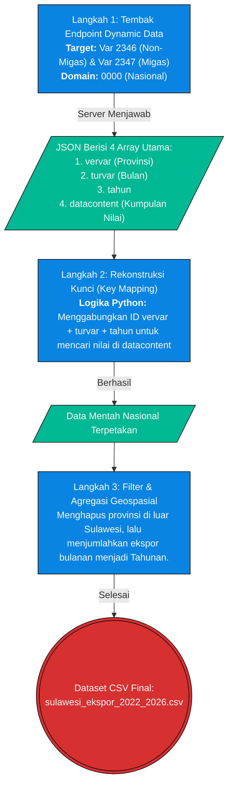

# Metodologi ETL: Ekspor Sektoral (Bab 12.1)

> **Topik:** Akuisisi Data Nilai Ekspor Migas dan Non-Migas Provinsi di Sulawesi  
> **Sumber Data:** API BPS (Sistem *Dynamic Data* / Rilis Dinamis)  
> **Skrip Python:** `tools/bpsapi/fetch_bps_ekspor_provinsi.py` dkk.

Dokumen ini memetakan *pipeline* ETL untuk menarik angka agregat ekspor dari pangkalan data BPS. Berbeda dengan data PDRB yang menggunakan sistem modern SIMDASI, data ekspor ditarik menggunakan infrastruktur **Dynamic Data API** lawas milik BPS.

---

## 1. Teknik Akuisisi & Endpoint API

Sistem *Dynamic Data* memiliki skema URL yang lebih kompleks di mana data ditarik berdasarkan "Kode Variabel". Karena variabel ekspor ini di-indeks secara Nasional, skrip kita menembak Domain Nasional (`0000`), lalu mem-filter provinsi Sulawesi secara lokal di Python.

### Flowchart Akuisisi Data (Dynamic Data BPS)



---

## 2. Anatomi & Cara Menyusun URL (REST Path)

Format *URL Builder* untuk *Dynamic Data* BPS adalah sebagai berikut:
```text
https://webapi.bps.go.id/v1/api/list/model/data/domain/0000/var/{kode_variabel}/th/{chunk_tahun}/key/{api_key}/
```
- `/domain/0000`: Menandakan pangkalan data Nasional.
- `/var/2346`: Kode variabel untuk *Nilai Ekspor Non-Migas Bulanan Menurut Provinsi Asal Barang*.
- `/th/116:117`: Kode *chunk* periode waktu. Di BPS *Dynamic Data*, tahun tidak ditulis literal `2023`, melainkan kode indeks internal BPS (misal `122` adalah indeks tahun yang harus dicocokkan ke dalam kamus).

---

## 3. Verifikasi Kebenaran API (Uji Postman)

Anda dapat menyalin URL di bawah ini secara langsung ke aplikasi Postman (pastikan menggunakan header `User-Agent: Mozilla/5.0`) untuk melihat betapa mentahnya respons JSON dari *Dynamic Data* dibandingkan *SIMDASI*:

**Uji Coba Tarik Variabel 2346 (Ekspor Non-Migas Nasional, Tahun 2026/Chunk 126):**
Berbeda dengan SIMDASI yang per-provinsi, API *Dynamic Data* ditarik sekaligus secara Nasional per bongkahan waktu (*chunk*). Oleh karena itu, 1 URL ini **berlaku universal** untuk menguji data seluruh provinsi di Indonesia, termasuk ke-6 provinsi di Sulawesi:
```text
https://webapi.bps.go.id/v1/api/list/model/data/domain/0000/var/2346/th/126/key/06fd644648629502353deaed29fc6383/
```

**Respons Server BPS Asli (Sebagian):**
```json
{
  "status": "OK",
  "data-availability": "available",
  "vervar": [
    { "val": 71, "label": "Sulawesi Utara" },
    { "val": 72, "label": "Sulawesi Tengah" }
  ],
  "datacontent": {
    "71234611260": 98.45,
    "72234611260": 1542.10
  }
}
```
*Catatan: Nilai pada `datacontent` dikunci menggunakan kombinasi unik ID Provinsi + ID Var + ID Bulan + ID Tahun. Kodingan ETL di `fetch_bps_ekspor_provinsi.py` bertanggung jawab membongkar dan merakit ulang teka-teki hash kombinasi kunci tersebut agar dapat disajikan sebagai file CSV yang dapat dibaca manusia.*

---

## 4. Validasi Timeframe Historis
Berdasarkan respons dari kumpulan *chunk* waktu BPS (`116:117` hingga `126`), ketersediaan data *real* yang diberikan oleh server BPS API (Dynamic Data) untuk Ekspor adalah rentang tahun:
`['2022', '2023', '2024', '2025', '2026']`

Hal ini menjelaskan batasan periode pada sub-bab analisis ekspor yang hanya berfokus pada dinamika 5 tahun terakhir, bukan 10 tahun ke belakang layaknya PDRB. Rentang data *baseline* 2022 ditarik utuh hingga titik observasi terakhir yang tersedia dari pangkalan data resmi BPS.

---

## 5. Pemetaan Dataset Akhir (Data Provenance)
Berdasarkan `DATA_DICTIONARY.md`, *output* matang dari proses ETL Ekspor ini akan digunakan oleh:

| Nama File (*Processed*) | Sumber Asli | Digunakan Pada Bab | Deskripsi |
| :--- | :--- | :--- | :--- |
| `sulawesi_ekspor_2022_2026.csv` | API BPS (Dynamic Data) | Bab 12 | Agregat total nominal ekspor Sulawesi sebagai pembanding pertumbuhan PDRB industri manufaktur dan ekstraktif. |
| `sulawesi_ekspor_detail_2020_2026.csv` | API BPS (Dynamic Data) | Bab 12 | Rincian ekspor berdasar *HS Code* spesifik yang relevan dengan turunan sektor nikel dan hilirisasinya. |
