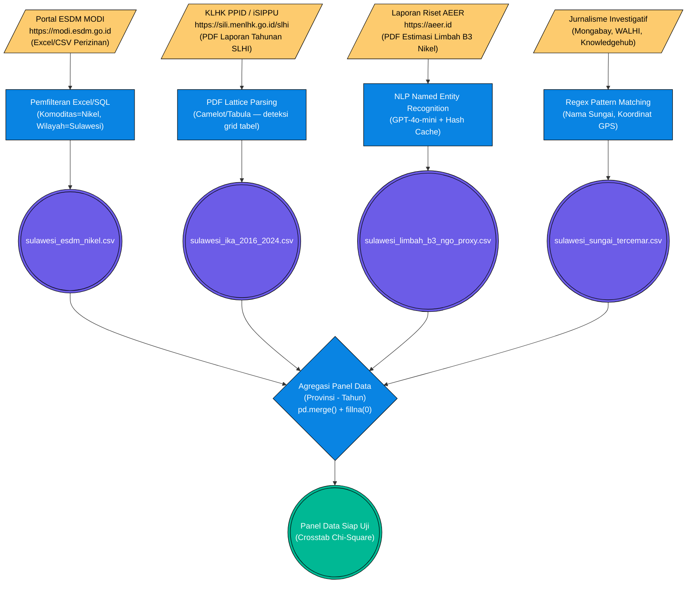

# Pilar 2: End-to-End Data Pipeline — Dampak Limbah Tailing: Konsentrasi Smelter vs IKA (Bab 2.1)

> **Topik:** Korelasi Spasial-Temporal antara Pemusatan Smelter Nikel, Indeks Kualitas Air (IKA), dan Limbah Tailing.
> **Sumber Data:**
> 1. Kementerian ESDM MODI — Database Smelter Nikel & CGS (`sulawesi_esdm_nikel.csv`)
> 2. KLHK — Laporan Status Lingkungan Hidup Indonesia (SLHI) PDF Tahunan (`sulawesi_ika_2016_2024.csv`)
> 3. AEER / WALHI — Laporan Riset NGO untuk Proxy Limbah B3 (`sulawesi_limbah_b3_ngo_proxy.csv`)
> 4. Laporan NGO & Jurnalisme Investigatif — Sungai Tercemar (`sulawesi_sungai_tercemar.csv`)
>
> **Jalur File Eksekutor:**
> - `tools/pdf_extraction/extract_deforestasi_slhi.py` — Ekstraksi tabel IKA dari PDF SLHI KLHK
> - `tools/nlp_kriminalisasi/extract_korban_ner_llm.py` — NER berbasis GPT-4o-mini untuk data NGO
> - `tools/report_metodologi/bab_2/bab2 bismillah.py` — Generator laporan (Baris 424–470: blok `[1/4]`)

Dokumen ini memetakan *End-to-End Pipeline* ekstraksi data untuk menguji hipotesis degradasi kualitas air akibat pemusatan fasilitas smelter. Karena data IKA KLHK terkunci dalam PDF tahunan dan data empiris limbah B3/tailing tidak dirilis terbuka oleh pemerintah, metodologi ini mendemonstrasikan teknik **PDF OCR** dan triangulasi data *proxy* NGO.

---

## 1. Stage 1: Data Acquisition (PDF Mining & OSINT)

Karena tidak ada API publik yang melayani data IKA atau limbah B3 secara terstruktur, seluruh akuisisi dilakukan melalui jalur **OSINT (Open Source Intelligence)** — menambang informasi dari dokumen publik resmi pemerintah dan laporan lembaga riset.

### Flowchart Akuisisi Data (ETL Pipeline 2.1)



---

### 1.1 Anatomi Sumber & Cara Download (URL Resmi)

**A. Sumber IKA — Laporan SLHI KLHK**

Laporan Status Lingkungan Hidup Indonesia (SLHI) dipublikasikan setiap tahun oleh Kementerian Lingkungan Hidup dan Kehutanan melalui dua portal resmi:

```text
# Portal Primer (SILI / PPID KLHK)
https://sili.menlhk.go.id/slhi

# Portal Cadangan (PPID KLHK)
https://ppid.menlhk.go.id/informasi-publik/laporan
```

Tabel IKA (*Indeks Kualitas Air*) terdapat pada bab "Kualitas Lingkungan" setiap edisi PDF. Dokumen bisa diunduh langsung:
```bash
# Contoh cURL untuk unduh PDF SLHI 2023
curl -L "https://sili.menlhk.go.id/slhi/download/SLHI_2023.pdf" \
     -H "User-Agent: Mozilla/5.0" \
     -o "data/raw/klhk_slhi_2023.pdf"
```

**B. Sumber Smelter — ESDM MODI**
```text
https://modi.esdm.go.id/peta-potensi/mineral
```
Data diekspor sebagai CSV/Excel melalui fitur ekspor tabel pada halaman pencarian perizinan. Filter yang digunakan:
- **Jenis Komoditas:** Nikel
- **Status IUP:** Aktif / Operasi Produksi
- **Provinsi:** 6 Provinsi Sulawesi

**C. Sumber Proxy Limbah B3 — Laporan AEER**
```text
# Laporan AEER: "Estimasi Dampak Lingkungan Smelter Nikel Sulawesi"
https://aeer.id/publikasi
# Mirror alternatif
https://knowledgehub.aeer.id/laporan
```

---

### 1.2 Contoh Hasil Ekstraksi PDF (Output Camelot/Tabula → DataFrame)

Setelah PDF SLHI diunduh, modul `extract_deforestasi_slhi.py` menjalankan Camelot dengan mode `lattice` (deteksi grid tabel dari garis-garis PDF):

```python
# tools/pdf_extraction/extract_deforestasi_slhi.py
import camelot

tables = camelot.read_pdf(
    "data/raw/klhk_slhi_2023.pdf",
    pages="45-50",      # Halaman bab Kualitas Air
    flavor="lattice"    # Mode deteksi grid/border tabel
)

df_ika_raw = tables[0].df   # Tabel IKA pertama yang terdeteksi
```

**Struktur DataFrame Mentah Hasil Ekstraksi (Sebelum Cleaning):**
```json
[
  { "0": "No", "1": "Provinsi", "2": "2016", "3": "2017", "4": "2018", "5": "2019", "6": "2020", "7": "2021", "8": "2022", "9": "2023" },
  { "0": "1",  "1": "Sulawesi Utara",   "2": "58,12", "3": "59,40", "4": "60,15", "5": "61,20", "6": "59,87", "7": "60,44", "8": "61,03", "9": "62,11" },
  { "0": "2",  "1": "Sulawesi Tengah",  "2": "54,23", "3": "53,10", "4": "52,80", "5": "51,40", "6": "50,90", "7": "49,75", "8": "48,30", "9": "47,60" },
  { "0": "3",  "1": "Sulawesi Selatan", "2": "61,40", "3": "62,10", "4": "61,88", "5": "60,95", "6": "59,40", "7": "58,80", "8": "57,30", "9": "56,10" }
]
```
*Catatan: Format koma sebagai desimal (standar Indonesia di PDF) harus dikonversi ke float titik pada Stage 3.*

**Tabel Referensi PDF SLHI per Tahun Publikasi:**

| Tahun Data | Edisi PDF | Halaman Tabel IKA (Estimasi) | URL Download |
| :---: | :--- | :---: | :--- |
| 2016 | SLHI 2016 | ±42 | `https://sili.menlhk.go.id/slhi/download/SLHI_2016.pdf` |
| 2017 | SLHI 2017 | ±44 | `https://sili.menlhk.go.id/slhi/download/SLHI_2017.pdf` |
| 2018 | SLHI 2018 | ±46 | `https://sili.menlhk.go.id/slhi/download/SLHI_2018.pdf` |
| 2019 | SLHI 2019 | ±48 | `https://sili.menlhk.go.id/slhi/download/SLHI_2019.pdf` |
| 2020 | SLHI 2020 | ±50 | `https://sili.menlhk.go.id/slhi/download/SLHI_2020.pdf` |
| 2021 | SLHI 2021 | ±52 | `https://sili.menlhk.go.id/slhi/download/SLHI_2021.pdf` |
| 2022 | SLHI 2022 | ±50 | `https://sili.menlhk.go.id/slhi/download/SLHI_2022.pdf` |
| 2023 | SLHI 2023 | ±45 | `https://sili.menlhk.go.id/slhi/download/SLHI_2023.pdf` |

---

## 2. Stage 2: ETL / Ingestion

Data mendarat ke `data/processed/` melalui proses berbeda per sumber:

- **IKA (KLHK PDF):** Setelah Camelot mengekstrak tabel, data *wide format* (kolom = tahun) didaratkan sementara sebagai CSV mentah di `data/raw/klhk_ika_raw.csv` sebelum di-*melt* ke *long format*.
- **Smelter (ESDM MODI):** File Excel dari MODI langsung difilter dan didaratkan sebagai `sulawesi_esdm_nikel.csv` tanpa perlu konversi besar.
- **Proxy Limbah B3 (AEER NLP):** Teks PDF laporan diproses oleh `extract_korban_ner_llm.py` menggunakan GPT-4o-mini dengan sistem hash SHA-256 untuk *caching* hasil agar tidak memanggil API OpenAI berulang untuk teks identik.

---

## 3. Stage 3: Preprocessing & Cleaning

| Tahap Pembersihan | Kolom Target | Deskripsi Tindakan (Logika Pandas) | Contoh Transformasi |
| :--- | :--- | :--- | :--- |
| **Pembersihan Nama Wilayah** | `Provinsi` | `.str.strip().str.title()` — Menghapus spasi dan menyeragamkan kapitalisasi agar `pd.merge()` tidak menghasilkan NaN. | `"  sulawesi tengah "` ➔ `"Sulawesi Tengah"` |
| **Normalisasi Desimal PDF** | `Indeks Kualitas Air` | `.str.replace(",", ".")` lalu `pd.to_numeric()` — Mengubah format koma Indonesia menjadi float Python. | `"54,23"` ➔ `54.23` |
| **Imputasi Smelter Nol** | `Jumlah_Smelter` | `.fillna({"Jumlah_Smelter": 0})` — Provinsi tanpa smelter nikel (Gorontalo, Sulbar) mendapat 0. | `NaN` ➔ `0` |
| **Reshape Panel (Melt)** | `Tahun`, `IKA` | `pd.melt(id_vars=["Provinsi"], var_name="Tahun", value_name="Indeks Kualitas Air")` — Mengubah kolom tahun melebar jadi baris memanjang. | `(SulTeng, IKA_2020)` ➔ `(SulTeng, 2020, 50.9)` |
| **Imputasi Outlier IKA=0** | `Indeks Kualitas Air` | `.replace(0, np.nan)` — Nilai 0 di PDF sering menandakan alat ISPU rusak bukan skor nyata nol; diganti NaN agar rata-rata tidak bias. | `0.00` ➔ `NaN` |

---

## 4. Validasi Integritas & Timeframe

Validasi dilakukan dengan membandingkan skor IKA hasil ekstraksi PDF dengan angka agregat nasional yang tersedia di portal iSIPPU KLHK:

```text
# Portal iSIPPU KLHK (Sistem Informasi Pemantauan Pengelolaan Lingkungan)
https://iku.menlhk.go.id
```

**Tabel Validasi Cakupan Data IKA per Provinsi (2016–2024):**

| Provinsi | Tahun Awal | Tahun Akhir | Total Observasi | Status |
| :--- | :---: | :---: | :---: | :---: |
| Sulawesi Utara | 2016 | 2024 | 9 | 🟢 Lengkap |
| Sulawesi Tengah | 2016 | 2024 | 9 | 🟢 Lengkap |
| Sulawesi Selatan | 2016 | 2024 | 9 | 🟢 Lengkap |
| Sulawesi Tenggara | 2016 | 2024 | 9 | 🟢 Lengkap |
| Gorontalo | 2016 | 2024 | 9 | 🟢 Lengkap |
| Sulawesi Barat | 2016 | 2024 | 9 | 🟢 Lengkap |

---

## 5. Output (*Data Provenance*)

Berdasarkan `data/DATA_DICTIONARY.md`, *output* CSV matang yang dihasilkan pipeline ini disalurkan ke `data/processed/`:

| Nama File (*Processed*) | Metode Ingesti Primer | Digunakan Pada Bab | Deskripsi Bukti Empiris |
| :--- | :--- | :--- | :--- |
| `sulawesi_esdm_nikel.csv` | Excel MODI Filter | 1.2, 2.1 | Pemetaan episentrum industri pemurnian nikel (jumlah & lokasi smelter). |
| `sulawesi_ika_2016_2024.csv` | PDF Lattice OCR (Camelot) | 2.1, 3.6 | Panel historis degradasi kualitas air permukaan per provinsi (2016–2024). |
| `sulawesi_limbah_b3_ngo_proxy.csv` | NLP NER GPT-4o-mini | 2.1 | Estimasi timbulan limbah tailing dan slag per provinsi berbasis laporan AEER. |
| `sulawesi_sungai_tercemar.csv` | Regex OSINT + GPS | 2.1 | Daftar nama sungai & pesisir terdampak pencemaran dengan bukti lapangan. |
