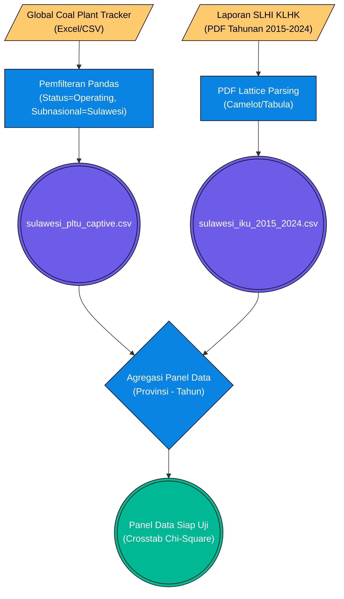

# Pilar 2: End-to-End Data Pipeline - Kapasitas PLTU vs Indeks Kualitas Udara (Bab 2.2)

> **Topik:** Dampak Pembangunan PLTU Captive terhadap Penurunan Indeks Kualitas Udara (IKU) di Pulau Sulawesi.
> **Sumber Data:** 
> 1. Global Energy Monitor (GEM) - *Global Coal Plant Tracker*
> 2. Laporan Status Lingkungan Hidup KLHK (Indeks Kualitas Udara)
> **Jalur File Eksekutor:** Script ingest BPS/KLHK dan penyatuan regresi crosstab Pandas dalam `bab2 bismillah.py`.

Dokumen ini mendokumentasikan metodologi rekayasa data untuk menyelaraskan kapasitas energi kotor (PLTU Captive batu bara) yang digunakan untuk menyuplai smelter, dengan pengukur standar baku kualitas udara dari Kementerian LHK, guna diuji menggunakan tabulasi silang (Chi-Square).

---

## 1. Stage 1: Data Acquisition (ETL Pipeline 2.2)

Variabel independen (X) dan dependen (Y) dipanen dari format yang sama sekali berbeda:
1. **PLTU Captive (Variabel X):** Diperoleh dari basis data global NGO (GEM), format XLSX, yang mencatat ribuan pembangkit listrik di seluruh dunia.
2. **Indeks Kualitas Udara (Variabel Y):** Diperoleh dari PDF Laporan Tahunan KLHK (SLHI) 2015-2024 (sama halnya dengan Indeks Kualitas Air pada sub-bab sebelumnya).

### Flowchart Ekstraksi Data (PLTU vs IKU)

---

## 2. Stage 2: Ingestion & Preprocessing

Siklus penyiapan data meliputi standardisasi skema agar kedua kerangka waktu (*time-series*) dan ruang spasial sinkron:

1. **Pemfilteran Skala Pembangkit:** Dataset GEM memiliki cakupan global. Script mengeksekusi penyaringan bertingkat:
   - `Country == "Indonesia"`
   - `Status == "operating"` (Hanya PLTU yang sudah menyala dan membakar batu bara, menyingkirkan status *planned* atau *cancelled*).
   - Menyeleksi kolom sub-nasional (Provinsi) yang mengandung kata `Sulawesi`.
2. **Pembersihan Outlier IKU:** Pada beberapa tabel PDF lama KLHK, nilai "0" (nol) sering digunakan untuk menandakan ketiadaan alat pengukur (alat ISPU rusak). Sistem menggantikan skor "0" menjadi `NaN` agar rata-rata statistik provinsi tidak anjlok secara palsu (mencegah *skewed distribution*).
3. **Melt & GroupBy (Pandas):** 
   - IKU tahunan yang bentuknya melebar dikonversi menjadi memanjang (*long format*).
   - Kapasitas PLTU diagregasi dari hitungan per unit/pembangkit menjadi per provinsi menggunakan: `df.groupby("Provinsi")["Kapasitas (MW)"].sum()`.

---

## 3. Stage 3: Pemetaan Chi-Square (Uji Empiris)

Setelah digabungkan berdasarkan kunci relasional `Provinsi`, arsitektur matriks panel diubah ke kategori biner/ordinal untuk siap diuji:

| Variabel | Tipe Data Asli | Threshold Kategori Chi-Square |
| :--- | :--- | :--- |
| **Kapasitas PLTU** (X) | Numerik Kontinu (MW) | Dikelompokkan menjadi `"Tinggi"` jika nilai berada di atas nilai median kapasitas PLTU, sebaliknya `"Rendah"`. |
| **Indeks Kualitas Udara** (Y) | Numerik Kontinu (Skor) | Dikelompokkan menjadi `"Buruk"` jika IKU berada di bawah median IKU provinsi sentra, sebaliknya `"Baik"`. |

Metode ini memastikan model inferensial (Odds Ratio / *p-value*) di dalam modul `calculate_spss_style_crosstab()` milik Celios dapat mengidentifikasi signifikansi statistik antara seberapa berat kepungan asap (*smog*) dengan seberapa tebal konsentrasi kapasitas PLTU batu bara di suatu provinsi (seperti Sulawesi Tengah & Sulawesi Tenggara).

---

## 4. Output (*Data Provenance*)

Berikut adalah aset CSV fiks yang dilahirkan dan diteruskan untuk eksekusi algoritma Bab 2.2:

| Nama File (*Processed*) | Metode Ingesti Primer | Digunakan Pada Bab | Deskripsi Bukti Empiris |
| :--- | :--- | :--- | :--- |
| `sulawesi_pltu_captive.csv` | Excel Query | 1.2, 2.2 | Pemetaan sumber polusi statis (cerobong asap) pembangkit termal. |
| `sulawesi_iku_2015_2024.csv` | PDF Lattice OCR | 2.2, 3.6 | Tren makro kualitas udara standar kementerian lingkungan. |
