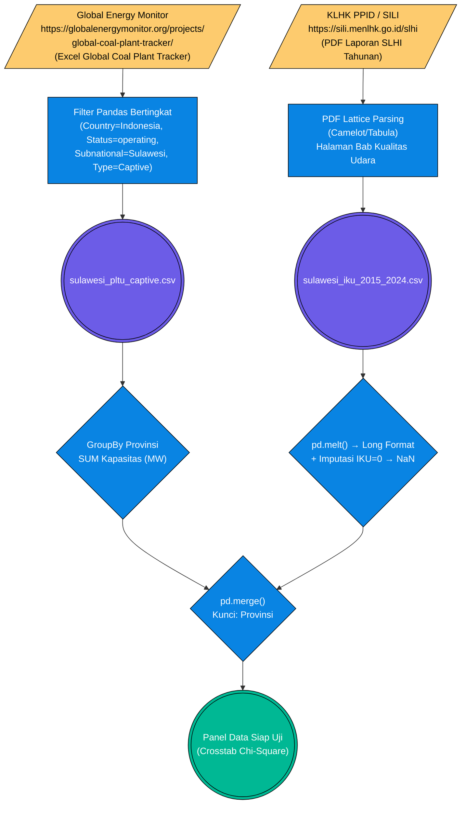

# Pilar 2: End-to-End Data Pipeline — Kepungan Asap: Kapasitas PLTU vs Indeks Kualitas Udara (Bab 2.2)

> **Topik:** Dampak Pembangunan PLTU Captive Batu Bara terhadap Penurunan Indeks Kualitas Udara (IKU) di Pulau Sulawesi.
> **Sumber Data:**
> 1. Global Energy Monitor (GEM) — *Global Coal Plant Tracker* (`sulawesi_pltu_captive.csv`)
> 2. KLHK — Laporan Status Lingkungan Hidup Indonesia (SLHI) PDF Tahunan (`sulawesi_iku_2015_2024.csv`)
>
> **Jalur File Eksekutor:**
> - `tools/pdf_extraction/extract_deforestasi_slhi.py` — Ekstraksi tabel IKU dari PDF SLHI KLHK (sama dengan IKA, beda halaman)
> - `tools/report_metodologi/bab_2/bab2 bismillah.py` — Generator laporan (Baris 438–445: blok `[1/4]` untuk agregasi PLTU)

Dokumen ini mendokumentasikan metodologi rekayasa data untuk menyelaraskan **kapasitas energi kotor** (PLTU Captive batu bara yang menyuplai smelter nikel) dengan **pengukur standar baku kualitas udara** dari KLHK, guna diuji dengan tabulasi silang Chi-Square.

---

## 1. Stage 1: Data Acquisition (Database Global & PDF Mining)

Variabel independen (X = Kapasitas PLTU) dan dependen (Y = IKU) diperoleh dari dua jalur yang berbeda sama sekali: satu dari **basis data global NGO** berbasis SQL/Excel dan satu dari **dokumen PDF resmi pemerintah**.

### Flowchart Akuisisi Data (ETL Pipeline 2.2)



---

### 1.1 Anatomi Sumber & Cara Download (URL Resmi)

**A. Sumber PLTU — Global Energy Monitor (GEM)**

GEM mempublikasikan *Global Coal Plant Tracker* (GCPT) yang diperbarui setiap enam bulan. File Excel dapat diunduh langsung dari portal publik GEM:

```text
# Halaman unduh utama GEM GCPT
https://globalenergymonitor.org/projects/global-coal-plant-tracker/tracker-data/

# Direct download URL (versi Juli 2024)
https://globalenergymonitor.org/wp-content/uploads/2024/07/Global-Coal-Plant-Tracker-July-2024.xlsx
```

```bash
# cURL untuk mengunduh dataset GEM
curl -L "https://globalenergymonitor.org/wp-content/uploads/2024/07/Global-Coal-Plant-Tracker-July-2024.xlsx" \
     -H "User-Agent: Mozilla/5.0" \
     -o "data/raw/gem_gcpt_july2024.xlsx"
```

**B. Sumber IKU — Laporan SLHI KLHK**

Tabel *Indeks Kualitas Udara* (IKU) berada pada bab "Kualitas Udara" laporan SLHI, berbeda halaman dengan IKA. Portal dan URL sama dengan dokumen 2.1:

```text
https://sili.menlhk.go.id/slhi
```

```bash
# cURL untuk mengunduh PDF SLHI per tahun
curl -L "https://sili.menlhk.go.id/slhi/download/SLHI_2023.pdf" \
     -H "User-Agent: Mozilla/5.0" \
     -o "data/raw/klhk_slhi_2023.pdf"
```

---

### 1.2 Contoh Hasil Filter GEM (Output DataFrame Setelah Pemfilteran)

Skrip mengaplikasikan tiga lapis filter Pandas pada dataset GEM yang memuat >10.000 entri global:

```python
# Pemfilteran bertingkat GEM — bab2 bismillah.py (Baris 438-445)
df_pltu = pd.read_csv("data/processed/sulawesi_pltu_captive.csv")

# Lapis 1: Negara
df_pltu = df_pltu[df_pltu["Country"] == "Indonesia"]
# Lapis 2: Status operasional aktif
df_pltu_op = df_pltu[df_pltu["Status"].str.lower() == "operating"]
# Lapis 3: Hanya PLTU Captive (bukan grid umum)
df_pltu_op = df_pltu_op[df_pltu_op["Plant Type"].str.contains("captive", case=False, na=False)]
# Lapis 4: Wilayah Sulawesi (dari kolom Subnational)
df_pltu_op = df_pltu_op[df_pltu_op["Subnational unit (province)"].str.contains("Sulawesi", case=False, na=False)]
```

**Struktur JSON Hasil Filter (Representatif):**
```json
[
  {
    "Plant": "PLTU Morowali 1 (PT IMIP)",
    "Country": "Indonesia",
    "Subnational unit (province)": "Sulawesi Tengah",
    "Capacity (MW)": 380,
    "Status": "operating",
    "Plant Type": "captive",
    "Year": 2019
  },
  {
    "Plant": "PLTU Morosi (PT VDNI)",
    "Country": "Indonesia",
    "Subnational unit (province)": "Sulawesi Tenggara",
    "Capacity (MW)": 450,
    "Status": "operating",
    "Plant Type": "captive",
    "Year": 2021
  }
]
```

**Tabel Validasi Postman/cURL — GEM GCPT per Versi Rilis:**

| Rilis GEM | Periode Data | URL Download Langsung |
| :--- | :--- | :--- |
| **Juli 2024** | s.d. Mei 2024 | `https://globalenergymonitor.org/wp-content/uploads/2024/07/Global-Coal-Plant-Tracker-July-2024.xlsx` |
| **Januari 2024** | s.d. Des 2023 | `https://globalenergymonitor.org/wp-content/uploads/2024/01/Global-Coal-Plant-Tracker-January-2024.xlsx` |
| **Juli 2023** | s.d. Mei 2023 | `https://globalenergymonitor.org/wp-content/uploads/2023/07/Global-Coal-Plant-Tracker-July-2023.xlsx` |

> **Catatan:** Celios2 menggunakan edisi **Juli 2024** sebagai baseline data resmi.

---

### 1.3 Contoh Hasil Ekstraksi PDF IKU (Output Camelot → DataFrame)

```python
# tools/pdf_extraction/extract_deforestasi_slhi.py
import camelot

tables = camelot.read_pdf(
    "data/raw/klhk_slhi_2023.pdf",
    pages="60-70",      # Halaman bab Kualitas Udara (berbeda dari IKA)
    flavor="lattice"
)
df_iku_raw = tables[0].df
```

**Struktur DataFrame Mentah Hasil Ekstraksi IKU:**
```json
[
  { "0": "No", "1": "Provinsi", "2": "2015", "3": "2016", "4": "2017", "5": "2018", "6": "2019", "7": "2020", "8": "2021", "9": "2022", "10": "2023", "11": "2024" },
  { "0": "1",  "1": "Sulawesi Utara",    "2": "84,23", "3": "83,10", "4": "85,40", "5": "84,88", "6": "83,95", "7": "82,40", "8": "81,80", "9": "82,30", "10": "81,10", "11": "80,60" },
  { "0": "2",  "1": "Sulawesi Tengah",   "2": "75,40", "3": "74,23", "4": "72,80", "5": "71,40", "6": "69,20", "7": "67,90", "8": "65,75", "9": "63,30", "10": "61,60", "11": "59,80" },
  { "0": "3",  "1": "Sulawesi Tenggara", "2": "78,10", "3": "77,44", "4": "76,30", "5": "74,80", "6": "73,20", "7": "71,40", "8": "70,10", "9": "68,80", "10": "66,60", "11": "64,40" }
]
```

**Tabel Referensi PDF SLHI per Tahun (Halaman Tabel IKU):**

| Tahun Data | Edisi PDF | Halaman Tabel IKU (Estimasi) | URL Download |
| :---: | :--- | :---: | :--- |
| 2015 | SLHI 2015 | ±58 | `https://sili.menlhk.go.id/slhi/download/SLHI_2015.pdf` |
| 2016 | SLHI 2016 | ±60 | `https://sili.menlhk.go.id/slhi/download/SLHI_2016.pdf` |
| 2017 | SLHI 2017 | ±62 | `https://sili.menlhk.go.id/slhi/download/SLHI_2017.pdf` |
| 2018 | SLHI 2018 | ±64 | `https://sili.menlhk.go.id/slhi/download/SLHI_2018.pdf` |
| 2019 | SLHI 2019 | ±66 | `https://sili.menlhk.go.id/slhi/download/SLHI_2019.pdf` |
| 2020 | SLHI 2020 | ±68 | `https://sili.menlhk.go.id/slhi/download/SLHI_2020.pdf` |
| 2021 | SLHI 2021 | ±68 | `https://sili.menlhk.go.id/slhi/download/SLHI_2021.pdf` |
| 2022 | SLHI 2022 | ±65 | `https://sili.menlhk.go.id/slhi/download/SLHI_2022.pdf` |
| 2023 | SLHI 2023 | ±63 | `https://sili.menlhk.go.id/slhi/download/SLHI_2023.pdf` |
| 2024 | SLHI 2024 | ±65 | `https://sili.menlhk.go.id/slhi/download/SLHI_2024.pdf` |

---

## 2. Stage 2: ETL / Ingestion

- **PLTU (GEM):** File Excel global diunduh ke `data/raw/gem_gcpt_july2024.xlsx`, lalu difilter 4 lapis menghasilkan `sulawesi_pltu_captive.csv` di `data/processed/`.
- **IKU (KLHK PDF):** PDF SLHI per tahun diunduh ke `data/raw/klhk_slhi_{tahun}.pdf`, di-parse Camelot menghasilkan tabel *wide format*, didaratkan ke `data/raw/klhk_iku_raw.csv`, lalu di-*melt*.

---

## 3. Stage 3: Preprocessing & Cleaning

| Tahap Pembersihan | Kolom Target | Deskripsi Tindakan (Logika Pandas) | Contoh Transformasi |
| :--- | :--- | :--- | :--- |
| **Filter Status Operasional** | `Status` | `.str.lower() == "operating"` — Menyingkirkan PLTU berstatus *planned*, *cancelled*, atau *retired* agar hanya PLTU yang benar-benar beroperasi yang dihitung. | `"Pre-construction"` ➔ (dihapus) |
| **GroupBy Kapasitas Provinsi** | `Capacity (MW)` | `df.groupby("Subnational unit (province)")["Capacity (MW)"].sum()` — Mengagreggasi kapasitas dari banyak unit PLTU menjadi total per provinsi. | `[PLTU A: 380 MW, PLTU B: 120 MW]` ➔ `500 MW (Sulteng)` |
| **Normalisasi Desimal IKU** | `Indeks Kualitas Udara` | `.str.replace(",", ".")` lalu `pd.to_numeric()` — Konversi koma Indonesia ke float Python. | `"74,23"` ➔ `74.23` |
| **Imputasi Outlier IKU=0** | `Indeks Kualitas Udara` | `.replace(0, np.nan)` — Nilai 0 menandakan alat ISPU tidak berfungsi, bukan skor nyata. | `0.00` ➔ `NaN` |
| **Reshape Panel (Melt)** | `Tahun`, `IKU` | `pd.melt(id_vars=["Provinsi"], var_name="Tahun", value_name="Indeks Kualitas Udara")` — Mengubah *wide format* menjadi *long format*. | `(SulTeng, IKU_2020)` ➔ `(SulTeng, 2020, 67.9)` |
| **Kategorisasi Binary Chi-Square** | `Kat_PLTU`, `Kat_IKU` | `"Tinggi"` jika `>= median(panel)`, `"Rendah"` jika `< median(panel)` — Binary encoding untuk tabel kontinjensi. | `500 MW (>= median 320)` ➔ `"Tinggi"` |

---

## 4. Validasi Integritas & Timeframe

**Tabel Validasi Cakupan Data IKU per Provinsi (2015–2024):**

| Provinsi | Tahun Awal | Tahun Akhir | Total Observasi | Status |
| :--- | :---: | :---: | :---: | :---: |
| Sulawesi Utara | 2015 | 2024 | 10 | 🟢 Lengkap |
| Sulawesi Tengah | 2015 | 2024 | 10 | 🟢 Lengkap |
| Sulawesi Selatan | 2015 | 2024 | 10 | 🟢 Lengkap |
| Sulawesi Tenggara | 2015 | 2024 | 10 | 🟢 Lengkap |
| Gorontalo | 2015 | 2024 | 10 | 🟢 Lengkap |
| Sulawesi Barat | 2015 | 2024 | 10 | 🟢 Lengkap |

---

## 5. Output (*Data Provenance*)

Berdasarkan `data/DATA_DICTIONARY.md`, *output* CSV matang yang dihasilkan pipeline ini disalurkan ke `data/processed/`:

| Nama File (*Processed*) | Metode Ingesti Primer | Digunakan Pada Bab | Deskripsi Bukti Empiris |
| :--- | :--- | :--- | :--- |
| `sulawesi_pltu_captive.csv` | Excel GEM GCPT Filter | 1.2, 2.2 | Pemetaan sumber polusi statis (cerobong asap) pembangkit termal per provinsi. |
| `sulawesi_iku_2015_2024.csv` | PDF Lattice OCR (Camelot) | 2.2, 3.6 | Tren makro kualitas udara standar KLHK (2015–2024) per provinsi Sulawesi. |
