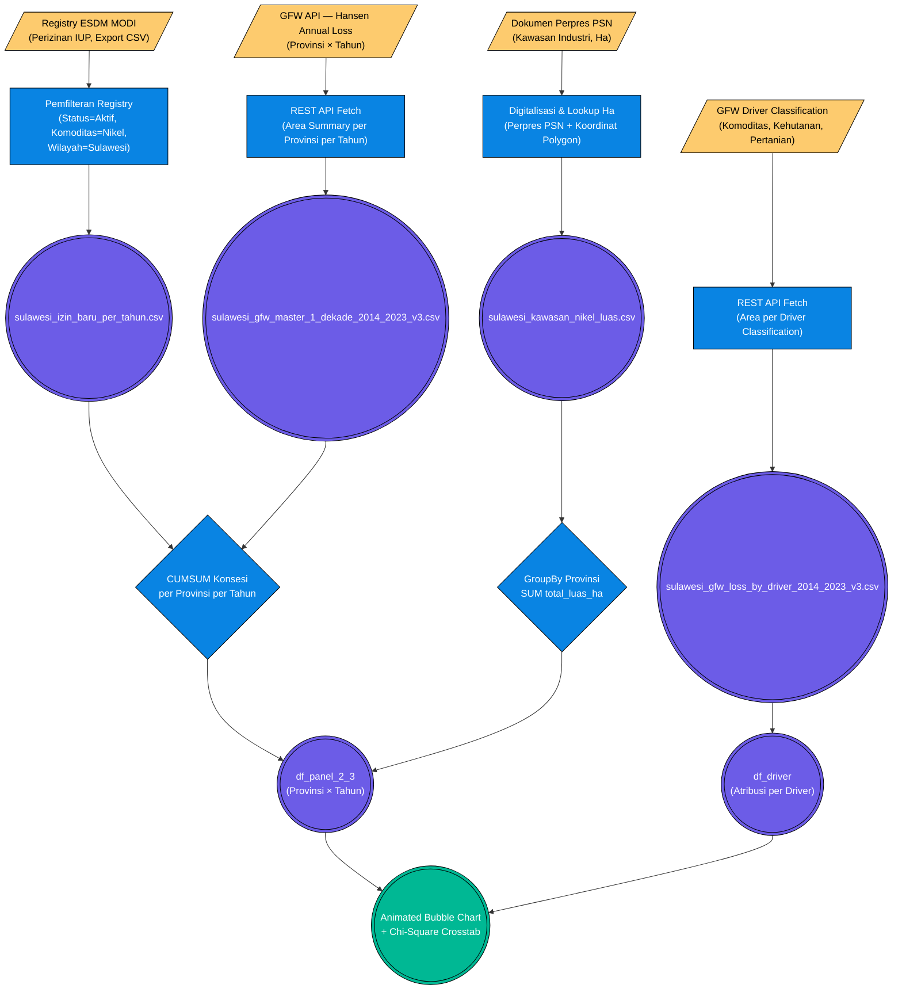

# Pilar 2: End-to-End Data Pipeline — Eksekusi Ruang: Ekspansi Kawasan Industri vs Tekanan Ekologis / Deforestasi (Bab 2.3)

> **Topik:** Korelasi Spasial-Temporal antara Ekspansi Konsesi IUP & Kawasan Industri Nikel dengan Laju Deforestasi Sulawesi (2014–2023).
> **Sumber Data:**
> 1. Kementerian ESDM MODI — Basis Data Perizinan Tambang (`sulawesi_izin_baru_per_tahun.csv`)
> 2. Kementerian ESDM MODI — Peta Luas Kawasan Industri Nikel (`sulawesi_kawasan_nikel_luas.csv`)
> 3. Global Forest Watch (GFW) API — Data Hilang Tutupan Pohon (`sulawesi_gfw_master_1_dekade_2014_2023_v3.csv`)
> 4. GFW Driver-of-Deforestation Classification (`sulawesi_gfw_loss_by_driver_2014_2023_v3.csv`)
>
> **Jalur File Eksekutor:**
> - `tools/report_metodologi/bab_2/bab2 bismillah.py` — (Baris 631–730: blok `[2.7/4]`)
> - `tools/gfw/fetch_gfw_data.py` — Fetcher API GFW Planet API atau GFW Pro API

Dokumen ini memetakan *End-to-End Pipeline* rekayasa data untuk membuktikan hipotesis **apakah luasan ekspansi kawasan industri dan perizinan tambang berbanding lurus dengan laju deforestasi** di Pulau Sulawesi dalam satu dekade (2014–2023). Sub-bab 2.3 secara khusus menjadi satu-satunya analisis Bab 2 yang menggunakan dua visualisasi serentak: *Animated Bubble Chart* (Hans Rosling-style) untuk dimensi spasio-temporal dan *Chi-Square Crosstabulation* untuk validasi statistik inferensial.

---

## 1. Stage 1: Data Acquisition (API & Registry Mining)

Sub-bab 2.3 menggabungkan dua kelas data yang sangat berbeda: data **hak/izin administratif** (berapa luas izin yang diterbitkan) dan data **dampak ekologis terukur** (berapa hektar hutan yang hilang). Keduanya ditambang dari dua jalur akuisisi terpisah.

### 1.1 Jalur A: Perizinan & Konsesi Tambang (ESDM MODI)

Data mentah IUP (*Izin Usaha Pertambangan*) bersumber dari portal **Mineral One Data Indonesia (MODI)** milik Kementerian ESDM. MODI menyimpan registry seluruh izin pertambangan aktif di Indonesia. Data difilter secara manual atau melalui query terstruktur dan diekspor ke CSV/Excel. Kolom kunci yang diperlukan adalah `provinsi`, `total_luas_ha` (luas konsesi dalam hektar), dan `tahun_terbit`.

Untuk data luas **Kawasan Industri** (IWIP, IMIP, dsb.), sumber dilengkapi dengan dokumen resmi **Perpres PSN** (*Proyek Strategis Nasional*) yang memuat koordinat polygon dan luas hektar resmi kawasan.

### 1.2 Jalur B: Data Deforestasi — GFW Planet API

Data kehilangan tutupan pohon (*tree cover loss*) diperoleh dari **Global Forest Watch (GFW)** — platform sumber terbuka yang mengintegrasikan citra satelit Hansen/UMD resolusi 30 meter. GFW menyediakan dua dataset berbeda yang digunakan secara simultan:

| Dataset GFW | Granularitas | Cakupan Tahun | Kunci Kolom |
| :--- | :--- | :--- | :--- |
| **Hansen Annual Loss** | Provinsi × Tahun | 2014–2023 | `Provinsi`, `Tahun`, `Total_Deforestasi_Ha` |
| **Driver Classification** | Provinsi × Driver | 2014–2023 | `Driver_Deforestasi`, `Total_Deforestasi_Ha` |

### Flowchart Akuisisi Data (ETL Pipeline 2.3)



---

## 2. Stage 2: ETL / Ingestion

Masing-masing dataset mendarat ke direktori `data/processed/` melalui proses transformasi yang berbeda:

- **`sulawesi_izin_baru_per_tahun.csv`:** Data MODI dikelompokkan per provinsi dan tahun terbit izin, menghasilkan kolom `Total_Luas_Konsesi_Baru_Ha` yang merepresentasikan *laju* ekspansi izin baru per tahun.
- **`sulawesi_kawasan_nikel_luas.csv`:** Digitalisasi dari tabel Perpres PSN. Setiap baris mewakili satu kawasan industri dengan kolom `nama_kawasan`, `provinsi`, dan `total_luas_ha`.
- **`sulawesi_gfw_master_1_dekade_2014_2023_v3.csv`:** Tabel panjang (*long format*) hasil agregasi GFW API dengan dimensi `Provinsi × Tahun`, merekam `Total_Deforestasi_Ha` tiap kombinasi.
- **`sulawesi_gfw_loss_by_driver_2014_2023_v3.csv`:** Atribusi luas deforestasi per faktor pendorong (*driver*), meliputi: Industri Ekstraktif (Tambang/Sawit), Kehutanan Komersial, Pertanian Berpindah, Urbanisasi, dan Tidak Teridentifikasi.

---

## 3. Stage 3: Preprocessing & Cleaning

Penyelarasan skema dan kalkulasi metrik kumulatif diperlukan sebelum kedua dimensi (tekanan ruang vs dampak ekologi) dapat digabungkan dalam satu *dataframe* panel yang kohesif.

| Tahap Pembersihan | Kolom Target | Deskripsi Tindakan (Logika Pandas) | Contoh Transformasi |
| :--- | :--- | :--- | :--- |
| **Standardisasi Nama Provinsi** | `Provinsi` / `provinsi` | `.str.strip().str.title()` — Menyeragamkan kapitalisasi dan menghapus spasi agar `pd.merge()` pada kolom `Provinsi` tidak gagal (*key mismatch*). | `"sulawesi tengah"` ➔ `"Sulawesi Tengah"` |
| **GroupBy Luas Kawasan** | `total_luas_ha` | `df_luas.groupby("provinsi")["total_luas_ha"].sum()` — Mengagreggasi luas dari banyak kawasan industri individu menjadi total per provinsi. | `[IMIP 3000 Ha, IWIP 2600 Ha, ...]` ➔ `5600 Ha (Sulteng)` |
| **CUMSUM Konsesi Baru** | `Total_Luas_Konsesi_Baru_Ha` | `df_izin.groupby("Provinsi")["Total_Luas_Konsesi_Baru_Ha"].cumsum()` — Menghitung akumulasi bertahap izin baru dari 2014 s.d. tahun berjalan untuk membentuk kurva eksponensial ekspansi. | `[2014: 50Ha, 2015: 80Ha]` ➔ `[2014: 50Ha, 2015: 130Ha]` |
| **Imputasi NaN Merge** | `Luas_IUP_Kawasan_Ha` | `.fillna(0)` — Provinsi tanpa kawasan industri resmi (misal: Gorontalo) akan mendapatkan nilai 0 agar tidak terdrop dari panel. | `NaN` ➔ `0` |
| **Kategorisasi Binary (Chi-Square)** | `Kat_Konsesi`, `Kat_Deforestasi` | `"Tinggi"` jika nilai `>= median(panel)`, `"Rendah"` jika `< median(panel)`. Threshold median dihitung dari seluruh observasi panel (bukan per provinsi). | `42,000 Ha (>= median 36,500)` ➔ `"Tinggi"` |
| **Driver Mapping** | Kolom nama *driver* raw GFW | `driver_map = {"Commodity": "Industri Ekstraktif", ...}` — Remapping nama kolom teknis GFW ke label Bahasa Indonesia yang muncul di *dashboard* Streamlit. | `"Commodity driven deforestation"` ➔ `"Industri Ekstraktif (Tambang/Sawit)"` |

---

## 4. Stage 4: Validasi Integritas & Timeframe

Konsistensi cakupan tahun diverifikasi sebelum kalkulasi CUMSUM dieksekusi, untuk memastikan tidak ada celah (*gap*) dalam deret waktu 10 tahun:

```python
# Validasi ketersediaan tahun (blok [2.7/4] — bab2 bismillah.py)
SULAWESI_PROVS = [
    "Sulawesi Tengah", "Sulawesi Tenggara", "Sulawesi Selatan",
    "Sulawesi Utara", "Sulawesi Barat", "Gorontalo"
]
GFW_YEARS = list(range(2014, 2024))  # 10 tahun

# Verifikasi coverage panel (expected: 6 provinsi × 10 tahun = 60 baris)
valid_panel = df_panel_2_3.dropna(subset=["Total_Deforestasi_Ha", "Luas_IUP_Kawasan_Ha"])
valid_cases_23 = len(valid_panel)
```

**Tabel Validasi Ketersediaan Data Panel:**

| Provinsi | Tahun Pertama GFW | Tahun Terakhir GFW | Data Kawasan (Ha) | Status |
| :--- | :---: | :---: | :---: | :---: |
| Sulawesi Tengah | 2014 | 2023 | ✅ Tersedia | 🟢 Lengkap |
| Sulawesi Tenggara | 2014 | 2023 | ✅ Tersedia | 🟢 Lengkap |
| Sulawesi Selatan | 2014 | 2023 | ✅ Tersedia | 🟢 Lengkap |
| Sulawesi Utara | 2014 | 2023 | ✅ Tersedia | 🟢 Lengkap |
| Sulawesi Barat | 2014 | 2023 | ✅ Tersedia | 🟢 Lengkap |
| Gorontalo | 2014 | 2023 | ⚠️ Imputed 0 | 🟡 Diimputasi |

---

## 5. Output (*Data Provenance*)

Berikut adalah matriks aset pangkalan data yang dihasilkan oleh koridor *pipeline* ini dan disalurkan ke sub-bab 2.3:

| Nama File (*Processed*) | Metode Ingesti Primer | Digunakan Pada Bab | Deskripsi Bukti Empiris |
| :--- | :--- | :--- | :--- |
| `sulawesi_izin_baru_per_tahun.csv` | SQL/Excel MODI Registry | 1.3, 2.3 | Deret historis laju penerbitan izin tambang baru per provinsi per tahun. |
| `sulawesi_kawasan_nikel_luas.csv` | Digitalisasi Perpres PSN | 1.3, 2.3 | Luas resmi kawasan industri nikel (IWIP, IMIP, dll.) per provinsi. |
| `sulawesi_gfw_master_1_dekade_2014_2023_v3.csv` | GFW API (Hansen Loss) | 1.4, 2.3, 2.4 | Panel deforestasi provinsi-tahun selama satu dekade. |
| `sulawesi_gfw_loss_by_driver_2014_2023_v3.csv` | GFW API (Driver Classif.) | 2.3, 2.4 | Atribusi luas deforestasi per faktor pendorong (industri vs pertanian). |
