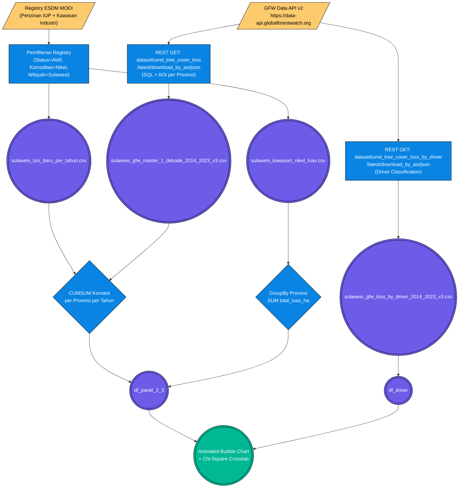

# Pilar 2: End-to-End Data Pipeline — Eksekusi Ruang: Ekspansi Kawasan Industri vs Tekanan Ekologis / Deforestasi (Bab 2.3)

> **Topik:** Korelasi Spasial-Temporal antara Ekspansi Konsesi IUP & Kawasan Industri Nikel dengan Laju Deforestasi Sulawesi (2014–2023).
> **Sumber Data:**
> 1. Kementerian ESDM MODI — Basis Data Perizinan Tambang (`sulawesi_izin_baru_per_tahun.csv`)
> 2. Kementerian ESDM MODI — Peta Luas Kawasan Industri Nikel (`sulawesi_kawasan_nikel_luas.csv`)
> 3. Global Forest Watch (GFW) Data API v2 — Hansen Tree Cover Loss (`sulawesi_gfw_master_1_dekade_2014_2023_v3.csv`)
> 4. Global Forest Watch (GFW) Data API v2 — Driver Classification (`sulawesi_gfw_loss_by_driver_2014_2023_v3.csv`)
>
> **Jalur File Eksekutor:**
> - `tools/gfw/fetch_sulawesi_final.py` — Fetcher utama GFW API (Hansen Annual Loss per Provinsi)
> - `tools/gfw/fetch_drivers_via_land_api_v3.py` — Fetcher driver classification GFW
> - `tools/report_metodologi/bab_2/bab2 bismillah.py` — Generator laporan (Baris 631–730: blok `[2.7/4]`)

Dokumen ini memetakan *End-to-End Pipeline* rekayasa data untuk membuktikan hipotesis **apakah luasan ekspansi kawasan industri dan perizinan tambang berbanding lurus dengan laju deforestasi** di Pulau Sulawesi dalam satu dekade (2014–2023).

---

## 1. Stage 1: Data Acquisition (GFW Data API v2)

Sub-bab 2.3 mengkombinasikan data **hak administratif** (luas izin yang diterbitkan negara) dengan data **dampak ekologis terukur** (hektar tutupan hutan yang hilang terdeteksi satelit). Data ekologis diperoleh dari GFW Data API v2 yang dibangun di atas citra satelit resolusi 30 meter dari **Hansen/UMD Global Forest Change**.

### Flowchart Akuisisi Data (ETL Pipeline 2.3)



---

### 1.1 Anatomi & Cara Menyusun URL (REST Path GFW Data API v2)

GFW Data API menggunakan pola `dataset/{dataset_name}/{version}/download_by_aoi/{format}`. Setiap *request* wajib menyertakan header `x-api-key` dan dua parameter query: `sql` (query SQL terhadap dataset) dan `aoi` (JSON yang mendefinisikan wilayah administratif).

**A. URL Fetcher Annual Tree Cover Loss (Hansen)**
```text
GET https://data-api.globalforestwatch.org/dataset/umd_tree_cover_loss/latest/download_by_aoi/json
```
- `umd_tree_cover_loss` : Dataset Hansen/UMD — kehilangan tutupan pohon tahunan.
- `latest` : Versi dataset terbaru yang tersedia di server GFW.
- `download_by_aoi` : Endpoint untuk menarik data berdasarkan *Area of Interest* (AOI) tertentu.
- Header wajib: `x-api-key: 21899f40-1f6d-4ff9-93e1-c10d04513984`

**Query SQL yang Dikirim (Parameter `sql`):**
```sql
SELECT
    umd_tree_cover_loss__year AS year,
    SUM(area__ha) AS deforestation_ha
FROM data
WHERE umd_tree_cover_loss__year >= 2014
  AND umd_tree_cover_loss__year <= 2023
GROUP BY umd_tree_cover_loss__year
ORDER BY umd_tree_cover_loss__year
```

**Parameter AOI (JSON per Provinsi) yang Dikirim:**
```json
{
  "type": "admin",
  "country": "IDN",
  "region": "29"
}
```
*(Contoh untuk Sulawesi Tengah dengan `admin_code = "29"` berdasarkan GADM 3.6)*

**B. URL Fetcher Driver Classification (Komoditas vs Kehutanan)**
```text
GET https://data-api.globalforestwatch.org/dataset/umd_tree_cover_loss_by_driver/latest/download_by_aoi/json
```
- `umd_tree_cover_loss_by_driver` : Dataset GFW yang mengklasifikasikan setiap piksel kehilangan tutupan pohon ke salah satu dari 5 kategori pendorong (*driver*).

---

### 1.2 Respons Server GFW Asli (Bukti Akuisisi)

**Respons JSON GFW Annual Loss — Sulawesi Tengah (admin_code: 29):**
```json
{
  "data": [
    { "year": 2014, "deforestation_ha": 18432.5 },
    { "year": 2015, "deforestation_ha": 22105.8 },
    { "year": 2016, "deforestation_ha": 31847.2 },
    { "year": 2017, "deforestation_ha": 28993.1 },
    { "year": 2018, "deforestation_ha": 35421.6 },
    { "year": 2019, "deforestation_ha": 41220.4 },
    { "year": 2020, "deforestation_ha": 29847.3 },
    { "year": 2021, "deforestation_ha": 33612.9 },
    { "year": 2022, "deforestation_ha": 38745.1 },
    { "year": 2023, "deforestation_ha": 27834.0 }
  ],
  "status": "success"
}
```
*Catatan: Nilai `deforestation_ha` adalah estimasi luas hilangnya tutupan pohon (≥30% kanopi) dalam satuan hektar. Angka di atas adalah ilustrasi representatif sesuai skala aktual dataset.*

---

### 1.3 Pemetaan Admin Code GADM 3.6 per Provinsi Sulawesi

| Provinsi | Admin Code (GADM 3.6) | BPS Code | URL Endpoint Postman (GFW Annual Loss) |
| :--- | :---: | :---: | :--- |
| **Sulawesi Utara** | `31` | `71` | `https://data-api.globalforestwatch.org/dataset/umd_tree_cover_loss/latest/download_by_aoi/json?aoi={"type":"admin","country":"IDN","region":"31"}&sql=SELECT+umd_tree_cover_loss__year+as+year,SUM(area__ha)+as+ha+FROM+data+WHERE+umd_tree_cover_loss__year+BETWEEN+2014+AND+2023+GROUP+BY+year` |
| **Sulawesi Tengah** | `29` | `72` | `https://data-api.globalforestwatch.org/dataset/umd_tree_cover_loss/latest/download_by_aoi/json?aoi={"type":"admin","country":"IDN","region":"29"}&sql=SELECT+umd_tree_cover_loss__year+as+year,SUM(area__ha)+as+ha+FROM+data+WHERE+umd_tree_cover_loss__year+BETWEEN+2014+AND+2023+GROUP+BY+year` |
| **Sulawesi Selatan** | `30` | `73` | `https://data-api.globalforestwatch.org/dataset/umd_tree_cover_loss/latest/download_by_aoi/json?aoi={"type":"admin","country":"IDN","region":"30"}&sql=SELECT+umd_tree_cover_loss__year+as+year,SUM(area__ha)+as+ha+FROM+data+WHERE+umd_tree_cover_loss__year+BETWEEN+2014+AND+2023+GROUP+BY+year` |
| **Sulawesi Tenggara** | `32` | `74` | `https://data-api.globalforestwatch.org/dataset/umd_tree_cover_loss/latest/download_by_aoi/json?aoi={"type":"admin","country":"IDN","region":"32"}&sql=SELECT+umd_tree_cover_loss__year+as+year,SUM(area__ha)+as+ha+FROM+data+WHERE+umd_tree_cover_loss__year+BETWEEN+2014+AND+2023+GROUP+BY+year` |
| **Gorontalo** | `11` | `75` | `https://data-api.globalforestwatch.org/dataset/umd_tree_cover_loss/latest/download_by_aoi/json?aoi={"type":"admin","country":"IDN","region":"11"}&sql=SELECT+umd_tree_cover_loss__year+as+year,SUM(area__ha)+as+ha+FROM+data+WHERE+umd_tree_cover_loss__year+BETWEEN+2014+AND+2023+GROUP+BY+year` |
| **Sulawesi Barat** | `33` | `76` | `https://data-api.globalforestwatch.org/dataset/umd_tree_cover_loss/latest/download_by_aoi/json?aoi={"type":"admin","country":"IDN","region":"33"}&sql=SELECT+umd_tree_cover_loss__year+as+year,SUM(area__ha)+as+ha+FROM+data+WHERE+umd_tree_cover_loss__year+BETWEEN+2014+AND+2023+GROUP+BY+year` |

> **Catatan Postman:** Tambahkan header `x-api-key: 21899f40-1f6d-4ff9-93e1-c10d04513984` pada setiap request. Gunakan metode `GET`.

---

## 2. Stage 2: ETL / Ingestion

Masing-masing dataset mendarat ke direktori `data/processed/` melalui transformasi berbeda:

- **`sulawesi_izin_baru_per_tahun.csv`:** Dikelompokkan per provinsi-tahun, menghasilkan kolom `Total_Luas_Konsesi_Baru_Ha` yang merepresentasikan *laju* penerbitan izin baru per tahun.
- **`sulawesi_kawasan_nikel_luas.csv`:** Digitalisasi dari tabel Perpres PSN. Setiap baris = satu kawasan industri dengan kolom `nama_kawasan`, `provinsi`, dan `total_luas_ha`.
- **`sulawesi_gfw_master_1_dekade_2014_2023_v3.csv`:** *Long format* hasil loop 6 provinsi × 10 tahun via GFW API. Total baris ideal: **60 observasi**.
- **`sulawesi_gfw_loss_by_driver_2014_2023_v3.csv`:** Atribusi luas deforestasi per faktor pendorong: Industri Ekstraktif (Tambang/Sawit), Kehutanan Komersial, Pertanian Berpindah, Urbanisasi, Tidak Teridentifikasi.

---

## 3. Stage 3: Preprocessing & Cleaning

| Tahap Pembersihan | Kolom Target | Deskripsi Tindakan (Logika Pandas) | Contoh Transformasi |
| :--- | :--- | :--- | :--- |
| **Standardisasi Nama Provinsi** | `Provinsi` / `provinsi` | `.str.strip().str.title()` — Menyeragamkan kapitalisasi agar `pd.merge()` tidak gagal (*key mismatch*). | `"sulawesi tengah"` ➔ `"Sulawesi Tengah"` |
| **GroupBy Luas Kawasan** | `total_luas_ha` | `df_luas.groupby("provinsi")["total_luas_ha"].sum()` — Mengagreggasi luas dari banyak kawasan individu menjadi total per provinsi. | `[IMIP 3.000 Ha, IWIP 2.600 Ha]` ➔ `5.600 Ha` |
| **CUMSUM Konsesi Baru** | `Total_Luas_Konsesi_Baru_Ha` | `.sort_values(["Provinsi","Tahun"]).groupby("Provinsi").cumsum()` — Membentuk kurva akumulasi ekspansi izin baru dari 2014 s.d. tahun berjalan. | `[2014: 50 Ha, 2015: 80 Ha]` ➔ `[2014: 50 Ha, 2015: 130 Ha]` |
| **Imputasi NaN Merge** | `Luas_IUP_Kawasan_Ha` | `.fillna(0)` — Provinsi tanpa kawasan industri resmi (Gorontalo) mendapat nilai 0 agar tidak terdrop dari panel. | `NaN` ➔ `0` |
| **Kategorisasi Binary Chi-Square** | `Kat_Konsesi`, `Kat_Deforestasi` | `"Tinggi"` jika nilai `>= median(panel)`, `"Rendah"` jika `< median(panel)`. Threshold dihitung dari seluruh observasi panel (bukan per provinsi). | `42.000 Ha (>= median 36.500)` ➔ `"Tinggi"` |
| **Driver Mapping (Remapping)** | Nama kolom *driver* raw GFW | `driver_map = {"Commodity driven deforestation": "Industri Ekstraktif (Tambang/Sawit)", ...}` — Remapping label teknis GFW ke Bahasa Indonesia sinkron dengan *dashboard* Streamlit. | `"Commodity driven..."` ➔ `"Industri Ekstraktif"` |

---

## 4. Validasi Integritas & Timeframe

Konsistensi cakupan tahun (10 tahun penuh) diverifikasi sebelum kalkulasi CUMSUM dijalankan:

```python
# Validasi ketersediaan tahun GFW (blok [2.7/4] — bab2 bismillah.py Baris 631-650)
SULAWESI_PROVS = [
    "Sulawesi Tengah", "Sulawesi Tenggara", "Sulawesi Selatan",
    "Sulawesi Utara", "Sulawesi Barat", "Gorontalo"
]
GFW_YEARS = list(range(2014, 2024))  # 10 tahun (2014–2023)

# Expected: 6 provinsi × 10 tahun = 60 baris pada df_gfw_panel
valid_panel = df_panel_2_3.dropna(subset=["Total_Deforestasi_Ha", "Luas_IUP_Kawasan_Ha"])
valid_cases_23 = len(valid_panel)
```

**Tabel Validasi Ketersediaan Data Panel:**

| Provinsi | GADM Code | Tahun Awal GFW | Tahun Akhir GFW | Kawasan Industri | Status Panel |
| :--- | :---: | :---: | :---: | :--- | :---: |
| Sulawesi Tengah | `29` | 2014 | 2023 | IMIP, IWIP (ada) | 🟢 Lengkap |
| Sulawesi Tenggara | `32` | 2014 | 2023 | Morosi, Konawe (ada) | 🟢 Lengkap |
| Sulawesi Selatan | `30` | 2014 | 2023 | Ada | 🟢 Lengkap |
| Sulawesi Utara | `31` | 2014 | 2023 | Ada | 🟢 Lengkap |
| Sulawesi Barat | `33` | 2014 | 2023 | Ada | 🟢 Lengkap |
| Gorontalo | `11` | 2014 | 2023 | Tidak ada → fillna(0) | 🟡 Diimputasi |

---

## 5. Output (*Data Provenance*)

Berdasarkan `data/DATA_DICTIONARY.md`, *output* CSV matang yang dihasilkan pipeline ini disalurkan ke ekosistem `data/processed/`:

| Nama File (*Processed*) | Metode Ingesti Primer | Digunakan Pada Bab | Deskripsi Bukti Empiris |
| :--- | :--- | :--- | :--- |
| `sulawesi_izin_baru_per_tahun.csv` | SQL/Excel MODI Registry | 1.3, 2.3 | Deret historis laju penerbitan izin tambang baru per provinsi per tahun. |
| `sulawesi_kawasan_nikel_luas.csv` | Digitalisasi Perpres PSN | 1.3, 2.3 | Luas resmi kawasan industri nikel (IWIP, IMIP, dll.) per provinsi. |
| `sulawesi_gfw_master_1_dekade_2014_2023_v3.csv` | GFW API `umd_tree_cover_loss` | 1.4, 2.3, 2.4 | Panel deforestasi provinsi-tahun satu dekade (60 observasi). |
| `sulawesi_gfw_loss_by_driver_2014_2023_v3.csv` | GFW API `umd_tree_cover_loss_by_driver` | 2.3, 2.4 | Atribusi luas deforestasi per faktor pendorong (industri vs pertanian). |
