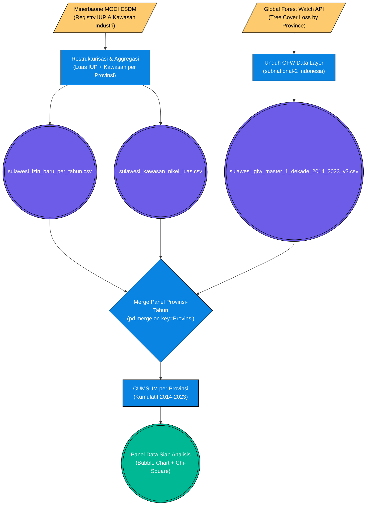

# Pilar 2: End-to-End Data Pipeline - Eksekusi Ruang: Ekspansi Kawasan Industri vs Deforestasi (Bab 2.3)

> **Topik:** Apakah Luasan Ekspansi IUP-Kawasan Industri Nikel Berbanding Lurus dengan Laju Deforestasi di Sulawesi?
> **Sumber Data:**
> 1. Data Izin Konsesi ESDM MODI (Minerbaone) — Luas Kawasan Nikel
> 2. Global Forest Watch (GFW) API — Kehilangan Tutupan Pohon 2014-2023
> **Jalur File Eksekutor:** `bab2 bismillah.py` — modul `build_data_2_3()` dan visualisasi `Animated Bubble Chart`.

Dokumen ini memetakan metodologi rekayasa data Bab 2.3, yang membuktikan secara spasio-temporal bahwa ekspansi ruang izin pertambangan dan kawasan industri berkorelasi dengan deforestasi. Analisis ini menggunakan dua teknik berbeda secara bersamaan: **Animated Bubble Chart** (Hans Rosling-style) untuk narasi visual dan **Uji Chi-Square tabulasi silang** untuk pembuktian inferensial.

---

## 1. Stage 1: Data Acquisition (ETL Pipeline 2.3)

Kedua sumber data bersifat publik dan dapat diakses melalui jalur yang berbeda:

### Flowchart Akuisisi Data (Konsesi Tambang vs Deforestasi GFW)



---

## 2. Stage 2: GFW Data — Pengunduhan & Ingestion

Dataset GFW diunduh dari portal resmi **Global Forest Watch** (`globalforestwatch.org`) dalam format CSV berlabel **"Tree Cover Loss by Subnational 2"**. Data ini berisi rincian per provinsi/kabupaten per tahun. Proses *ingestion* mencakup:

1. **Filter Negara:** `Country == "Indonesia"`.
2. **Filter Pulau:** Menyeleksi 6 provinsi Sulawesi menggunakan list konstanta `SULAWESI_PROVS`.
3. **Filter Dekade:** `Tahun >= 2014 AND Tahun <= 2023` sesuai jendela observasi riset.
4. **Rename & Type Cast:** Kolom `umd_tree_cover_loss__ha` diubah namanya menjadi `Total_Deforestasi_Ha` dan dicasting ke `float`.

---

## 3. Stage 3: ESDM — Restrukturisasi Konsesi

Data IUP dari Minerbaone memiliki dua dimensi spasial yang perlu digabungkan:

| Aset Data | Sumber Kolom | Logika Agregasi (Pandas) |
| :--- | :--- | :--- |
| **IUP Baru Tahunan** | `sulawesi_izin_baru_per_tahun.csv` | `df.groupby(["Provinsi", "Tahun"])["Jumlah_IUP_Baru"].sum()` |
| **Total Luas Kawasan Nikel** | `sulawesi_kawasan_nikel_luas.csv` | `df.groupby("Provinsi")["total_luas_ha"].sum()` — digunakan sebagai *snapshot* luas kumulatif statis per provinsi. |

Hasil dari dua agregasi ini kemudian di-*merge* ke dalam satu kerangka panel data berdimensi `(Provinsi × Tahun)`.

---

## 4. Stage 4: CUMSUM & Animated Bubble Chart

Inovasi utama Bab 2.3 adalah penggunaan **akumulasi kumulatif dinamis** (CUMSUM per provinsi, diurutkan per tahun) untuk membentuk:

- **Sumbu X (Animated):** `Kumulatif_Luas_Konsesi_Ha` — total luas perizinan yang terakumulasi dari tahun ke tahun.
- **Sumbu Y:** `Kumulatif_Deforestasi_Ha` — total kehilangan tutupan pohon yang terakumulasi.
- **Ukuran Bubble:** `Jumlah_IUP_Baru` — banyaknya perizinan tambang baru yang diterbitkan pada tahun tersebut.
- **Warna Bubble:** Dikodekan per Provinsi.
- **Slider Temporal:** Tahun (2014 → 2023) sebagai animasi *frame*.

```text
Formulasi CUMSUM (Python Pandas):
───────────────────────────────────────────────────────────────────────────
Kumulatif_Luas_Konsesi_Ha(p, T) = CUMSUM( Konsesi_Baru_p,t ) | t = 2014..T
Kumulatif_Deforestasi_Ha(p, T)  = CUMSUM( Deforestasi_p,t  ) | t = 2014..T
Kategori(x) = "Parah" jika x >= Median(Panel); "Rendah" jika x < Median(Panel)
Chi² = Σ [ (O_ij - E_ij)² / E_ij ]  ;  E_ij = (Row_i × Col_j) / N
OR   = (a × d) / (b × c)
───────────────────────────────────────────────────────────────────────────
```

---

## 5. Stage 5: Uji Chi-Square — Kategorisasi & Validasi

Tabel panel panel akhir diumpankan ke modul `calculate_spss_style_crosstab()` untuk pengujian inferensial. Berikut mapping variabel uji:

| Variabel | Tipe | Threshold Kategorisasi |
| :--- | :--- | :--- |
| **Luas Konsesi Kumulatif (X)** | Numerik → Kategori | `>= Median` → `"Ekspansi Tinggi"` / `< Median` → `"Ekspansi Rendah"` |
| **Deforestasi Kumulatif (Y)** | Numerik → Kategori | `>= Median` → `"Deforestasi Parah"` / `< Median` → `"Deforestasi Rendah"` |

Uji ini menghasilkan nilai **Chi-Square (χ²)**, **p-value**, dan **Odds Ratio** yang menjadi bukti statistik inferensial klaim laporan CELIOS mengenai dampak ekspansi kawasan industri terhadap tutupan hutan di Sulawesi.

---

## 6. Output (*Data Provenance*)

| Nama File (*Processed*) | Metode Ingesti Primer | Digunakan Pada Bab | Deskripsi Bukti Empiris |
| :--- | :--- | :--- | :--- |
| `sulawesi_izin_baru_per_tahun.csv` | Excel ESDM / Restrukturisasi | 1.3, 2.3 | Alur temporal penerbitan IUP baru per provinsi. |
| `sulawesi_kawasan_nikel_luas.csv` | Excel ESDM / Aggregasi | 1.3, 2.3 | Peta spasial total luas konsesi dan kawasan industri. |
| `sulawesi_gfw_master_1_dekade_2014_2023_v3.csv` | GFW API (CSV Download) | 1.4, 2.3 | Panel kehilangan tutupan pohon dekade 2014-2023 oleh satelit Hansen/UMD. |
