# Pilar 2: End-to-End Data Pipeline — Driver Deforestasi: Analisis Faktor Pendorong Perubahan Tutupan Hutan (Bab 2.4)

> **Topik:** Atribusi kuantitatif faktor pendorong (*driver*) deforestasi di Sulawesi (2014–2023) dan kalkulasi jejak karbon (Emisi CO2) per kategori driver.
> **Sumber Data:**
> 1. Global Forest Watch (GFW) Data API v2 — Driver-of-Deforestation Classification (`sulawesi_gfw_loss_by_driver_2014_2023_v3.csv`)
>
> **Jalur File Eksekutor:**
> - `tools/gfw/fetch_drivers_via_land_api_v3.py` — Fetcher utama GFW Driver Classification API
> - `tools/report_metodologi/bab_2/bab2 bismillah.py` — Generator laporan (Baris 735–780: blok `[2.8/4]`)

Sub-bab 2.4 memiliki karakteristik berbeda dari sub-bab sebelumnya: **tidak menggunakan pengujian statistik inferensial (Chi-Square)**. Analisis ini murni bersifat **deskriptif-kuantitatif** — membedah komposisi penyebab deforestasi dan mengkonversi luas kehilangan tutupan pohon ke dalam satuan emisi karbon (Megagram CO2) menggunakan faktor emisi biomassa hutan tropis standar IPCC.

---

## 1. Stage 1: Data Acquisition (GFW Driver Classification API)

### 1.1 Konsep Dataset GFW Driver Classification

GFW memetakan setiap piksel kehilangan tutupan pohon ke dalam salah satu dari **5 kategori faktor pendorong (*driver*)** berdasarkan analisis citra satelit multitemporal. Metodologi klasifikasi ini dikembangkan oleh Curtis et al. (2018) dan diintegrasikan langsung ke dalam *Data API v2* GFW:

| Driver Label (GFW Asli) | Label Celios (Remapping) | Definisi |
| :--- | :--- | :--- |
| `Commodity driven deforestation` | Pertambangan dan Sawit | Pembukaan lahan untuk tambang nikel, sawit, dan komoditas ekspor lainnya |
| `Forestry` | Kehutanan Komersial | Aktivitas penebangan kayu berlisensi (HPH/HTI) |
| `Shifting agriculture` | Pertanian Berpindah (Masyarakat) | Ladang berpindah subsisten masyarakat adat/lokal |
| `Urbanization` | Urbanisasi & Infrastruktur | Pembangunan kota, jalan, dan infrastruktur |
| `Unknown` | Tidak Teridentifikasi | Piksel yang tidak dapat diklasifikasikan |

### Flowchart Akuisisi Data (ETL Pipeline 2.4)

```mermaid
graph LR
    SRC[/"GFW Data API v2\nhttps://data-api.globalforestwatch.org\nDataset: umd_tree_cover_loss_by_driver"/]

    SRC --> Ext1["REST GET\n/dataset/umd_tree_cover_loss_by_driver\n/latest/download_by_aoi/json\n(SQL + AOI per Provinsi)"]

    Ext1 --> Raw((("Raw JSON\n6 Provinsi × 5 Driver × 10 Tahun")))
    Raw --> Loop["Loop 6 Provinsi\nSulawesi (GADM codes)"]
    Loop --> Concat["pd.concat() → DataFrame Gabungan"]
    Concat --> CSV((("sulawesi_gfw_loss_by_driver\n_2014_2023_v3.csv")))

    CSV --> Map["driver_mapping_24\n{label GFW → label Celios}"]
    Map --> Filter["Filter 6 Provinsi Sulawesi\n.isin(focus_provinces_24)"]
    Filter --> GroupBy["groupby(Faktor_Pendorong)\n.agg(SUM Luas_Ha, SUM Emisi_CO2)"]
    GroupBy --> Pct["Kalkulasi Proporsi (%)\n& Rasio Perbandingan"]

    Pct --> Final((("Tabel 2.8: Atribusi\nDeforestasi & Emisi CO2")))

    classDef aksi fill:#0984e3,color:#fff,stroke:#000
    classDef sumber fill:#fdcb6e,color:#000,stroke:#000
    classDef final fill:#00b894,color:#fff,stroke:#000
    classDef db fill:#6c5ce7,color:#fff,stroke:#000

    class Ext1,Loop,Concat,Map,Filter,GroupBy,Pct aksi
    class SRC sumber
    class Final final
    class Raw,CSV db
```



---

### 1.2 Anatomi & Cara Menyusun URL (REST Path GFW Data API v2)

**URL Endpoint Driver Classification:**
```text
GET https://data-api.globalforestwatch.org/dataset/umd_tree_cover_loss_by_driver/latest/download_by_aoi/json
```

- `umd_tree_cover_loss_by_driver` : Dataset GFW Curtis et al. (2018) — klasifikasi driver per piksel.
- `latest` : Versi dataset terbaru yang tersedia.
- `download_by_aoi` : Menarik data berdasarkan Area of Interest administratif.
- Header wajib: `x-api-key: 21899f40-1f6d-4ff9-93e1-c10d04513984`

**Query SQL yang Dikirim (Parameter `sql`):**
```sql
SELECT
    umd_tree_cover_loss__year AS year,
    umd_tree_cover_loss_by_driver__type AS driver,
    SUM(area__ha) AS deforestation_ha,
    SUM(gfw_aboveground_carbon_stocks_2000__Mg_CO2e_px) AS co2_megagram
FROM data
WHERE umd_tree_cover_loss__year >= 2014
  AND umd_tree_cover_loss__year <= 2023
GROUP BY year, driver
ORDER BY year, driver
```

**Parameter AOI (JSON per Provinsi):**
```json
{
  "type": "admin",
  "country": "IDN",
  "region": "29"
}
```
*(Contoh untuk Sulawesi Tengah, `admin_code = "29"`)*

---

### 1.3 Respons Server GFW Asli — Driver Classification

**Respons JSON GFW Driver — Sulawesi Tengah (admin_code: 29):**
```json
{
  "data": [
    { "year": 2014, "driver": "Commodity driven deforestation", "deforestation_ha": 12847.3, "co2_megagram": 2104892.0 },
    { "year": 2014, "driver": "Shifting agriculture",            "deforestation_ha": 3201.8,  "co2_megagram": 524295.6  },
    { "year": 2014, "driver": "Forestry",                        "deforestation_ha": 2104.5,  "co2_megagram": 344737.0  },
    { "year": 2014, "driver": "Urbanization",                    "deforestation_ha": 187.2,   "co2_megagram": 30660.4   },
    { "year": 2014, "driver": "Unknown",                         "deforestation_ha": 91.7,    "co2_megagram": 15010.0   },
    { "year": 2015, "driver": "Commodity driven deforestation", "deforestation_ha": 16340.2, "co2_megagram": 2675672.8 }
  ],
  "status": "success"
}
```

**Tabel Postman — GFW Driver Classification per Provinsi Sulawesi:**

| Provinsi | Admin Code (GADM 3.6) | URL Endpoint Postman |
| :--- | :---: | :--- |
| **Sulawesi Utara** | `31` | `https://data-api.globalforestwatch.org/dataset/umd_tree_cover_loss_by_driver/latest/download_by_aoi/json?aoi={"type":"admin","country":"IDN","region":"31"}&sql=SELECT+umd_tree_cover_loss__year+as+year,umd_tree_cover_loss_by_driver__type+as+driver,SUM(area__ha)+as+ha,SUM(gfw_aboveground_carbon_stocks_2000__Mg_CO2e_px)+as+co2+FROM+data+WHERE+umd_tree_cover_loss__year+BETWEEN+2014+AND+2023+GROUP+BY+year,driver` |
| **Sulawesi Tengah** | `29` | `https://data-api.globalforestwatch.org/dataset/umd_tree_cover_loss_by_driver/latest/download_by_aoi/json?aoi={"type":"admin","country":"IDN","region":"29"}&sql=SELECT+umd_tree_cover_loss__year+as+year,umd_tree_cover_loss_by_driver__type+as+driver,SUM(area__ha)+as+ha,SUM(gfw_aboveground_carbon_stocks_2000__Mg_CO2e_px)+as+co2+FROM+data+WHERE+umd_tree_cover_loss__year+BETWEEN+2014+AND+2023+GROUP+BY+year,driver` |
| **Sulawesi Selatan** | `30` | `https://data-api.globalforestwatch.org/dataset/umd_tree_cover_loss_by_driver/latest/download_by_aoi/json?aoi={"type":"admin","country":"IDN","region":"30"}&sql=SELECT+umd_tree_cover_loss__year+as+year,umd_tree_cover_loss_by_driver__type+as+driver,SUM(area__ha)+as+ha,SUM(gfw_aboveground_carbon_stocks_2000__Mg_CO2e_px)+as+co2+FROM+data+WHERE+umd_tree_cover_loss__year+BETWEEN+2014+AND+2023+GROUP+BY+year,driver` |
| **Sulawesi Tenggara** | `32` | `https://data-api.globalforestwatch.org/dataset/umd_tree_cover_loss_by_driver/latest/download_by_aoi/json?aoi={"type":"admin","country":"IDN","region":"32"}&sql=SELECT+umd_tree_cover_loss__year+as+year,umd_tree_cover_loss_by_driver__type+as+driver,SUM(area__ha)+as+ha,SUM(gfw_aboveground_carbon_stocks_2000__Mg_CO2e_px)+as+co2+FROM+data+WHERE+umd_tree_cover_loss__year+BETWEEN+2014+AND+2023+GROUP+BY+year,driver` |
| **Gorontalo** | `11` | `https://data-api.globalforestwatch.org/dataset/umd_tree_cover_loss_by_driver/latest/download_by_aoi/json?aoi={"type":"admin","country":"IDN","region":"11"}&sql=SELECT+umd_tree_cover_loss__year+as+year,umd_tree_cover_loss_by_driver__type+as+driver,SUM(area__ha)+as+ha,SUM(gfw_aboveground_carbon_stocks_2000__Mg_CO2e_px)+as+co2+FROM+data+WHERE+umd_tree_cover_loss__year+BETWEEN+2014+AND+2023+GROUP+BY+year,driver` |
| **Sulawesi Barat** | `33` | `https://data-api.globalforestwatch.org/dataset/umd_tree_cover_loss_by_driver/latest/download_by_aoi/json?aoi={"type":"admin","country":"IDN","region":"33"}&sql=SELECT+umd_tree_cover_loss__year+as+year,umd_tree_cover_loss_by_driver__type+as+driver,SUM(area__ha)+as+ha,SUM(gfw_aboveground_carbon_stocks_2000__Mg_CO2e_px)+as+co2+FROM+data+WHERE+umd_tree_cover_loss__year+BETWEEN+2014+AND+2023+GROUP+BY+year,driver` |

> **Catatan Postman:** Tambahkan header `x-api-key: 21899f40-1f6d-4ff9-93e1-c10d04513984`. Metode `GET`. Total baris ideal respons: 6 provinsi × 5 driver × 10 tahun = **300 baris**.

---

## 2. Stage 2: ETL / Ingestion

Script `fetch_drivers_via_land_api_v3.py` melakukan loop terhadap 6 provinsi Sulawesi, memanggil endpoint driver classification untuk masing-masing admin code, lalu meng-concat hasilnya menjadi satu DataFrame besar yang didaratkan ke `data/processed/sulawesi_gfw_loss_by_driver_2014_2023_v3.csv`.

```python
# tools/gfw/fetch_drivers_via_land_api_v3.py (ringkasan logika)
API_KEY = "21899f40-1f6d-4ff9-93e1-c10d04513984"
BASE = "https://data-api.globalforestwatch.org"

PROVINCES = {
    "Sulawesi Tengah":   "29",
    "Sulawesi Tenggara": "32",
    "Sulawesi Selatan":  "30",
    "Sulawesi Utara":    "31",
    "Gorontalo":         "11",
    "Sulawesi Barat":    "33",
}

all_dfs = []
for prov_name, admin_code in PROVINCES.items():
    aoi = json.dumps({"type": "admin", "country": "IDN", "region": admin_code})
    endpoint = f"{BASE}/dataset/umd_tree_cover_loss_by_driver/latest/download_by_aoi/json"
    resp = requests.get(endpoint, params={"sql": SQL_QUERY, "aoi": aoi},
                        headers={"x-api-key": API_KEY}, timeout=120)
    df = pd.DataFrame(resp.json()["data"])
    df["Provinsi"] = prov_name
    all_dfs.append(df)

df_all = pd.concat(all_dfs, ignore_index=True)
df_all.to_csv("data/processed/sulawesi_gfw_loss_by_driver_2014_2023_v3.csv", index=False)
```

---

## 3. Stage 3: Preprocessing & Cleaning

| Tahap Pembersihan | Kolom Target | Deskripsi Tindakan (Logika Pandas) | Contoh Transformasi |
| :--- | :--- | :--- | :--- |
| **Driver Label Remapping** | `Faktor_Pendorong` | `df["Faktor_Pendorong"].replace(driver_mapping_24)` — Menerjemahkan label teknis GFW ke label Bahasa Indonesia yang sinkron dengan *dashboard* Streamlit. | `"Commodity driven deforestation"` ➔ `"Pertambangan dan Sawit"` |
| **Filter Provinsi Sulawesi** | `Provinsi` | `.isin(focus_provinces_24)` — Memastikan hanya 6 provinsi Sulawesi yang masuk analisis, mengabaikan data lain yang mungkin terinklusi karena batas GADM tumpang tindih. | `"Papua Barat"` ➔ (dihapus) |
| **Agregasi GroupBy Driver** | `Luas_Deforestasi_Ha`, `Emisi_CO2_Megagram` | `groupby("Faktor_Pendorong").agg({"Luas_Deforestasi_Ha": "sum", "Emisi_CO2_Megagram": "sum"})` — Merangkum seluruh 10 tahun × 6 provinsi menjadi 1 baris per driver. | `[Sulteng 2014, Sulteng 2015, ...]` ➔ `[Pertambangan: 248.320 Ha]` |
| **Kalkulasi Proporsi (%)** | `Proporsi_Persen` | `(Total_Driver_k / Total_Kumulatif) × 100` — Menghitung kontribusi relatif setiap driver terhadap total deforestasi Sulawesi. | `248.320 / 1.041.200 × 100` ➔ `23.9%` |
| **Kalkulasi Rasio Perbandingan** | `Rasio_Industri_vs_Petani` | `industri_total_24 / petani_total_24` — Bukti kuantitatif seberapa besar industri komoditas dibanding pertanian berpindah masyarakat. | `248.320 / 61.080` ➔ `4.1×` |
| **Konversi Emisi ke Juta Ton** | `Emisi_CO2_Megagram` | `/ 1_000_000` — Megagram = Metrik Ton. Konversi ke Juta Ton untuk keterbacaan narasi. | `2.104.892 Mg` ➔ `2,1 Juta Ton CO2` |

---

## 4. Validasi Integritas & Timeframe

**Validasi Coverage Driver × Provinsi × Tahun (Expected: 6 × 5 × 10 = 300 baris):**

```python
# Blok [2.8/4] — bab2 bismillah.py Baris 735-754
df_driver_24 = pd.read_csv("data/processed/sulawesi_gfw_loss_by_driver_2014_2023_v3.csv")

focus_provinces_24 = ["Sulawesi Tengah", "Sulawesi Tenggara", "Sulawesi Utara",
                       "Sulawesi Selatan", "Gorontalo", "Sulawesi Barat"]

df_driver_focus_24 = df_driver_24[df_driver_24["Provinsi"].isin(focus_provinces_24)]

# Validasi
tahun_min_24 = int(df_driver_focus_24["Tahun"].min())   # Expected: 2014
tahun_max_24 = int(df_driver_focus_24["Tahun"].max())   # Expected: 2023
jml_prov_24  = df_driver_focus_24["Provinsi"].nunique() # Expected: 6
jml_driver_24 = df_driver_focus_24["Faktor_Pendorong"].nunique() # Expected: 5
```

**Tabel Validasi Coverage Dataset:**

| Dimensi | Nilai Expected | Keterangan |
| :--- | :---: | :--- |
| Jumlah Provinsi | 6 | 6 Provinsi Sulawesi |
| Jumlah Driver | 5 | Komoditas, Kehutanan, Pertanian, Urbanisasi, Tidak Diketahui |
| Rentang Tahun | 2014–2023 | 10 tahun penuh (1 dekade) |
| Total Baris Ideal | 300 | 6 × 5 × 10 (beberapa kombinasi mungkin 0 → tidak muncul) |
| Cakupan Kolom CO2 | `Emisi_CO2_Megagram` | Wajib ada; jika null → data GFW belum tersedia di wilayah itu |

> **Catatan Validasi CO2:** Nilai `Emisi_CO2_Megagram` menggunakan *above-ground carbon stocks* tahun 2000 sebagai baseline. Artinya: emisi dihitung dari kandungan karbon biomassa yang ada sebelum era industrialisasi masif nikel Sulawesi, sehingga nilai ini mencerminkan *potensi kerugian karbon permanen* yang paling konservatif.

---

## 5. Output (*Data Provenance*)

Berdasarkan `data/DATA_DICTIONARY.md`, *output* CSV matang yang dihasilkan pipeline ini disalurkan ke `data/processed/`:

| Nama File (*Processed*) | Metode Ingesti Primer | Digunakan Pada Bab | Deskripsi Bukti Empiris |
| :--- | :--- | :--- | :--- |
| `sulawesi_gfw_loss_by_driver_2014_2023_v3.csv` | GFW API `umd_tree_cover_loss_by_driver` | 2.3, **2.4** | Atribusi luas deforestasi (Ha) dan emisi karbon (Mg CO2) per faktor pendorong × provinsi × tahun. Basis bukti ilmiah untuk narasi "Industri Ekstraktif mendominasi X% deforestasi Sulawesi". |
