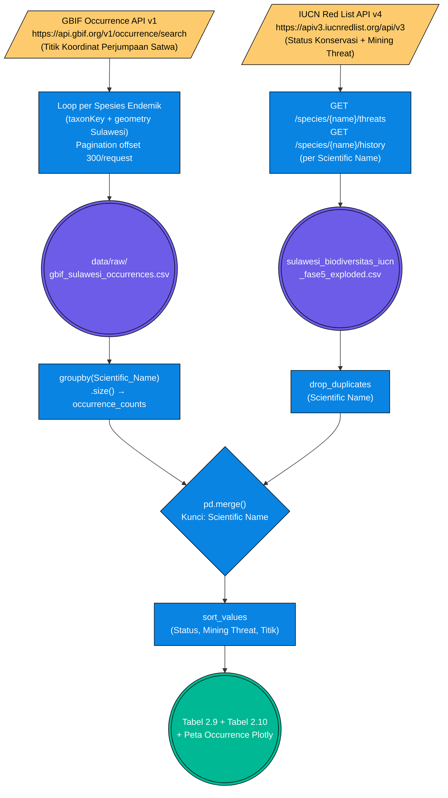

# Pilar 2: End-to-End Data Pipeline — Kehancuran Biodiversitas: Dampak Terhadap Habitat Satwa Endemik (Bab 2.5)

> **Topik:** Pemetaan Spasial Keberadaan (Occurrence) Satwa Endemik Wallacea di Sulawesi dan Validasi Status Ancaman Pertambangan melalui IUCN Red List.
> **Sumber Data:**
> 1. GBIF (Global Biodiversity Information Facility) API — *Occurrence API v1* (`data/raw/gbif_sulawesi_occurrences.csv`)
> 2. IUCN Red List API v4 — Species Status, Threats & Conservation (`data/processed/sulawesi_biodiversitas_iucn_fase5_exploded.csv`)
>
> **Jalur File Eksekutor:**
> - `tools/gbif/fetch_gbif_occurrences.py` — Fetcher GBIF Occurrence API per spesies endemik Sulawesi
> - `tools/iucn/fetch_iucn_species.py` — Fetcher IUCN Red List API (status + ancaman tambang per spesies)
> - `tools/report_metodologi/bab_2/bab2 bismillah.py` — Generator laporan (Baris 814–870: blok `[2.85/4]`)

Sub-bab 2.5 memiliki karakteristik unik: **menggunakan dua API publik berbeda** (GBIF dan IUCN) yang masing-masing melayani dimensi data terpisah — GBIF untuk **bukti spasial keberadaan** satwa (*where are they*), dan IUCN untuk **penilaian tingkat ancaman** (*how endangered are they*). Tidak ada uji inferensial Chi-Square pada sub-bab ini; analisis bersifat **spasial-deskriptif** dengan sintesis status konservasi.

---

## 1. Stage 1: Data Acquisition (GBIF API + IUCN Red List API)

### Flowchart Akuisisi Data (ETL Pipeline 2.5)



---

### 1.1 Anatomi & Cara Menyusun URL — GBIF Occurrence API v1

GBIF (*Global Biodiversity Information Facility*) menyediakan REST API publik tanpa autentikasi untuk operasi baca. Data occurrence merupakan rekaman perjumpaan satwa berdasarkan laporan ilmuwan warga (*citizen science*), koleksi museum, dan observasi lapangan.

**Endpoint Utama:**
```text
GET https://api.gbif.org/v1/occurrence/search
```

**Parameter Query GBIF yang Digunakan:**
| Parameter | Nilai | Deskripsi |
| :--- | :--- | :--- |
| `taxonKey` | *(ID spesies GBIF)* | ID taksonomi unik per spesies (didapat dari `/species/match?name=...`) |
| `country` | `ID` | Kode negara ISO-2 untuk Indonesia |
| `geometry` | *(WKT Polygon Sulawesi)* | Bounding box atau polygon Sulawesi dalam format WKT |
| `hasCoordinate` | `true` | Hanya ambil record yang memiliki koordinat GPS valid |
| `hasGeospatialIssue` | `false` | Singkirkan record dengan masalah geospasial (koordinat laut, dll.) |
| `limit` | `300` | Batas record per halaman (maksimum GBIF: 300) |
| `offset` | `0, 300, 600, ...` | Pagination — diiterasi sampai `endOfRecords: true` |

**Contoh URL Lengkap (Anoa — *Bubalus depressicornis*):**
```text
https://api.gbif.org/v1/occurrence/search?taxonKey=2441188&country=ID&geometry=POLYGON((119.0+-6.0,128.0+-6.0,128.0+2.5,119.0+2.5,119.0+-6.0))&hasCoordinate=true&hasGeospatialIssue=false&limit=300&offset=0
```

**Langkah 0 — Resolusi Nama ke taxonKey:**
```text
GET https://api.gbif.org/v1/species/match?name=Bubalus+depressicornis&kingdom=Animalia
```

**Respons JSON Resolusi Spesies (GBIF `/species/match`):**
```json
{
  "usageKey": 2441188,
  "scientificName": "Bubalus depressicornis (H.Smith, 1827)",
  "canonicalName": "Bubalus depressicornis",
  "rank": "SPECIES",
  "status": "ACCEPTED",
  "confidence": 99,
  "matchType": "EXACT",
  "kingdom": "Animalia",
  "phylum": "Chordata",
  "class": "Mammalia",
  "order": "Artiodactyla",
  "family": "Bovidae"
}
```

**Respons JSON Occurrence Search (GBIF):**
```json
{
  "offset": 0,
  "limit": 300,
  "endOfRecords": false,
  "count": 847,
  "results": [
    {
      "key": 4012345678,
      "taxonKey": 2441188,
      "scientificName": "Bubalus depressicornis",
      "decimalLatitude": -1.5423,
      "decimalLongitude": 121.6782,
      "year": 2019,
      "month": 8,
      "stateProvince": "Sulawesi Tengah",
      "basisOfRecord": "HUMAN_OBSERVATION",
      "datasetKey": "8a863029-f435-446a-821e-7f46394b4e82"
    }
  ]
}
```

**Tabel Postman — GBIF Occurrence Search per Spesies Endemik Kunci Sulawesi:**

| Spesies Endemik | Nama Umum | taxonKey | URL Endpoint Postman |
| :--- | :--- | :---: | :--- |
| *Bubalus depressicornis* | Anoa Dataran Rendah | `2441188` | `https://api.gbif.org/v1/occurrence/search?taxonKey=2441188&country=ID&hasCoordinate=true&hasGeospatialIssue=false&limit=300` |
| *Macaca nigra* | Monyet Hitam Sulawesi | `2436411` | `https://api.gbif.org/v1/occurrence/search?taxonKey=2436411&country=ID&hasCoordinate=true&hasGeospatialIssue=false&limit=300` |
| *Babyrousa babyrussa* | Babi Rusa | `2440892` | `https://api.gbif.org/v1/occurrence/search?taxonKey=2440892&country=ID&hasCoordinate=true&hasGeospatialIssue=false&limit=300` |
| *Aceros cassidix* | Rangkong Sulawesi | `2482615` | `https://api.gbif.org/v1/occurrence/search?taxonKey=2482615&country=ID&hasCoordinate=true&hasGeospatialIssue=false&limit=300` |
| *Macrocephalon maleo* | Maleo | `2474105` | `https://api.gbif.org/v1/occurrence/search?taxonKey=2474105&country=ID&hasCoordinate=true&hasGeospatialIssue=false&limit=300` |

> **Catatan Postman:** GBIF API *tidak* memerlukan API key untuk request baca (GET). Header cukup `Accept: application/json`.

---

### 1.2 Anatomi & Cara Menyusun URL — IUCN Red List API v4

IUCN Red List API memerlukan **token autentikasi** yang diperoleh gratis melalui registrasi di `https://apiv3.iucnredlist.org/api/v3/token`. Token disertakan sebagai parameter `token` di setiap URL.

**Base URL:**
```text
https://apiv3.iucnredlist.org/api/v3
```

**Endpoint yang Digunakan:**

**A. Status Konservasi & Tren Populasi:**
```text
GET https://apiv3.iucnredlist.org/api/v3/species/{scientific_name}?token={IUCN_TOKEN}
```

**B. Riwayat Perubahan Status (History):**
```text
GET https://apiv3.iucnredlist.org/api/v3/species/history/{scientific_name}?token={IUCN_TOKEN}
```

**C. Daftar Ancaman (*Threats*) per Spesies:**
```text
GET https://apiv3.iucnredlist.org/api/v3/threats/species/name/{scientific_name}?token={IUCN_TOKEN}
```
- Endpoint inilah yang menghasilkan kolom **`Mining Threat`** — sistem memeriksa apakah ada entri dengan `code` mengandung prefix `3.2` (Mining & Quarrying) dalam daftar ancaman.

**Respons JSON IUCN `/species/` (Status Utama):**
```json
{
  "name": "Bubalus depressicornis",
  "result": [
    {
      "taxonid": 3118,
      "scientific_name": "Bubalus depressicornis",
      "kingdom": "ANIMALIA",
      "category": "EN",
      "population_trend": "Decreasing",
      "published_year": 2022,
      "assessment_date": "2022-04-05"
    }
  ]
}
```

**Respons JSON IUCN `/threats/species/name/` (Ancaman Pertambangan):**
```json
{
  "name": "Bubalus depressicornis",
  "result": [
    { "code": "2.1", "title": "Annual & perennial non-timber crops", "timing": "Ongoing", "scope": "Majority" },
    { "code": "3.2", "title": "Mining & Quarrying", "timing": "Ongoing", "scope": "Minority" },
    { "code": "5.1", "title": "Hunting & trapping terrestrial animals", "timing": "Ongoing", "scope": "Majority" }
  ]
}
```
*Catatan: Kolom `Mining Threat = "Yes"` diisi jika ditemukan entri dengan `code` yang dimulai `"3.2"` (Mining & Quarrying) dalam array `result` respons ini.*

**Tabel Postman — IUCN Threats per Spesies Endemik Sulawesi:**

| Spesies | Kode IUCN | URL Threats Endpoint |
| :--- | :--- | :--- |
| *Bubalus depressicornis* | `3118` | `https://apiv3.iucnredlist.org/api/v3/threats/species/name/Bubalus%20depressicornis?token={IUCN_TOKEN}` |
| *Macaca nigra* | `12556` | `https://apiv3.iucnredlist.org/api/v3/threats/species/name/Macaca%20nigra?token={IUCN_TOKEN}` |
| *Babyrousa babyrussa* | `2461` | `https://apiv3.iucnredlist.org/api/v3/threats/species/name/Babyrousa%20babyrussa?token={IUCN_TOKEN}` |
| *Aceros cassidix* | `22682523` | `https://apiv3.iucnredlist.org/api/v3/threats/species/name/Aceros%20cassidix?token={IUCN_TOKEN}` |
| *Macrocephalon maleo* | `22678596` | `https://apiv3.iucnredlist.org/api/v3/threats/species/name/Macrocephalon%20maleo?token={IUCN_TOKEN}` |

> **Registrasi Token IUCN:**
> ```text
> https://apiv3.iucnredlist.org/api/v3/token
> ```
> Token diperoleh gratis setelah mengisi formulir penggunaan riset/akademik.

---

## 2. Stage 2: ETL / Ingestion

**GBIF Pipeline:** Script loop per spesies endemik → mengirim request dengan `taxonKey` dan geometry Sulawesi → mengumpulkan seluruh halaman (pagination `offset += 300` sampai `endOfRecords: true`) → `pd.concat()` seluruh halaman → simpan ke `data/raw/gbif_sulawesi_occurrences.csv`.

**IUCN Pipeline:** Script loop per nama spesies → 3 request per spesies (status, history, threats) → ekstrak `category`, `population_trend`, dan deteksi `Mining Threat` dari kode `3.2` → simpan ke `data/raw/iucn_raw_{spesies}.json` → konsolidasi ke `data/processed/sulawesi_biodiversitas_iucn_fase5_exploded.csv`.

---

## 3. Stage 3: Preprocessing & Cleaning

| Tahap Pembersihan | Kolom Target | Deskripsi Tindakan (Logika Pandas) | Contoh Transformasi |
| :--- | :--- | :--- | :--- |
| **Deduplication IUCN** | `Scientific Name` | `.drop_duplicates(subset=["Scientific Name"])` — Dataset IUCN yang di-*explode* per ancaman menghasilkan duplikasi baris per spesies; deduplikasi wajib sebelum agregasi status. | `[Anoa (row 1), Anoa (row 2)]` ➔ `[Anoa (row 1)]` |
| **Deteksi Mining Threat** | `Mining Threat` | Filter ancaman bertipe `code.startswith("3.2")` dari array threats IUCN → buat kolom biner `"Yes"/"No"`. | `code="3.2"` dalam threats ➔ `Mining Threat = "Yes"` |
| **GroupBy Occurrence Count** | `Jumlah_Titik_GBIF` | `df_gbif.groupby("Scientific_Name").size()` — Menghitung jumlah titik occurrence GBIF per spesies sebagai ukuran kepadatan sebaran. | `[847 baris Anoa di GBIF]` ➔ `Anoa: 847 titik` |
| **Merge GBIF + IUCN** | `Scientific Name` | `pd.merge(df_iucn_unique, occurrence_counts, left_on="Scientific Name", right_on="Scientific_Name", how="left").fillna({"Jumlah_Titik_GBIF": 0})` — Spesies tanpa occurrence GBIF mendapat 0. | `NaN` ➔ `0 titik` |
| **Sorting Prioritas** | `Status`, `Mining Threat`, `Titik GBIF` | `.sort_values(["Status", "Mining Threat", "Jumlah_Titik_GBIF"], ascending=[True, False, False])` — CR tampil lebih dulu, spesies dengan Mining Threat = Yes lebih dulu, lalu urutkan dari yang paling banyak terdokumentasi. | `[EN, No, 200] → [CR, Yes, 847] → [CR, Yes, 200]` |
| **Label Status IUCN** | `Status` | Ekspansi kode kategori IUCN ke label panjang: `"CR"` → `"Critically Endangered"`, `"EN"` → `"Endangered"`, `"VU"` → `"Vulnerable"`. | `"CR"` ➔ `"Critically Endangered"` |

---

## 4. Validasi Integritas & Timeframe

**Validasi Coverage Dataset (blok `[2.85/4]` — bab2 bismillah.py Baris 814–870):**

```python
# Metrik validasi yang dihitung di script
tot_titik_25    = len(df_gbif_25)                   # Total titik occurrence GBIF
tot_spesies_25  = len(df_iucn_unique_25)            # Jumlah spesies endemik unik di IUCN
tot_cr_25       = (df_iucn["Status"] == "Critically Endangered").sum()
tot_en_25       = (df_iucn["Status"] == "Endangered").sum()
tot_vu_25       = (df_iucn["Status"] == "Vulnerable").sum()
tot_mining_yes_25 = df_iucn["Mining Threat"].str.lower().eq("yes").sum()
tahun_min_25    = int(pd.to_numeric(df_gbif_25["Year"], errors="coerce").min())  # Occurrence tertua
tahun_max_25    = int(pd.to_numeric(df_gbif_25["Year"], errors="coerce").max())  # Occurrence terbaru
prov_count_25   = df_gbif_25["Province"].nunique()  # Jumlah provinsi dengan rekaman
```

**Tabel Validasi Distribusi Occurrence GBIF per Provinsi Sulawesi:**

| Provinsi | Ekspektasi Titik Occurrence | Keterangan |
| :--- | :--- | :--- |
| Sulawesi Tengah | Tertinggi | Habitat utama Anoa dan Babi Rusa (kawasan Lore Lindu) |
| Sulawesi Utara | Tinggi | Habitat Macaca nigra (Tangkoko, Cagar Alam Gunung Ambang) |
| Sulawesi Tenggara | Sedang | Overlap kawasan smelter dengan habitat satwa |
| Sulawesi Selatan | Sedang | Habitat Maleo (Pegunungan Latimojong) |
| Sulawesi Barat | Rendah | Data observasi terbatas |
| Gorontalo | Rendah | Fragmentasi tinggi, data observasi terbatas |

> **Catatan Validasi:** GBIF adalah database *citizen science* sehingga bias observasi (*observer bias*) nyata — provinsi dengan lebih banyak peneliti/aktivis cenderung memiliki lebih banyak titik occurrence. Ini bukan berarti biodiversitas di sana lebih tinggi, melainkan lebih terdokumentasi. Interpretasi spasial di laporan Celios2 mempertimbangkan bias ini.

---

## 5. Output (*Data Provenance*)

Berdasarkan `data/DATA_DICTIONARY.md`, *output* CSV matang yang dihasilkan pipeline ini disalurkan ke `data/processed/` dan `data/raw/`:

| Nama File | Lokasi | Metode Ingesti Primer | Digunakan Pada Bab | Deskripsi Bukti Empiris |
| :--- | :--- | :--- | :--- | :--- |
| `gbif_sulawesi_occurrences.csv` | `data/raw/` | GBIF Occurrence API v1 | **2.5** | Titik koordinat GPS seluruh perjumpaan satwa endemik kunci di Sulawesi. |
| `sulawesi_biodiversitas_iucn_fase5_exploded.csv` | `data/processed/` | IUCN Red List API v4 | **2.5** | Status konservasi, tren populasi, dan penanda Mining Threat per spesies endemik. |
