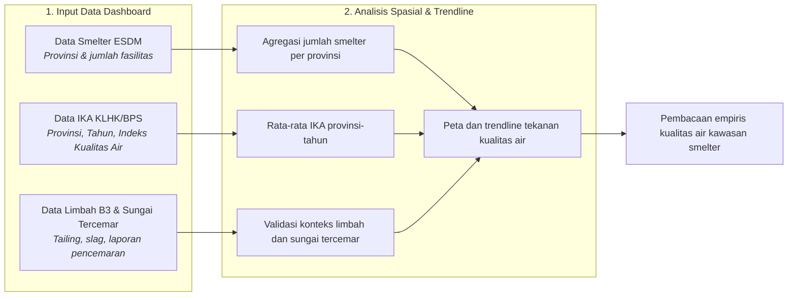
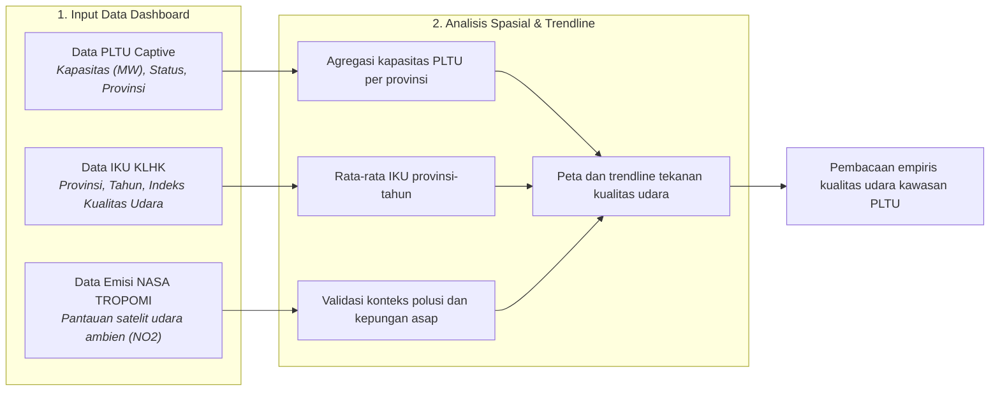
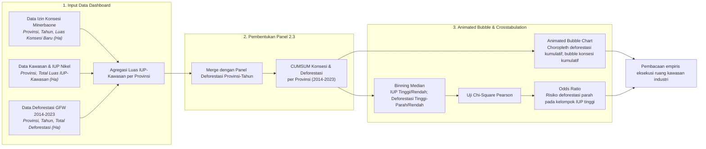

# BAB II: METODOLOGI ANALISIS KUALITAS LINGKUNGAN DI KAWASAN SMELTER

Dokumen laporan metodologi ini menyajikan kerangka ilmiah, formulasi matematis, prosedur pengolahan data, dan pengujian statistik yang dioperasionalkan pada **Bab 2: Kualitas Lingkungan di Kawasan Smelter**.

## 2.1. Dampak Limbah Tailing: Konsentrasi Smelter vs Indeks Kualitas Air (IKA)

> **Sumber Data Resmi & Deskripsi Visualisasi:** Data Smelter: `data/processed/sulawesi_esdm_nikel.csv`; Data IKA: `data/processed/sulawesi_ika_2016_2024.csv`; Data Limbah B3: `data/processed/sulawesi_limbah_b3_ngo_proxy.csv`; Data Pencemaran Sungai: `data/processed/sulawesi_sungai_tercemar.csv`.

#### A. Pengantar & Kerangka Narasi
Pengoperasian **778 fasilitas mega-smelter** yang didukung oleh kapasitas **9,825 MW PLTU Captive** meningkatkan intensitas emisi dan beban lingkungan di Pulau Sulawesi. Data menunjukkan konversi tutupan hutan mencapai **1,001,654 Hektar**, estimasi timbulan limbah B3/tailing sebesar **20.9 Juta Ton** per tahun, dan rata-rata IKA tahun 2024 sebesar **59.7**.

#### B. Alur Logika Metodologis Analisis Konsentrasi Smelter vs IKA


Sebagai opsi ringkas pengganti bagan alur crosstab yang terlalu panjang, konfigurasi variabel pengujian Chi-Square disajikan pada **Tabel 2.1a** berikut:

##### Tabel 2.1a: Konfigurasi Variabel Uji Chi-Square (Sub-bab 2.1)
| Komponen Uji | Definisi Variabel (Sub-bab 2.1) |
| :--- | :--- |
| Variabel Independen (X) | Jumlah_Smelter: Total fasilitas smelter (beroperasi maupun konstruksi). |
| Variabel Dependen (Y) | Indeks Kualitas Air: Skor baku mutu air per provinsi. |
| Hipotesis Nol (H0) | Tidak ada hubungan signifikan secara statistik antara kepadatan smelter dengan Indeks Kualitas Air. |
| Decision Rule (Alpha 5%) | Jika P-Value < 0.05, maka Tolak H0 (Terbukti signifikan bahwa smelter menurunkan mutu air). |
| Threshold Kategori | Nilai Median Data Panel 2016-2024 (N=54); variabel kontinu dikonversi menjadi biner. |

#### C. Formulasi Matematis: Kalkulasi Konsentrasi Spasial & Uji Chi-Square
Parameterisasi konsentrasi spasial dan pembuktian statistik dihitung menggunakan sistem formulasi matematis berikut:

```text
S_p = Σ s_i, untuk setiap fasilitas i yang berada di provinsi p
IKĀ_{p,t} = (1 / n_{p,t}) × Σ IKA_{j,p,t}
K_x = Tinggi jika X_{p,t} ≥ M_X; K_y = Baik jika Y_{p,t} ≥ M_Y
Chi_Square (χ²) = Jumlah [ (Frekuensi_Observasi - Frekuensi_Harapan)^2 / Frekuensi_Harapan ]
Odds_Ratio (OR) = ( a * d ) / ( b * c )
```

#### D. Matriks Hasil Uji Empiris
Akumulasi pemusatan fasilitas smelter, nilai IKA, estimasi timbulan limbah B3, dan laporan sungai/pesisir tercemar pada masing-masing provinsi dapat dilihat secara empiris pada **Tabel 2.1** berikut:

##### Tabel 2.1: Rincian Empiris Konsentrasi Smelter, IKA, Limbah B3, dan Sungai Tercemar (2024)
| Provinsi | Jumlah Smelter | IKA | Limbah B3 (Ton/Tahun) | Sungai Tercemar | Daftar Sungai/Pesisir |
| :--- | :--- | :--- | :--- | :--- | :--- |
| Sulawesi Tengah | 344 | 62.1 | 12,000,000 | 4 | Sungai Bahodopi, Sungai Laroenai, Sungai Morowali, Pesisir Fatufia |
| Sulawesi Tenggara | 262 | 65.3 | 7,700,000 | 3 | Sungai Lasolo, Sungai Lalindu, Sungai Konaweha |
| Sulawesi Selatan | 111 | 58.5 | 1,000,000 | 1 | Pesisir dan Sungai Bantaeng |
| Sulawesi Barat | 39 | 55.9 | 0 | 0 | - |
| Sulawesi Utara | 15 | 58.2 | 0 | 0 | - |
| Gorontalo | 7 | 58.1 | 0 | 0 | - |

Penerapan sistem pengujian statistik tabulasi silang pada data panel 6 provinsi selama periode 2016-2024 (total 54 observasi valid) disajikan secara ringkas pada **Tabel 2.2** berikut:

##### Tabel 2.2: Ringkasan Eksekutif Skenario Crosstab Smelter vs IKA Bab 2
| Variabel Independen (X) | Variabel Dependen (Y) | Chi-Square (χ²) | P-Value | Odds Ratio | Kesimpulan |
| :--- | :--- | :--- | :--- | :--- | :--- |
| Kepadatan Smelter (Fasilitas) | Indeks Kualitas Air (IKA) | 2.667 | 0.102 | 0.35 | TIDAK SIGNIFIKAN |

#### E. Analisis Temuan Empiris: Pencemaran Air dan Efek Pengenceran Data Agregat
Kegagalan statistik mendeteksi signifikansi membongkar fakta krusial: Indeks Kualitas Air (IKA) provinsi adalah metrik agregat yang mengencerkan tekanan ekologis di tapak. Pencemaran tailing fatal di area tambang dapat tertutupi oleh data sungai-sungai lain di luar lingkar industri.

## 2.2. Kepungan Asap: Kapasitas PLTU vs Indeks Kualitas Udara (IKU)

> **Sumber Data Resmi & Deskripsi Visualisasi:** Data PLTU Captive: `data/processed/sulawesi_pltu_captive.csv`; Data IKU: `data/processed/sulawesi_iku_2015_2024.csv`. Visualisasi dashboard menampilkan trendline IKU dan pengujian Chi-Square tabulasi silang (Crosstabulation).

#### A. Pengantar & Kerangka Narasi
Keberadaan **9,825 MW PLTU Captive** di kawasan hilirisasi secara langsung berkontribusi pada pencemaran udara. Sub-bab ini menguji hipotesis apakah kapasitas terpasang PLTU Captive memiliki hubungan yang signifikan dengan penurunan Indeks Kualitas Udara (IKU).

#### B. Alur Logika Metodologis Analisis Kapasitas PLTU vs IKU


#### C. Formulasi Matematis
```text
Kapasitas_PLTU_Provinsi = SUM(Kapasitas_i) GROUP BY Provinsi
Rata_Rata_IKU_Provinsi_Tahun = MEAN(IKU) GROUP BY Provinsi, Tahun
```

#### D. Matriks Hasil Uji Empiris
Penerapan pengujian statistik tabulasi silang pada data panel (total 54 observasi valid) disajikan secara ringkas pada **Tabel 2.3** berikut:

##### Tabel 2.3: Ringkasan Eksekutif Skenario Crosstab Kapasitas PLTU vs IKU Bab 2
| Variabel Independen (X) | Variabel Dependen (Y) | Chi-Square (χ²) | P-Value | Odds Ratio | Kesimpulan |
| :--- | :--- | :--- | :--- | :--- | :--- |
| Kapasitas PLTU (MW) | Indeks Kualitas Udara (IKU) | 0.000 | 1.000 | 0.00 | TIDAK SIGNIFIKAN |

#### E. Analisis Temuan Empiris: Efek Pengenceran Udara Ambien
Kegagalan pengujian statistik ini membongkar fakta krusial bahwa Indeks Kualitas Udara (IKU) level provinsi adalah metrik agregat yang mengencerkan pencemaran udara lokal di tapak industri. Kualitas udara yang buruk di sekitar PLTU tertutupi oleh wilayah yang masih bersih.

## 2.3. Eksekusi Ruang: Ekspansi Kawasan Industri vs Tekanan Ekologis (Deforestasi)

> **Sumber Data Resmi & Deskripsi Visualisasi:** Data Izin Konsesi: `data/processed/sulawesi_izin_baru_per_tahun.csv` dan `data/processed/sulawesi_kawasan_nikel_luas.csv`; Data Deforestasi: `data/processed/sulawesi_gfw_master_1_dekade_2014_2023_v3.csv`. Visualisasi dashboard menampilkan Animated Bubble Chart (Hans Rosling-style) berlapis peta choropleth deforestasi kumulatif serta pengujian Chi-Square tabulasi silang (Crosstabulation).

#### A. Pengantar & Kerangka Narasi
Pengembangan kawasan industri pemurnian nikel dan perizinan tambang berimplikasi pada alokasi ruang dan perubahan tutupan lahan. Data menunjukkan bahwa alokasi konsesi perizinan (IUP) dan Kawasan Industri mencakup total luasan **1,185,174 Hektar** di Pulau Sulawesi, dengan alokasi terbesar berada di **Sulawesi Tengah**. Sepanjang periode 2014-2023, data Global Forest Watch (GFW) merekam akumulasi kehilangan tutupan pohon sebesar **1,386,055 Hektar**, dengan akumulasi terbesar berada di Sulawesi Tengah. Sub-bab ini menguji hipotesis secara empiris: **apakah luasan ekspansi kawasan industri dan perizinan tambang berbanding lurus dengan laju deforestasi?**

#### B. Alur Logika Metodologis Analisis Ekspansi Industri vs Deforestasi


#### C. Formulasi Matematis: Akumulasi Konsesi, Deforestasi, dan Uji Crosstabulation
Parameterisasi tekanan ruang dan pembuktian statistik dihitung menggunakan sistem formulasi matematis berikut:

```text
Luas_IUP_Kawasan_Provinsi = SUM(total_luas_ha) GROUP BY Provinsi
Kumulatif_Luas_Konsesi_Ha = CUMSUM(Total_Luas_Konsesi_Baru_Ha) OVER (ORDER BY Tahun)
Kumulatif_Deforestasi_Ha = CUMSUM(Total_Deforestasi_Ha) OVER (ORDER BY Tahun)
Kategori = IF(Nilai >= Median(Seluruh Panel), 'Tinggi/Parah', 'Rendah')
Chi_Square (χ²) = Jumlah [ (Frekuensi_Observasi - Frekuensi_Harapan)^2 / Frekuensi_Harapan ]
Odds_Ratio (OR) = ( a * d ) / ( b * c )
```

#### D. Matriks Hasil Uji Empiris
Akumulasi alokasi ruang konsesi IUP-Kawasan Industri dan deforestasi kumulatif dekade 2014-2023 pada masing-masing provinsi dapat dilihat secara empiris pada **Tabel 2.4** berikut:

##### Tabel 2.4: Rincian Empiris Luas Konsesi IUP-Kawasan Industri dan Deforestasi Kumulatif per Provinsi (2014-2023)
| Provinsi | Luas IUP & Kawasan (Ha) | Konsesi Baru Kumulatif 2014-2023 (Ha) | Deforestasi Kumulatif 2014-2023 (Ha) |
| :--- | :--- | :--- | :--- |
| Sulawesi Tengah | 453,216 | 387,124 | 481,908 |
| Sulawesi Tenggara | 446,025 | 212,717 | 337,434 |
| Sulawesi Selatan | 181,469 | 123,065 | 261,147 |
| Sulawesi Utara | 94,829 | 89,170 | 74,240 |
| Gorontalo | 5,212 | 5,212 | 98,063 |
| Sulawesi Barat | 4,424 | 2,163 | 133,263 |

Penerapan pengujian statistik tabulasi silang pada data panel provinsi-tahun periode 2014-2023 (total 60 observasi valid) disajikan secara ringkas pada **Tabel 2.5** berikut:

##### Tabel 2.5: Ringkasan Eksekutif Skenario Crosstab Ekspansi Industri vs Deforestasi Bab 2
| Variabel Independen (X) | Variabel Dependen (Y) | Chi-Square (χ²) | P-Value | Odds Ratio | Kesimpulan |
| :--- | :--- | :--- | :--- | :--- | :--- |
| Luas Ekspansi Industri (Ha) | Kehilangan Tutupan Pohon (Ha) | 35.267 | p < 0.001 | 81.0 | SIGNIFIKAN |

#### E. Analisis Temuan Empiris: Eksekusi Ruang dan Laju Deforestasi
Hasil pengujian mengonfirmasi secara SIGNIFIKAN bahwa perluasan kawasan industri dan izin pertambangan baru memiliki korelasi positif dengan tingkat deforestasi. Temuan statistik mengonfirmasi bahwa peningkatan luasan Ekspansi Industri berkorelasi signifikan dengan kenaikan tingkat Deforestasi.
