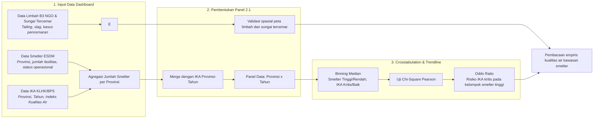

# BAB II: METODOLOGI ANALISIS KUALITAS LINGKUNGAN DI KAWASAN SMELTER

Dokumen laporan metodologi ini menyajikan kerangka ilmiah, formulasi matematis, prosedur pengolahan data, dan pengujian statistik yang dioperasionalkan pada **Bab 2: Kualitas Lingkungan di Kawasan Smelter**.

## 2.1. Dampak Limbah Tailing: Konsentrasi Smelter vs Indeks Kualitas Air (IKA)

> **Sumber Data Resmi & Deskripsi Visualisasi:** Data Smelter: `data/processed/sulawesi_esdm_nikel.csv`; Data IKA: `data/processed/sulawesi_ika_2016_2024.csv`; Data Limbah B3: `data/processed/sulawesi_limbah_b3_ngo_proxy.csv`; Data Pencemaran Sungai: `data/processed/sulawesi_sungai_tercemar.csv`.

#### A. Pengantar & Kerangka Narasi
Pengoperasian **778 fasilitas mega-smelter** yang didukung oleh kapasitas **9,825 MW PLTU Captive** meningkatkan intensitas emisi dan beban lingkungan di Pulau Sulawesi. Data menunjukkan konversi tutupan hutan mencapai **1,001,654 Hektar**, estimasi timbulan limbah B3/tailing sebesar **20.9 Juta Ton** per tahun, dan rata-rata IKA tahun 2023 sebesar **58.8**.

#### B. Alur Logika Metodologis Analisis Konsentrasi Smelter vs IKA


#### C. Formulasi Matematis
```text
Jumlah_Smelter_Provinsi = COUNT(Smelter_i) GROUP BY Provinsi
Rata_Rata_IKA_Provinsi_Tahun = MEAN(IKA) GROUP BY Provinsi, Tahun
Chi_Square = SUM((O_ij - E_ij)^2 / E_ij)
Odds_Ratio = (a * d) / (b * c)
```

#### D. Matriks Hasil Uji Empiris
Akumulasi pemusatan fasilitas smelter, nilai IKA, estimasi timbulan limbah B3, dan laporan sungai/pesisir tercemar pada masing-masing provinsi dapat dilihat secara empiris pada **Tabel 2.1** berikut:

##### Tabel 2.1: Rincian Empiris Konsentrasi Smelter, IKA, Limbah B3, dan Sungai Tercemar (2023)
| Provinsi | Jumlah Smelter | IKA | Limbah B3 (Ton/Tahun) | Sungai Tercemar | Daftar Sungai/Pesisir |
| :--- | :--- | :--- | :--- | :--- | :--- |
| Sulawesi Tengah | 344 | 63.6 | 12,000,000 | 4 | Sungai Bahodopi, Sungai Laroenai, Sungai Morowali, Pesisir Fatufia |
| Sulawesi Tenggara | 262 | 61.3 | 7,700,000 | 3 | Sungai Lasolo, Sungai Lalindu, Sungai Konaweha |
| Sulawesi Selatan | 111 | 58.0 | 1,000,000 | 1 | Pesisir dan Sungai Bantaeng |
| Sulawesi Barat | 39 | 58.8 | 0 | 0 | - |
| Sulawesi Utara | 15 | 52.1 | 0 | 0 | - |
| Gorontalo | 7 | 58.7 | 0 | 0 | - |

Penerapan sistem pengujian statistik tabulasi silang pada data panel 6 provinsi selama periode 2016-2023 (total 48 observasi valid) disajikan secara ringkas pada **Tabel 2.2** berikut:

##### Tabel 2.2: Ringkasan Eksekutif Skenario Crosstab Smelter vs IKA Bab 2
| Variabel Independen (X) | Variabel Dependen (Y) | Chi-Square (χ²) | P-Value | Odds Ratio | Kesimpulan |
| :--- | :--- | :--- | :--- | :--- | :--- |
| Kepadatan Smelter (Fasilitas) | Indeks Kualitas Air (IKA) | 2.083 | p = 0.1489 | 0.4 | TIDAK SIGNIFIKAN |

#### E. Analisis Temuan Empiris: Pencemaran Air dan Efek Pengenceran Data Agregat
Kegagalan statistik mendeteksi signifikansi membongkar fakta krusial: Indeks Kualitas Air (IKA) provinsi adalah metrik agregat yang mengencerkan tekanan ekologis di tapak. Pencemaran tailing fatal di area tambang dapat tertutupi oleh data sungai-sungai lain di luar lingkar industri.
