# METODOLOGI PENELITIAN: BAB 2 — ANALISIS KUALITAS LINGKUNGAN DI KAWASAN SMELTER
*CELIOS (Center of Economic and Law Studies) · Audit Spasial-Statistik D3TLH Sulawesi (2014–2024) · Ringkasan Eksekutif Metodologis*

---

## A. Desain Penelitian & Tujuan
Penelitian ini menggunakan **desain audit spasial-statistik kuantitatif dan inferensial bivariat terintegrasi** untuk mengukur dampak degradasi lingkungan hidup akibat pemusatan fasilitas smelter nikel dan kawasan industri bertenaga PLTU captive batubara di enam provinsi Pulau Sulawesi sepanjang satu dekade (**2014–2024**). Tiga tujuan utama metodologis Bab 2 meliputi:

1. **Membongkar Bias Pengenceran Agregat (Aggregate Dilution Bias):** Membuktikan bahwa indeks mutu air (IKA) dan udara (IKU) resmi pada skala provinsi menyamarkan tingkat keparahan polusi riil di sekitar tapak cerobong PLTU captive dan sungai pembuangan limbah tailing smelter.
2. **Menguji Kausalitas Eksekusi Ruang vs Deforestasi:** Mengukur kekuatan hubungan dan rasio peluang (Odds Ratio) antara alokasi luasan izin konsesi industri nikel terhadap percepatan kehilangan tutupan hutan alam primer.
3. **Kuantifikasi Atribusi Karbon & Ancaman Kepunahan Satwa:** Mendekomposisi faktor pendorong deforestasi guna membuktikan dominasi pelepasan emisi CO₂ serta memetakan pertampalan spasial titik perjumpaan spesies endemik kunci Wallacea dengan konsesi tambang.

---

## B. Sumber Data & Cakupan Wilayah
Penelitian mencakup seluruh wilayah daratan dan pesisir Pulau Sulawesi yang terbagi ke dalam **6 provinsi** (Sulawesi Tengah, Sulawesi Tenggara, Sulawesi Selatan, Sulawesi Barat, Gorontalo, Sulawesi Utara) serta **kawasan industri terpadu sentra nikel**. Data yang dihimpun berbentuk panel tahunan (2014–2024) berbasis data terbuka resmi lintas kementerian, registri global, dan citra satelit independen:

- **Kementerian Lingkungan Hidup dan Kehutanan (Ditjen PPKL):** Indeks Kualitas Lingkungan Hidup (IKLH), Indeks Kualitas Air (IKA), Indeks Kualitas Udara (IKU), dan data status mutu sungai.
- **ESDM (MODI & MinerbaOne) & Kementerian Investasi (BKPM):** Inventarisasi unit fasilitas smelter nikel dan alokasi konsesi pertambangan.
- **Global Energy Monitor (GEM) & RUPTL PLN:** Registri geospasial unit dan kapasitas operasional PLTU captive industri batubara off-grid (Megawatt).
- **Global Forest Watch (GFW / Hansen UMD) & IPCC:** Time-series kehilangan tutupan pohon (Ha) dan estimasi emisi gas rumah kaca (Megagram CO₂e) per faktor pendorong.
- **NASA TROPOMI (Sentinel-5P):** Konsentrasi troposferik nitrogen dioksida (NO₂ rasio µmol/m²) di atas kawasan industri nikel.
- **GBIF & IUCN Red List:** 269 titik koordinat geospasial perjumpaan aktual (occurrences) 7 spesies endemik kunci Wallacea dan status ancaman pertambangan (Mining Threat).

---

## C. Operasionalisasi Variabel & Indikator Riset
Seluruh variabel lingkungan, emisi, ruang, dan keanekaragaman hayati dioperasionalkan secara terukur ke dalam **10 indikator empiris terpadu** sebagaimana dirangkum pada matriks operasional berikut:

##### Matriks Operasionalisasi Variabel dan Sumber Data Resmi Bab 2
| No | Indikator Riset | Fokus Pengukuran | Satuan | Sumber Data Primer Resmi |
| :-: | :--- | :--- | :-: | :--- |
| 1 | Kepadatan Fasilitas Smelter | Pemusatan Industri Pirometalurgi & HPAL | Unit Fasilitas | ESDM MODI & MinerbaOne |
| 2 | Indeks Kualitas Air (IKA) | Status Mutu Air Sungai & Pesisir | Poin Skor (0–100) | Ditjen PPKL KLHK (IKLH) |
| 3 | Estimasi Timbulan Limbah B3 | Residu Tailing & Terak Slag Nikel | Ton / Tahun | Amdal Industri & Neraca KLHK |
| 4 | Kapasitas PLTU Captive Batubara | Intensitas Pembangkit Listrik Off-Grid | Megawatt (MW) | Global Energy Monitor & RUPTL |
| 5 | Indeks Kualitas Udara (IKU) | Status Mutu Udara Ambien Agregat | Poin Skor (0–100) | Ditjen PPKL KLHK (IKLH) |
| 6 | Konsentrasi Troposferik NO₂ | Pencemaran Polutan Udara Satelit | µmol/m² | Satelit NASA TROPOMI (Sentinel-5P) |
| 7 | Luas Konsesi IUP & Kawasan | Alokasi Ruang Industri Ekstraktif | Hektar (Ha) | ESDM MODI & ATR/BPN |
| 8 | Luas Deforestasi Hutan Alam | Kehilangan Tutupan Pohon Alami | Hektar (Ha) | Global Forest Watch (Hansen UMD) |
| 9 | Atribusi Emisi Karbon CO₂ | Pelepasan GRK per Faktor Pendorong | Megagram CO₂e | GFW & IPCC Tier-1 Methodology |
| 10 | Sebaran Spesies Endemik & IUCN | Keterancaman Habitat Wallacea | Titik & Kategori | GBIF API & IUCN Red List |

---

## D. Kerangka Analisis & Formulasi Matematis

### 2.1 Dampak Limbah Tailing: Konsentrasi Smelter vs Indeks Kualitas Air (IKA)
Pemusatan unit pengolahan pirometalurgi dan hidrometalurgi dihitung berdasarkan agregasi titik fasilitas di setiap provinsi guna mengukur tekanan potensi pelepasan tailing dan slag nikel terhadap baku mutu sungai:

> `Kepadatan Smelter (Unit) = Σ [ Fasilitas Smelter Beroperasi & Konstruksi di Provinsi ]`

Status mutu air diukur menggunakan rata-rata indeks IKA provinsi. Protokol pengujian kontinjensi 2×2 diterapkan untuk menguji signifikansi hubungan antara kepadatan smelter dan status IKA kritis berbasis ambang median:

##### Tabel 2.1a: Konfigurasi Variabel Uji Chi-Square (Sub-bab 2.1)
| Komponen Uji | Definisi Variabel (Sub-bab 2.1) |
| :--- | :--- |
| **Variabel Independen (X)** | Jumlah Smelter: Total fasilitas smelter (beroperasi maupun konstruksi). |
| **Variabel Dependen (Y)** | Indeks Kualitas Air: Skor baku mutu air per provinsi. |
| **Hipotesis Nol (H0)** | Tidak ada hubungan signifikan secara statistik antara kepadatan smelter dengan Indeks Kualitas Air. |
| **Hipotesis Alternatif (H1)** | Ada hubungan negatif antara kepadatan smelter dengan Indeks Kualitas Air (semakin padat smelter, semakin kritis mutu air). |
| **Decision Rule (Alpha 5%)** | Jika P-Value < 0.05, maka Tolak H0 (Terbukti signifikan bahwa smelter menurunkan mutu air). |
| **Threshold Kategori** | Nilai Median Data Panel 2016-2024 (N=54): X >= 75.0 fasilitas; Y >= 55.9 poin. |
| **Orientasi Odds Ratio** | OR = ( a × d ) / ( b × c ) dengan a = Smelter Tinggi & IKA Kritis; mengukur risiko IKA kritis pada kelompok kepadatan smelter tinggi. |

### 2.2 Kepungan Asap: Kapasitas PLTU vs Indeks Kualitas Udara (IKU)
Akumulasi beban emisi pembakaran batubara dihitung dari total kapasitas pembangkit listrik tenaga uap captive terpasang pada kawasan industri nikel:

> `Total Kapasitas PLTU (MW) = Σ [ Kapasitas PLTU Captive Terpasang di Koridor Industri ]`

Pengujian statistik tabulasi silang mengevaluasi interaksi antara kapasitas pembangkit off-grid terhadap penurunan skor mutu udara ambien (IKU) serta divalidasi oleh densitas polutan satelit NO₂:

##### Tabel 2.2a: Konfigurasi Variabel Uji Chi-Square (Sub-bab 2.2)
| Komponen Uji | Definisi Variabel (Sub-bab 2.2) |
| :--- | :--- |
| **Variabel Independen (X)** | Kapasitas PLTU (MW): Total kapasitas PLTU Captive yang beroperasi. |
| **Variabel Dependen (Y)** | Indeks Kualitas Udara: Skor baku mutu udara ambien per provinsi. |
| **Hipotesis Nol (H0)** | Tidak ada hubungan signifikan secara statistik antara kapasitas PLTU dengan Indeks Kualitas Udara. |
| **Hipotesis Alternatif (H1)** | Ada hubungan negatif antara kapasitas PLTU dengan Indeks Kualitas Udara (semakin besar kapasitas, semakin kritis mutu udara). |
| **Decision Rule (Alpha 5%)** | Jika P-Value < 0.05, maka Tolak H0 (Terbukti signifikan bahwa emisi PLTU menurunkan kualitas udara). |
| **Threshold Kategori** | Nilai Median Data Panel (N=54): X >= 220.0 MW; Y >= 91.0 poin. |
| **Orientasi Odds Ratio** | OR = ( a × d ) / ( b × c ) dengan a = PLTU Tinggi & IKU Kritis; mengukur risiko IKU kritis pada kelompok kapasitas PLTU tinggi. |

### 2.3 Eksekusi Ruang: Ekspansi Kawasan Industri vs Tekanan Ekologis (Deforestasi)
Total alokasi ruang konsesi industri nikel dihitung melalui penjumlahan luasan izin usaha pertambangan (IUP) aktif dan zonasi kawasan industri terpadu:

> `Total Alokasi Ruang (Ha) = Σ [ Luas Konsesi IUP Tambang + Luas Tapak Kawasan Industri ]`

Uji independensi Chi-Square (α = 5%, df = 1) dan Odds Ratio diterapkan untuk menguji hipotesis pembuktian apakah penguasaan ruang skala besar meningkatkan risiko deforestasi terbuka secara eksponensial:

##### Tabel 2.3a: Konfigurasi Variabel Uji Chi-Square (Sub-bab 2.3)
| Komponen Uji | Definisi Variabel (Sub-bab 2.3) |
| :--- | :--- |
| **Variabel Independen (X)** | Luas Ekspansi Industri (Ha) / Luas IUP & Kawasan (Ha) |
| **Variabel Dependen (Y)** | Kehilangan Tutupan Pohon (Ha) / Total Deforestasi Alam (Ha) |
| **Hipotesis Nol (H0)** | Luasan ekspansi kawasan industri dan perizinan tambang tidak berhubungan dengan laju deforestasi. |
| **Hipotesis Alternatif (H1)** | Alokasi izin lahan (Luas IUP & Kawasan) berkorelasi positif dengan laju deforestasi. |
| **Decision Rule (Alpha 5%)** | Jika P-Value < 0.05, maka Tolak H0 (terbukti signifikan bahwa ekspansi izin lahan mendorong deforestasi). |
| **Threshold Kategori** | Nilai Median Data Panel (N=60): X >= 138,148.8 Ha; Y >= 15,917.7 Ha. |
| **Orientasi Odds Ratio** | OR = ( a × d ) / ( b × c ) dengan a = IUP Tinggi & Deforestasi Tinggi/Parah; mengukur risiko deforestasi parah pada kelompok luas IUP tinggi. |

### 2.4 Driver Deforestasi: Analisis Faktor Pendorong Perubahan Tutupan Hutan
Dekomposisi faktor pendorong deforestasi mengkuantifikasi porsi relatif pembabatan hutan alami ke dalam empat kategori pendorong utama, serta menghitung kuantitas pelepasan karbon teratribusi:

> `Proporsi Driver (%) = [ Deforestasi Driver Spesifik (Ha) / Total Deforestasi (Ha) ] × 100`

> `Atribusi Emisi CO₂ (Mg) = Total Deforestasi Driver (Ha) × Koefisien Karbon Lanskap (Mg CO₂/Ha)`

### 2.5 Kehancuran Biodiversitas: Dampak Terhadap Habitat Satwa Endemik
Analisis keterancaman keanekaragaman hayati mengintegrasikan 269 titik perjumpaan aktual (occurrences) GBIF dari 7 spesies endemik kunci Wallacea dengan analisis tumpang tindih spasial (overlay) poligon konsesi pertambangan dan status ancaman kepunahan internasional (IUCN Red List):

> `Kepadatan Occurrence (Titik/Km²) = Jumlah Titik Perjumpaan GBIF / Luas Wilayah Observasi (Km²)`

---

## E. Korespondensi Metodologi terhadap Sub-bab Laporan Bab 2
Setiap sub-bab analitis pada Bab 2 ditopang oleh metode kuantitatif yang presisi dan menghasilkan sintesis bukti empiris terstandarisasi sebagaimana dirangkum pada matriks berikut:

##### Matriks Korespondensi Sub-bab terhadap Metode Analitis
| Sub-bab | Fokus Kajian Empiris | Metode Analitis Utama |
| :---: | :--- | :--- |
| **Sub-bab 2.1** | Limbah Tailing & Mutu Air (IKA) | Pemetaan Spasial Smelter, Uji Non-parametrik Chi-Square (χ²), Odds Ratio (OR) |
| **Sub-bab 2.2** | Emisi PLTU Captive & Mutu Udara (IKU) | Pemetaan Kapasitas Pembangkit MW, Uji Chi-Square (χ²), Validasi Satelit NO₂ |
| **Sub-bab 2.3** | Ekspansi Ruang Industri vs Deforestasi | Animated Bubble Chart Temporal, Uji Chi-Square (χ²), Odds Ratio Risiko (OR) |
| **Sub-bab 2.4** | Dekomposisi Driver Deforestasi & Emisi CO₂ | Agregasi Tabular Atribusi Kausalitas, Proporsi Pendorong, Koefisien Emisi Karbon |
| **Sub-bab 2.5** | Fragmentasi Habitat & Satwa Endemik | Spatial Overlay GBIF Occurrence, Sintesis Status Keterancaman IUCN Red List |

---

## F. Bagan Alur Kerangka Kerja Riset (Research Workflow)

```mermaid
flowchart LR
    subgraph F1["Fase I: Akuisisi Data"]
        A1["Kurasi Data Resmi Terbuka<br/><i>KLHK, ESDM, GEM, GFW, NASA, GBIF</i>"]
        A2["Panel Provinsi-Tahun<br/><i>6 Provinsi Se-Sulawesi (N=54 s.d. 60)</i>"]
    end
    subgraph F2["Fase II: Harmonisasi Spasial"]
        B1["Penyelarasan Koordinat<br/><i>Smelter, PLTU, Konsesi & Titik GBIF</i>"]
        B2["Overlay Geospasial<br/><i>Baku Mutu vs Tekanan Industri</i>"]
    end
    subgraph F3["Fase III: Uji Statistik"]
        C1["Tabel Kontinjensi 2x2<br/><i>Ambang Median High vs Low</i>"]
        C2["Uji Chi-Square & Odds Ratio<br/><i>Signifikansi & Kelipatan Risiko</i>"]
    end
    subgraph F4["Fase IV: Atribusi & Sintesis"]
        D1["Dekomposisi Driver CO2<br/><i>Pertambangan vs Agrikultur</i>"]
        D2["Bukti Kausalitas D3TLH<br/><i>Degradasi Air, Udara & Biodiversitas</i>"]
    end
    F1 --> F2 --> F3 --> F4
```

> **KERANGKA KELUARAN METODOLOGIS BAB 2:**  
> 1. **Konfigurasi Baku Mutu Lingkungan vs Titik Tekanan Industri:** Mengisolasi anomali aggregate dilution bias pada indeks agregat provinsi (IKA dan IKU) terhadap pencemaran riil di tapak industri.  
> 2. **Konfigurasi Inferensial Eksekusi Ruang:** Menguji signifikansi kausalitas alokasi izin lahan terhadap percepatan laju deforestasi tutupan hutan melalui matriks kontinjensi Chi-Square dan rasio peluang (OR).  
> 3. **Konfigurasi Dekomposisi Driver & Integritas Biodiversitas:** Mengkuantifikasi kontribusi dominan sektor pertambangan terhadap pelepasan emisi karbon dan memvalidasi krisis keterancaman habitat satwa endemik Wallacea.
