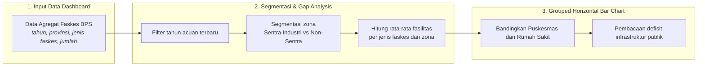
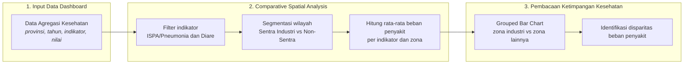
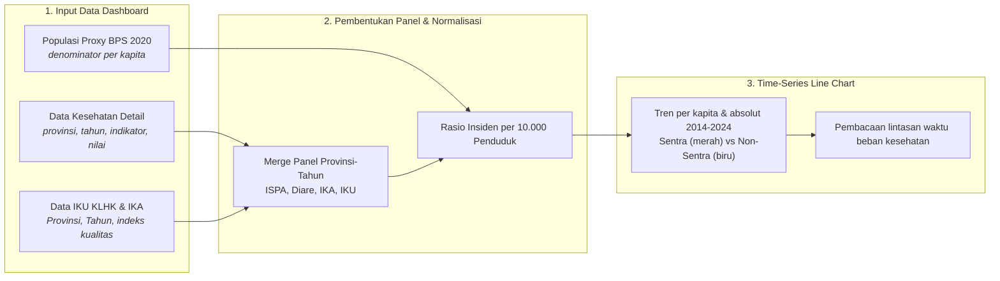
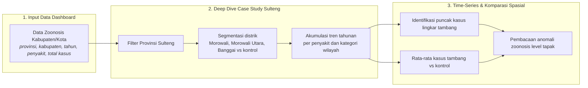
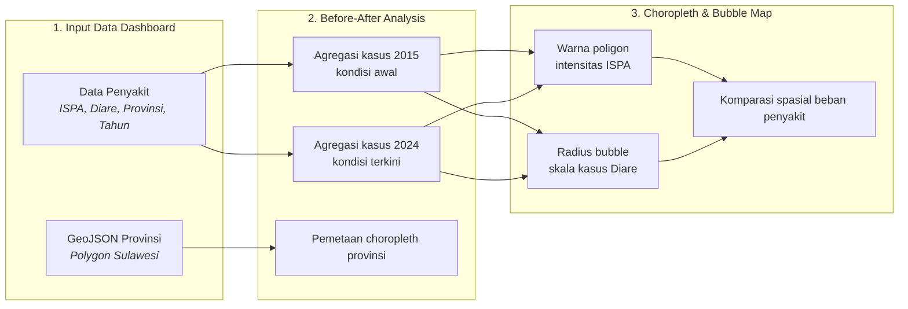
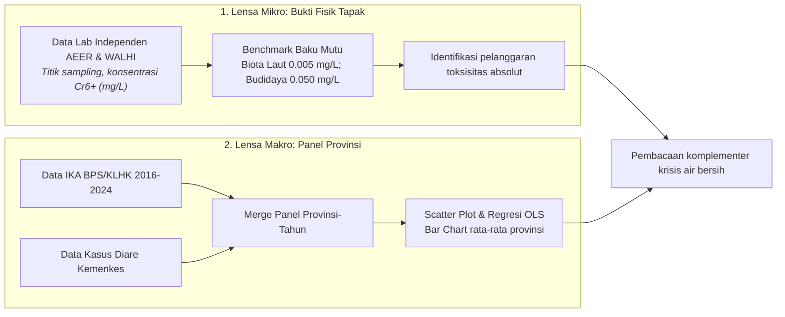
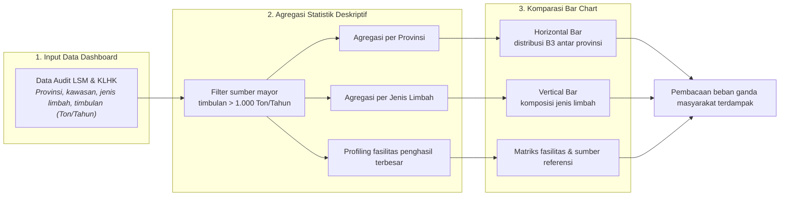

# BAB III: METODOLOGI ANALISIS BEBAN KESEHATAN MASYARAKAT TERDAMPAK

Dokumen laporan metodologi ini menyajikan kerangka ilmiah, prosedur pengolahan data, dan pembacaan empiris yang dioperasionalkan pada **Bab 3: Beban Kesehatan Masyarakat Terdampak**.

## 3.1 Kesenjangan Fasilitas Kesehatan di Kawasan Ekstraktif

> **Sumber Data Resmi & Deskripsi Visualisasi:** Data Agregat Faskes: `data/processed/sulawesi_faskes_agregat_v3.csv`. Visualisasi dashboard menggunakan *Grouped Horizontal Bar Chart* pada tahun acuan 2024.

#### A. Pengantar & Kerangka Narasi
Data empiris menggambarkan kesenjangan antara klaim pertumbuhan ekonomi dari ekspansi industri nikel dan kondisi kesehatan masyarakat di kawasan penyangga. Ekspansi kapasitas industri yang ditopang PLTU *captive* berkapasitas **9,825 Megawatt** berjalan sejajar dengan peningkatan kasus penyakit.

Sepanjang 2014-2024, data agregat dinas kesehatan mencatat total kasus ISPA/Pneumonia sebanyak **233,687**, kasus Diare sebanyak **2,286,607**, dan kasus Malaria sebanyak **50,877**. Pada 2024, tercatat **1,393** Puskesmas dan **300** Rumah Sakit.

#### B. Alur Logika Metodologis Grouped Horizontal Bar Chart


##### Tabel 3.1a: Konfigurasi Variabel Analisis Gap Fasilitas Kesehatan (Sub-bab 3.1)
| Komponen Analisis | Definisi Variabel (Sub-bab 3.1) |
| :--- | :--- |
| Jumlah & Jenis Faskes (Dependen) | Unit Rumah Sakit dan Puskesmas terdaftar (BPS). |
| Kategori Zona (Independen) | Lokasi wilayah: Sentra Industri (Sulteng & Sultra) vs Non-Sentra Industri (Lainnya). |
| Metode Analisis | Grouped Horizontal Bar Chart pada satu periode cross-sectional untuk mengukur ketimpangan infrastruktur kesehatan primer dan sekunder. |
| Tahun Acuan | 2024, mengikuti data terbaru pada file faskes. |
| Dataset & File | data/processed/sulawesi_faskes_agregat_v3.csv |

#### C. Formulasi Matematis: Rata-rata Faskes dan Disparitas Zona
```text
F̄_{z,j} = [ Σ_{p∈z} F_{p,j} ] / n_z
D_j = F̄_{Sentra,j} / F̄_{Non-Sentra,j}
```

#### D. Matriks Hasil Uji Empiris
##### Tabel 3.1: Rata-rata Fasilitas Kesehatan per Provinsi menurut Zona Industri (2024)
| Kategori Zona | Jenis Faskes | Rata-rata Jumlah Fasilitas |
| :--- | :--- | :--- |
| Non-Sentra Industri (Lainnya) | Puskesmas | 216.5 |
| Sentra Industri (Sulteng & Sultra) | Puskesmas | 263.5 |
| Non-Sentra Industri (Lainnya) | Rumah Sakit | 55.0 |
| Sentra Industri (Sulteng & Sultra) | Rumah Sakit | 40.0 |

##### Tabel 3.2: Rincian Fasilitas Kesehatan per Provinsi (2024)
| Provinsi | Kategori Zona | Jenis Faskes | Jumlah |
| :--- | :--- | :--- | :--- |
| Gorontalo | Non-Sentra Industri | Puskesmas | 95 |
| Gorontalo | Non-Sentra Industri | Rumah Sakit | 20 |
| Sulawesi Barat | Non-Sentra Industri | Puskesmas | 98 |
| Sulawesi Barat | Non-Sentra Industri | Rumah Sakit | 16 |
| Sulawesi Selatan | Non-Sentra Industri | Puskesmas | 474 |
| Sulawesi Selatan | Non-Sentra Industri | Rumah Sakit | 126 |
| Sulawesi Tengah | Sentra Industri | Puskesmas | 219 |
| Sulawesi Tengah | Sentra Industri | Rumah Sakit | 40 |
| Sulawesi Tenggara | Sentra Industri | Puskesmas | 308 |
| Sulawesi Tenggara | Sentra Industri | Rumah Sakit | 40 |
| Sulawesi Utara | Non-Sentra Industri | Puskesmas | 199 |
| Sulawesi Utara | Non-Sentra Industri | Rumah Sakit | 58 |

#### E. Analisis Temuan Empiris: Defisit Infrastruktur Kesehatan Publik
Rata-rata Rumah Sakit di Sentra Industri tercatat **40 unit** per provinsi, lebih rendah dari wilayah Non-Sentra yang mencapai **55 unit**. Rata-rata Puskesmas di Sentra Industri tercatat **264 unit** per provinsi dibandingkan **216 unit** di Non-Sentra.

## 3.2 Ketimpangan Beban Penyakit: Sentra Industri vs Non-Sentra

> **Sumber Data Resmi & Deskripsi Visualisasi:** Data Agregasi Kesehatan: `data/processed/sulawesi_kesehatan_detail_2014_2024.csv`. Visualisasi dashboard menggunakan *Comparative Spatial Analysis* untuk membandingkan rata-rata beban penyakit antara provinsi sentra ekstraktif dan non-sentra.

#### A. Pengantar & Kerangka Narasi
Melalui analisis komparatif spasial, terlihat bahwa beban ekologis tidak terdistribusi secara merata di seluruh wilayah. Provinsi sentra ekspansi nikel, yaitu Sulawesi Tengah dan Sulawesi Tenggara, menunjukkan indikator penyakit yang secara konsisten lebih tinggi.

Data menunjukkan bahwa rata-rata penderita **ISPA/Pneumonia** di Sentra Industri tercatat **5,353 kasus per tahun**, dibandingkan provinsi Non-Sentra di angka **2,634 kasus**. Selisih sebesar **2.0 kali lipat** ini mengindikasikan beban pernapasan yang lebih berat di kawasan penyangga *smelter*.

#### B. Alur Logika Metodologis Comparative Spatial Analysis


##### Tabel 3.2a: Konfigurasi Variabel Comparative Spatial Analysis (Sub-bab 3.2)
| Komponen Analisis | Definisi Variabel (Sub-bab 3.2) |
| :--- | :--- |
| Kategori Zona (Independen) | Labeling spasial: Sentra Industri (Sulteng & Sultra) vs Non-Sentra Industri (Sulsel, Sulut, Gorontalo, Sulbar). |
| Kasus ISPA/Pneumonia & Diare (Dependen) | Total prevalensi historis penyakit per tahun dari fasilitas kesehatan primer. |
| Metode Analisis | Comparative Spatial Analysis untuk membandingkan rata-rata beban penyakit antara provinsi sentra ekstraktif dan non-sentra. |
| Periode Observasi | 2014-2024, mengikuti data kesehatan agregat yang tersedia. |
| Dataset & File | data/processed/sulawesi_kesehatan_detail_2014_2024.csv |

#### C. Formulasi Matematis: Rata-rata Beban Penyakit dan Disparitas Zona
```text
B̄_{z,k} = [ Σ_{p∈z} Σ_t C_{p,t,k} ] / N_z
Q_k = B̄_{Sentra,k} / B̄_{Non-Sentra,k}
```

Substitusi angka dari dataset aktual ke dalam rumus rata-rata beban penyakit adalah sebagai berikut:

```text
B̄_Sentra,ISPA = 117,775 / 22 = 5,353.4 kasus
B̄_Non-Sentra,ISPA = 115,912 / 44 = 2,634.4 kasus
Q_ISPA = 5,353.4 / 2,634.4 = 2.0x
B̄_Sentra,Diare = 814,407 / 20 = 40,720.3 kasus
B̄_Non-Sentra,Diare = 1,472,200 / 40 = 36,805.0 kasus
Q_Diare = 40,720.3 / 36,805.0 = 1.1x
```

#### D. Matriks Hasil Uji Empiris
##### Tabel 3.3: Rata-rata Beban Penyakit per Tahun menurut Zona Industri (2014-2024)
| Indikator Penyakit | Kategori Zona | Rata-rata Kasus per Tahun |
| :--- | :--- | :--- |
| Kasus Diare Dilayani | Non-Sentra Industri (Sulsel, Sulut, Gorontalo, Sulbar) | 36,805 |
| Kasus Diare Dilayani | Sentra Industri (Sulteng & Sultra) | 40,720 |
| Kasus ISPA/Pneumonia | Non-Sentra Industri (Sulsel, Sulut, Gorontalo, Sulbar) | 2,634 |
| Kasus ISPA/Pneumonia | Sentra Industri (Sulteng & Sultra) | 5,353 |

##### Tabel 3.4: Ringkasan Disparitas Beban Penyakit Sentra vs Non-Sentra
| Indikator Penyakit | Rata-rata Sentra | Rata-rata Non-Sentra | Rasio Disparitas |
| :--- | :--- | :--- | :--- |
| Kasus ISPA/Pneumonia | 5,353 | 2,634 | 2.0x |
| Kasus Diare Dilayani | 40,720 | 36,805 | 1.1x |

#### E. Analisis Temuan Empiris: Ketimpangan Beban Penyakit Struktural
Rata-rata penderita ISPA/Pneumonia di Sentra Industri tercatat **5,353 kasus per tahun**, dibandingkan provinsi Non-Sentra di angka **2,634 kasus**. Selisih sebesar **2.0 kali lipat** mendukung pembacaan bahwa wilayah dengan konsentrasi industri tinggi cenderung menanggung beban kesehatan yang lebih besar akibat tekanan terhadap daya tampung lingkungan.

## 3.3 Lintasan Waktu Ekologis & Dinamika Penyakit di Kawasan Industri Ekstraktif

> **Sumber Data Resmi & Deskripsi Visualisasi:** Data Lingkungan & Penyakit: `data/processed/sulawesi_kesehatan_detail_2014_2024.csv`, `data/processed/sulawesi_ika_2016_2024.csv`, `data/processed/sulawesi_iku_2015_2024.csv`. Visualisasi dashboard menampilkan *Time-Series Line Chart* (insiden per 10.000 penduduk dan total kasus absolut) serta pengujian Chi-Square tabulasi silang (Crosstabulation) dengan binning median per-provinsi.

#### A. Pengantar & Kerangka Narasi
Meskipun secara akumulatif kawasan Sentra Industri menanggung beban yang lebih berat, penelusuran data secara *time-series* (historis) dari 2014 hingga 2024 memberikan wawasan tambahan mengenai fluktuasi kasus penyakit dari tahun ke tahun. Hipotesis utama: **penurunan kualitas udara ambien (IKU) berbanding lurus dengan peningkatan insidensi penyakit pernapasan dan lingkungan**. Untuk mengujinya di tengah keterbatasan jumlah provinsi (N=6), uji Chi-Square menggunakan unit observasi **Provinsi-Tahun** (6 provinsi × 11 tahun panel) dengan klasifikasi berdasarkan median per-provinsi.

#### B. Alur Logika Metodologis Time-Series Line Chart & Crosstabulation
Pendekatan penelusuran runtut waktu insiden penyakit sejalan dengan akumulasi polusi tahunan diilustrasikan pada **Bagan Alur 3.3** berikut. Adapun untuk tahapan analisis inferensial (Uji Chi-Square), alur logikanya diringkas melalui tabel konfigurasi variabel di bawah gambar.

##### Bagan Alur 3.3: Alur Logika Analisis Time-Series Beban Kesehatan


##### Tabel 3.3a: Konfigurasi Variabel Uji Chi-Square (Sub-bab 3.3)
| Komponen Uji | Definisi Variabel (Sub-bab 3.3) |
| :--- | :--- |
| Variabel Independen (X) | IKU Wilayah Sentra Tambang / IKU Wilayah Non-Sentra (indeks tekanan kualitas lingkungan). |
| Variabel Dependen (Y) | Total Kasus ISPA/Pneumonia (insidensi penyakit pernapasan dan lingkungan). |
| Hipotesis Nol (H0) | Penurunan kualitas lingkungan (IKU/IKA) tidak berkorelasi dengan peningkatan insidensi penyakit pernapasan dan pencernaan. |
| Hipotesis Alternatif (H1) | Penurunan kualitas udara ambien (IKU) berbanding lurus dengan peningkatan insidensi penyakit pernapasan dan lingkungan (ISPA dan Diare). |
| Decision Rule (Alpha 5%) | Chi-Square P-Value < 0.05 (Tolak H0) dan kalkulasi Odds Ratio. |
| Threshold Kategori | Median per-provinsi data panel Provinsi-Tahun (N=18 observasi valid skenario Sentra); binning 'Tinggi'/'Rendah' per provinsi untuk menghilangkan bias besaran absolut antar wilayah. |
| Orientasi Odds Ratio | Untuk variabel X berjenis indeks kualitas (IKU/IKA), risiko dihitung saat indeks Rendah: OR = ( b × c ) / ( a × d ). |

#### C. Formulasi Matematis: Normalisasi Per Kapita, Binning Median Provinsi, dan Uji Crosstabulation
Kuantifikasi rasio keparahan per kapita dan pembuktian statistik dihitung menggunakan sistem formulasi matematis berikut:

```text
Insiden_10K_p,t = ( Kasus_p,t / Populasi_p ) × 10.000
Median_Prov_p = Median ( Nilai_p,t )   ;   untuk seluruh tahun t pada provinsi p
Kategori(x_p,t) = 'Tinggi' , jika x_p,t ≥ Median_Prov_p   |   'Rendah' , jika x_p,t < Median_Prov_p
χ² = Σ [ ( O_ij - E_ij )² / E_ij ]   ;   dengan E_ij = ( Total_Baris_i × Total_Kolom_j ) / N
Odds_Ratio (OR) = ( b × c ) / ( a × d )   ;   untuk X berjenis indeks kualitas (IKU/IKA)
```

#### D. Matriks Hasil Uji Empiris
##### Tabel 3.5: Rata-rata Insiden ISPA/Pneumonia Absolut dan per 10.000 Penduduk per Provinsi (2014-2024)
| Provinsi | Kategori Zona | Populasi Proxy (BPS 2020) | Rata-rata Kasus per Tahun | Rata-rata Insiden per 10.000 Penduduk |
| :--- | :--- | :--- | :--- | :--- |
| Sulawesi Tengah | Sentra Industri | 2,985,000 | 8,120 | 27 |
| Gorontalo | Non-Sentra Industri | 1,171,000 | 2,779 | 24 |
| Sulawesi Tenggara | Sentra Industri | 2,624,000 | 2,587 | 10 |
| Sulawesi Barat | Non-Sentra Industri | 1,419,000 | 1,182 | 8 |
| Sulawesi Selatan | Non-Sentra Industri | 9,070,000 | 5,197 | 6 |
| Sulawesi Utara | Non-Sentra Industri | 2,621,000 | 1,379 | 5 |

##### Tabel 3.6: Ringkasan Eksekutif Seluruh Skenario Crosstab IKU vs Insidensi Penyakit Bab 3
| Variabel Independen (X) | Variabel Dependen (Y) | Chi-Square (χ²) | P-Value | Odds Ratio | Kesimpulan |
| :--- | :--- | :--- | :--- | :--- | :--- |
| IKU Wilayah Sentra Tambang | Total Kasus ISPA/Pneumonia | 3.556 | p = 0.059 | 12.25 | TIDAK SIGNIFIKAN |
| IKU Wilayah Non-Sentra | Total Kasus ISPA/Pneumonia | 1.044 | p = 0.307 | 2.52 | TIDAK SIGNIFIKAN |

#### E. Analisis Temuan Empiris: Pembedahan Realitas Ekologis
Dari 2 skenario pengujian, seluruhnya menunjukkan status TIDAK SIGNIFIKAN. Dalam perspektif analisis ekologis, ketidaksignifikanan secara agregat ini mengindikasikan bahwa penurunan kualitas lingkungan dan peningkatan beban penyakit telah terjadi secara merata dan persisten di seluruh wilayah. Penambahan aktivitas industri di satu titik berkorelasi dengan tekanan lingkungan yang sudah merata secara sistemik.

## 3.4 Anomali Zoonosis: Dampak Kritis Ekspansi Industri di Level Tapak (Studi Kasus Sulteng)

> **Sumber Data Resmi & Deskripsi Visualisasi:** Data Zoonosis: `data/processed/zoonosis_kab_kota_2015_2024.csv`. Visualisasi dashboard menggunakan *Time-Series* dan Komparasi Spasial Wilayah untuk membandingkan kabupaten lingkar tambang/smelter aktif dengan daerah non-tambang/agraris sebagai kontrol.

#### A. Pengantar & Kerangka Narasi
Data empiris Dinas Kesehatan mencatat total akumulasi **3,111 kasus** penyakit zoonosis di wilayah Lingkar Tambang/Smelter Aktif Sulawesi Tengah (Morowali, Morowali Utara, Banggai) sepanjang rentang waktu pengamatan 2019-2024. Peningkatan angka zoonosis ini dibaca bersama perubahan ekologis akibat ekspansi penggunaan lahan, konversi tutupan hutan, pergeseran habitat alami satwa liar, genangan air galian tambang yang tidak direklamasi, serta kondisi sanitasi di area industri.

#### B. Alur Logika Metodologis Time-Series & Komparasi Spasial Wilayah
Kerangka studi kasus mendalam berbasis deret waktu di tingkat kabupaten/kota khusus Sulawesi Tengah diilustrasikan pada **Bagan Alur 3.4** berikut. Sub-bab ini tidak menggunakan uji inferensial Chi-Square, melainkan isolasi episentrum ekstraktif dan komparasi absolut dengan wilayah kontrol.

##### Bagan Alur 3.4: Alur Logika Metodologis Anomali Zoonosis Level Tapak


#### C. Formulasi Matematis: Tren Zoonosis Distrik dan Komparasi Wilayah
```text
Z_{w,t,d} = Σ C_{r,t,d}, untuk setiap distrik r yang termasuk wilayah w
Z̄_w = [ Σ_t Z_{w,t,d} ] / N_w
R_d = Z̄_Tambang / Z̄_Kontrol
```

#### D. Matriks Hasil Uji Empiris
##### Tabel 3.7: Insidensi Tertinggi Zoonosis di Lingkar Tambang/Smelter Aktif Sulawesi Tengah
| Jenis Penyakit | Kabupaten | Tahun | Puncak Kasus |
| :--- | :--- | :--- | :--- |
| DBD | Morowali Utara | 2024 | 431 |
| FILARIASIS | Banggai | 2019 | 16 |
| MALARIA | Morowali Utara | 2024 | 355 |
| RABIES | Banggai | 2019 | 2 |

##### Tabel 3.8: Tren Tahunan DBD menurut Kategori Wilayah
| Tahun | Kategori Wilayah | Total Kasus |
| :--- | :--- | :--- |
| 2019 | Lingkar Tambang/Smelter Aktif | 416 |
| 2019 | Non-Tambang/Agraris (Kontrol) | 717 |
| 2020 | Lingkar Tambang/Smelter Aktif | 86 |
| 2020 | Non-Tambang/Agraris (Kontrol) | 709 |
| 2021 | Lingkar Tambang/Smelter Aktif | 97 |
| 2021 | Non-Tambang/Agraris (Kontrol) | 266 |
| 2022 | Lingkar Tambang/Smelter Aktif | 279 |
| 2022 | Non-Tambang/Agraris (Kontrol) | 876 |
| 2023 | Lingkar Tambang/Smelter Aktif | 325 |
| 2023 | Non-Tambang/Agraris (Kontrol) | 734 |
| 2024 | Lingkar Tambang/Smelter Aktif | 876 |
| 2024 | Non-Tambang/Agraris (Kontrol) | 944 |

##### Tabel 3.9: Rata-rata Kasus DBD Tambang vs Kontrol
| Jenis Penyakit | Kategori Wilayah | Rata-rata Kasus |
| :--- | :--- | :--- |
| DBD | Lingkar Tambang/Smelter Aktif | 115.5 |
| DBD | Non-Tambang/Agraris (Kontrol) | 88.5 |

#### E. Analisis Temuan Empiris: Anomali Zoonosis Level Tapak
Pada penyakit terpilih (DBD), rata-rata kasus di wilayah Lingkar Tambang/Smelter Aktif mencapai **115.5** kasus per observasi, dibandingkan **88.5** kasus pada wilayah Non-Tambang/Agraris (Kontrol), dengan rasio komparatif **1.3x**. Pola ini memberikan sinyal bahwa perubahan ekologis di sekitar kawasan industri perlu dibaca sampai level tapak, karena data agregat provinsi dapat mengaburkan lonjakan penyakit pada kabupaten episentrum ekstraktif.

## 3.5 Pemetaan Geospasial: Distribusi Spasial Beban Penyakit

> **Sumber Data Resmi & Deskripsi Visualisasi:** Data Spasial: `data/raw/indonesia-prov.geojson`; Data Penyakit: `data/processed/sulawesi_kesehatan_detail_2014_2024.csv`. Visualisasi dashboard menggunakan *Choropleth & Bubble Map (GeoJSON)* untuk membandingkan beban ISPA dan Diare antara 2015 dan 2024.

#### A. Pengantar & Kerangka Narasi
Peta interaktif pada dashboard memproyeksikan secara spasial perbandingan absolut beban kesehatan (ISPA dan Diare) antara **Awal Ekstraksi (2015)** dan **Kondisi Terkini (2024)**. Sesuai *framework Before-After Analysis*, sub-bab ini membaca bagaimana distribusi beban penyakit berkembang seiring perluasan kawasan industri.

#### B. Alur Logika Metodologis Choropleth & Bubble Map


#### C. Formulasi Matematis: Radius Bubble dan Pertumbuhan Before-After
```text
r_{p,t} = √D_{p,t} / K
G_p (%) = [ ( X_{p,2024} - X_{p,2015} ) / X_{p,2015} ] × 100
Batas_Warna = min(ISPA_{2015,2024}) + q × [ max(ISPA_{2015,2024}) - min(ISPA_{2015,2024}) ]
```

#### D. Matriks Hasil Uji Empiris
##### Tabel 3.10: Matriks Before-After ISPA dan Diare per Provinsi (2015 vs 2024)
| Provinsi | Kategori | ISPA 2015 | ISPA 2024 | Growth ISPA | Diare 2015 | Diare 2024 | Growth Diare |
| :--- | :--- | :--- | :--- | :--- | :--- | :--- | :--- |
| Gorontalo | Non-Sentra Industri | 4,226 | 2,843 | -32.7% | 14,086 | 13,040 | -7.4% |
| Sulawesi Barat | Non-Sentra Industri | 1,532 | 1,381 | -9.9% | 14,723 | 16,785 | 14.0% |
| Sulawesi Selatan | Non-Sentra Industri | 2,445 | 9,052 | 270.2% | 28,221 | 120,370 | 326.5% |
| Sulawesi Tengah | Sentra Industri | 10,152 | 8,840 | -12.9% | 12,803 | 34,225 | 167.3% |
| Sulawesi Tenggara | Sentra Industri | 3,262 | 1,647 | -49.5% | 115,878 | 24,613 | -78.8% |
| Sulawesi Utara | Non-Sentra Industri | 753 | 243 | -67.7% | 59,614 | 11,532 | -80.7% |

##### Tabel 3.11: Standarisasi Radius Bubble Kasus Diare
| Provinsi | Diare 2015 | Radius 2015 | Diare 2024 | Radius 2024 |
| :--- | :--- | :--- | :--- | :--- |
| Gorontalo | 14,086 | 7.91 | 13,040 | 7.61 |
| Sulawesi Barat | 14,723 | 8.09 | 16,785 | 8.64 |
| Sulawesi Selatan | 28,221 | 11.20 | 120,370 | 23.13 |
| Sulawesi Tengah | 12,803 | 7.54 | 34,225 | 12.33 |
| Sulawesi Tenggara | 115,878 | 22.69 | 24,613 | 10.46 |
| Sulawesi Utara | 59,614 | 16.28 | 11,532 | 7.16 |

#### E. Analisis Temuan Empiris: Pergeseran Spasial Beban Penyakit
Pada kondisi terkini 2024, beban ISPA tertinggi tercatat di **Sulawesi Selatan** dengan **9,052** kasus, sedangkan beban Diare tertinggi tercatat di **Sulawesi Selatan** dengan **120,370** kasus. Pemetaan Before-After menegaskan pentingnya membaca perubahan beban kesehatan secara spasial: warna choropleth menunjukkan intensitas ISPA, sedangkan radius bubble memperlihatkan skala Diare secara proporsional.

## 3.6 Krisis Air Bersih: Tinjauan Makro Provinsi dan Bukti Uji Klinis Lingkar Tambang

> **Sumber Data Resmi & Deskripsi Visualisasi:** Data Uji Lab Independen: `data/processed/ika_ngo_cr6_gabungan.csv` (AEER & WALHI); Data IKA: `data/processed/sulawesi_ika_2016_2024.csv`; Data Diare: `data/processed/sulawesi_kesehatan_detail_2014_2024.csv`. Visualisasi dashboard menampilkan grafik batang kadar Cr6+ vs baku mutu, Scatter Plot regresi OLS IKA vs Diare, Bar Chart rata-rata per provinsi, serta pengujian Chi-Square tabulasi silang dengan binning median per-provinsi.

#### A. Pengantar & Kerangka Narasi
Sub-bab ini membedah krisis air bersih melalui **dua tingkat observasi paralel**: tinjauan mikro di kawasan padat industri menggunakan hasil uji fisik laboratorium independen, dan pemetaan tren makro di tingkat provinsi antara Indeks Kualitas Air (IKA) dan sebaran kasus Diare. IKA pemerintah merupakan nilai rata-rata seluruh DAS di satu provinsi sehingga tidak bisa mendeteksi pencemaran ekstrem di muara tambang (*point source*) — karena itu pemetaan makro didampingkan dengan bukti lab klinis (Kromium Heksavalen) di tingkat tapak.

#### B. Alur Logika Metodologis Pendekatan Komplementer Dua Lensa
Kerangka pendekatan komplementer dua lensa diilustrasikan pada **Bagan Alur 3.6** berikut. Adapun untuk tahapan analisis inferensial (Uji Chi-Square), alur logikanya diringkas melalui tabel konfigurasi variabel di bawah gambar.

##### Bagan Alur 3.6: Alur Logika Analisis Dua Lensa Krisis Air Bersih


##### Tabel 3.6a: Konfigurasi Variabel Uji Chi-Square (Sub-bab 3.6)
| Komponen Uji | Definisi Variabel (Sub-bab 3.6) |
| :--- | :--- |
| Variabel Independen (X) | IKA Wilayah Sentra Tambang / IKA Wilayah Non-Sentra (Indeks Kualitas Air BPS/KLHK). |
| Variabel Dependen (Y) | Total Kasus Diare (kasus infeksi saluran pencernaan yang dilayani, Kemenkes). |
| Hipotesis Nol (H0) | Rendahnya Indeks Kualitas Air (IKA) tidak berhubungan dengan tingginya kasus Diare. |
| Hipotesis Alternatif (H1) | Provinsi dengan IKA rendah berasosiasi signifikan dengan peningkatan kasus Diare. |
| Decision Rule (Alpha 5%) | Jika P-Value < 0.05, maka Tolak H0 (terbukti signifikan bahwa pencemaran air meningkatkan kasus Diare). |
| Threshold Kategori | Median per-provinsi data panel Provinsi-Tahun (N=16 observasi valid skenario Sentra dari 6 provinsi × 8 tahun); binning 'Tinggi'/'Rendah' per provinsi. |
| Orientasi Odds Ratio | Karena IKA indikator positif (semakin tinggi semakin baik), risiko dihitung saat IKA Rendah: OR = ( b × c ) / ( a × d ). |

#### C. Formulasi Matematis: Benchmark Toksisitas, Regresi OLS, dan Uji Crosstabulation
Kuantifikasi pelanggaran toksisitas, tren makro, dan pembuktian statistik dihitung menggunakan sistem formulasi matematis berikut:

```text
Rasio_Pelanggaran_s = Konsentrasi_Cr6_s / Baku_Mutu_Biota
Diare_p,t = β1 × IKA_p,t + β0 + ε_p,t
R² = 1 - ( SS_res / SS_tot )
Kategori(x_p,t) = 'Tinggi' , jika x_p,t ≥ Median_Prov_p   |   'Rendah' , jika x_p,t < Median_Prov_p
χ² = Σ [ ( O_ij - E_ij )² / E_ij ]   ;   dengan E_ij = ( Total_Baris_i × Total_Kolom_j ) / N
Odds_Ratio (OR) = ( b × c ) / ( a × d )   ;   untuk X berjenis indeks kualitas (IKA)
```

#### D. Matriks Hasil Uji Empiris
##### Tabel 3.12: Hasil Uji Kadar Kromium Heksavalen (Cr6+) Laboratorium Independen di Lingkar Tambang
| Titik Sampling | Lokasi | Cr6+ (mg/L) | Baku Mutu Biota (mg/L) | Status | Sumber |
| :--- | :--- | :--- | :--- | :--- | :--- |
| Sungai Kecil dekat Laut (KIBA) | Kawasan Industri Bantaeng | 1.000 | 0.005 | MELAMPAUI BAKU MUTU | WALHI (2024) |
| Desa One Pute (Hulu) | Desa One Pute | 0.100 | 0.005 | MELAMPAUI BAKU MUTU | WALHI (2023) |
| Desa Dampala | Desa Dampala | 0.100 | 0.005 | MELAMPAUI BAKU MUTU | WALHI (2023) |
| Saluran Smelter Morosi | Kecamatan Morosi | 0.100 | 0.005 | MELAMPAUI BAKU MUTU | WALHI (2023) |
| Titik 3 (IMIP) | Kawasan IMIP | 0.070 | 0.005 | MELAMPAUI BAKU MUTU | AEER (2022) |
| Titik 2 (IMIP) | Kawasan IMIP | 0.028 | 0.005 | MELAMPAUI BAKU MUTU | AEER (2022) |
| Titik 8 (IMIP) | Kawasan IMIP | 0.023 | 0.005 | MELAMPAUI BAKU MUTU | AEER (2022) |
| Titik 7 (IMIP) | Kawasan IMIP | 0.021 | 0.005 | MELAMPAUI BAKU MUTU | AEER (2022) |
| Titik 4 (IMIP) | Kawasan IMIP | 0.010 | 0.005 | MELAMPAUI BAKU MUTU | AEER (2022) |
| Titik 5 (IMIP) | Kawasan IMIP | 0.005 | 0.005 | Di bawah baku mutu | AEER (2022) |
| Titik 1 (IMIP) | Kawasan IMIP | 0.004 | 0.005 | Di bawah baku mutu | AEER (2022) |
| Titik 6 (IMIP) | Kawasan IMIP | 0.004 | 0.005 | Di bawah baku mutu | AEER (2022) |

##### Tabel 3.13: Rata-rata IKA dan Kasus Diare per Provinsi (2016-2024)
| Provinsi | Kategori Zona | Rata-rata IKA | Rata-rata Kasus Diare per Tahun |
| :--- | :--- | :--- | :--- |
| Sulawesi Utara | Non-Sentra Industri (Lainnya) | 51.0 | 11,246 |
| Sulawesi Barat | Non-Sentra Industri (Lainnya) | 54.1 | 23,508 |
| Gorontalo | Non-Sentra Industri (Lainnya) | 55.4 | 14,816 |
| Sulawesi Tenggara | Sentra Industri (Sulteng & Sultra) | 56.3 | 23,525 |
| Sulawesi Selatan | Non-Sentra Industri (Lainnya) | 56.9 | 119,875 |
| Sulawesi Tengah | Sentra Industri (Sulteng & Sultra) | 57.0 | 33,201 |

##### Tabel 3.14: Ringkasan Eksekutif Seluruh Skenario Crosstab IKA vs Kasus Diare Bab 3
| Variabel Independen (X) | Variabel Dependen (Y) | Chi-Square (χ²) | P-Value | Odds Ratio | Kesimpulan |
| :--- | :--- | :--- | :--- | :--- | :--- |
| IKA Wilayah Sentra Tambang | Total Kasus Diare | 0.250 | p = 0.617 | 0.36 | TIDAK SIGNIFIKAN |
| IKA Wilayah Non-Sentra | Total Kasus Diare | 0.000 | p = 1.000 | 1.00 | TIDAK SIGNIFIKAN |

#### E. Analisis Temuan Empiris: Realita Krisis Air Dua Lensa
1. **Bukti Mikro Tapak:** dari 12 titik sampel, **9 titik (75%)** melampaui batas aman toksisitas biota laut (0.005 mg/L); terparah di Sungai Kecil dekat Laut (KIBA) dengan 1.000 mg/L (200x ambang batas). Kromium Heksavalen (Cr6+) adalah logam berat karsinogenik beracun bagi komunitas lingkar tambang.
2. **Tren Makro Regresi:** korelasi positif yang lemah antara IKA dan kasus Diare (R² = 0.043, P = 0.1565, N=48 observasi panel) — kesimpulan pencemaran air lebih valid ditarik dari hasil uji klinis mikroskopis di tapak.
3. **Pembedahan Realitas Ekologis:** Hasil pengujian menunjukkan bahwa korelasi antara IKA dan Kasus Diare TIDAK SIGNIFIKAN secara statistik (P >= 0.05). Dalam kacamata ekonomi politik ekologi, ketidaksignifikanan ini mengindikasikan bahwa pencemaran air telah terjadi secara meluas dan merata di seluruh provinsi Sulawesi. Tantangan tata kelola air bersifat sistemik di berbagai zona wilayah.

## 3.7 Beban Limbah Beracun (B3): Eksternalitas Kesehatan yang Diabaikan

> **Sumber Data Resmi & Deskripsi Visualisasi:** Data Audit LSM & KLHK: `data/processed/sulawesi_limbah_b3.csv` (kompilasi AEER Report 2024, WALHI, JATAM, BPLH, dan kajian akademis independen). Visualisasi dashboard menampilkan Horizontal Bar Chart distribusi B3 per provinsi, Vertical Bar Chart komposisi jenis limbah, serta matriks fasilitas penghasil limbah B3 terbesar.

#### A. Pengantar & Kerangka Narasi
Sub-bab ini mengungkap timbulan **Limbah Bahan Berbahaya dan Beracun (B3)** dari operasi smelter dan tambang nikel: Slag & Tailing (Chromium, Nikel, Kadmium), Tailing HPAL (asam sulfat tinggi), Air Limbah Tambang, serta Residu & DSTP. Data kompilasi AEER, WALHI, JATAM membuktikan operasi smelter di Sulawesi menghasilkan lebih dari **32.8 juta ton limbah B3 per tahun** — angka yang kemungkinan besar *underestimate* karena banyak fasilitas tidak melaporkan timbulan secara transparan.

#### B. Alur Logika Metodologis Descriptive Statistics & Comparative Bar Chart
Kerangka agregasi statistik deskriptif diilustrasikan pada **Bagan Alur 3.7** berikut. Sub-bab ini tidak menggunakan uji inferensial Chi-Square, melainkan pemeringkatan dan profiling komposisi buangan absolut, dengan konfigurasi variabel dirinci pada Tabel 3.7a di bawah gambar.

##### Bagan Alur 3.7: Alur Logika Analisis Deskriptif Beban Limbah B3


##### Tabel 3.7a: Konfigurasi Variabel Analisis Deskriptif Limbah B3 (Sub-bab 3.7)
| Komponen Analisis | Definisi Variabel (Sub-bab 3.7) |
| :--- | :--- |
| Variabel Independen (X) | Kawasan/Perusahaan dan Jenis Limbah B3 (klasifikasi operasi dan karakter residu: Slag, Tailing HPAL, Air Asam Tambang). |
| Variabel Dependen (Y) | Estimasi Timbulan (Ton/Tahun): volume absolut buangan limbah B3 per fasilitas. |
| Metode Analisis | Statistik deskriptif (pemeringkatan, profiling komposisi, audit defisit pengelolaan) dan komparasi Bar Chart; tanpa uji inferensial Chi-Square. |
| Filter Sumber Mayor | Hanya fasilitas dengan timbulan > 1,000 Ton/Tahun (6 dari 67 entri sumber). |
| Periode Observasi | Kompilasi laporan 2020-2024 (AEER, WALHI, JATAM, BPLH, kajian akademis). |
| Dataset & File | data/processed/sulawesi_limbah_b3.csv |

#### C. Formulasi Matematis: Agregasi Timbulan dan Proporsi Komposisi
Kuantifikasi skala timbulan limbah dari level fasilitas hingga level regional dihitung menggunakan sistem formulasi matematis berikut:

```text
Total_B3_p = Σ ( Timbulan_i )   ;   untuk seluruh fasilitas mayor i pada provinsi p
Total_B3_j = Σ ( Timbulan_i )   ;   untuk seluruh fasilitas mayor i dengan Jenis_Limbah j
Proporsi_Jenis_j (%) = ( Total_B3_j / Total_B3_Keseluruhan ) × 100
```

#### D. Matriks Hasil Uji Empiris
##### Tabel 3.15: Distribusi Timbulan Limbah B3 per Provinsi (Total 32.8 Juta Ton/Tahun)
| Provinsi | Timbulan B3 (Ton/Tahun) | Proporsi (%) |
| :--- | :--- | :--- |
| Sulawesi Tengah | 25,300,000 | 77.1% |
| Sulawesi Tenggara | 6,500,000 | 19.8% |
| Sulawesi Selatan | 1,000,000 | 3.0% |
| Sulawesi Utara | 0 | 0.0% |
| Gorontalo | 0 | 0.0% |
| Sulawesi Barat | 0 | 0.0% |

##### Tabel 3.16: Komposisi Timbulan B3 Berdasarkan Jenis Limbah
| Jenis Limbah B3 | Timbulan (Ton/Tahun) | Proporsi (%) |
| :--- | :--- | :--- |
| Tailing HPAL | 12,500,000 | 38.1% |
| Slag & Tailing HPAL | 12,000,000 | 36.6% |
| Slag Feronikel | 6,500,000 | 19.8% |
| Slag EAF | 1,000,000 | 3.0% |
| Air Limbah Tambang | 800,000 | 2.4% |

##### Tabel 3.17: Fasilitas Penghasil Limbah B3 Terbesar di Sulawesi
| Provinsi | Kawasan/Perusahaan | Jenis Limbah | Timbulan (Ton/Tahun) | Sumber |
| :--- | :--- | :--- | :--- | :--- |
| Sulawesi Tengah | IMIP (Morowali) | Slag & Tailing HPAL | 12,000,000 | Temuan KLH/BPLH & Laporan AEER (2024-2025) |
| Sulawesi Tengah | PT Huayue Nickel Cobalt (HNC) - Morowali | Tailing HPAL | 7,000,000 | AEER HPAL Report (2024) |
| Sulawesi Tenggara | VDNI (Konawe) & Sekitarnya | Slag Feronikel | 6,500,000 | Data Produksi VDNI & Kajian WALHI |
| Sulawesi Tengah | PT QMB New Energy Materials - Morowali | Tailing HPAL | 5,500,000 | AEER HPAL Report (2024) |
| Sulawesi Selatan | Huadi Nickel Alloy (Bantaeng) | Slag EAF | 1,000,000 | Kajian JATAM & Akademis (Unhas/BRIN) |
| Sulawesi Tengah | PT SCM (Sulawesi Cahaya Mineral) | Air Limbah Tambang | 800,000 | AEER HPAL Report (2024) |

#### E. Analisis Temuan Empiris: Beban Ganda Masyarakat Terdampak
1. **Skala Ancaman Regional:** industri nikel di Sulawesi menghasilkan lebih dari **32.8 juta ton limbah B3 per tahun** dari 6 fasilitas mayor; beban terbesar di **Sulawesi Tengah** (25.3 juta ton/tahun), disusul Sulawesi Tenggara (6.5 juta ton).
2. **Dominasi Slag & Tailing:** total 32.0 juta ton/tahun (97.6% dari total) mengandung logam berat Chromium, Nikel, Kadmium, dan Arsenik yang karsinogenik dan neurotoksik.
3. **Konsentrasi di Kompleks IMIP:** 12.0 juta ton limbah B3/tahun dihasilkan kompleks IMIP Morowali — menegaskan pentingnya evaluasi independen atas dampak lingkungan dan kesehatan ekspansi industri nikel.
4. **Beban Ganda (Double Burden):** masyarakat zona penyangga menanggung polusi aktif (emisi SO2, debu PM2.5, pencemaran air) sekaligus polusi pasif dari timbunan 32.8 juta ton limbah beracun per tahun tanpa jaminan keamanan jangka panjang; diperlukan kajian risiko kesehatan independen, monitoring transparan, dan skema kompensasi yang adil.
