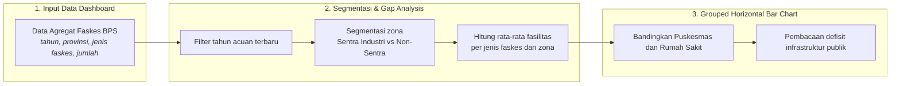
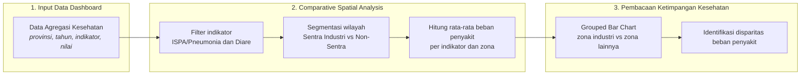
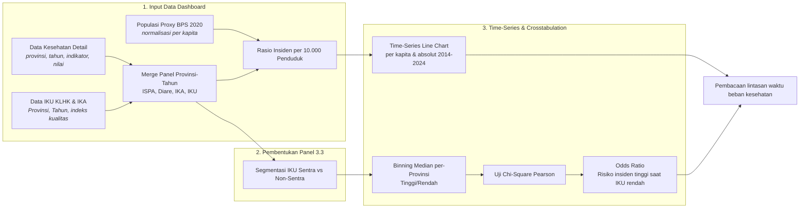
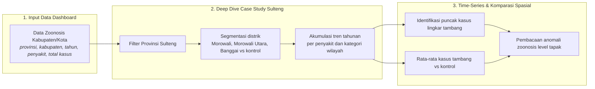

# BAB III: METODOLOGI ANALISIS BEBAN KESEHATAN MASYARAKAT TERDAMPAK

Dokumen laporan metodologi ini menyajikan kerangka ilmiah, prosedur pengolahan data, dan pembacaan empiris yang dioperasionalkan pada **Bab 3: Beban Kesehatan Masyarakat Terdampak**.

## 3.1 Kesenjangan Fasilitas Kesehatan di Kawasan Ekstraktif

> **Sumber Data Resmi & Deskripsi Visualisasi:** Data Agregat Faskes: `data/processed/sulawesi_faskes_agregat_v3.csv`. Visualisasi dashboard menggunakan *Grouped Horizontal Bar Chart* pada tahun acuan 2024.

#### A. Pengantar & Kerangka Narasi
Data empiris menggambarkan kesenjangan antara klaim pertumbuhan ekonomi dari ekspansi industri nikel dan kondisi kesehatan masyarakat di kawasan penyangga. Ekspansi kapasitas industri yang ditopang PLTU *captive* berkapasitas **9,825 Megawatt** berjalan sejajar dengan peningkatan kasus penyakit.

Sepanjang 2014-2024, data agregat dinas kesehatan mencatat total kasus ISPA/Pneumonia sebanyak **233,687**, kasus Diare sebanyak **2,286,607**, dan kasus Malaria sebanyak **50,877**. Pada 2024, tercatat **1,393** Puskesmas dan **300** Rumah Sakit.

#### B. Alur Logika Metodologis Grouped Horizontal Bar Chart


##### Tabel 3.1a: Konfigurasi Variabel Analisis Gap Fasilitas Kesehatan (Sub-bab 3.1)
| Komponen Analisis | Definisi Variabel (Sub-bab 3.1) |
| :--- | :--- |
| Jumlah & Jenis Faskes (Dependen) | Unit Rumah Sakit dan Puskesmas terdaftar (BPS). |
| Kategori Zona (Independen) | Lokasi wilayah: Sentra Industri (Sulteng & Sultra) vs Non-Sentra Industri (Lainnya). |
| Metode Analisis | Grouped Horizontal Bar Chart pada satu periode cross-sectional untuk mengukur ketimpangan infrastruktur kesehatan primer dan sekunder. |
| Tahun Acuan | 2024, mengikuti data terbaru pada file faskes. |
| Dataset & File | data/processed/sulawesi_faskes_agregat_v3.csv |

#### C. Formulasi Matematis: Rata-rata Faskes dan Disparitas Zona
```text
F̄_{z,j} = [ Σ_{p∈z} F_{p,j} ] / n_z
D_j = F̄_{Sentra,j} / F̄_{Non-Sentra,j}
```

#### D. Matriks Hasil Uji Empiris
##### Tabel 3.1: Rata-rata Fasilitas Kesehatan per Provinsi menurut Zona Industri (2024)
| Kategori Zona | Jenis Faskes | Rata-rata Jumlah Fasilitas |
| :--- | :--- | :--- |
| Non-Sentra Industri (Lainnya) | Puskesmas | 216.5 |
| Sentra Industri (Sulteng & Sultra) | Puskesmas | 263.5 |
| Non-Sentra Industri (Lainnya) | Rumah Sakit | 55.0 |
| Sentra Industri (Sulteng & Sultra) | Rumah Sakit | 40.0 |

##### Tabel 3.2: Rincian Fasilitas Kesehatan per Provinsi (2024)
| Provinsi | Kategori Zona | Jenis Faskes | Jumlah |
| :--- | :--- | :--- | :--- |
| Gorontalo | Non-Sentra Industri | Puskesmas | 95 |
| Gorontalo | Non-Sentra Industri | Rumah Sakit | 20 |
| Sulawesi Barat | Non-Sentra Industri | Puskesmas | 98 |
| Sulawesi Barat | Non-Sentra Industri | Rumah Sakit | 16 |
| Sulawesi Selatan | Non-Sentra Industri | Puskesmas | 474 |
| Sulawesi Selatan | Non-Sentra Industri | Rumah Sakit | 126 |
| Sulawesi Tengah | Sentra Industri | Puskesmas | 219 |
| Sulawesi Tengah | Sentra Industri | Rumah Sakit | 40 |
| Sulawesi Tenggara | Sentra Industri | Puskesmas | 308 |
| Sulawesi Tenggara | Sentra Industri | Rumah Sakit | 40 |
| Sulawesi Utara | Non-Sentra Industri | Puskesmas | 199 |
| Sulawesi Utara | Non-Sentra Industri | Rumah Sakit | 58 |

#### E. Analisis Temuan Empiris: Defisit Infrastruktur Kesehatan Publik
Rata-rata Rumah Sakit di Sentra Industri tercatat **40 unit** per provinsi, lebih rendah dari wilayah Non-Sentra yang mencapai **55 unit**. Rata-rata Puskesmas di Sentra Industri tercatat **264 unit** per provinsi dibandingkan **216 unit** di Non-Sentra.

## 3.2 Ketimpangan Beban Penyakit: Sentra Industri vs Non-Sentra

> **Sumber Data Resmi & Deskripsi Visualisasi:** Data Agregasi Kesehatan: `data/processed/sulawesi_kesehatan_detail_2014_2024.csv`. Visualisasi dashboard menggunakan *Comparative Spatial Analysis* untuk membandingkan rata-rata beban penyakit antara provinsi sentra ekstraktif dan non-sentra.

#### A. Pengantar & Kerangka Narasi
Melalui analisis komparatif spasial, terlihat bahwa beban ekologis tidak terdistribusi secara merata di seluruh wilayah. Provinsi sentra ekspansi nikel, yaitu Sulawesi Tengah dan Sulawesi Tenggara, menunjukkan indikator penyakit yang secara konsisten lebih tinggi.

Data menunjukkan bahwa rata-rata penderita **ISPA/Pneumonia** di Sentra Industri tercatat **5,353 kasus per tahun**, dibandingkan provinsi Non-Sentra di angka **2,634 kasus**. Selisih sebesar **2.0 kali lipat** ini mengindikasikan beban pernapasan yang lebih berat di kawasan penyangga *smelter*.

#### B. Alur Logika Metodologis Comparative Spatial Analysis


##### Tabel 3.2a: Konfigurasi Variabel Comparative Spatial Analysis (Sub-bab 3.2)
| Komponen Analisis | Definisi Variabel (Sub-bab 3.2) |
| :--- | :--- |
| Kategori Zona (Independen) | Labeling spasial: Sentra Industri (Sulteng & Sultra) vs Non-Sentra Industri (Sulsel, Sulut, Gorontalo, Sulbar). |
| Kasus ISPA/Pneumonia & Diare (Dependen) | Total prevalensi historis penyakit per tahun dari fasilitas kesehatan primer. |
| Metode Analisis | Comparative Spatial Analysis untuk membandingkan rata-rata beban penyakit antara provinsi sentra ekstraktif dan non-sentra. |
| Periode Observasi | 2014-2024, mengikuti data kesehatan agregat yang tersedia. |
| Dataset & File | data/processed/sulawesi_kesehatan_detail_2014_2024.csv |

#### C. Formulasi Matematis: Rata-rata Beban Penyakit dan Disparitas Zona
```text
B̄_{z,k} = [ Σ_{p∈z} Σ_t C_{p,t,k} ] / N_z
Q_k = B̄_{Sentra,k} / B̄_{Non-Sentra,k}
```

Substitusi angka dari dataset aktual ke dalam rumus rata-rata beban penyakit adalah sebagai berikut:

```text
B̄_Sentra,ISPA = 117,775 / 22 = 5,353.4 kasus
B̄_Non-Sentra,ISPA = 115,912 / 44 = 2,634.4 kasus
Q_ISPA = 5,353.4 / 2,634.4 = 2.0x
B̄_Sentra,Diare = 814,407 / 20 = 40,720.3 kasus
B̄_Non-Sentra,Diare = 1,472,200 / 40 = 36,805.0 kasus
Q_Diare = 40,720.3 / 36,805.0 = 1.1x
```

#### D. Matriks Hasil Uji Empiris
##### Tabel 3.3: Rata-rata Beban Penyakit per Tahun menurut Zona Industri (2014-2024)
| Indikator Penyakit | Kategori Zona | Rata-rata Kasus per Tahun |
| :--- | :--- | :--- |
| Kasus Diare Dilayani | Non-Sentra Industri (Sulsel, Sulut, Gorontalo, Sulbar) | 36,805 |
| Kasus Diare Dilayani | Sentra Industri (Sulteng & Sultra) | 40,720 |
| Kasus ISPA/Pneumonia | Non-Sentra Industri (Sulsel, Sulut, Gorontalo, Sulbar) | 2,634 |
| Kasus ISPA/Pneumonia | Sentra Industri (Sulteng & Sultra) | 5,353 |

##### Tabel 3.4: Ringkasan Disparitas Beban Penyakit Sentra vs Non-Sentra
| Indikator Penyakit | Rata-rata Sentra | Rata-rata Non-Sentra | Rasio Disparitas |
| :--- | :--- | :--- | :--- |
| Kasus ISPA/Pneumonia | 5,353 | 2,634 | 2.0x |
| Kasus Diare Dilayani | 40,720 | 36,805 | 1.1x |

#### E. Analisis Temuan Empiris: Ketimpangan Beban Penyakit Struktural
Rata-rata penderita ISPA/Pneumonia di Sentra Industri tercatat **5,353 kasus per tahun**, dibandingkan provinsi Non-Sentra di angka **2,634 kasus**. Selisih sebesar **2.0 kali lipat** mendukung pembacaan bahwa wilayah dengan konsentrasi industri tinggi cenderung menanggung beban kesehatan yang lebih besar akibat tekanan terhadap daya tampung lingkungan.

## 3.3 Lintasan Waktu Ekologis & Dinamika Penyakit di Kawasan Industri Ekstraktif

> **Sumber Data Resmi & Deskripsi Visualisasi:** Data Lingkungan & Penyakit: `data/processed/sulawesi_kesehatan_detail_2014_2024.csv`, `data/processed/sulawesi_ika_2016_2024.csv`, `data/processed/sulawesi_iku_2015_2024.csv`. Visualisasi dashboard menampilkan *Time-Series Line Chart* (insiden per 10.000 penduduk dan total kasus absolut) serta pengujian Chi-Square tabulasi silang (Crosstabulation) dengan binning median per-provinsi.

#### A. Pengantar & Kerangka Narasi
Meskipun secara akumulatif kawasan Sentra Industri menanggung beban yang lebih berat, penelusuran data secara *time-series* (historis) dari 2014 hingga 2024 memberikan wawasan tambahan mengenai fluktuasi kasus penyakit dari tahun ke tahun. Hipotesis utama: **penurunan kualitas udara ambien (IKU) berbanding lurus dengan peningkatan insidensi penyakit pernapasan dan lingkungan**. Untuk mengujinya di tengah keterbatasan jumlah provinsi (N=6), uji Chi-Square menggunakan unit observasi **Provinsi-Tahun** (6 provinsi × 11 tahun panel) dengan klasifikasi berdasarkan median per-provinsi.

#### B. Alur Logika Metodologis Time-Series Line Chart & Crosstabulation
Kerangka penelusuran runtut waktu insiden penyakit beserta tahapan uji silang statistiknya diilustrasikan pada **Bagan Alur 3.3** berikut, dengan konfigurasi variabel pengujian dirinci pada Tabel 3.3a di bawah gambar.

##### Bagan Alur 3.3: Alur Logika Metodologis Time-Series Line Chart & Crosstabulation Beban Kesehatan


##### Tabel 3.3a: Konfigurasi Variabel Uji Chi-Square (Sub-bab 3.3)
| Komponen Uji | Definisi Variabel (Sub-bab 3.3) |
| :--- | :--- |
| Variabel Independen (X) | IKU Wilayah Sentra Tambang / IKU Wilayah Non-Sentra (indeks tekanan kualitas lingkungan). |
| Variabel Dependen (Y) | Total Kasus ISPA/Pneumonia (insidensi penyakit pernapasan dan lingkungan). |
| Hipotesis Nol (H0) | Penurunan kualitas lingkungan (IKU/IKA) tidak berkorelasi dengan peningkatan insidensi penyakit pernapasan dan pencernaan. |
| Hipotesis Alternatif (H1) | Penurunan kualitas udara ambien (IKU) berbanding lurus dengan peningkatan insidensi penyakit pernapasan dan lingkungan (ISPA dan Diare). |
| Decision Rule (Alpha 5%) | Chi-Square P-Value < 0.05 (Tolak H0) dan kalkulasi Odds Ratio. |
| Threshold Kategori | Median per-provinsi data panel Provinsi-Tahun (N=18 observasi valid skenario Sentra); binning 'Tinggi'/'Rendah' per provinsi untuk menghilangkan bias besaran absolut antar wilayah. |
| Orientasi Odds Ratio | Untuk variabel X berjenis indeks kualitas (IKU/IKA), risiko dihitung saat indeks Rendah: OR = ( b × c ) / ( a × d ). |

#### C. Formulasi Matematis: Normalisasi Per Kapita, Binning Median Provinsi, dan Uji Crosstabulation
Kuantifikasi rasio keparahan per kapita dan pembuktian statistik dihitung menggunakan sistem formulasi matematis berikut:

```text
Insiden_10K_p,t = ( Kasus_p,t / Populasi_p ) × 10.000
Median_Prov_p = Median ( Nilai_p,t )   ;   untuk seluruh tahun t pada provinsi p
Kategori(x_p,t) = 'Tinggi' , jika x_p,t ≥ Median_Prov_p   |   'Rendah' , jika x_p,t < Median_Prov_p
χ² = Σ [ ( O_ij - E_ij )² / E_ij ]   ;   dengan E_ij = ( Total_Baris_i × Total_Kolom_j ) / N
Odds_Ratio (OR) = ( b × c ) / ( a × d )   ;   untuk X berjenis indeks kualitas (IKU/IKA)
```

#### D. Matriks Hasil Uji Empiris
##### Tabel 3.5: Rata-rata Insiden ISPA/Pneumonia Absolut dan per 10.000 Penduduk per Provinsi (2014-2024)
| Provinsi | Kategori Zona | Populasi Proxy (BPS 2020) | Rata-rata Kasus per Tahun | Rata-rata Insiden per 10.000 Penduduk |
| :--- | :--- | :--- | :--- | :--- |
| Sulawesi Tengah | Sentra Industri | 2,985,000 | 8,120 | 27 |
| Gorontalo | Non-Sentra Industri | 1,171,000 | 2,779 | 24 |
| Sulawesi Tenggara | Sentra Industri | 2,624,000 | 2,587 | 10 |
| Sulawesi Barat | Non-Sentra Industri | 1,419,000 | 1,182 | 8 |
| Sulawesi Selatan | Non-Sentra Industri | 9,070,000 | 5,197 | 6 |
| Sulawesi Utara | Non-Sentra Industri | 2,621,000 | 1,379 | 5 |

##### Tabel 3.6: Ringkasan Eksekutif Seluruh Skenario Crosstab IKU vs Insidensi Penyakit Bab 3
| Variabel Independen (X) | Variabel Dependen (Y) | Chi-Square (χ²) | P-Value | Odds Ratio | Kesimpulan |
| :--- | :--- | :--- | :--- | :--- | :--- |
| IKU Wilayah Sentra Tambang | Total Kasus ISPA/Pneumonia | 3.556 | p = 0.059 | 12.25 | TIDAK SIGNIFIKAN |
| IKU Wilayah Non-Sentra | Total Kasus ISPA/Pneumonia | 1.044 | p = 0.307 | 2.52 | TIDAK SIGNIFIKAN |

#### E. Analisis Temuan Empiris: Pembedahan Realitas Ekologis
Dari 2 skenario pengujian, seluruhnya menunjukkan status TIDAK SIGNIFIKAN. Dalam perspektif analisis ekologis, ketidaksignifikanan secara agregat ini mengindikasikan bahwa penurunan kualitas lingkungan dan peningkatan beban penyakit telah terjadi secara merata dan persisten di seluruh wilayah. Penambahan aktivitas industri di satu titik berkorelasi dengan tekanan lingkungan yang sudah merata secara sistemik.

## 3.4 Anomali Zoonosis: Dampak Kritis Ekspansi Industri di Level Tapak (Studi Kasus Sulteng)

> **Sumber Data Resmi & Deskripsi Visualisasi:** Data Zoonosis: `data/processed/zoonosis_kab_kota_2015_2024.csv`. Visualisasi dashboard menggunakan *Time-Series* dan Komparasi Spasial Wilayah untuk membandingkan kabupaten lingkar tambang/smelter aktif dengan daerah non-tambang/agraris sebagai kontrol.

#### A. Pengantar & Kerangka Narasi
Data empiris Dinas Kesehatan mencatat total akumulasi **3,111 kasus** penyakit zoonosis di wilayah Lingkar Tambang/Smelter Aktif Sulawesi Tengah (Morowali, Morowali Utara, Banggai) sepanjang rentang waktu pengamatan 2019-2024. Peningkatan angka zoonosis ini dibaca bersama perubahan ekologis akibat ekspansi penggunaan lahan, konversi tutupan hutan, pergeseran habitat alami satwa liar, genangan air galian tambang yang tidak direklamasi, serta kondisi sanitasi di area industri.

#### B. Alur Logika Metodologis Time-Series & Komparasi Spasial Wilayah
Kerangka studi kasus mendalam berbasis deret waktu di tingkat kabupaten/kota khusus Sulawesi Tengah diilustrasikan pada **Bagan Alur 3.4** berikut. Sub-bab ini tidak menggunakan uji inferensial Chi-Square, melainkan isolasi episentrum ekstraktif dan komparasi absolut dengan wilayah kontrol.

##### Bagan Alur 3.4: Alur Logika Metodologis Anomali Zoonosis Level Tapak


##### Tabel 3.4a: Konfigurasi Variabel Analisis Zoonosis (Sub-bab 3.4)
| Komponen Analisis | Definisi Variabel (Sub-bab 3.4) |
| :--- | :--- |
| Kategori Wilayah Distrik | Label dikotomi daerah ring 1 tambang/smelter aktif vs daerah penyangga luar ring. |
| Total Kasus Penyakit | Angka infeksi yang ditransmisikan vektor, seperti Malaria, DBD, Rabies, dan Gigitan Hewan. |
| Model Analisis | Deep Dive Case Study berbasis deret waktu tingkat kabupaten/kota khusus Sulawesi Tengah. |
| Episentrum Ekstraktif | Morowali, Morowali Utara, dan Banggai. |
| Dataset & File | data/processed/zoonosis_kab_kota_2015_2024.csv |

#### C. Formulasi Matematis: Tren Zoonosis Distrik dan Komparasi Wilayah
```text
Z_{w,t,d} = Σ C_{r,t,d}, untuk setiap distrik r yang termasuk wilayah w
Z̄_w = [ Σ_t Z_{w,t,d} ] / N_w
R_d = Z̄_Tambang / Z̄_Kontrol
```

#### D. Matriks Hasil Uji Empiris
##### Tabel 3.7: Insidensi Tertinggi Zoonosis di Lingkar Tambang/Smelter Aktif Sulawesi Tengah
| Jenis Penyakit | Kabupaten | Tahun | Puncak Kasus |
| :--- | :--- | :--- | :--- |
| DBD | Morowali Utara | 2024 | 431 |
| FILARIASIS | Banggai | 2019 | 16 |
| MALARIA | Morowali Utara | 2024 | 355 |
| RABIES | Banggai | 2019 | 2 |

##### Tabel 3.8: Tren Tahunan DBD menurut Kategori Wilayah
| Tahun | Kategori Wilayah | Total Kasus |
| :--- | :--- | :--- |
| 2019 | Lingkar Tambang/Smelter Aktif | 416 |
| 2019 | Non-Tambang/Agraris (Kontrol) | 717 |
| 2020 | Lingkar Tambang/Smelter Aktif | 86 |
| 2020 | Non-Tambang/Agraris (Kontrol) | 709 |
| 2021 | Lingkar Tambang/Smelter Aktif | 97 |
| 2021 | Non-Tambang/Agraris (Kontrol) | 266 |
| 2022 | Lingkar Tambang/Smelter Aktif | 279 |
| 2022 | Non-Tambang/Agraris (Kontrol) | 876 |
| 2023 | Lingkar Tambang/Smelter Aktif | 325 |
| 2023 | Non-Tambang/Agraris (Kontrol) | 734 |
| 2024 | Lingkar Tambang/Smelter Aktif | 876 |
| 2024 | Non-Tambang/Agraris (Kontrol) | 944 |

##### Tabel 3.9: Rata-rata Kasus DBD Tambang vs Kontrol
| Jenis Penyakit | Kategori Wilayah | Rata-rata Kasus |
| :--- | :--- | :--- |
| DBD | Lingkar Tambang/Smelter Aktif | 115.5 |
| DBD | Non-Tambang/Agraris (Kontrol) | 88.5 |

#### E. Analisis Temuan Empiris: Anomali Zoonosis Level Tapak
Pada penyakit terpilih (DBD), rata-rata kasus di wilayah Lingkar Tambang/Smelter Aktif mencapai **115.5** kasus per observasi, dibandingkan **88.5** kasus pada wilayah Non-Tambang/Agraris (Kontrol), dengan rasio komparatif **1.3x**. Pola ini memberikan sinyal bahwa perubahan ekologis di sekitar kawasan industri perlu dibaca sampai level tapak, karena data agregat provinsi dapat mengaburkan lonjakan penyakit pada kabupaten episentrum ekstraktif.
