# METODOLOGI PENELITIAN: BAB 3 — ANALISIS BEBAN KESEHATAN MASYARAKAT TERDAMPAK
*CELIOS (Center of Economic and Law Studies) · Audit Spasial-Statistik D3TLH Sulawesi (2014–2024) · Ringkasan Eksekutif Metodologis*

---

## A. Desain Penelitian & Tujuan
Penelitian ini menggunakan **desain epidemiologi lingkungan dan audit spasial-statistik kuantitatif terintegrasi** untuk mengukur beban morbiditas kesehatan masyarakat, defisit fasilitas layanan kesehatan, serta paparan eksternalitas limbah beracun di enam provinsi Pulau Sulawesi sepanjang satu dekade (**2014–2024**). Tiga tujuan utama metodologis Bab 3 meliputi:

1. **Membuktikan Disparitas Fasilitas & Morbiditas Kesehatan:** Mengevaluasi kesenjangan rasio ketersediaan faskes (Puskesmas vs Rumah Sakit) dan membandingkan rata-rata beban penyakit pernapasan (ISPA) serta pencernaan (Diare) antara provinsi Sentra Industri nikel vs Non-Sentra.
2. **Analisis Inferensial Panel & Dinamika Zoonosis Tapak:** Menguji signifikansi korelasi antara penurunan indeks kualitas lingkungan (IKU & IKA) terhadap lonjakan kasus penyakit melalui uji Chi-Square dan Odds Ratio, serta mengisolasi anomali vektor zoonosis di kabupaten lingkar tambang.
3. **Validasi Toksisitas Dua Lensa & Neraca Limbah B3:** Memadukan analisis makro provinsi dengan pembuktian klinis mikroskopis logam berat karsinogenik Kromium Heksavalen (Cr6+) di muara tambang, serta mengagregasi timbulan 32,8 juta ton limbah B3 slag dan tailing HPAL.

---

## B. Sumber Data & Cakupan Wilayah
Penelitian mencakup analisis lintas provinsi pada **6 provinsi Pulau Sulawesi** (Sulawesi Tengah, Sulawesi Tenggara, Sulawesi Selatan, Sulawesi Barat, Gorontalo, Sulawesi Utara) serta **deep-dive case study tingkat kabupaten/distrik lingkar industri** (Morowali, Morowali Utara, Banggai, Konawe, Bantaeng). Data dihimpun dari sumber data primer resmi kementerian, dinas kesehatan daerah, registri BPS, dan audit laboratorium independen:

- **Badan Pusat Statistik (BPS) & Kementerian Kesehatan RI:** Registri unit fasilitas kesehatan (Puskesmas dan Rumah Sakit) serta sensus populasi denominator per kapita.
- **Dinas Kesehatan Provinsi Se-Sulawesi (Profil Kesehatan 2014–2024):** Data time-series insidensi penyakit ISPA/Pneumonia, Diare terlayani, Malaria, DBD, Filariasis, dan Rabies.
- **Kementerian Lingkungan Hidup dan Kehutanan (Ditjen PPKL):** Indeks Kualitas Udara (IKU) dan Indeks Kualitas Air (IKA) time-series panel provinsi-tahun (2015–2024).
- **Audit Fisik Laboratorium Independen (AEER & WALHI):** Uji konsentrasi Kromium Heksavalen (Cr6+ dalam satuan mg/L) pada 12 titik sampling sungai dan pesisir lingkar smelter.
- **Registri Audit Limbah B3 (KLHK, AEER, WALHI, JATAM):** Neraca timbulan terak slag nikel, tailing HPAL (asam sulfat), air limbah tambang, dan limbah EAF per fasilitas mayor industri.

---

## C. Operasionalisasi Variabel & Indikator Riset
Seluruh variabel kesehatan masyarakat, kualitas sanitasi, toksisitas klinis, dan limbah industri dioperasionalkan ke dalam **10 indikator empiris terpadu** sebagaimana dirangkum pada matriks operasional berikut:

##### Matriks Operasionalisasi Variabel dan Sumber Data Resmi Bab 3
| No | Indikator Riset | Fokus Pengukuran | Satuan | Periode | Sumber Data Primer Resmi |
| :-: | :--- | :--- | :-: | :-: | :--- |
| 1 | Ketersediaan Fasilitas Kesehatan | Rasio Rumah Sakit & Puskesmas per Zona | Unit Faskes | 2024 | BPS & Kemenkes RI |
| 2 | Beban Penyakit ISPA / Pneumonia | Morbiditas Saluran Pernapasan Akut | Kasus Absolut | 2014–2024 | Dinas Kesehatan Provinsi |
| 3 | Beban Kasus Diare Terlayani | Morbiditas Saluran Pencernaan & Sanitasi | Kasus Absolut | 2014–2024 | Dinas Kesehatan Provinsi |
| 4 | Tingkat Insidensi per Kapita | Normalisasi Beban Penyakit terhadap Populasi | Kasus / 10.000 Jiwa | 2014–2024 | Dinkes & Populasi BPS |
| 5 | Indeks Kualitas Udara (IKU) | Kondisi Baku Mutu Udara Ambien Agregat | Poin Skor (0–100) | 2015–2024 | Ditjen PPKL KLHK |
| 6 | Indeks Kualitas Air (IKA) | Kondisi Baku Mutu Air Sungai & DAS Agregat | Poin Skor (0–100) | 2016–2024 | Ditjen PPKL KLHK |
| 7 | Prevalensi Vektor Zoonosis | Insidensi DBD, Malaria, & Filariasis Tapak | Kasus / Distrik | 2015–2024 | Dinkes Sulteng (Tapak) |
| 8 | Kadar Kromium Heksavalen (Cr6+) | Toksisitas Logam Berat Karsinogenik Tapak | mg / Liter | 2022–2024 | Uji Lab AEER & WALHI |
| 9 | Timbulan Limbah B3 Industri | Volume Residu Slag & Tailing HPAL | Juta Ton / Tahun | 2024–2025 | KLHK, AEER, WALHI, JATAM |
| 10 | Dinamika Spasial Before-After | Pergeseran Spasial Morbiditas Ekologis | Rasio Pertumbuhan (%) | 2015 vs 2024 | GeoJSON & Profil Dinkes |

---

## D. Kerangka Analisis & Formulasi Matematis

### 3.1 Kesenjangan Fasilitas Kesehatan di Kawasan Ekstraktif
Kesenjangan fasilitas pelayanan kesehatan dianalisis melalui segmentasi cross-sectional per jenis fasilitas (Puskesmas vs Rumah Sakit) antara zona sentra industri ekstraktif dan zona non-sentra:

> `Rata-rata Faskes (F̄_z,j) = [ Σ F_p,j ] / n_z   ;   Rasio Disparitas (D_j) = F̄_Sentra,j / F̄_Non-Sentra,j`  
> *Keterangan: F_p,j = Jumlah faskes tipe j (Puskesmas/RS) di provinsi p; n_z = Jumlah provinsi di zona z; D_j = Rasio disparitas fasilitas kesehatan tipe j antara sentra industri dan non-sentra.*

### 3.2 Ketimpangan Beban Penyakit: Sentra Industri vs Non-Sentra
Komparasi beban morbiditas penyakit pernapasan dan pencernaan dihitung guna mengukur disparitas kelipatan risiko kesehatan pada provinsi lingkar hilirisasi:

> `Beban Rata-rata (B̄_z) = [ Σ B_p,t ] / N_z   ;   Kelipatan Disparitas (Q) = B̄_Sentra / B̄_Non-Sentra`  
> *Keterangan: B_p,t = Total kasus penyakit (ISPA/Diare) di provinsi p tahun t; N_z = Jumlah observasi data panel zona z; Q = Rasio kelipatan disparitas beban morbiditas sentra industri vs non-sentra.*

### 3.3 Lintasan Waktu Ekologis & Dinamika Penyakit di Kawasan Industri Ekstraktif
Normalisasi beban penyakit per 10.000 penduduk dan protokol pengujian independensi Chi-Square (χ²) tabulasi silang diterapkan pada matriks panel provinsi-tahun berbasis ambang batas median spesifik provinsi:

> `Insiden_10K = ( Kasus_p,t / Populasi_p ) × 10.000   ;   χ² = Σ [ ( O_ij - E_ij )² / E_ij ]`  
> *Keterangan: Insiden_10K = Tingkat insidensi per 10.000 jiwa; Kasus_p,t = Jumlah kasus absolut di provinsi p tahun t; Populasi_p = Jumlah penduduk provinsi p; χ² = Statistik Chi-Square (O_ij = frekuensi observasi, E_ij = frekuensi harapan).*

##### Tabel 3.3a: Konfigurasi Variabel Uji Chi-Square (Sub-bab 3.3)
| Komponen Uji | Definisi Variabel (Sub-bab 3.3) |
| :--- | :--- |
| **Variabel Independen (X)** | IKU Wilayah Sentra Tambang / IKU Wilayah Non-Sentra (indeks tekanan kualitas lingkungan). |
| **Variabel Dependen (Y)** | Total Kasus ISPA/Pneumonia (insidensi penyakit pernapasan dan lingkungan). |
| **Hipotesis Nol (H0)** | Penurunan kualitas lingkungan (IKU/IKA) tidak berkorelasi dengan peningkatan insidensi penyakit pernapasan dan pencernaan. |
| **Hipotesis Alternatif (H1)** | Penurunan kualitas udara ambien (IKU) berbanding lurus dengan peningkatan insidensi penyakit pernapasan dan lingkungan (ISPA dan Diare). |
| **Decision Rule (Alpha 5%)** | Chi-Square P-Value < 0.05 (Tolak H0) dan kalkulasi Odds Ratio. |
| **Threshold Kategori** | Median per-provinsi data panel Provinsi-Tahun (N=18 observasi valid skenario Sentra); binning 'Tinggi'/'Rendah' per provinsi untuk menghilangkan bias besaran absolut antar wilayah. |
| **Orientasi Odds Ratio** | Untuk variabel X berjenis indeks kualitas (IKU/IKA), risiko dihitung saat indeks Rendah: OR = ( b × c ) / ( a × d ). |

### 3.4 Anomali Zoonosis: Dampak Kritis Ekspansi Industri di Level Tapak (Studi Kasus Sulteng)
Isolasi data tapak tingkat distrik/kabupaten sentra tambang aktif (Morowali, Morowali Utara, Banggai) mengukur lonjakan vektor zoonosis akibat genangan lubang tambang dan sanitasi industri dibandingkan kabupaten kontrol:

> `Akumulasi Zoonosis (Z_w,t,d) = Σ C_r,t,d   ;   Rasio Zoonosis Tapak (R_d) = Z̄_Tambang / Z̄_Kontrol`  
> *Keterangan: C_r,t,d = Kasus zoonosis d di distrik r tahun t; Z_w,t,d = Akumulasi kasus per wilayah w; R_d = Rasio komparasi beban zoonosis distrik lingkar tambang terhadap wilayah kontrol agraris.*

### 3.5 Pemetaan Geospasial: Distribusi Spasial Beban Penyakit
Pemodelan Before-After Analysis memproyeksikan pergeseran spasial intensitas morbiditas antara tahun acuan awal ekstraksi (2015) dan kondisi terkini (2024):

> `Radius Bubble Diare (r_p,t) = √D_p,t / K   ;   Laju Pertumbuhan (G_p %) = [ ( X_2024 - X_2015 ) / X_2015 ] × 100`  
> *Keterangan: r_p,t = Radius visual simbol bubble peta provinsi p tahun t; D_p,t = Kasus diare absolut; K = Konstanta skala visual kartografi; G_p = Laju pertumbuhan morbiditas 2015 vs 2024.*

### 3.6 Krisis Air Bersih: Tinjauan Makro Provinsi dan Bukti Uji Klinis Lingkar Tambang
Pendekatan komplementer dua lensa memadukan benchmark rasio toksisitas laboratorium Kromium Heksavalen (Cr6+) pada muara sungai tambang dengan uji Chi-Square data panel makro IKA vs Diare:

> `Rasio Pelanggaran Toksisitas = Konsentrasi Cr6+ / Baku Mutu Biota Laut (0.005 mg/L)`  
> *Keterangan: Konsentrasi Cr6+ = Kadar Kromium Heksavalen terukur sampel lab (mg/L); Baku Mutu Biota = Ambang aman air laut biota perairan (0.005 mg/L); Rasio = Kelipatan keterlampauan batas aman.*

##### Tabel 3.6a: Konfigurasi Variabel Uji Chi-Square (Sub-bab 3.6)
| Komponen Uji | Definisi Variabel (Sub-bab 3.6) |
| :--- | :--- |
| **Variabel Independen (X)** | IKA Wilayah Sentra Tambang / IKA Wilayah Non-Sentra (Indeks Kualitas Air BPS/KLHK). |
| **Variabel Dependen (Y)** | Total Kasus Diare (kasus infeksi saluran pencernaan yang dilayani, Kemenkes). |
| **Hipotesis Nol (H0)** | Rendahnya Indeks Kualitas Air (IKA) tidak berhubungan dengan tingginya kasus Diare. |
| **Hipotesis Alternatif (H1)** | Provinsi dengan IKA rendah berasosiasi signifikan dengan peningkatan kasus Diare. |
| **Decision Rule (Alpha 5%)** | Jika P-Value < 0.05, maka Tolak H0 (terbukti signifikan bahwa pencemaran air meningkatkan kasus Diare). |
| **Threshold Kategori** | Median per-provinsi data panel Provinsi-Tahun (N=16 observasi valid skenario Sentra dari 6 provinsi × 8 tahun); binning 'Tinggi'/'Rendah' per provinsi. |
| **Orientasi Odds Ratio** | Karena IKA indikator positif (semakin tinggi semakin baik), risiko dihitung saat IKA Rendah: OR = ( b × c ) / ( a × d ). |

### 3.7 Beban Limbah Beracun (B3): Eksternalitas Kesehatan yang Diabaikan
Kuantifikasi neraca timbulan limbah bahan berbahaya dan beracun (B3) mengagregasi volume pelepasan residu padat dan cair per provinsi serta menghitung proporsi jenis limbah spesifik:

> `Total Timbulan B3_p = Σ [ Timbulan Fasilitas Mayor_i ]   ;   Proporsi Jenis B3 (%) = [ Total B3_j / Total B3 ] × 100`  
> *Keterangan: Total Timbulan B3_p = Akumulasi limbah B3 provinsi p (Ton/Tahun); Total B3_j = Tonase timbulan jenis limbah spesifik j (Slag, Tailing HPAL, Air Asam Tambang); Proporsi = Pangsa persentase jenis residu terhadap total timbulan B3.*

---

## E. Korespondensi Metodologi terhadap Sub-bab Laporan Bab 3
Setiap sub-bab analitis pada Bab 3 ditopang oleh metode kuantitatif yang terukur dan menghasilkan sintesis bukti empiris terstandarisasi sebagaimana dirangkum pada matriks berikut:

##### Matriks Korespondensi Sub-bab terhadap Metode Analitis
| Sub-bab | Fokus Kajian Empiris | Metode Analitis Utama |
| :---: | :--- | :--- |
| **Sub-bab 3.1** | Kesenjangan Fasilitas Kesehatan | Grouped Horizontal Bar Chart, Rasio Disparitas Faskes per Zona Industri |
| **Sub-bab 3.2** | Ketimpangan Beban Morbiditas | Comparative Spatial Analysis Sentra vs Non-Sentra, Kelipatan Disparitas Morbiditas |
| **Sub-bab 3.3** | Lintasan Waktu Insidensi & IKU | Time-Series Line Chart per 10.000 Jiwa, Uji Chi-Square (χ²), Odds Ratio (OR) |
| **Sub-bab 3.4** | Anomali Vektor Zoonosis Tapak | Deep-Dive Case Study Distrik Tambang Sulteng, Analisis Komparasi Wilayah Kontrol |
| **Sub-bab 3.5** | Pemetaan Spasial Beban Penyakit | Choropleth Poligon ISPA & Radius Bubble Diare, Before-After Analysis (2015 vs 2024) |
| **Sub-bab 3.6** | Krisis Air Bersih & Toksisitas Cr6+ | Pendekatan Dua Lensa (Mikro Lab vs Makro Panel), Regresi OLS, Uji Chi-Square (χ²) |
| **Sub-bab 3.7** | Eksternalitas Limbah Beracun B3 | Agregasi Timbulan Regional, Profiling Fasilitas Mayor, Analisis Komposisi Residu |

---

## F. Bagan Alur Kerangka Kerja Riset (Research Workflow)

```mermaid
flowchart LR
    subgraph F1["Fase I: Akuisisi Data"]
        A1["Kurasi Data Resmi Terbuka<br/><i>BPS, Kemenkes, KLHK, Lab AEER & WALHI</i>"]
        A2["Panel Provinsi-Tahun<br/><i>6 Provinsi Se-Sulawesi (2014–2024)</i>"]
    end
    subgraph F2["Fase II: Segmentasi & Normalisasi"]
        B1["Segmentasi Spasial Ekstraktif<br/><i>Sentra Tambang vs Non-Sentra Kontrol</i>"]
        B2["Standarisasi per Kapita<br/><i>Rasio Insiden per 10.000 Penduduk</i>"]
    end
    subgraph F3["Fase III: Uji Inferensial & Klinis"]
        C1["Tabel Kontinjensi 2x2<br/><i>Ambang Median IKU/IKA vs Morbiditas</i>"]
        C2["Uji Chi-Square & Toksisitas<br/><i>Benchmark Cr6+ & Odds Ratio Risiko</i>"]
    end
    subgraph F4["Fase IV: Pemodelan & Sintesis"]
        D1["Pemetaan Spasial Dual-Lensa<br/><i>Choropleth ISPA & Bubble Diare</i>"]
        D2["Bukti Kausalitas D3TLH<br/><i>Defisit Faskes & Ancaman Limbah B3</i>"]
    end
    F1 --> F2 --> F3 --> F4
```

> **KERANGKA KELUARAN METODOLOGIS BAB 3:**  
> 1. **Konfigurasi Disparitas Infrastruktur & Morbiditas:** Membuktikan paradoks kawasan sentra hilirisasi yang memikul beban penyakit pernapasan 2x lipat lebih tinggi di tengah defisit fasilitas rumah sakit sekunder.  
> 2. **Konfigurasi Dua Lensa Krisis Sanitasi & Toksisitas:** Memadukan pengujian inferensial data panel makro dengan bukti mikroskopis pelanggaran baku mutu logam berat karsinogenik Kromium Heksavalen (Cr6+) hingga 200 kali lipat di muara tambang.  
> 3. **Konfigurasi Neraca Eksternalitas Limbah Beracun (B3):** Mengkuantifikasi timbulan 32,8 juta ton per tahun limbah slag dan tailing HPAL sebagai ancaman risiko kesehatan masyarakat jangka panjang bagi dokumen D3TLH.
