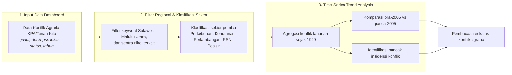
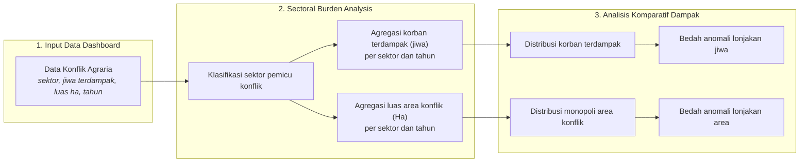
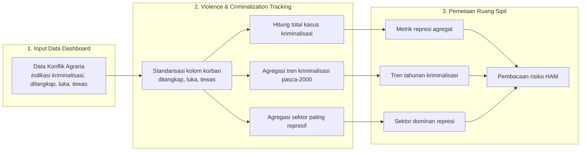
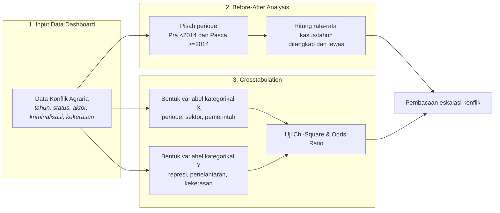
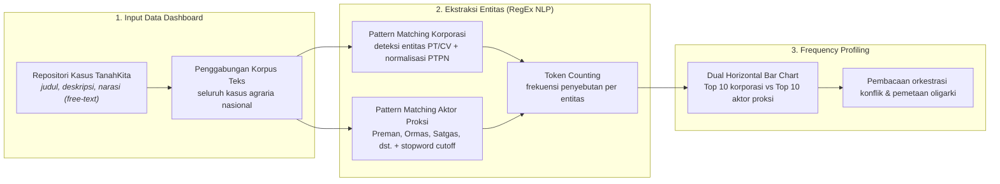

# BAB IV: METODOLOGI ANALISIS RUANG HIDUP YANG TERAMPAS

Dokumen laporan metodologi ini menyajikan kerangka ilmiah, prosedur pengolahan data, dan pembacaan empiris yang dioperasionalkan pada **Bab 4: Ruang Hidup yang Terampas**.

## 4.1 Tren Eskalasi Konflik Agraria Seiring Ekspansi Industri

> **Sumber Data Resmi & Deskripsi Visualisasi:** Catatan Konflik Agraria: `data/processed/sulawesi_konflik_agraria_tanahkita.csv`. Visualisasi dashboard menggunakan *Analisis Tren Time-Series* untuk melacak eskalasi letupan konflik agraria historis berdasarkan tahun pencatatan dan sektor pemicu.

#### A. Pengantar & Kerangka Narasi
Ekspansi industri ekstraktif dan proyek strategis berimplikasi pada dinamika sosial dan penggunaan lahan masyarakat. Data empiris mencatat akumulasi **95 kasus konflik agraria**, dengan estimasi **90,582 jiwa terdampak** dan **51 kasus** berstatus belum ditangani.

Pada periode pra-2005, sistem pendataan mencatat **13 kasus** konflik agraria. Pada periode pasca-2005 hingga saat ini, data mencatat **82 kasus** konflik lahan, atau setara peningkatan sebesar **630.8%** dibandingkan periode sebelumnya.

#### B. Alur Logika Metodologis Analisis Tren Time-Series


#### C. Formulasi Matematis: Agregasi Konflik Tahunan dan Lonjakan Eskalasi
```text
K_{t,s} = Σ c_i, untuk setiap kasus i pada tahun t dan sektor s
E (%) = ( K_Pasca / K_Pra ) × 100
E = (82 / 13) × 100 = 630.8%
```

#### D. Matriks Hasil Uji Empiris
##### Tabel 4.1: Tren Tahunan Konflik Agraria Regional (1990-2025)
| Tahun | Jumlah Konflik |
| :--- | :--- |
| 1996 | 1 |
| 1997 | 1 |
| 1999 | 3 |
| 2000 | 1 |
| 2001 | 1 |
| 2003 | 2 |
| 2004 | 1 |
| 2007 | 4 |
| 2008 | 3 |
| 2009 | 3 |
| 2010 | 3 |
| 2011 | 4 |
| 2012 | 5 |
| 2013 | 5 |
| 2014 | 5 |
| 2015 | 2 |
| 2016 | 4 |
| 2017 | 21 |
| 2018 | 3 |
| 2019 | 4 |
| 2021 | 3 |
| 2022 | 9 |
| 2023 | 4 |

##### Tabel 4.2: Distribusi Konflik Agraria menurut Sektor Pemicu
| Sektor Pemicu | Jumlah Konflik | Proporsi |
| :--- | :--- | :--- |
| Kehutanan | 30 | 32.6% |
| Perkebunan | 23 | 25.0% |
| Pertambangan | 22 | 23.9% |
| Infrastruktur & PSN | 14 | 15.2% |
| Pariwisata & Pesisir | 3 | 3.3% |

##### Tabel 4.3: Komposisi Sektor pada Tahun Puncak Insidensi (2017)
| Tahun | Sektor Pemicu | Jumlah Konflik |
| :--- | :--- | :--- |
| 2017 | Kehutanan | 13 |
| 2017 | Perkebunan | 4 |
| 2017 | Pertambangan | 2 |
| 2017 | Infrastruktur & PSN | 1 |
| 2017 | Pariwisata & Pesisir | 1 |

#### E. Analisis Temuan Empiris: Puncak Insidensi dan Eskalasi Konflik
Grafik time-series pada dashboard memperlihatkan peningkatan insidensi konflik yang memuncak pada tahun **2017** dengan **21 kasus konflik**. Peningkatan insidensi konflik beririsan dengan dinamika perizinan kawasan, sehingga pengelolaan alokasi ruang dan perlindungan hak masyarakat di wilayah investasi menjadi faktor penting untuk meminimalkan dampak sosial.

## 4.2 Sebaran Sektoral: Dampak Masyarakat dan Penggunaan Lahan

> **Sumber Data Resmi & Deskripsi Visualisasi:** Dampak Konflik: `data/processed/sulawesi_konflik_agraria_tanahkita.csv`. Visualisasi dashboard menggunakan *Analisis Komparatif Dampak Sosial-Ekologis* untuk membedah skala korban terdampak (jiwa) dan luas area konflik (hektar) antar sektor.

#### A. Pengantar & Kerangka Narasi
Visualisasi komparatif menggambarkan skala dampak sosial dan penggunaan lahan berdasarkan sektor industri. Data menunjukkan bahwa **Sektor Pertambangan** mencatatkan jumlah warga terdampak terbesar, yaitu **54,658 jiwa**, disusul sektor Kehutanan sebanyak **21,886 jiwa**.

Dari dimensi penggunaan lahan, **Sektor Pertambangan** juga mencatatkan luas sengketa terbesar yaitu **441,286 hektar**, disusul Perkebunan seluas **77,902 ha** dan Kehutanan seluas **66,193 ha**.

#### B. Alur Logika Metodologis Analisis Komparatif Dampak Sosial-Ekologis


#### C. Formulasi Matematis: Agregasi Jiwa Terdampak dan Monopoli Area
```text
J_s = Σ J_i, untuk setiap kasus i pada sektor s
A_s = Σ A_i, untuk setiap kasus i pada sektor s
P_s (%) = ( Nilai_s / Nilai_Total ) × 100
```

#### D. Matriks Hasil Uji Empiris
##### Tabel 4.4: Matriks Dampak Sosial-Ekologis Konflik Agraria menurut Sektor
| Sektor Pemicu | Jiwa Terdampak | Proporsi Jiwa | Luas Area (Ha) | Proporsi Area |
| :--- | :--- | :--- | :--- | :--- |
| Pertambangan | 54,658 | 60.3% | 441,286 | 73.1% |
| Kehutanan | 21,886 | 24.2% | 66,193 | 11.0% |
| Perkebunan | 13,799 | 15.2% | 77,902 | 12.9% |
| Pariwisata & Pesisir | 215 | 0.2% | 543 | 0.1% |
| Infrastruktur & PSN | 24 | 0.0% | 17,443 | 2.9% |

##### Tabel 4.5: Bedah Anomali Lonjakan Korban Terdampak (Jiwa)
| Anomali | Tahun | Sektor | Korban Jiwa | Kasus Utama |
| :--- | :--- | :--- | :--- | :--- |
| Anomali Jiwa 1 | 2022 | Pertambangan | 37,000 | Konflik Koalisi Selamatkan Pulau Wawoni |
| Anomali Jiwa 2 | 2012 | Pertambangan | 13,936 | Konflik Masyarakat Tumpang Pitu dengan PT BSI |

##### Tabel 4.6: Bedah Anomali Monopoli Area Konflik (Hektar)
| Anomali | Tahun | Sektor | Luas Ha | Kasus Utama |
| :--- | :--- | :--- | :--- | :--- |
| Anomali Area 1 | 2017 | Pertambangan | 146,201 | Konflik Nelayan Desa Boddia dengan Pertambangan Pasir Laut PT. Boskalis dan PT. Jan De Nul |
| Anomali Area 2 | 2022 | Pertambangan | 86,758 | Konflik Koalisi Selamatkan Pulau Wawoni |

#### E. Analisis Temuan Empiris: Asimetri Dampak Sosial dan Penguasaan Ruang
Matriks dampak sektoral menunjukkan bahwa sektor Pertambangan menjadi penyumbang utama korban terdampak sekaligus sektor dengan luas sengketa terbesar. Dengan demikian, dinamika konflik tidak hanya perlu dibaca dari jumlah kasus, tetapi juga dari skala korban dan luas ruang hidup yang diperebutkan.

## 4.3 Indikasi Represi dan Kriminalisasi dalam Konflik Agraria

> **Sumber Data Resmi & Deskripsi Visualisasi:** Represi dan Kriminalisasi: `data/processed/sulawesi_konflik_agraria_tanahkita.csv`. Visualisasi dashboard menggunakan *Analisis Agregat Kasus Represi & Pelanggaran HAM* untuk menghitung indikasi kriminalisasi, korban ditangkap, luka-luka, dan tewas.

#### A. Pengantar & Kerangka Narasi
Data kuantitatif di wilayah Sulawesi mencatat indikasi terjadinya represi dan tindakan kriminalisasi dalam sebagian sengketa agraria. Dari database yang didokumentasikan, terdapat **46 kasus indikasi kriminalisasi** dan **93 warga/aktivis lingkungan yang tercatat pernah ditangkap** dalam penanganan sengketa lahan.

Berdasarkan distribusi sektoral, **Sektor Pertambangan** mencatatkan frekuensi indikasi represi tertinggi dengan **17 kasus**. Tahun dengan jumlah catatan insiden represi tertinggi adalah **2017** dengan **7 kasus**.

#### B. Alur Logika Metodologis Analisis Agregat Kasus Represi & Pelanggaran HAM


#### C. Formulasi Matematis: Kriminalisasi dan Korban Represi
```text
K_krim = Σ I_i, untuk setiap kasus i dengan indikasi kriminalisasi
R = Σ ( D_i + L_i + T_i )
R = 93 + 4 + 1 = 98 orang
```

#### D. Matriks Hasil Uji Empiris
##### Tabel 4.7: Metrik Agregat Represi dan Kriminalisasi
| Indikator | Nilai |
| :--- | :--- |
| Kasus Indikasi Kriminalisasi | 46 |
| Warga/Aktivis Ditangkap | 93 |
| Korban Luka-luka | 4 |
| Korban Tewas | 1 |

##### Tabel 4.8: Tren Kasus Kriminalisasi dan Represi Pasca-2000
| Tahun | Jumlah Kasus |
| :--- | :--- |
| 2000 | 1 |
| 2001 | 1 |
| 2003 | 2 |
| 2004 | 1 |
| 2007 | 2 |
| 2008 | 1 |
| 2009 | 3 |
| 2010 | 2 |
| 2012 | 3 |
| 2013 | 4 |
| 2014 | 2 |
| 2015 | 1 |
| 2016 | 1 |
| 2017 | 7 |
| 2019 | 3 |
| 2021 | 1 |
| 2022 | 6 |
| 2023 | 2 |

##### Tabel 4.9: Sektor Industri Paling Represif
| Sektor Pemicu | Jumlah Kasus Kriminalisasi |
| :--- | :--- |
| Pertambangan | 17 |
| Kehutanan | 13 |
| Perkebunan | 12 |
| Infrastruktur & PSN | 2 |
| Pariwisata & Pesisir | 2 |

##### Tabel 4.10: Arsip Kasus Represi dan Kekerasan Fisik Tertinggi
| Tahun | Sektor | Perusahaan Terlibat | Ditangkap | Tewas | Narasi Singkat |
| :--- | :--- | :--- | :--- | :--- | :--- |
| 2001 | Kehutanan | Tidak/Belum Teridentifikasi | 22 | 0 | Kawasan Hutan Konservasi TWA Nanggala III sebelumnya merupakan Kawasan Hutan Lindung yang ditunjuk berdasarkan Tata Guna Hutan Kesepakatan (TGHK). |
| 2004 | Perkebunan | PT Bina Mulia Ternak | 20 | 0 | PT Perkebunan Nusantara (PTPN) XIV dituntut segera mengembalikan lahan warga Kecamatan Keera, Kabupaten Wajo, Sulawesi Selatan (Sulsel), sesuai kesepakatan bersama di Kantor Mar... |
| 2007 | Kehutanan | PT. Wirakarya Sakti , SInarmas Forestry , Asia Pulp and Paper | 15 | 0 | Konflik yang terjadi di Desa Lubuk Mandarsah mengarah ke proses penyelesaian, pasca Terbunuhnya Indra Pelani Pada Tahun 2015 hingga sekarang masyarakat masih bertahan dan belum ... |
| 2009 | Kehutanan | Tidak/Belum Teridentifikasi | 11 | 0 | Nasib masyarakat adat Barambang Katute, di Desa Bonto Katute, Kecamatan Sinjai Borong, Kabupaten Sinjai, Sulawesi Selatan (Sulsel), makin tak menentu. Setelah didera teror penan... |
| 2009 | Kehutanan | PT. Galena Sumber Energi | 11 | 0 | - |
| 2022 | Pertambangan | PT Gema Kreasi Perdana (GKP) | 6 | 0 | Keberadaan PT Gema Kreasi Perdana (GKP), anak perusahaan Harita Group, di Pulau Wawonii, Kabupaten Konawe Kepulauan, Sulawesi Tenggara mengancam keselamatan warga, menggusur lah... |
| 2017 | Kehutanan | Tidak/Belum Teridentifikasi | 4 | 0 | - |
| 2013 | Kehutanan | Tidak/Belum Teridentifikasi | 3 | 0 | Bahtiar bin Sabang adalah salah satu korban kriminalisasi karena dituduh menebang pohon di atas tanahnya sendiri yang diklim oleh Kehutanan Sebagai Kawasan Hutan Produksi Terbatas |
| 2012 | Pertambangan | PT Bumi Suksindo , PT. Merdeka Copper Gold | 1 | 0 | Gunung Tumpang Pitu yang masuk wilayah Desa Sumberagung, Kecamatan Pesanggaran, Kabupaten Banyuwangi, Jawa Timur, merupakan lokasi tambang emas dari PT Bumi Suksindo ( PT BSI) s... |
| 2022 | Pertambangan | PT. Trio Kencana | 0 | 1 | Penolakan dilakukan karena warga khawatir sumber air bersih mereka yang masuk ke wilayah konsesi tambang akan hilang. Warga akhirnya berunjuk rasa memblokade jalan dan terjadi p... |

#### E. Analisis Temuan Empiris: Penyempitan Ruang Sipil dan Risiko HAM
Keberadaan kasus kriminalisasi di sekitar area konsesi, terutama pada sektor **Pertambangan**, mengindikasikan pentingnya jaminan perlindungan ruang sipil dan penghormatan HAM dalam setiap proses pembangunan. Catatan ini menunjukkan perlunya pendekatan hukum yang adil, penyelesaian konflik secara ramah HAM, serta perlindungan bagi pejuang lingkungan dan komunitas lokal.

## 4.4 Pembuktian Statistik: Ekspansi vs Eskalasi Konflik

> **Sumber Data Resmi & Deskripsi Visualisasi:** Base Data Cross-Section: `data/processed/sulawesi_konflik_agraria_tanahkita.csv`. Visualisasi dashboard menggunakan *Before-After Analysis & Crosstabulation* untuk menguji hubungan antara indikator ekspansi dan eskalasi konflik.

#### A. Pengantar & Kerangka Narasi
Hipotesis utama dalam evaluasi ini adalah bahwa **industrialisasi dan ekspansi korporasi** berbanding lurus dengan **eskalasi konflik dan represi** terhadap masyarakat. Analisis dibagi menjadi dua bagian: komparasi metrik Before-After dan uji signifikansi Crosstab Chi-Square. Unit observasinya adalah catatan kejadian letupan konflik historis.

#### B. Alur Logika Metodologis Before-After Analysis & Crosstabulation


##### Tabel 4.4a: Konfigurasi Variabel Uji Chi-Square (Sub-bab 4.4)
| Komponen Uji | Definisi Variabel (Sub-bab 4.4) |
| :--- | :--- |
| Matriks Ekspansi (X) | Periode Ekspansi Industri; Tipe Sektor (Tambang vs Non-Tambang); Keterlibatan Aparat/Pemerintah. |
| Matriks Eskalasi (Y) | Tingkat Represi & Kriminalisasi; Tingkat Penelantaran Kasus; Tingkat Insiden Fisik. |
| Hipotesis Nol (H0) | Variabel baris (Periode/Aktor) saling bebas secara absolut terhadap variabel kolom (Represi/Kematian). |
| Decision Rule | Chi-Square P-Value < 0.05, maka tolak H0 dan terdapat korelasi signifikan. |
| Unit Observasi | Catatan kejadian letupan konflik historis sejak 1990 (N=523). |

#### C. Formulasi Matematis: Before-After, Chi-Square, dan Odds Ratio
```text
K̄_p = N_p / T_p
K̄_Pra = 37 / 18 = 2.1; K̄_Pasca = 55 / 10 = 5.5
χ² = Σ [ ( O_ij - E_ij )² / E_ij ]
OR = ( a × d ) / ( b × c )
```

#### D. Matriks Hasil Uji Empiris
##### Tabel 4.11: Analisis Komparatif Before-After Pra vs Era Hilirisasi
| Periode | Total Konflik | Jumlah Tahun | Kasus/Tahun | Ditangkap | Tewas |
| :--- | :--- | :--- | :--- | :--- | :--- |
| Pra-Ekspansi (<2014) | 37 | 18 | 2.1 | 83 | 0 |
| Pasca-Ekspansi (>=2014) | 55 | 10 | 5.5 | 10 | 1 |

##### Tabel 4.12: Ringkasan Eksekutif Seluruh Skenario Crosstab Ekspansi vs Eskalasi Konflik
| Variabel Independen (X) | Variabel Dependen (Y) | Chi-Square | P-Value | Odds Ratio | Kesimpulan |
| :--- | :--- | :--- | :--- | :--- | :--- |
| Periode Ekspansi Industri | Tingkat Represi & Kriminalisasi | 14.331 | p < 0.001 | 2.04 | SIGNIFIKAN |
| Periode Ekspansi Industri | Tingkat Penelantaran Kasus | 3.283 | p = 0.070 | 1.40 | TIDAK SIGNIFIKAN |
| Periode Ekspansi Industri | Tingkat Insiden Fisik (Luka/Tewas/Ditangkap) | 2.636 | p = 0.104 | 0.53 | TIDAK SIGNIFIKAN |
| Tipe Sektor (Tambang vs Non-Tambang) | Tingkat Represi & Kriminalisasi | 13.609 | p < 0.001 | 2.84 | SIGNIFIKAN |
| Tipe Sektor (Tambang vs Non-Tambang) | Tingkat Penelantaran Kasus | 4.742 | p = 0.029 | 1.89 | SIGNIFIKAN |
| Tipe Sektor (Tambang vs Non-Tambang) | Tingkat Insiden Fisik (Luka/Tewas/Ditangkap) | 0.665 | p = 0.415 | 1.66 | TIDAK SIGNIFIKAN |
| Keterlibatan Aparat/Pemerintah | Tingkat Represi & Kriminalisasi | 55.633 | p < 0.001 | 4.80 | SIGNIFIKAN |
| Keterlibatan Aparat/Pemerintah | Tingkat Penelantaran Kasus | 1.135 | p = 0.287 | 0.81 | TIDAK SIGNIFIKAN |
| Keterlibatan Aparat/Pemerintah | Tingkat Insiden Fisik (Luka/Tewas/Ditangkap) | 3.253 | p = 0.071 | 2.23 | TIDAK SIGNIFIKAN |

#### E. Analisis Temuan Empiris: Validitas Statistik Eskalasi Konflik
Dari 9 skenario pengujian, terdapat 4 skenario yang terbukti SIGNIFIKAN. Tingginya Odds Ratio pada skenario yang signifikan menegaskan bahwa ekspansi operasi industri berasosiasi dengan peningkatan risiko sengketa lahan. Skenario yang tidak signifikan mengindikasikan bahwa dinamika sengketa lahan tersebar secara merata di berbagai sektor dan kurun waktu.

## 4.5 Peta Entitas Aktor: Korporasi dan Organisasi Masyarakat

> **Sumber Data Resmi & Deskripsi Visualisasi:** Teks Bebas (Free-Text): `data/processed/sulawesi_konflik_agraria_tanahkita.csv`. Visualisasi dashboard menampilkan dua Horizontal Bar Chart berdampingan (Top 10 Entitas Korporasi Paling Dominan dan Top Aktor Proksi & Vigilante Terdeteksi) hasil ekstraksi teks berbasis NLP Regex dari korpus narasi seluruh kasus agraria.

#### A. Pengantar & Kerangka Narasi
Analisis entitas aktor berbasis pemrosesan teks (*string parsing*) terhadap catatan kronologi dokumentasi TanahKita memetakan keterlibatan berbagai pihak dalam sengketa agraria. Korpus dibangun dari penggabungan kolom `judul`, `deskripsi`, dan `narasi` pada **568 kasus agraria** (nasional) untuk memetakan orkestrasi struktural dan modus operandi aktor secara utuh, termasuk memvalidasi indikasi konsentrasi kekuasaan oleh segelintir konglomerasi besar.

#### B. Alur Logika Metodologis Frequency Profiling (Text Parsing NLP)
Kerangka ekstraksi entitas berbasis Regular Expressions (RegEx) dan penghitungan frekuensi penyebutan diilustrasikan pada **Bagan Alur 4.5** berikut. Sub-bab ini tidak menggunakan uji inferensial Chi-Square, melainkan Frequency Profiling deskriptif atas kemunculan entitas dalam korpus teks.

##### Bagan Alur 4.5: Alur Logika Analisis Frequency Profiling Entitas Aktor


#### C. Formulasi Matematis: Konstruksi Korpus dan Token Counting
Kuantifikasi frekuensi penyebutan entitas dihitung menggunakan sistem formulasi matematis berikut:

```text
Korpus = Gabungan ( judul_k , deskripsi_k , narasi_k )   ;   untuk k = 1 s.d. N
Frekuensi_a = Σ ( Match_i,a )   ;   untuk seluruh kemunculan pola entitas a dalam Korpus
```

Pola korporasi mendeteksi awalan PT/CV diikuti nama kapital (maksimum 4 kata) dengan normalisasi varian PTPN; pola aktor proksi mendeteksi kata kunci Preman, Ormas, Satgas, PAM Swakarsa, Pemuda Pancasila, GRIB, Laskar, Oknum, Security, Satpam, Centeng, Beking beserta frasa lanjutannya (dipotong pada stopword pertama).

#### D. Matriks Hasil Uji Empiris
##### Tabel 4.13: Top 10 Entitas Korporasi Paling Dominan dalam Dokumentasi Konflik
| Entitas Korporasi | Frekuensi Penyebutan |
| :--- | :--- |
| PT Perkebunan Nusantara (PTPN) | 153 |
| PT TPL | 48 |
| PT SR | 30 |
| PT KEM | 24 |
| PT. Bina Sari Alam Makmur | 24 |
| PT. Boskalis | 23 |
| PT MAS | 22 |
| PT WKS | 21 |
| PT BAE | 21 |
| PT MMP | 20 |

##### Tabel 4.14: Top Aktor Proksi & Vigilante Terdeteksi dalam Dokumentasi Konflik
| Aktor Proksi / Vigilante | Frekuensi Penyebutan |
| :--- | :--- |
| Preman | 16 |
| Oknum | 10 |
| Satgas | 8 |
| Security | 5 |
| Oknum Pejabat | 3 |
| Preman Bayaran | 3 |
| Oknum Masyarakat Lokal | 2 |
| Satgas Pkh | 2 |
| Oknum Mantan Perangkat Desa | 2 |
| Oknum Ormas | 1 |

#### E. Analisis Temuan Empiris: Orkestrasi Konflik dan Pemetaan Oligarki
1. **Dominasi Entitas Korporasi:** entitas **PT Perkebunan Nusantara (PTPN)** tercatat tertinggi dengan **153 catatan kasus terpisah** (dari 1,033 entitas terdeteksi dan 2,686 total penyebutan), memvalidasi indikasi konsentrasi kekuasaan dan monopoli penguasaan ruang oleh segelintir konglomerasi besar.
2. **Orkestrasi Horizontal Aktor Proksi:** kelompok sipil seperti **Preman** terdeteksi hingga **16 kali** — korporasi seringkali menggunakan pengamanan swakarsa, kelompok preman, hingga ormas vigilante sebagai 'bemper proksi' untuk mengintimidasi warga lokal dan memecah belah solidaritas akar rumput.
