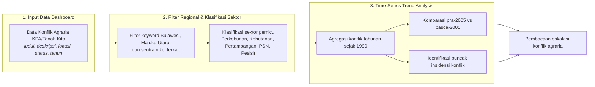

# BAB IV: METODOLOGI ANALISIS RUANG HIDUP YANG TERAMPAS

Dokumen laporan metodologi ini menyajikan kerangka ilmiah, prosedur pengolahan data, dan pembacaan empiris yang dioperasionalkan pada **Bab 4: Ruang Hidup yang Terampas**.

## 4.1 Tren Eskalasi Konflik Agraria Seiring Ekspansi Industri

> **Sumber Data Resmi & Deskripsi Visualisasi:** Catatan Konflik Agraria: `data/processed/sulawesi_konflik_agraria_tanahkita.csv`. Visualisasi dashboard menggunakan *Analisis Tren Time-Series* untuk melacak eskalasi letupan konflik agraria historis berdasarkan tahun pencatatan dan sektor pemicu.

#### A. Pengantar & Kerangka Narasi
Ekspansi industri ekstraktif dan proyek strategis berimplikasi pada dinamika sosial dan penggunaan lahan masyarakat. Data empiris mencatat akumulasi **95 kasus konflik agraria**, dengan estimasi **90,582 jiwa terdampak** dan **51 kasus** berstatus belum ditangani.

Pada periode pra-2005, sistem pendataan mencatat **13 kasus** konflik agraria. Pada periode pasca-2005 hingga saat ini, data mencatat **82 kasus** konflik lahan, atau setara peningkatan sebesar **630.8%** dibandingkan periode sebelumnya.

#### B. Alur Logika Metodologis Analisis Tren Time-Series


#### C. Formulasi Matematis: Agregasi Konflik Tahunan dan Lonjakan Eskalasi
```text
K_{t,s} = Σ c_i, untuk setiap kasus i pada tahun t dan sektor s
E (%) = ( K_Pasca / K_Pra ) × 100
E = (82 / 13) × 100 = 630.8%
```

#### D. Matriks Hasil Uji Empiris
##### Tabel 4.1: Tren Tahunan Konflik Agraria Regional (1990-2025)
| Tahun | Jumlah Konflik |
| :--- | :--- |
| 1996 | 1 |
| 1997 | 1 |
| 1999 | 3 |
| 2000 | 1 |
| 2001 | 1 |
| 2003 | 2 |
| 2004 | 1 |
| 2007 | 4 |
| 2008 | 3 |
| 2009 | 3 |
| 2010 | 3 |
| 2011 | 4 |
| 2012 | 5 |
| 2013 | 5 |
| 2014 | 5 |
| 2015 | 2 |
| 2016 | 4 |
| 2017 | 21 |
| 2018 | 3 |
| 2019 | 4 |
| 2021 | 3 |
| 2022 | 9 |
| 2023 | 4 |

##### Tabel 4.2: Distribusi Konflik Agraria menurut Sektor Pemicu
| Sektor Pemicu | Jumlah Konflik | Proporsi |
| :--- | :--- | :--- |
| Kehutanan | 30 | 32.6% |
| Perkebunan | 23 | 25.0% |
| Pertambangan | 22 | 23.9% |
| Infrastruktur & PSN | 14 | 15.2% |
| Pariwisata & Pesisir | 3 | 3.3% |

##### Tabel 4.3: Komposisi Sektor pada Tahun Puncak Insidensi (2017)
| Tahun | Sektor Pemicu | Jumlah Konflik |
| :--- | :--- | :--- |
| 2017 | Kehutanan | 13 |
| 2017 | Perkebunan | 4 |
| 2017 | Pertambangan | 2 |
| 2017 | Infrastruktur & PSN | 1 |
| 2017 | Pariwisata & Pesisir | 1 |

#### E. Analisis Temuan Empiris: Puncak Insidensi dan Eskalasi Konflik
Grafik time-series pada dashboard memperlihatkan peningkatan insidensi konflik yang memuncak pada tahun **2017** dengan **21 kasus konflik**. Peningkatan insidensi konflik beririsan dengan dinamika perizinan kawasan, sehingga pengelolaan alokasi ruang dan perlindungan hak masyarakat di wilayah investasi menjadi faktor penting untuk meminimalkan dampak sosial.
