# METODOLOGI PENELITIAN: BAB 4 — ANALISIS RUANG HIDUP YANG TERAMPAS
*CELIOS (Center of Economic and Law Studies) · Audit Spasial-Statistik D3TLH Sulawesi (2014–2024) · Ringkasan Eksekutif Metodologis*

---

## A. Desain Penelitian & Tujuan
Penelitian ini menggunakan **desain sosiologi hukum kritis, audit sengketa agraria, dan analisis inferensial kuantitatif terintegrasi** untuk mengidentifikasi perampasan ruang hidup masyarakat adat dan komunitas lokal akibat ekspansi masif korporasi tambang nikel dan kawasan industri penunjang di Pulau Sulawesi sepanjang kurun waktu pengamatan (**1990–2024**). Tiga tujuan utama metodologis Bab 4 meliputi:

1. **Kuantifikasi Asimetri Penguasaan Ruang & Korban Terdampak:** Mengevaluasi distribusi sektoral sengketa agraria guna membuktikan dominasi monopoli lahan dan skala korban masyarakat terdampak pada sektor pertambangan nikel dibandingkan sektor lainnya.
2. **Pembuktian Inferensial Kausalitas Ekspansi vs Eskalasi Represi:** Menguji signifikansi hubungan antara periode hilirisasi dan keterlibatan korporasi ekstraktif terhadap peningkatan risiko kekerasan, penangkapan, serta kriminalisasi warga melalui matriks Chi-Square dan Odds Ratio (OR).
3. **Pemetaan Entitas Oligarki & Aktor Proksi (NLP Text Parsing):** Mengekstraksi jaringan entitas korporasi dominan dan mendeteksi keterlibatan aktor vigilante/pengamanan swakarsa dalam kronologi sengketa agraria melalui penambangan teks reguler (NLP Regex).

---

## B. Sumber Data & Cakupan Wilayah
Penelitian mencakup catatan letupan konflik agraria terdata di seluruh wilayah administratif **Pulau Sulawesi dan pulau-pulau kecil penyangga sentra nikel** (seperti Pulau Wawonii dan pesisir Morowali). Basis data dibangun dari repositori dokumentasi konflik agraria nasional dan advokasi masyarakat sipil:

- **Konsorsium Pembaruan Agraria (KPA) / Basis Data TanahKita:** Dokumentasi 95 kasus konflik agraria regional Sulawesi (dan korpus 568 narasi nasional) mencakup luas sengketa (Ha), jiwa terdampak, sektor industri, serta status penanganan hukum.
- **Koalisi Masyarakat Sipil (WALHI, JATAM, AMAN):** Kronologi advokasi hak tenurial masyarakat adat, kasus kekerasan fisik, dan pemantauan perampasan wilayah kelola rakyat.
- **Komisi Nasional Hak Asasi Manusia (Komnas HAM):** Registri pengaduan pelanggaran hak sipil, kriminalisasi pejuang lingkungan, warga ditangkap, luka-luka, dan korban tewas.
- **Kementerian ATR/BPN & ESDM (MODI):** Status perizinan hak guna usaha (HGU), izin usaha pertambangan (IUP), dan konsesi kawasan industri.

---

## C. Operasionalisasi Variabel & Indikator Riset
Seluruh dinamika perampasan ruang, eskalasi konflik, dan keterlibatan aktor dioperasionalkan ke dalam **10 indikator empiris terpadu** sebagaimana dirangkum pada matriks operasional berikut:

##### Matriks Operasionalisasi Variabel dan Sumber Data Resmi Bab 4
| No | Indikator Riset | Fokus Pengukuran | Satuan | Periode | Sumber Data Primer Resmi |
| :-: | :--- | :--- | :-: | :-: | :--- |
| 1 | Insidensi Konflik Agraria | Frekuensi Kejadian Letupan Sengketa Lahan | Kasus | 1990–2024 | KPA / TanahKita |
| 2 | Sektor Pemicu Sengketa | Klasifikasi Sektoral (Tambang, Sawit, Hutan) | Kategori | 1990–2024 | KPA / TanahKita |
| 3 | Skala Korban Terdampak | Masyarakat Adat & Komunitas Lokal Terdampak | Jiwa | 1990–2024 | KPA & Koalisi Sipil |
| 4 | Luas Monopoli Area Sengketa | Luas Ruang Hidup & Lahan Diperebutkan | Hektar (Ha) | 1990–2024 | TanahKita & ATR/BPN |
| 5 | Kasus Indikasi Kriminalisasi | Penuntutan Hukum Terhadap Warga/Aktivis | Kasus | 2000–2024 | KPA & Komnas HAM |
| 6 | Korban Represi & Kekerasan | Warga Ditangkap, Mengalami Luka, & Tewas | Orang | 2000–2024 | KPA & Komnas HAM |
| 7 | Laju Eskalasi Hilirisasi | Rasio Before-After Kasus Pra vs Pasca 2014 | Kasus / Tahun | 1990 vs 2024 | Data Panel Tahunan |
| 8 | Tingkat Penelantaran Kasus | Sengketa Lahan Berstatus Belum Ditangani | Persen (%) | 1990–2024 | KPA / TanahKita |
| 9 | Frekuensi Entitas Korporasi | Keterlibatan Konglomerasi dalam Konflik | Token Count | Korpus NLP | NLP Regex TanahKita |
| 10 | Frekuensi Aktor Proksi/Vigilante | Keterlibatan Pengamanan Swakarsa/Preman | Token Count | Korpus NLP | NLP Regex TanahKita |

---

## D. Kerangka Analisis & Formulasi Matematis

### 4.1 Tren Eskalasi Konflik Agraria Seiring Ekspansi Industri
Kuantifikasi eskalasi sengketa ruang hidup dihitung berdasarkan deret waktu tahunan dan rasio laju peningkatan kasus antara era pra-ekspansi dan era hilirisasi:

> `Agregasi Konflik (K_t,s) = Σ c_i   ;   Laju Eskalasi (E %) = [ K_Pasca / K_Pra ] × 100`  
> *Keterangan: c_i = Kasus konflik agraria i pada tahun t dan sektor s; K_Pasca = Total kasus pasca ekspansi industri; K_Pra = Total kasus pra ekspansi; E = Laju persentase lonjakan eskalasi konflik.*

### 4.2 Sebaran Sektoral: Dampak Masyarakat dan Penggunaan Lahan
Dekomposisi beban dampak sosiologis dan monopoli penguasaan ruang dihitung per sektor industri pemicu konflik guna mengukur asimetri dampak:

> `Total Jiwa Terdampak (J_s) = Σ J_i   ;   Total Luas Area (A_s) = Σ A_i   ;   Porsi Sektoral (P_s %) = [ Nilai_s / Nilai_Total ] × 100`  
> *Keterangan: J_i = Warga terdampak pada kasus i; A_i = Luas lahan sengketa kasus i (Ha); J_s & A_s = Total korban jiwa dan luas sengketa sektor s; P_s = Pangsa persentase sektor terhadap total regional.*

### 4.3 Indikasi Represi dan Kriminalisasi dalam Konflik Agraria
Kuantifikasi penyempitan ruang sipil menghitung total kasus kriminalisasi serta menjumlahkan seluruh korban represi fisik yang terdokumentasi:

> `Total Kriminalisasi = Σ I_i   ;   Total Korban Represi (R) = Σ [ D_i + L_i + T_i ]`  
> *Keterangan: I_i = Indikator biner kriminalisasi pada kasus i (1 jika ada); D_i = Korban ditangkap; L_i = Korban luka-luka; T_i = Korban tewas; R = Akumulasi total korban pelanggaran HAM.*

### 4.4 Pembuktian Statistik: Ekspansi vs Eskalasi Konflik
Pengujian komparatif Before-After dan uji independensi Chi-Square (χ²) tabulasi silang diterapkan pada basis data kejadian konflik (N=523) untuk membuktikan korelasi ekspansi industri terhadap eskalasi represi:

> `Rata-rata Konflik (K̄_p) = N_p / T_p   ;   χ² = Σ [ ( O_ij - E_ij )² / E_ij ]   ;   OR = ( a × d ) / ( b × c )`  
> *Keterangan: N_p = Total konflik periode p; T_p = Jumlah tahun periode p; K̄_p = Kasus per tahun; χ² = Statistik Chi-Square (O_ij = observasi, E_ij = harapan); OR = Odds Ratio kelipatan peluang represi pada sektor tambang.*

##### Tabel 4.4a: Konfigurasi Variabel Uji Chi-Square (Sub-bab 4.4)
| Komponen Uji | Definisi Variabel (Sub-bab 4.4) |
| :--- | :--- |
| **Variabel Independen (X)** | Periode Ekspansi Industri (Pasca vs Pra 2014); Tipe Sektor (Tambang vs Non-Tambang); Keterlibatan Aparat/Pemerintah. |
| **Variabel Dependen (Y)** | Tingkat Represi & Kriminalisasi; Tingkat Penelantaran Kasus; Tingkat Insiden Fisik (Ditangkap/Luka/Tewas). |
| **Hipotesis Nol (H0)** | Faktor ekspansi industri dan tipe sektor saling bebas secara absolut terhadap tingkat represi dan kriminalisasi. |
| **Hipotesis Alternatif (H1)** | Ekspansi industri pertambangan berasosiasi signifikan dengan peningkatan risiko represi dan kriminalisasi pejuang hak tenurial. |
| **Decision Rule (Alpha 5%)** | Chi-Square P-Value < 0.05 (Tolak H0) dan rasio peluang Odds Ratio (OR) > 1.0. |
| **Threshold Kategori** | Klasifikasi biner data cross-section (N=523 kejadian letupan konflik historis): Periode (Pasca-2014 vs Pra-2014), Sektor (Tambang vs Lainnya), Represi (Ada vs Tidak Ada). |
| **Orientasi Odds Ratio** | OR = ( a × d ) / ( b × c ) dengan a = Sektor Tambang/Era Pasca & Ada Represi; mengukur kelipatan risiko kekerasan pada aktivitas industri ekstraktif. |

### 4.5 Peta Entitas Aktor: Korporasi dan Organisasi Masyarakat
Penambangan teks berbasis Regular Expressions (RegEx NLP) membedah korpus narasi kronologi sengketa lahan (N=568 dokumen kasus) untuk memetakan frekuensi keterlibatan entitas korporasi dan aktor proksi swakarsa:

> `Korpus = Gabungan ( Judul_k , Deskripsi_k , Narasi_k )   ;   Frekuensi Entitas_a = Σ [ Match_i,a ]`  
> *Keterangan: Judul_k, Deskripsi_k, Narasi_k = Teks narasi bebas kasus k; Korpus = Kumpulan seluruh narasi kasus agraria; Match_i,a = Kecocokan pola teks entitas a pada dokumen i; Frekuensi = Total kemunculan entitas dalam korpus.*

---

## E. Korespondensi Metodologi terhadap Sub-bab Laporan Bab 4
Setiap sub-bab analitis pada Bab 4 ditopang oleh metode kuantitatif yang terukur dan menghasilkan sintesis bukti empiris terstandarisasi sebagaimana dirangkum pada matriks berikut:

##### Matriks Korespondensi Sub-bab terhadap Metode Analitis
| Sub-bab | Fokus Kajian Empiris | Metode Analitis Utama |
| :---: | :--- | :--- |
| **Sub-bab 4.1** | Eskalasi Konflik Agraria Historis | Time-Series Trend Analysis, Laju Pertumbuhan Kasus Pra vs Pasca Hilirisasi |
| **Sub-bab 4.2** | Asimetri Dampak Sosial & Penguasaan Ruang | Sectoral Burden Analysis, Agregasi Korban Jiwa & Monopoli Hektar Lahan |
| **Sub-bab 4.3** | Ruang Sipil, Represi & Kriminalisasi | Violence Tracking Analysis, Agregasi Kriminalisasi & Korban Pelanggaran HAM |
| **Sub-bab 4.4** | Pembuktian Statistik Relasi Kausalitas | Before-After Cross-Section, Uji Chi-Square (χ²), Odds Ratio Risiko (OR) |
| **Sub-bab 4.5** | Orkestrasi Oligarki & Aktor Proksi | Text Parsing NLP RegEx, Frequency Profiling Korporasi & Kelompok Vigilante |

---

## F. Bagan Alur Kerangka Kerja Riset (Research Workflow)

```mermaid
flowchart LR
    subgraph F1["Fase I: Akuisisi Data"]
        A1["Kurasi Basis Data Konflik<br/><i>TanahKita KPA, Komnas HAM, WALHI</i>"]
        A2["Korpus Narasi Sengketa<br/><i>568 Kronologi Kasus & Arsip Advokasi</i>"]
    end
    subgraph F2["Fase II: Reklasifikasi & NLP"]
        B1["Reklasifikasi Sektoral & Waktu<br/><i>Tambang, Sawit vs Pra & Pasca 2014</i>"]
        B2["Ekstraksi Pola RegEx NLP<br/><i>Entitas Korporasi & Aktor Proksi</i>"]
    end
    subgraph F3["Fase III: Uji Statistik"]
        C1["Tabel Kontinjensi 2x2<br/><i>Sektor & Periode vs Represi</i>"]
        C2["Uji Chi-Square & Odds Ratio<br/><i>Signifikansi & Kelipatan Risiko HAM</i>"]
    end
    subgraph F4["Fase IV: Profiling & Sintesis"]
        D1["Frequency Profiling Aktor<br/><i>Top 10 Oligarki & Vigilante</i>"]
        D2["Bukti Kausalitas D3TLH<br/><i>Monopoli Ruang & Kriminalisasi</i>"]
    end
    F1 --> F2 --> F3 --> F4
```

> **KERANGKA KELUARAN METODOLOGIS BAB 4:**  
> 1. **Konfigurasi Asimetri Penguasaan Ruang:** Membuktikan secara empiris bahwa sektor pertambangan nikel memonopoli 73,1% luasan sengketa lahan (441.286 Ha) dan menumbalkan 60,3% korban terdampak (54.658 jiwa).  
> 2. **Konfigurasi Inferensial Eskalasi Represi:** Membuktikan korelasi kausalitas signifikan secara statistik antara ekspansi industri tambang dan keterlibatan aparat terhadap lonjakan risiko kriminalisasi warga (Odds Ratio hingga 4,8 kali lipat).  
> 3. **Konfigurasi Profiling Aktor & Oligarki:** Mengungkap modus operandi pengamanan swakarsa dan orkestrasi aktor proksi vigilante di balik perampasan ruang hidup masyarakat lingkar tambang.
