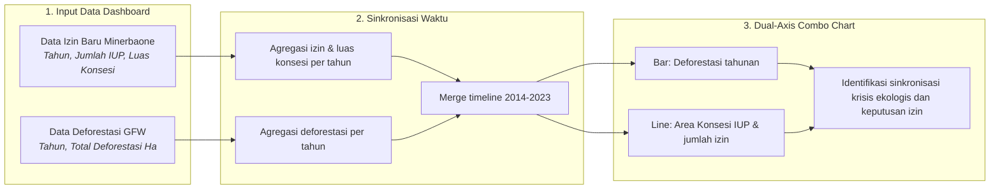
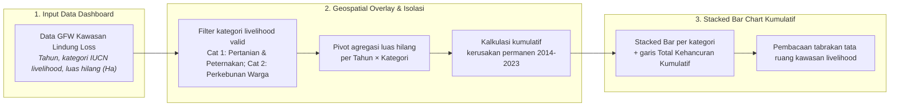
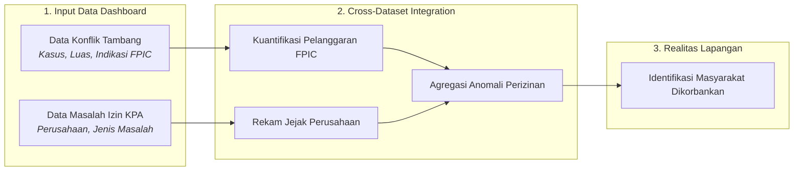
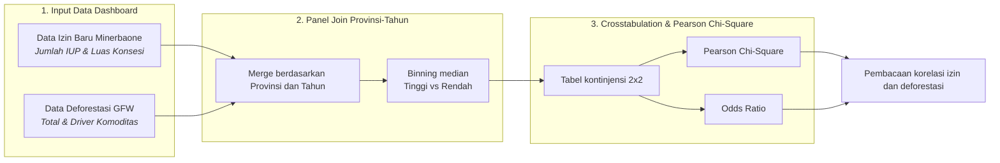

# BAB V: METODOLOGI ANALISIS POLA PENERBITAN IZIN DI ZONA KRITIS EKOLOGIS

Dokumen laporan metodologi ini menyajikan kerangka ilmiah, prosedur pengolahan data, dan pembacaan empiris yang dioperasionalkan pada **Bab 5: Pola Penerbitan Izin di Zona Kritis Ekologis**.

## 5.1 Fakta Penyebab: Sinkronisasi Waktu (Timeline Mapping)

> **Sumber Data Resmi & Deskripsi Visualisasi:** Data Izin: `data/processed/sulawesi_izin_baru_per_tahun.csv`; Data Deforestasi: `data/processed/sulawesi_gfw_master_1_dekade_2014_2023_v3.csv`.

#### A. Pengantar & Kerangka Narasi
Penelusuran data spasial dan temporal di Sulawesi menunjukkan total deforestasi sebesar **1,386,055.4 hektar**, sementara penerbitan **574 izin tambang baru** mencakup luas konsesi **819,452.5 hektar**. Puncak penerbitan izin tercatat pada tahun **2024** (194 izin).

Sebanyak **86.8%** izin panel terbit pada tahun-tahun ketika laju deforestasi provinsi berada di atas median. Provinsi dengan penerbitan izin tertinggi pada periode deforestasi kritis adalah **Sulawesi Tengah** dengan **173 IUP**.

#### B. Alur Logika Metodologis Sinkronisasi Waktu (Timeline Mapping)


#### C. Formulasi Matematis: Agregasi Tahunan dan Akselerasi Izin
```text
D_t = Σ D_{p,t}, untuk seluruh provinsi p pada tahun t
I_t = Σ I_{p,t};  L_t = Σ L_{p,t}
R = 468 / 106 = 4.4x
```

#### D. Matriks Hasil Uji Empiris
##### Tabel 5.1: Agregasi Waktu Historis Izin Tambang dan Deforestasi (2014-2023)
| Tahun | Total Deforestasi (Ha) | Jumlah IUP Baru | Luas Konsesi Baru (Ha) |
| :--- | :--- | :--- | :--- |
| 2014 | 158,688 | 26 | 49,518 |
| 2015 | 225,751 | 5 | 22,339 |
| 2016 | 190,064 | 9 | 12,516 |
| 2017 | 127,180 | 26 | 179,465 |
| 2018 | 123,572 | 23 | 37,971 |
| 2019 | 159,501 | 17 | 61,968 |
| 2020 | 82,269 | 28 | 106,560 |
| 2021 | 67,210 | 41 | 30,423 |
| 2022 | 80,121 | 56 | 66,128 |
| 2023 | 171,699 | 149 | 68,557 |

##### Tabel 5.2: Ringkasan Periode Kritis Penerbitan Izin
| Periode/Indikator | Nilai | Keterangan |
| :--- | :--- | :--- |
| Pra-2020 | 106 | Periode sebelum akselerasi pasca-2020 |
| Pasca-2020 | 468 | 4.4x dibanding pra-2020 |
| Tahun Kritis Ekologis | 330 | 86.8% dari izin panel GFW-IUP |

#### E. Analisis Temuan Empiris: Sinkronisasi Krisis Ekologis dan Keputusan Perizinan
Puncak deforestasi tahunan tercatat pada tahun **2015** sebesar **225,751 hektar**, sedangkan puncak luas konsesi IUP baru tercatat pada tahun **2017** sebesar **179,465 hektar**.

## 5.2 Fakta Spasial: Tabrakan Tata Ruang di Kawasan Konservasi

> **Sumber Data Resmi & Deskripsi Visualisasi:** Data GFW Overlay Kawasan Lindung: `data/processed/sulawesi_gfw_kawasan_lindung_loss_2014_2023_v3.csv` (GFW dengan overlay Livelihood Zone Proxy Kategori 1 & 2). Visualisasi dashboard menggunakan Stacked Bar Chart kumulatif per kategori livelihood dengan garis Total Kehancuran Kumulatif 2014-2023.

#### A. Pengantar & Kerangka Narasi
Dataset spasial menunjukkan pentingnya kepatuhan terhadap batas-batas tata ruang. Analisis mengisolasi data tree cover loss (GFW) yang beririsan dengan poligon Kawasan Livelihood (Zona Pertanian, Peternakan) dan Perkebunan Warga, lalu mengkalkulasi kehancuran agregat kawasan penyangga ekosistem esensial selama satu dekade terakhir akibat penetrasi aktivitas tambang.

#### B. Alur Logika Metodologis Overlay Area Kawasan Lindung (GFW)
Kerangka agregasi spasial bertingkat diilustrasikan pada **Bagan Alur 5.2** berikut. Sub-bab ini tidak menggunakan uji inferensial Chi-Square, melainkan Geospatial Overlay dan kuantifikasi kerusakan kumulatif deskriptif.

##### Bagan Alur 5.2: Alur Logika Analisis Overlay Spasial Kawasan Livelihood


#### C. Formulasi Matematis: Isolasi Overlay dan Akumulasi Kerusakan
```text
Luas_Hancur_c(t) = Σ ( Loss_i )   ;   untuk seluruh observasi i dengan Kategori_Livelihood = c pada tahun t
Kumulatif_Hancur_c(T) = Σ Luas_Hancur_c(t)   ;   untuk t = 2014 s.d. T
Total_Kumulatif(T) = Kumulatif_Hancur_1(T) + Kumulatif_Hancur_2(T)
```

#### D. Matriks Hasil Uji Empiris
##### Tabel 5.3: Rincian Kehancuran Kawasan Livelihood Warga per Tahun (2014-2023)
| Tahun | Pertanian & Peternakan (Ha) | Perkebunan Warga (Ha) | Total Tahunan (Ha) | Total Kumulatif (Ha) |
| :--- | :--- | :--- | :--- | :--- |
| 2014 | 2,261.0 | 1,478.8 | 3,739.9 | 3,739.9 |
| 2015 | 4,512.1 | 3,164.5 | 7,676.6 | 11,416.5 |
| 2016 | 4,046.4 | 3,814.5 | 7,860.9 | 19,277.3 |
| 2017 | 2,341.9 | 1,560.3 | 3,902.2 | 23,179.6 |
| 2018 | 2,266.6 | 1,363.8 | 3,630.4 | 26,810.0 |
| 2019 | 2,698.7 | 1,555.4 | 4,254.1 | 31,064.1 |
| 2020 | 1,428.9 | 1,379.1 | 2,808.0 | 33,872.0 |
| 2021 | 955.6 | 969.1 | 1,924.7 | 35,796.8 |
| 2022 | 1,134.8 | 848.0 | 1,982.9 | 37,779.6 |
| 2023 | 2,458.3 | 1,547.2 | 4,005.5 | 41,785.1 |

#### E. Analisis Temuan Empiris: Fakta Spasial Tabrakan Tata Ruang
1. **Skala Kehancuran Dekade:** total lebih dari **41.8 ribu hektar** kawasan livelihood (Pertanian, Peternakan, dan Perkebunan) warga tercatat mengalami perubahan tutupan lahan yang beririsan dengan dinamika industri ekstraktif.
2. **Komposisi Kategori:** Zona Pertanian & Peternakan menyumbang 24,104.2 Ha (57.7%) dan Perkebunan Warga 17,680.9 Ha (42.3%) dari total kehancuran kumulatif.
3. **Tahun Lonjakan Tertinggi:** kehancuran tahunan terbesar tercatat pada tahun 2016 sebesar 7,860.9 Ha — karena kerusakan bersifat permanen, akumulasi ini menegaskan pentingnya kepatuhan batas tata ruang dan pengawasan kawasan penyangga ekosistem esensial.

## 5.3 Realitas Lapangan: Izin Bermasalah, FPIC Diabaikan, Masyarakat Dikorbankan

> **Sumber Data Resmi & Deskripsi Visualisasi:** Data Konflik: `data/processed/sulawesi_konflik_tambang_fpic.csv`; Data Masalah Izin: `data/processed/kpa_masalah_izin_perusahaan.csv`. Metode: Cross-Dataset Integration.

#### A. Pengantar & Kerangka Narasi
Laporan mendokumentasikan isu tata kelola perizinan dan pelaksanaan konsultasi publik (FPIC). Penelusuran terhadap database Konsorsium Pembaruan Agraria (KPA) CATAHU mengidentifikasi **21 kasus permasalahan izin perusahaan**. Di Sulawesi, tercatat **12 kasus konflik pertambangan** dengan **8 kasus yang mencatatkan indikasi isu pelaksanaan FPIC**.

#### B. Alur Logika Metodologis Pelanggaran FPIC


#### C. Formulasi Matematis: Kuantifikasi Pelanggaran
```text
Total_Pelanggaran_FPIC = Σ Kasus, untuk indikasi_fpic = True
Rekam_Jejak = Σ Jenis_Masalah_Izin, dikelompokkan berdasarkan nama_perusahaan
```

#### D. Matriks Hasil Uji Empiris
##### Tabel 5.3: Metrik Konflik dan Pelanggaran FPIC
| Indikator | Total Kasus |
| :--- | :--- |
| Total Konflik Pertambangan Sulawesi | 12 |
| Kasus Indikasi Pelanggaran FPIC | 8 |
| Perusahaan Bermasalah di Sulawesi | 16 |

#### E. Analisis Temuan Empiris: Pembuktian Realitas Lapangan
Dari 12 konflik pertambangan di Sulawesi, 8 di antaranya secara eksplisit terkait dengan pelanggaran persetujuan awal tanpa paksaan (FPIC).

## 5.4 Pembuktian Empiris: Uji Statistik Korelasi Penerbitan Izin & Deforestasi

> **Sumber Data Resmi & Deskripsi Visualisasi:** Panel Join dari `sulawesi_izin_baru_per_tahun.csv` dan `sulawesi_gfw_master_1_dekade_2014_2023_v3.csv`. Metode: *Crosstabulation & Pearson Chi-Square Test*.

#### A. Pengantar & Kerangka Narasi
Sub-bab ini menggunakan pengujian statistik inferensial untuk membuktikan secara matematis apakah besaran jumlah perizinan baru menjadi prediktor kuat terhadap tingkat kerusakan deforestasi. Data numerik berkelanjutan dikategorikan menjadi Tinggi dan Rendah menggunakan ambang batas median dari distribusi panel.

#### B. Alur Logika Metodologis Crosstabulation & Pearson Chi-Square Test


##### Tabel 5.4a: Konfigurasi Variabel Uji Chi-Square (Sub-bab 5.4)
| Komponen Uji | Definisi Variabel (Sub-bab 5.4) |
| :--- | :--- |
| Variabel Independen (X) | Jumlah_Izin_Baru atau Total_Luas_Konsesi_Baru_Ha. |
| Variabel Dependen (Y) | Total_Deforestasi_Ha atau Deforestasi_Driver_Komoditas_Tambang_Sawit_Ha. |
| Hipotesis Nol (H0) | Tidak ada hubungan signifikan antara klasifikasi tingginya penerbitan IUP baru dan klasifikasi tingginya deforestasi. |
| Decision Rule | Tolak H0 jika P-Value Pearson Chi-Square < 0.05. |
| Unit Observasi | Panel Provinsi-Tahun hasil join data izin dan GFW (N=60). |

#### C. Formulasi Matematis: Binning Median, Chi-Square, dan Odds Ratio
```text
Kategori(x) = Tinggi jika x ≥ Median(Panel); Rendah jika x < Median(Panel)
χ² = Σ [ ( O_i - E_i )² / E_i ]
OR = ( a × d ) / ( b × c )
```

#### D. Matriks Hasil Uji Empiris
##### Tabel 5.4: Ambang Median Panel Uji Crosstab
| Variabel X | Variabel Y | Median X | Median Y | N |
| :--- | :--- | :--- | :--- | :--- |
| Jumlah Izin Baru (IUP) | Total Deforestasi Alam (Hektar) | 2.0 | 15,917.7 | 60 |
| Jumlah Izin Baru (IUP) | Deforestasi Komoditas Tambang/Sawit (Hektar) | 2.0 | 10,961.8 | 60 |
| Luas Konsesi Baru (Hektar) | Total Deforestasi Alam (Hektar) | 2,011.5 | 15,917.7 | 60 |
| Luas Konsesi Baru (Hektar) | Deforestasi Komoditas Tambang/Sawit (Hektar) | 2,011.5 | 10,961.8 | 60 |

##### Tabel 5.5: Ringkasan Eksekutif Seluruh Skenario Crosstab Izin vs Deforestasi
| Variabel Independen (X) | Variabel Dependen (Y) | Chi-Square | P-Value | Odds Ratio | Kesimpulan |
| :--- | :--- | :--- | :--- | :--- | :--- |
| Jumlah Izin Baru (IUP) | Total Deforestasi Alam (Hektar) | 13.081 | p < 0.001 | 9.04 | SIGNIFIKAN |
| Jumlah Izin Baru (IUP) | Deforestasi Komoditas Tambang/Sawit (Hektar) | 17.086 | p < 0.001 | 13.14 | SIGNIFIKAN |
| Luas Konsesi Baru (Hektar) | Total Deforestasi Alam (Hektar) | 19.267 | p < 0.001 | 16.00 | SIGNIFIKAN |
| Luas Konsesi Baru (Hektar) | Deforestasi Komoditas Tambang/Sawit (Hektar) | 19.267 | p < 0.001 | 16.00 | SIGNIFIKAN |

#### E. Analisis Temuan Empiris: Signifikansi Korelasi Perizinan dan Ekstraksi Ekologis
Dari 4 skenario pengujian, terdapat 4 skenario yang terbukti SIGNIFIKAN. Tingginya Odds Ratio pada skenario signifikan menegaskan bahwa peningkatan penerbitan izin berasosiasi dengan risiko laju deforestasi yang lebih tinggi.
