# METODOLOGI PENELITIAN: BAB 5 — POLA PENERBITAN IZIN DI ZONA KRITIS EKOLOGIS
*CELIOS (Center of Economic and Law Studies) · Audit Spasial-Statistik D3TLH Sulawesi (2014–2024) · Ringkasan Eksekutif Metodologis*

---

## A. Desain Penelitian & Tujuan
Penelitian ini menggunakan **desain audit perizinan geospasial-temporal, telaah kepatuhan tata ruang, dan pengujian inferensial kuantitatif terpadu** untuk membedah relasi kausal antara eskalasi penerbitan Izin Usaha Pertambangan (IUP) baru dengan kehancuran ekosistem kritis di enam provinsi Pulau Sulawesi sepanjang satu dekade (**2014–2024**). Tiga tujuan utama metodologis Bab 5 meliputi:

1. **Sinkronisasi Waktu & Akselerasi Izin (Timeline Mapping):** Menguji sinkronisasi temporal antara tren deforestasi tahunan dan pelepasan konsesi tambang baru, serta mengukur rasio percepatan izin pra vs pasca penetapan kebijakan hilirisasi.
2. **Audit Tabrakan Tata Ruang Spasial (Livelihood Overlay):** Mengisolasi dan menghitung secara kumulatif luas tutupan lahan yang hilang pada kawasan livelihood produktif warga (pertanian, peternakan, perkebunan) akibat penetrasi konsesi pertambangan.
3. **Evaluasi Tata Kelola FPIC & Pembuktian Kausalitas Inferensial:** Mendokumentasikan pelanggaran prosedur persetujuan awal (FPIC) serta membuktikan signifikansi hubungan kausal antara penerbitan izin dan deforestasi kritis melalui uji Pearson Chi-Square dan rasio peluang (Odds Ratio).

---

## B. Sumber Data & Cakupan Wilayah
Kajian ini mengintegrasikan lima klaster basis data resmi kementerian teknis, platform satelit global, dan registri advokasi masyarakat sipil yang telah divalidasi silang:

- **Kementerian ESDM (MODI & MinerbaOne):** Registri 574 IUP baru mencakup luas konsesi 819.452,5 Ha terdistribusi menurut provinsi dan tahun penerbitan (2014–2024).
- **Global Forest Watch (GFW / Hansen UMD) & KLHK:** Data time-series deforestasi total (1,38 juta Ha) dan kehilangan tutupan pohon akibat pendorong komoditas tambang/sawit (2014–2023).
- **Batas Geospasial Kawasan Livelihood & Penyangga Pangan:** Poligon spasial peruntukan ruang kelola warga mencakup Zona Pertanian-Peternakan dan Perkebunan Rakyat.
- **Konsorsium Pembaruan Agraria (CATAHU KPA):** Audit rekam jejak korporasi tambang bermasalah, izin ilegal, dan kasus tumpang tindih kawasan hutan di Sulawesi.
- **Koalisi Masyarakat Sipil (JATAM, WALHI, AMAN):** Dokumentasi 12 kasus konflik pertambangan spesifik di tapak industri dan catatan pelanggaran asas FPIC terhadap masyarakat adat/lokal.

---

## C. Operasionalisasi Variabel & Indikator Riset
Seluruh dinamika perizinan tambang, laju deforestasi tutupan hutan, perambahan zona penyangga livelihood, pelanggaran konsultasi FPIC, hingga pengujian korelasi statistik dioperasionalkan secara terstruktur ke dalam **indikator riset empiris** sebagaimana dirangkum pada matriks operasional berikut:

##### Matriks Operasionalisasi Variabel dan Sumber Data Resmi Bab 5
| No | Indikator Riset | Fokus Pengukuran | Satuan | Sumber Data Primer Resmi |
| :-: | :--- | :--- | :-: | :--- |
| 1 | Akumulasi Penerbitan IUP Baru | Frekuensi Izin Usaha Pertambangan Baru Terbit | Unit Izin | Data Registry ESDM MODI |
| 2 | Luas Alokasi Konsesi Tambang | Bentang Konsesi Pertambangan Baru | Hektar (Ha) | Data Registry ESDM MODI |
| 3 | Laju Deforestasi Hutan Alam | Kehilangan Tutupan Pohon Alami Tahunan | Hektar (Ha) | Global Forest Watch (Hansen UMD) |
| 4 | Deforestasi Driver Komoditas | Kehilangan Tutupan Akibat Tambang & Sawit | Hektar (Ha) | GFW Commodity Drivers |
| 5 | Perambahan Kawasan Livelihood | Kerusakan Zona Pertanian & Peternakan Warga | Hektar (Ha) | GFW Overlay Livelihood Zone |
| 6 | Perambahan Perkebunan Rakyat | Kerusakan Zona Perkebunan Warga Produktif | Hektar (Ha) | GFW Overlay Livelihood Zone |
| 7 | Insidensi Pelanggaran Asas FPIC | Konflik Tambang Tanpa Persetujuan Awal Warga | Kasus | Koalisi Sipil (JATAM & WALHI) |
| 8 | Anomali Legalitas & Tata Kelola Izin | Pelanggaran Prosedur & Rekam Jejak Korporasi | Kasus Korporasi | CATAHU KPA & TanahKita |
| 9 | Rasio Peluang Risiko Ekologis (OR) | Magnitudo Kelipatan Risiko Deforestasi Kritis | Rasio Peluang (Odds) | Panel Data Join ESDM-GFW |

---

## D. Kerangka Analisis & Formulasi Matematis

### 5.1 Fakta Penyebab: Sinkronisasi Waktu (Timeline Mapping)
Sinkronisasi waktu memetakan relasi temporal antara lonjakan izin pertambangan dengan eskalasi kehilangan tutupan hutan tahunan, serta menghitung rasio laju akselerasi izin era pra vs pasca-2020:

> `Agregasi Tahunan: D_t = Σ D_{p,t}   ;   I_t = Σ I_{p,t}   ;   L_t = Σ L_{p,t}   |   Rasio Akselerasi (R) = I_Pasca / I_Pra`  
> *Keterangan: D_{p,t} = Deforestasi provinsi p tahun t (Ha); I_{p,t} = IUP terbit tahun t; L_{p,t} = Luas konsesi (Ha); I_Pasca = Total izin pasca-2020 (468 IUP); I_Pra = Total izin pra-2020 (106 IUP); R = Rasio lonjakan akselerasi izin (4,4 kali lipat).*

### 5.2 Fakta Spasial: Tabrakan Tata Ruang di Kawasan Konservasi & Livelihood
Penapisan spasial (spatial overlay intersection) mengisolasi poligon tree cover loss yang beririsan dengan kawasan livelihood produktif warga dan menghitung laju kerusakan kumulatif antar-kategori:

> `Kehancuran Tahunan: H_c(t) = Σ Loss_i   ;   Akumulasi: K_c(T) = Σ H_c(t)   ;   Total Kumulatif(T) = K_Tani(T) + K_Kebun(T)`  
> *Keterangan: Loss_i = Luas tutupan hilang pada poligon livelihood i (Ha); c = Kategori livelihood (1 = Pertanian/Peternakan, 2 = Perkebunan); K_c(T) = Akumulasi tutupan hilang s.d. tahun T; Total Kumulatif = Total kerusakan ruang pangan (41.785,1 Ha).*

### 5.3 Realitas Lapangan: Izin Bermasalah, FPIC Diabaikan, Masyarakat Dikorbankan
Integrasi data lintas registri (cross-dataset audit) mengukur proporsi kasus konflik pertambangan yang secara eksplisit mencatatkan indikasi pengabaian hak persetujuan awal masyarakat (FPIC):

> `Total Konflik = Σ K_i   ;   Pelanggaran FPIC = Σ K_{i,FPIC=True}   ;   Rasio Pengabaian (%) = [ Pelanggaran FPIC / Total Konflik ] × 100`  
> *Keterangan: K_i = Kasus sengketa pertambangan di Sulawesi (N = 12); Pelanggaran FPIC = Kasus sengketa dengan indikasi pelanggaran FPIC (N = 8); Rasio Pengabaian = Tingkat pengabaian persetujuan awal masyarakat adat/lokal (66,7%).*

### 5.4 Pembuktian Empiris: Uji Statistik Korelasi Penerbitan Izin & Deforestasi
Pengujian statistik inferensial non-parametrik Pearson Chi-Square independensi (df = 1, α = 5%) diterapkan pada matriks kontinjensi 2×2 berbasis ambang median data panel provinsi-tahun (N = 60 observasi: 6 provinsi × 10 tahun). Rasio peluang Odds Ratio (OR) mengukur magnitudo kelipatan risiko deforestasi kritis pada wilayah/tahun dengan penerbitan izin tinggi:

> `Kategori(X) = Tinggi jika X ≥ Median ; Rendah jika X < Median   |   χ² = Σ [ (O_ij - E_ij)² / E_ij ]   |   Odds Ratio (OR) = (a × d) / (b × c)`  
> *Keterangan: X = Nilai observasi panel provinsi-tahun; Median = Ambang batas klasifikasi biner distribusi panel; O_ij & E_ij = Frekuensi teramati dan ekspektasi pada sel ij; a, b, c, d = Sel kontinjensi 2×2; OR = Rasio kelipatan peluang risiko deforestasi.*

##### Tabel 5.4a: Konfigurasi Variabel Uji Chi-Square (Sub-bab 5.4)
| Komponen Uji | Definisi Variabel (Sub-bab 5.4) |
| :--- | :--- |
| Variabel Independen (X) | Jumlah Izin Baru (IUP) / Total Luas Konsesi Baru (Ha) per provinsi-tahun. |
| Variabel Dependen (Y) | Total Deforestasi Alam (Ha) / Deforestasi Komoditas Tambang & Sawit (Ha). |
| Hipotesis Nol (H0) | Tidak terdapat hubungan signifikan antara tingginya penerbitan IUP baru dan tingginya laju deforestasi. |
| Hipotesis Alternatif (H1) | Tingginya penerbitan IUP baru berasosiasi signifikan dengan peningkatan risiko laju deforestasi kritis. |
| Decision Rule (Alpha 5%) | Tolak H0 jika Pearson Chi-Square P-Value < 0.05 dan Odds Ratio (OR) > 1.0. |
| Threshold Kategori (Median Panel) | Median Jumlah IUP = 2,0 izin/tahun; Median Luas Konsesi = 2.011,5 Ha; Median Deforestasi Total = 15.917,7 Ha; Median Deforestasi Komoditas = 10.961,8 Ha (N = 60 observasi). |
| Orientasi Odds Ratio (OR) | OR = (a × d) / (b × c) dengan a = Kuadran Izin Tinggi & Deforestasi Tinggi; membuktikan kelipatan risiko kehancuran hutan (OR terhitung berkisar 9,04 s.d. 16,00 kali lipat). |

---

## E. Korespondensi Metodologi terhadap Sub-bab Laporan Bab 5
Setiap sub-bab analitis pada Bab 5 ditopang oleh metode kuantitatif yang terukur dan menghasilkan sintesis bukti empiris terstandarisasi sebagaimana dirangkum pada matriks berikut:

##### Matriks Korespondensi Metodologis Bab 5
| Sub-bab | Fokus Kajian Empiris | Metode Analitis Utama |
| :-: | :--- | :--- |
| Sub-bab 5.1 | Akselerasi & Sinkronisasi Waktu Izin | Timeline Alignment, Multi-Axis Combo Analysis, Rasio Akselerasi Pra vs Pasca 2020 |
| Sub-bab 5.2 | Tabrakan Tata Ruang Kawasan Livelihood | Geospatial Intersection Overlay, Akumulasi Kerusakan Livelihood Zone (Pertanian & Perkebunan) |
| Sub-bab 5.3 | Anomali Tata Kelola & Pengabaian FPIC | Cross-Dataset Integration, Case Tracking Pelanggaran FPIC & Rekam Jejak Korporasi CATAHU |
| Sub-bab 5.4 | Pembuktian Korelasi Kausalitas Spasial | Panel Data Crosstabulation (N=60), Median Binning, Pearson Chi-Square, Odds Ratio Analysis |

---

## F. Bagan Alur Kerangka Kerja Riset (Research Workflow)
Kerangka operasional metodologi Bab 5 berjalan secara terpadu melalui empat fase berurutan sebagaimana divisualisasikan pada bagan alur kerja riset berikut:

```mermaid
flowchart LR
    subgraph F1["Fase I: Kurasi Data"]
        A1["Registry IUP ESDM MODI<br/><i>574 Izin & 819.452 Ha</i>"]
        A2["GFW Tree Cover Loss<br/><i>Deforestasi Alam & Komoditas</i>"]
        A3["Livelihood & CATAHU KPA<br/><i>Kawasan Pangan & Audit FPIC</i>"]
    end
    subgraph F2["Fase II: Harmonisasi & Overlay"]
        B1["Timeline Alignment 2014-2024<br/><i>Sinkronisasi Izin vs Krisis</i>"]
        B2["Spatial Overlay Intersection<br/><i>Isolasi Zona Livelihood</i>"]
        B3["Panel Join Provinsi-Tahun<br/><i>6 Provinsi × 10 Tahun (N=60)</i>"]
    end
    subgraph F3["Fase III: Komputasi & Inferensi"]
        C1["Rasio Akselerasi Izin (4.4x)<br/><i>Pra vs Pasca Hilirisasi 2020</i>"]
        C2["Kumulatif Kerusakan Ruang<br/><i>Pertanian & Perkebunan Warga</i>"]
        C3["Uji Pearson Chi-Square<br/><i>Signifikansi & Odds Ratio (OR)</i>"]
    end
    subgraph F4["Fase IV: Sintesis Temuan"]
        D1["Sinkronisasi Krisis-Izin<br/><i>86.8% Izin di Atas Median</i>"]
        D2["Tabrakan Tata Ruang Livelihood<br/><i>41.8 Ribu Ha Terdegradasi</i>"]
        D3["Kausalitas Deforestasi Kritis<br/><i>4/4 Skenario Signifikan p<0.001</i>"]
    end
    F1 --> F2 --> F3 --> F4
```

> **KERANGKA KELUARAN METODOLOGIS BAB 5:**  
> 1. **Konfigurasi Sinkronisasi Krisis & Akselerasi Izin:** Menunjukkan bahwa 86,8% izin tambang terbit pada tahun-tahun deforestasi provinsi di atas median historis, dengan lonjakan akselerasi izin era pasca-2020 mencapai 4,4 kali lipat (468 izin vs 106 izin pra-2020).  
> 2. **Konfigurasi Tabrakan Tata Ruang Livelihood:** Mengkuantifikasi kerusakan permanen seluas lebih dari 41,8 ribu hektar kawasan penyangga livelihood pangan masyarakat (57,7% Pertanian-Peternakan dan 42,3% Perkebunan Rakyat) akibat penetrasi izin konsesi ekstraktif.  
> 3. **Konfigurasi Pembuktian Kausalitas Inferensial:** Membuktikan secara matematis melalui pengujian Chi-Square bahwa seluruh 4 skenario perizinan vs deforestasi terbukti signifikan (p < 0,001) dengan magnitudo risiko kerusakan ekologis (Odds Ratio) hingga 16,0 kali lipat.
