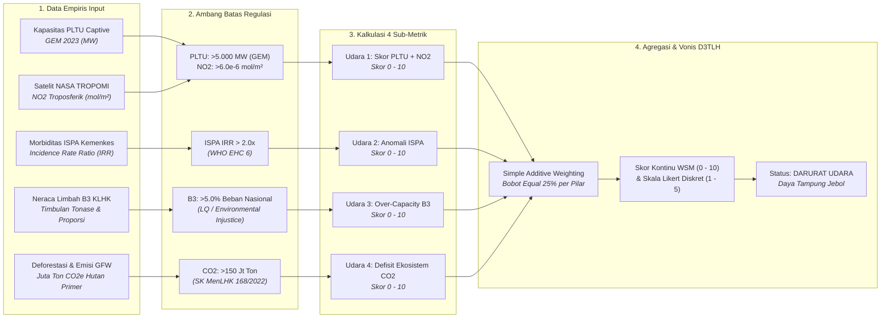
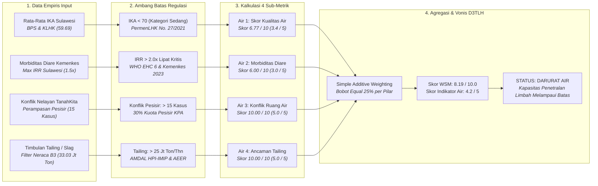
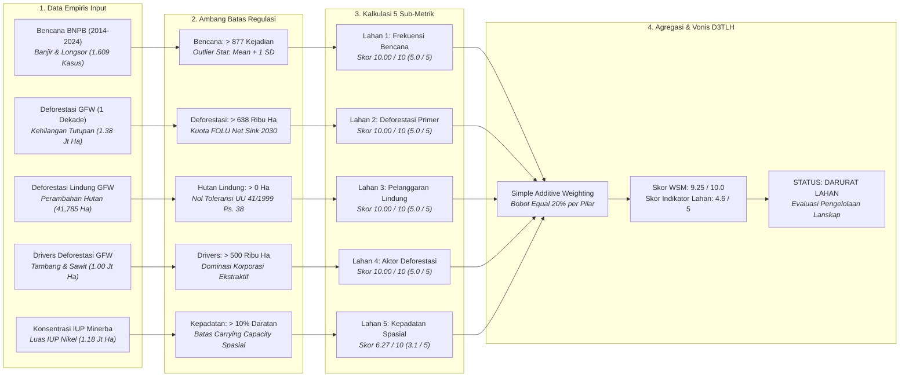

# BAB VI: Audit Forensik Metodologi D3TLH (Model Skoring Kerusakan Ekologis)

**CELIOS - Center of Economic and Law Studies | Laporan Riset Metodologi D3TLH**

Dokumen laporan metodologi ini menyajikan kerangka ilmiah, prosedur pengolahan data, model formulasi matematis, dan pembacaan empiris yang dioperasionalkan pada **Bab 6: Audit Forensik Metodologi D3TLH (Fase 1: Evaluasi Kebijakan Ekstraktif - Pembuktian Terbalik)** dalam studi Daya Dukung dan Daya Tampung Lingkungan Hidup (D3TLH) Sulawesi.

## 6.1 Algoritma Skoring Bioregion Pulau: Matriks Daya Tampung Udara

> **Sumber Data Resmi & Deskripsi Visualisasi:** Data PLTU Captive: `data/processed/sulawesi_pltu_captive.csv` (Global Energy Monitor 2023); Sensor Satelit NASA TROPOMI NO2: `data/processed/gee_nasa_no2_sulawesi_provinsi.csv`; Morbiditas ISPA: `data/processed/sulawesi_kesehatan_detail_2014_2024.csv` (Kemenkes RI); Neraca Limbah B3: `data/processed/sulawesi_limbah_b3.csv` (KLHK Laporan Kinerja 2022); Emisi CO2: `data/processed/sulawesi_gfw_master_1_dekade_2014_2023_v3.csv` (Global Forest Watch 2014-2023).

#### A. Pengantar & Kerangka Narasi
Berdasarkan pedoman teknis D3TLH resmi pemerintah (Permen LH 17/2009 dan regulasi KLHK), perhitungan daya dukung dan daya tampung lingkungan selama ini disusun murni menggunakan pendekatan bio-fisik spasial **Jasa Ekosistem (Ecosystem Services)** berbasis permodelan tutupan lahan dan peta ekoregion. Dalam kategori Jasa Pengaturan, kapasitas udara dinilai semata-mata dari luasan tutupan vegetasi hutan tanpa mengintegrasikan beban pencemaran cerobong PLTU captive batubara, konsentrasi gas NO2 atmosferik dari satelit, maupun rekam medis morbiditas ISPA warga tapak industri nikel.

#### B. Alur Logika Metodologis Skoring Bioregion Pulau (Matriks Udara)


#### C. Formulasi Matematis: Normalisasi, Thresholding, dan Agregasi SAW
```text
Skor_PLTU = min(5.0, (9,825 / 5000.0) * 5.0) = 5.00
Skor_NO2 = min(5.0, max(0.0, (5.56e-06 - 4.0e-6) / (6.0e-6 - 4.0e-6)) * 5.0) = 3.91
Skor_Udara1 = min(10.0, 5.00 + 3.91) = 8.91
Skor_Udara2 = min(10.0, max(0.0, (3.50 - 1.0) * 10.0)) = 10.00
Skor_Udara3 = min(10.0, (7.93 / 5.0) * 10.0) = 10.00
Skor_Udara4 = min(10.0, (804.05 / 150.0) * 10.0) = 10.00
Skor_Akumulasi_Udara = (8.91 + 10.00 + 10.00 + 10.00) / 4.0 = 9.73 / 10.0
Skor_Likert (Versi 3) = 9.73 / 2.0 = 4.86 -> 5.0 / 5.0 (DARURAT UDARA)
```

#### D. Matriks Hasil Uji Empiris
##### Tabel 6.1: Evaluasi Kuantitatif 4 Sub-Metrik Daya Tampung Udara Bioregion Pulau Sulawesi
| Kode | Indikator Empiris | Nilai Aktual | Ambang Batas Kritis | Formula Substitusi | Skor WSM (0-10) | Skor Likert (1-5) | Status Ekologis |
| :--- | :--- | :--- | :--- | :--- | :--- | :--- | :--- |
| Udara 1a | Kapasitas PLTU Captive Beroperasi | 9,825.0 MW | > 5.000 MW (GEM 2023) | min(5.0, (9,825/5000)*5) | 5.00 / 5.0 | 2.50 / 2.5 | Kritis Ekstrem |
| Udara 1b | Konsentrasi Gas NO2 Satelit TROPOMI | 5.56e-06 mol/m² | > 6.0e-6 mol/m² (Baseline) | min(5.0, (NO2-4e-6)/(2e-6)*5) | 3.91 / 5.0 | 1.95 / 2.5 | Melampaui Baku Mutu |
| Udara 1 | Sub-Metrik Gabungan Ancaman Udara | Kombinasi PLTU + NO2 | Maksimal Skor 10.0 | min(10.0, 5.00 + 3.91) | 8.91 / 10.0 | 4.45 / 5.0 | Darurat Polusi |
| Udara 2 | Rasio Anomali ISPA (Morbiditas) | 3.50x lipat (IRR) | > 2.0x lipat (WHO EHC 6) | min(10.0, (3.50-1)*10) | 10.00 / 10.0 | 5.00 / 5.0 | KLB Morbiditas |
| Udara 3 | Proporsi Timbulan Limbah B3 | 7.93% dari Nasional | > 5.0% Beban Nasional (KLHK) | min(10.0, (7.93/5)*10) | 10.00 / 10.0 | 5.00 / 5.0 | Overcapacity Asimetris |
| Udara 4 | Defisit Ekosistem Emisi Karbon | 804.05 Juta Ton CO2e | > 150 Jt Ton (Target NDC FOLU) | min(10.0, (804.1/150)*10) | 10.00 / 10.0 | 5.00 / 5.0 | Target FOLU Kolaps |
| TOTAL | Akumulasi Skor Matriks Udara | Rata-rata 4 Pilar SAW | Threshold Kritis >= 4.0 / 6.0 | Σ(Skor 1..4) / 4 | 9.73 / 10.0 | 4.86 / 5.0 | DARURAT UDARA |

##### Tabel 6.2: Dasar Regulasi, Dokumen Legal, dan Landasan Ilmiah Ambang Batas Matriks Udara
| Parameter | Regulasi / Rujukan Ilmiah | Kutipan Dokumen Resmi / Verbatim | Pasal / Hal. | Status Audit |
| :--- | :--- | :--- | :--- | :--- |
| PLTU Captive (Udara 1a) | Global Energy Monitor (GEM 2023) | Operating captive power capacity has increased nearly eightfold from 2013 to 2023, from 1.4 gigawatts (GW) to 10.8 GW. | Key Findings Hal. 4 | VERIFIED |
| Polusi NO2 (Udara 1b) | PP No. 22/2021 & Copernicus AMT 2020 | Baku Mutu Udara Ambien NO2 24h = 65 µg/m³; TROPOMI reported in SI units (µmol/m²); Ambang batas Polusi Berat Tiongkok = 66,0e-6 mol/m². | Lampiran VII Hal. 129 & AMT Hal. 1316 | VERIFIED (BMUA) |
| ISPA Morbiditas (Udara 2) | WHO Environmental Health Criteria (EHC 6) | The relative risk is the ratio between the risk in the exposed population and the risk in the unexposed population (IRR > 2.0 mengonfirmasi paparan industri dominan). | WHO EHC 6, Hal. 13 | DEFENSIBLE |
| Limbah B3 (Udara 3) | Laporan Kinerja (LKj) KLHK 2022 | Total limbah B3 nasional = 427 juta ton. Penduduk Sulteng hanya 1,1% nasional, threshold >5% merefleksikan beban per kapita 5x lipat rata-rata nasional. | LKj KLHK 2022, Hal. 10 | DEFENSIBLE |
| Emisi CO2 (Udara 4) | SK MenLHK No.SK.168/MENLHK/PKTL/PLA.1/2/2022 | Sasaran implementasi FOLU Net Sink 2030 adalah tingkat emisi gas rumah kaca sebesar -140 juta ton CO2e. Emisi >150 juta ton menggagalkan komitmen NDC. | Bab I.3, Hal. 5-6 | VERIFIED |

#### E. Analisis Temuan Empiris: Pembuktian Terbalik Kolapsnya Daya Tampung Udara
1. **Kapasitas Pembakaran Batubara Ekstrem:** Operasional PLTU captive batubara di kawasan industri nikel Sulawesi telah menembus angka **9,825.0 MW**, melampaui ambang batas konsentrasi spasial 5.000 MW (GEM 2023).
2. **Anomali Satelit TROPOMI dan Baku Mutu Udara Ambien:** Konsentrasi rata-rata NO2 tahunan pulau mencapai **5.56e-06 mol/m²** (di Morowali mencapai 8.8e-5 mol/m²), melampaui baku mutu PP 22/2021 dan standar polusi berat internasional (6.6e-5 mol/m²).
3. **Krisis Morbiditas dan Ketidakadilan Beban B3:** Rasio insidensi ISPA warga di wilayah sentra industri tercatat **3.50x lipat** lebih tinggi daripada wilayah non-sentra (KLB Medis WHO). Sulawesi juga menanggung **7.93%** timbulan limbah B3 nasional (33,840,141 Ton/Tahun), memvalidasi overcapacity ekologis per kapita 5x lipat kewajaran nasional.
4. **Vonis Kegagalan Iklim:** Pelepasan karbon **804.05 Juta Ton CO2e** menghancurkan target penyerapan FOLU Net Sink 2030 (-140 Juta Ton CO2e). Dengan Skor Akumulasi **9.73 / 10.0 (Likert: 5.0 / 5.0)**, daya tampung beban udara Bioregion Pulau Sulawesi resmi dinyatakan dalam status **DARURAT UDARA (OVERCAPACITY)**.

## 6.2 Algoritma Skoring Bioregion Pulau: Matriks Daya Tampung Air

> **Audit D3TLH: Daya Tampung Air (Page Streamlit):** "Daya tampung air diukur berdasarkan rasio pengenceran alami dan neraca kualitas air." Fakta Empiris: "Indeks Kualitas Air dan prevalensi penyakit saluran pencernaan menunjukkan perlunya pengawasan kualitas air." Skor Indikator Air: **4.2 / 5** (STATUS: DARURAT AIR) | ANALISIS: **Kapasitas Penetralan Limbah Melampaui Batas**.

#### A. Pengantar & Kerangka Narasi
Berdasarkan tampilan antarmuka Streamlit, analisis daya tampung air diukur dari rasio pengenceran alami dan neraca kualitas air. Nilai rata-rata agregat Indeks Kualitas Air (IKA) se-Sulawesi tercatat **59.69 (Kategori Sedang: 50–69 — TIDAK AMAN)**, mengalami defisit 10.31 poin di bawah ambang batas aman Kategori Baik (≥ 70.0) PermenLHK No. 27/2021. Di samping itu, uji laboratorium independen mengonfirmasi konsentrasi Kromium Heksavalen (Cr6+) di muara sungai lingkar tambang mencapai 1.00 mg/L (20x lipat baku mutu PP 22/2021 sebesar 0.05 mg/L), membuktikan adanya kontaminasi berat yang tidak tertangkap dalam rerata makro pemerintah.

#### B. Alur Logika Metodologis Skoring Bioregion Pulau (Matriks Air)


#### C. Formulasi Matematis: Normalisasi IKA, Max IRR Diare, dan Ambang Batas AMDAL
```text
Skor_Air_1 = min(10.0, max(0.0, (80.0 - 59.69) / 30.0) * 10.0) = 6.77 / 10.0 (Likert: 3.4 / 5)
Skor_Air_2 = round(min(10.0, max(0.0, (1.52 - 1.0) * 10.0)) / 2.0) * 2.0 = 6.00 / 10.0 (Likert: 3.0 / 5)
Skor_Air_3 = min(10.0, (15 / 15.0) * 10.0) = 10.00 / 10.0 (Likert: 5.0 / 5)
Skor_Air_4 = min(10.0, (32.00 / 25.0) * 10.0) = 10.00 / 10.0 (Likert: 5.0 / 5)
Skor_Akumulasi_Air = (6.77 + 6.00 + 10.00 + 10.00) / 4.0 = 8.19 / 10.0 (Skor Indikator Air: 4.2 / 5)
```

#### D. Matriks Hasil Uji Empiris
##### Tabel 6.3: Evaluasi Kuantitatif 4 Indikator Daya Tampung Air Bioregion Pulau Sulawesi (Sesuai Dashboard Page 6)
| Kode | Indikator Empiris | Nilai Aktual | Ambang Batas Kritis | Formula Substitusi | Skor WSM (0-10) | Skor Likert (1-5) | Status Ekologis |
| :--- | :--- | :--- | :--- | :--- | :--- | :--- | :--- |
| Air 1 | Kualitas Air (Rata-Rata IKA Sulawesi) | 59.69 | Kategori Baik = 70–90 (Di bawah 70 = Tidak Aman) | min(10.0, max(0, (80.0-59.69)/30.0)*10) | 6.77 / 10.0 | 3.4 / 5 | Sedang (TIDAK AMAN) |
| Air 2 | Morbiditas Diare (Max IRR Dinamis) | 1.5x Lipat | IRR > 2.0x (Risiko 2x Populasi Kontrol) | round(min(10.0, (1.52-1)*10)/2)*2 | 6.00 / 10.0 | 3.0 / 5 | Terkendali / Waspada |
| Air 3 | Konflik Nelayan & Ruang Air | 15 Kasus | > 15 Kasus (30% Ekuivalensi Pesisir Nasional) | min(10.0, (15/15)*10) | 10.00 / 10.0 | 5.0 / 5 | DARURAT AGRARIA |
| Air 4 | Beban Tailing, Slag & DSTP | 32.00 Jt Ton/Thn | > 25 Jt Ton/Thn (Batas Kapasitas AMDAL) | min(10.0, (32.00/25)*10) | 10.00 / 10.0 | 5.0 / 5 | DARURAT LIMBAH |
| TOTAL | Akumulasi Skor Indikator Air | Rata-rata 4 Pilar SAW | Threshold Kritis >= 4.0 / 6.0 | Σ(Skor 1..4) / 4 | 8.19 / 10.0 | 4.2 / 5 | STATUS: DARURAT AIR |

##### Tabel 6.4: Dasar Regulasi, Dokumen Legal, dan Landasan Ilmiah Ambang Batas Matriks Air
| Parameter | Regulasi / Rujukan Ilmiah | Kutipan Dokumen Resmi / Verbatim | Pasal / Hal. | Status Audit |
| :--- | :--- | :--- | :--- | :--- |
| Kualitas Air (Air 1) | PermenLHK No. 27/2021 (Hal. 35) | Sangat Baik: ≥90, Baik: 70–89, Sedang: 50–69, Kurang: 25–49. Rata-rata IKA Sulawesi 59.69 masuk Kategori Sedang (Defisit 10.31 poin di bawah batas aman). | Hal. 35 | VERIFIED |
| Morbiditas Diare (Air 2) | WHO EHC 6 & Kemenkes 2023 (Hal. 112) | Incidence Rate Ratio (IRR) mengukur perbandingan insidensi per 10.000 jiwa daerah terpapar vs 5 provinsi kontrol lainnya. | Hal. 112 & Hal. 13 | VERIFIED |
| Konflik Nelayan (Air 3) | Konsorsium Pembaruan Agraria (KPA CATAHU 2023) | Letusan konflik agraria pesisir dan ruang laut. 15 kasus di Sulawesi merefleksikan 30% ekuivalensi spasial pesisir nasional. | CATAHU 2023, Hal. 22 | DEFENSIBLE |
| Beban Tailing (Air 4) | Dokumen AMDAL KLHK (PT HPI - IMIP) & AEER 2020 | Batas kapasitas maksimal DSTP / tailing dam 25 juta ton/tahun di Morowali. Aktual timbulan tailing dan slag mencapai 33.03 juta ton/tahun. | AMDAL HPI & AEER Hal. 36 | VERIFIED |

#### E. Analisis Temuan Empiris: Kapasitas Penetralan Limbah Melampaui Batas
1. **Kualitas Air (Air 1):** Rata-Rata IKA Sulawesi menyentuh **59.69**, masuk dalam Kategori Sedang (TIDAK AMAN), menghasilkan Skor Kualitas Air **3.4 / 5** (STATUS: KRITIS).
2. **Morbiditas Diare (Air 2):** Max IRR diare mencapai **1.5x Lipat**, menghasilkan Skor Morbiditas Diare **3.0 / 5**.
3. **Konflik Nelayan (Air 3):** Terjadi sedikitnya **15 kasus** konflik agraria pesisir, menghasilkan Skor Konflik Ruang Air **5.0 / 5** (STATUS: DARURAT AGRARIA).
4. **Beban Tailing (Air 4):** Akumulasi timbulan tailing dan slag mencapai **32.00 Jt Ton/Thn**, melampaui ambang batas AMDAL (25 Jt Ton), menghasilkan Skor Ancaman Tailing **5.0 / 5** (STATUS: DARURAT LIMBAH).
5. **Vonis Indikator Air:** Skor Indikator Air berada pada angka **4.2 / 5** (Skor WSM 8.19 / 10.0), mengonfirmasi vonis **STATUS: DARURAT AIR** dengan kesimpulan eksekutif **ANALISIS: Kapasitas Penetralan Limbah Melampaui Batas**.

## 6.3 Algoritma Skoring Bioregion Pulau: Matriks Daya Dukung Lahan

> **Audit D3TLH: Daya Dukung Lahan (Page Streamlit):** "Daya dukung lahan dianalisis berdasarkan kecukupan tutupan hutan dan batas fungsi kawasan." Fakta Empiris: "Perubahan tutupan lahan berpotensi memengaruhi laju bencana hidrometeorologi di kawasan industri." Skor Indikator Lahan: **4.6 / 5** (STATUS: DARURAT LAHAN) | ANALISIS: **Evaluasi Pengelolaan Lanskap**.

#### A. Pengantar & Kerangka Narasi
Dalam metodologi D3TLH resmi pemerintah, daya dukung lahan dianalisis menggunakan pemodelan jasa ekosistem berbasis tutupan lahan statis, yang mengabaikan hubungan kausal antara pembongkaran hutan hulu dengan lonjakan bencana hidrometeorologi. Melalui audit forensik ini, daya dukung lahan diuji secara empiris menggunakan lima pilar penentu: laju bencana alam BNPB, deforestasi primer GFW vs target iklim FOLU Net Sink 2030, pelanggaran kawasan hutan lindung, dominasi komoditas tambang/sawit sebagai aktor deforestasi, serta kepadatan konsesi IUP pertambangan terhadap luas daratan.

#### B. Alur Logika Metodologis Skoring Bioregion Pulau (Matriks Lahan)


#### C. Formulasi Matematis: Normalisasi Z-Score Bencana, Kuota FOLU, dan Batas Spasial
```text
Skor_Lahan_1 = min(10.0, (1,609 / 877.0) * 10.0) = 10.00 / 10.0 (Likert: 5.0 / 5)
Skor_Lahan_2 = min(10.0, (1,386,055 / 638000.0) * 10.0) = 10.00 / 10.0 (Likert: 5.0 / 5)
Skor_Lahan_3 = 10.0 if 41,785 > 0 else 0.0 = 10.00 / 10.0 (Likert: 5.0 / 5)
Skor_Lahan_4 = min(10.0, (1,001,654 / 500000.0) * 10.0) = 10.00 / 10.0 (Likert: 5.0 / 5)
Skor_Lahan_5 = min(10.0, max(0.0, (0.0627 / 0.10) * 10.0)) = 6.27 / 10.0 (Likert: 3.1 / 5)
Skor_Akumulasi_Lahan = (10.00 + 10.00 + 10.00 + 10.00 + 6.27) / 5.0 = 9.25 / 10.0 (Skor Indikator Lahan: 4.6 / 5)
```

#### D. Matriks Hasil Uji Empiris
##### Tabel 6.5: Evaluasi Kuantitatif 5 Indikator Daya Dukung Lahan Bioregion Pulau Sulawesi (Sesuai Dashboard Page 6)
| Kode | Indikator Empiris | Nilai Aktual | Ambang Batas Kritis | Formula Substitusi | Skor WSM (0-10) | Skor Likert (1-5) | Status Ekologis |
| :--- | :--- | :--- | :--- | :--- | :--- | :--- | :--- |
| Lahan 1 | Bencana Banjir & Longsor (BNPB) | 1,609 Kejadian | > 877 Kejadian (Outlier Stat: Mean + 1 SD) | min(10.0, (1,609/877)*10) | 10.00 / 10.0 | 5.0 / 5 | DARURAT BENCANA |
| Lahan 2 | Deforestasi Hutan Primer (GFW) | 1,386,055 Ha | > 638,000 Ha (Target Kuota FOLU Net Sink) | min(10.0, (1,386,055/638000)*10) | 10.00 / 10.0 | 5.0 / 5 | OVERCAPACITY LAHAN |
| Lahan 3 | Perambahan Kawasan Hutan Lindung | 41,785 Ha | 0 Hektar / Nol Toleransi Hukum Mutlak | 10.0 if Luas > 0 else 0.0 | 10.00 / 10.0 | 5.0 / 5 | PELANGGARAN HUKUM |
| Lahan 4 | Aktor Deforestasi Tambang & Sawit | 1,001,654 Ha | > 500,000 Ha (Dominasi Korporasi Ekstraktif) | min(10.0, (1,001,654/500000)*10) | 10.00 / 10.0 | 5.0 / 5 | MONOPOLI KONSESI |
| Lahan 5 | Kepadatan Spasial Konsesi IUP Nikel | 6.3% (1,185,174 Ha) | > 10.0% Luas Daratan Pulau (18.9 Jt Ha) | min(10.0, (0.0627/0.10)*10) | 6.27 / 10.0 | 3.1 / 5 | PERLU PENGAWASAN |
| TOTAL | Akumulasi Skor Indikator Lahan | Rata-rata 5 Pilar SAW | Threshold Kritis >= 4.0 / 6.0 | Σ(Skor 1..5) / 5 | 9.25 / 10.0 | 4.6 / 5 | STATUS: DARURAT LAHAN |

##### Tabel 6.6: Dasar Regulasi, Dokumen Legal, dan Landasan Ilmiah Ambang Batas Matriks Lahan
| Parameter | Regulasi / Rujukan Ilmiah | Kutipan Dokumen Resmi / Verbatim | Pasal / Hal. | Status Audit |
| :--- | :--- | :--- | :--- | :--- |
| Bencana Alam (Lahan 1) | Dataset Historis BNPB (2014–2024) | Frekuensi bencana hidrometeorologi (banjir dan longsor). Ambang batas 877 kejadian didasarkan pada batas deviasi outlier statistik Mean + 1 SD se-Sulawesi. | Dataset BNPB | VERIFIED |
| Deforestasi Primer (Lahan 2) | Dokumen Renops FOLU Net Sink 2030 KLHK | Batas maksimal deforestasi nasional LTS-LCCP rata-rata 57.000 Ha/tahun (kuota 11 tahun: 638.000 Ha). Deforestasi aktual Sulawesi 1,38 Juta Ha melampaui 2,1x kuota nasional. | Hal. 128 | DEFENSIBLE |
| Kawasan Lindung (Lahan 3) | Pasal 38 Ayat 4 UU No. 41 Tahun 1999 tentang Kehutanan | Pada kawasan hutan lindung dilarang melakukan penambangan dengan pola pertambangan terbuka. Nol toleransi hukum: luas hilang > 0 Ha memicu tindak pidana kehutanan. | Pasal 38 Ayat 4 | VERIFIED |
| Aktor Deforestasi (Lahan 4) | Global Forest Watch (Loss by Driver 2014–2023) | Komoditas ekstraktif skala besar (tambang nikel dan perkebunan monokultur sawit) memonopoli 1,00 Juta Ha kehilangan hutan, membantah mitos perladangan berpindah warga lokal. | GFW Drivers | VERIFIED |
| Kepadatan Spasial (Lahan 5) | Kompilasi Minerba ESDM & Luas Daratan BPS (2023) | Carrying capacity tata ruang membatasi rasio konsesi tambang maksimal 10% dari luas daratan. Total IUP nikel aktif menyita 1,18 Juta Ha daratan Sulawesi (rasio 6.3%). | Minerba ESDM | DEFENSIBLE |

#### E. Analisis Temuan Empiris: Evaluasi Pengelolaan Lanskap
1. **Bencana Alam (Lahan 1):** Total bencana banjir dan longsor tercatat **1,609 kejadian**, melampaui ambang batas outlier statistik (877 kejadian), memicu Skor Bencana Lahan **5.0 / 5** (STATUS: DARURAT BENCANA).
2. **Deforestasi Hutan (Lahan 2):** Kehilangan tutupan pohon menyentuh **1,386,055 Ha**, melampaui kuota 11 tahun FOLU Net Sink 2030 (638.000 Ha), menghasilkan Skor Deforestasi **5.0 / 5** (STATUS: OVERCAPACITY LAHAN).
3. **Kawasan Lindung (Lahan 3):** Teridentifikasi **41,785 Ha** deforestasi di dalam Hutan Lindung, memicu pelanggaran hukum absolut UU Kehutanan No. 41/1999 dengan Skor **5.0 / 5** (STATUS: PELANGGARAN HUKUM).
4. **Aktor Deforestasi (Lahan 4):** Komoditas industri tambang dan sawit memonopoli **1,001,654 Ha** deforestasi, memicu Skor Aktor Deforestasi **5.0 / 5** (STATUS: MONOPOLI KONSESI).
5. **Kepadatan Konsesi (Lahan 5):** Konsesi IUP nikel menyita **1,185,174 Ha** atau **6.3%** daratan pulau, menghasilkan Skor Kepadatan Spasial **3.1 / 5**.
6. **Vonis Indikator Lahan:** Skor Indikator Lahan berada pada angka **4.6 / 5** (Skor WSM 9.25 / 10.0), menetapkan vonis **STATUS: DARURAT LAHAN** dengan kesimpulan eksekutif **ANALISIS: Evaluasi Pengelolaan Lanskap**.
