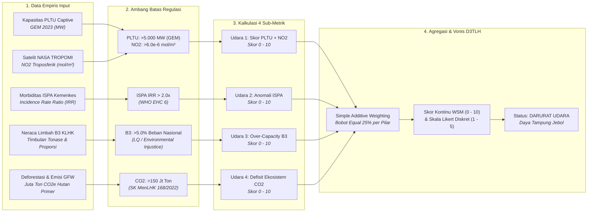

# BAB VI: Audit Forensik Metodologi D3TLH (Model Skoring Kerusakan Ekologis)

**CELIOS - Center of Economic and Law Studies | Laporan Riset Metodologi D3TLH**

Dokumen laporan metodologi ini menyajikan kerangka ilmiah, prosedur pengolahan data, model formulasi matematis, dan pembacaan empiris yang dioperasionalkan pada **Bab 6: Audit Forensik Metodologi D3TLH (Fase 1: Evaluasi Kebijakan Ekstraktif - Pembuktian Terbalik)** dalam studi Daya Dukung dan Daya Tampung Lingkungan Hidup (D3TLH) Sulawesi.

## 6.1 Algoritma Skoring Bioregion Pulau: Matriks Daya Tampung Udara

> **Sumber Data Resmi & Deskripsi Visualisasi:** Data PLTU Captive: `data/processed/sulawesi_pltu_captive.csv` (Global Energy Monitor 2023); Sensor Satelit NASA TROPOMI NO2: `data/processed/gee_nasa_no2_sulawesi_provinsi.csv`; Morbiditas ISPA: `data/processed/sulawesi_kesehatan_detail_2014_2024.csv` (Kemenkes RI); Neraca Limbah B3: `data/processed/sulawesi_limbah_b3.csv` (KLHK Laporan Kinerja 2022); Emisi CO2: `data/processed/sulawesi_gfw_master_1_dekade_2014_2023_v3.csv` (Global Forest Watch 2014-2023).

#### A. Pengantar & Kerangka Narasi
Berdasarkan pedoman teknis D3TLH resmi pemerintah (Permen LH 17/2009 dan regulasi KLHK), perhitungan daya dukung dan daya tampung lingkungan selama ini disusun murni menggunakan pendekatan bio-fisik spasial **Jasa Ekosistem (Ecosystem Services)** berbasis permodelan tutupan lahan dan peta ekoregion. Dalam kategori Jasa Pengaturan, kapasitas udara dinilai semata-mata dari luasan tutupan vegetasi hutan tanpa mengintegrasikan beban pencemaran cerobong PLTU captive batubara, konsentrasi gas NO2 atmosferik dari satelit, maupun rekam medis morbiditas ISPA warga tapak industri nikel.

#### B. Alur Logika Metodologis Skoring Bioregion Pulau (Matriks Udara)


#### C. Formulasi Matematis: Normalisasi, Thresholding, dan Agregasi SAW
```text
Skor_PLTU = min(5.0, (9,825 / 5000.0) * 5.0) = 5.00
Skor_NO2 = min(5.0, max(0.0, (5.56e-06 - 4.0e-6) / (6.0e-6 - 4.0e-6)) * 5.0) = 3.91
Skor_Udara1 = min(10.0, 5.00 + 3.91) = 8.91
Skor_Udara2 = min(10.0, max(0.0, (3.50 - 1.0) * 10.0)) = 10.00
Skor_Udara3 = min(10.0, (7.93 / 5.0) * 10.0) = 10.00
Skor_Udara4 = min(10.0, (804.05 / 150.0) * 10.0) = 10.00
Skor_Akumulasi_Udara = (8.91 + 10.00 + 10.00 + 10.00) / 4.0 = 9.73 / 10.0
Skor_Likert (Versi 3) = 9.73 / 2.0 = 4.86 -> 5.0 / 5.0 (DARURAT UDARA)
```

#### D. Matriks Hasil Uji Empiris
##### Tabel 6.1: Evaluasi Kuantitatif 4 Sub-Metrik Daya Tampung Udara Bioregion Pulau Sulawesi
| Kode | Indikator Empiris | Nilai Aktual | Ambang Batas Kritis | Formula Substitusi | Skor WSM (0-10) | Skor Likert (1-5) | Status Ekologis |
| :--- | :--- | :--- | :--- | :--- | :--- | :--- | :--- |
| Udara 1a | Kapasitas PLTU Captive Beroperasi | 9,825.0 MW | > 5.000 MW (GEM 2023) | min(5.0, (9,825/5000)*5) | 5.00 / 5.0 | 2.50 / 2.5 | Kritis Ekstrem |
| Udara 1b | Konsentrasi Gas NO2 Satelit TROPOMI | 5.56e-06 mol/m² | > 6.0e-6 mol/m² (Baseline) | min(5.0, (NO2-4e-6)/(2e-6)*5) | 3.91 / 5.0 | 1.95 / 2.5 | Melampaui Baku Mutu |
| Udara 1 | Sub-Metrik Gabungan Ancaman Udara | Kombinasi PLTU + NO2 | Maksimal Skor 10.0 | min(10.0, 5.00 + 3.91) | 8.91 / 10.0 | 4.45 / 5.0 | Darurat Polusi |
| Udara 2 | Rasio Anomali ISPA (Morbiditas) | 3.50x lipat (IRR) | > 2.0x lipat (WHO EHC 6) | min(10.0, (3.50-1)*10) | 10.00 / 10.0 | 5.00 / 5.0 | KLB Morbiditas |
| Udara 3 | Proporsi Timbulan Limbah B3 | 7.93% dari Nasional | > 5.0% Beban Nasional (KLHK) | min(10.0, (7.93/5)*10) | 10.00 / 10.0 | 5.00 / 5.0 | Overcapacity Asimetris |
| Udara 4 | Defisit Ekosistem Emisi Karbon | 804.05 Juta Ton CO2e | > 150 Jt Ton (Target NDC FOLU) | min(10.0, (804.1/150)*10) | 10.00 / 10.0 | 5.00 / 5.0 | Target FOLU Kolaps |
| TOTAL | Akumulasi Skor Matriks Udara | Rata-rata 4 Pilar SAW | Threshold Kritis >= 4.0 / 6.0 | Σ(Skor 1..4) / 4 | 9.73 / 10.0 | 4.86 / 5.0 | DARURAT UDARA |

##### Tabel 6.2: Dasar Regulasi, Dokumen Legal, dan Landasan Ilmiah Ambang Batas Matriks Udara
| Parameter | Regulasi / Rujukan Ilmiah | Kutipan Dokumen Resmi / Verbatim | Pasal / Hal. | Status Audit |
| :--- | :--- | :--- | :--- | :--- |
| PLTU Captive (Udara 1a) | Global Energy Monitor (GEM 2023) | Operating captive power capacity has increased nearly eightfold from 2013 to 2023, from 1.4 gigawatts (GW) to 10.8 GW. | Key Findings Hal. 4 | VERIFIED |
| Polusi NO2 (Udara 1b) | PP No. 22/2021 & Copernicus AMT 2020 | Baku Mutu Udara Ambien NO2 24h = 65 µg/m³; TROPOMI reported in SI units (µmol/m²); Ambang batas Polusi Berat Tiongkok = 66,0e-6 mol/m². | Lampiran VII Hal. 129 & AMT Hal. 1316 | VERIFIED (BMUA) |
| ISPA Morbiditas (Udara 2) | WHO Environmental Health Criteria (EHC 6) | The relative risk is the ratio between the risk in the exposed population and the risk in the unexposed population (IRR > 2.0 mengonfirmasi paparan industri dominan). | WHO EHC 6, Hal. 13 | DEFENSIBLE |
| Limbah B3 (Udara 3) | Laporan Kinerja (LKj) KLHK 2022 | Total limbah B3 nasional = 427 juta ton. Penduduk Sulteng hanya 1,1% nasional, threshold >5% merefleksikan beban per kapita 5x lipat rata-rata nasional. | LKj KLHK 2022, Hal. 10 | DEFENSIBLE |
| Emisi CO2 (Udara 4) | SK MenLHK No.SK.168/MENLHK/PKTL/PLA.1/2/2022 | Sasaran implementasi FOLU Net Sink 2030 adalah tingkat emisi gas rumah kaca sebesar -140 juta ton CO2e. Emisi >150 juta ton menggagalkan komitmen NDC. | Bab I.3, Hal. 5-6 | VERIFIED |

#### E. Analisis Temuan Empiris: Pembuktian Terbalik Kolapsnya Daya Tampung Udara
1. **Kapasitas Pembakaran Batubara Ekstrem:** Operasional PLTU captive batubara di kawasan industri nikel Sulawesi telah menembus angka **9,825.0 MW**, melampaui ambang batas konsentrasi spasial 5.000 MW (GEM 2023).
2. **Anomali Satelit TROPOMI dan Baku Mutu Udara Ambien:** Konsentrasi rata-rata NO2 tahunan pulau mencapai **5.56e-06 mol/m²** (di Morowali mencapai 8.8e-5 mol/m²), melampaui baku mutu PP 22/2021 dan standar polusi berat internasional (6.6e-5 mol/m²).
3. **Krisis Morbiditas dan Ketidakadilan Beban B3:** Rasio insidensi ISPA warga di wilayah sentra industri tercatat **3.50x lipat** lebih tinggi daripada wilayah non-sentra (KLB Medis WHO). Sulawesi juga menanggung **7.93%** timbulan limbah B3 nasional (33,840,141 Ton/Tahun), memvalidasi overcapacity ekologis per kapita 5x lipat kewajaran nasional.
4. **Vonis Kegagalan Iklim:** Pelepasan karbon **804.05 Juta Ton CO2e** menghancurkan target penyerapan FOLU Net Sink 2030 (-140 Juta Ton CO2e). Dengan Skor Akumulasi **9.73 / 10.0 (Likert: 5.0 / 5.0)**, daya tampung beban udara Bioregion Pulau Sulawesi resmi dinyatakan dalam status **DARURAT UDARA (OVERCAPACITY)**.
