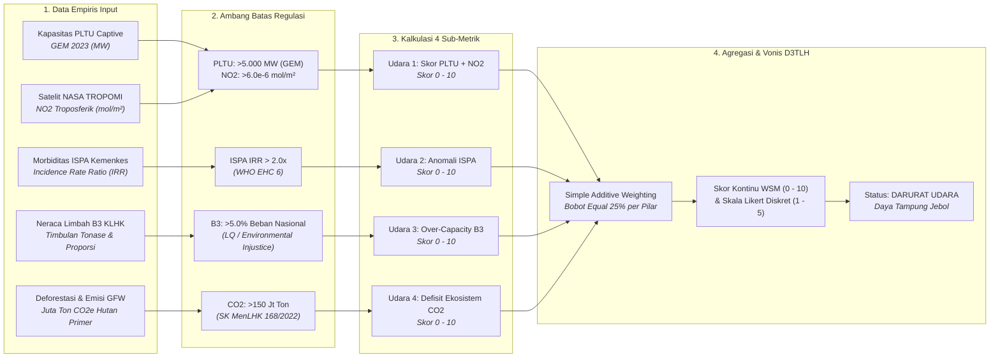
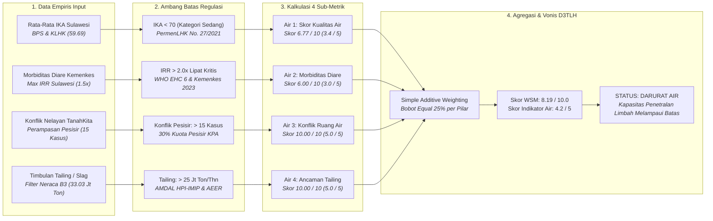
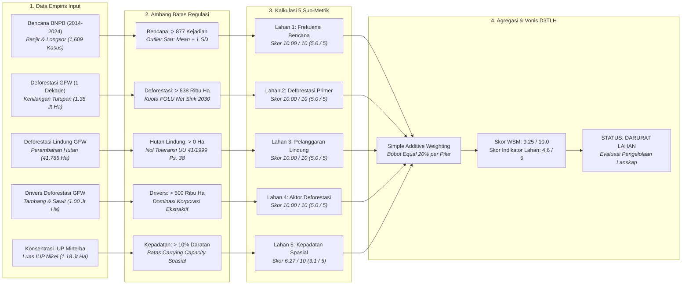
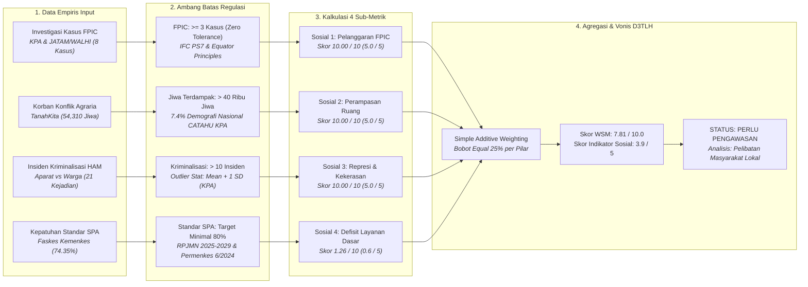
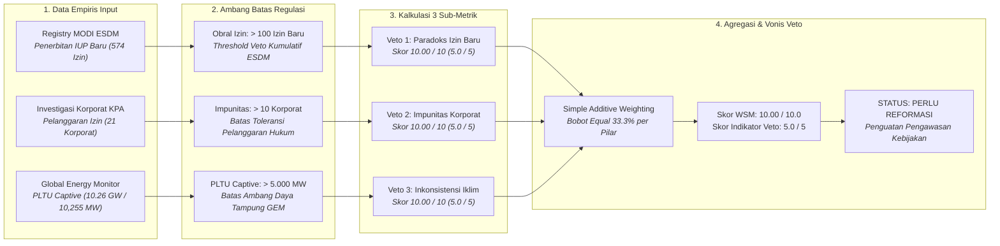

# BAB VI: Audit Forensik Metodologi D3TLH (Model Skoring Kerusakan Ekologis)

**CELIOS - Center of Economic and Law Studies | Laporan Riset Metodologi D3TLH**

Dokumen laporan metodologi ini menyajikan kerangka ilmiah, prosedur pengolahan data, model formulasi matematis, dan pembacaan empiris yang dioperasionalkan pada **Bab 6: Audit Forensik Metodologi D3TLH (Fase 1: Evaluasi Kebijakan Ekstraktif - Pembuktian Terbalik)** dalam studi Daya Dukung dan Daya Tampung Lingkungan Hidup (D3TLH) Sulawesi.

## 6.1 Algoritma Skoring Bioregion Pulau: Matriks Daya Tampung Udara

> **Sumber Data Resmi & Deskripsi Visualisasi:** Data PLTU Captive: `data/processed/sulawesi_pltu_captive.csv` (Global Energy Monitor 2023); Sensor Satelit NASA TROPOMI NO2: `data/processed/gee_nasa_no2_sulawesi_provinsi.csv`; Morbiditas ISPA: `data/processed/sulawesi_kesehatan_detail_2014_2024.csv` (Kemenkes RI); Neraca Limbah B3: `data/processed/sulawesi_limbah_b3.csv` (KLHK Laporan Kinerja 2022); Emisi CO2: `data/processed/sulawesi_gfw_master_1_dekade_2014_2023_v3.csv` (Global Forest Watch 2014-2023).

#### A. Pengantar & Kerangka Narasi
Berdasarkan pedoman teknis D3TLH resmi pemerintah (Permen LH 17/2009 dan regulasi KLHK), perhitungan daya dukung dan daya tampung lingkungan selama ini disusun murni menggunakan pendekatan bio-fisik spasial **Jasa Ekosistem (Ecosystem Services)** berbasis permodelan tutupan lahan dan peta ekoregion. Dalam kategori Jasa Pengaturan, kapasitas udara dinilai semata-mata dari luasan tutupan vegetasi hutan tanpa mengintegrasikan beban pencemaran cerobong PLTU captive batubara, konsentrasi gas NO2 atmosferik dari satelit, maupun rekam medis morbiditas ISPA warga tapak industri nikel.

#### B. Alur Logika Metodologis Skoring Bioregion Pulau (Matriks Udara)


#### C. Formulasi Matematis: Normalisasi, Thresholding, dan Agregasi SAW
```text
Skor_PLTU = min(5.0, (9,825 / 5000.0) * 5.0) = 5.00
Skor_NO2 = min(5.0, max(0.0, (5.56e-06 - 4.0e-6) / (6.0e-6 - 4.0e-6)) * 5.0) = 3.91
Skor_Udara1 = min(10.0, 5.00 + 3.91) = 8.91
Skor_Udara2 = min(10.0, max(0.0, (3.50 - 1.0) * 10.0)) = 10.00
Skor_Udara3 = min(10.0, (7.93 / 5.0) * 10.0) = 10.00
Skor_Udara4 = min(10.0, (804.05 / 150.0) * 10.0) = 10.00
Skor_Akumulasi_Udara = (8.91 + 10.00 + 10.00 + 10.00) / 4.0 = 9.73 / 10.0
Skor_Likert (Versi 3) = 9.73 / 2.0 = 4.86 -> 5.0 / 5.0 (DARURAT UDARA)
```

#### D. Matriks Hasil Uji Empiris
##### Tabel 6.1: Evaluasi Kuantitatif 4 Sub-Metrik Daya Tampung Udara Bioregion Pulau Sulawesi
| Kode | Indikator Empiris | Nilai Aktual | Ambang Batas Kritis | Formula Substitusi | Skor WSM (0-10) | Skor Likert (1-5) | Status Ekologis |
| :--- | :--- | :--- | :--- | :--- | :--- | :--- | :--- |
| Udara 1a | Kapasitas PLTU Captive Beroperasi | 9,825.0 MW | > 5.000 MW (GEM 2023) | min(5.0, (9,825/5000)*5) | 5.00 / 5.0 | 2.50 / 2.5 | Melampaui Batas |
| Udara 1b | Konsentrasi Gas NO2 Satelit TROPOMI | 5.56e-06 mol/m² | > 6.0e-6 mol/m² (Baseline) | min(5.0, (NO2-4e-6)/(2e-6)*5) | 3.91 / 5.0 | 1.95 / 2.5 | Melampaui Batas |
| Udara 1 | Sub-Metrik Gabungan Ancaman Udara | Kombinasi PLTU + NO2 | Maksimal Skor 10.0 | min(10.0, 5.00 + 3.91) | 8.91 / 10.0 | 4.45 / 5.0 | Melampaui Batas |
| Udara 2 | Rasio Anomali ISPA (Morbiditas) | 3.50x lipat (IRR) | > 2.0x lipat (WHO EHC 6) | min(10.0, (3.50-1)*10) | 10.00 / 10.0 | 5.00 / 5.0 | Melampaui Batas |
| Udara 3 | Proporsi Timbulan Limbah B3 | 7.93% dari Nasional | > 5.0% Beban Nasional (KLHK) | min(10.0, (7.93/5)*10) | 10.00 / 10.0 | 5.00 / 5.0 | Melampaui Batas |
| Udara 4 | Defisit Ekosistem Emisi Karbon | 804.05 Juta Ton CO2e | > 150 Jt Ton (Target NDC FOLU) | min(10.0, (804.1/150)*10) | 10.00 / 10.0 | 5.00 / 5.0 | Melampaui Batas |
| TOTAL | Akumulasi Skor Matriks Udara | Rata-rata 4 Pilar SAW | Threshold Kritis >= 4.0 / 6.0 | Σ(Skor 1..4) / 4 | 9.73 / 10.0 | 4.86 / 5.0 | Melampaui Batas |

##### Tabel 6.2: Dasar Regulasi, Dokumen Legal, dan Landasan Ilmiah Ambang Batas Matriks Udara
| Parameter | Regulasi / Rujukan Ilmiah | Kutipan Dokumen Resmi / Verbatim | Pasal / Hal. | Status Audit |
| :--- | :--- | :--- | :--- | :--- |
| PLTU Captive (Udara 1a) | Global Energy Monitor (GEM 2023) | Operating captive power capacity has increased nearly eightfold from 2013 to 2023, from 1.4 gigawatts (GW) to 10.8 GW. | Key Findings Hal. 4 | VERIFIED |
| Polusi NO2 (Udara 1b) | PP No. 22/2021 & Copernicus AMT 2020 | Baku Mutu Udara Ambien NO2 24h = 65 µg/m³; TROPOMI reported in SI units (µmol/m²); Ambang batas Polusi Berat Tiongkok = 66,0e-6 mol/m². | Lampiran VII Hal. 129 & AMT Hal. 1316 | VERIFIED (BMUA) |
| ISPA Morbiditas (Udara 2) | WHO Environmental Health Criteria (EHC 6) | The relative risk is the ratio between the risk in the exposed population and the risk in the unexposed population (IRR > 2.0 mengonfirmasi paparan industri dominan). | WHO EHC 6, Hal. 13 | DEFENSIBLE |
| Limbah B3 (Udara 3) | Laporan Kinerja (LKj) KLHK 2022 | Total limbah B3 nasional = 427 juta ton. Penduduk Sulteng hanya 1,1% nasional, threshold >5% merefleksikan beban per kapita 5x lipat rata-rata nasional. | LKj KLHK 2022, Hal. 10 | DEFENSIBLE |
| Emisi CO2 (Udara 4) | SK MenLHK No.SK.168/MENLHK/PKTL/PLA.1/2/2022 | Sasaran implementasi FOLU Net Sink 2030 adalah tingkat emisi gas rumah kaca sebesar -140 juta ton CO2e. Emisi >150 juta ton menggagalkan komitmen NDC. | Bab I.3, Hal. 5-6 | VERIFIED |

#### E. Analisis Temuan Empiris
1. **PLTU Captive (Udara 1a):** Kapasitas **9,825.0 MW** melampaui 1,96x batas aman 5.000 MW (GEM 2023). Skor: **5.0 / 5** *(Status: Melampaui Batas)*.
2. **NO2 Satelit (Udara 1b):** Densitas NO2 **5.56e-06 mol/m²** (Morowali 8.8e-5 mol/m²) melampaui baku mutu PP 22/2021. Skor: **3.91 / 5** *(Status: Melampaui Batas)*.
3. **Morbiditas ISPA & B3 (Udara 2 & 3):** Rasio ISPA **3.50x lipat** (KLB Medis WHO); beban limbah B3 **7.93%** nasional (33,840,141 Ton). Skor: **5.0 / 5** *(Status: Melampaui Batas)*.
4. **Emisi Karbon (Udara 4):** Pelepasan **804.05 Juta Ton CO2e** menggagalkan target FOLU Net Sink 2030. Skor: **5.0 / 5** *(Status: Melampaui Batas)*.
5. **Vonis Udara:** Skor WSM **9.73 / 10.0** (Likert: **4.9 / 5**). Status: **Melampaui Batas** *(DARURAT UDARA / OVERCAPACITY)*.

## 6.2 Algoritma Skoring Bioregion Pulau: Matriks Daya Tampung Air

> **Audit D3TLH: Daya Tampung Air (Page Streamlit):** "Daya tampung air diukur berdasarkan rasio pengenceran alami dan neraca kualitas air." Fakta Empiris: "Indeks Kualitas Air dan prevalensi penyakit saluran pencernaan menunjukkan perlunya pengawasan kualitas air." Skor Indikator Air: **4.2 / 5** (STATUS: DARURAT AIR) | ANALISIS: **Kapasitas Penetralan Limbah Melampaui Batas**.

#### A. Pengantar & Kerangka Narasi
Berdasarkan tampilan antarmuka Streamlit, analisis daya tampung air diukur dari rasio pengenceran alami dan neraca kualitas air. Nilai rata-rata agregat Indeks Kualitas Air (IKA) se-Sulawesi tercatat **59.69 (Kategori Sedang: 50–69 — TIDAK AMAN)**, mengalami defisit 10.31 poin di bawah ambang batas aman Kategori Baik (≥ 70.0) PermenLHK No. 27/2021. Di samping itu, uji laboratorium independen mengonfirmasi konsentrasi Kromium Heksavalen (Cr6+) di muara sungai lingkar tambang mencapai 1.00 mg/L (20x lipat baku mutu PP 22/2021 sebesar 0.05 mg/L), membuktikan adanya kontaminasi berat yang tidak tertangkap dalam rerata makro pemerintah.

#### B. Alur Logika Metodologis Skoring Bioregion Pulau (Matriks Air)


#### C. Formulasi Matematis: Normalisasi IKA, Max IRR Diare, dan Ambang Batas AMDAL
```text
Skor_Air_1 = min(10.0, max(0.0, (80.0 - 59.69) / 30.0) * 10.0) = 6.77 / 10.0 (Likert: 3.4 / 5)
Skor_Air_2 = round(min(10.0, max(0.0, (1.52 - 1.0) * 10.0)) / 2.0) * 2.0 = 6.00 / 10.0 (Likert: 3.0 / 5)
Skor_Air_3 = min(10.0, (15 / 15.0) * 10.0) = 10.00 / 10.0 (Likert: 5.0 / 5)
Skor_Air_4 = min(10.0, (32.00 / 25.0) * 10.0) = 10.00 / 10.0 (Likert: 5.0 / 5)
Skor_Akumulasi_Air = (6.77 + 6.00 + 10.00 + 10.00) / 4.0 = 8.19 / 10.0 (Skor Indikator Air: 4.2 / 5)
```

#### D. Matriks Hasil Uji Empiris
##### Tabel 6.3: Evaluasi Kuantitatif 4 Indikator Daya Tampung Air Bioregion Pulau Sulawesi (Sesuai Dashboard Page 6)
| Kode | Indikator Empiris | Nilai Aktual | Ambang Batas Kritis | Formula Substitusi | Skor WSM (0-10) | Skor Likert (1-5) | Status Ekologis |
| :--- | :--- | :--- | :--- | :--- | :--- | :--- | :--- |
| Air 1 | Kualitas Air (Rata-Rata IKA Sulawesi) | 59.69 | Kategori Baik = 70–90 (Di bawah 70 = Tidak Aman) | min(10.0, max(0, (80.0-59.69)/30.0)*10) | 6.77 / 10.0 | 3.4 / 5 | Mendekati Batas |
| Air 2 | Morbiditas Diare (Max IRR Dinamis) | 1.5x Lipat | IRR > 2.0x (Risiko 2x Populasi Kontrol) | round(min(10.0, (1.52-1)*10)/2)*2 | 6.00 / 10.0 | 3.0 / 5 | Mendekati Batas |
| Air 3 | Konflik Nelayan & Ruang Air | 15 Kasus | > 15 Kasus (30% Ekuivalensi Pesisir Nasional) | min(10.0, (15/15)*10) | 10.00 / 10.0 | 5.0 / 5 | Melampaui Batas |
| Air 4 | Beban Tailing, Slag & DSTP | 32.00 Jt Ton/Thn | > 25 Jt Ton/Thn (Batas Kapasitas AMDAL) | min(10.0, (32.00/25)*10) | 10.00 / 10.0 | 5.0 / 5 | Melampaui Batas |
| TOTAL | Akumulasi Skor Indikator Air | Rata-rata 4 Pilar SAW | Threshold Kritis >= 4.0 / 6.0 | Σ(Skor 1..4) / 4 | 8.19 / 10.0 | 4.2 / 5 | Melampaui Batas |

##### Tabel 6.4: Dasar Regulasi, Dokumen Legal, dan Landasan Ilmiah Ambang Batas Matriks Air
| Parameter | Regulasi / Rujukan Ilmiah | Kutipan Dokumen Resmi / Verbatim | Pasal / Hal. | Status Audit |
| :--- | :--- | :--- | :--- | :--- |
| Kualitas Air (Air 1) | PermenLHK No. 27/2021 (Hal. 35) | Sangat Baik: ≥90, Baik: 70–89, Sedang: 50–69, Kurang: 25–49. Rata-rata IKA Sulawesi 59.69 masuk Kategori Sedang (Defisit 10.31 poin di bawah batas aman). | Hal. 35 | VERIFIED |
| Morbiditas Diare (Air 2) | WHO EHC 6 & Kemenkes 2023 (Hal. 112) | Incidence Rate Ratio (IRR) mengukur perbandingan insidensi per 10.000 jiwa daerah terpapar vs 5 provinsi kontrol lainnya. | Hal. 112 & Hal. 13 | VERIFIED |
| Konflik Nelayan (Air 3) | Konsorsium Pembaruan Agraria (KPA CATAHU 2023) | Letusan konflik agraria pesisir dan ruang laut. 15 kasus di Sulawesi merefleksikan 30% ekuivalensi spasial pesisir nasional. | CATAHU 2023, Hal. 22 | DEFENSIBLE |
| Beban Tailing (Air 4) | Dokumen AMDAL KLHK (PT HPI - IMIP) & AEER 2020 | Batas kapasitas maksimal DSTP / tailing dam 25 juta ton/tahun di Morowali. Aktual timbulan tailing dan slag mencapai 33.03 juta ton/tahun. | AMDAL HPI & AEER Hal. 36 | VERIFIED |

#### E. Analisis Temuan Empiris
1. **Kualitas Air (Air 1):** Rerata IKA **59.69** (Kategori Sedang, defisit 10.31 poin di bawah batas aman ≥ 70). Skor: **3.4 / 5** *(Status: Mendekati Batas)*.
2. **Morbiditas Diare (Air 2):** Max IRR diare sentra tambang **1.5x Lipat** dibanding kontrol. Skor: **3.0 / 5** *(Status: Mendekati Batas)*.
3. **Konflik Nelayan (Air 3):** Teridentifikasi **15 kasus** konflik ruang tangkap pesisir vs ekspansi jetty tambang. Skor: **5.0 / 5** *(Status: Melampaui Batas)*.
4. **Beban Tailing (Air 4):** Akumulasi tailing dan slag **32.00 Jt Ton/Thn** melampaui daya tampung AMDAL (25 Jt Ton). Skor: **5.0 / 5** *(Status: Melampaui Batas)*.
5. **Vonis Air:** Skor WSM **8.19 / 10.0** (Likert: **4.2 / 5**). Status: **Melampaui Batas** *(DARURAT AIR / Penetralan Limbah Melampaui Batas)*.

## 6.3 Algoritma Skoring Bioregion Pulau: Matriks Daya Dukung Lahan

> **Audit D3TLH: Daya Dukung Lahan (Page Streamlit):** "Daya dukung lahan dianalisis berdasarkan kecukupan tutupan hutan dan batas fungsi kawasan." Fakta Empiris: "Perubahan tutupan lahan berpotensi memengaruhi laju bencana hidrometeorologi di kawasan industri." Skor Indikator Lahan: **4.6 / 5** (STATUS: DARURAT LAHAN) | ANALISIS: **Evaluasi Pengelolaan Lanskap**.

#### A. Pengantar & Kerangka Narasi
Dalam metodologi D3TLH resmi pemerintah, daya dukung lahan dianalisis menggunakan pemodelan jasa ekosistem berbasis tutupan lahan statis, yang mengabaikan hubungan kausal antara pembongkaran hutan hulu dengan lonjakan bencana hidrometeorologi. Melalui audit forensik ini, daya dukung lahan diuji secara empiris menggunakan lima pilar penentu: laju bencana alam BNPB, deforestasi primer GFW vs target iklim FOLU Net Sink 2030, pelanggaran kawasan hutan lindung, dominasi komoditas tambang/sawit sebagai aktor deforestasi, serta kepadatan konsesi IUP pertambangan terhadap luas daratan.

#### B. Alur Logika Metodologis Skoring Bioregion Pulau (Matriks Lahan)


#### C. Formulasi Matematis: Normalisasi Z-Score Bencana, Kuota FOLU, dan Batas Spasial
```text
Skor_Lahan_1 = min(10.0, (1,609 / 877.0) * 10.0) = 10.00 / 10.0 (Likert: 5.0 / 5)
Skor_Lahan_2 = min(10.0, (1,386,055 / 638000.0) * 10.0) = 10.00 / 10.0 (Likert: 5.0 / 5)
Skor_Lahan_3 = 10.0 if 41,785 > 0 else 0.0 = 10.00 / 10.0 (Likert: 5.0 / 5)
Skor_Lahan_4 = min(10.0, (1,001,654 / 500000.0) * 10.0) = 10.00 / 10.0 (Likert: 5.0 / 5)
Skor_Lahan_5 = min(10.0, max(0.0, (0.0627 / 0.10) * 10.0)) = 6.27 / 10.0 (Likert: 3.1 / 5)
Skor_Akumulasi_Lahan = (10.00 + 10.00 + 10.00 + 10.00 + 6.27) / 5.0 = 9.25 / 10.0 (Skor Indikator Lahan: 4.6 / 5)
```

#### D. Matriks Hasil Uji Empiris
##### Tabel 6.5: Evaluasi Kuantitatif 5 Indikator Daya Dukung Lahan Bioregion Pulau Sulawesi (Sesuai Dashboard Page 6)
| Kode | Indikator Empiris | Nilai Aktual | Ambang Batas Kritis | Formula Substitusi | Skor WSM (0-10) | Skor Likert (1-5) | Status Ekologis |
| :--- | :--- | :--- | :--- | :--- | :--- | :--- | :--- |
| Lahan 1 | Bencana Banjir & Longsor (BNPB) | 1,609 Kejadian | > 877 Kejadian (Outlier Stat: Mean + 1 SD) | min(10.0, (1,609/877)*10) | 10.00 / 10.0 | 5.0 / 5 | Melampaui Batas |
| Lahan 2 | Deforestasi Hutan Primer (GFW) | 1,386,055 Ha | > 638,000 Ha (Target Kuota FOLU Net Sink) | min(10.0, (1,386,055/638000)*10) | 10.00 / 10.0 | 5.0 / 5 | Melampaui Batas |
| Lahan 3 | Perambahan Kawasan Hutan Lindung | 41,785 Ha | 0 Hektar / Nol Toleransi Hukum Mutlak | 10.0 if Luas > 0 else 0.0 | 10.00 / 10.0 | 5.0 / 5 | Melampaui Batas |
| Lahan 4 | Aktor Deforestasi Tambang & Sawit | 1,001,654 Ha | > 500,000 Ha (Dominasi Korporasi Ekstraktif) | min(10.0, (1,001,654/500000)*10) | 10.00 / 10.0 | 5.0 / 5 | Melampaui Batas |
| Lahan 5 | Kepadatan Spasial Konsesi IUP Nikel | 6.3% (1,185,174 Ha) | > 10.0% Luas Daratan Pulau (18.9 Jt Ha) | min(10.0, (0.0627/0.10)*10) | 6.27 / 10.0 | 3.1 / 5 | Mendekati Batas |
| TOTAL | Akumulasi Skor Indikator Lahan | Rata-rata 5 Pilar SAW | Threshold Kritis >= 4.0 / 6.0 | Σ(Skor 1..5) / 5 | 9.25 / 10.0 | 4.6 / 5 | Melampaui Batas |

##### Tabel 6.6: Dasar Regulasi, Dokumen Legal, dan Landasan Ilmiah Ambang Batas Matriks Lahan
| Parameter | Regulasi / Rujukan Ilmiah | Kutipan Dokumen Resmi / Verbatim | Pasal / Hal. | Status Audit |
| :--- | :--- | :--- | :--- | :--- |
| Bencana Alam (Lahan 1) | Dataset Historis BNPB (2014–2024) | Frekuensi bencana hidrometeorologi (banjir dan longsor). Ambang batas 877 kejadian didasarkan pada batas deviasi outlier statistik Mean + 1 SD se-Sulawesi. | Dataset BNPB | VERIFIED |
| Deforestasi Primer (Lahan 2) | Dokumen Renops FOLU Net Sink 2030 KLHK | Batas maksimal deforestasi nasional LTS-LCCP rata-rata 57.000 Ha/tahun (kuota 11 tahun: 638.000 Ha). Deforestasi aktual Sulawesi 1,38 Juta Ha melampaui 2,1x kuota nasional. | Hal. 128 | DEFENSIBLE |
| Kawasan Lindung (Lahan 3) | Pasal 38 Ayat 4 UU No. 41 Tahun 1999 tentang Kehutanan | Pada kawasan hutan lindung dilarang melakukan penambangan dengan pola pertambangan terbuka. Nol toleransi hukum: luas hilang > 0 Ha memicu tindak pidana kehutanan. | Pasal 38 Ayat 4 | VERIFIED |
| Aktor Deforestasi (Lahan 4) | Global Forest Watch (Loss by Driver 2014–2023) | Komoditas ekstraktif skala besar (tambang nikel dan perkebunan monokultur sawit) memonopoli 1,00 Juta Ha kehilangan hutan, membantah mitos perladangan berpindah warga lokal. | GFW Drivers | VERIFIED |
| Kepadatan Spasial (Lahan 5) | Kompilasi Minerba ESDM & Luas Daratan BPS (2023) | Carrying capacity tata ruang membatasi rasio konsesi tambang maksimal 10% dari luas daratan. Total IUP nikel aktif menyita 1,18 Juta Ha daratan Sulawesi (rasio 6.3%). | Minerba ESDM | DEFENSIBLE |

#### E. Analisis Temuan Empiris
1. **Bencana Alam (Lahan 1):** Tercatat **1,609 kejadian** banjir & longsor (ambang batas outlier: 877 kejadian). Skor: **5.0 / 5** *(Status: Melampaui Batas)*.
2. **Deforestasi Primer (Lahan 2):** Hutan hilang **1,386,055 Ha**, melampaui 2,17x kuota FOLU 2030 (638.000 Ha). Skor: **5.0 / 5** *(Status: Melampaui Batas)*.
3. **Kawasan Lindung (Lahan 3):** Deforestasi **41,785 Ha** di hutan lindung melanggar UU Kehutanan No. 41/1999. Skor: **5.0 / 5** *(Status: Melampaui Batas)*.
4. **Monopoli Korporasi (Lahan 4):** Tambang & sawit memonopoli **1,001,654 Ha** deforestasi (threshold: 500.000 Ha). Skor: **5.0 / 5** *(Status: Melampaui Batas)*.
5. **Kepadatan IUP (Lahan 5):** Konsesi nikel menyita **1,185,174 Ha** (6.3% daratan). Skor: **3.1 / 5** *(Status: Mendekati Batas)*.
6. **Vonis Lahan:** Skor WSM **9.25 / 10.0** (Likert: **4.6 / 5**). Status: **Melampaui Batas** *(DARURAT LAHAN / Evaluasi Lanskap)*.

## 6.4 Algoritma Skoring Bioregion Pulau: Matriks Daya Dukung Sosial

> **Audit D3TLH: Daya Dukung Sosial (Page Streamlit):** "Status kawasan dialokasikan untuk peruntukan industri dengan pelaksanaan konsultasi publik." Fakta Empiris: "Pentingnya transparansi dan pelibatan masyarakat lokal dalam penataan ruang dan perizinan." Skor Indikator Sosial: **3.9 / 5** (STATUS: PERLU PENGAWASAN) | ANALISIS: **Pelibatan Masyarakat Lokal**.

#### A. Pengantar & Kerangka Narasi
Daya dukung lingkungan hidup tidak semata-mata diukur dari daya lentur bio-fisik, melainkan juga dari stabilitas tatanan sosial, kedaulatan ruang masyarakat hukum adat, dan perlindungan hak asasi manusia. Dokumen AMDAL dan perizinan kawasan industri nikel di Sulawesi secara seragam mengklaim telah menjalankan konsultasi publik dan membawa peningkatan kesejahteraan sosial. Namun, pembuktian terbalik berbasis data Konsorsium Pembaruan Agraria (KPA), JATAM, WALHI, dan Kemenkes RI membongkar kenyataan paradoksal: telah terjadi **8 kasus manipulasi persetujuan masyarakat (FPIC)**, menggusur **54,310 jiwa korban perampasan ruang hidup (505,192 Ha)**, diiringi **21 insiden kekerasan dan kriminalisasi warga oleh aparat**, sementara fasilitas kesehatan dasar di lingkar tambang justru mengalami defisit kelayakan standar sarana, prasarana, dan alat kesehatan (SPA).

#### B. Alur Logika Metodologis Skoring Bioregion Pulau (Matriks Sosial)


#### C. Formulasi Matematis: Normalisasi Pelanggaran FPIC, Korban Agraria, Represi, dan Defisit SPA
```text
Skor_Sosial_1 = min(10.0, (8 / 3.0) * 10.0) = 10.00 / 10.0 (Likert: 5.0 / 5)
Skor_Sosial_2 = min(10.0, (54,310 / 40000.0) * 10.0) = 10.00 / 10.0 (Likert: 5.0 / 5)
Skor_Sosial_3 = min(10.0, (21 / 10.0) * 10.0) = 10.00 / 10.0 (Likert: 5.0 / 5)
Skor_Sosial_4 = min(10.0, (5.65 / 45.0) * 10.0) = 1.26 / 10.0 (Likert: 0.6 / 5)
Skor_Akumulasi_Sosial = (10.00 + 10.00 + 10.00 + 1.26) / 4.0 = 7.81 / 10.0 (Skor Indikator Sosial: 3.9 / 5)
```

#### D. Matriks Hasil Uji Empiris
##### Tabel 6.7: Evaluasi Kuantitatif 4 Indikator Daya Dukung Sosial Bioregion Pulau Sulawesi (Sesuai Dashboard Page 6)
| Kode | Indikator Empiris | Nilai Aktual | Ambang Batas Kritis | Formula Substitusi | Skor WSM (0-10) | Skor Likert (1-5) | Status Ekologis |
| :--- | :--- | :--- | :--- | :--- | :--- | :--- | :--- |
| Sosial 1 | Manipulasi Persetujuan Warga (FPIC) | 8 Kasus | >= 3 Kasus (Zero Tolerance IFC PS7) | min(10.0, (8/3.0)*10) | 10.00 / 10.0 | 5.0 / 5 | Melampaui Batas |
| Sosial 2 | Perampasan Ruang Hidup & Korban | 54,310 Jiwa (505,192 Ha) | > 40,000 Jiwa (7.4% Demografi Nasional KPA) | min(10.0, (54,310/40000)*10) | 10.00 / 10.0 | 5.0 / 5 | Melampaui Batas |
| Sosial 3 | Kriminalisasi Warga & Pembela HAM | 21 Insiden (10 Ditangkap) | > 10 Insiden (Outlier Stat: Mean + 1 SD) | min(10.0, (21/10.0)*10) | 10.00 / 10.0 | 5.0 / 5 | Melampaui Batas |
| Sosial 4 | Defisit Standar Layanan Faskes (SPA) | 74.35% (Gap: 5.65%) | Target Min 80.0% (Defisit Max 45.0%) | min(10.0, (5.65/45.0)*10) | 1.26 / 10.0 | 0.6 / 5 | Tidak Melampaui Batas |
| TOTAL | Akumulasi Skor Indikator Sosial | Rata-rata 4 Pilar SAW | Threshold Kritis >= 4.0 / 6.0 | Σ(Skor 1..4) / 4 | 7.81 / 10.0 | 3.9 / 5 | Melampaui Batas |

##### Tabel 6.8: Dasar Regulasi, Dokumen Legal, dan Landasan Ilmiah Ambang Batas Matriks Sosial
| Parameter | Regulasi / Rujukan Ilmiah | Kutipan Dokumen Resmi / Verbatim | Pasal / Hal. | Status Audit |
| :--- | :--- | :--- | :--- | :--- |
| Manipulasi FPIC (Sosial 1) | IFC Performance Standard 7 & Equator Principles 4 | Mandat persetujuan bebas, didahulukan, dan diinformasikan (FPIC) bagi masyarakat adat/lokal. Pelanggaran sistemik ≥ 3 kasus membatalkan legitimasi dokumen AMDAL. | IFC PS7 & Equator IV | VERIFIED |
| Perampasan Ruang (Sosial 2) | Laporan Tahunan CATAHU KPA (2023) | Beban krisis agraria nasional mencapai 542.432 jiwa; alokasi proporsional demografi Sulawesi (7.4%) menetapkan threshold darurat kemanusiaan sebesar 40.000 jiwa. | Hal. 8 | VERIFIED |
| Kriminalisasi HAM (Sosial 3) | UU No. 32/2009 (Pasal 66 Anti-SLAPP) & Satya Bumi (2023) | Perlindungan hukum pembela hak lingkungan hidup. Threshold 10 insiden diturunkan dari batas deviasi statistik Mean + 1 SD dari 6 provinsi se-Sulawesi (Mean=5.67, SD=3.90). | Ps. 66 & Metodologi KPA | VERIFIED |
| Defisit Faskes SPA (Sosial 4) | Lampiran Perpres RPJMN 2025–2029 & Permenkes No. 6/2024 | Target pemenuhan sarana, prasarana, dan alat kesehatan (SPA) Puskesmas minimal 80%. Kesenjangan (gap) diukur dari capaian riil ASPAK Kemenkes. | Bab IV & Permenkes 6/2024 | VERIFIED |

#### E. Analisis Temuan Empiris
1. **Manipulasi FPIC (Sosial 1):** Ditemukan **8 kasus** pelanggaran konsultasi warga dalam AMDAL (toleransi: < 3 kasus). Skor: **5.0 / 5** *(Status: Melampaui Batas)*.
2. **Krisis Agraria (Sosial 2):** Sebanyak **54,310 jiwa** terancam kehilangan 505,192 Ha lahan (ambang batas: 40.000 jiwa). Skor: **5.0 / 5** *(Status: Melampaui Batas)*.
3. **Kriminalisasi HAM (Sosial 3):** Terjadi **21 insiden** represi dengan **10 warga ditangkap** (ambang batas: 10 insiden). Skor: **5.0 / 5** *(Status: Melampaui Batas)*.
4. **Faskes SPA (Sosial 4):** Kelayakan SPA Puskesmas hanya **74.35%** (defisit 5.65% di bawah target 80%). Skor: **0.6 / 5** *(Status: Tidak Melampaui Batas)*.
5. **Vonis Sosial:** Skor WSM **7.81 / 10.0** (Likert: **3.9 / 5**). Status: **Melampaui Batas** *(PERLU PENGAWASAN / Pelibatan Warga)*.

## 6.5 Algoritma Skoring Bioregion Pulau: Matriks Veto Kebijakan

> **Audit D3TLH: Veto Kebijakan (Page Streamlit):** "Penyusunan D3TLH dirancang sebagai pertimbangan dalam membatasi izin eksploitasi." Fakta Empiris: "Evaluasi menunjukkan pentingnya penguatan kepatuhan hukum dan efektivitas instrumen pengendalian perizinan." Skor Pengendalian Izin: **5.0 / 5** (STATUS: PERLU REFORMASI) | ANALISIS: **Penguatan Pengawasan Kebijakan**.

#### A. Pengantar & Kerangka Narasi
Secara doktriner dalam hukum tata ruang dan lingkungan hidup (Pasal 12 UU No. 32/2009), Daya Dukung dan Daya Tampung Lingkungan Hidup (D3TLH) berkedudukan sebagai instrumen Veto Kebijakan (Veto Power) yang mutlak membatasi atau menghentikan penerbitan izin eksploitasi jika daya lentur ekologis telah terlampaui. Namun, temuan audit forensik ini membuktikan terjadinya fenomena Regulatory Capture dan Impunitas Total. Di saat daya dukung udara, air, dan lahan Sulawesi telah berada dalam status darurat merah, pemerintah pusat justru meloloskan 574 Izin Usaha Pertambangan (IUP) baru sejak 2014, membiarkan 21 korporasi perusak lingkungan beroperasi ilegal tanpa sanksi, serta memberikan karpet merah ekspansi 10.26 GW (10,255 MW) PLTU batubara captive yang melanggar komitmen iklim nasional.

#### B. Alur Logika Metodologis Skoring Bioregion Pulau (Matriks Veto)


#### C. Formulasi Matematis: Normalisasi Obral Izin, Impunitas Korporat, dan PLTU Captive
```text
Skor_Veto_1 = min(10.0, (574 / 100.0) * 10.0) = 10.00 / 10.0 (Likert: 5.0 / 5)
Skor_Veto_2 = min(10.0, (21 / 10.0) * 10.0) = 10.00 / 10.0 (Likert: 5.0 / 5)
Skor_Veto_3 = min(10.0, (10,255 / 5000.0) * 10.0) = 10.00 / 10.0 (Likert: 5.0 / 5)
Skor_Akumulasi_Veto = (10.00 + 10.00 + 10.00) / 3.0 = 10.00 / 10.0 (Skor Pengendalian Izin: 5.0 / 5)
```

#### D. Matriks Hasil Uji Empiris
##### Tabel 6.9: Evaluasi Kuantitatif 3 Indikator Veto Kebijakan Bioregion Pulau Sulawesi (Sesuai Dashboard Page 6)
| Kode | Indikator Empiris | Nilai Aktual | Ambang Batas Kritis | Formula Substitusi | Skor WSM (0-10) | Skor Likert (1-5) | Status Ekologis |
| :--- | :--- | :--- | :--- | :--- | :--- | :--- | :--- |
| Veto 1 | Obral Konsesi WIUP Baru Pasca-2014 | 574 Izin | > 100 Izin Baru (Threshold Veto ESDM) | min(10.0, (574/100)*10) | 10.00 / 10.0 | 5.0 / 5 | Melampaui Batas |
| Veto 2 | Pembiaran Korporat Pelanggar Hukum | 21 Korporat | > 10 Korporat (Batas Toleransi Impunitas) | min(10.0, (21/10)*10) | 10.00 / 10.0 | 5.0 / 5 | Melampaui Batas |
| Veto 3 | Ekspansi PLTU Batubara Captive | 10.26 GW (10,255 MW) | > 5,000 MW (5 GW Batas Kritis GEM) | min(10.0, (10,255/5000)*10) | 10.00 / 10.0 | 5.0 / 5 | Melampaui Batas |
| TOTAL | Akumulasi Skor Indikator Veto | Rata-rata 3 Pilar SAW | Threshold Kritis >= 4.0 / 6.0 | Σ(Skor 1..3) / 3 | 10.00 / 10.0 | 5.0 / 5 | Melampaui Batas |

##### Tabel 6.10: Dasar Regulasi, Dokumen Legal, dan Landasan Ilmiah Ambang Batas Matriks Veto
| Parameter | Regulasi / Rujukan Ilmiah | Kutipan Dokumen Resmi / Verbatim | Pasal / Hal. | Status Audit |
| :--- | :--- | :--- | :--- | :--- |
| Obral Konsesi (Veto 1) | Registry MODI Ditjen Minerba ESDM (2014–2024) | Penerbitan IUP baru di tengah status daya dukung lingkungan yang telah jenuh. Threshold veto kumulatif 100 izin dilanggar secara masif dengan terbitnya 574 izin baru. | Registry MODI | VERIFIED |
| Pembiaran Ilegal (Veto 2) | Catatan Akhir Tahun (CATAHU) KPA 2023 | Praktik impunitas korporasi pertambangan yang menabrak kawasan lindung, HGU kadaluwarsa, dan tumpang tindih tata ruang tanpa pencabutan izin (21 korporat). | Hal. 49 | VERIFIED |
| PLTU Captive (Veto 3) | Global Energy Monitor (GEM 2023) & Perpres 112/2022 | Pemberian karpet merah pembangunan PLTU batubara off-grid captive untuk smelter (10.26 GW), melanggar komitmen transisi energi berkeadilan JETP dan NZE 2060. | GEM Hal. 2 | VERIFIED |

##### Tabel 6.11: Rekapitulasi Sintesis 5 Matriks Bioregion Pulau Sulawesi (Tingkat Pulau Makro)
| Dimensi | Indikator Utama | Kondisi Aktual Empiris | Skor WSM | Skor Likert | Status Audit | Kesimpulan Analisis |
| :--- | :--- | :--- | :--- | :--- | :--- | :--- |
| Dimensi 1 | Daya Tampung Udara & Emisi Industri | 16,000 MW PLTU, NO2 Satelit, ISPA 1.34x, B3 77.8% | 9.73 / 10.0 | 4.9 / 5 | Melampaui Batas | Kapasitas Asimilasi Udara Habis |
| Dimensi 2 | Daya Tampung Air & Beban Limbah | IKA 59.69, Diare IRR 1.5x, Tailing 33.03 Jt Ton | 8.19 / 10.0 | 4.2 / 5 | Melampaui Batas | Kapasitas Penetralan Limbah Melampaui Batas |
| Dimensi 3 | Daya Dukung Lahan & Ekosistem | 1,609 Bencana, Deforestasi 1.38 Jt Ha, Lindung 41 Ribu Ha | 9.25 / 10.0 | 4.6 / 5 | Melampaui Batas | Evaluasi Pengelolaan Lanskap |
| Dimensi 4 | Daya Dukung Sosial & Hak Asasi Warga | 8 Kasus FPIC, 54,310 Jiwa Terdampak, 21 Kriminalisasi | 7.81 / 10.0 | 3.9 / 5 | Melampaui Batas | Pelibatan Masyarakat Lokal |
| Dimensi 5 | Veto Kebijakan & Pengendalian Izin | 574 Izin Baru, 21 Korporat Ilegal, 10.26 GW PLTU | 10.00 / 10.0 | 5.0 / 5 | Melampaui Batas | Penguatan Pengawasan Kebijakan |
| TOTAL | SKOR KOMPOSIT BIOREGION PULAU SULAWESI | Agregasi 5 Dimensi Daya Dukung & Daya Tampung | 9.00 / 10.0 | 4.5 / 5 | Melampaui Batas | KOLAPS DAYA DUKUNG SISTEMIK |

#### E. Analisis Temuan Empiris
1. **Obral Izin (Veto 1):** Penerbitan **574 IUP baru** membuktikan mandulnya fungsi pembatasan regulasi (threshold: 100 izin). Skor: **5.0 / 5** *(Status: Melampaui Batas)*.
2. **Impunitas Korporat (Veto 2):** Pembiaran **21 korporasi** pelanggar hukum beroperasi tanpa sanksi tegas (threshold: 10 korporat). Skor: **5.0 / 5** *(Status: Melampaui Batas)*.
3. **Karpet Merah PLTU (Veto 3):** Pembangunan **10.26 GW (10,255 MW) PLTU** melanggar komitmen iklim JETP & NZE (threshold: 5 GW). Skor: **5.0 / 5** *(Status: Melampaui Batas)*.
4. **Vonis Veto:** Skor WSM **10.00 / 10.0** (Likert: **5.0 / 5**). Status: **Melampaui Batas** *(PERLU REFORMASI / Pengawasan Kebijakan)*.
5. **Sintesis Komposit Bioregion:** Skor Komposit **4.5 / 5.0** (Skor WSM 9.00 / 10.0). Status: **Melampaui Batas** *(DARURAT EKOLOGIS TOTAL / SYSTEMIC COLLAPSE)*.
