# METODOLOGI PENELITIAN: BAB 6 — AUDIT FORENSIK D3TLH (LEVEL PROVINSI)
*Sub-bab 6.6: Model Skoring Spasial-Statistik Z-Score & Entropy Weight Method (EWM) 6 Provinsi · CELIOS*

---

## A. Desain Penelitian & Tujuan
Kajian tingkat provinsi ini menggunakan **desain evaluasi multi-kriteria regional, standardisasi deviasi spasial (Z-Score), dan pembobotan objektif berbasis dispersi informasi Shannon (Entropy Weight Method / EWM)** sesuai kaidah *Nature Scientific Reports* (Sun et al., 2024). Pendekatan ini dirancang untuk mengatasi kelemahan teknik perataan wilayah (*dilution effect*) pada dokumen D3TLH konvensional pemerintah yang kerap mengaburkan episentrum kerusakan lingkungan lokal. Tiga tujuan utama metodologis Bab 6 (Level Provinsi) mencakup:

1. **Standardisasi Anomali Spasial Lintas Wilayah (Z-Score):** Mengukur deviasi empiris 20 indikator multisektor pada masing-masing dari 6 provinsi terhadap nilai rata-rata regional se-Pulau Sulawesi, termasuk perlakuan inversi tanda matematis untuk indikator kualitas air (IKA).
2. **Pembobotan Objektif Shannon Entropy (EWM):** Menetapkan bobot signifikansi masing-masing indikator secara murni berbasis dispersi informasi data aktual tanpa intervensi bobot subjektif, sehingga indikator dengan ketimpangan tertinggi (seperti B3, tailing, dan konflik agraria) memperoleh bobot analitis terbesar.
3. **Tipologi & Peringkat Kerentanan Ekologis Komparatif:** Mengagregasikan skor pilar ke dalam Indeks Komposit Likert (0–5) dan Weighted Sum Model (0–10) guna memetakan polarisasi status daya dukung 6 provinsi antara episentrum industri nikel vs zona agromaritim berdaya lentur.

---

## B. Sumber Data & Cakupan Wilayah
Analisis komparatif tingkat provinsi mengolah matriks data panel regional yang mencakup seluruh 6 provinsi di Pulau Sulawesi (Sulawesi Tengah, Sulawesi Tenggara, Sulawesi Selatan, Sulawesi Barat, Gorontalo, dan Sulawesi Utara) bersumber dari:

- **Ditjen Minerba ESDM & Global Energy Monitor (GEM 2023):** Kapasitas operasional PLTU captive per provinsi dan sebaran 574 izin tambang nikel aktif.
- **Satelit Copernicus Sentinel-5P (NASA/ESA TROPOMI):** Ekstraksi data troposferik densitas kolom gas nitrogen dioksida (NO2 rasio mol/m²) per yurisdiksi provinsi.
- **Kementerian Kesehatan RI & Profil Kesehatan Daerah:** Data morbiditas klinis ISPA dan Diare (Incidence Rate Ratio / IRR) serta audit kepatuhan faskes ASPAK SPA.
- **Kementerian Lingkungan Hidup dan Kehutanan (KLHK):** Indeks Kualitas Air (IKA), neraca timbulan limbah B3, dan batas daya tampung residu tailing/slag per provinsi.
- **Global Forest Watch (GFW / Hansen UMD) & DIBI BNPB:** Luasan deforestasi primer, emisi karbon FOLU, tutupan hutan lindung terambah, dan kejadian bencana hidrometeorologi.
- **Konsorsium Pembaruan Agraria (CATAHU KPA) & Satya Bumi:** Sebaran korban jiwa konflik agraria, manipulasi persetujuan FPIC, dan insiden kriminalisasi pembela HAM.

---

## C. Operasionalisasi Variabel & Indikator Riset
Merujuk pada Tabel Verifikasi Threshold model evaluasi D3TLH, seluruh parameter bio-fisik cerobong, neraca perairan, kerusakan tutupan lahan, kerentanan hak sosial, hingga instrumen veto perizinan dioperasionalkan secara terstruktur ke dalam **20 indikator riset empiris terverifikasi** sebagaimana dirangkum pada matriks operasional berikut:

##### Matriks Operasionalisasi Variabel dan Sumber Data Resmi Bab 6 (Level Provinsi)
| No | Indikator Riset | Fokus Pengukuran | Satuan | Sumber Data Primer Resmi |
| :-: | :--- | :--- | :-: | :--- |
| 1a | Kapasitas PLTU Captive (Udara 1a) | Beban Pembakaran Batubara Industri Off-Grid | Megawatt (MW) | Global Energy Monitor (GEM 2023) |
| 1b | Polusi NO2 Satelit TROPOMI (Udara 1b) | Densitas Kolom Troposferik Gas NO2 Atmosfer | µmol / m² | Copernicus Sentinel-5P (NASA/ESA) |
| 2 | Rasio Morbiditas ISPA (Udara 2) | Anomali Morbiditas Saluran Pernapasan (IRR) | Rasio Peluang (IRR) | Kemenkes RI & WHO EHC 6 |
| 3 | Proporsi Timbulan Limbah B3 (Udara 3) | Beban Residu B3 terhadap Agregat Nasional | Persen (%) | Laporan Kinerja Ditjen PSLB3 KLHK |
| 4 | Defisit Emisi Karbon CO2 (Udara 4) | Pelepasan Karbon Deforestasi vs Target NDC | Juta Ton CO2e | GFW & SK MenLHK 168/2022 (FOLU) |
| 5 | Kualitas Air IKA & Cr6+ (Air 1) | Status Mutu Air Sungai & Paparan Logam Berat | Poin & mg/L | Ditjen PPKL KLHK & Uji Lab AEER |
| 6 | Rasio Morbiditas Diare (Air 2) | Anomali Morbiditas Saluran Pencernaan (IRR) | Rasio Peluang (IRR) | Kemenkes RI & Profil Kesehatan 2023 |
| 7 | Konflik Ruang Air Pesisir (Air 3) | Letupan Sengketa Ruang Tangkap Nelayan | Kasus | Konsorsium Pembaruan Agraria (KPA) |
| 8 | Beban Residu Tailing & Slag (Air 4) | Akumulasi Timbulan Tailing Dam & Slag | Juta Ton / Tahun | PT HPI-IMIP & AEER 2020 |
| 9 | Bencana Hidrometeorologi (Lahan 1) | Frekuensi Kejadian Banjir & Tanah Longsor | Kejadian | Data Informasi Bencana Indonesia BNPB |
| 10 | Deforestasi Hutan Primer (Lahan 2) | Kehilangan Tutupan vs Kuota FOLU Net Sink | Hektar (Ha) | GFW Hansen & Renops FOLU 2030 |
| 11 | Perambahan Hutan Lindung (Lahan 3) | Pelanggaran Kawasan Lindung (Nol Toleransi) | Hektar (Ha) | GFW Overlay & UU No. 41/1999 |
| 12 | Aktor Tambang & Sawit (Lahan 4) | Deforestasi Akibat Komoditas Ekstraktif | Hektar (Ha) | GFW Dominant Drivers of Loss |
| 13 | Kepadatan Konsesi Tambang (Lahan 5) | Rasio Konsesi IUP terhadap Luas Daratan | Persen (%) | Ditjen Minerba ESDM & BPS |
| 14 | Pelanggaran Asas FPIC (Sosial 1) | Manipulasi Persetujuan Bebas Awal Warga | Kasus | Koalisi Sipil (JATAM, WALHI, AMAN) |
| 15 | Masyarakat Terdampak (Sosial 2) | Korban Penggusuran & Perampasan Ruang | Jiwa | CATAHU KPA 2023 |
| 16 | Kriminalisasi Pembela HAM (Sosial 3) | Serangan & Penuntutan Hukum Warga/Aktivis | Insiden | Laporan Satya Bumi & KPA |
| 17 | Defisit Sarana Faskes SPA (Sosial 4) | Kesenjangan Pemenuhan Standar Puskesmas | Persen Kesenjangan (%) | ASPAK Kemenkes & Permenkes 6/2024 |
| 18 | Obral Perizinan IUP Baru (Veto 1) | Penerbitan IUP Baru di Zona Kritis Ekologis | Unit Izin | Data Registry Ditjen Minerba ESDM |
| 19 | Impunitas Tambang Ilegal (Veto 2) | Pembiaran Korporasi Pelanggar Tata Ruang | Korporasi | Catatan Akhir Tahun (CATAHU) KPA |
| 20 | Ekspansi PLTU Captive (Veto 3) | Pemberian Izin PLTU Batubara Off-Grid | Megawatt (MW) | Global Energy Monitor (GEM 2023) |

---

## D. Kerangka Analisis & Formulasi Matematis

### Sub-bab 6.6: Algoritma Skoring Tingkat Provinsi (Model Hybrid Z-Score & EWM)
Model evaluasi regional mengombinasikan standardisasi Z-Score untuk mendeteksi tingkat keparahan anomali wilayah dengan pembobotan objektif Entropy Weight Method (EWM) berbasis tingkat ketimpangan data, yang dihitung melalui 4 tahapan matematis yang mudah dipahami:

> **1. Pengukuran Deviasi Wilayah (Z-Score):**  
> `Nilai Deviasi = (Nilai Riil Provinsi - Rata-rata 6 Provinsi) / Standar Deviasi`  
> *Khusus Mutu Air (IKA): Tanda dibalik (-) karena semakin rendah angka IKA, semakin tercemar airnya.*  
>  
> **2. Pembobotan Otomatis Tingkat Ketimpangan (Metode Entropi Shannon / EWM):**  
> `Bobot Indikator = Tingkat Ketimpangan Indikator / Total Ketimpangan 20 Indikator`  
> *Indikator dengan ketimpangan paling ekstrem otomatis memperoleh bobot analitis terbesar: Limbah B3 (8,29%), Residu Tailing (8,22%), Korban Konflik Agraria (7,81%), dan Kapasitas PLTU Batubara (7,73%).*  
>  
> **3. Konversi Nilai Deviasi ke Skala Kerusakan Lingkungan (Skor 0 s.d. 5):**  
> • **Skor 5,0 (Darurat Merah / Red Alert)** : Nilai deviasi sangat ekstrem (≥ +1,0 di atas rata-rata pulau)  
> • **Skor 4,0 (Melampaui Batas)** : Nilai deviasi tinggi (+0,5 s.d. +1,0 di atas rata-rata pulau)  
> • **Skor 3,0 (Mendekati Batas)** : Nilai deviasi sedang (0,0 s.d. +0,5 di atas rata-rata pulau)  
> • **Skor 2,0 (Waspada)** : Nilai deviasi rendah (-0,5 s.d. 0,0 di bawah rata-rata pulau)  
> • **Skor 1,0 (Terjaga)** : Berada jauh di bawah rata-rata (-1,0 s.d. -0,5)  
> • **Skor 0,0 (Sangat Aman)** : Tingkat paling aman (< -1,0 di bawah rata-rata pulau)  
>  
> **4. Perhitungan Skor Akhir Provinsi:**  
> `Skor Dimensi  = Total (Skor Indikator × Bobot Indikator) / Total Bobot Dimensi`  
> `Skor Komposit = (Skor Udara + Skor Air + Skor Lahan + Skor Sosial + Skor Veto) / 5.0`  
>  
> **Reasoning Pembobotan EWM (Anti-Dilution Effect):**  
> Indikator seperti Limbah B3, Tailing, Korban Konflik Agraria, dan Kapasitas PLTU Batubara terkonsentrasi secara sangat ekstrem di 1–2 provinsi sentra tambang (Sulteng & Sultra). Secara matematis, metode Entropi Shannon memberikan bobot terbesar pada indikator yang memiliki ketimpangan spasial tertinggi agar sinyal krisis di zona ekstraktif tidak terhapus atau tertutupi oleh kondisi provinsi lain yang masih alami (menghilangkan bias perataan pulau / *anti-dilution effect*). Sebaliknya, indikator yang nilainya tersebar merata di seluruh wilayah (seperti Mutu Air IKA dan Diare) secara otomatis memperoleh bobot analitis lebih kecil.  
>  
> *Contoh Nyata (PLTU Captive Sulteng): Deviasi = (7.325 MW - 1.638 MW) / 2.882 MW = +1,97 (Jauh melampaui +1,0) → Skor Langsung 5,0 / 5 (Darurat Merah / Red Alert).*

##### Tabel 6.6a: Matriks Sintesis Komparatif Skor D3TLH 6 Provinsi Se-Pulau Sulawesi
| Rank | Provinsi | Udara | Air | Lahan | Sosial | Veto | Likert | WSM | Status Ekologis | Faktor Determinan Utama |
| :---: | :--- | :---: | :---: | :---: | :---: | :---: | :---: | :---: | :---: | :--- |
| 1 | Sulawesi Tengah | 4.9 | 3.3 | 4.7 | 2.5 | 4.4 | 4.0 / 5 | 7.92 | Melampaui Batas | Episentrum PLTU Captive (7.325 MW), B3 (25,3 Jt Ton), Deforestasi Masif |
| 2 | Sulawesi Tenggara | 3.1 | 2.8 | 3.6 | 4.5 | 3.0 | 3.4 / 5 | 6.78 | Mendekati Batas | Krisis Agraria (39.821 Jiwa), Kepadatan IUP Ekstrem (11,72%), Sengketa FPIC |
| 3 | Sulawesi Selatan | 2.1 | 2.9 | 2.7 | 2.4 | 3.1 | 2.6 / 5 | 5.29 | Mendekati Batas | Rekor Bencana Alam (669 Kejadian), Konflik Pesisir Nelayan, Kriminalisasi HAM |
| 4 | Sulawesi Utara | 0.9 | 1.5 | 1.8 | 2.4 | 1.3 | 1.6 / 5 | 3.13 | Tidak Melampaui Batas | Outlier Kesenjangan Faskes SPA Kepulauan (25,16%), Isu Tambang Sangihe |
| 5 | Sulawesi Barat | 1.2 | 1.9 | 0.8 | 1.0 | 1.0 | 1.2 / 5 | 2.36 | Tidak Melampaui Batas | Bioregion Agromaritim Terjaga, Tekanan Mutu Air Sungai Akibat PKS Sawit |
| 6 | Gorontalo | 1.4 | 1.4 | 0.7 | 1.0 | 1.3 | 1.2 / 5 | 2.31 | Tidak Melampaui Batas | Atmosfer Satelit NO2 Terbersih, Deforestasi & Emisi Karbon Terendah |

---

## E. Korespondensi Metodologi terhadap Sub-bab Laporan Bab 6
Setiap sub-bab analitis tingkat provinsi pada Bab 6 ditopang oleh metode empiris terstandarisasi sebagaimana dirangkum pada matriks korespondensi berikut:

##### Matriks Korespondensi Metodologis Bab 6 (Level Provinsi)
| Sub-bab | Fokus Kajian Empiris Provinsi | Metode Analitis Utama |
| :-: | :--- | :--- |
| Sub-bab 6.6.1 | Evaluasi D3TLH Sulawesi Tengah | Z-Score Anomaly Mapping, EWM Weighting, Red Alert Asimilasi Udara & Tekanan Lahan |
| Sub-bab 6.6.2 | Evaluasi D3TLH Sulawesi Tenggara | Spatial Mining Density Audit, Agrarian Dispossession Scaling, Coastal FPIC Evaluation |
| Sub-bab 6.6.3 | Evaluasi D3TLH Sulawesi Selatan | Hydrometeorological Outlier Normalization, Heavy Metal Cr6+ Detection, SLAPP Tracking |
| Sub-bab 6.6.4 | Evaluasi D3TLH Sulawesi Barat | Baseline Control Group Analysis, PKS Water Quality Deficit Audit, Non-Smelter Modeling |
| Sub-bab 6.6.5 | Evaluasi D3TLH Provinsi Gorontalo | Clean Atmosphere Baseline Tracking, Inversion Air Dispersion, Low-Stress Resilience |
| Sub-bab 6.6.6 | Evaluasi D3TLH Sulawesi Utara | Small Island Vulnerability Assessment, Health Infrastructure (SPA) Gap Outlier |
| Sub-bab 6.6.7 | Sintesis Komparatif 6 Provinsi | Multi-Criteria Regional Ranking, Spatial Typology Classification, Moratorium Mandate |

---

## F. Bagan Alur Kerangka Kerja Riset (Research Workflow)
Alur komputasi analitis tingkat provinsi dijalankan secara terintegrasi melalui empat tahapan metodologis sebagaimana divisualisasikan pada bagan berikut:

```mermaid
flowchart LR
    subgraph F1["Fase I: Matriks 20 Indikator"]
        A1["Data 6 Provinsi<br/><i>ESDM, GEM, Satelit NO2</i>"]
        A2["Data Air & Limbah<br/><i>IKA, Tailing, Cr6+</i>"]
        A3["Data Lahan & Bencana<br/><i>GFW, BNPB, Lindung</i>"]
        A4["Data Sosial & Veto<br/><i>KPA, FPIC, Izin Baru</i>"]
    end
    subgraph F2["Fase II: Z-Score & EWM"]
        B1["Standardisasi Deviasi<br/><i>Z = (x - mean) / std</i>"]
        B2["Inversi Mutu IKA<br/><i>Z_ika = - (ika - mean)/std</i>"]
        B3["Entropi Shannon<br/><i>Ej = -(1/ln n) Σ P ln P</i>"]
        B4["Bobot Objektif Wj<br/><i>B3, Tailing, Korban, PLTU</i>"]
    end
    subgraph F3["Fase III: Transformasi Likert"]
        C1["Mapping Z >= +1.0σ<br/><i>Skor 5.0 (Red Alert)</i>"]
        C2["Mapping 0.5 <= Z < 1.0<br/><i>Skor 4.0 (Melampaui)</i>"]
        C3["Mapping -0.5 <= Z < 0.5<br/><i>Skor 2.0 - 3.0 (Waspada)</i>"]
        C4["Mapping Z < -0.5σ<br/><i>Skor 0.0 - 1.0 (Aman)</i>"]
    end
    subgraph F4["Fase IV: Sintesis 6 Provinsi"]
        D1["Sulteng (4.0/5: Red Alert)<br/><i>Krisis Asimilasi Udara & B3</i>"]
        D2["Sultra (3.4/5: Waspada)<br/><i>Krisis Agraria & Konsesi IUP</i>"]
        D3["Sulsel (2.6/5: Rentan)<br/><i>Bencana & Represi Hukum</i>"]
        D4["Sulut, Sulbar, Gorontalo<br/><i>1.2 - 1.6/5 (Zona Resiliensi)</i>"]
    end
    F1 --> F2 --> F3 --> F4
```

> **KERANGKA KELUARAN METODOLOGIS BAB 6 (LEVEL PROVINSI):**  
> 1. **Eliminasi Bias Perataan Spasial:** Penerapan model Hybrid Z-Score dan pembobotan entropi Shannon (EWM) berhasil mendeteksi anomali krisis ekstrem yang selama ini tertutupi oleh teknik agregasi makro dokumen D3TLH pemerintah.  
> 2. **Polarisasi Tipologi Ekologis:** Mengonfirmasi adanya jurang pemisah tajam antara provinsi episentrum hilirisasi nikel (Sulteng: Skor 4,0/5 Red Alert dan Sultra: Skor 3,4/5 Krisis Agraria & Kepadatan Konsesi) dibandingkan provinsi agromaritim (Sulbar, Gorontalo, Sulut: Skor 1,2–1,6/5 Terjaga).  
> 3. **Dasar Intervensi Moratorium Terarah:** Menyediakan justifikasi kuantitatif objektif bagi pembuat kebijakan untuk segera memberlakukan moratorium total penerbitan IUP dan penghentian pembangunan PLTU captive baru di provinsi-provinsi berstatus Red Alert.
