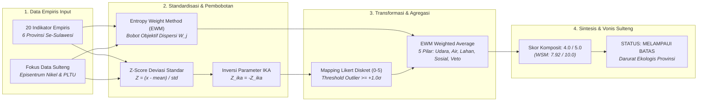

# BAB VI: AUDIT FORENSIK METODOLOGI D3TLH
## SUB-BAB 6.6: ALGORITMA SKORING TINGKAT PROVINSI (ANALISIS SULAWESI TENGAH)

> **PROFIL BIOREGION: Provinsi Sulawesi Tengah (Episentrum Hilirisasi & PLTU Captive)**  
> Data empiris: Gabungan sensor satelit NASA TROPOMI NO2, Global Energy Monitor (GEM 2023), Rekam Medis Kemenkes (ISPA & Diare), Laporan Kinerja KLHK (Limbah B3 & Tailing), Global Forest Watch (Deforestasi & Emisi Karbon), BNPB (Bencana Alam), KPA & TanahKita (Konflik Agraria & Kriminalisasi), serta Minerba ESDM (IUP Nikel & Obral Izin). Diolah menggunakan model hybrid Z-Score Anomali Deviasi Standar dan Entropy Weight Method (EWM) sesuai antarmuka Dashboard Streamlit Tab 3 (Bedah Matematika Z-Score + EWM per Provinsi).

#### A. Pengantar & Kerangka Narasi
Sebagaimana ditampilkan pada antarmuka Streamlit **Dashboard Page 6 (Audit D3TLH - Tab Bedah Matematika Z-Score + EWM per Provinsi)**, evaluasi daya dukung dan daya tampung lingkungan hidup tingkat provinsi dirancang untuk membongkar kelemahan metodologi pemerintah yang kerap mengaburkan krisis lokal melalui teknik perataan wilayah (dilution effect). AMDAL dan dokumen D3TLH resmi selama ini berasumsi bahwa kapasitas asimilasi lingkungan bersifat homogen di seluruh daratan. Namun, fakta empiris di lapangan membuktikan disparitas yang luar biasa ekstrem antara provinsi tapak industri ekstraktif dengan provinsi non-ekstraktif.

Di sini pembaca dapat melihat persis bagaimana angka **Fakta Lapangan (Raw Absolute Data)** ditransformasikan secara objektif oleh fungsi komputasi matematika **(Z-Score Anomali dan Pembobotan Entropi EWM Shannon)** menjadi Skor Likert diskret 0.0 - 5.0. Analisis forensik membuktikan bahwa **Provinsi Sulawesi Tengah berada pada status RED ALERT (Skor Komposit 4.0 / 5.0 - Melampaui Batas)**, di mana beban pencemaran udara, akumulasi limbah B3, beban tailing, dan deforestasi primer telah jauh melampaui batas toleransi daya lentur ekologis.

#### B. Alur Logika Metodologis Skoring Tingkat Provinsi (Flowchart)


#### C. Formulasi Matematis & Definisi Variabel
```text
1. Z-Score Standard: Z_ij = (x_ij - mean(x_j)) / std(x_j)  |  Khusus IKA: Z_ika = - (ika_i - mean(ika)) / std(ika)
2. Min-Max Normalisasi: r_ij = (x_ij - min(x_j)) / (max(x_j) - min(x_j))
3. Proporsi Probabilitas: P_ij = r_ij / SUM(r_ij)
4. Entropi Informasi: E_j = - (1 / ln(n)) * SUM(P_ij * ln(P_ij + eps))
5. Koefisien Dispersi: D_j = 1 - E_j
6. Bobot Objektif EWM: W_j = D_j / SUM(D_j)
7. Mapping Likert: Z >= 1.0 -> 5.0 ; 0.5 <= Z < 1.0 -> 4.0 ; 0.0 <= Z < 0.5 -> 3.0 ; -0.5 <= Z < 0.0 -> 2.0 ; -1.0 <= Z < -0.5 -> 1.0 ; Z < -1.0 -> 0.0
8. EWM Weighted Average Pilar: Skor_Pilar = SUM(Likert_ij * W_j) / SUM(W_j)
9. Skor Komposit Total: (Udara + Air + Lahan + Sosial + Veto) / 5.0 = 4.0 / 5 (WSM: 7.92 / 10.0)
```

#### D. Matriks Hasil Uji Empiris
##### Tabel 6.12: Bedah Matematika 20 Indikator Empiris Provinsi Sulawesi Tengah (Model Hybrid Z-Score & EWM)
| Pilar | Indikator Empiris | Fakta Mentah (A) | Rata-rata (B) | Deviasi (C) | Z-Score | Bobot EWM | Likert | Status Ekologis |
| :---: | :--- | :---: | :---: | :---: | :---: | :---: | :---: | :--- |
| Pilar Udara | Kapasitas PLTU Captive Beroperasi | 7,325 MW | 1,638 | 2,882 | +1.97 | 0.0773 | 5.0 / 5 | Melampaui Batas |
| Pilar Udara | Konsentrasi Gas NO2 Troposferik Satelit | 6.50e-06 | 5.56e-06 | 1.29e-06 | +0.73 | 0.0224 | 4.0 / 5 | Melampaui Batas |
| Pilar Udara | Morbiditas ISPA (Incidence Rate Ratio) | 3.50x | 1.41x | 1.26x | +1.66 | 0.0461 | 5.0 / 5 | Melampaui Batas |
| Pilar Udara | Proporsi Timbulan Limbah B3 Industri | 25.30 Jt Ton | 5.47 | 10.04 | +1.97 | 0.0829 | 5.0 / 5 | Melampaui Batas |
| Pilar Udara | Pelepasan Emisi Karbon Deforestasi GFW | 291.34 Jt Ton CO2e | 134.01 | 93.99 | +1.67 | 0.0395 | 5.0 / 5 | Melampaui Batas |
| Pilar Air | Indeks Kualitas Air (IKA) Terkini | 62.1 Poin | 59.7 | 3.4 | -0.70 | 0.0262 | 1.0 / 5 | Tidak Melampaui Batas |
| Pilar Air | Morbiditas Diare (Incidence Rate Ratio) | 1.52x | 1.04x | 0.36x | +1.34 | 0.0164 | 5.0 / 5 | Melampaui Batas |
| Pilar Air | Konflik Ruang Laut Nelayan vs Tambang | 1 Kasus | 2.5 | 2.9 | -0.52 | 0.0442 | 1.0 / 5 | Tidak Melampaui Batas |
| Pilar Air | Akumulasi Beban Tailing, Slag & DSTP | 24.50 Jt Ton | 5.34 | 9.73 | +1.97 | 0.0822 | 5.0 / 5 | Melampaui Batas |
| Pilar Lahan | Bencana Hidrometeorologi (Banjir & Longsor) | 458 Kejadian | 268.2 | 246.6 | +0.77 | 0.0271 | 4.0 / 5 | Melampaui Batas |
| Pilar Lahan | Deforestasi Hutan Alam Primer GFW | 481,908 Ha | 231,009 | 159,368 | +1.57 | 0.0346 | 5.0 / 5 | Melampaui Batas |
| Pilar Lahan | Perambahan Tambang di Kawasan Hutan Lindung | 19,804 Ha | 6,964 | 6,775 | +1.89 | 0.0392 | 5.0 / 5 | Melampaui Batas |
| Pilar Lahan | Aktor Deforestasi Komoditas Tambang & Sawit | 383,304 Ha | 166,942 | 128,370 | +1.69 | 0.0361 | 5.0 / 5 | Melampaui Batas |
| Pilar Lahan | Kepadatan Konsesi IUP Nikel vs Daratan | 7.33% | 5.08% | 4.43% | +0.51 | 0.0320 | 4.0 / 5 | Melampaui Batas |
| Pilar Sosial | Manipulasi Persetujuan Konsultasi Warga (FPIC) | 1 Kasus | 1.3 | 2.0 | -0.17 | 0.0635 | 2.0 / 5 | Tidak Melampaui Batas |
| Pilar Sosial | Korban Perampasan Ruang Hidup & Krisis Agraria | 12,231 Jiwa | 9,052 | 15,804 | +0.20 | 0.0781 | 3.0 / 5 | Mendekati Batas |
| Pilar Sosial | Insiden Kriminalisasi Warga & Pembela HAM | 6 Insiden | 3.5 | 3.5 | +0.71 | 0.0331 | 4.0 / 5 | Melampaui Batas |
| Pilar Sosial | Defisit Kelayakan Standar Faskes SPA | 2.4 % Gap | 9.6 | 10.5 | -0.68 | 0.0430 | 1.0 / 5 | Tidak Melampaui Batas |
| Pilar Veto | Penerbitan Obral Konsesi WIUP Baru Pasca-2014 | 260 Izin | 95.7 | 100.3 | +1.64 | 0.0415 | 5.0 / 5 | Melampaui Batas |
| Pilar Veto | Korporat Tambang Pelanggar Hukum Beroperasi Ilegal | 3 Korporasi | 2.7 | 3.7 | +0.09 | 0.0473 | 3.0 / 5 | Mendekati Batas |

##### Tabel 6.13: Rekapitulasi Skor 5 Pilar & Status Ekologis Komposit Provinsi Sulawesi Tengah
| Pilar / Dimensi | Cakupan Indikator Kunci | Skor Likert Pilar (0-5) | Status Ekologis | Interpretasi Temuan Lapangan Sulteng |
| :---: | :--- | :---: | :---: | :---: |
| Pilar 1: Udara | PLTU (7.325 MW), NO2 (6.5e-6), ISPA (3.5x), B3 (25.3 Jt Ton), CO2 (291 Jt Ton) | 4.9 / 5 | Melampaui Batas | Episentrum PLTU Captive Terbesar & Konsentrasi B3 |
| Pilar 2: Air | IKA (62.07), Diare (1.52x), Tailing (24.5 Jt Ton), Logam Cr6+ | 3.3 / 5 | Mendekati Batas | Beban Tailing Raksasa & Morbiditas Pencernaan Tinggi |
| Pilar 3: Lahan | Bencana (458), Deforestasi (481k Ha), Lindung (19.8k Ha), Driver (383k Ha) | 4.7 / 5 | Melampaui Batas | Deforestasi Primer Masif & Perambahan Hutan Lindung |
| Pilar 4: Sosial | FPIC (1 Kasus), Korban (12.231 Jiwa), Kriminalisasi (6 Insiden), Defisit SPA | 2.5 / 5 | Tidak Melampaui Batas | Kriminalisasi Warga Pembela HAM & Defisit Sarana Kesehatan |
| Pilar 5: Veto | Obral Izin (260 IUP Baru), Korporat Ilegal (3 Perusahaan), PLTU Ekspansi | 4.4 / 5 | Melampaui Batas | Kegagalan Pengendalian Izin & Impunitas Pelanggaran |
| SKOR KOMPOSIT SULTENG | Agregasi 5 Pilar EWM Weighted Average (Z-Score Standardization) | 4.0 / 5 | Melampaui Batas | STATUS RED ALERT: DARURAT DAYA DUKUNG LINGKUNGAN |

#### E. Analisis Temuan Empiris
1. **Daya Tampung Udara (Skor 4.9 / 5 — Melampaui Batas):** Sulawesi Tengah memikul beban polusi udara paling parah se-Sulawesi. Kapasitas PLTU captive batubara mencapai 7.325,0 MW (Z = +1.97σ), timbulan limbah B3 menyentuh 25,30 Juta Ton (Z = +1.97σ), emisi karbon 291,34 Juta Ton CO2e (Z = +1.67σ), dan rasio anomali ISPA mencapai 3,50x lipat (Z = +1.66σ). Keempat indikator ini berada pada status outlier ekstrem Likert 5.0.
2. **Daya Tampung Air (Skor 3.3 / 5 — Mendekati Batas):** Meskipun rerata IKA bernilai 62,07, tekanan limbah padat dan tailing tambang nikel mencapai 24,50 Juta Ton/Tahun (Z = +1.97σ) serta memicu lonjakan morbiditas diare sebesar 1,52x lipat dibanding populasi kontrol (Z = +1.34σ, Likert 5.0).
3. **Daya Dukung Lahan (Skor 4.7 / 5 — Melampaui Batas):** Sulawesi Tengah mengalami kehancuran lanskap daratan terberat dengan total deforestasi primer 481.908 Ha (Z = +1.57σ), perambahan 19.804 Ha di kawasan hutan lindung (Z = +1.89σ), 383.304 Ha deforestasi pendorong tambang/sawit (Z = +1.69σ), serta 458 kejadian bencana banjir dan longsor (Z = +0.77σ).
4. **Daya Dukung Sosial (Skor 2.5 / 5 — Tidak Melampaui Batas):** Walaupun persentase kesiapan SPA Puskesmas relatif tinggi (77,57% atau gap 2,43%), tercatat 12.231 jiwa masyarakat adat dan petani terancam kehilangan ruang hidup, serta terjadi 6 insiden kriminalisasi warga dan aktivis lingkungan hidup (Z = +0.71σ, Likert 4.0).
5. **Veto Kebijakan (Skor 4.4 / 5 — Melampaui Batas):** Terjadi kegagalan pengendalian perizinan fatal dengan diterbitkannya 260 IUP baru pasca-2014 (Z = +1.64σ, Likert 5.0) dan pembiaran 3 korporasi besar beroperasi tanpa izin yang sah di kawasan hutan.
6. **Vonis Komposit Sulawesi Tengah (Skor 4.0 / 5.0 — Melampaui Batas):** Secara agregat, Sulawesi Tengah memperoleh Skor Komposit 4.0 / 5.0 (Ekuivalen WSM 7.92 / 10.0) dengan status **Melampaui Batas** *(STATUS: RED ALERT / DARURAT EKOLOGIS TINGKAT PROVINSI)*. Fakta ini mengonfirmasi secara ilmiah bahwa daya dukung dan daya tampung lingkungan hidup di Sulawesi Tengah telah mengalami keruntuhan sistemik akibat hilirisasi nikel yang tidak terkendali.
