# METODOLOGI PENELITIAN: BAB 6 — AUDIT FORENSIK D3TLH (LEVEL BIOREGION PULAU)
*CELIOS (Center of Economic and Law Studies) · Audit Spasial-Statistik D3TLH Sulawesi (2014–2024) · Ringkasan Eksekutif Metodologis*

---

## A. Desain Penelitian & Tujuan
Penelitian ini menggunakan **desain audit forensik metodologis, pembuktian terbalik berbasis data empiris, dan agregasi Simple Additive Weighting (SAW) kuantitatif terpadu** untuk menguji secara kritis keabsahan dokumen Daya Dukung dan Daya Tampung Lingkungan Hidup (D3TLH) resmi di tingkat bioregion makro Pulau Sulawesi sepanjang kurun waktu pengamatan (**2014–2024**). Tiga tujuan utama metodologis Bab 6 (Level Pulau) meliputi:

1. **Dekonstruksi Bias Jasa Ekosistem Pasif:** Membongkar kelemahan pemodelan D3TLH resmi yang semata-mata mengandalkan tutupan vegetasi hutan statis tanpa memperhitungkan beban emisi PLTU captive, konsentrasi gas NO2 satelit, timbulan B3, dan morbiditas ISPA.
2. **Audit Lima Dimensi Daya Lentur Ekologis Pulau:** Mengoperasionalkan skoring kuantitatif terhadap 5 pilar daya lentur bioregion: Udara, Air, Lahan, Sosial, dan Veto Kebijakan menggunakan ambang batas baku mutu nasional (PP 22/2021, PermenLHK 27/2021, UU 41/1999) dan standar global (WHO, GEM, IFC PS7).
3. **Formulasi Indeks Komposit & Pembuktian Status Kolaps:** Mengagregasikan skor multi-metrik kontinu (0–10) dan skala Likert diskrit (1–5) guna menetapkan status ambang batas ekologis Pulau Sulawesi sebagai landasan mandat moratorium izin eksploitasi.

---

## B. Sumber Data & Cakupan Wilayah
Kajian audit bioregion pulau mengintegrasikan enam klaster data resmi kementerian teknis, observasi satelit resolusi tinggi, dan basis data independen terverifikasi:

- **Global Energy Monitor (GEM 2023) & Ditjen Minerba ESDM:** Inventarisasi 10,26 GW (10.255 MW) kapasitas PLTU captive batubara dan registri 574 IUP nikel baru se-Sulawesi.
- **Satelit Copernicus Sentinel-5P (NASA/ESA TROPOMI):** Pengukuran densitas konsentrasi troposferik nitrogen dioksida (NO2 rasio µmol/m²) di atas kawasan industri nikel.
- **Kementerian Kesehatan RI & Dinas Kesehatan Provinsi:** Data epidemiologis insidensi ISPA dan Diare (Incidence Rate Ratio / IRR) serta evaluasi kelayakan sarana-prasarana faskes (ASPAK SPA).
- **Kementerian Lingkungan Hidup dan Kehutanan (KLHK):** Indeks Kualitas Air (IKA Ditjen PPKL), neraca timbulan limbah B3 (Ditjen PSLB3), dan dokumen batas daya dukung AMDAL.
- **Global Forest Watch (GFW / Hansen UMD) & BNPB:** Time-series kehilangan 1,38 juta Ha tutupan hutan, emisi 804 juta ton CO2e, perambahan hutan lindung, dan 1.609 insiden bencana hidrometeorologi.
- **Konsorsium Pembaruan Agraria (KPA) & Koalisi Sipil (JATAM, WALHI):** Dokumentasi 8 kasus manipulasi persetujuan awal (FPIC), 54.310 jiwa korban konflik agraria (505.192 Ha), dan catatan represi aparat.

---

## C. Operasionalisasi Variabel & Indikator Riset
Seluruh parameter bio-fisik cerobong, neraca kualitas perairan, kerusakan tutupan lahan, kerentanan hak sosial, hingga instrumen pembatasan izin dioperasionalkan secara terstruktur ke dalam **indikator riset empiris** sebagaimana dirangkum pada matriks operasional berikut:

##### Matriks Operasionalisasi Variabel dan Sumber Data Resmi Bab 6 (Level Pulau)
| No | Indikator Riset | Fokus Pengukuran | Satuan | Sumber Data Primer Resmi |
| :-: | :--- | :--- | :-: | :--- |
| 1 | Kapasitas Emisi PLTU Captive | Beban Pembakaran Batubara Industri Off-Grid | Megawatt (MW) | Global Energy Monitor (GEM) |
| 2 | Densitas Polutan NO2 Satelit | Konsentrasi Troposferik Gas NO2 Atmosfer | µmol / m² | Satelit Sentinel-5P TROPOMI |
| 3 | Rasio Morbiditas ISPA (IRR) | Anomali Morbiditas Saluran Pernapasan Warga | Rasio Peluang (IRR) | Kemenkes RI & Profil Dinkes |
| 4 | Status Mutu Air Sungai (IKA) | Kondisi Baku Mutu Perairan Regional Pulau | Poin Indeks (0–100) | Ditjen PPKL KLHK (IKLH) |
| 5 | Beban Timbulan Tailing & Slag B3 | Akumulasi Limbah Pirometalurgi & HPAL | Juta Ton / Tahun | Amdal KLHK, AEER & WALHI |
| 6 | Laju Deforestasi & Bencana Lahan | Kehilangan Hutan Primer & Kejadian Banjir | Ha & Kejadian | GFW Hansen & DIBI BNPB |
| 7 | Pelanggaran Hutan Lindung (Zero Tol) | Perambahan Kawasan Lindung dan Konservasi | Hektar (Ha) | GFW Overlay Kawasan Lindung |
| 8 | Skala Pelanggaran Persetujuan FPIC | Manipulasi Konsultasi Masyarakat Adat/Lokal | Kasus | KPA, JATAM & WALHI |
| 9 | Defisit Sarana-Prasarana Faskes | Kesenjangan Standar SPA Puskesmas Tapak | Persen Kesenjangan (%) | ASPAK Kemenkes RI |
| 10 | Obral Perizinan Baru & Impunitas | Penerbitan IUP Baru & Pembiaran Korporasi | Unit Izin & Korporasi | ESDM MODI & CATAHU KPA |

---

## D. Kerangka Analisis & Formulasi Matematis

### 6.1 Algoritma Skoring Bioregion Pulau: Matriks Daya Tampung Udara
Daya tampung udara dinilai melalui 4 sub-metrik pembuktian terbalik berbasis Simple Additive Weighting (SAW): kombinasi kapasitas PLTU dan densitas NO2 satelit, anomali morbiditas ISPA klinis, rasio timbulan limbah B3, dan defisit emisi karbon FOLU Net Sink 2030:

> `Skor_PLTU = min(5, [Cap / 5000] × 5)   ;   Skor_NO2 = min(5, [(NO2 - 4e-6) / 2e-6] × 5)   |   Skor_Udara1 = min(10, Skor_PLTU + Skor_NO2)`  
> `Skor_Udara2 (ISPA) = min(10, [IRR - 1] × 10)   ;   Skor_Udara3 (B3) = min(10, [B3 / 5] × 10)   ;   Skor_Udara4 (CO2) = min(10, [CO2 / 150] × 10)`  
> `Skor_Akumulasi_Udara = Σ [ Skor_Udara_i ] / 4.0   |   Skor Likert = Skor_Akumulasi_Udara / 2.0`  
> *Keterangan: Cap = Kapasitas PLTU (9.825 MW); NO2 = Densitas satelit (5,56e-6 mol/m²); IRR = Rasio insidensi ISPA (3,50x); B3 = Pangsa limbah B3 (7,93%); CO2 = Pelepasan emisi (804,05 Juta Ton); Skor Udara = 9,73 / 10 (Likert 4,9 / 5,0: Kapasitas Asimilasi Habis).*

### 6.2 Algoritma Skoring Bioregion Pulau: Matriks Daya Tampung Air
Daya tampung air diukur berdasarkan defisit baku mutu IKA perairan terhadap ambang batas PermenLHK 27/2021, risiko morbiditas diare klinis, konflik perampasan ruang pesisir nelayan, dan beban timbulan residu tailing HPAL/slag nikel terhadap daya tampung AMDAL:

> `Skor_Air1 (IKA) = min(10, max(0, [80 - IKA] / 30) × 10)   ;   Skor_Air2 (Diare) = min(10, [IRR - 1] × 10)`  
> `Skor_Air3 (Konflik) = min(10, [Kasus / 15] × 10)   ;   Skor_Air4 (Tailing) = min(10, [Tailing / 25] × 10)`  
> `Skor_Akumulasi_Air = Σ [ Skor_Air_i ] / 4.0   |   Skor Likert = Skor_Akumulasi_Air / 2.0`  
> *Keterangan: IKA = Rata-rata mutu air (59,69 / Kategori Sedang); IRR = Rasio insidensi diare (1,52x); Konflik = Sengketa pesisir nelayan (15 kasus); Tailing = Residu tailing/slag (32,0 Jt Ton/Thn); Skor Air = 8,19 / 10 (Likert 4,2 / 5,0: Penetralan Limbah Melampaui Batas).*

### 6.3 Algoritma Skoring Bioregion Pulau: Matriks Daya Dukung Lahan
Daya dukung lahan dievaluasi menggunakan normalisasi Z-Score frekuensi bencana alam BNPB, deforestasi primer terhadap kuota iklim FOLU 2030, aturan nol-toleransi perambahan hutan lindung (UU 41/1999), dominasi korporasi tambang/sawit, dan rasio konsesi IUP nikel daratan:

> `Skor_Lahan1 = min(10, [Bencana / 877] × 10)   ;   Skor_Lahan2 = min(10, [Loss / 638000] × 10)   ;   Skor_Lahan3 = 10 if Loss_Lindung > 0 else 0`  
> `Skor_Lahan4 = min(10, [Driver / 500000] × 10)   ;   Skor_Lahan5 = min(10, [Rasio_IUP / 0.10] × 10)`  
> `Skor_Akumulasi_Lahan = Σ [ Skor_Lahan_i ] / 5.0   |   Skor Likert = Skor_Akumulasi_Lahan / 2.0`  
> *Keterangan: Bencana = Banjir/longsor (1.609 kejadian); Loss = Deforestasi (1.386.055 Ha); Loss_Lindung = Hutan lindung hilang (41.785 Ha); Driver = Monopoli tambang/sawit (1.001.654 Ha); Rasio_IUP = 6,3% daratan (1,18 Jt Ha); Skor Lahan = 9,25 / 10 (Likert 4,6 / 5,0: Darurat Lahan).*

### 6.4 Algoritma Skoring Bioregion Pulau: Matriks Daya Dukung Sosial
Daya dukung sosial mengukur batas toleransi kedaulatan warga melalui manipulasi asas FPIC (standar IFC PS7), skala perampasan ruang hidup demografis, insidensi represi kriminalisasi pejuang hak lingkungan, dan kesenjangan pemenuhan sarana-prasarana kesehatan (SPA):

> `Skor_Sosial1 = min(10, [FPIC / 3] × 10)   ;   Skor_Sosial2 = min(10, [Jiwa / 40000] × 10)`  
> `Skor_Sosial3 = min(10, [Kasus / 10] × 10)   ;   Skor_Sosial4 = min(10, [Gap_SPA / 45] × 10)`  
> `Skor_Akumulasi_Sosial = Σ [ Skor_Sosial_i ] / 4.0   |   Skor Likert = Skor_Akumulasi_Sosial / 2.0`  
> *Keterangan: FPIC = Pelanggaran persetujuan awal (8 kasus); Jiwa = Korban sengketa agraria (54.310 jiwa); Kasus = Represi/kriminalisasi (21 insiden); Gap_SPA = Defisit kelayakan Puskesmas (5,65% di bawah target 80%); Skor Sosial = 7,81 / 10 (Likert 3,9 / 5,0: Perlu Pengawasan).*

### 6.5 Algoritma Skoring Bioregion Pulau: Matriks Veto Kebijakan & Sintesis Komposit
Matriks Veto Kebijakan menguji efektivitas fungsi kontrol hukum (Pasal 12 UU 32/2009) terhadap penerbitan izin baru di zona kritis, pembiaran korporasi pelanggar hukum, dan ekspansi PLTU captive, yang kemudian disintesiskan ke dalam Indeks Komposit Bioregion Pulau Sulawesi:

> `Skor_Veto1 = min(10, [IUP / 100] × 10)   ;   Skor_Veto2 = min(10, [Korporat / 10] × 10)   ;   Skor_Veto3 = min(10, [MW / 5000] × 10)`  
> `Skor_Akumulasi_Veto = Σ [ Skor_Veto_i ] / 3.0   |   Skor_Komposit_Pulau = [ Σ Skor_Dimensi (1..5) ] / 5.0`  
> *Keterangan: IUP = Izin baru pasca-2014 (574 izin); Korporat = Entitas pelanggar hukum (21 korporasi); MW = PLTU captive (10.255 MW); Skor Veto = 10,00 / 10 (Likert 5,0 / 5,0); Skor Komposit Pulau = 9,00 / 10 (Likert 4,5 / 5,0: Kolaps Daya Dukung Sistemik).*

##### Tabel 6.5a: Rekapitulasi Sintesis Skoring 5 Dimensi Bioregion Pulau Sulawesi
| Dimensi Evaluasi | Status Ekologis Dashboard | Kondisi Aktual Empiris Terukur | Skor WSM | Skor Likert | Vonis D3TLH |
| :--- | :--- | :--- | :---: | :---: | :---: |
| Dimensi 1: Udara | Kapasitas Asimilasi Habis | 9.825 MW PLTU, NO2 5,56e-6, ISPA IRR 3,5x, B3 7,93% | 9.73 / 10.0 | 4.9 / 5.0 | Darurat Udara |
| Dimensi 2: Air | Penetralan Limbah Terlampaui | IKA 59,69 (Sedang), Diare IRR 1,5x, Tailing 32 Jt Ton | 8.19 / 10.0 | 4.2 / 5.0 | Darurat Air |
| Dimensi 3: Lahan | Evaluasi Pengelolaan Lanskap | 1.609 Bencana, Deforestasi 1,38 Jt Ha, Lindung 41 Ribu Ha | 9.25 / 10.0 | 4.6 / 5.0 | Darurat Lahan |
| Dimensi 4: Sosial | Pelibatan Masyarakat Lokal | 8 Kasus FPIC, 54.310 Jiwa Tergusur, 21 Represi HAM | 7.81 / 10.0 | 3.9 / 5.0 | Perlu Pengawasan |
| Dimensi 5: Veto | Penguatan Pengawasan Kebijakan | 574 IUP Baru, 21 Korporasi Ilegal, 10,26 GW PLTU | 10.00 / 10.0 | 5.0 / 5.0 | Perlu Reformasi |
| **TOTAL BIOREGION** | **STATUS D3TLH MAKRO SULAWESI** | **Agregasi 5 Pilar Daya Dukung & Daya Tampung Ekologis** | **9.00 / 10.0** | **4.5 / 5.0** | **KOLAPS SISTEMIK** |

---

## E. Korespondensi Metodologi terhadap Sub-bab Laporan Bab 6
Setiap sub-bab analitis pada Bab 6 (Level Pulau) ditopang oleh metode kuantitatif yang terukur dan menghasilkan sintesis bukti empiris terstandarisasi sebagaimana dirangkum pada matriks berikut:

##### Matriks Korespondensi Metodologis Bab 6 (Level Pulau)
| Sub-bab | Fokus Kajian Empiris | Metode Analitis Utama |
| :-: | :--- | :--- |
| Sub-bab 6.1 | Daya Tampung Udara Bioregion | Multi-Pollutant Aggregation, Threshold Normalization, Simple Additive Weighting (SAW) |
| Sub-bab 6.2 | Daya Tampung Air & Beban Tailing | Water Quality Deficit Modeling, Epidemiological IRR Mapping, Assimilation Capacity Audit |
| Sub-bab 6.3 | Daya Dukung Lahan & Lanskap | Geospatial Z-Score Disaster Normalization, FOLU Net Sink Deficit, Zero-Tolerance Rule |
| Sub-bab 6.4 | Daya Dukung Sosial & Hak Tenurial | Human Rights Violation Tracking, Population Displacement Scaling, Health Facility Gap Audit |
| Sub-bab 6.5 | Veto Kebijakan & Komposit Pulau | Policy Failure Index, Regulatory Impunity Audit, 5-Dimension Bioregional Synthesis |

---

## F. Bagan Alur Kerangka Kerja Riset (Research Workflow)
Kerangka operasional metodologi Bab 6 (Level Pulau) berjalan secara terpadu melalui empat fase berurutan sebagaimana divisualisasikan pada bagan alur kerja riset berikut:

```mermaid
flowchart LR
    subgraph F1["Fase I: Input Multi-Pilar"]
        A1["PLTU & Satelit NO2<br/><i>GEM 9.825 MW & TROPOMI</i>"]
        A2["IKA & Tailing HPAL<br/><i>Mutu Air 59.69 & 32 Jt Ton</i>"]
        A3["Deforestasi & Bencana<br/><i>1.38 Jt Ha & 1.609 Banjir</i>"]
        A4["FPIC & Veto Kebijakan<br/><i>8 FPIC & 574 Izin Baru</i>"]
    end
    subgraph F2["Fase II: Thresholding Regulasi"]
        B1["Baku Mutu Udara PP 22/2021<br/><i>Target ISPA IRR WHO</i>"]
        B2["Baku Mutu Air PermenLHK 27<br/><i>AMDAL Tailing Dam</i>"]
        B3["Aturan UU 41/1999 & FOLU<br/><i>Target Iklim NDC 2030</i>"]
        B4["Standar HAM IFC PS7<br/><i>Veto Kuota Izin ESDM</i>"]
    end
    subgraph F3["Fase III: Kalkulasi 5 Matriks"]
        C1["Skor Udara: 9.73 / 10.0<br/><i>(Likert: 4.9 / 5.0)</i>"]
        C2["Skor Air: 8.19 / 10.0<br/><i>(Likert: 4.2 / 5.0)</i>"]
        C3["Skor Lahan: 9.25 / 10.0<br/><i>(Likert: 4.6 / 5.0)</i>"]
        C4["Skor Sosial: 7.81 / 10.0<br/><i>(Likert: 3.9 / 5.0)</i>"]
        C5["Skor Veto: 10.00 / 10.0<br/><i>(Likert: 5.0 / 5.0)</i>"]
    end
    subgraph F4["Fase IV: Agregasi Bioregion"]
        D1["Simple Additive Weighting<br/><i>Bobot Equal 20% per Dimensi</i>"]
        D2["Skor Komposit: 4.5 / 5.0<br/><i>(Skor WSM 9.00 / 10.0)</i>"]
        D3["Vonis: KOLAPS SISTEMIK<br/><i>Mandat Moratorium Total</i>"]
    end
    F1 --> F2 --> F3 --> F4
```

> **KERANGKA KELUARAN METODOLOGIS BAB 6 (LEVEL BIOREGION PULAU):**  
> 1. **Dekonstruksi Ilmiah D3TLH Pasif:** Membuktikan bahwa pemodelan resmi D3TLH pemerintah menyembunyikan krisis lingkungan akut akibat pengabaian variabel cerobong PLTU (9.825 MW), densitas polutan satelit NO2, residu tailing/slag (32 Jt Ton), dan lonjakan insidensi penyakit saluran napas (ISPA IRR 3,5x).  
> 2. **Bukti Pelanggaran Batas Daya Lentur Fisik & Sosial:** Mengonfirmasi status darurat pada pilar Udara (Skor 4,9/5), Air (Skor 4,2/5), Lahan (Skor 4,6/5), serta kerentanan hak tenurial sosial (Skor 3,9/5) yang mengorbankan 54.310 jiwa warga terdampak.  
> 3. **Vonis Kolaps Sistemik & Mandat Moratorium:** Menghasilkan Skor Komposit Bioregion Pulau sebesar 4,5 / 5,0 (Status: Melampaui Batas / Kolaps Ekologis Sistemik), membuktikan bahwa seluruh ruang hidup Pulau Sulawesi telah kehilangan kapasitas pemulihan alami dan menuntut pemberlakuan moratorium izin eksploitasi baru secara mutlak.
