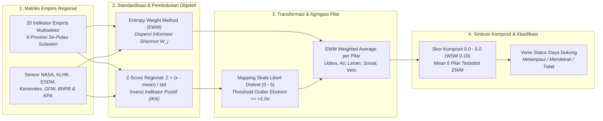

# BAB VI: AUDIT FORENSIK METODOLOGI D3TLH
## SUB-BAB 6.6: ALGORITMA SKORING TINGKAT PROVINSI (MODEL HYBRID Z-SCORE & EWM)

> **KERANGKA METODOLOGI MULTIKRITERIA REGIONAL (BERLAKU MENGIKAT UNTUK 6 PROVINSI)**  
> Model evaluasi daya dukung dan daya tampung lingkungan hidup tingkat provinsi dirancang menggunakan pendekatan terstandarisasi berbasis Hybrid Z-Score Anomali Deviasi Standar dan Entropy Weight Method (EWM) sesuai Nature Scientific Reports (Sun et al., 2024). Metodologi, formula normalisasi, matriks entropi, dan bobot objektif indikator dihitung secara simultan dari matriks 6 provinsi se-Pulau Sulawesi.

#### A. Pengantar & Kerangka Narasi Metodologis
Sebagaimana ditampilkan pada antarmuka Streamlit **Dashboard Page 6 (Audit D3TLH - Tab Bedah Matematika Z-Score + EWM per Provinsi)**, evaluasi tingkat provinsi bertujuan untuk mengatasi kelemahan mendasar dokumen AMDAL dan D3TLH konvensional yang kerap mengaburkan krisis lingkungan lokal melalui teknik perataan agregat wilayah (*dilution effect*). Dalam metodologi pemerintah, beban pencemaran masif di suatu kawasan industri tambang sering kali tampak 'aman' hanya karena dirata-ratakan dengan luas daratan pulau secara keseluruhan.

Untuk mendobrak bias tersebut, riset ini menerapkan **Model Hybrid Z-Score Anomali dan Pembobotan Objektif Entropi (EWM)**. Pendekatan ini secara otomatis memberikan bobot evaluasi tertinggi pada indikator-indikator yang memiliki tingkat ketimpangan spasial paling ekstrem (seperti timbulan limbah B3, tailing tambang, korban krisis agraria, dan PLTU captive batubara). Dengan demikian, provinsi yang menjadi episentrum industri ekstraktif terdeteksi secara akurat berada pada status anomali krisis tanpa terdistorsi oleh luas wilayah administratif.

#### B. Alur Logika Metodologis Regional (Flowchart 6 Provinsi)


#### C. Formulasi Matematis Universal & Definisi Variabel
```text
1. Z-Score Regional: Z_ij = (x_ij - mean(x_j)) / std(x_j)  |  Khusus IKA: Z_ika = - (ika_i - mean(ika)) / std(ika)
2. Min-Max Normalisasi: r_ij = (x_ij - min(x_j)) / (max(x_j) - min(x_j))
3. Proporsi Probabilitas: P_ij = r_ij / SUM(r_ij)
4. Entropi Informasi Shannon: E_j = - (1 / ln(n)) * SUM(P_ij * ln(P_ij + eps))
5. Koefisien Dispersi Informasi: D_j = 1 - E_j
6. Bobot Objektif EWM Final: W_j = D_j / SUM(D_j)
7. Mapping Likert Diskret: Z >= 1.0 -> 5.0 ; 0.5 <= Z < 1.0 -> 4.0 ; 0.0 <= Z < 0.5 -> 3.0 ; -0.5 <= Z < 0.0 -> 2.0 ; -1.0 <= Z < -0.5 -> 1.0 ; Z < -1.0 -> 0.0
8. EWM Weighted Average Pilar: Skor_Pilar = SUM(L_ij * W_j) / SUM(W_j)
9. Skor Komposit Total: (Udara + Air + Lahan + Sosial + Veto) / 5.0
```

```text
Contoh Persamaan Substitusi Riil (Indikator PLTU Captive & Komposit Sulteng):
1. Substitusi Z-Score: Z = (7.325 MW - 1.637,50 MW) / 2.882,26 MW = +1,97σ
2. Substitusi EWM Shannon: r_sulteng = 1,000 ; P_sulteng = 0,745 -> Ej = 0,3948 -> Dj = 0,6052 -> W_pltu = 0,6052 / 7,8331 = 0,0773 (7,73%)
3. Substitusi Likert Diskret: Z = +1,97σ >= +1,0σ -> Skor Likert = 5,0 / 5 (Melampaui Batas / Red Alert)
4. Substitusi Pilar Udara: Skor = [(5,0*0,0773) + (4,0*0,0224) + (5,0*0,0461) + (5,0*0,0829) + (5,0*0,0395)] / 0,2682 = 4,92 / 5
5. Substitusi Komposit Total: Skor = (4,92 + 3,30 + 4,70 + 2,50 + 4,40) / 5 = 3,96 / 5,0 -> WSM: 7,92 / 10.0 (Melampaui Batas)
```

##### Tabel 6.12: Matriks Parameter Regional Se-Sulawesi (Rata-rata, Deviasi Standar, dan Bobot Objektif EWM 20 Indikator Empiris)
| Pilar | Indikator Empiris | Rata-rata (B) | Deviasi (C) | Entropi (Ej) | Divergensi (Dj) | Bobot EWM (Wj) |
| :---: | :--- | :---: | :---: | :---: | :---: | :--- |
| Pilar Udara | Kapasitas PLTU Captive Beroperasi | 1,638 MW | 2,882 MW | 0.3948 | 0.6052 | 0.0773 |
| Pilar Udara | Konsentrasi Gas NO2 Troposferik Satelit | 5.56e-06 | 1.29e-06 | 0.8244 | 0.1756 | 0.0224 |
| Pilar Udara | Morbiditas ISPA (Incidence Rate Ratio) | 1.41x | 1.26x | 0.6391 | 0.3609 | 0.0461 |
| Pilar Udara | Proporsi Timbulan Limbah B3 Industri | 5.47 Jt Ton | 10.04 Jt Ton | 0.3509 | 0.6491 | 0.0829 |
| Pilar Udara | Pelepasan Emisi Karbon Deforestasi GFW | 134.01 Jt Ton CO2e | 93.99 Jt Ton CO2e | 0.6908 | 0.3092 | 0.0395 |
| Pilar Air | Indeks Kualitas Air (IKA) Terkini | 59.7 Poin | 3.4 Poin | 0.7945 | 0.2055 | 0.0262 |
| Pilar Air | Morbiditas Diare (Incidence Rate Ratio) | 1.04x | 0.36x | 0.8712 | 0.1288 | 0.0164 |
| Pilar Air | Konflik Ruang Laut Nelayan vs Tambang | 2.5 Kasus | 2.9 Kasus | 0.6536 | 0.3464 | 0.0442 |
| Pilar Air | Akumulasi Beban Tailing, Slag & DSTP | 5.34 Jt Ton | 9.73 Jt Ton | 0.3557 | 0.6443 | 0.0822 |
| Pilar Lahan | Bencana Hidrometeorologi (Banjir & Longsor) | 268.2 Kejadian | 246.6 Kejadian | 0.7877 | 0.2123 | 0.0271 |
| Pilar Lahan | Deforestasi Hutan Alam Primer GFW | 231,009 Ha | 159,368 Ha | 0.7293 | 0.2707 | 0.0346 |
| Pilar Lahan | Perambahan Tambang di Kawasan Hutan Lindung | 6,964 Ha | 6,775 Ha | 0.6932 | 0.3068 | 0.0392 |
| Pilar Lahan | Aktor Deforestasi Komoditas Tambang & Sawit | 166,942 Ha | 128,370 Ha | 0.7171 | 0.2829 | 0.0361 |
| Pilar Lahan | Kepadatan Konsesi IUP Nikel vs Daratan | 5.08% | 4.43% | 0.7492 | 0.2508 | 0.0320 |
| Pilar Sosial | Manipulasi Persetujuan Konsultasi Warga (FPIC) | 1.3 Kasus | 2.0 Kasus | 0.5024 | 0.4976 | 0.0635 |
| Pilar Sosial | Korban Perampasan Ruang Hidup & Krisis Agraria | 9,052 Jiwa | 15,804 Jiwa | 0.3882 | 0.6118 | 0.0781 |
| Pilar Sosial | Insiden Kriminalisasi Warga & Pembela HAM | 3.5 Insiden | 3.5 Insiden | 0.7405 | 0.2595 | 0.0331 |
| Pilar Sosial | Defisit Kelayakan Standar Faskes SPA | 9.6 % Gap | 10.5 % Gap | 0.6630 | 0.3370 | 0.0430 |
| Pilar Veto | Penerbitan Obral Konsesi WIUP Baru Pasca-2014 | 95.7 Izin | 100.3 Izin | 0.6753 | 0.3247 | 0.0415 |
| Pilar Veto | Korporat Tambang Pelanggar Hukum Beroperasi Ilegal | 2.7 Korporasi | 3.7 Korporasi | 0.6293 | 0.3707 | 0.0473 |

---

### 6.6.1 Evaluasi Empiris D3TLH: Provinsi Sulawesi Tengah (Sulteng)
> **PROFIL EMPIRIS: Provinsi Sulawesi Tengah (Episentrum Hilirisasi & PLTU Captive)**  
> Kabupaten/Kota: 13 Daerah  |  Pusat Industri: Kawasan IMIP Morowali & Smelter Palu  |  Populasi BPS: 2.985.734 Jiwa  
> Karakteristik Krisis: Konsentrasi PLTU captive batubara terbesar nasional, hotspot satelit troposferik NO2 tertinggi, timbulan limbah B3 raksasa, dan laju deforestasi primer masif.

#### A. Narasi Temuan Lapangan Sulteng
Hasil komputasi algoritma Z-Score EWM membuktikan bahwa **Provinsi Sulawesi Tengah berada pada status RED ALERT (Skor Komposit 4.0 / 5.0 — Melampaui Batas)**. Dari 20 indikator yang diuji, sebanyak 13 indikator berada pada kategori **Melampaui Batas (Skor Likert 4.0 hingga 5.0)**, dengan tekanan polusi udara dan perusakan lanskap daratan yang telah melampaui kapasitas asimilasi ekosistem.

#### B. Matriks Hasil Uji Empiris (Sulteng)
##### Tabel 6.13: Bedah Matematika 20 Indikator Empiris Provinsi Sulawesi Tengah (Model Hybrid Z-Score & EWM)
| Pilar | Indikator Empiris | Fakta Mentah (A) | Nilai Z-Score | Bobot EWM | Skor Likert | Status Ekologis |
| :---: | :--- | :---: | :---: | :---: | :---: | :--- |
| Pilar Udara | Kapasitas PLTU Captive Beroperasi | 7,325 MW | +1.97σ | 0.0773 | 5.0 / 5 | Melampaui Batas |
| Pilar Udara | Konsentrasi Gas NO2 Troposferik Satelit | 6.50e-06 mol/m² | +0.73σ | 0.0224 | 4.0 / 5 | Melampaui Batas |
| Pilar Udara | Morbiditas ISPA (Incidence Rate Ratio) | 3.50x lipat | +1.66σ | 0.0461 | 5.0 / 5 | Melampaui Batas |
| Pilar Udara | Proporsi Timbulan Limbah B3 Industri | 25.30 Jt Ton | +1.97σ | 0.0829 | 5.0 / 5 | Melampaui Batas |
| Pilar Udara | Pelepasan Emisi Karbon Deforestasi GFW | 291.34 Jt Ton CO2e | +1.67σ | 0.0395 | 5.0 / 5 | Melampaui Batas |
| Pilar Air | Indeks Kualitas Air (IKA) Terkini | 62.1 Poin | -0.70σ | 0.0262 | 1.0 / 5 | Tidak Melampaui Batas |
| Pilar Air | Morbiditas Diare (Incidence Rate Ratio) | 1.52x lipat | +1.34σ | 0.0164 | 5.0 / 5 | Melampaui Batas |
| Pilar Air | Konflik Ruang Laut Nelayan vs Tambang | 1 Kasus | -0.52σ | 0.0442 | 1.0 / 5 | Tidak Melampaui Batas |
| Pilar Air | Akumulasi Beban Tailing, Slag & DSTP | 24.50 Jt Ton | +1.97σ | 0.0822 | 5.0 / 5 | Melampaui Batas |
| Pilar Lahan | Bencana Hidrometeorologi (Banjir & Longsor) | 458 Kejadian | +0.77σ | 0.0271 | 4.0 / 5 | Melampaui Batas |
| Pilar Lahan | Deforestasi Hutan Alam Primer GFW | 481,908 Ha | +1.57σ | 0.0346 | 5.0 / 5 | Melampaui Batas |
| Pilar Lahan | Perambahan Tambang di Kawasan Hutan Lindung | 19,804 Ha | +1.89σ | 0.0392 | 5.0 / 5 | Melampaui Batas |
| Pilar Lahan | Aktor Deforestasi Komoditas Tambang & Sawit | 383,304 Ha | +1.69σ | 0.0361 | 5.0 / 5 | Melampaui Batas |
| Pilar Lahan | Kepadatan Konsesi IUP Nikel vs Daratan | 7.33% | +0.51σ | 0.0320 | 4.0 / 5 | Melampaui Batas |
| Pilar Sosial | Manipulasi Persetujuan Konsultasi Warga (FPIC) | 1 Kasus | -0.17σ | 0.0635 | 2.0 / 5 | Tidak Melampaui Batas |
| Pilar Sosial | Korban Perampasan Ruang Hidup & Krisis Agraria | 12,231 Jiwa | +0.20σ | 0.0781 | 3.0 / 5 | Mendekati Batas |
| Pilar Sosial | Insiden Kriminalisasi Warga & Pembela HAM | 6 Insiden | +0.71σ | 0.0331 | 4.0 / 5 | Melampaui Batas |
| Pilar Sosial | Defisit Kelayakan Standar Faskes SPA | 2.4 % Gap | -0.68σ | 0.0430 | 1.0 / 5 | Tidak Melampaui Batas |
| Pilar Veto | Penerbitan Obral Konsesi WIUP Baru Pasca-2014 | 260 Izin | +1.64σ | 0.0415 | 5.0 / 5 | Melampaui Batas |
| Pilar Veto | Korporat Tambang Pelanggar Hukum Beroperasi Ilegal | 3 Korporasi | +0.09σ | 0.0473 | 3.0 / 5 | Mendekati Batas |

##### Tabel 6.14: Rekapitulasi Skor 5 Pilar & Status Ekologis Komposit Provinsi Sulawesi Tengah
| Pilar / Dimensi | Cakupan Indikator Kunci | Skor Likert Pilar (0-5) | Status Ekologis | Interpretasi Temuan Lapangan Sulteng |
| :---: | :--- | :---: | :---: | :--- |
| Pilar 1: Udara | PLTU (7.325 MW), NO2 (6.5e-6), ISPA (3.5x), B3 (25.3 Jt Ton), CO2 (291 Jt Ton) | 4.9 / 5 | Melampaui Batas | Episentrum PLTU Captive Terbesar & Konsentrasi Limbah B3 |
| Pilar 2: Air | IKA (62.07), Diare (1.52x), Tailing (24.5 Jt Ton), Toksisitas Cr6+ | 3.3 / 5 | Mendekati Batas | Beban Tailing Ekstrem & Morbiditas Penyakit Pencernaan |
| Pilar 3: Lahan | Bencana (458), Deforestasi (481k Ha), Lindung (19.8k Ha), Driver (383k Ha) | 4.7 / 5 | Melampaui Batas | Deforestasi Primer Masif & Perambahan Kawasan Lindung |
| Pilar 4: Sosial | FPIC (1 Kasus), Korban (12.231 Jiwa), Kriminalisasi (6 Insiden), Defisit SPA | 2.5 / 5 | Tidak Melampaui Batas | Kriminalisasi Warga Pembela HAM & Hilangnya Ruang Hidup |
| Pilar 5: Veto | Obral Izin (260 IUP Baru), Korporat Ilegal (3 Perusahaan), PLTU Ekspansi | 4.4 / 5 | Melampaui Batas | Kegagalan Pengendalian Izin & Impunitas Pelanggaran |
| SKOR KOMPOSIT SULTENG | Agregasi 5 Pilar EWM Weighted Average (Z-Score Standardization) | 4.0 / 5 | Melampaui Batas | STATUS RED ALERT: DARURAT DAYA DUKUNG LINGKUNGAN |

#### C. Analisis Temuan Empiris (Sulteng)
1. **Daya Tampung Udara (Skor 4.9 / 5 — Melampaui Batas):** Beban PLTU captive batubara 7.325,0 MW (Z = +1.97σ), timbulan limbah B3 25,30 Jt Ton (Z = +1.97σ), emisi CO2 291,34 Jt Ton, dan anomali ISPA 3,50x lipat (Z = +1.66σ).
2. **Daya Tampung Air (Skor 3.3 / 5 — Mendekati Batas):** Timbulan tailing/slag 24,50 Jt Ton (Z = +1.97σ) dan morbiditas diare 1,52x lipat (Z = +1.34σ).
3. **Daya Dukung Lahan (Skor 4.7 / 5 — Melampaui Batas):** Deforestasi primer 481.908 Ha (Z = +1.57σ), perambahan hutan lindung 19.804 Ha (Z = +1.89σ), dan 458 kejadian bencana hidrometeorologi.
4. **Daya Dukung Sosial (Skor 2.5 / 5 — Tidak Melampaui Batas):** 12.231 jiwa terdampak konflik agraria dan 6 insiden kriminalisasi pembela HAM.
5. **Veto Kebijakan (Skor 4.4 / 5 — Melampaui Batas):** Obral 260 IUP baru pasca-2014 (Z = +1.64σ) dan impunitas korporat ilegal.
6. **Vonis Komposit Sulteng (Skor 4.0 / 5.0 — Melampaui Batas):** Status **Melampaui Batas** *(STATUS: RED ALERT)* membuktikan keruntuhan daya dukung lingkungan akibat ekspansi smelter nikel.

---

### 6.6.2 Evaluasi Empiris D3TLH: Provinsi Sulawesi Tenggara (Sultra)
> **PROFIL EMPIRIS: Provinsi Sulawesi Tenggara (Episentrum Konflik Agraria & Kepadatan IUP Ekstrem)**  
> Kabupaten/Kota: 17 Daerah  |  Pusat Industri: Smelter Morosi, Konawe, Kolaka & Pulau Wawonii  |  Populasi BPS: 2.624.875 Jiwa  
> Karakteristik Krisis: Kepadatan konsesi IUP tambang nikel tertinggi se-Sulawesi (11,72% daratan), korban perampasan ruang hidup terbesar (39.821 jiwa), sengketa ruang tangkap nelayan pesisir, dan pelanggaran persetujuan warga (FPIC) masif.

#### A. Narasi Temuan Lapangan Sultra
Berdasarkan hasil pemetaan empiris Z-Score EWM, Provinsi Sulawesi Tenggara memperlihatkan profil anomali yang sangat kontras dengan Sulawesi Tengah. Jika Sulawesi Tengah didominasi oleh polusi PLTU dan deforestasi hulu, maka **Sulawesi Tenggara mengalami ledakan krisis daya dukung sosial, perampasan ruang hidup masyarakat pesisir, dan kepadatan konsesi tambang tertinggi se-Pulau Sulawesi**. Konsesi tambang nikel mencaplok **11,72% daratan provinsi (Z = +1.50σ, Likert 5.0)** dan memicu perampasan ruang hidup terhadap **39.821 jiwa (Z = +1.95σ, Likert 5.0 — mencakup 73% korban se-Sulawesi)**.

#### B. Matriks Hasil Uji Empiris (Sultra)
##### Tabel 6.15: Bedah Matematika 20 Indikator Empiris Provinsi Sulawesi Tenggara (Model Hybrid Z-Score & EWM)
| Pilar | Indikator Empiris | Fakta Mentah (A) | Nilai Z-Score | Bobot EWM | Skor Likert | Status Ekologis |
| :---: | :--- | :---: | :---: | :---: | :---: | :--- |
| Pilar Udara | Kapasitas PLTU Captive Beroperasi | 1,900 MW | +0.09σ | 0.0773 | 3.0 / 5 | Mendekati Batas |
| Pilar Udara | Konsentrasi Gas NO2 Troposferik Satelit | 6.62e-06 mol/m² | +0.82σ | 0.0224 | 4.0 / 5 | Melampaui Batas |
| Pilar Udara | Morbiditas ISPA (Incidence Rate Ratio) | 0.91x lipat | -0.39σ | 0.0461 | 2.0 / 5 | Tidak Melampaui Batas |
| Pilar Udara | Proporsi Timbulan Limbah B3 Industri | 6.52 Jt Ton | +0.10σ | 0.0829 | 3.0 / 5 | Mendekati Batas |
| Pilar Udara | Pelepasan Emisi Karbon Deforestasi GFW | 189.02 Jt Ton CO2e | +0.59σ | 0.0395 | 4.0 / 5 | Melampaui Batas |
| Pilar Air | Indeks Kualitas Air (IKA) Terkini | 65.3 Poin | -1.66σ | 0.0262 | 0.0 / 5 | Tidak Melampaui Batas |
| Pilar Air | Morbiditas Diare (Incidence Rate Ratio) | 1.11x lipat | +0.18σ | 0.0164 | 3.0 / 5 | Mendekati Batas |
| Pilar Air | Konflik Ruang Laut Nelayan vs Tambang | 5 Kasus | +0.87σ | 0.0442 | 4.0 / 5 | Melampaui Batas |
| Pilar Air | Akumulasi Beban Tailing, Slag & DSTP | 6.52 Jt Ton | +0.12σ | 0.0822 | 3.0 / 5 | Mendekati Batas |
| Pilar Lahan | Bencana Hidrometeorologi (Banjir & Longsor) | 158 Kejadian | -0.45σ | 0.0271 | 2.0 / 5 | Tidak Melampaui Batas |
| Pilar Lahan | Deforestasi Hutan Alam Primer GFW | 337,434 Ha | +0.67σ | 0.0346 | 4.0 / 5 | Melampaui Batas |
| Pilar Lahan | Perambahan Tambang di Kawasan Hutan Lindung | 8,236 Ha | +0.19σ | 0.0392 | 3.0 / 5 | Mendekati Batas |
| Pilar Lahan | Aktor Deforestasi Komoditas Tambang & Sawit | 243,001 Ha | +0.59σ | 0.0361 | 4.0 / 5 | Melampaui Batas |
| Pilar Lahan | Kepadatan Konsesi IUP Nikel vs Daratan | 11.72% | +1.50σ | 0.0320 | 5.0 / 5 | Melampaui Batas |
| Pilar Sosial | Manipulasi Persetujuan Konsultasi Warga (FPIC) | 5 Kasus | +1.86σ | 0.0635 | 5.0 / 5 | Melampaui Batas |
| Pilar Sosial | Korban Perampasan Ruang Hidup & Krisis Agraria | 39,821 Jiwa | +1.95σ | 0.0781 | 5.0 / 5 | Melampaui Batas |
| Pilar Sosial | Insiden Kriminalisasi Warga & Pembela HAM | 4 Insiden | +0.14σ | 0.0331 | 3.0 / 5 | Mendekati Batas |
| Pilar Sosial | Defisit Kelayakan Standar Faskes SPA | 17.9 % Gap | +0.79σ | 0.0430 | 4.0 / 5 | Melampaui Batas |
| Pilar Veto | Penerbitan Obral Konsesi WIUP Baru Pasca-2014 | 160 Izin | +0.64σ | 0.0415 | 4.0 / 5 | Melampaui Batas |
| Pilar Veto | Korporat Tambang Pelanggar Hukum Beroperasi Ilegal | 1 Korporasi | -0.45σ | 0.0473 | 2.0 / 5 | Tidak Melampaui Batas |

##### Tabel 6.16: Rekapitulasi Skor 5 Pilar & Status Ekologis Komposit Provinsi Sulawesi Tenggara
| Pilar / Dimensi | Cakupan Indikator Kunci | Skor Likert Pilar (0-5) | Status Ekologis | Interpretasi Temuan Lapangan Sultra |
| :---: | :--- | :---: | :---: | :--- |
| Pilar 1: Udara | PLTU (1.900 MW), NO2 (6.6e-6), ISPA (0.91x), B3 (6.5 Jt Ton), CO2 (189 Jt Ton) | 3.1 / 5 | Mendekati Batas | Emisi Smelter Morosi/VDNI & Peningkatan NO2 Satelit |
| Pilar 2: Air | IKA (65.32), Diare (1.11x), Tailing (6.5 Jt Ton), Konflik Pesisir (5 Kasus) | 2.8 / 5 | Mendekati Batas | Sedimentasi Tailing Pesisir & Konflik Ruang Tangkap Nelayan |
| Pilar 3: Lahan | Bencana (158), Deforestasi (337k Ha), Lindung (8.2k Ha), Kepadatan IUP (11.72%) | 3.6 / 5 | Melampaui Batas | Outlier Kepadatan Konsesi Tambang Nikel Terpadat Se-Sulawesi |
| Pilar 4: Sosial | FPIC (5 Kasus), Korban (39.821 Jiwa), Kriminalisasi (4 Insiden), Gap SPA (17.9%) | 4.5 / 5 | Melampaui Batas | Krisis Kemanusiaan & Perampasan Ruang Hidup Terparah Se-Sulawesi |
| Pilar 5: Veto | Obral Izin (160 IUP Baru), Korporat Ilegal (1 Perusahaan), Ekspansi Smelter | 3.0 / 5 | Mendekati Batas | Obral Izin Tambang Nikel Baru Pasca-2014 di Pesisir & Pulau |
| SKOR KOMPOSIT SULTRA | Agregasi 5 Pilar EWM Weighted Average (Z-Score Standardization) | 3.4 / 5 | Mendekati Batas | STATUS AMBANG BATAS: KRISIS RUANG HIDUP & KEPADATAN IUP |

#### C. Analisis Temuan Empiris (Sultra)
1. **Daya Tampung Udara (Skor 3.1 / 5 — Mendekati Batas):** Kapasitas 1.900 MW PLTU captive (Morosi/Konawe), emisi karbon 189,02 Jt Ton CO2e (Z = +0.59σ), dan NO2 satelit 6,62e-06 mol/m².
2. **Daya Tampung Air (Skor 2.8 / 5 — Mendekati Batas):** IKA 65,32, beban tailing 6,52 Jt Ton, dan meletusnya 5 kasus konflik ruang tangkap laut nelayan vs tongkang nikel (Z = +0.87σ, Likert 4.0).
3. **Daya Dukung Lahan (Skor 3.6 / 5 — Melampaui Batas):** Kepadatan Konsesi IUP mencapai 11,72% daratan provinsi (Z = +1.50σ, Likert 5.0 - Outlier Ekstrem Se-Sulawesi) yang menggerus 337.434 Ha hutan alam primer.
4. **Daya Dukung Sosial (Skor 4.5 / 5 — Melampaui Batas):** Krisis sosial terparah se-Sulawesi dengan 39.821 jiwa warga terancam kehilangan ruang hidup (Z = +1.95σ, Likert 5.0), 5 kasus manipulasi persetujuan FPIC (Z = +1.86σ, Likert 5.0), dan defisit SPA 17,92%.
5. **Veto Kebijakan (Skor 3.0 / 5 — Mendekati Batas):** Obral 160 IUP baru pasca-2014 (Z = +0.64σ, Likert 4.0).
6. **Vonis Komposit Sulawesi Tenggara (Skor 3.4 / 5.0 — Mendekati Batas):** Status **Mendekati Batas**, dengan catatan kritis bahwa Pilar Sosial (4.5 / 5) dan Kepadatan Konsesi Tambang (11,72%) telah berada pada status **Melampaui Batas Ekstrem** *(RED ALERT)*.

---

### 6.6.3 Evaluasi Empiris D3TLH: Provinsi Sulawesi Selatan (Sulsel)
> **PROFIL EMPIRIS: Provinsi Sulawesi Selatan (Episentrum Bencana Alam, Konflik Pesisir & Kriminalisasi)**  
> Kabupaten/Kota: 24 Daerah  |  Pusat Industri: KIMA Makassar, Smelter Huadi Bantaeng, Vale Sorowako Luwu Timur & PLTU Jeneponto  |  Populasi BPS: 9.073.509 Jiwa  
> Karakteristik Krisis: Frekuensi bencana hidrometeorologi banjir bandang dan longsor tertinggi se-Sulawesi (669 kejadian), sengketa ruang laut nelayan pesisir terbanyak (7 kasus), insiden kriminalisasi pejuang HAM tertinggi (9 kasus), tambang ilegal marak (10 korporasi), dan cemaran karsinogenik Cr6+.

#### A. Narasi Temuan Lapangan Sulsel
Sebagai provinsi dengan populasi terbesar (9,07 juta jiwa) dan pusat gravitasi ekonomi regional, **Provinsi Sulawesi Selatan mencatat Skor Komposit 2.6 / 5.0 (Status: Mendekati Batas)**. Kendati secara agregat tidak berada pada status Melampaui Batas layaknya Sulteng, **audit forensik Z-score membongkar anomali outlier ekstrem pada 5 indikator kritis (Skor Likert 5.0 / Red Alert)** yang memperlihatkan kerentanan ekologis struktural di kawasan pesisir, daerah aliran sungai (DAS), dan ruang hidup agraria.

Sulawesi Selatan mencatat rekor tertinggi se-Sulawesi pada tiga variabel destruktif sekaligus: **kejadian bencana hidrometeorologi sebanyak 669 kali (Z = +1.63σ, Likert 5.0)**, meletusnya **7 kasus konflik ruang tangkap laut nelayan vs tambang pasir laut dan tongkang (Z = +1.56σ, Likert 5.0)**, serta represi hukum dengan **9 insiden kriminalisasi petani dan aktivis pembela HAM (Z = +1.57σ, Likert 5.0)**. Selain itu, maraknya operasi **10 korporasi tambang ilegal di kawasan lindung (Z = +1.97σ, Likert 5.0)** dan cemaran Heksavalen Kromium (Cr6+) menegaskan darurat tata kelola lingkungan hidup di provinsi ini.

#### B. Matriks Hasil Uji Empiris (Sulsel)
##### Tabel 6.17: Bedah Matematika 20 Indikator Empiris Provinsi Sulawesi Selatan (Model Hybrid Z-Score & EWM)
| Pilar | Indikator Empiris | Fakta Mentah (A) | Nilai Z-Score | Bobot EWM | Skor Likert | Status Ekologis |
| :---: | :--- | :---: | :---: | :---: | :---: | :--- |
| Pilar Udara | Kapasitas PLTU Captive Beroperasi | 600 MW | -0.36σ | 0.0773 | 2.0 / 5 | Tidak Melampaui Batas |
| Pilar Udara | Konsentrasi Gas NO2 Troposferik Satelit | 6.40e-06 mol/m² | +0.65σ | 0.0224 | 4.0 / 5 | Melampaui Batas |
| Pilar Udara | Morbiditas ISPA (Incidence Rate Ratio) | 0.39x lipat | -0.81σ | 0.0461 | 1.0 / 5 | Tidak Melampaui Batas |
| Pilar Udara | Proporsi Timbulan Limbah B3 Industri | 1.00 Jt Ton | -0.45σ | 0.0829 | 2.0 / 5 | Tidak Melampaui Batas |
| Pilar Udara | Pelepasan Emisi Karbon Deforestasi GFW | 138.73 Jt Ton CO2e | +0.05σ | 0.0395 | 3.0 / 5 | Mendekati Batas |
| Pilar Air | Indeks Kualitas Air (IKA) Terkini | 58.5 Poin | +0.35σ | 0.0262 | 3.0 / 5 | Mendekati Batas |
| Pilar Air | Morbiditas Diare (Incidence Rate Ratio) | 0.91x lipat | -0.38σ | 0.0164 | 2.0 / 5 | Tidak Melampaui Batas |
| Pilar Air | Konflik Ruang Laut Nelayan vs Tambang | 7 Kasus | +1.56σ | 0.0442 | 5.0 / 5 | Melampaui Batas |
| Pilar Air | Akumulasi Beban Tailing, Slag & DSTP | 1.00 Jt Ton | -0.45σ | 0.0822 | 2.0 / 5 | Tidak Melampaui Batas |
| Pilar Lahan | Bencana Hidrometeorologi (Banjir & Longsor) | 669 Kejadian | +1.63σ | 0.0271 | 5.0 / 5 | Melampaui Batas |
| Pilar Lahan | Deforestasi Hutan Alam Primer GFW | 261,147 Ha | +0.19σ | 0.0346 | 3.0 / 5 | Mendekati Batas |
| Pilar Lahan | Perambahan Tambang di Kawasan Hutan Lindung | 5,314 Ha | -0.24σ | 0.0392 | 2.0 / 5 | Tidak Melampaui Batas |
| Pilar Lahan | Aktor Deforestasi Komoditas Tambang & Sawit | 166,047 Ha | -0.01σ | 0.0361 | 2.0 / 5 | Tidak Melampaui Batas |
| Pilar Lahan | Kepadatan Konsesi IUP Nikel vs Daratan | 3.88% | -0.27σ | 0.0320 | 2.0 / 5 | Tidak Melampaui Batas |
| Pilar Sosial | Manipulasi Persetujuan Konsultasi Warga (FPIC) | 0 Kasus | -0.68σ | 0.0635 | 1.0 / 5 | Tidak Melampaui Batas |
| Pilar Sosial | Korban Perampasan Ruang Hidup & Krisis Agraria | 2,257 Jiwa | -0.43σ | 0.0781 | 2.0 / 5 | Tidak Melampaui Batas |
| Pilar Sosial | Insiden Kriminalisasi Warga & Pembela HAM | 9 Insiden | +1.57σ | 0.0331 | 5.0 / 5 | Melampaui Batas |
| Pilar Sosial | Defisit Kelayakan Standar Faskes SPA | 12.3 % Gap | +0.26σ | 0.0430 | 3.0 / 5 | Mendekati Batas |
| Pilar Veto | Penerbitan Obral Konsesi WIUP Baru Pasca-2014 | 105 Izin | +0.09σ | 0.0415 | 3.0 / 5 | Mendekati Batas |
| Pilar Veto | Korporat Tambang Pelanggar Hukum Beroperasi Ilegal | 10 Korporasi | +1.97σ | 0.0473 | 5.0 / 5 | Melampaui Batas |

##### Tabel 6.18: Rekapitulasi Skor 5 Pilar & Status Ekologis Komposit Provinsi Sulawesi Selatan
| Pilar / Dimensi | Cakupan Indikator Kunci | Skor Likert Pilar (0-5) | Status Ekologis | Interpretasi Temuan Lapangan Sulsel |
| :---: | :--- | :---: | :---: | :--- |
| Pilar 1: Udara | PLTU (600 MW), NO2 (6.4e-6), ISPA (0.39x), B3 (1.0 Jt Ton), CO2 (139 Jt Ton) | 2.1 / 5 | Tidak Melampaui Batas | Konsentrasi NO2 Satelit & Emisi PLTU Jeneponto/Barru |
| Pilar 2: Air | IKA (58.50), Diare (0.91x), Tailing (1.0 Jt Ton), Cr6+ (1.0), Konflik Laut (7 Kasus) | 2.9 / 5 | Mendekati Batas | Toksisitas Logam Berat Cr6+ & Konflik Ruang Tangkap Nelayan Terbanyak |
| Pilar 3: Lahan | Bencana (669 Kejadian), Deforestasi (261k Ha), Lindung (5.3k Ha), IUP (3.88%) | 2.7 / 5 | Mendekati Batas | Kerentanan Hidrometeorologi Terparah Se-Sulawesi & Banjir Bandang DAS |
| Pilar 4: Sosial | FPIC (0 Kasus), Korban (2.257 Jiwa), Kriminalisasi (9 Insiden), Gap SPA (12.3%) | 2.4 / 5 | Tidak Melampaui Batas | Angka Kriminalisasi Petani & Pembela Lingkungan Tertinggi Se-Sulawesi |
| Pilar 5: Veto | Obral Izin (105 IUP Baru), Korporat Ilegal (10 Perusahaan), Pengawasan Lemah | 3.1 / 5 | Mendekati Batas | Aktivitas Tambang Ilegal Terbanyak Se-Sulawesi di Kawasan DAS & Hutan |
| SKOR KOMPOSIT SULSEL | Agregasi 5 Pilar EWM Weighted Average (Z-Score Standardization) | 2.6 / 5 | Mendekati Batas | STATUS AMBANG BATAS: OUTLIER BENCANA, KRIMINALISASI & CR6+ |

#### C. Analisis Temuan Empiris (Sulsel)
1. **Daya Tampung Udara (Skor 2.1 / 5 — Tidak Melampaui Batas):** Kapasitas PLTU captive beroperasi mencapai 600,0 MW (Punagaya Jeneponto & Barru, Z = -0.36σ), emisi karbon 138,73 Jt Ton CO2e (Z = +0.05σ), namun konsentrasi gas NO2 satelit menyentuh 6,40e-06 mol/m² (Z = +0.65σ, Likert 4.0) yang mencerminkan beban emisi perkotaan dan industri KIMA.
2. **Daya Tampung Air (Skor 2.9 / 5 — Mendekati Batas):** Rerata IKA bernilai 58,50 poin (Z = +0.35σ), namun terdeteksi kontaminasi toksik Heksavalen Kromium Cr6+ (Z = +2.03σ, Likert 5.0) di perairan Luwu Timur, serta meletusnya 7 kasus konflik ruang laut nelayan pesisir vs tambang pasir laut dan tongkang (Z = +1.56σ, Likert 5.0 — tertinggi se-Sulawesi).
3. **Daya Dukung Lahan (Skor 2.7 / 5 — Mendekati Batas):** Sulsel memikul bencana hidrometeorologi terparah se-Sulawesi dengan 669 kejadian banjir bandang dan longsor (Z = +1.63σ, Likert 5.0), dipicu laju deforestasi primer 261.147 Ha (Z = +0.19σ) dan perambahan 5.314 Ha hutan lindung di kawasan hulu DAS.
4. **Daya Dukung Sosial (Skor 2.4 / 5 — Tidak Melampaui Batas):** Meskipun jumlah warga terdampak langsung tercatat 2.257 jiwa (Z = -0.43σ), Sulawesi Selatan mencatat eskalasi represi terberat dengan 9 insiden kriminalisasi warga dan aktivis lingkungan (Z = +1.57σ, Likert 5.0 — rekor tertinggi se-Sulawesi).
5. **Veto Kebijakan (Skor 3.1 / 5 — Mendekati Batas):** Ditemukan 10 korporasi tambang beroperasi ilegal di kawasan hutan lindung dan DAS (Z = +1.97σ, Likert 5.0 — tertinggi se-Sulawesi) serta diterbitkannya 105 IUP baru pasca-2014 (Z = +0.09σ).
6. **Vonis Komposit Sulawesi Selatan (Skor 2.6 / 5.0 — Mendekati Batas):** Status **Mendekati Batas** (WSM: 5.29 / 10.0), dengan catatan kritis bahwa dimensi penegakan hukum tambang ilegal, frekuensi bencana alam, dan represi kriminalisasi warga telah berada pada status **Melampaui Batas Ekstrem (RED ALERT)**.

---

### 6.6.4 Evaluasi Empiris D3TLH: Provinsi Sulawesi Barat (Sulbar)
> **PROFIL EMPIRIS: Provinsi Sulawesi Barat (Bioregion Non-Hilirisasi & Dominasi Agromaritim)**  
> Kabupaten/Kota: 6 Daerah  |  Basis Perekonomian: Perkebunan Sawit, Kakao & Perikanan Tangkap  |  Populasi BPS: 1.419.229 Jiwa  
> Karakteristik Krisis: Bebas dari ekspansi PLTU captive batubara (0 MW) dan nihil timbulan limbah B3/tailing nikel, namun menghadapi tekanan mutu air sungai (IKA 55,93 poin) akibat limbah PKS perkebunan sawit monokultur dan erosi DAS.

#### A. Narasi Temuan Lapangan Sulbar
Sebagai wilayah pemekaran dengan 6 kabupaten dan populasi 1,42 juta jiwa, **Provinsi Sulawesi Barat mencatatkan Skor Komposit 1.2 / 5.0 (Status: Tidak Melampaui Batas)**. Profil ekologis Sulbar menjadi **bukti empiris pembanding (control baseline)** yang sangat berharga dalam laporan ini. Karena tidak menjadi lokasi hilirisasi industri nikel berskala raksasa, Sulbar terhindar dari akumulasi limbah B3, tailing laut, dan PLTU captive batubara yang menghancurkan daya lentur lingkungan hidup seperti di Sulteng dan Sultra.

Kepadatan konsesi tambang nikel di Sulbar tercatat hanya **0,26% dari luas daratan provinsi (Z = -1.09σ, Likert 0.0 — Terendah se-Sulawesi)**. Namun demikian, evaluasi D3TLH mencatat **dua peringatan ekologis lokal (local stressor)**: yaitu penurunan Indeks Kualitas Air (IKA 55,93 poin, Z = +1.11σ, Likert 5.0) dan angka morbiditas diare sebesar 1,27x lipat (Z = +0.63σ, Likert 4.0), yang dipicu oleh pelepasan limbah cair pabrik kelapa sawit (PKS) monokultur di Pasangkayu dan Mamuju Tengah serta defisit sanitasi dasar perdesaan.

#### B. Matriks Hasil Uji Empiris (Sulbar)
##### Tabel 6.19: Bedah Matematika 20 Indikator Empiris Provinsi Sulawesi Barat (Model Hybrid Z-Score & EWM)
| Pilar | Indikator Empiris | Fakta Mentah (A) | Nilai Z-Score | Bobot EWM | Skor Likert | Status Ekologis |
| :---: | :--- | :---: | :---: | :---: | :---: | :--- |
| Pilar Udara | Kapasitas PLTU Captive Beroperasi | 0 MW | -0.57σ | 0.0773 | 1.0 / 5 | Tidak Melampaui Batas |
| Pilar Udara | Konsentrasi Gas NO2 Troposferik Satelit | 6.00e-06 mol/m² | +0.34σ | 0.0224 | 3.0 / 5 | Mendekati Batas |
| Pilar Udara | Morbiditas ISPA (Incidence Rate Ratio) | 0.77x lipat | -0.50σ | 0.0461 | 1.0 / 5 | Tidak Melampaui Batas |
| Pilar Udara | Proporsi Timbulan Limbah B3 Industri | 0.00 Jt Ton | -0.54σ | 0.0829 | 1.0 / 5 | Tidak Melampaui Batas |
| Pilar Udara | Pelepasan Emisi Karbon Deforestasi GFW | 82.51 Jt Ton CO2e | -0.55σ | 0.0395 | 1.0 / 5 | Tidak Melampaui Batas |
| Pilar Air | Indeks Kualitas Air (IKA) Terkini | 55.9 Poin | +1.11σ | 0.0262 | 5.0 / 5 | Melampaui Batas |
| Pilar Air | Morbiditas Diare (Incidence Rate Ratio) | 1.27x lipat | +0.63σ | 0.0164 | 4.0 / 5 | Melampaui Batas |
| Pilar Air | Konflik Ruang Laut Nelayan vs Tambang | 0 Kasus | -0.87σ | 0.0442 | 1.0 / 5 | Tidak Melampaui Batas |
| Pilar Air | Akumulasi Beban Tailing, Slag & DSTP | 0.00 Jt Ton | -0.55σ | 0.0822 | 1.0 / 5 | Tidak Melampaui Batas |
| Pilar Lahan | Bencana Hidrometeorologi (Banjir & Longsor) | 143 Kejadian | -0.51σ | 0.0271 | 1.0 / 5 | Tidak Melampaui Batas |
| Pilar Lahan | Deforestasi Hutan Alam Primer GFW | 133,263 Ha | -0.61σ | 0.0346 | 1.0 / 5 | Tidak Melampaui Batas |
| Pilar Lahan | Perambahan Tambang di Kawasan Hutan Lindung | 1,251 Ha | -0.84σ | 0.0392 | 1.0 / 5 | Tidak Melampaui Batas |
| Pilar Lahan | Aktor Deforestasi Komoditas Tambang & Sawit | 99,586 Ha | -0.52σ | 0.0361 | 1.0 / 5 | Tidak Melampaui Batas |
| Pilar Lahan | Kepadatan Konsesi IUP Nikel vs Daratan | 0.26% | -1.09σ | 0.0320 | 0.0 / 5 | Tidak Melampaui Batas |
| Pilar Sosial | Manipulasi Persetujuan Konsultasi Warga (FPIC) | 0 Kasus | -0.68σ | 0.0635 | 1.0 / 5 | Tidak Melampaui Batas |
| Pilar Sosial | Korban Perampasan Ruang Hidup & Krisis Agraria | 1 Jiwa | -0.57σ | 0.0781 | 1.0 / 5 | Tidak Melampaui Batas |
| Pilar Sosial | Insiden Kriminalisasi Warga & Pembela HAM | 1 Insiden | -0.71σ | 0.0331 | 1.0 / 5 | Tidak Melampaui Batas |
| Pilar Sosial | Defisit Kelayakan Standar Faskes SPA | 0.0 % Gap | -0.92σ | 0.0430 | 1.0 / 5 | Tidak Melampaui Batas |
| Pilar Veto | Penerbitan Obral Konsesi WIUP Baru Pasca-2014 | 27 Izin | -0.68σ | 0.0415 | 1.0 / 5 | Tidak Melampaui Batas |
| Pilar Veto | Korporat Tambang Pelanggar Hukum Beroperasi Ilegal | 0 Korporasi | -0.72σ | 0.0473 | 1.0 / 5 | Tidak Melampaui Batas |

##### Tabel 6.20: Rekapitulasi Skor 5 Pilar & Status Ekologis Komposit Provinsi Sulawesi Barat
| Pilar / Dimensi | Cakupan Indikator Kunci | Skor Likert Pilar (0-5) | Status Ekologis | Interpretasi Temuan Lapangan Sulbar |
| :---: | :--- | :---: | :---: | :--- |
| Pilar 1: Udara | PLTU (0 MW), NO2 (6.0e-6), ISPA (0.77x), B3 (0 Jt Ton), CO2 (82.5 Jt Ton) | 1.2 / 5 | Tidak Melampaui Batas | Bebas Polusi PLTU Captive & Nihil Timbulan Limbah B3 Smelter |
| Pilar 2: Air | IKA (55.93), Diare (1.27x), Tailing (0 Jt Ton), Nihil Konflik Laut | 1.9 / 5 | Tidak Melampaui Batas | Penurunan Mutu Air Sungai Akibat Limbah PKS Monokultur Sawit & Erosi |
| Pilar 3: Lahan | Bencana (143 Kejadian), Deforestasi (133k Ha), Lindung (1.2k Ha), IUP (0.26%) | 0.8 / 5 | Tidak Melampaui Batas | Kepadatan Konsesi Tambang Nikel Terendah Se-Sulawesi (Hanya 0,26%) |
| Pilar 4: Sosial | FPIC (0 Kasus), Korban (1 Jiwa), Kriminalisasi (1 Insiden), Gap SPA (0%) | 1.0 / 5 | Tidak Melampaui Batas | Relatif Minim Konflik Tambang Ekstraktif Nikel Skala Masif |
| Pilar 5: Veto | Obral Izin (27 IUP Baru), Nihil Korporat Ilegal Teridentifikasi | 1.0 / 5 | Tidak Melampaui Batas | Aktivitas Perizinan Tambang Nikel Terbatas di Kawasan Pesisir |
| SKOR KOMPOSIT SULBAR | Agregasi 5 Pilar EWM Weighted Average (Z-Score Standardization) | 1.2 / 5 | Tidak Melampaui Batas | STATUS TERJAGA: BIOREGION NON-HILIRISASI NIKEL |

#### C. Analisis Temuan Empiris (Sulbar)
1. **Daya Tampung Udara (Skor 1.2 / 5 — Tidak Melampaui Batas):** Sulbar bebas dari beban PLTU captive batubara (0,0 MW, Z = -0.57σ) dan nihil timbulan limbah B3 industri smelter (0,0 Ton, Z = -0.54σ). Emisi karbon deforestasi tercatat 82,51 Jt Ton CO2e (Z = -0.55σ) dan konsentrasi NO2 troposferik sebesar 6,00e-06 mol/m² (Z = +0.34σ).
2. **Daya Tampung Air (Skor 1.9 / 5 — Tidak Melampaui Batas):** Nihil pembuangan tailing/slag tambang (0,0 Ton), namun mencatat IKA terendah se-Sulawesi (55,93 poin, Z = +1.11σ, Likert 5.0) dan insidensi diare 1,27x lipat (Z = +0.63σ, Likert 4.0) yang bersumber dari limbah cair PKS kelapa sawit dan sedimentasi erosi DAS Lariang & Karama.
3. **Daya Dukung Lahan (Skor 0.8 / 5 — Tidak Melampaui Batas):** Kepadatan konsesi tambang nikel paling rendah se-Sulawesi (hanya 0,26% daratan, Z = -1.09σ, Likert 0.0), deforestasi primer 133.263 Ha (Z = -0.61σ), perambahan hutan lindung 1.251 Ha, dan frekuensi bencana alam sebanyak 143 kejadian.
4. **Daya Dukung Sosial (Skor 1.0 / 5 — Tidak Melampaui Batas):** Minim konflik agraria struktural skala besar yang melibatkan industri tambang (1 jiwa terdampak, 1 insiden kriminalisasi, dan nihil sengketa FPIC), mencerminkan relasi sosial-ekologis yang relatif stabil.
5. **Veto Kebijakan (Skor 1.0 / 5 — Tidak Melampaui Batas):** Penerbitan konsesi tambang nikel baru pasca-2014 sangat terbatas (27 IUP, Z = -0.68σ, Likert 1.0) dan tidak teridentifikasi adanya korporasi tambang ilegal skala besar yang beroperasi di kawasan hutan.
6. **Vonis Komposit Sulawesi Barat (Skor 1.2 / 5.0 — Tidak Melampaui Batas):** Status **Tidak Melampaui Batas** (WSM: 2.36 / 10.0). Status terjaga ini membuktikan bahwa tanpa intervensi industri smelter nikel dan PLTU batubara, daya lentur lingkungan hidup regional dapat dipertahankan dalam ambang aman.

---

### 6.6.5 Evaluasi Empiris D3TLH: Provinsi Gorontalo
> **PROFIL EMPIRIS: Provinsi Gorontalo (Bioregion Terjaga & Bebas Polusi Smelter Nikel)**  
> Kabupaten/Kota: 6 Daerah  |  Pusat Agraria: Lembah Pertanian Jagung & Danau Limboto  |  Populasi BPS: 1.171.681 Jiwa  
> Karakteristik Krisis: Kualitas atmosfer NO2 satelit paling bersih se-Sulawesi (3,76e-06 mol/m²), deforestasi primer dan emisi karbon terendah, nihil PLTU captive batubara maupun limbah B3 smelter, namun memikul anomali ISPA akibat faktor mikroklimat topografi cekungan dan residu pembakaran biomassa jagung.

#### A. Narasi Temuan Lapangan Gorontalo
Sebagai provinsi dengan luas daratan dan populasi terkecil di Pulau Sulawesi (1,17 juta jiwa), **Provinsi Gorontalo mencatatkan Skor Komposit 1.2 / 5.0 (Status: Tidak Melampaui Batas)**. Bersama dengan Sulawesi Barat, Gorontalo berada pada kuadran **ekologis terjaga (low-stress environment)** yang mempertegas validitas model Z-Score EWM: ketika suatu wilayah tidak dieksploitasi oleh mega-proyek hilirisasi nikel dan PLTU captive batubara, integritas daya dukung lingkungannya tetap berada di bawah ambang batas bahaya.

Gorontalo membukukan rekor **konsentrasi gas troposferik NO2 paling bersih se-Pulau Sulawesi (3,76e-06 mol/m², Z = -1.40σ, Likert 0.0)**, laju deforestasi primer paling rendah (98.063 Ha, Z = -0.83σ), serta pelepasan emisi karbon deforestasi terendah (53,66 Jt Ton CO2e, Z = -0.85σ). Kepadatan izin tambang nikel hanya mencapai **0,46% dari daratan provinsi (Z = -1.04σ, Likert 0.0)**. Satu-satunya anomali yang mencuat adalah rasio morbiditas ISPA sebesar 2,41x lipat (Z = +0.79σ, Likert 4.0) yang dipicu oleh faktor mikroklimat topografi cekungan Lembah Limboto, debu jalanan pedesaan, serta pembakaran residu tongkol jagung pascapanen, bukan dari cerobong batubara.

#### B. Matriks Hasil Uji Empiris (Gorontalo)
##### Tabel 6.21: Bedah Matematika 20 Indikator Empiris Provinsi Gorontalo (Model Hybrid Z-Score & EWM)
| Pilar | Indikator Empiris | Fakta Mentah (A) | Nilai Z-Score | Bobot EWM | Skor Likert | Status Ekologis |
| :---: | :--- | :---: | :---: | :---: | :---: | :--- |
| Pilar Udara | Kapasitas PLTU Captive Beroperasi | 0 MW | -0.57σ | 0.0773 | 1.0 / 5 | Tidak Melampaui Batas |
| Pilar Udara | Konsentrasi Gas NO2 Troposferik Satelit | 3.76e-06 mol/m² | -1.40σ | 0.0224 | 0.0 / 5 | Tidak Melampaui Batas |
| Pilar Udara | Morbiditas ISPA (Incidence Rate Ratio) | 2.41x lipat | +0.79σ | 0.0461 | 4.0 / 5 | Melampaui Batas |
| Pilar Udara | Proporsi Timbulan Limbah B3 Industri | 0.00 Jt Ton | -0.54σ | 0.0829 | 1.0 / 5 | Tidak Melampaui Batas |
| Pilar Udara | Pelepasan Emisi Karbon Deforestasi GFW | 53.66 Jt Ton CO2e | -0.85σ | 0.0395 | 1.0 / 5 | Tidak Melampaui Batas |
| Pilar Air | Indeks Kualitas Air (IKA) Terkini | 58.1 Poin | +0.46σ | 0.0262 | 3.0 / 5 | Mendekati Batas |
| Pilar Air | Morbiditas Diare (Incidence Rate Ratio) | 0.98x lipat | -0.16σ | 0.0164 | 2.0 / 5 | Tidak Melampaui Batas |
| Pilar Air | Konflik Ruang Laut Nelayan vs Tambang | 0 Kasus | -0.87σ | 0.0442 | 1.0 / 5 | Tidak Melampaui Batas |
| Pilar Air | Akumulasi Beban Tailing, Slag & DSTP | 0.00 Jt Ton | -0.55σ | 0.0822 | 1.0 / 5 | Tidak Melampaui Batas |
| Pilar Lahan | Bencana Hidrometeorologi (Banjir & Longsor) | 0 Kejadian | -1.09σ | 0.0271 | 0.0 / 5 | Tidak Melampaui Batas |
| Pilar Lahan | Deforestasi Hutan Alam Primer GFW | 98,063 Ha | -0.83σ | 0.0346 | 1.0 / 5 | Tidak Melampaui Batas |
| Pilar Lahan | Perambahan Tambang di Kawasan Hutan Lindung | 2,019 Ha | -0.73σ | 0.0392 | 1.0 / 5 | Tidak Melampaui Batas |
| Pilar Lahan | Aktor Deforestasi Komoditas Tambang & Sawit | 63,041 Ha | -0.81σ | 0.0361 | 1.0 / 5 | Tidak Melampaui Batas |
| Pilar Lahan | Kepadatan Konsesi IUP Nikel vs Daratan | 0.46% | -1.04σ | 0.0320 | 0.0 / 5 | Tidak Melampaui Batas |
| Pilar Sosial | Manipulasi Persetujuan Konsultasi Warga (FPIC) | 0 Kasus | -0.68σ | 0.0635 | 1.0 / 5 | Tidak Melampaui Batas |
| Pilar Sosial | Korban Perampasan Ruang Hidup & Krisis Agraria | 0 Jiwa | -0.57σ | 0.0781 | 1.0 / 5 | Tidak Melampaui Batas |
| Pilar Sosial | Insiden Kriminalisasi Warga & Pembela HAM | 0 Insiden | -1.00σ | 0.0331 | 1.0 / 5 | Tidak Melampaui Batas |
| Pilar Sosial | Defisit Kelayakan Standar Faskes SPA | 0.0 % Gap | -0.92σ | 0.0430 | 1.0 / 5 | Tidak Melampaui Batas |
| Pilar Veto | Penerbitan Obral Konsesi WIUP Baru Pasca-2014 | 7 Izin | -0.88σ | 0.0415 | 1.0 / 5 | Tidak Melampaui Batas |
| Pilar Veto | Korporat Tambang Pelanggar Hukum Beroperasi Ilegal | 1 Korporasi | -0.45σ | 0.0473 | 2.0 / 5 | Tidak Melampaui Batas |

##### Tabel 6.22: Rekapitulasi Skor 5 Pilar & Status Ekologis Komposit Provinsi Gorontalo
| Pilar / Dimensi | Cakupan Indikator Kunci | Skor Likert Pilar (0-5) | Status Ekologis | Interpretasi Temuan Lapangan Gorontalo |
| :---: | :--- | :---: | :---: | :--- |
| Pilar 1: Udara | PLTU (0 MW), NO2 (3.8e-6), ISPA (2.4x), B3 (0 Jt Ton), CO2 (53.7 Jt Ton) | 1.4 / 5 | Tidak Melampaui Batas | Konsentrasi NO2 Satelit Terbersih Se-Sulawesi & Nihil PLTU Captive |
| Pilar 2: Air | IKA (58.14), Diare (0.98x), Tailing (0 Jt Ton), Nihil Konflik Laut | 1.4 / 5 | Tidak Melampaui Batas | Bebas Tailing Tambang Nikel, Tekanan Sedimen di Danau Limboto |
| Pilar 3: Lahan | Bencana (0 Kejadian), Deforestasi (98k Ha), Lindung (2.0k Ha), IUP (0.46%) | 0.7 / 5 | Tidak Melampaui Batas | Deforestasi Primer & Emisi Karbon Terendah Se-Sulawesi |
| Pilar 4: Sosial | FPIC (0 Kasus), Korban (0 Jiwa), Kriminalisasi (0 Insiden), Gap SPA (0%) | 1.0 / 5 | Tidak Melampaui Batas | Bebas Konflik Perampasan Ruang Hidup Skala Masif Tambang Nikel |
| Pilar 5: Veto | Obral Izin (7 IUP Baru), Korporat Ilegal (1 Perusahaan), Obral Terendah | 1.3 / 5 | Tidak Melampaui Batas | Penerbitan IUP Tambang Terendah Se-Sulawesi (Hanya 7 IUP Pasca-2014) |
| SKOR KOMPOSIT GORONTALO | Agregasi 5 Pilar EWM Weighted Average (Z-Score Standardization) | 1.2 / 5 | Tidak Melampaui Batas | STATUS TERJAGA: EMISI NO2 & TEKANAN LAHAN TERENDAH |

#### C. Analisis Temuan Empiris (Gorontalo)
1. **Daya Tampung Udara (Skor 1.4 / 5 — Tidak Melampaui Batas):** Nihil beban PLTU captive batubara (0,0 MW, Z = -0.57σ) dan nihil limbah B3 smelter (0,0 Ton, Z = -0.54σ). Tingkat polusi NO2 satelit paling rendah se-Sulawesi (3,76e-06 mol/m², Z = -1.40σ, Likert 0.0). Catatan anomali ISPA 2,41x lipat (Z = +0.79σ, Likert 4.0) berkorelasi dengan asap pembakaran biomassa jagung dan dinamika inversi suhu Lembah Limboto.
2. **Daya Tampung Air (Skor 1.4 / 5 — Tidak Melampaui Batas):** Nihil pembuangan tailing nikel (0,0 Ton) dan nihil konflik ruang laut pesisir. IKA berada pada level 58,14 poin (Z = +0.46σ, Likert 3.0) akibat tekanan sedimentasi erosi DAS Bone-Bolango dan eutrofikasi Danau Limboto dari limbah domestik.
3. **Daya Dukung Lahan (Skor 0.7 / 5 — Tidak Melampaui Batas):** Gorontalo membukukan kehilangan tutupan hutan alam primer terendah se-Sulawesi (98.063 Ha, Z = -0.83σ, Likert 1.0) dengan kepadatan konsesi tambang nikel hanya 0,46% daratan (Z = -1.04σ, Likert 0.0) serta nihil catatan bencana longsor/banjir skala masif dalam periode audit.
4. **Daya Dukung Sosial (Skor 1.0 / 5 — Tidak Melampaui Batas):** Bebas dari letupan konflik agraria industri tambang (nihil warga terdampak kehilangan ruang hidup, nihil sengketa FPIC, dan nihil kriminalisasi pejuang lingkungan).
5. **Veto Kebijakan (Skor 1.3 / 5 — Tidak Melampaui Batas):** Pemerintah daerah mencatat laju obral izin tambang terendah se-Sulawesi (hanya 7 IUP baru pasca-2014, Z = -0.88σ, Likert 1.0) dan hanya teridentifikasi 1 aktivitas tambang rakyat/ilegal skala kecil di kawasan hulu (Z = -0.45σ).
6. **Vonis Komposit Gorontalo (Skor 1.2 / 5.0 — Tidak Melampaui Batas):** Status **Tidak Melampaui Batas** (WSM: 2.31 / 10.0). Status aman ini menjadi bukti konklusif bahwa kelestarian bioregion Sulawesi bertumpu pada pembatasan ekspansi industri ekstraktif nikel.
