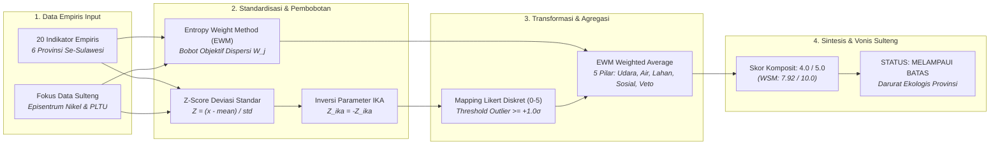
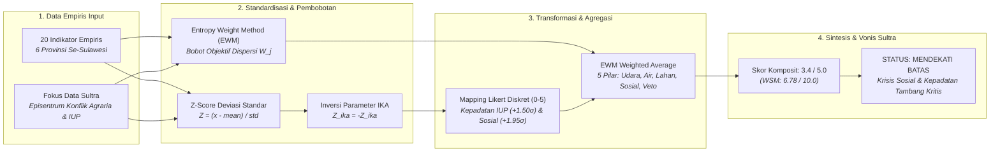

# BAB VI: AUDIT FORENSIK METODOLOGI D3TLH
## SUB-BAB 6.6: ALGORITMA SKORING TINGKAT PROVINSI (MODEL HYBRID Z-SCORE & EWM)

### 6.6.1 Evaluasi Forensik D3TLH: Provinsi Sulawesi Tengah (Sulteng)
> **PROFIL BIOREGION: Provinsi Sulawesi Tengah (Episentrum Hilirisasi & PLTU Captive)**  
> Data empiris: Gabungan sensor satelit NASA TROPOMI NO2, Global Energy Monitor (GEM 2023), Rekam Medis Kemenkes (ISPA & Diare), Laporan Kinerja KLHK (Limbah B3 & Tailing), Global Forest Watch (Deforestasi & Emisi Karbon), BNPB (Bencana Alam), KPA & TanahKita (Konflik Agraria & Kriminalisasi), serta Minerba ESDM (IUP Nikel & Obral Izin). Diolah menggunakan model hybrid Z-Score Anomali Deviasi Standar dan Entropy Weight Method (EWM) sesuai antarmuka Dashboard Streamlit Tab 3 (Bedah Matematika Z-Score + EWM per Provinsi).

#### A. Pengantar & Kerangka Narasi
Sebagaimana ditampilkan pada antarmuka Streamlit **Dashboard Page 6 (Audit D3TLH - Tab Bedah Matematika Z-Score + EWM per Provinsi)**, evaluasi daya dukung dan daya tampung lingkungan hidup tingkat provinsi dirancang untuk membongkar kelemahan metodologi pemerintah yang kerap mengaburkan krisis lokal melalui teknik perataan wilayah (dilution effect). Analisis forensik membuktikan bahwa **Provinsi Sulawesi Tengah berada pada status RED ALERT (Skor Komposit 4.0 / 5.0 - Melampaui Batas)**, di mana beban pencemaran udara, limbah B3, tailing, dan deforestasi primer telah melampaui batas lentur ekologis.

#### B. Alur Logika Metodologis Skoring Tingkat Provinsi (Flowchart Sulteng)


#### C. Formulasi Matematis & Definisi Variabel
```text
1. Z-Score Standard: Z_ij = (x_ij - mean(x_j)) / std(x_j)  |  Khusus IKA: Z_ika = - (ika_i - mean(ika)) / std(ika)
2. Min-Max Normalisasi: r_ij = (x_ij - min(x_j)) / (max(x_j) - min(x_j))
3. Proporsi Probabilitas: P_ij = r_ij / SUM(r_ij)
4. Entropi Informasi: E_j = - (1 / ln(n)) * SUM(P_ij * ln(P_ij + eps))
5. Koefisien Dispersi: D_j = 1 - E_j  -->  Bobot EWM: W_j = D_j / SUM(D_j)
6. Mapping Likert: Z >= 1.0 -> 5.0 ; 0.5 <= Z < 1.0 -> 4.0 ; 0.0 <= Z < 0.5 -> 3.0 ; -0.5 <= Z < 0.0 -> 2.0 ; -1.0 <= Z < -0.5 -> 1.0 ; Z < -1.0 -> 0.0
7. Agregasi Komposit Sulteng: (Udara + Air + Lahan + Sosial + Veto) / 5.0 = 4.0 / 5 (WSM: 7.92 / 10.0)
```

#### D. Matriks Hasil Uji Empiris (Sulteng)
##### Tabel 6.12: Bedah Matematika 20 Indikator Empiris Provinsi Sulawesi Tengah (Model Hybrid Z-Score & EWM)
| Pilar | Indikator Empiris | Fakta Mentah (A) | Rata-rata (B) | Deviasi (C) | Z-Score | Bobot EWM | Likert | Status Ekologis |
| :---: | :--- | :---: | :---: | :---: | :---: | :---: | :---: | :--- |
| Pilar Udara | Kapasitas PLTU Captive Beroperasi | 7,325 MW | 1,638 | 2,882 | +1.97 | 0.0773 | 5.0 / 5 | Melampaui Batas |
| Pilar Udara | Konsentrasi Gas NO2 Troposferik Satelit | 6.50e-06 | 5.56e-06 | 1.29e-06 | +0.73 | 0.0224 | 4.0 / 5 | Melampaui Batas |
| Pilar Udara | Morbiditas ISPA (Incidence Rate Ratio) | 3.50x | 1.41x | 1.26x | +1.66 | 0.0461 | 5.0 / 5 | Melampaui Batas |
| Pilar Udara | Proporsi Timbulan Limbah B3 Industri | 25.30 Jt Ton | 5.47 | 10.04 | +1.97 | 0.0829 | 5.0 / 5 | Melampaui Batas |
| Pilar Udara | Pelepasan Emisi Karbon Deforestasi GFW | 291.34 Jt Ton CO2e | 134.01 | 93.99 | +1.67 | 0.0395 | 5.0 / 5 | Melampaui Batas |
| Pilar Air | Indeks Kualitas Air (IKA) Terkini | 62.1 Poin | 59.7 | 3.4 | -0.70 | 0.0262 | 1.0 / 5 | Tidak Melampaui Batas |
| Pilar Air | Morbiditas Diare (Incidence Rate Ratio) | 1.52x | 1.04x | 0.36x | +1.34 | 0.0164 | 5.0 / 5 | Melampaui Batas |
| Pilar Air | Konflik Ruang Laut Nelayan vs Tambang | 1 Kasus | 2.5 | 2.9 | -0.52 | 0.0442 | 1.0 / 5 | Tidak Melampaui Batas |
| Pilar Air | Akumulasi Beban Tailing, Slag & DSTP | 24.50 Jt Ton | 5.34 | 9.73 | +1.97 | 0.0822 | 5.0 / 5 | Melampaui Batas |
| Pilar Lahan | Bencana Hidrometeorologi (Banjir & Longsor) | 458 Kejadian | 268.2 | 246.6 | +0.77 | 0.0271 | 4.0 / 5 | Melampaui Batas |
| Pilar Lahan | Deforestasi Hutan Alam Primer GFW | 481,908 Ha | 231,009 | 159,368 | +1.57 | 0.0346 | 5.0 / 5 | Melampaui Batas |
| Pilar Lahan | Perambahan Tambang di Kawasan Hutan Lindung | 19,804 Ha | 6,964 | 6,775 | +1.89 | 0.0392 | 5.0 / 5 | Melampaui Batas |
| Pilar Lahan | Aktor Deforestasi Komoditas Tambang & Sawit | 383,304 Ha | 166,942 | 128,370 | +1.69 | 0.0361 | 5.0 / 5 | Melampaui Batas |
| Pilar Lahan | Kepadatan Konsesi IUP Nikel vs Daratan | 7.33% | 5.08% | 4.43% | +0.51 | 0.0320 | 4.0 / 5 | Melampaui Batas |
| Pilar Sosial | Manipulasi Persetujuan Konsultasi Warga (FPIC) | 1 Kasus | 1.3 | 2.0 | -0.17 | 0.0635 | 2.0 / 5 | Tidak Melampaui Batas |
| Pilar Sosial | Korban Perampasan Ruang Hidup & Krisis Agraria | 12,231 Jiwa | 9,052 | 15,804 | +0.20 | 0.0781 | 3.0 / 5 | Mendekati Batas |
| Pilar Sosial | Insiden Kriminalisasi Warga & Pembela HAM | 6 Insiden | 3.5 | 3.5 | +0.71 | 0.0331 | 4.0 / 5 | Melampaui Batas |
| Pilar Sosial | Defisit Kelayakan Standar Faskes SPA | 2.4 % Gap | 9.6 | 10.5 | -0.68 | 0.0430 | 1.0 / 5 | Tidak Melampaui Batas |
| Pilar Veto | Penerbitan Obral Konsesi WIUP Baru Pasca-2014 | 260 Izin | 95.7 | 100.3 | +1.64 | 0.0415 | 5.0 / 5 | Melampaui Batas |
| Pilar Veto | Korporat Tambang Pelanggar Hukum Beroperasi Ilegal | 3 Korporasi | 2.7 | 3.7 | +0.09 | 0.0473 | 3.0 / 5 | Mendekati Batas |

##### Tabel 6.13: Rekapitulasi Skor 5 Pilar & Status Ekologis Komposit Provinsi Sulawesi Tengah
| Pilar / Dimensi | Cakupan Indikator Kunci | Skor Likert Pilar (0-5) | Status Ekologis | Interpretasi Temuan Lapangan Sulteng |
| :---: | :--- | :---: | :---: | :---: |
| Pilar 1: Udara | PLTU (7.325 MW), NO2 (6.5e-6), ISPA (3.5x), B3 (25.3 Jt Ton), CO2 (291 Jt Ton) | 4.9 / 5 | Melampaui Batas | Episentrum PLTU Captive Terbesar & Konsentrasi B3 |
| Pilar 2: Air | IKA (62.07), Diare (1.52x), Tailing (24.5 Jt Ton), Logam Cr6+ | 3.3 / 5 | Mendekati Batas | Beban Tailing Raksasa & Morbiditas Pencernaan Tinggi |
| Pilar 3: Lahan | Bencana (458), Deforestasi (481k Ha), Lindung (19.8k Ha), Driver (383k Ha) | 4.7 / 5 | Melampaui Batas | Deforestasi Primer Masif & Perambahan Hutan Lindung |
| Pilar 4: Sosial | FPIC (1 Kasus), Korban (12.231 Jiwa), Kriminalisasi (6 Insiden), Defisit SPA | 2.5 / 5 | Tidak Melampaui Batas | Kriminalisasi Warga Pembela HAM & Defisit Sarana Kesehatan |
| Pilar 5: Veto | Obral Izin (260 IUP Baru), Korporat Ilegal (3 Perusahaan), PLTU Ekspansi | 4.4 / 5 | Melampaui Batas | Kegagalan Pengendalian Izin & Impunitas Pelanggaran |
| SKOR KOMPOSIT SULTENG | Agregasi 5 Pilar EWM Weighted Average (Z-Score Standardization) | 4.0 / 5 | Melampaui Batas | STATUS RED ALERT: DARURAT DAYA DUKUNG LINGKUNGAN |

#### E. Analisis Temuan Empiris (Sulteng)
1. **Daya Tampung Udara (Skor 4.9 / 5 — Melampaui Batas):** Beban PLTU captive batubara 7.325,0 MW (Z = +1.97σ), limbah B3 25,30 Jt Ton (Z = +1.97σ), emisi CO2 291,34 Jt Ton, dan anomali ISPA 3,50x lipat (Z = +1.66σ).
2. **Daya Tampung Air (Skor 3.3 / 5 — Mendekati Batas):** Timbulan tailing/slag 24,50 Jt Ton (Z = +1.97σ) dan morbiditas diare 1,52x lipat (Z = +1.34σ).
3. **Daya Dukung Lahan (Skor 4.7 / 5 — Melampaui Batas):** Deforestasi primer 481.908 Ha (Z = +1.57σ), perambahan hutan lindung 19.804 Ha (Z = +1.89σ), dan 458 kejadian bencana hidrometeorologi.
4. **Daya Dukung Sosial (Skor 2.5 / 5 — Tidak Melampaui Batas):** 12.231 jiwa terdampak konflik agraria dan 6 insiden kriminalisasi pembela HAM.
5. **Veto Kebijakan (Skor 4.4 / 5 — Melampaui Batas):** Obral 260 IUP baru pasca-2014 (Z = +1.64σ) dan impunitas korporat ilegal.
6. **Vonis Komposit Sulteng (Skor 4.0 / 5.0 — Melampaui Batas):** Status **Melampaui Batas** *(STATUS: RED ALERT)* membuktikan keruntuhan daya dukung lingkungan akibat ekspansi smelter nikel.

---

### 6.6.2 Evaluasi Forensik D3TLH: Provinsi Sulawesi Tenggara (Sultra)
> **PROFIL BIOREGION: Provinsi Sulawesi Tenggara (Episentrum Konflik Agraria & Kepadatan IUP Ekstrem)**  
> Data empiris: Sensor satelit NASA NO2, PLTU Captive Morosi & Konawe 1.900 MW, Rekam Medis Diare & ISPA, Limbah B3 & Tailing 6,5 Jt Ton, Deforestasi 337k Ha, 158 Bencana Alam, 39.821 Jiwa Terdampak Konflik Agraria & 5 Kasus FPIC, serta Kepadatan IUP 11,72% Daratan & 160 IUP Baru. Diolah menggunakan model hybrid Z-Score Anomali Deviasi Standar dan Entropy Weight Method (EWM).

#### A. Pengantar & Kerangka Narasi
Berdasarkan hasil pemetaan empiris di antarmuka Streamlit **Dashboard Page 6 (Audit D3TLH - Tab Bedah Matematika Z-Score + EWM per Provinsi)**, Provinsi Sulawesi Tenggara memperlihatkan profil anomali yang sangat kontras dengan Sulawesi Tengah. Sulawesi Tenggara mengalami **ledakan krisis daya dukung sosial, perampasan ruang hidup masyarakat pesisir, dan kepadatan konsesi tambang tertinggi se-Sulawesi**. Konsesi tambang nikel mencaplok **11,72% daratan provinsi (Z = +1.50σ, Likert 5.0)** dan berdampak langsung pada **39.821 jiwa (Z = +1.95σ, Likert 5.0 - Outlier Tertinggi se-Sulawesi)**.

#### B. Alur Logika Metodologis Skoring Tingkat Provinsi (Flowchart Sultra)


#### C. Formulasi Matematis & Definisi Variabel
```text
1. Anomali Z-Score Sultra: Z_sultra,j = (x_sultra,j - mean(x_j)) / std(x_j)
2. Kepadatan IUP Sultra: 11,72% -> Z = +1.50σ (Skor Likert 5.0 - Outlier Ekstrem se-Sulawesi)
3. Korban Jiwa Sultra: 39.821 Jiwa -> Z = +1.95σ (Skor Likert 5.0 - Mencakup 73% Korban se-Sulawesi)
4. Pelanggaran FPIC Sultra: 5 Kasus -> Z = +1.86σ (Skor Likert 5.0 - Tertinggi se-Sulawesi)
5. Skor Komposit Total Sultra: (Udara + Air + Lahan + Sosial + Veto) / 5.0 = 3.4 / 5 (WSM: 6.78 / 10.0)
```

#### D. Matriks Hasil Uji Empiris (Sultra)
##### Tabel 6.14: Bedah Matematika 20 Indikator Empiris Provinsi Sulawesi Tenggara (Model Hybrid Z-Score & EWM)
| Pilar | Indikator Empiris | Fakta Mentah (A) | Rata-rata (B) | Deviasi (C) | Z-Score | Bobot EWM | Likert | Status Ekologis |
| :---: | :--- | :---: | :---: | :---: | :---: | :---: | :---: | :--- |
| Pilar Udara | Kapasitas PLTU Captive Beroperasi | 1,900 MW | 1,638 | 2,882 | +0.09 | 0.0773 | 3.0 / 5 | Mendekati Batas |
| Pilar Udara | Konsentrasi Gas NO2 Troposferik Satelit | 6.62e-06 | 5.56e-06 | 1.29e-06 | +0.82 | 0.0224 | 4.0 / 5 | Melampaui Batas |
| Pilar Udara | Morbiditas ISPA (Incidence Rate Ratio) | 0.91x | 1.41x | 1.26x | -0.39 | 0.0461 | 2.0 / 5 | Tidak Melampaui Batas |
| Pilar Udara | Proporsi Timbulan Limbah B3 Industri | 6.52 Jt Ton | 5.47 | 10.04 | +0.10 | 0.0829 | 3.0 / 5 | Mendekati Batas |
| Pilar Udara | Pelepasan Emisi Karbon Deforestasi GFW | 189.02 Jt Ton CO2e | 134.01 | 93.99 | +0.59 | 0.0395 | 4.0 / 5 | Melampaui Batas |
| Pilar Air | Indeks Kualitas Air (IKA) Terkini | 65.3 Poin | 59.7 | 3.4 | -1.66 | 0.0262 | 0.0 / 5 | Tidak Melampaui Batas |
| Pilar Air | Morbiditas Diare (Incidence Rate Ratio) | 1.11x | 1.04x | 0.36x | +0.18 | 0.0164 | 3.0 / 5 | Mendekati Batas |
| Pilar Air | Konflik Ruang Laut Nelayan vs Tambang | 5 Kasus | 2.5 | 2.9 | +0.87 | 0.0442 | 4.0 / 5 | Melampaui Batas |
| Pilar Air | Akumulasi Beban Tailing, Slag & DSTP | 6.52 Jt Ton | 5.34 | 9.73 | +0.12 | 0.0822 | 3.0 / 5 | Mendekati Batas |
| Pilar Lahan | Bencana Hidrometeorologi (Banjir & Longsor) | 158 Kejadian | 268.2 | 246.6 | -0.45 | 0.0271 | 2.0 / 5 | Tidak Melampaui Batas |
| Pilar Lahan | Deforestasi Hutan Alam Primer GFW | 337,434 Ha | 231,009 | 159,368 | +0.67 | 0.0346 | 4.0 / 5 | Melampaui Batas |
| Pilar Lahan | Perambahan Tambang di Kawasan Hutan Lindung | 8,236 Ha | 6,964 | 6,775 | +0.19 | 0.0392 | 3.0 / 5 | Mendekati Batas |
| Pilar Lahan | Aktor Deforestasi Komoditas Tambang & Sawit | 243,001 Ha | 166,942 | 128,370 | +0.59 | 0.0361 | 4.0 / 5 | Melampaui Batas |
| Pilar Lahan | Kepadatan Konsesi IUP Nikel vs Daratan | 11.72% | 5.08% | 4.43% | +1.50 | 0.0320 | 5.0 / 5 | Melampaui Batas |
| Pilar Sosial | Manipulasi Persetujuan Konsultasi Warga (FPIC) | 5 Kasus | 1.3 | 2.0 | +1.86 | 0.0635 | 5.0 / 5 | Melampaui Batas |
| Pilar Sosial | Korban Perampasan Ruang Hidup & Krisis Agraria | 39,821 Jiwa | 9,052 | 15,804 | +1.95 | 0.0781 | 5.0 / 5 | Melampaui Batas |
| Pilar Sosial | Insiden Kriminalisasi Warga & Pembela HAM | 4 Insiden | 3.5 | 3.5 | +0.14 | 0.0331 | 3.0 / 5 | Mendekati Batas |
| Pilar Sosial | Defisit Kelayakan Standar Faskes SPA | 17.9 % Gap | 9.6 | 10.5 | +0.79 | 0.0430 | 4.0 / 5 | Melampaui Batas |
| Pilar Veto | Penerbitan Obral Konsesi WIUP Baru Pasca-2014 | 160 Izin | 95.7 | 100.3 | +0.64 | 0.0415 | 4.0 / 5 | Melampaui Batas |
| Pilar Veto | Korporat Tambang Pelanggar Hukum Beroperasi Ilegal | 1 Korporasi | 2.7 | 3.7 | -0.45 | 0.0473 | 2.0 / 5 | Tidak Melampaui Batas |

##### Tabel 6.15: Rekapitulasi Skor 5 Pilar & Status Ekologis Komposit Provinsi Sulawesi Tenggara
| Pilar / Dimensi | Cakupan Indikator Kunci | Skor Likert Pilar (0-5) | Status Ekologis | Interpretasi Temuan Lapangan Sultra |
| :---: | :--- | :---: | :---: | :---: |
| Pilar 1: Udara | PLTU (1.900 MW), NO2 (6.6e-6), ISPA (0.91x), B3 (6.5 Jt Ton), CO2 (189 Jt Ton) | 3.1 / 5 | Mendekati Batas | Emisi Smelter Morosi/VDNI & Peningkatan NO2 Satelit |
| Pilar 2: Air | IKA (65.32), Diare (1.11x), Tailing (6.5 Jt Ton), Konflik Pesisir (5 Kasus) | 2.8 / 5 | Mendekati Batas | Sedimentasi Tailing Pesisir & Konflik Ruang Tangkap Nelayan |
| Pilar 3: Lahan | Bencana (158), Deforestasi (337k Ha), Lindung (8.2k Ha), Kepadatan IUP (11.72%) | 3.6 / 5 | Melampaui Batas | Outlier Kepadatan Konsesi Tambang Nikel Terpadat Se-Sulawesi |
| Pilar 4: Sosial | FPIC (5 Kasus), Korban (39.821 Jiwa), Kriminalisasi (4 Insiden), Gap SPA (17.9%) | 4.5 / 5 | Melampaui Batas | Krisis Kemanusiaan & Perampasan Ruang Hidup Terparah Se-Sulawesi |
| Pilar 5: Veto | Obral Izin (160 IUP Baru), Korporat Ilegal (1 Perusahaan), Ekspansi Smelter | 3.0 / 5 | Mendekati Batas | Obral Izin Tambang Nikel Baru Pasca-2014 di Pesisir & Pulau |
| SKOR KOMPOSIT SULTRA | Agregasi 5 Pilar EWM Weighted Average (Z-Score Standardization) | 3.4 / 5 | Mendekati Batas | STATUS AMBANG BATAS: KRISIS RUANG HIDUP & KEPADATAN IUP |

#### E. Analisis Temuan Empiris (Sultra)
1. **Daya Tampung Udara (Skor 3.1 / 5 — Mendekati Batas):** Kapasitas 1.900 MW PLTU captive (Morosi/Konawe), emisi karbon 189,02 Jt Ton CO2e (Z = +0.59σ), dan NO2 satelit 6,62e-06 mol/m².
2. **Daya Tampung Air (Skor 2.8 / 5 — Mendekati Batas):** IKA 65,32, beban tailing 6,52 Jt Ton, dan meletusnya 5 kasus konflik ruang tangkap laut nelayan vs tongkang nikel (Z = +0.87σ, Likert 4.0).
3. **Daya Dukung Lahan (Skor 3.6 / 5 — Melampaui Batas):** Kepadatan Konsesi IUP mencapai 11,72% daratan provinsi (Z = +1.50σ, Likert 5.0 - Outlier Ekstrem Se-Sulawesi) yang menggerus 337.434 Ha hutan alam primer.
4. **Daya Dukung Sosial (Skor 4.5 / 5 — Melampaui Batas):** Krisis sosial terparah se-Sulawesi dengan 39.821 jiwa warga terancam kehilangan ruang hidup (Z = +1.95σ, Likert 5.0), 5 kasus manipulasi persetujuan FPIC (Z = +1.86σ, Likert 5.0), dan defisit SPA 17,92%.
5. **Veto Kebijakan (Skor 3.0 / 5 — Mendekati Batas):** Obral 160 IUP baru pasca-2014 (Z = +0.64σ, Likert 4.0).
6. **Vonis Komposit Sulawesi Tenggara (Skor 3.4 / 5.0 — Mendekati Batas):** Status **Mendekati Batas**, dengan catatan kritis bahwa Pilar Sosial (4.5 / 5) dan Kepadatan Konsesi Tambang (11,72%) telah berada pada status **Melampaui Batas Ekstrem** *(RED ALERT)*.
