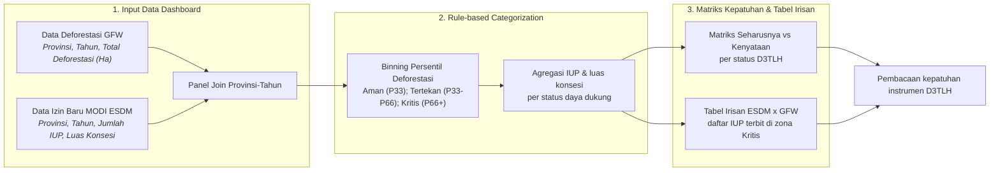
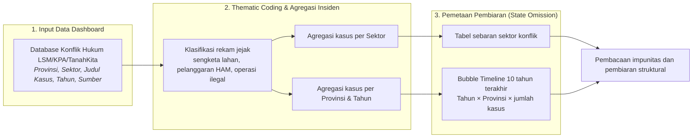
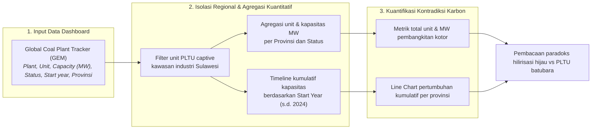

# BAB VII: METODOLOGI ANALISIS KEGAGALAN TATA KELOLA - D3TLH DALAM SISTEM PERIZINAN

Dokumen laporan metodologi ini menyajikan kerangka ilmiah, prosedur pengolahan data, dan pembacaan empiris yang dioperasionalkan pada **Bab 7: Kegagalan Tata Kelola - D3TLH Dalam Sistem Perizinan**.

## 7.1 Pembuktian Empiris: Status Ekologis vs Penerbitan Izin

> **Sumber Data Resmi & Deskripsi Visualisasi:** Data Izin: `data/processed/sulawesi_izin_baru_per_tahun.csv` dan `data/processed/sulawesi_izin_raw_details.csv` (MODI ESDM); Data Deforestasi: `data/processed/sulawesi_gfw_master_1_dekade_2014_2023_v3.csv` (GFW). Visualisasi dashboard menampilkan Matriks Kepatuhan D3TLH (Seharusnya vs Kenyataan per status Aman/Tertekan/Kritis) beserta Tabel Irisan daftar perusahaan penerima izin di zona kritis.

#### A. Pengantar & Kerangka Narasi
D3TLH dirancang sebagai instrumen pencegahan dan pengatur batas pengaman ekologis (*ecological safeguard*). Penyandingan data deforestasi tahunan GFW dan data perizinan MODI ESDM menunjukkan bahwa penerbitan izin usaha pertambangan baru tetap tercatat pada kurun waktu ketika perubahan tutupan hutan meningkat — terlihat pada tren Sulawesi Tengah dan Tenggara 2014-2023. Kondisi ini menggarisbawahi pentingnya penguatan fungsi AMDAL, D3TLH, dan KLHS sebagai pertimbangan yang mengikat dalam keputusan perizinan.

#### B. Alur Logika Metodologis Evaluasi Kepatuhan D3TLH (Rule-based Categorization)
Kerangka agregasi berbasis aturan diilustrasikan pada **Bagan Alur 7.1** berikut. Sub-bab ini tidak menggunakan uji inferensial Chi-Square, melainkan Compliance Modeling deskriptif dengan binning persentil tiga kelas.

##### Bagan Alur 7.1: Alur Logika Analisis Evaluasi Kepatuhan D3TLH (Rule-based Categorization)


#### C. Formulasi Matematis: Ambang Persentil, Klasifikasi Status, dan Kuantifikasi Pelanggaran
Kuantifikasi status daya dukung dan pelanggaran ekologis dihitung menggunakan sistem formulasi matematis berikut:

```text
Ambang_Tertekan = Persentil_33 ( D_p,t )   ;   Ambang_Kritis = Persentil_66 ( D_p,t )
Status(x) = 'Aman' , jika x ≤ P33   |   'Tertekan' , jika P33 < x ≤ P66   |   'Kritis' , jika x > P66
Total_Izin_Zona_Kritis = Σ ( IUP_p,t )   ;   untuk seluruh observasi dengan Status = 'Kritis'
```

Substitusi angka dari dataset aktual ke dalam rumus ambang persentil dan kuantifikasi pelanggaran:

```text
Ambang_Tertekan = Persentil_33 ( D ) = 12,897.8 Ha   ;   Ambang_Kritis = Persentil_66 ( D ) = 26,453.0 Ha
N_Aman = 20 observasi   ;   N_Tertekan = 19 observasi   ;   N_Kritis = 21 observasi   (Total N = 60)
Σ IUP_Aman = 26 izin   ;   Σ IUP_Tertekan = 77 izin   ;   Σ IUP_Kritis = 277 izin (440,998 Ha)
```

#### D. Matriks Hasil Uji Empiris
##### Tabel 7.1: Matriks Kepatuhan D3TLH - Seharusnya vs Kenyataan per Status Daya Dukung
| Status Daya Dukung | Rentang Kerusakan Hutan | N Observasi | Seharusnya (Menurut Aturan) | Kenyataan di Lapangan | Total Luas Konsesi (Ha) | Kesimpulan Tata Kelola |
| :--- | :--- | :--- | :--- | :--- | :--- | :--- |
| Aman | 2,690 - 12,382 Ha | 20 | Wajar diterbitkan izin | 26 Izin Baru Keluar | 87,070 | Normal (Sesuai Aturan) |
| Tertekan | 13,479 - 25,302 Ha | 19 | Izin mulai direm/dibatasi | 77 Izin Baru Keluar | 107,377 | Anomali (Lampu Kuning) |
| Kritis | 26,526 - 97,091 Ha | 21 | Moratorium / Evaluasi Ketat | 277 Izin Baru Keluar | 440,998 | PERLU EVALUASI |

##### Tabel 7.2: Sampel Irisan Izin IUP Terbit di Zona Kritis - 10 Konsesi Terluas (dari 277 izin)
| Nama Perusahaan (IUP) | Komoditas | Provinsi | Tahun Terbit | Kehilangan Hutan Provinsi (Ha) | Luas Konsesi (Ha) |
| :--- | :--- | :--- | :--- | :--- | :--- |
| CITRA PALU MINERALS | Emas | Sulawesi Tengah | 2017 | 39,356 | 85,180.00 |
| GORONTALO MINERALS | Emas | Sulawesi Selatan | 2019 | 29,367 | 24,995.00 |
| SULAWESI CAHAYA MINERAL | Nikel | Sulawesi Tenggara | 2019 | 41,994 | 21,100.00 |
| TRIO KENCANA | Emas | Sulawesi Tengah | 2020 | 28,365 | 15,725.00 |
| KALLA AREBAMMA | Emas | Sulawesi Selatan | 2017 | 27,761 | 12,010.00 |
| BUMI INDAH SULTRA | Nikel | Sulawesi Tengah | 2020 | 28,365 | 8,034.00 |
| BANGGAI KENCANA PERMAI | Nikel | Sulawesi Tengah | 2022 | 26,526 | 7,878.00 |
| ARTESIS INDONESIA | Tembaga | Sulawesi Selatan | 2017 | 27,761 | 7,614.00 |
| KALLA AREBAMMA | Besi | Sulawesi Selatan | 2017 | 27,761 | 6,812.00 |
| PARAMOS REZEKI INDAH | Nikel | Sulawesi Selatan | 2023 | 41,356 | 6,639.00 |

#### E. Analisis Temuan Empiris: Konklusi Kepatuhan D3TLH Berdasarkan Data Historis
1. **Fungsi Pembatas D3TLH Perlu Ditingkatkan:** terdapat **277 Izin Baru** yang terbit pada periode berstatus deforestasi tinggi (Kritis), mencakup luasan konsesi 440,998 Ha. Apabila pada status Kritis izin masih diterbitkan, hal tersebut secara matematis mendiskualifikasi D3TLH sebagai instrumen perlindungan lingkungan.
2. **Bukti Irisan 100% Data-Driven:** tabel irisan ESDM x GFW mengidentifikasi **277 izin IUP baru** (total luas 440,998 Ha) yang tetap diterbitkan di tengah situasi kritis pada pasangan Provinsi-Tahun yang sama.
3. **Implikasi Kebijakan:** diperlukan penguatan integrasi data lingkungan dalam keputusan perizinan agar dokumen AMDAL, D3TLH, dan KLHS menjadi pertimbangan utama yang mengikat.

## 7.2 Tabrakan Hukum: Impunitas dan Pembiaran Operasi Ilegal

> **Sumber Data Resmi & Deskripsi Visualisasi:** Data Konflik Hukum: `data/processed/sulawesi_konflik_hukum.csv` (kompilasi Konsorsium Pembaruan Agraria / KPA, TanahKita, dan laporan LSM). Visualisasi dashboard menampilkan metrik total kasus, Bubble Timeline sebaran konflik agraria 10 tahun terakhir (Tahun × Provinsi), tabel sebaran sektor konflik, serta daftar rekam jejak kasus.

#### A. Pengantar & Kerangka Narasi
Konsep D3TLH mengukur kapasitas daya tahan ekosistem serta daya dukung sosial masyarakat di sekitar kawasan industri. Kompilasi laporan masyarakat sipil mencatat adanya sengketa tanah dan dinamika sosial dalam ekspansi industri ekstraktif — menunjukkan pentingnya kepatuhan perizinan, penerapan sanksi administratif yang konsisten, pengawasan batas wilayah perizinan (HGU/IUP), pelaksanaan konsultasi publik (FPIC), serta penyelesaian sengketa tenurial secara adil.

#### B. Alur Logika Metodologis Pemetaan Impunitas Korporasi (Thematic Coding)
Kerangka agregasi pelaporan berbasis insiden (*Incident-based Reporting Aggregation*) diilustrasikan pada **Bagan Alur 7.2** berikut. Sub-bab ini tidak menggunakan uji inferensial Chi-Square, melainkan Thematic Coding dan analisis kasus deskriptif.

##### Bagan Alur 7.2: Alur Logika Analisis Pemetaan Impunitas Korporasi (Thematic Coding)


#### C. Formulasi Matematis: Agregasi Insiden dan Volume Pembiaran Sektoral
Kuantifikasi tingkat pembiaran penegakan hukum dihitung menggunakan sistem formulasi matematis berikut:

```text
Total_Kasus_Impunitas = Σ ( Kasus_i )   ;   untuk seluruh laporan insiden i dalam database
Volume_Sektoral_s = Σ ( Kasus_i )   ;   untuk seluruh kasus i dengan Sektor = s
Proporsi_Sektoral_s (%) = ( Volume_Sektoral_s / Total_Kasus_Impunitas ) × 100
```

Substitusi angka dari dataset aktual ke dalam rumus agregasi insiden:

```text
Total_Kasus_Impunitas = 32 kasus   ;   17 kasus pada dekade 2014-2023
Volume_Sektoral_Pertambangan = 11 kasus (34.4%)   ;   Volume_Sektoral_Perkebunan = 6 kasus
Volume_Provinsi_Tertinggi: Sulawesi Tenggara = 8 kasus (dari total 32 kasus se-Sulawesi)
```

#### D. Matriks Hasil Uji Empiris
##### Tabel 7.3: Sebaran Sektor Konflik dan Pembiaran Operasi Ilegal
| Sektor (Penyebab) | Jumlah Kasus | Proporsi (%) |
| :--- | :--- | :--- |
| Pertambangan | 11 | 34.4% |
| Perkebunan | 6 | 18.8% |
| Hutan Lindung | 5 | 15.6% |
| Hutan Produksi | 3 | 9.4% |
| Hutan Konservasi | 2 | 6.2% |
| Kawasan Industri | 1 | 3.1% |
| Infrastruktur Energi Listrik | 1 | 3.1% |
| Infrastruktur | 1 | 3.1% |
| Transmigrasi | 1 | 3.1% |
| Pariwisata | 1 | 3.1% |

##### Tabel 7.4: Sebaran Wilayah Konflik per Provinsi dan Rentang Tahun Kejadian
| Provinsi | Jumlah Kasus | Proporsi (%) | Rentang Tahun |
| :--- | :--- | :--- | :--- |
| Sulawesi Tenggara | 8 | 25.0% | 1999-2023 |
| Sulawesi Selatan | 7 | 21.9% | 1982-2017 |
| Sulawesi Utara | 6 | 18.8% | 1999-2023 |
| Sulawesi Tengah | 5 | 15.6% | 2011-2023 |
| Sulawesi (Umum) | 4 | 12.5% | 2003-2017 |
| Gorontalo | 2 | 6.2% | 2012-2018 |

##### Tabel 7.5: Sampel Rekam Jejak Konflik Agraria & Pelanggaran Hak (10 Kasus Terbaru)
| Tahun | Provinsi | Sektor | Judul/Nama Kasus | Sumber |
| :--- | :--- | :--- | :--- | :--- |
| 2023 | Sulawesi Tengah | Perkebunan | Dua kelompok Warga di Kabupaten Mamuju Tengah (Mateng), Sulawesi Barat (Sulbar) bentrok lantaran memperebutkan lahan sawit. Insiden itu menewaskan 1 orang dan 4 lainnya luka-luka. | data/raw/konflik_kpa_ylbhi_tanahkita/ |
| 2023 | Sulawesi Utara | Infrastruktur | Ganti Rugi Belum Dibayar, Warga Kembali Blokir Akses Masuk Tol Jatikarya | data/raw/konflik_kpa_ylbhi_tanahkita/ |
| 2023 | Sulawesi Tengah | Perkebunan | Sengketa Lahan Masyarakat Morowali Utara dengan PT Agro Nusa Abadi (ANA) | data/raw/konflik_kpa_ylbhi_tanahkita/ |
| 2023 | Sulawesi Tenggara | Pertambangan | Konflik Rumpun Suka Kecamatan Tinanggea dan Perusahaan Pertambangan PT Ifishdeco | data/raw/konflik_kpa_ylbhi_tanahkita/ |
| 2022 | Sulawesi Utara | Infrastruktur Energi Listrik | Pembangunan Proyek Strategis Nasional (PSN) proyek PLTU Gorontalo Utara yang dibangun Pt.Gorontalo Listrik Perdana (GLP) masih menyisakan masalah sengketa lahan | data/raw/konflik_kpa_ylbhi_tanahkita/ |
| 2022 | Sulawesi Tenggara | Pertambangan | Orang Wawoni dan Ancaman Tambang Nikel | data/raw/konflik_kpa_ylbhi_tanahkita/ |
| 2022 | Sulawesi Tenggara | Pertambangan | Konflik Koalisi Selamatkan Pulau Wawoni | data/raw/konflik_kpa_ylbhi_tanahkita/ |
| 2021 | Sulawesi Tengah | Hutan Lindung | Konflik Tenurial di Kawasan Suaka Margasatwa Karang Gading | data/raw/konflik_kpa_ylbhi_tanahkita/ |
| 2019 | Sulawesi Tenggara | Pertambangan | Konflik antara warga Kabupaten Konawe Kepulauan dengan PT Gema Kreasi Persada, pertambangan | data/raw/konflik_kpa_ylbhi_tanahkita/ |
| 2018 | Gorontalo | Hutan Produksi | Warga Desa Bongo dan PT PG Gorontalo Berebut Lahan | data/raw/konflik_kpa_ylbhi_tanahkita/ |

#### E. Analisis Temuan Empiris: Impunitas dan Pembiaran Struktural
1. **Bukti Impunitas Hukum:** database kompilasi LSM/KPA mendokumentasikan **32 kasus** konflik/pelanggaran yang dibiarkan di Sulawesi (17 kasus pada dekade 2014-2023), di mana korporasi yang terbukti bermasalah secara hukum tetap dipertahankan keberadaan operasinya.
2. **Dominasi Sektor Ekstraktif:** sektor **Pertambangan** menjadi penyebab konflik terbanyak dengan 11 kasus (34.4%), disusul Perkebunan (6 kasus) — konsisten dengan pola tekanan ekspansi industri ekstraktif pada bab-bab sebelumnya.
3. **Konsentrasi Spasial:** provinsi **Sulawesi Tenggara** mencatat kasus terbanyak (8 kasus) — menegaskan pentingnya penguatan koordinasi antar-instansi, penegakan sanksi administratif yang konsisten, serta penyelesaian sengketa tenurial secara adil.

## 7.3 Inkonsistensi Iklim: Karpet Merah PLTU Captive

> **Sumber Data Resmi & Deskripsi Visualisasi:** Data PLTU Captive: `data/processed/sulawesi_pltu_captive.csv` (Global Coal Plant Tracker / GEM, ekstraksi Januari 2026). Visualisasi dashboard menampilkan metrik total unit dan kapasitas pembangkitan kotor, Line Chart timeline pertumbuhan kapasitas kumulatif per provinsi hingga 2024, serta daftar lengkap unit PLTU batubara captive.

#### A. Pengantar & Kerangka Narasi
Pemenuhan kebutuhan energi untuk fasilitas pengolahan nikel (*smelter*) di Sulawesi masih didominasi oleh PLTU Batubara *Captive*. Data GEM mencatat **67 unit PLTU Captive** yang beroperasi maupun direncanakan di kawasan industri Sulawesi dengan total kapasitas **12,245 MW** — tantangan tersendiri bagi pengelolaan emisi gas rumah kaca dan kualitas udara ambien, yang menunjukkan perlunya percepatan transisi energi bersih agar target hilirisasi selaras dengan komitmen penurunan emisi nasional.

#### B. Alur Logika Metodologis Agregasi Beban Karbon PLTU Captive
Kerangka inventarisasi agregat kuantitatif (*Quantitative Inventory Aggregation*) diilustrasikan pada **Bagan Alur 7.3** berikut. Sub-bab ini tidak menggunakan uji inferensial Chi-Square, melainkan penyaringan agregat dataset eksternal deskriptif.

##### Bagan Alur 7.3: Alur Logika Analisis Agregasi Beban Karbon PLTU Captive (GEM)


#### C. Formulasi Matematis: Inventarisasi Unit, Beban Karbon, dan Timeline Kumulatif
Kuantifikasi kontradiksi karbon dihitung menggunakan sistem formulasi matematis berikut:

```text
Total_Infrastruktur_Kotor = Σ ( Unit_u )   ;   untuk seluruh unit PLTU captive u di kawasan industri Sulawesi
Total_Beban_Karbon_p = Σ ( Kapasitas_u )   ;   untuk seluruh unit u pada provinsi p
Kumulatif_Kapasitas_p(T) = Σ Kapasitas_p(t)   ;   untuk t = tahun operasi awal s.d. T (T ≤ 2024)
```

Substitusi angka dari dataset aktual ke dalam rumus inventarisasi:

```text
Total_Infrastruktur_Kotor = 67 unit   ;   Total_Beban_Karbon = 12,245 MW
Total_Beban_Karbon_Tertinggi: Sulawesi Tengah = 9,365 MW (76.5% dari total)
Operating = 55 unit (9,825 MW)   ;   Non-Operating = 12 unit
```

#### D. Matriks Hasil Uji Empiris
##### Tabel 7.6: Agregat Unit dan Kapasitas PLTU Captive per Provinsi (Total 12,245 MW)
| Provinsi | Jumlah Unit | Kapasitas (MW) | Proporsi (%) |
| :--- | :--- | :--- | :--- |
| Sulawesi Tengah | 44 | 9,365 | 76.5% |
| Sulawesi Tenggara | 13 | 2,280 | 18.6% |
| Sulawesi Selatan | 10 | 600 | 4.9% |

##### Tabel 7.7: Timeline Pertumbuhan Kapasitas Kumulatif PLTU Captive per Provinsi (MW, s.d. 2024)
| Tahun | Sulawesi Selatan | Sulawesi Tengah | Sulawesi Tenggara | Total (MW) |
| :--- | :--- | :--- | :--- | :--- |
| 2013 | 70 | 0 | 0 | 70 |
| 2014 | 70 | 0 | 0 | 70 |
| 2015 | 70 | 130 | 0 | 200 |
| 2016 | 70 | 280 | 60 | 410 |
| 2017 | 70 | 980 | 60 | 1,110 |
| 2018 | 380 | 980 | 60 | 1,420 |
| 2019 | 600 | 1,680 | 60 | 2,340 |
| 2020 | 600 | 2,080 | 465 | 3,145 |
| 2021 | 600 | 2,565 | 1,520 | 4,685 |
| 2022 | 600 | 3,850 | 1,900 | 6,350 |
| 2023 | 600 | 5,885 | 1,900 | 8,385 |
| 2024 | 600 | 7,325 | 1,900 | 9,825 |

##### Tabel 7.8: Sepuluh Unit PLTU Captive Berkapasitas Terbesar di Sulawesi
| Nama Pembangkit | Unit | Provinsi | Kapasitas (MW) | Status | Tahun Beroperasi |
| :--- | :--- | :--- | :--- | :--- | :--- |
| Sulawesi Labota power station | Unit 4 | Sulawesi Tengah | 380 | operating | 2023 |
| Sulawesi Labota power station | Unit 9 | Sulawesi Tengah | 380 | operating | 2024 |
| Sulawesi Labota power station | Unit 8 | Sulawesi Tengah | 380 | operating | 2024 |
| Delong Nickel Phase II power station | Unit 10 | Sulawesi Tenggara | 380 | operating | 2021 |
| Delong Nickel Phase II power station | Unit 11 | Sulawesi Tenggara | 380 | cancelled | Belum Operasi |
| Sulawesi Labota power station | Unit 7 | Sulawesi Tengah | 380 | operating | 2023 |
| Sulawesi Labota power station | Unit 3 | Sulawesi Tengah | 380 | operating | 2023 |
| Sulawesi Labota power station | Unit 5 | Sulawesi Tengah | 380 | operating | 2023 |
| Sulawesi Labota power station | Unit 6 | Sulawesi Tengah | 380 | operating | 2023 |
| Delong Nickel Phase II power station | Unit 09 | Sulawesi Tenggara | 380 | operating | 2022 |

#### E. Analisis Temuan Empiris: Paradoks Hilirisasi Hijau
1. **Skala Infrastruktur Kotor:** GEM mencatat **67 unit** PLTU batubara captive di kawasan industri Sulawesi dengan total kapasitas **12,245 MW** (55 unit beroperasi, 9,825 MW) — pembangkitan masif yang dibangun demi menopang pabrik pemurnian nikel yang dipromosikan sebagai proyek energi ramah lingkungan.
2. **Konsentrasi Beban Karbon:** provinsi **Sulawesi Tengah** menanggung beban karbon terbesar dengan 9,365 MW (76.5% dari total), sejalan dengan konsentrasi kawasan industri hilirisasi.
3. **Implikasi Transisi Energi:** diperlukan strategi percepatan transisi energi bersih di sektor industri ekstraktif guna menyelaraskan target hilirisasi dengan komitmen penurunan emisi nasional.
