# BAB VII: METODOLOGI ANALISIS KEGAGALAN TATA KELOLA — D3TLH DALAM SISTEM PERIZINAN
*Ringkasan Eksekutif Metodologis · Center of Economic and Law Studies (CELIOS)*

---

## A. Desain Penelitian & Tujuan
Penelitian Bab 7 menerapkan **desain audit forensik kepatuhan kebijakan (Compliance & Institutional Failure Audit)** untuk menguji efektivitas instrumen Daya Dukung dan Daya Tampung Lingkungan Hidup (D3TLH) dalam tata kelola perizinan industri ekstraktif di Pulau Sulawesi. Melalui integrasi spasial data perizinan tambang, tutupan hutan, sengketa tenurial, dan infrastruktur energi fosil, kajian ini membuktikan secara empiris tiga kegagalan struktural tata kelola:

1. **Evaluasi Kepatuhan D3TLH vs Penerbitan Izin (Rule-based Categorization):** Menganalisis sinkronisasi antara batas pengaman daya dukung hutan (GFW) dan izin baru pertambangan (MODI ESDM), guna membuktikan apakah instrumen D3TLH berfungsi sebagai pembatas atau diabaikan dalam zona krisis ekologis.
2. **Audit Impunitas Hukum & Pembiaran Korporasi (Thematic Coding):** Menginventarisasi rekam jejak pelanggaran hukum, perampasan ruang hidup, dan sengketa agraria yang dibiarkan tanpa penegakan sanksi administratif maupun pidana lingkungan (*state omission*).
3. **Kuantifikasi Kontradiksi Karbon PLTU Captive (Asset-level Inventory):** Mendokumentasikan paradoks hilirisasi hijau melalui inventarisasi aset 67 unit pembangkit listrik tenaga uap (PLTU) batubara *off-grid* captive yang beroperasi di dalam kawasan industri nikel.

---

## B. Sumber Data & Cakupan Wilayah
Audit tata kelola perizinan ini menggabungkan 4 basis data resmi lintas kementerian dan lembaga masyarakat sipil yang mencakup seluruh yurisdiksi 6 provinsi se-Pulau Sulawesi kurun 2014–2024:

- **MODI Ditjen Minerba ESDM RI:** Data geospasial izin baru pertambangan (IUP), tahun penerbitan, luas konsesi (hektar), dan komoditas tambang aktif.
- **Global Forest Watch (GFW / Hansen UMD):** Time-series deforestasi tahunan tingkat provinsi guna menetapkan ambang persentil daya dukung hutan alam.
- **Konsorsium Pembaruan Agraria (CATAHU KPA), TanahKita, & Koalisi Sipil:** Dokumentasi kasus konflik tenurial, pelanggaran izin di kawasan lindung, kriminalisasi warga, dan impunitas korporasi.
- **Global Energy Monitor (GEM Coal Plant Tracker, Jan 2026):** Inventarisasi aset 67 unit PLTU captive batubara di kawasan industri Morowali, Konawe, Bantaeng, dan sekitarnya.

---

## C. Operasionalisasi Variabel & Indikator Riset
Seluruh parameter tata kelola, pelanggaran batas daya dukung, sengketa tenurial, hingga aset energi fosil dioperasionalkan ke dalam **9 indikator riset empiris kunci** sebagaimana dirangkum pada matriks operasional berikut:

##### Matriks Operasionalisasi Variabel dan Sumber Data Resmi Bab 7 (Tata Kelola Perizinan)
| No | Indikator Riset | Fokus Pengukuran | Satuan | Sumber Data Primer Resmi |
| :-: | :--- | :--- | :-: | :--- |
| 1 | Kepatuhan D3TLH Perizinan (7.1) | Rasio Penerbitan IUP Baru pada Zona Deforestasi Kritis | Unit Izin | MODI ESDM & GFW Hansen |
| 2 | Luas Konsesi Zona Kritis (7.1) | Total Luasan Konsesi Tambang Terbit di Status Kritis | Hektar (Ha) | Ditjen Minerba ESDM & GFW |
| 3 | Ambang Persentil Daya Dukung (7.1) | Klasifikasi Status Hutan: Aman (P33), Tertekan, Kritis (P66) | Hektar / Tahun | GFW Master Time-Series 2014-2023 |
| 4 | Kasus Impunitas Penegakan Hukum (7.2) | Frekuensi Pembiaran Pelanggaran Korporasi Ekstraktif | Kasus | CATAHU KPA, TanahKita, YLBHI |
| 5 | Dominasi Konflik Sektoral (7.2) | Proporsi Sengketa Agraria Akibat Ekspansi Tambang | Persen (%) | Database Kasus Tenurial KPA |
| 6 | Konsentrasi Spasial Sengketa (7.2) | Sebaran Wilayah Konflik Tertinggi Lintas Provinsi | Kasus & % | Laporan Koalisi Sipil & KPA |
| 7 | Agregat Aset PLTU Captive (7.3) | Total Unit & Kapasitas Pembangkitan Kotor Batubara Off-Grid | Unit & Megawatt (MW) | Global Energy Monitor (GEM 2026) |
| 8 | Kapasitas PLTU Captive Aktif (7.3) | Kapasitas Terpasang Unit Batubara Beroperasi (Operating) | Megawatt (MW) | GEM Global Coal Plant Tracker |
| 9 | Dominasi Beban Karbon Spasial (7.3) | Konsentrasi Kapasitas Pembangkitan Fosil per Provinsi | Persen (%) | GEM Asset Inventory Tracker |

---

## D. Kerangka Analisis & Formulasi Matematis

### Sub-bab 7.1: Evaluasi Kepatuhan D3TLH vs Penerbitan Izin Tambang Baru
Penilaian kepatuhan sistem perizinan terhadap batas pengaman lingkungan hidup dilakukan dengan mengelompokkan data deforestasi tahunan ke dalam 3 kelas persentil daya dukung, kemudian menyandingkannya dengan penerbitan IUP baru:

> **1. Penentuan Ambang Batas Daya Dukung (Binning Persentil):**  
> • Ambang Tertekan = Persentil-33 (P33) dari Deforestasi Tahunan = 12.898 Ha/tahun  
> • Ambang Kritis = Persentil-66 (P66) dari Deforestasi Tahunan = 26.453 Ha/tahun  
>  
> **2. Aturan Klasifikasi Status Wilayah:**  
> • **Status Aman:** Kerusakan Hutan ≤ 12.898 Ha/tahun (Izin Wajar Diterbitkan)  
> • **Status Tertekan:** 12.898 Ha < Kerusakan ≤ 26.453 Ha/tahun (Penerbitan Izin Mulai Dibatasi)  
> • **Status Kritis:** Kerusakan Hutan > 26.453 Ha/tahun (Wajib Moratorium Total)  
>  
> **3. Kuantifikasi Pelanggaran Tata Kelola:**  
> `Total Izin Zona Kritis = Jumlah IUP Baru yang Tetap Diterbitkan saat Status Hutan Kritis`  
> *Fakta Empiris Lapangan: Pada saat status hutan dinyatakan KRITIS (> 26.453 Ha deforestasi), pemerintah justru menerbitkan 277 IUP BARU dengan total luas konsesi mencapai 440.998 Hektar (mayoritas di Sulteng dan Sulsel).*

##### Tabel 7.1: Matriks Kepatuhan D3TLH — Seharusnya vs Kenyataan Penerbitan Izin
| Status Daya Dukung | Deforestasi Tahunan | N Observasi | Aturan Seharusnya | Kenyataan di Lapangan | Luas Konsesi (Ha) | Kesimpulan Tata Kelola |
| :---: | :---: | :---: | :--- | :---: | :---: | :---: |
| Aman | <= 12.898 Ha | 20 | Wajar diterbitkan izin | 26 Izin Baru Keluar | 87.070 Ha | Normal (Sesuai Aturan) |
| Tertekan | 12.898 - 26.453 Ha | 19 | Izin mulai dibatasi ketat | 77 Izin Baru Keluar | 107.377 Ha | Anomali (Lampu Kuning) |
| Kritis | > 26.453 Ha | 21 | Moratorium Total / Larangan Izin | 277 Izin Baru Keluar | 440.998 Ha | PELANGGARAN STRUKTURAL |

---

### Sub-bab 7.2: Pemetaan Impunitas Hukum & Pembiaran Kasus Tenurial
Tingkat pembiaran negara (*state omission*) dihitung melalui klasifikasi tematik terhadap seluruh insiden konflik agraria, pelanggaran kawasan lindung, dan intimidasi warga yang terdokumentasi tanpa adanya sanksi hukum tegas:

> **1. Penghitungan Proporsi Konflik Sektoral:**  
> `Proporsi Sektor (%) = (Jumlah Kasus pada Sektor Tertentu / Total Kasus Terdata) × 100%`  
>  
> **2. Identifikasi Wilayah Episentrum Pembiaran:**  
> `Proporsi Wilayah (%) = (Jumlah Kasus di Suatu Provinsi / Total Kasus Terdata) × 100%`  
>  
> *Fakta Empiris: Dari 32 kasus impunitas yang terdata di Sulawesi, Sektor Pertambangan menjadi penyumbang terbesar dengan 11 kasus (34,4%), disusul Perkebunan Sawit 6 kasus (18,8%). Sulawesi Tenggara mencatat kasus terbanyak (8 kasus / 25,0%), disusul Sulawesi Selatan (7 kasus / 21,9%).*

##### Tabel 7.2: Sebaran Sektor Konflik dan Pembiaran Operasi Ilegal di Sulawesi
| Sektor Penyebab Konflik | Jumlah Kasus | Porsi (%) | Wilayah Terdampak Utama |
| :--- | :---: | :---: | :--- |
| Pertambangan (Nikel & Batuan) | 11 Kasus | 34,4% | Sultra, Sulteng, Sulsel |
| Perkebunan Kelapa Sawit | 6 Kasus | 18,8% | Sulbar, Sulteng, Gorontalo |
| Perambahan Hutan Lindung | 5 Kasus | 15,6% | Sulteng, Sultra, Sulut |
| Hutan Produksi & Konservasi | 5 Kasus | 15,6% | Gorontalo, Sulsel |
| Infrastruktur & Kawasan Industri | 5 Kasus | 15,6% | Sulut, Sulteng, Sulsel |
| **TOTAL KESELURUHAN** | **32 Kasus** | **100,0%** | **Pulau Sulawesi** |

---

### Sub-bab 7.3: Inkonsistensi Iklim — Karpet Merah PLTU Batubara Captive
Kontradiksi hilirisasi hijau dihitung dengan menginventarisasi seluruh unit PLTU batubara *off-grid* yang beroperasi khusus melayani pabrik pemurnian nikel, serta melacak timeline penambahan kapasitas kumulatifnya:

> **1. Akumulasi Kapasitas Pembangkit Fosil:**  
> `Total Kapasitas Provinsi = Penjumlahan Seluruh Unit PLTU Captive di Kawasan Industri`  
>  
> **2. Pertumbuhan Kapasitas Kumulatif Tahunan:**  
> `Kapasitas Kumulatif (Tahun T) = Total Kapasitas Seluruh Unit yang Mulai Beroperasi s.d. Tahun T`  
>  
> *Fakta Empiris: Terdata 67 unit PLTU captive batubara dengan total kapasitas 12.245 MW. Sebanyak 55 unit (9.825 MW) telah aktif beroperasi. Sulawesi Tengah menanggung beban terbesar yakni 44 unit (9.365 MW atau 76,5% dari total kapasitas pulau).*

##### Tabel 7.3: Agregat Unit dan Kapasitas PLTU Captive Kawasan Industri per Provinsi
| Provinsi | Total Unit | Kapasitas Total | Sudah Beroperasi | Porsi Beban | Keterangan Kawasan |
| :--- | :---: | :---: | :---: | :---: | :--- |
| Sulawesi Tengah | 44 Unit | 9.365 MW | 7.325 MW | 76,5% | Episentrum Kawasan Industri IMIP Morowali |
| Sulawesi Tenggara | 13 Unit | 2.280 MW | 1.900 MW | 18,6% | Sentra Smelter VDNI/OSS Konawe |
| Sulawesi Selatan | 10 Unit | 600 MW | 600 MW | 4,9% | Kawasan Industri Huadi Bantaeng |
| **TOTAL SULAWESI** | **67 Unit** | **12.245 MW** | **9.825 MW** | **100,0%** | **Paradoks Hilirisasi Bersih** |

---

## E. Korespondensi Metodologi terhadap Sub-bab Laporan Bab 7
Setiap sub-bab analitis pada Bab 7 dibangun menggunakan metodologi evaluasi empiris yang terstandarisasi sebagaimana dirangkum pada tabel berikut:

##### Matriks Korespondensi Metodologis Bab 7
| Sub-bab | Fokus Kajian Empiris | Metode Analitis Utama |
| :-: | :--- | :--- |
| Sub-bab 7.1 | Status Ekologis vs Penerbitan Izin Tambang | Spatial Overlay Panel Join, Persentil Deforestasi Binning, Compliance Audit Modeling |
| Sub-bab 7.2 | Tabrakan Hukum & Impunitas Operasi Ilegal | Incident-based Aggregation, Thematic Coding Kasus Tenurial, Sektoral Disparity Tracking |
| Sub-bab 7.3 | Inkonsistensi Iklim: Karpet Merah PLTU Captive | Quantitative Asset Inventory, Timeline Tracking Kapasitas Kumulatif, Decoupling Contrast Analysis |

---

## F. Bagan Alur Kerangka Kerja Riset (Research Workflow)
Kerangka investigasi forensik tata kelola perizinan dijalankan secara terpadu melalui empat tahapan analisis sebagaimana divisualisasikan pada diagram alur berikut:

```mermaid
flowchart LR
    subgraph F1["Fase I: Input Multi-Domain"]
        A1["Izin MODI ESDM<br/><i>IUP Baru & Luas Konsesi</i>"]
        A2["Hutan GFW Hansen<br/><i>Deforestasi Master 10 Thn</i>"]
        A3["Konflik KPA & TanahKita<br/><i>32 Kasus Tenurial/HAM</i>"]
        A4["Aset GEM Tracker<br/><i>67 Unit PLTU Captive</i>"]
    end
    subgraph F2["Fase II: Pemrosesan Analitis"]
        B1["Binning Persentil<br/><i>P33 Aman vs P66 Kritis</i>"]
        B2["Panel Join Spasial<br/><i>Provinsi x Tahun (GFW-ESDM)</i>"]
        B3["Thematic Coding<br/><i>Sektor & Impunitas Korporasi</i>"]
        B4["Tracking Timeline MW<br/><i>Pertumbuhan 2013-2024</i>"]
    end
    subgraph F3["Fase III: Uji Kepatuhan & Paradoks"]
        C1["Matriks Seharusnya vs Realita<br/><i>277 IUP di Zona Kritis</i>"]
        C2["Volume Pembiaran Sektoral<br/><i>Tambang 34% & Sultra 25%</i>"]
        C3["Konsentrasi Beban Karbon<br/><i>Sulteng 76.5% (9.365 MW)</i>"]
    end
    subgraph F4["Fase IV: Kesimpulan Tata Kelola"]
        D1["Disregard D3TLH<br/><i>Instrumen Lingkungan Diabaikan</i>"]
        D2["State Omission<br/><i>Impunitas Pelanggaran Korporasi</i>"]
        D3["Paradoks Iklim<br/><i>Hilirisasi Bertenaga Batubara</i>"]
    end
    F1 --> F2 --> F3 --> F4
```

> **KESIMPULAN METODOLOGIS BAB 7 (KEGAGALAN TATA KELOLA PERIZINAN):**  
> 1. **Disregard Terhadap D3TLH:** Data membuktikan sebanyak 277 izin tambang baru (luas 440.998 Ha) tetap diterbitkan pada kurun waktu ketika deforestasi provinsi berada pada status Kritis, mengonfirmasi bahwa D3TLH dan AMDAL tidak difungsikan sebagai batas pengaman perizinan.  
> 2. **Pembiaran Hukum (State Omission):** Sebanyak 32 kasus sengketa tenurial dan pelanggaran izin terdata tanpa penegakan sanksi tegas, di mana sektor pertambangan menjadi aktor penyumbang konflik terbesar (34,4%).  
> 3. **Paradoks Transisi Energi:** Ketergantungan terhadap 67 unit PLTU captive batubara (12.245 MW total kapasitas) menegaskan bahwa rantai pasok hilirisasi nikel beroperasi di atas paradoks emisi karbon fosil yang bertolak belakang dengan komitmen iklim nasional.
